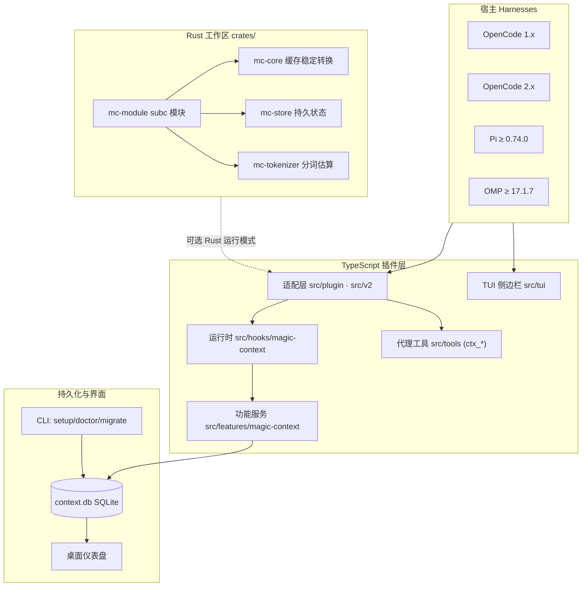
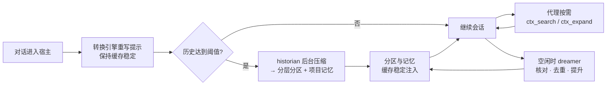

Magic Context 是 CortexKit 家族中的一个插件，被官方定位为编码代理的**海马体（hippocampus）**——大脑中负责形成、巩固与唤回记忆的区域。它要解决的核心痛点，是编码代理的"顺行性遗忘"：每个任务都像一次没有项目记忆的新入职，会话结束时一切归零，中途还会被"压缩（compaction）"暂停打断。本页面向初学者，勾勒 Magic Context 的全貌：它是什么、由哪四大能力支柱构成、代码库如何组织、支持哪些宿主，以及如何继续深入阅读。

Sources: [README.md](README.md#L44-L56), [README.md](README.md#L78-L90)

## 两个承诺与四大能力

Magic Context 的设计围绕两条硬承诺展开：你的代理**永远不会停下来管理上下文**（没有压缩暂停、没有中断的流程），并且它**永远不会忘记**。前者由后台持续运行的上下文转换引擎保障，后者由跨会话的持久记忆体系保障。这两条承诺又拆解为四个相互配合的能力支柱，正好对应它的名字与大脑隐喻。

| 能力支柱 | 英文命名 | 做什么 | 关键工具 |
|---|---|---|---|
| 上下文管理 | Context | 后台 historian 把旧历史压缩成**分层分区（tiered compartments）**，按重要性分级、按确定性规则衰减渲染，全程不破坏提示缓存 | `ctx_reduce` |
| 捕获 | Capture | historian 在压缩时顺带把持久知识（决策、约束、约定、配置值）提升为**项目记忆** | `ctx_memory` |
| 巩固 | Consolidate | 可选的 dreamer 代理在夜间/空闲时核对代码库、去重、提升反复出现的内容 | —（后台任务） |
| 回忆 | Recall | 每轮自动注入相关记忆与压缩历史；代理可按需跨记忆、对话、git 提交检索 | `ctx_search`、`ctx_expand`、`ctx_note` |

这四大支柱共享一个嵌入式 SQLite 数据库，因此记忆可以在 OpenCode、Pi 与 OMP 之间汇集与互通。初学者可以先记住"四根支柱 + 两个承诺"这个总纲，后续页面再逐层展开每个子系统的内部机制。

Sources: [README.md](README.md#L78-L96), [README.md](README.md#L222-L232), [README.md](README.md#L242-L260), [README.md](README.md#L266-L282), [README.md](README.md#L288-L303), [README.md](README.md#L305-L313)

## 架构总览：分层与外部生态

从架构上看，Magic Context 遵循"**薄适配层，真实逻辑分离**"的原则。面向宿主的处理器住在 `src/plugin/`（OpenCode 1 的 `server`）和 `src/v2/`（OpenCode 2 的 `setup` 通道，复用同一套转换核心）；功能逻辑则分居 `src/hooks/magic-context/`（运行时）、`src/features/magic-context/`（服务）和 `src/tools/`（代理工具）。转换本身**不做任何 LLM 调用**，重活交给隐藏子代理（`historian`、`historian-editor`、`dreamer`）在带外完成。

下图勾勒了各层与外部组件的关系。请先注意三个前置概念：**宿主（harness）**指真正驱动编码代理的程序（OpenCode / Pi / OMP）；**转换（transform）**指每次 LLM 调用前对消息数组与系统提示的重写；**subc** 是 CortexKit 的守护进程，Rust 模块在其中运行。



Rust 工作区提供一条**可选的运行模式**：由 `transform_mode: "rust"` 门控，把整个转换管线经由 ck-mc Rust 模块走 `subc` 守护进程执行，TypeScript 层退化为协调器，负责状态同步、序号追踪与 Last Known Good（LKG）回退。默认情况下，转换由 TypeScript 实现。

Sources: [ARCHITECTURE.md](ARCHITECTURE.md#L5-L14), [ARCHITECTURE.md](ARCHITECTURE.md#L16-L28), [Cargo.toml](Cargo.toml#L1-L6), [STRUCTURE.md](STRUCTURE.md#L40-L44)

## 项目结构：一个单仓多包工作区

仓库采用**单仓多包（monorepo）**布局，同时容纳 TypeScript 包（`packages/`）与 Rust crate（`crates/`）。根目录的 `package.json` 用 Bun 的 workspaces 管理前端包，`Cargo.toml` 则定义了一个以 `subc` 守护进程为运行目标的 Rust 工作区。这种布局的动机是：会话与工具链都绑定当前工作目录，而构建过程需要本仓库的缓存稳定性上下文。

```text
magic-context/
├── crates/                 # 宿主无关的 Rust 工作区（在 subc 守护进程下运行）
│   ├── mc-core/            # 缓存稳定核心转换与分类
│   ├── mc-store/           # 持久缓存状态存储（SQLite 支撑）
│   ├── mc-tokenizer/       # Claude BPE 分词估算器
│   └── mc-module/          # subc 模块（CK-in / CK-out 协议处理）
├── packages/               # TypeScript 包
│   ├── plugin/             # OpenCode 插件（@cortexkit/opencode-magic-context）
│   ├── pi-plugin/          # Pi / OMP 扩展（@cortexkit/pi-magic-context）
│   ├── cli/                # 统一 setup/doctor/migrate CLI（@cortexkit/magic-context）
│   ├── dashboard/          # 桌面仪表盘（Tauri）
│   ├── docs/               # 文档网站（Astro Starlight）
│   ├── e2e-tests/          # 端到端集成测试
│   └── retina-local-fs/    # 本地文件系统与 Git 谓词提供器
├── scripts/                # 本地维护、发布与安装脚本
├── docs/                   # 主要子系统的设计参考与规格
├── Cargo.toml              # Rust 工作区配置
├── package.json            # 单仓工作区配置
└── STRUCTURE.md            # 结构说明
```

需要特别说明的是 `packages/cli/`——它虽然是独立的 npm 包，却是统一入口：`npx @cortexkit/magic-context@latest <子命令>` 提供 `setup`、`doctor`、`migrate` 三个向导，并针对不同宿主提供适配器。当前 CLI 与插件包共享同一版本线（`0.42.6`），三个插件包（CLI、OpenCode 插件、Pi 插件）随版本一起发布。

Sources: [STRUCTURE.md](STRUCTURE.md#L1-L30), [package.json](package.json#L5-L9), [Cargo.toml](Cargo.toml#L1-L6), [packages/cli/package.json](packages/cli/package.json#L1-L16), [CHANGELOG.md](CHANGELOG.md#L3-L5)

## 支持的宿主：一套语义，三种运行时

Magic Context 以**一套语义、多种运行时**的方式支持三个宿主。OpenCode 插件通过 `@opencode-ai/plugin` 接口注册；Pi 插件（`packages/pi-plugin/`）镜像 OpenCode 的语义并复用共享核心；OMP 则通过一条四级检测阶梯被识别为一等宿主。Pi 与 OpenCode 共享同一个 SQLite 数据库，因此项目记忆与嵌入在两个宿主之间汇集。

| 宿主 | 安装方式 | 最低版本 | 说明 |
|---|---|---|---|
| OpenCode | `setup`（自动添加插件并关闭内置压缩） | — | 主通道，同时支持 OpenCode 1.x 与 2.x |
| Pi | `setup --harness pi` | `>= 0.74.0` | 与 OpenCode 共享数据库与项目记忆 |
| OMP（Oh My Pi） | `setup --harness omp` | `>= 17.1.7` | 通过 `omp plugin` 安装 Pi 兼容扩展 |

一个关键的兼容性原则是：Magic Context 端到端地拥有上下文管理权，因此当检测到另一个插件（如 DCP、OMO 的三个冲突 hook，或宿主内置压缩）已经在做同样的事时，它会**自我禁用**。同时运行两个上下文管理器会造成双重压缩并破坏提示缓存，因此 `setup` 与 `doctor` 会主动帮你解决这类冲突。

Sources: [README.md](README.md#L130-L140), [README.md](README.md#L142-L160), [README.md](README.md#L164-L182), [ARCHITECTURE.md](ARCHITECTURE.md#L11-L12)

## 记忆分类法：五类知识

项目记忆是跨会话、跨宿主持久化的核心产物，它按一套**五类知识分类法**组织。代码中可见，当前的 v2 世界分类法为 `PROJECT_RULES`、`ARCHITECTURE`、`CONFIG_VALUES`、`CONSTRAINTS`、`NAMING` 五类，同时保留一组遗留的 9 类分类作为"兼容桥"，直到重新分类完成。

| 分类 | 含义 | 典型内容 |
|---|---|---|
| `PROJECT_RULES` | 项目规则 | 必须遵守的流程性约定 |
| `ARCHITECTURE` | 架构 | 结构性决策，如"订单采用事件溯源" |
| `CONSTRAINTS` | 约束 | 不可逾越的限制 |
| `CONFIG_VALUES` | 配置值 | 具体的配置取值 |
| `NAMING` | 命名 | 命名约定与规范 |

记忆的可见性由 `status`（`active` / `permanent` / `archived`）与 `scope`（`project` / `ecosystem` / `universe`）等维度共同约束；代理可以通过 `ctx_memory` 显式写入，但绝大多数记忆是 historian 在压缩历史时**自动捕获**的。

Sources: [packages/plugin/src/features/magic-context/memory/storage-memory.ts](packages/plugin/src/features/magic-context/memory/storage-memory.ts#L44-L75), [README.md](README.md#L242-L260)

## 持久化与配置位置

所有持久状态存放在一个本地 SQLite 数据库中，位于共享的 CortexKit 存储目录下；跨宿主、跨会话的数据都从这里读取。配置则采用"一处共享、项目覆盖用户"的模型：项目级配置优先级高于用户级默认配置。配置的顶层设置是共享的，而模型执行块（`opencode` / `pi` / `omp`）按宿主划分。

| 类型 | 路径 | 作用域 |
|---|---|---|
| SQLite 数据库 | `~/.local/share/cortexkit/magic-context/context.db` | 标签、分区、记忆等全部持久状态 |
| 用户配置 | `~/.config/cortexkit/magic-context.jsonc` | 用户级默认设置 |
| 项目配置 | `<project>/.cortexkit/magic-context.jsonc` | 项目级覆盖 |
| 本地嵌入模型缓存 | `~/.local/share/cortexkit/magic-context/models/` | 首次使用时下载（约 90 MB） |
| 诊断日志 | `$MAGIC_CONTEXT_LOG_PATH` | 可丢弃 |

这一设计的一个实践含义是：在 Docker 或 CI 等沙盒/临时环境中，应当把 `~/.local/share/cortexkit/magic-context/` 挂载到持久卷上，否则数据库丢失就等于记忆与历史一并丢失。数据库可用 `MAGIC_CONTEXT_STORAGE_DIR` 覆盖位置。

Sources: [CONFIGURATION.md](CONFIGURATION.md#L5-L13), [README.md](README.md#L347-L360), [README.md](README.md#L362-L390)

## 一次会话的完整回路

把四个支柱串起来，就能看到 Magic Context 在一次会话中的完整回路：用户与代理的对话进入宿主 → 转换引擎在每次 LLM 调用前重写消息数组（保持缓存稳定）→ 当历史积累到阈值，historian 在后台把已沉淀的对话压缩成分层分区，并顺带捕获持久知识为项目记忆 → 分区与记忆以缓存稳定的方式注入未来的提示 → 代理按需用 `ctx_search`、`ctx_expand` 深入检索 → 空闲时 dreamer 核对、去重、提升记忆质量。原生历史始终保留在本地数据库中，活动提示只是存储知识的一份"预算化视图"。



理解这条回路之后，再回头看"两个承诺"就非常直观：**不中断**来自转换引擎的缓存稳定与后台压缩，**不遗忘**来自项目记忆与分层分区的持久注入。

Sources: [packages/docs/src/content/docs/concepts/overview.md](packages/docs/src/content/docs/concepts/overview.md#L9-L19), [README.md](README.md#L288-L303), [ARCHITECTURE.md](ARCHITECTURE.md#L32-L42)

## 建议的阅读路线

本页是"快速上手"部分的第一篇。推荐的进阶顺序如下，每一步都建立在上一步的基础上：

首先完成**上手三连**：阅读[快速开始：安装向导、首次会话与最小可用配置](2-kuai-su-kai-shi-an-zhuang-xiang-dao-shou-ci-hui-hua-yu-zui-xiao-ke-yong-pei-zhi)掌握安装与首次会话；接着看[配置体系与隐藏代理模型选择](3-pei-zhi-ti-xi-yu-yin-cang-dai-li-mo-xing-xuan-ze)理解 `magic-context.jsonc` 与模型 picker；然后通过[多宿主统一支持：OpenCode · Pi · OMP](4-duo-su-zhu-tong-zhi-chi-opencode-pi-omp)厘清三宿主的关系。若想先跑起来，可跳到[命令向导：setup / doctor / migrate 工作流](5-ming-ling-xiang-dao-setup-doctor-migrate-gong-zuo-liu)与[兼容性冲突检测与故障排查](6-jian-rong-xing-chong-tu-jian-ce-yu-gu-zhang-pai-cha)。

进入"深入探索"后，建议先建立架构全景：[单仓多包架构与运行时分层](7-dan-cang-duo-bao-jia-gou-yu-yun-xing-shi-fen-ceng)与[缓存稳定性的核心设计哲学](8-huan-cun-wen-ding-xing-de-he-xin-she-ji-zhe-xue)会解释为什么整个系统如此设计。之后可按四大支柱分头深入：上下文转换引擎（从[转换通道生命周期与阶段划分](9-zhuan-huan-tong-dao-sheng-ming-zhou-qi-yu-jie-duan-hua-fen)开始）、历史压缩（[Historian 分区流程：产制·校验·发布](13-historian-fen-qu-liu-cheng-chan-zhi-xiao-yan-fa-bu)）、记忆与召回（[项目记忆体系与五类知识分类法](16-xiang-mu-ji-yi-ti-xi-yu-wu-lei-zhi-shi-fen-lei-fa)）、后台维护（[Dreamer 任务调度与执行模型](19-dreamer-ren-wu-diao-du-yu-zhi-xing-mo-xing)）。若你主要面向使用者而非维护者，可以直接跳到[ctx_* 代理工具集](26-ctx_-dai-li-gong-ju-ji)了解代理可用的工具面。