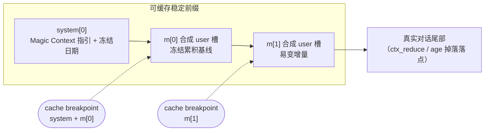
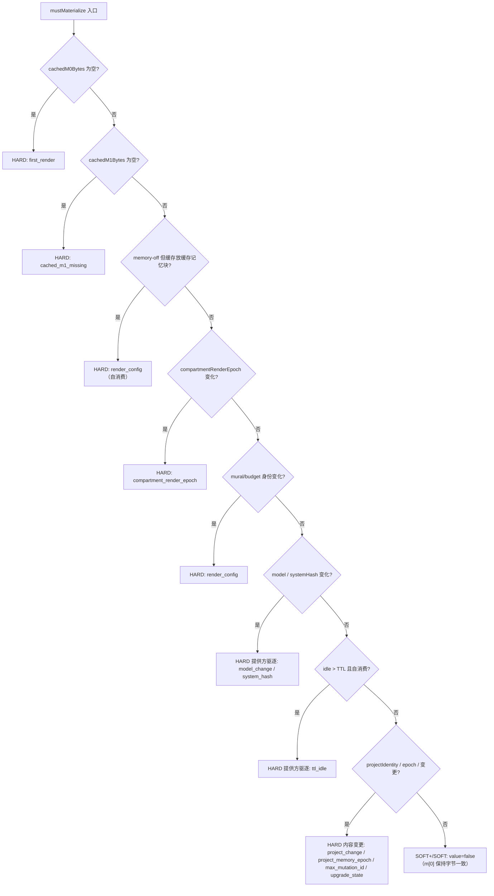

本页聚焦上下文转换引擎中最具成本敏感性的一个结构决策：**压缩后的会话历史如何切分为两个合成消息槽 m[0] 与 m[1]，以及什么条件才会迫使它们重新物化**。这两个槽位并非渲染细节，而是整个"缓存稳定性"设计的物理载体——它们决定了 Anthropic 系提供方的 prompt-cache 前缀在哪里断点、哪些后台工作可以"搭车"免费完成、哪些操作必须付出一次独立计价的缓存重建。理解这一布局，是读懂[缓存稳定性的核心设计哲学](8-huan-cun-wen-ding-xing-de-he-xin-she-ji-zhe-xue)与[变更门控与延迟工作不变量](11-bian-geng-men-kong-yu-yan-chi-gong-zuo-bu-bian-liang)的前提。本页只讨论 m[0]/m[1] 的字节布局、标记水位与物化触发，不涉及 decay 曲线的数学（见[分区衰减渲染与重要性分级](14-fen-qu-shuai-jian-xuan-ran-yu-zhong-yao-xing-fen-ji)）或 Historian 的生产流程（见[Historian 分区流程：产制·校验·发布](13-historian-fen-qu-liu-cheng-chan-zhi-xiao-yan-fa-bu)）。

## 前缀几何：两个合成 user 槽

压缩后的历史渲染进**头部两个合成的 `user` 角色消息槽**，使得巨大的稳定前缀能在稳态工作中存活下来。核心实现集中在 `inject-compartments.ts`（`renderM0` / `renderM1` / `materializeM0` / `mustMaterialize`），并在 `inject-compartments-pi.ts` 中镜像。两个槽位的每个 part 都带 `synthetic: true` 标记，使其不被 OpenCode 的标题生成门控计为真实用户轮次。发送到模型端的线上序列因此呈现为 `system → m[0] → m[1] → 真实对话尾部` 的固定结构，其中前三段构成可缓存的稳定前缀。

Sources: [ARCHITECTURE.md](ARCHITECTURE.md#L76-L81), [inject-compartments.ts](packages/plugin/src/hooks/magic-context/inject-compartments.ts#L2996-L3037)

`prependM0M1Messages` 将两个槽 `unshift` 到消息数组头部：m[0] 槽的 part 是 m[0] 文本（空时回落到 `<session-history></session-history>`）加可选的 mural 图像 part，m[1] 槽的 part 则是纯文本。m[1] 永不为空——当没有增量时渲染一个最小占位符 `<session-history-since>(no new content since last materialization)</session-history-since>`，这是 Anthropic 缓存断点结构的硬性要求。**注意这里使用的是 `synthetic` 而非 `ignored`**：OpenCode 的 `toModelMessagesEffect` 只过滤 `ignored`，若用 `ignored` 会连同历史注入一起从真实模型调用中剥离；而 `synthetic` 仅用于让标题门控跳过这两个幽灵用户轮次（issue #129）。

Sources: [inject-compartments.ts](packages/plugin/src/hooks/magic-context/inject-compartments.ts#L955-L957), [inject-compartments.ts](packages/plugin/src/hooks/magic-context/inject-compartments.ts#L2996-L3037)

## m[0]：冻结累积基线

**m[0] 扮演"累积基线"角色，性质等同于 `system[0]`——在常规轮次中不发生改变。** 它由 `renderM0` 按固定顺序拼接五个可选块，块间以空行分隔：

| 顺序 | 块 | 内容来源 | 预算归属 |
| --- | --- | --- | --- |
| 1 | `<project-docs>` | 根目录 `ARCHITECTURE.md` + `STRUCTURE.md`（`injectDocs=false` 时省略） | 独立 |
| 2 | `<user-profile>` | 基线用户画像（`trimUserMemoriesToBudget` 裁剪） | `userProfileBudgetTokens` |
| 3 | `<session-history>` | 上次物化时的 decay 渲染历史 | `historyBudgetTokens` |
| 4 | `<project-memory>` | v2 紧凑记忆块（分类分组的 `#id: fact` 行） | `memoryInjectionBudgetTokens` |
| 5 | `<memory-mural>` | 仅在 mural 启用且模型支持视觉时注入的引用块 | — |

`renderM0` 只有在 `<session-history>` 渲染结果非空时才包裹该块，否则写入 `M0_EMPTY_BODY` 占位；最终以 `"\n\n"` 连接并 `trim`。历史块本身委托给共享的 `renderDecayedCompartments`，从而保证 OpenCode 与 Pi 逐字节一致。

Sources: [inject-compartments.ts](packages/plugin/src/hooks/magic-context/inject-compartments.ts#L2054-L2101), [inject-compartments.ts](packages/plugin/src/hooks/magic-context/inject-compartments.ts#L2024-L2040)

m[0] 物化时，`materializeM0` 会同时执行一次**收紧循环**：当 `<session-history>` 切片的真实 tokenizer 计数超过 history 预算的 105% 且尝试次数不足 3 次时，将 decay 压力乘数逐次乘以 1.15 重渲染。判定只针对 `<session-history>` 切片（`historySliceTokens`），因为把 `<project-docs>`、`<user-profile>`、`<project-memory>` 这些各自有独立预算的固定块计入历史预算会虚假抬高成本、过度收紧衰减压力并饿死历史。

Sources: [inject-compartments.ts](packages/plugin/src/hooks/magic-context/inject-compartments.ts#L2303-L2322), [inject-compartments.ts](packages/plugin/src/hooks/magic-context/inject-compartments.ts#L2140-L2155)

## m[1]：易变增量

**m[1] 承载自上次 m[0] 物化以来的全部新增**，由 `renderM1WithMetadata` 组装并包裹进 `<session-history-since>`。其内容由一组**水位线过滤**驱动，每个增量块对应 m[0] 快照标记中的一个水位：

- `<memory-updates>`：自 `maxMemoryMutationId` 以来的非增量记忆变更（update / archive / supersede），由 `renderMemoryUpdatesBlock` 渲染为 `<updated>` / `<removed>` / `<superseded>` 行；被 supersede 的替代记忆会被"强制"进入本块的 new-memories（上限 `MAX_FORCED_MEMORIES_PER_DELTA = 10`）。
- `<new-compartments>`：`sequence > maxCompartmentSeq` 的新分区，以完整 tier 1 渲染——这是 Historian 常规发布的天然落点。
- `<new-memories>`：`id > maxMemoryId` 的增量记忆，裁剪到记忆预算的 25%。
- `<new-user-profile>`：当 `projectUserProfileVersion` 变化时，`<user-profile>` 的增量版本（同样裁剪到 25%）。

若以上所有块都为空，`renderM1WithMetadata` 返回 `M1_EMPTY_PLACEHOLDER`；否则包裹为 `<session-history-since>\n...\n</session-history-since>`。

Sources: [inject-compartments.ts](packages/plugin/src/hooks/magic-context/inject-compartments.ts#L2603-L2735), [inject-compartments.ts](packages/plugin/src/hooks/magic-context/inject-compartments.ts#L2513-L2595)

**新增分区、增量记忆、增量用户画像都被刻意排除在 m[0] 触发条件之外**——这正是 m[0]=冻结前缀 / m[1]=易变增量这一拆分存在的全部理由。一次常规的 Historian 发布必须保持 Anthropic prompt-cache 前缀完整；若每次发布都折叠 m[0]，就会击穿整个会话的缓存。

Sources: [inject-compartments.ts](packages/plugin/src/hooks/magic-context/inject-compartments.ts#L1541-L1546), [ARCHITECTURE.md](ARCHITECTURE.md#L80-L86)

## 快照标记与物化状态

物化决策的正确性依赖于一组**持久化的快照标记**（`M0SnapshotMarkers`）与其缓存字段之间的逐字段比对。`M0SnapshotMarkers` 完整刻画了"当前 m[0] 基线是在什么状态下渲染的"：`projectMemoryEpoch`、`workspaceFingerprint`、`projectUserProfileVersion`、`maxCompartmentSeq`、`maxMemoryId`、`maxMutationId`、`maxMemoryMutationId`、`projectDocsHash`、`materializedAt`、`sessionFactsVersion`、`upgradeState`、`compartmentRenderEpoch`，以及运行期信号 `systemHash` / `toolSetHash` / `modelKey` 与 `projectIdentity` / `muralHash` / `muralEnabled` / `renderBudgetIdentity`。

其中运行期信号（system/tool-set/model）取自当前 flight，而非纯数据库读取，因此由调用点作为 `M0HardSignals` 输入传入；tool-set 指纹仅用于归因，其进程全局作用域使其被刻意排除在折叠触发之外。

Sources: [inject-compartments.ts](packages/plugin/src/hooks/magic-context/inject-compartments.ts#L740-L791)

这些标记持久化在 `session_meta` 表的一组 `cached_m0_*` 列与 `cached_m1_bytes` 中（`cached_m0_bytes` / `cached_m1_bytes` 为 BLOB）。物化成功后，`materializeM0` 在**同一事务**内调用 `persistCachedM0` 写入字节与全部标记，并原子地写入 `memory_block_ids`、`memory_block_count` 与 `cached_m0_last_baseline_end_message_id`（覆盖的最新分区边界），确保缓存字节与其 id 清单、边界永不发散。整个折叠只取**一个时间戳** `foldMaterializedAt`——内存过期截止点在读取时必须与持久化的 `materializedAt` 一致，否则折叠内部会出现确定性缺口，影响 defer 重放。

Sources: [storage-db.ts](packages/plugin/src/features/magic-context/storage-db.ts#L1569-L1604), [inject-compartments.ts](packages/plugin/src/hooks/magic-context/inject-compartments.ts#L2191-L2194), [inject-compartments.ts](packages/plugin/src/hooks/magic-context/inject-compartments.ts#L2423-L2476)

物化完成后，`applyMarkersToState` 把结果回写到内存态的**所有** `state.cachedM0*` 字段。这一步是防止无限重物化循环的关键：若遗漏某个字段（尤其是运行期镜像字段 `cachedM0SystemHash` / `cachedM0ToolSetHash` / `cachedM0ModelKey`），下一次 `mustMaterialize` 会读到陈旧基线并反复触发同一个折叠。因此这些运行期标记必须被镜像进扁平状态，而不只是存于 `snapshotMarkers`。

Sources: [inject-compartments.ts](packages/plugin/src/hooks/magic-context/inject-compartments.ts#L2103-L2138)

## 物化触发条件：`mustMaterialize`

`mustMaterialize` 只对 **HARD** 返回 true。它的判断被组织在**缓存失效分类学**周围，使得触发列表与 m[0]/m[1] 契约不可能静默地互相矛盾。决策按顺序求值，任一环节命中即折叠：

**类别一：提供方侧缓存驱逐（缓存已死，折叠免费）。** 模型/provider 变化（`cachedM0ModelKey`）、系统提示哈希变化（`cachedM0SystemHash`）、idle 超过 TTL（`cacheExpired`）。TTL 分支是自消费的：`cacheExpired` 在响应结束前每个 pass 都为 true，因此仅在"最后一次已完成响应晚于上次物化时间"（`lastResponseTime > cachedM0MaterializedAt`）时才折叠；折叠后 `materializedAt = Date.now()` 超过该响应时间，本回合后续 pass 自然跳过。注意模型键与系统哈希都要求**当前信号非空**才算变化——空信号表示"本 pass 未知"，绝不当作变化，以避免信号确定前的虚假折叠。系统提示钩子在消息转换之后运行，所以其变化晚一个 pass 到达；内存关闭进程也通过渲染字节自消费而不依赖额外的持久化标志。

Sources: [inject-compartments.ts](packages/plugin/src/hooks/magic-context/inject-compartments.ts#L1607-L1658), [inject-compartments.ts](packages/plugin/src/hooks/magic-context/inject-compartments.ts#L1580-L1605)

**类别二：真实的 m[0] 内容变化（基线字节确实不同）。** 首次渲染（`first_render`）、m[1] 缺失（`cached_m1_missing`）、`project_memory_epoch` 变化（dashboard / 外部编辑器变更）、工作区指纹变化（`workspaceFingerprint`，涵盖离开工作区的 single 转换）、待处理的 m[0] 结构变更（`max_mutation_id`——分区删除/合并/重压缩）、upgrade 状态变化。参数身份（mural 启用、渲染预算）仅在**对已记录组件发生真实变化**时触发；null 组件是 mural/budget 加入身份之前的遗留行，按"静默采纳"处理，以免升级时一次性折叠整个 fleet。

Sources: [inject-compartments.ts](packages/plugin/src/hooks/magic-context/inject-compartments.ts#L1660-L1719)

**类别三：刻意"不是触发条件"** 的信号——它们全是 m[1] 增量，触发它们会在常规后台工作上击穿 m[0]，从而摧毁整个设计：

| 信号 | 为何不是 m[0] 触发 | 正确落点 |
| --- | --- | --- |
| 新分区序列 `max_compartment_seq` | 常规 Historian 发布 | m[1] `<new-compartments>` |
| `project_user_profile_version` | 增量画像提升 | m[1] `<new-user-profile>` |
| `maxMemoryId` | 增量记忆写入 | m[1] `<new-memories>` |
| `projectDocsHash` | 文档编辑应搭下一次自然折叠 | `materializeM0` 在自然 fold 时读取 |
| `toolSetHash` | 进程全局，误报 | 仅归因 |

`max_mutation_id` 之所以是触发条件，是因为结构性分区删除/合并/重压会改变已渲染 m[0] 基线的内容，与"新增分区"这类纯增量不同。

Sources: [inject-compartments.ts](packages/plugin/src/hooks/magic-context/inject-compartments.ts#L1691-L1715), [inject-compartments.ts](packages/plugin/src/hooks/magic-context/inject-compartments.ts#L1632-L1644)

决策前的**快照标记读取**（`readCurrentM0SnapshotMarkers`）本身是个热路径优化：它先读一个轻量变更探针，探针字段完全一致时直接复用缓存标记并只刷新运行期字段（`refreshVolatileMarkerInputs`），否则退回权威的多查询实现。该完整性判据基于其实际观测到的值，因此 Historian 发布、所有记忆增删改、m0 结构变更、epoch/画像提升、成员关系迁移、别名写入与遗留升级都会改变至少一个探针字段。

Sources: [inject-compartments.ts](packages/plugin/src/hooks/magic-context/inject-compartments.ts#L1448-L1490), [inject-compartments.ts](packages/plugin/src/hooks/magic-context/inject-compartments.ts#L1373-L1446)

## 压力兜底回填（Pressure Backstop Refold）

m[0]/m[1] 契约中还有"或因为压力而不得不折叠"的一半。当没有自然 HARD 失效到来、但易变 m[1] 已显著增长时，一次**回填**会把 m[1] 折叠进 m[0]（重跑 decay、重置 m[1]），使马拉松式活跃会话的 m[1] 不会无界增长。回填只在**已经发生缓存重建的 pass**且 m[1] 刚被重新计算时运行——defer pass 重放持久化字节，绝不实时读取或回填。任一条件满足即折叠：

| 触发 | 判据 | 意图 |
| --- | --- | --- |
| supersede 漂移 | `memoryUpdateCount > 40` | 大小无关的变更行数阈值 |
| 尺寸比例 | `m1Tokens > m0Tokens * 0.15` | 受 `M0_DRIFT_RATIO_FLOOR_TOKENS = 500` 小 m[0] 地板保护 |
| 绝对上限 | `m1Tokens > 历史预算 * 0.2` | 小 m[0] 时比例测试被抑制，此上限独立兜底 |

比例比较使用 **token 计数而非字符长度**（XML 密集/非拉丁内容会使两者严重偏离）；`estimateTokens` 的调用在此罕见分支中是安全的。回填期间若遇到争用失败是非致命的——保留当前未回填的 m[0]/m[1]，下一 pass 重试。

Sources: [inject-compartments.ts](packages/plugin/src/hooks/magic-context/inject-compartments.ts#L3433-L3491)

## 通过语义：SOFT+ / SOFT / HARD 与折叠执行门控

每次 pass 恰好属于三类之一，其边界由 m[0] 是否重物化划定。这是缓存稳定性的回归守卫（`m0m1-taxonomy.test.ts`）所验证的契约：

| Pass 类型 | m[0] | m[1] | 前缀状态 | 触发来源 |
| --- | --- | --- | --- | --- |
| **SOFT+**（defer / `cache_hit`） | 逐字节重放 | 逐字节重放 | `system + m[0] + m[1]` 全缓存 | 稳态；无新内容 |
| **SOFT**（缓存重建） | 保持逐字节一致 | 重新渲染增量 | `system + m[0]` 缓存，断点落在 m[1] | execute pass / `/ctx-flush` / 延迟历史排空 |
| **HARD**（m[0] 折叠） | 重物化（折叠 m[1]） | 重置为占位符 | 整个前缀重建，但"免费" | `mustMaterialize` 命中 |

Sources: [ARCHITECTURE.md](ARCHITECTURE.md#L47-L50), [m0m1-taxonomy.test.ts](packages/plugin/src/hooks/magic-context/m0m1-taxonomy.test.ts#L1-L16)

控制哪种行为发生在哪一 pass 的开关是 `isCacheBustingPass`。当它为 false 时，`injectM0M1` 走 `replayCachedM1` 直接解码持久化的 m[1] 字节（若缓存 m[1] 缺失则抛出 `RenderM1InvalidMarkersError`）；当它为 true 时，走 `softRefreshCachedM1`——在一个 `BEGIN IMMEDIATE` 事务内重读缓存行并验证与内存态一致，然后重新渲染 m[1] 并把新字节、边界、可见记忆 id 一并写回。soft-refresh 会替换（而非累积）m[1]：快照水位把 m[0] 的 id 与快照后的 m[1] id 分开（`renderedM0Ids` 过滤 `id <= maxMemoryId`）。

Sources: [inject-compartments.ts](packages/plugin/src/hooks/magic-context/inject-compartments.ts#L2919-L2994), [inject-compartments.ts](packages/plugin/src/hooks/magic-context/inject-compartments.ts#L3385-L3431)

在 postprocess 阶段，这一切被编排为**一次离线的预执行折叠**：若 `foldDueDecision.value` 为真或存在 soft-refresh 机会，就先以 `isCacheBustingPass: true` 调用一次 `injectM0M1`（不传 messages，故不触碰线上），随后由 `foldExecutesThisPass(foldDue, materialized)` 判定折叠是否真正落地。该门控的语义极简但至关重要：**只有当折叠确实发生、报告 m[0] 真的物化后，`foldExecutedThisPass` 才为 true**。一个 `mustMaterialize` 的建议本身绝不会打开变更门控。最终投递时再以真实 `isCacheBustingPass`（由同一个 `hasReclaimRide` 权限派生）调用 `injectM0M1` 并重放已定稿的前缀。

Sources: [fold-execution-gate.ts](packages/plugin/src/hooks/magic-context/fold-execution-gate.ts#L1-L3), [transform-postprocess-phase.ts](packages/plugin/src/hooks/magic-context/transform-postprocess-phase.ts#L1282-L1357), [transform-postprocess-phase.ts](packages/plugin/src/hooks/magic-context/transform-postprocess-phase.ts#L1374-L1412), [cache-busting-signals.ts](packages/plugin/src/hooks/magic-context/cache-busting-signals.ts#L35-L44)

HARD 信号本身在 transform 中由运行期状态组装：`hardModelKey` 来自 `liveModelBySession`，`hardSystemHash` 取自持久化的 `systemPromptHash`，`hardCacheExpired` 由 `computeHardCacheExpired` 依据 `cacheTtl` 与 `lastResponseTime` 计算。因为 `system.transform` 在 `messages.transform` 之后运行，systemHash 实际是上一轮的持久化值，故系统变化在下一 pass 被检出。

Sources: [transform.ts](packages/plugin/src/hooks/magic-context/transform.ts#L2196-L2223), [transform.ts](packages/plugin/src/hooks/magic-context/transform.ts#L2242-L2265)

## 争用与回退

物化会获取写锁，可能因并发进程（第二个 OpenCode 进程、dreamer/historian 子会话）而争用。`materializeWithRetry` 对 `MaterializeContentionError` 最多重试 3 次；`materializeM0` 在 Phase 3 用一次 `BEGIN IMMEDIATE` 事务内的 stale 检查来对抗 TOCTOU——若快照标记在渲染期间被兄弟进程改变，则回滚并抛争用错误。为了保持回放一致性，该 stale 检查**刻意排除 `maxMemoryId`**（增量写入不使已渲染 m[0] 失效），但**包含记忆变更游标**（一次物化 pass 必须协调到其持久游标为止的全部非增量记忆变更）。

Sources: [inject-compartments.ts](packages/plugin/src/hooks/magic-context/inject-compartments.ts#L2383-L2404), [inject-compartments.ts](packages/plugin/src/hooks/magic-context/inject-compartments.ts#L2494-L2510)

重试耗尽后有两条降级路径。首选是复用缓存基线：本 pass 服务略微陈旧的 m[0]/m[1] 对是正确的，下一 pass 再重试；但**必须要求 m[0] 与 m[1] 字节同时存在**——只复用 m[0] 会导致后续 `replayCachedM1` 因缺少 m[1] 而抛错、进而整段注入丢失。若无完整缓存对（或 force/emergency 明确允许），则走 `renderFreshM0NonPersisted`——不持久化、不持锁地现场渲染一份完整 m[0]/m[1]，避免模型收到零历史。`prepareCachedM0M1Replay` 则在任何可能失败的前置飞行检查之前捕获一份完整持久对，使争用回退不会采纳前置检查期间由兄弟进程写入的更新行。

Sources: [inject-compartments.ts](packages/plugin/src/hooks/magic-context/inject-compartments.ts#L3319-L3375), [inject-compartments.ts](packages/plugin/src/hooks/magic-context/inject-compartments.ts#L3205-L3242)

## 跨运行时镜像

m[0]/m[1] 的布局与触发契约是**跨宿主共享的同一设计**，在各运行时以结构对等方式重实现：

- **OpenCode（TS）**：`inject-compartments.ts` 为权威实现。
- **Pi**：`inject-compartments-pi.ts` 的 `mustMaterializePi` 与 OpenCode 的 `mustMaterialize` 逐分支对齐（first_render / cached_m1_missing / cache_invalid / compartment_render_epoch / render_config / model_change / system_hash / project_change / ttl_idle / renderer_upgrade）。Pi 特有的差异包括 `projectIdentity` 的懒采纳（会话内 `/cd` 切换项目）与 `cache_invalid` 分支（保留无法解码的缓存基线到受保护的物化路径，避免争用下的假阴性导致整段注入丢失）。Pi 不产生 `toolSetHash`（无 tool.definition 钩子），该分支仅为结构对等而保留。
- **Rust 模块**：`compose_m0_from_store` 从 store 读取分区、覆盖率锚点与折叠水位，并在**同一 SQLite 快照**内读取记忆行与水位，产出 m[0] 组合。Rust 模式下 TS 侧负责状态同步与折叠编排，模块负责纯组合。

Sources: [inject-compartments-pi.ts](packages/pi-plugin/src/inject-compartments-pi.ts#L1010-L1160), [m0_compose.rs](crates/mc-module/src/m0_compose.rs#L428-L496)

## 关键不变量速览

- **两个槽，一个断点切分**：m[0] 冻结、m[1] 易变，缓存断点天然落在 m[1] 起始处，使 `system + m[0]` 在 SOFT pass 中得以存活。
- **HARD 只由五类信号触发**：提供方驱逐（model/system/TTL）与真实内容变化（epoch/工作区/结构变更/升级状态），加上渲染身份变化；新分区、增量记忆、画像提升、文档编辑、tool-set 一律不是触发条件。
- **折叠必须"免费"**：`mustMaterialize` 只在前缀已被迫重建（缓存已死）或基线字节确实不同时才返回 true。
- **一次折叠，一个时间戳，一个事务**：字节、标记、id 清单、边界在同一事务内原子持久化；`applyMarkersToState` 回写全部字段以防无限重折叠循环。
- **建议 ≠ 执行**：`foldExecutedThisPass = foldDue && materialized`，只有真实物化才打开变更门控。

至此，m[0]/m[1] 的字节布局与触发条件已完整。下一步建议阅读[变更门控与延迟工作不变量](11-bian-geng-men-kong-yu-yan-chi-gong-zuo-bu-bian-liang)以理解这些触发如何与"搭车"权限协同，以及[内容剥离、哨兵与确定性重放](12-nei-rong-bo-chi-shao-bing-yu-que-ding-xing-zhong-fang)以理解 defer pass 逐字节重放为何是契约的硬性要求。