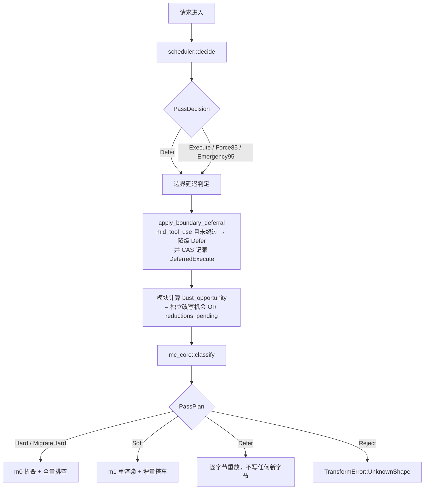
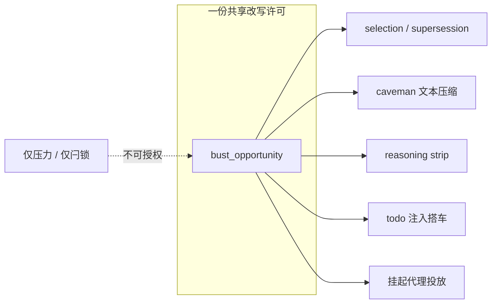

本页剖析 Magic Context 上下文转换引擎中最容易被误改的一层：**谁有权限改写 provider 可见字节**，以及**哪些工作必须等待别人已经开启的那次改写**。转换通道把一个会话切分成两类通道——`HARD`/`SOFT` 是"改写通道"（materializing pass），`SOFT+` 是"重放通道"（defer pass）。所有增量（新的 m[1] 内容、工具箱减、m[0] 折叠、todo 注入、历史发布）都必须落在同一次改写里，否则会为每个增量各付一次 cache 重建成本。因此系统需要一套**门控（gate）**决定本趟是否可以改写，以及一组**延迟工作不变量（deferred work invariants）**保证增量只"搭车"、不"发车"。

理解本页的前提是已经读过 [m[0]/m[1] 缓存布局与物化触发条件](10-m-0-m-1-huan-cun-bu-ju-yu-wu-hua-hong-fa-tiao-jian) 中关于 `m0`（冻结基线）与 `m1`（易变增量）的定义；本页不再重复布局本身，而是聚焦于布局之上的决策层。

## 两级门控：调度器决策与分类器物化判定

改写权限由两个独立的判定串联而成，二者职责严格分离。**第一级是调度器（scheduler）**：它只看会话外部的几何量——provider 上报的上下文占比、缓存空闲 TTL、tail 是否处于工具调用中途、以及是否处于 `>=95%` 应急带——产出一个 `PassDecision`。`PassDecision` 有四个取值：`Defer`（本趟不改写）、`Execute`（常规改写）、`Force85`（达到派生强制带，绕过中段延迟）、`Emergency95`（应急排空）。调度器不理解 m[0]/m[1]，也不看冻结单元。

Sources: [scheduler.rs](crates/mc-module/src/scheduler.rs#L211-L262), [scheduler.rs](crates/mc-module/src/scheduler.rs#L735-L805)

**第二级是分类器（classifier）**：`mc_core::classify` 是一个纯函数，接收一组布尔输入（`initialized`、`valid_m0m1_shape`、`render_config_changed`、`hard_fold_requested`、`boundary_present`、`m1_revision_changed`、`reductions_pending`、`bust_opportunity`），按"首个匹配即返回"的顺序产出 `PassPlan`。`PassPlan` 区分 `Hard`、`MigrateHard`（遗留单 `baseline` 单元的破坏性清理后折叠）、`Soft`（m1 断点处的增量）、`Defer`（逐字节重放冻结字节）、`Reject`（未知形态，干净报错且不动持久状态）。分类器知道缓存形态，但不看调度器的时间/压力逻辑。

Sources: [lib.rs](crates/mc-core/src/lib.rs#L40-L95), [lib.rs](crates/mc-core/src/lib.rs#L114-L158)

两级之间通过 `bust_opportunity` 这一个布尔量耦合，这是整套设计的支点。分类器规则 7 明确规定：一个 m1 增量**只有当本趟已经存在独立的改写机会时**才可以"搭车"，否则落到规则 8 的 `Defer`。换句话说，增量是**待办工作（pending work）**，不是**改写许可（permission）**本身。

Sources: [lib.rs](crates/mc-core/src/lib.rs#L97-L158)

Sources: [scheduler.rs](crates/mc-module/src/scheduler.rs#L560-L579), [transform.rs](crates/mc-module/src/transform.rs#L4406-L4464), [lib.rs](crates/mc-core/src/lib.rs#L82-L95)

`PassPlan` 最终被折算成对外的 `action` 字符串：`HARD`（含 `MigrateHard`）、`SOFT`、`SOFT+`（即 `Defer`）、`ERROR`。遥测同时保留原生的 `decision` 与规范化的 `scheduler_decision`（`execute`/`defer` 两类），使 Rust 的分带标签与 TypeScript 的 `transform_decisions` 可以对齐而不互相污染词表。

Sources: [transform.rs](crates/mc-module/src/transform.rs#L14378-L14386), [transform.rs](crates/mc-module/src/transform.rs#L1540-L1557)

## 改写机会（bust opportunity）的判定输入

模块并不直接使用调度器的 `PassDecision` 作为改写许可，而是把它与若干本地信号合并成 `bust_opportunity`。合并逻辑中有一个关键的例外——**普通历史学家否决（ordinary historian veto）**：当后台历史学家正在总结 tail、且 m1 修订未变、且调度器给出的是普通 `Execute`、且没有任何硬折叠触发时，这次 `Execute` 被否决，不构成改写机会。其目的是避免在历史学家读取 tail 期间改动它正在读取的字节；但该否决**不适用于**硬折叠触发、显式刷写（`soft_refresh_pending`）与渲染配置变更，因为它们无论如何都会让前缀失效。

Sources: [transform.rs](crates/mc-module/src/transform.rs#L2877-L2891)

更精确的"搭车许可"由两个语义不同的标志表达。`pass_already_busting` 表示"本趟已知会改动字节"；`supersession_ride_available` 表示"supersession（过期工具弧回收）可以搭上本趟已排定的具体工作"。二者的差别在于：**仅有一个被挂起的应急闩锁（drain latch）不足以设置后者**。也就是说，`>=85%` 的闩锁即使仍然有效，也不能单独授权一次 supersession 改写——它必须在下一个真正的改写趟（execute / 硬折叠 / 显式刷写 / 已发布历史的 m[1] 刷新）上才能落地。

Sources: [selection.rs](crates/mc-module/src/selection.rs#L206-L218), [selection.rs](crates/mc-module/src/selection.rs#L927-L935)

模块在 `supersession_ride_available` 中枚举了构成改写机会的具体来源：前缀物化被启用、尚未初始化、渲染配置变更、`cached_m1_missing`、硬折叠触发、`reconcile_hard_due`、谱系强制折叠、非 `Defer` 且 m1 摘要变化、强制带插叙、`Emergency95`、以及显式刷写。尚未初始化、渲染配置变更、`reconcile_hard_due`、硬折叠触发、`cached_m1_missing` 这几项还构成了 `producer_gate` 的**硬建议（hard advisory）**——即使调度器给出 `Defer`，它们仍然打开回收生产者的门。

Sources: [transform.rs](crates/mc-module/src/transform.rs#L4204-L4249), [transform.rs](crates/mc-module/src/transform.rs#L6693-L6704)

这里存在一条重要的架构判断：**历史学家的活动本身不是第二道门**。历史学家的发布只是把新分区写进存储，它是一个"延迟工作"生产者，而不是一个改写授权者。注释明确指出，只有下方那些被独立定价（independently priced）的工作才能授权新的 provider 可见变更。

Sources: [transform.rs](crates/mc-module/src/transform.rs#L4200-L4203)

| 门控信号 | 语义 | 是否可单独授权改写 |
|---|---|---|
| `PassDecision::Defer` | 调度器判定不改写 | 否 |
| `PassDecision::Execute` | 常规改写 | 是（除非被历史学家否决） |
| `PassDecision::Force85` | 派生强制带，绕过中段延迟 | 是 |
| `PassDecision::Emergency95` | 应急排空 | 是 |
| `hard_fold_requested` | 空闲 TTL / 外部修订 / 记忆 epoch | 是 |
| `soft_refresh_pending` | 显式刷写（`/ctx-flush`） | 是 |
| `render_config_changed` | 模型/系统/工具几何变化 | 是 |
| `reductions_pending` | 存在新冻结目标 | 是（作为独立改写机会的补充） |
| 仅活跃的应急闩锁 | 压力曾到 `>=85%` | **否** |
| 历史学家正在运行 | 仅作否决 | **否** |

Sources: [transform.rs](crates/mc-module/src/transform.rs#L2877-L2891), [transform.rs](crates/mc-module/src/transform.rs#L4204-L4221), [selection.rs](crates/mc-module/src/selection.rs#L1342-L1363)

## 延迟工作清单：每一项都只"搭车"

延迟工作的定义是：其在存储中已经可读（或已经可确定），但把它的字节写进 provider 可见数组会破坏缓存，因此必须等到某次真正的改写趟。系统对每一类延迟工作都单独规定了准入条件，而不是用一个粗糙的"有变化就改写"判断。

**（1）m1 修订增量。** `m1_signal.revision` 与持久化的 `meta.m1_revision` 不等，说明 m1 需要重渲染。它进入分类器的 `m1_revision_changed`，但仍需 `boundary_present && bust_opportunity` 才会得到 `Soft`。注释反复强调：该信号"只识别待办工作，本身从不授权改写"。

Sources: [transform.rs](crates/mc-module/src/transform.rs#L4457-L4459), [m1_compose.rs](crates/mc-module/src/m1_compose.rs#L99)

**（2）自动回收（reductions）。** `reductions_pending` 是一个纯粹的 id 集合成员判定：存在一个决策，其目标位于活跃 tail 中，且尚未进入冻结集合。选择器本身也受门控——`PassClass::Defer` 下"选择不产生新东西（机制重放冻结集合）"，而普通 execute 带内的压力同样不能授权 supersession 重写。

Sources: [transform.rs](crates/mc-module/src/transform.rs#L7544-L7559), [selection.rs](crates/mc-module/src/selection.rs#L227-L236), [selection.rs](crates/mc-module/src/selection.rs#L1342-L1345)

**（3）todo 注入（synthetic todo）。** 这是一个特殊的搭车者：它被明确描述为"与 m1 或 reduction 增量一样的延迟工作"，可以骑上一次已排定的改写，但"绝不自行授权 provider 可见字节"。它还有一个额外的提升规则——如果存在独立的改写机会、且不处于 `reconcile_pending`，一个本会落到 `Defer` 的计划会被提升为 `Soft`。提升只针对"普通 defer 结果"，`reconcile` 的 defer 保持不动，因为后者必须先清理或重建边界状态。

Sources: [transform.rs](crates/mc-module/src/transform.rs#L4261-L4271), [transform.rs](crates/mc-module/src/transform.rs#L4461-L4476)

**（4）挂起的代理投放（pending agent drops）。** 队列中的 `ctx_reduce` 投放只有在 `pass_already_busting` 为真时才会被选择器消费；注释写道"已排队的投放消耗许可；压力或另一个命令都不能创造许可"。当队列存在却无来源改写时，模块会打印一条诊断日志 `pending drops held ... reason=no_originating_cache_bust`，等待下一趟。

Sources: [selection.rs](crates/mc-module/src/selection.rs#L968-L988), [transform.rs](crates/mc-module/src/transform.rs#L4222-L4224)

**（5）被保留的本地推理向量（native reasoning keeps）。** OpenCode 必须重放最新的已签名助手的完整原生理性向量，其降级"不是在被延迟的趟上应用先前被扣下的覆盖层的许可"。这些 keep 单元只在 `is_provider_prefix_mutation_pass` 为真（即计划为 `Hard`/`MigrateHard`/`Soft`）时才被释放。

Sources: [transform.rs](crates/mc-module/src/transform.rs#L5650-L5657)

| 延迟工作 | 触发判定 | 准入条件 |
|---|---|---|
| m1 修订增量 | `m1_signal.revision != meta.m1_revision` | `boundary_present && bust_opportunity` |
| 自动回收（reductions） | `reductions_pending(core, selected, live, coverage)` | 作为改写机会的补充项，或被硬建议打开 |
| todo 注入 | `injection_pending_after_capture(...)` | 搭车，且不得处于 `reconcile_pending` |
| 挂起代理投放 | `pending_agent_drops` 非空 | `pass_already_busting` |
| 原生理性 keep 释放 | `strip:native_reasoning_keep:*` | `is_provider_prefix_mutation_pass` |
| 历史学家发布 | 存储已发布新分区 | 从不授权，仅贡献 m1 增量或触发首次折叠 |

Sources: [transform.rs](crates/mc-module/src/transform.rs#L4390-L4413), [transform.rs](crates/mc-module/src/transform.rs#L4445-L4464), [transform.rs](crates/mc-module/src/transform.rs#L4605-L4609)

## 中段边界延迟与 deferred_execute 状态

工具调用中途改写前缀是本项目反复强调要防止的事故：历史证据显示中段 cache bust 会摧毁多步回合约 50% 的 `cache_write` 花费。因此 Rust 侧的 `apply_boundary_deferral` 实现了一张三行的决策表：基础 `Defer` 保持 `Defer`；`Force85`/`Emergency95` 或存在绕过信号时保持原判；否则，若 `tail_state.mid_tool_use` 为真，则把 `Execute` 降级为 `Defer`，并记录一个持久的待执行意图 `DeferredExecute::pending_execute()`（reason 为 `execute-none`）。

Sources: [scheduler.rs](crates/mc-module/src/scheduler.rs#L271-L299), [scheduler.rs](crates/mc-module/src/scheduler.rs#L560-L579)

绕过信号由 `BoundaryBypass` 承载：`explicit_bust`（用户在存储中登记了显式刷写）与 `subagent`（子代理的缓存工作不能被父会话的 tail 状态拖住）。这一"降级而非丢弃"的设计带来一条关键不变量——**该标志是"仅在成功时排空"（drain-on-success only）的，它永远不会把之后的一个基础 `Defer` 提升为改写**。`drain_deferred_after_work` 的语义正是：工作成功则清除，否则原样保留。之所以安全，是因为压力判定是幂等的：只要占比仍在阈值之上，下一个非中段趟会再次给出 `Execute`。

Sources: [scheduler.rs](crates/mc-module/src/scheduler.rs#L271-L284), [scheduler.rs](crates/mc-module/src/scheduler.rs#L581-L591)

调度器在产出最终分带后，依据"降级前分带 vs 降级后分带"的对照写下规范的 defer 原因：两者都是 `Defer` 时归为 `SchedulerDefer`（`scheduler_defer`）；否则归为 `MidTurnBoundary`（`mid_turn_boundary`）。这两个原因正是 TypeScript 侧 `transform_decisions` 期望的规范词表，让两个运行时的延迟归因可以直接对照。

Sources: [scheduler.rs](crates/mc-module/src/scheduler.rs#L247-L262), [scheduler.rs](crates/mc-module/src/scheduler.rs#L799-L803)

模块把待执行意图持久化到 `session_meta`：`apply_scheduler_meta` 只在最终分带为 `Defer` 时写入 `deferred_execute_state`，否则清空；`deferred_from_meta` / `deferred_to_meta` 是两侧的纯转换器。需要留意的是状态来源的历史：TypeScript 侧的同名列已随"回合边界持有"机制一并退役，schema 中仍保留该列但注释标明其用途已被移除，当前由 Rust 权威实现承担该职责。

Sources: [transform.rs](crates/mc-module/src/transform.rs#L6706-L6730), [storage-db.ts](packages/plugin/src/features/magic-context/storage-db.ts#L1566-L1568)

此外还有一个与延迟相关的闩锁：应急排空闩锁（drain latch）由 `advance_drain_latch` 推进，在压力低于退出阈值或超过最大闩锁时长后清除；`drain_bypass_allowed` 允许活跃闩锁绕过常规调度约束，但在最近一次失败处于退避窗口内时拒绝绕过。闩锁状态被写入每趟的持久观察记录。

Sources: [scheduler.rs](crates/mc-module/src/scheduler.rs#L602-L638), [transform.rs](crates/mc-module/src/transform.rs#L2141-L2154)

## 合并不变量：一次改写承载全部增量

这套门控真正的收益不在"少改写"，而在"少几次改写"。核心不变量是：**本趟所有活跃增量合并进同一次渲染**，绝不因为两个增量各自到达而产生两次 bust。分类器的注释直接写明：`m1_revision_changed` 与 `reductions_pending` "合并为一次 SOFT（绝不两次）"，模块的 `Soft` 渲染会一次性发出全部活跃增量（变化的 m1 + 每个新冻结的 reduction）。

Sources: [lib.rs](crates/mc-core/src/lib.rs#L147-L155)

模块级对应地把所有回收通道归并到同一个机会变量上：`bust_opportunity = independent_bust_opportunity || reductions_pending_now`，而 `reclaim_pending_now` 再并入新生的 caveman 单元与被冻结的 strip 单元。也就是说，`selection`、文本压缩、推理剥离三条回收车道**共享同一份改写许可**，任何一条车道都不会为自己单独开启一次 bust。

Sources: [transform.rs](crates/mc-module/src/transform.rs#L4406-L4447)

TypeScript 侧用同一形状表达这一许可，`hasReclaimRide` 的四个信号（`hardFold`、`force`、`explicitFlush`、`publishedHistory`）在注释中被直接概括为"自动回收骑在独立定价的工作上，绝不单靠压力"。同一个 `publishedWorkDrainAllowed` 同时驱动 `shouldApplyPendingOps`、`shouldRunHeuristics`，并被赋给 `isCacheBustingPass`——注释强调"每一个首次应用车道与 m[1] 刷新都使用这同一份许可"。

Sources: [cache-busting-signals.ts](packages/plugin/src/hooks/magic-context/cache-busting-signals.ts#L31-L42), [transform-postprocess-phase.ts](packages/plugin/src/hooks/magic-context/transform-postprocess-phase.ts#L1374-L1412)

在硬折叠通道上，合并规则被推到极致：一次 `HARD` 意味着前缀已经失效，因此**应当把一切都排空进它**，而不是"推迟硬折叠"。Rust 侧以 `producer_gate` 的硬建议、`non_tool_bust_opportunity`（让纯文本压缩/剥离工作不必依赖一次工具投放来开门）以及子代理的 `Soft`/`Defer` 二分来落实这一原则。历史上被验证的行为记为"已排队投放与折叠、已发布刷新一次性合并"。

Sources: [transform.rs](crates/mc-module/src/transform.rs#L4408-L4413), [transform.rs](crates/mc-module/src/transform.rs#L4233-L4249), [transform.rs](crates/mc-module/src/transform.rs#L4478-L4486)

Sources: [transform.rs](crates/mc-module/src/transform.rs#L4406-L4447), [selection.rs](crates/mc-module/src/selection.rs#L927-L935)

## Defer 通道的字节级不变量

当计划为 `Defer` 时，通道的契约是**逐字节重放冻结字节**：不做新渲染，一个纯粹的 defer（边界存在、无增量）不写任何东西。这带来两条必须被测试守住的边界不变量。

第一条是**前缀不可在延迟趟上变化**。模块在提交前计算已服务块的指纹差异 `first_divergence`；若本趟是 `Defer` 且差异落点涉及 `mc_m0#0` 或 `mc_m1#0`，则标记 `deferred_frozen_prefix_divergence`，此时**保持上一趟已服务响应的指纹不变**，使重试继续报告该不匹配。注释说明：一个延迟趟不能接受稳定 m0/m1 前缀的变化，只有显式使缓存失效的趟才可以采纳新前缀，在此期间宿主可以重放其持久化的 last-known-good 表示。

Sources: [transform.rs](crates/mc-module/src/transform.rs#L5929-L5953)

第二条是**冻结减量的单调性**。在每次趟（包括延迟趟）上、且在分类之前，`validate_reduction_monotonicity` 都会校验：一个已冻结的减量目标若被重新提供不同的字节，就违反了"冻结后不可变"的契约。注释解释为何必须在此处硬失败而不是容忍：集合成员判定会把"已冻结"的目标静默跳过，从而在延迟趟上继续服务陈旧字节，因此只能报错。

Sources: [transform.rs](crates/mc-module/src/transform.rs#L4390-L4394)

延迟趟的遥测同样反映其语义：`classify_materialize_reason` 对 `Defer` 与 `Reject` 直接返回 `None`，即一个纯重放趟没有物化原因；只有 `Hard`/`MigrateHard`/`Soft` 才会携带诸如 `first_render`、`epoch_change`、`ttl_expiry`、`m1_delta`、`selection`、`explicit_flush` 等成因标签。

Sources: [transform.rs](crates/mc-module/src/transform.rs#L14324-L14376)

## 门控状态的持久化与可观测性

每一次被接受的趟都会把调度器观察写入 `mc_pass_trace`：`PassSchedulerObservation` 包含时间戳、原生分带标签 `scheduler_decision`、与 TypeScript 共享的规范化 `canonical_decision`、规范 defer 原因 `defer_reason`，以及 `drain_latch_active`。该历史以有界的 JSON 数组保存（上限 256 条），并有独立的"值得调查"历史通道，使事故证据不随环形缓冲区滚掉。

Sources: [transform.rs](crates/mc-module/src/transform.rs#L2141-L2154), [lib.rs](crates/mc-store/src/lib.rs#L3235-L3246), [lib.rs](crates/mc-store/src/lib.rs#L3455-L3458), [lib.rs](crates/mc-store/src/lib.rs#L8361-L8372)

在记忆门控上还有一个专门的**门控标记（gate marker）**不变量：为关闭记忆而门控的会话持久化了 `memory_disabled`，其摘要采用受门控的版本；而从"记忆开启"转为"记忆关闭"的会话，其摘要不匹配**不构成**当下改写的授权——下一个自然 bust 才会采纳受门控的摘要。这避免了配置翻转本身触发一次额外的 cache 重建。

Sources: [transform.rs](crates/mc-module/src/transform.rs#L4046-L4050)

## 不变量的核验

这套设计用一组针对性测试把每条不变量钉死，而非依赖集成层面的偶然通过。下表列出与门控/延迟直接相关的代表用例。

| 测试 | 钉住的不变量 |
|---|---|
| `producer_gate_runs_on_execute_force_and_hard_advisory_never_plain_defer` | 生产者门在 execute/force/硬建议上运行，普通 defer 上从不运行 |
| `queued_drops_coalesce_with_fold_and_published_refresh_once` | 已排队投放在硬折叠与已发布刷新上各只合并一次 |
| `coalesced_memory_delta_and_reduction_one_soft` | m1 增量与减量合并为**一次** SOFT，随后一趟重放字节一致 |
| `force_episode_coalesces_lanes_and_defers_late_candidates` | 强制插叙合并各车道，并延迟迟到候选 |

Sources: [transform.rs](crates/mc-module/src/transform.rs#L18105-L18142), [transform.rs](crates/mc-module/src/transform.rs#L18266-L18300), [transform.rs](crates/mc-module/src/transform.rs#L32775-L32797), [transform.rs](crates/mc-module/src/transform.rs#L18764-L18790)

## 继续阅读

理解了"谁可以改写、谁只能搭车"之后，下一步应进入 [内容剥离、哨兵与确定性重放](12-nei-rong-bo-chi-shao-bing-yu-que-ding-xing-zhong-fang)，那里解释延迟趟如何在不重新推导字节的前提下保证重放的确定性；若要回看改写通道的完整阶段划分，可回到 [转换通道生命周期与阶段划分](9-zhuan-huan-tong-dao-sheng-ming-zhou-qi-yu-jie-duan-hua-fen)，而物化触发条件的完整清单见 [m[0]/m[1] 缓存布局与物化触发条件](10-m-0-m-1-huan-cun-bu-ju-yu-wu-hua-hong-fa-tiao-jian)。