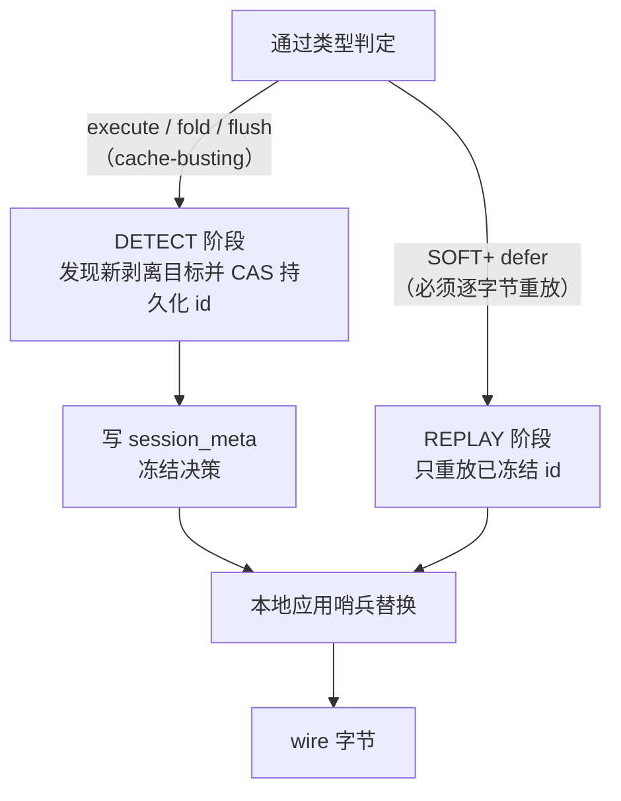
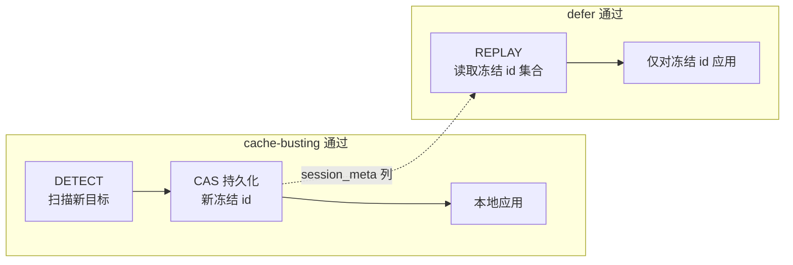
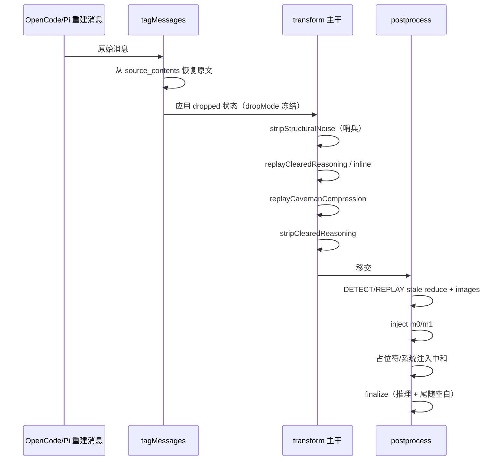

本页剖析 Magic Context 转换引擎中最容易被误读的一层：**为什么"从上下文里删掉点东西"这件事，必须被实现成一套可重放的确定性变换**。它解释三类相互咬合的机制——**内容剥离（strip）**、**哨兵（sentinel）**与**确定性重放（deterministic replay）**——如何在缓存稳定性这一顶层约束下协同工作。本页假设读者已理解转换通道的阶段划分与 m[0]/m[1] 物化边界，属于"上下文转换引擎"主题簇的实现细节层。

## 问题定义：为什么剥离不能是"随手 delete"

剥离操作的目标是让模型看不到某些内容：系统注入的提醒、已被 `ctx_reduce` 丢弃的占位骨架、结构噪声、已清理的推理、过期图片等。直觉做法是直接从消息数组中删掉它们。但 Anthropic 的 prompt cache 对**序列化后的消息数组形状**极其敏感：一旦某个不得改变字节的前缀被改写，整段缓存作废，下一次请求要重新计费并重新灌入。

因此架构确立了一条不可协商的不变量：**defer（SOFT+）通过必须逐字节重放**。任何在 defer 通过上首次生效的剥离/丢弃都会改变尾部字节，并击穿其后的整条前缀。架构文档对此的表达是"watermark 门控的剥离使用 frozen-id 重放模式：只在 cache-busting 通过上检测并冻结受影响的 id，此后每个通过重放该冻结集合"。

Sources: [ARCHITECTURE.md](ARCHITECTURE.md#L65), [ARCHITECTURE.md](ARCHITECTURE.md#L43)

这条不变量进一步被推广为整个运行时的设计原则：**每一次持久化的消息变更（推理清理、结构噪声/占位符/图片/合并助手剥离、caveman 压缩、合成 todowrite、丢弃占位符、smart-drop/edit-marker 压缩）都在每一个转换通过上被确定性地重新应用——包括 defer 通过——从而让 wire 字节保持逐字节一致**。

Sources: [ARCHITECTURE.md](ARCHITECTURE.md#L11)



这个"检测即冻结、处处重放"的二分结构，是本页所有具体机制的公共骨架。下面先看剥离了哪些东西，再看用于替换的哨兵形态，最后看决策是如何被持久化与重放的。

## 剥离的内容类别

剥离函数集中在 `strip-content.ts`、`strip-structural-noise.ts` 与 `system-injection-stripper.ts` 中，全部是**无状态函数 + 原地哨兵替换 + 持久化 watermark**的组合，这在架构文档中被明确记载为内容剥离层的形态。

Sources: [ARCHITECTURE.md](ARCHITECTURE.md#L137)

| 剥离类别 | 判定依据 | 实现位置 |
|---|---|---|
| 结构噪声 | part 类型 ∈ `{meta, step-start, step-finish, reasoning}`，其中 `reasoning` 仅当 `text === "[cleared]"` | [strip-structural-noise.ts](packages/plugin/src/hooks/magic-context/strip-structural-noise.ts#L5-L21) |
| 系统注入消息 | 整条消息的文本匹配内部管道 marker（通知、提醒、指令块） | [strip-content.ts](packages/plugin/src/hooks/magic-context/strip-content.ts#L15-L30) |
| 丢弃占位符消息 | 整条消息仅由 `[dropped §N§]` 占位符段构成 | [strip-content.ts](packages/plugin/src/hooks/magic-context/strip-content.ts#L165-L254) |
| 已清理推理 | `thinking` 与 `text` 均已设为 `"[cleared]"` 的 reasoning/thinking part | [strip-content.ts](packages/plugin/src/hooks/magic-context/strip-content.ts#L378-L407) |
| 合并助手推理 | 连续 assistant 运行中除"首个非元数据 part"以外的全部 reasoning | [strip-content.ts](packages/plugin/src/hooks/magic-context/strip-content.ts#L518-L601) |
| 已处理图片 | 已获得助手响应且早于 watermark 的 user 消息中的 data-URL 图片 part | [strip-content.ts](packages/plugin/src/hooks/magic-context/strip-content.ts#L1006-L1067) |
| 过期 ctx_reduce 调用 | 已越过保护窗口的 `ctx_reduce` 工具 part | [drop-stale-reduce-calls.ts](packages/plugin/src/hooks/magic-context/drop-stale-reduce-calls.ts) |
| 内联思考标签 | 文本中字面量 `<think>` / `<thinking>` 标签 | [strip-content.ts](packages/plugin/src/hooks/magic-context/strip-content.ts#L411-L437) |

一个关键细节是"元数据 part"的定义边界：`METADATA_PART_TYPES` 刻意**不包含 `file`**。原因是 file part 可能承载用户粘贴的图片/文档，把它当作元数据会在文本 part 退化为占位符时误删整条携带视觉上下文的消息。

Sources: [strip-content.ts](packages/plugin/src/hooks/magic-context/strip-content.ts#L116-L135)

同样重要的是 **user 角色消息永不被中和**。把用户消息清空会塌缩轮次边界，导致 AI SDK 的 Anthropic adapter 把连续 assistant 合并成一个"latest assistant"块，其签名校验随即失败。因此针对用户消息的丢弃，`apply-operations` 会发出 `[truncated §N§]` 预览而不是完整 `[dropped §N§]`，保留外壳以维持轮次边界。

Sources: [strip-content.ts](packages/plugin/src/hooks/magic-context/strip-content.ts#L143-L161)

系统注入消息的剥离还额外带有一个"可操作尾部"保护：只有在 `protectedTailStart` 之前的消息才会被中和，因为受保护尾部里的通知可能携带后台任务 ID 等可操作信息。

Sources: [strip-content.ts](packages/plugin/src/hooks/magic-context/strip-content.ts#L32-L71)

另有独立于消息数组的文本级剥离器 `stripSystemInjection`，它对工具输出等纯文本执行 marker 扫描与 `<system-reminder>` 块删除，与消息级剥离互补。

Sources: [system-injection-stripper.ts](packages/plugin/src/hooks/magic-context/system-injection-stripper.ts#L1-L49)

## 哨兵：形状保持的替换原语

剥离原始内容后，**不能用"删除"来腾出位置**，否则消息数组长度与索引位置会在不同通过间漂移，序列化形状随之为 proxy 类提供者改变哈希前缀。解决方案是**原地哨兵替换**：把被剥离的 part 换成惰性占位 part，保持 `message.parts` 长度与索引稳定。

哨兵有两种形态，由 `sentinel.ts` 统一定义：

- **part 级哨兵**：`{type:"text", text:""}`，由 `makeSentinel` 生成，用于替换单个 part。
- **整消息哨兵**：由 `makeWholeMessageSentinel` 生成，用于把整条 assistant 消息的 parts 列表压成单个哨兵。

Sources: [sentinel.ts](packages/plugin/src/hooks/magic-context/sentinel.ts#L110-L146)

`makeSentinel` 会**继承原始 part 上的 `cache_control` / `cacheControl`** 元数据（如果存在）。这是防御性的：OpenCode 目前只在最后两条系统/非系统消息上设置 cache marker，不会落在被剥离的中途 part 上，但继承是廉价的正交保护。

Sources: [sentinel.ts](packages/plugin/src/hooks/magic-context/sentinel.ts#L100-L127)

### 提供者感知：空内容何时安全

空文本哨兵只有在**提供者适配器会在上线前过滤它**时才是安全的。`modelAcceptsEmptyContent` 把这条判断严格收敛到 canonical Anthropic：

```mermaid
flowchart TD
    P["providerID"] --> Q{"=== \"anthropic\"?"}
    Q -->|是| E["空哨兵 \"\"<br/>adapter 上线前过滤"]
    Q -->|否| N["非空占位符 \"[dropped]\"<br/>或保留原生 part"]
```

注释明确指出：github-copilot 等非 Anthropic adapter 会把 `{type:"text", text:""}` 当作真实内容块转发；Bedrock 虽然稍后也会过滤空文本，但其 `step-start` 边界与空哨兵在过滤前并不字节等价；Google Vertex Anthropic 虽然映射到 Anthropic SDK key，却不进入 OpenCode 的 `@ai-sdk/anthropic` 空 part 过滤路径。

Sources: [sentinel.ts](packages/plugin/src/hooks/magic-context/sentinel.ts#L22-L39)

非空整消息占位符文本被固化为常量 `WHOLE_MESSAGE_PLACEHOLDER_TEXT = "[dropped]"`，其用途是：当整条 assistant 消息被压缩为单哨兵时，惰性空内容会变成 `{role:"assistant", content:""}`，更严格的提供者（如 Moonshot/Kimi "must not be empty"）会直接拒绝。

Sources: [sentinel.ts](packages/plugin/src/hooks/magic-context/sentinel.ts#L5-L20)

### 幂等识别

`isSentinel` 同时识别 `""` 与 `[dropped]` 两种文本，供剥离函数在后续通过上跳过已安装的哨兵，避免重复计数与重复改写——这是重放幂等性的基础。

Sources: [sentinel.ts](packages/plugin/src/hooks/magic-context/sentinel.ts#L148-L162)

所有调用 strip 函数的位置都必须遵守调用者契约：**只有当 `modelAcceptsEmptyContent(providerID)` 为真时才运行空哨兵路径**。

Sources: [strip-structural-noise.ts](packages/plugin/src/hooks/magic-context/strip-structural-noise.ts#L23-L35)

### 哨兵与"变体翻转"的交互

`sentinel.ts` 还承载一个与缓存击穿直接相关的判定：`variantChangeBustsProviderCache`。当推理变体（effort/budget）变化时，需要判断该变化是否**已经自然地击穿了提供者缓存**——若已击穿，待处理工作可以"搭车"这次击穿；否则发明一次刷新会重写本可逐字节一致的尾部。

Sources: [sentinel.ts](packages/plugin/src/hooks/magic-context/sentinel.ts#L63-L88)

少数模型（Anthropic Fable 5.1、OpenAI GPT-6 Astra）其 effort 位于缓存前缀之外，被显式列在 `VARIANT_CACHE_PRESERVING_MODELS` 中；未知提供者/模型组合一律**选择延迟**——延迟是模糊性中安全的一侧。

Sources: [sentinel.ts](packages/plugin/src/hooks/magic-context/sentinel.ts#L41-L49)

## 重放引擎：DETECT / REPLAY 双阶段

确定性重放的核心实现模式是**把"新发现的目标"与"已冻结决策的重放"彻底分离**。其流程在 postprocess 阶段被反复以相同结构执行。



以过期 `ctx_reduce` 剥离为例，其注释完整记录了为什么必须冻结：早期版本在每个通过上重算一个**活的**消息数量边界，而尾部增长会移动该边界，于是 defer 通过可能新剥离一个较早的 `ctx_reduce` 调用，击穿前缀。由于 Anthropic 会过滤空哨兵并丢弃对应 tool_result，相邻 assistant 合并、消息消失、数组位移——整段缓存崩塌。冻结 id 集合并处处重放，彻底移除了这个移动边界。

Sources: [transform-postprocess-phase.ts](packages/plugin/src/hooks/magic-context/transform-postprocess-phase.ts#L1904-L1937)

已处理图片的剥离遵循同一契约：空图片哨兵在 Anthropic 上被过滤，因此某条消息的**首次**剥离会真实移除其图片块（真实的字节变化）。若把这次首剥离绑定到活 watermark 上，defer 通过就可能跨过一条较早的图片消息并在前缀中部移除其图片——这在线上被实际观测到（一条已处理的截图消息在 defer 通过上丢失图片并塌缩了缓存前缀）。

Sources: [strip-content.ts](packages/plugin/src/hooks/magic-context/strip-content.ts#L982-L1005)

`stripProcessedImages` 的签名把这一契约显式化：它接受一个 `frozenIds` 集合与 `{detect, watermark, messageTagNumbers}` 选项，仅在 `detect && maxTag <= watermark && 有助手响应` 时才把消息 id 记为 `newlyStrippedIds` 交由调用者持久化。

Sources: [strip-content.ts](packages/plugin/src/hooks/magic-context/strip-content.ts#L1006-L1067)

postprocess 调用点把结果写回持久层：DETECT 通过上把 `newlyStrippedIds` 交给 `addStaleReduceStrippedIds` / `addProcessedImageStrippedIds`，随后无论通过类型，都对整个冻结集合重放。

Sources: [transform-postprocess-phase.ts](packages/plugin/src/hooks/magic-context/transform-postprocess-phase.ts#L1922-L1967)

## 持久化状态面：session_meta 与重放文档

所有冻结决策都落在 `session_meta` 的专用列上，形成**单一连贯的快照**——注释明确指出这些只读字段来自同一行，写操作使用 CAS 并各自重读胜者。

Sources: [transform-postprocess-phase.ts](packages/plugin/src/hooks/magic-context/transform-postprocess-phase.ts#L1894-L1897)

`postprocessReplaySnapshot` 一次性读出各条重放车道，并**防御性地复制每个可变容器**：即使某次持久化尝试失败，也不允许被污染的缓存对象毒害后续重放。

Sources: [postprocess-read-cache.ts](packages/plugin/src/hooks/magic-context/postprocess-read-cache.ts#L95-L117)

| 状态列 | 语义 | 有界性 |
|---|---|---|
| `stripped_placeholder_ids` | 占位符 + 系统注入中和 id（含隐藏缝 id） | 4096 |
| `merged_reasoning_stripped_ids` | 合并助手推理中和 id + 冻结 part 选择 | 无显式上界 |
| `trailing_blank_decisions` | 每条 assistant 的尾随空白决策（JSON 重放文档） | `keep:N` 上界 10000 |
| `stale_reduce_stripped_ids` | 过期 ctx_reduce 冻结 id | — |
| `processed_image_stripped_ids` | 已处理图片冻结 id | — |

占位符 id 集合被硬限定为 `MAX_STRIPPED_PLACEHOLDER_IDS = 4096`，且 `hiddenSeamIds` 会被过滤为仍存在于公开集合中的子集——这是跨 compaction marker 推进保持重放稳定、并在 `message.removed` 时清理的边界设计。

Sources: [storage-meta-persisted.ts](packages/plugin/src/features/magic-context/storage-meta-persisted.ts#L2321-L2452)

写入一律采用 **compare-and-swap**：循环重读当前值、合成目标值、以 `WHERE ... IS ?` 条件更新，最多 `CAS_RETRY_LIMIT` 次；失败即放弃并记录日志，而不是盲写覆盖并发兄弟进程的决策。

Sources: [storage-meta-persisted.ts](packages/plugin/src/features/magic-context/storage-meta-persisted.ts#L2419-L2451)

### 重放文档 v1/v2

尾随空白决策使用一个共享的"重放文档"封装：v1 是历史扁平 map 本身，v2 是命名空间信封。解析刻意严格——`parseReplayDocument` 拒绝非 JSON、非对象、未知信封版本，使写入者无法把无法识别的文档静默转成新的有损格式。

Sources: [storage-replay-document.ts](packages/plugin/src/features/magic-context/storage-replay-document.ts#L79-L129)

读取路径有一个微妙的缓存设计：**只缓存已校验的尾随空白字典，绝不缓存可变的重放文档**——原始列每次访问都重读，因此另一连接的写入、一次回滚、或"改后又改回"的值都不会留下陈旧解释。缓存同时按会话基数与保留字符数双重界定。

Sources: [storage-replay-document.ts](packages/plugin/src/features/magic-context/storage-replay-document.ts#L154-L200)

### 原生重放车道（Pi）

Pi 的原生重放状态（冻结的工具输入 JSON、已清理的原生推理 id）存放在同一重放文档的 `piNative` 命名空间下。`getNativeReplayState` 采用**全有或全无**语义：缺失 v1/原生命名空间视为空，存在但畸形则整体拒绝——如此重放永远不会静默授权新字节。

Sources: [storage-native-replay.ts](packages/plugin/src/features/magic-context/storage-native-replay.ts#L71-L122)

一个关键排序约束是：**先重放冻结输入，写入成功后才发布新原生字节**。`applyNativeToolInputReplayPi` 把所有候选写入收集到 `nextInputs`，仅在 `saveNativeToolInputs` 成功后，才把 `pending` 里的改写应用到消息数组上；持久化失败则保留旧重放。

Sources: [native-replay-state-pi.ts](packages/pi-plugin/src/native-replay-state-pi.ts#L21-L99)

## 各类剥离的决策冻结语义

不同剥离类别的"可刷新性"不同，这决定了它们的冻结规则。

### 尾随空白：不可逆的单调性

`TrailingBlankDecision` 有三个取值族：`keep`、`keep:N`、`strip`。它的冻结规则被精确设计为**单调**：最新 assistant 的 `keep` 可刷新为另一个 keep 计数或降级为 `strip`，但一旦建立起的 `strip` 是**吸收态**；当更晚的 assistant 出现后，上一条的最后服务选择即为不可变。

Sources: [strip-content.ts](packages/plugin/src/hooks/magic-context/strip-content.ts#L675-L715)

这里有一条被实际事故验证过的约束：**`keep` 绝不能制造字节**。若当前表示已无空白后缀，重放什么也不做，绝不拼接 `CANONICAL_BLANK_PART`——否则会产生"插入→观察→keep→插入"的自毒化反馈环。这条规则来自一次真实的自毒化事故：结构噪声哨兵替换终端 `step-finish` 后，若从合成后数组捕获形状，哨兵不可见的后缀遍历会把该哨兵当作空白并铸出 `keep`，即使原始目标根本没有尾随文本 part。

Sources: [strip-content.ts](packages/plugin/src/hooks/magic-context/strip-content.ts#L766-L802), [trailing-blank-self-poisoning.md](docs/reports/trailing-blank-self-poisoning.md#L1-L40)

修复方式是**源形状快照**：在 tagging、结构噪声剥离、合成注入之前捕获每条 assistant 的尾随空白分类，候选发现读取该源 map 并与最终数组仍存在的 id 求交。此外，历史 `keep` 若与源快照的 `strip` 冲突，会在 cache-busting 通过上通过 CAS 降级为 `strip`（"有机毒性愈合"），defer 通过永不失降。

Sources: [strip-content.ts](packages/plugin/src/hooks/magic-context/strip-content.ts#L663-L673), [storage-meta-persisted.ts](packages/plugin/src/features/magic-context/storage-meta-persisted.ts#L2663-L2694)

应用重放时还有一处防御：任何**改变长度的 splice 之前先复制消息与 parts 数组**，避免通过陈旧别名改写 OpenCode 拥有的实时执行对象图。

Sources: [strip-content.ts](packages/plugin/src/hooks/magic-context/strip-content.ts#L744-L755)

### 合并助手推理：冻结精确 part 选择

合并助手推理中和不仅要冻结"哪条消息"，还要冻结"哪些 part"。`findMergedReasoningStripDecisions` 会为每条消息产出两个决策条目：裸消息 id（供旧读取器），以及带 `MERGED_REASONING_PARTS_PREFIX` 前缀的 `[id, parts]` 记录。

Sources: [strip-content.ts](packages/plugin/src/hooks/magic-context/strip-content.ts#L892-L919), [merged-reasoning-decisions.ts](packages/plugin/src/features/magic-context/merged-reasoning-decisions.ts#L1-L43)

重放时 `stripReasoningFromMergedAssistants` **只按冻结的 part 选择精确重放，不重新考虑邻接关系**——因为丢弃前面的空 assistant 会让一个已剥离的 thinking part 在下一次请求上"看似"符合保留条件。只有遗留的裸 id 仍走依赖布局的旧规则，以保持它们部署前的字节。

Sources: [strip-content.ts](packages/plugin/src/hooks/magic-context/strip-content.ts#L936-L975)

持久层的 CAS 合并同样带有一条有趣的收敛规则：**首次成功持久化即固定精确 part 选择**，并发转换必须重放该选择而非为同一 assistant 替换为不同计划。

Sources: [storage-meta-persisted.ts](packages/plugin/src/features/magic-context/storage-meta-persisted.ts#L2540-L2588)

### 思考绑定恢复：一次性冻结

对于 Anthropic Fable 5.1 的 thinking-prefix 绑定不匹配，恢复臂会从目标 assistant 上剥离绑定推理，并在 `merged_reasoning_stripped_ids` 中记录 `binding_mismatch:<id>` 形式的冻结 id，以保障重放稳定，随后在实时轮次完成时清除已武装目标。

Sources: [storage-meta-persisted.ts](packages/plugin/src/features/magic-context/storage-meta-persisted.ts#L2465-L2472), [ARCHITECTURE.md](ARCHITECTURE.md#L137)

## 通过内的编排顺序

剥离顺序本身是正确性的一部分，几步之间存在硬依赖。

`finalizeMessageRepresentation` 是最终形态固化的入口，其顺序为：先（仅 Anthropic）对目标消息做已清理推理剥离，再做思考绑定恢复剥离，然后做合并助手推理剥离，最后应用冻结的尾随空白决策。

Sources: [transform-postprocess-phase.ts](packages/plugin/src/hooks/magic-context/transform-postprocess-phase.ts#L1106-L1159)

消息级中和（占位符 + 系统注入）则**必须晚于 compartment 注入**运行，因为 `renderCompartmentInjection` 会检查 `messages[0]` 是否为丢弃占位符来决定是否需要合成载体消息。

Sources: [transform-postprocess-phase.ts](packages/plugin/src/hooks/magic-context/transform-postprocess-phase.ts#L2091-L2107)

在 transform 主链路上，结构噪声剥离、推理重放、caveman 重放、已清理推理剥离按固定次序执行；结构噪声与已清理推理的哨兵化都以 `canUseEmptySentinels && !compactionOff` 为门。

Sources: [transform.ts](packages/plugin/src/hooks/magic-context/transform.ts#L2031-L2111)

caveman 压缩的重放值得单独一提：由于 `tagMessages` 在每个通过上都从 `source_contents` 恢复原始文本，若没有重放步骤，压缩文本会在"压缩（execute 后）"与"原文（defer）"之间震荡并击穿缓存。重放从持久化的 `cavemanDepth` 重新计算压缩结果，`setContent` 返回 false 即意味着上一通过已持有相同字节，正是目标状态。

Sources: [caveman-cleanup.ts](packages/plugin/src/hooks/magic-context/caveman-cleanup.ts#L232-L277), [transform.ts](packages/plugin/src/hooks/magic-context/transform.ts#L2079-L2098)

丢弃状态本身的重放由 `applyFlushedStatuses` 承担：它遍历 tag，对 `dropped` 状态按冻结的 `dropMode`（`edit_marker` / `truncated` / 默认 full）分派到不同的替换策略——丢弃模式被冻结在 `tags.drop_mode` 列中，以保证后续通过的重放确定性。

Sources: [apply-operations.ts](packages/plugin/src/hooks/magic-context/apply-operations.ts#L223-L259)



## 跨宿主一致性：Pi 与 Rust 的镜像

Pi 与 OpenCode 在语义上镜像，但实现形态因宿主数据结构不同而变化。Pi 每通过从 JSONL 重建 `AgentMessage[]`，因此它的原生操作更简单：**直接移除**仅含 `[dropped §N§]` 的 assistant 消息，而不是像 OpenCode 那样替换为哨兵外壳——因为 Pi 上用哨兵维持数组结构的动机（proxy 哈希）不适用于 JSONL 重建路径。但"execute 发现、处处重放"的契约被严格保留。

Sources: [strip-placeholders-pi.ts](packages/pi-plugin/src/strip-placeholders-pi.ts#L1-L16)

Pi 的剥离实现还包含一条强排序保证：**字节只有在重放状态持久化之后才发出**。若 CAS 失败，则重放旧的冻结集合并在下一个 busting 通过重试发现。

Sources: [strip-placeholders-pi.ts](packages/pi-plugin/src/strip-placeholders-pi.ts#L131-L155)

Pi 的原生推理清理是 OpenAI Codex 响应式路径专用的：`clearNativeReasoning` 只在模型 compat 允许、payload 标记 `dt === true`、且无 `computer_call` 时才移除 `reasoning` item；任何携带非空 `content` 或红acted thinking 的条目都会被 `preserved`。

Sources: [native-replay-pi.ts](packages/pi-plugin/src/native-replay-pi.ts#L119-L191)

Rust 模块侧的推理清理把同样的冻结语义表达为 `frozen_units`，其中的 key 前缀如 `strip:reasoning_clear:` 与状态 `newest-assistant-keep` 对应 TS 的"最新助手豁免"规则；豁免变化被视作结构化修复，只在为恢复签名响应定价的那一次通过上暂停先前清理，并在后续 defer 上保持该 keep。

Sources: [reasoning_clear.rs](crates/mc-module/src/transform/reasoning_clear.rs#L1-L55)

## 下游防护：占位符不得被当作可执行入参

哨兵的一个副作用是模型可能把 `[dropped §N§]` 复制回工具调用参数里。为此 `dropped-input-guard.ts` 在工具执行前拦截：递归遍历参数树，若发现形如 `[dropped §N§]` 的字符串（以及遗留的 5 字符截断形态、`[object]`、`[N items]`），就抛出可操作的恢复错误，指示用 `ctx_expand` 取回原始参数后重新发起调用。

Sources: [dropped-input-guard.ts](packages/plugin/src/hooks/magic-context/dropped-input-guard.ts#L1-L54)

一处刻意的窄化：遗留截断值正则只匹配"最多 5 个字符 + `...[truncated]`"这一精确形状，以免把一个恰好以哨兵文本结尾的合法值（日志行、测试夹具）误判为不可执行。

Sources: [dropped-input-guard.ts](packages/plugin/src/hooks/magic-context/dropped-input-guard.ts#L1-L5)

## 不变量与常见陷阱

把上述机制压缩为可迁移的规则：

| 不变量 | 含义 | 违反后果 |
|---|---|---|
| defer 逐字节重放 | 任何首次生效的剥离都不得落在 defer 通过上 | 前缀被击穿，整段缓存作废 |
| 冻结 id 而非边界 | 用 id 集合而非活的长度/水位边界来表达"多老" | 尾部增长移动边界，defer 通过中段剥离 |
| keep 不制造字节 | `keep` 只能规范化已存在的空白后缀 | 插入→观察→keep 自毒化反馈环 |
| 空哨兵仅限 Anthropic | 由 `modelAcceptsEmptyContent` 收敛 | 非 Anthropic 适配器把空块转发上线，破坏工具邻接 |
| 用户消息永不清空 | 用户消息锚定轮次边界 | 连续 assistant 被合并，签名校验失败 |
| 先持久化后发字节 | replay 决策落盘成功前不发布新 native 字节 | 重放无法复现已服务字节 |
| 未知提供者一律延迟 | 变体翻转无法证明已击穿时选择延迟 | 每次 effort 变化都重写字节一致的尾部 |

其中最反直觉的一条是第一条与第二条的联动：**"多老算老"这件事本身必须被冻结为决策，而不能在每次通过上重算**。只要判定条件是活的（水位、数组长度、尾部增长），一个本应逐字节重放的 defer 通过就会在中途改变前缀字节——这是 Magic Context 在缓存稳定性上付出的最昂贵的教训类别，也是 `[dropped §N§]` 被规定为"tag id 的纯函数、绝不从被改写内容重新推导字节"的根本原因。

Sources: [ARCHITECTURE.md](ARCHITECTURE.md#L65)

## 小结与延伸

内容剥离、哨兵与确定性重放三者构成一个闭合系统：**剥离**定义"模型不该看到什么"，**哨兵**提供保持数组形状的替换原语，**确定性重放**保证同一决策在每个通过上产出相同字节。三者的交汇点是一条判定线——cache-busting 与 defer——所有状态写入与字节首次应用都必须落在前者的正确一侧。

要继续深入到具体的阶段划分与物化边界，可回看 [转换通道生命周期与阶段划分](9-zhuan-huan-tong-dao-sheng-ming-zhou-qi-yu-jie-duan-hua-fen) 与 [m[0]/m[1] 缓存布局与物化触发条件](10-m-0-m-1-huan-cun-bu-ju-yu-wu-hua-hong-fa-tiao-jian)；要理解"何时才允许改变字节"的权限模型，见 [变更门控与延迟工作不变量](11-bian-geng-men-kong-yu-yan-chi-gong-zuo-bu-bian-liang)；要查看受保护尾部如何与该层交互，见 [受保护尾部边界与上下文窗口几何](15-shou-bao-hu-wei-bu-bian-jie-yu-shang-xia-wen-chuang-kou-ji-he)。