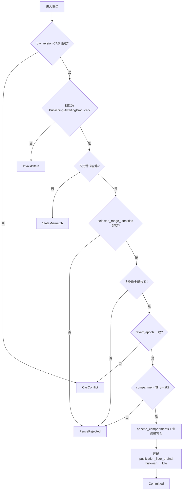

Magic Context 的历史压缩并非一次性的"总结调用"，而是一条由持久化状态机驱动的**三段式管线**：先由组装器把原始会话切片成受预算约束的 chunk 并交给外部生产者（产制），再把返回的 XML 折叠为**可发布计划**（校验），最后在一个 CAS 门控的单一事务里把计划落库（发布）。本文聚焦这三个阶段之间的契约边界——哪些数据必须被钉住、哪些检查必须在事务内重做、失败如何释放单飞租约——而不展开渲染侧的衰减与重要性呈现（见 [分区衰减渲染与重要性分级](14-fen-qu-shuai-jian-xuan-ran-yu-zhong-yao-xing-fen-ji)）与边界几何（见 [受保护尾部边界与上下文窗口几何](15-shou-bao-hu-wei-bu-bian-jie-yu-shang-xia-wen-chuang-kou-ji-he)）。

```mermaid
flowchart LR
    subgraph A[产制 Production]
        A1[assemble_historian_firing<br/>组装 chunk + 指纹 + 身份] --> A2[fire<br/>Idle → Firing]
        A2 --> A3[producer.start<br/>broca session.send]
        A3 --> A4[await_output<br/>Firing → AwaitingProducer]
    end
    subgraph B[校验 Validation]
        B1[output_received<br/>AwaitingProducer → Validating] --> B2[validate_historian_output<br/>纯函数·无副作用]
        B2 --> B3[validation_ok<br/>Validating → Publishing]
    end
    subgraph C[发布 Publication]
        C1[publish_predicate<br/>快照谓词] --> C2[publish_validated_chunk<br/>事务内重验指纹/世代]
        C2 --> C3[publish_historian_chunk<br/>CAS 提交]
        C3 --> C4[tx_committed<br/>Publishing → Idle]
    end
    A4 --> B1
    B3 --> C1
```

## 单飞状态机：把编排状态放进 CAS 行

Historian 的相位不是一个内存标志位，而是持久化进 `ModuleMeta` 的枚举：`Idle → Firing → AwaitingProducer → Validating → Publishing`。之所以把它放在 meta 里，是因为守护缓存状态提交的同一套 `row_version` CAS 也就同时守护了 writer 的编排——一个过期的 producer 永远无法对着更新的模块状态完成发布。每个相位转换都是一个**校验前置条件**的纯函数：`producer_started` 只在 `Firing` 上允许，`output_received` 只在 `AwaitingProducer` 上允许，`validation_ok` 只在 `Validating` 上允许，`tx_committed` 只在 `Publishing` 上允许；任何不匹配都会返回 `InvalidTransition`，而不是静默降级。

Sources: [lib.rs](crates/mc-store/src/lib.rs#L3024-L3048), [historian.rs](crates/mc-module/src/historian.rs#L487-L530), [historian.rs](crates/mc-module/src/historian.rs#L2233-L2246)

单飞的实际闸门在 `fire`。它先做区间合法性检查（`from_ordinal > to_ordinal` 直接报错），再检查当前相位：**任何非 `Idle` 相位都返回 `Busy` 并原样带回旧状态**，调用方据此把这一轮判定为"已有在飞的折叠"。成功启动时它会生成新的 `firing_seq`（单调递增，`saturating_add(1)`），写入钉住的序数区间、chunk 指纹、被选中消息的内容身份、revert epoch 与 compartment-set 世代，并清除上一轮的 `last_no_fire`——因为一次成功的 fire 已经解释了此前所有的跳过理由。失败退避时间也会被继承，而不是被重置。

Sources: [historian.rs](crates/mc-module/src/historian.rs#L433-L485), [lib.rs](crates/mc-store/src/lib.rs#L3106-L3163)

`HistorianDurableState` 里的失败诊断字段值得单独说明其存在理由：producer 运行在一个被 spawn 的任务中，受监管部署永远不会捕获它的 stderr，因此连接失败、绑定失败与模型解析失败必须落进持久状态（`last_failure`）才能从 state dump 中诊断出来。`last_no_fire` 是它的"前置半场孪生体"——记录这一轮**为什么没触发**，并且带有变更门控，使稳态轮次不会反复重写该行。`consecutive_publish_failures` 则是纯诊断计数，让重复的 fence/outbox 失败变得可见而不影响任何字节。

Sources: [lib.rs](crates/mc-store/src/lib.rs#L3124-L3163), [lib.rs](crates/mc-module/src/lib.rs#L5937-L5976)

## 产制阶段：chunk 组装、身份钉扎与指纹

产制的入口是 `assemble_historian_firing`。它先加载 `HistorianAssemblySnapshot`——注意这个快照把**被截断的 compartment 列表、revert epoch 与 compartment-set 世代一起原子读取**，因为这三者共同决定了 chunk 的边界；任何分两次读取都可能产生不自洽的切片。chunk 起点由已存 compartment 的最大 `end_message` 推导：若已有 compartment，则取严格大于它且在 eligible 上界之前的**下一个真实存在的序数**；若没有任何 compartment，则取第一条非 system 的存活序数。找不到候选就意味着 `EmptyChunk`，而不是"从 0 开始"。

Sources: [historian_chunk.rs](crates/mc-module/src/historian_chunk.rs#L747-L801), [lib.rs](crates/mc-store/src/lib.rs#L3561-L3568)

具体切片由 `build_historian_chunk` 完成。它按序扫描非合成消息，逐条喂给 `Builder`；builder 一旦拒绝某条序数（含预算耗尽）就立刻停止，形成"以 token 预算为硬约束、以消息边界为原子单位"的前缀。这里有三个用于后续校验的副产品：`present_ordinals`（全部非合成输入序数，允许**稀疏**，因为 claude-code 代理可能永久退休序数）、`tool_only_ranges`（纯工具噪声区间，其内部空隙可任意大小地愈合）、`completed_tool_arcs`（已完成的调用/结果区间，其终端边界必须保持原子）。`has_more` 的判定刻意使用"最远扫描到的序数"而非"最后渲染的行"，否则被过滤的尾部会被反复喂给 historian。

Sources: [historian_chunk.rs](crates/mc-module/src/historian_chunk.rs#L493-L604)

在把 chunk 交给模型之前，组装器会钉扎两类身份材料。第一类是 `selected_range_identities`：对区间内每条消息记录 `mid` 与其规范化的 block 身份向量；若某条消息在 `block_identities_by_mid` 中缺失，装配直接以 `MissingBlockIdentity` 拒绝发车——宁可不着火，也不发一个无法在发布点验证新鲜度的 chunk。第二类是 `chunk_fingerprint`：由有序的 `(id, kind, 字节长度)` 三元组以 `|` 连接而成，刻意为**可读**而非哈希，使诊断中能直接看出是哪一段漂移。指纹的语义刻意设计成"插入/删除与类型/id 变更会失效，而同长度内容改写不会失效"——精确的字节级新鲜度由上面的身份向量负责。

Sources: [historian_chunk.rs](crates/mc-module/src/historian_chunk.rs#L881-L898), [historian.rs](crates/mc-module/src/historian.rs#L231-L251)

产制还负责两处"不该发车"的短路。其一是**substance floor**：当 chunk 的 token 估计低于 `min_chunk_tokens` 且既不处于紧急态、fold 也不是唯一回收路径时，返回 `BelowBudget`——因为工具弧会折叠成单行 `TC:` 摘要，一个工具主导的尾部可能原始字节巨大却在 chunk 文本上毫无实质。其二是**过滤噪声标记**：当区间内所有行都被过滤掉、且逐条核对确认"零过滤即可完整覆盖"时，组装器会追加一条 `episode_type = "filtered-noise"` 的标记 compartment，使这段区间不再被反复读取。只有完整观测到的范围才允许被声明为噪声。

Sources: [historian_chunk.rs](crates/mc-module/src/historian_chunk.rs#L809-L879)

提示词的组装是纯函数式的，被刻意隔离在 `historian_prompt.rs` 中：builder 只接收已加载的行与字符串，不读 store、不取时钟、不检查 provider 状态，因此它可以被 golden 测试逐字节比对。每次运行都会注入固定数量的校准示例（`SEED_FLOOR`）与会话内参考 compartment 窗口（`SESSION_REF_WINDOW`），以及用于去重的记忆块与内容语言指令。当校验阶段拒绝输出时，`build_historian_repair_prompt` 会把失败原因与原始输出拼进下一轮提示，从而在同一条模型回退链内完成自修复，而不是直接放弃整轮折叠。

Sources: [historian_prompt.rs](crates/mc-module/src/historian_prompt.rs#L1-L16), [historian_prompt.rs](crates/mc-module/src/historian_prompt.rs#L151-L181), [historian.rs](crates/mc-module/src/historian.rs#L1902-L1920)

模型调用本身只讲 JSON session wire，不依赖 llm-runner 的任何 Rust crate——这使 Magic Context 保持为 origin-agnostic 的消费模块。`start_with_generation` 发送 `session.send`，其中 model 以**首个斜杠**切分为 `{provider, model}` 嵌套对象，`system` 走角色作用域的字段而非拼接进用户提示（校验契约假定模型是以 system 消息形式看到角色指引的），并默认请求 32k 输出预算——因为 4k 的默认值会在真实的 50k 输入 chunk 上把 XML 从中间截断。等待侧刻意从 `"start"` 而非游标订阅，重放语义是幂等的，因为校验与发布期的 CAS 检查本身就是幂等的。

Sources: [historian_producer.rs](crates/mc-module/src/historian_producer.rs#L1-L5), [historian_producer.rs](crates/mc-module/src/historian_producer.rs#L34-L38), [historian_producer.rs](crates/mc-module/src/historian_producer.rs#L666-L733), [historian_producer.rs](crates/mc-module/src/historian_producer.rs#L810-L826)

| 阶段产物 | 定义位置 | 后续被谁消费 |
|---|---|---|
| `chunk_fingerprint` | `compute_chunk_fingerprint` | 发布前与提交点两次比对 |
| `selected_range_identities` | `assemble_historian_firing` | 事务内逐消息比对 `block_identity_by_mid` |
| `compartment_set_generation` | 快照原子读取 | 事务内 `MAX(sequence), COUNT(*)` 重验 |
| `expected_revert_epoch` | 快照原子读取 | 事务内与 `meta.revert_epoch` 比对 |
| `raw_chunk_messages` | 组装期序列化 | 落库供 `ctx_expand` 全量恢复 |

Sources: [historian.rs](crates/mc-module/src/historian.rs#L245-L251), [lib.rs](crates/mc-store/src/lib.rs#L13009-L13046), [lib.rs](crates/mc-store/src/lib.rs#L3593-L3596)

## 校验阶段：无副作用的可发布计划

校验模块的首要设计约束是**纯**：它接收 historian 的原始文本加上调用方提供的 chunk/store 元数据，返回一个完整的发布计划或一个校验错误，绝不触碰数据库。这正是它能让持久化路径 fail-closed 的原因——畸形的区间、过期的 chunk、错误的 message-id 端点、边界愈合决策，全部在任何写操作成为可能之前被解决。它的输出类型是 `ValidatedChunk`：带有已解析端点的 compartment、事实、事件、primer 候选、用户观测，外加 `unprocessed_from` 与 `discarded_last` 两个发布元字段。

Sources: [historian_validate.rs](crates/mc-module/src/historian_validate.rs#L1-L9), [historian_validate.rs](crates/mc-module/src/historian_validate.rs#L225-L238)

解析的第一层是**信封强制**。`parse_compartment_output` 要求文档恰好是一个完整的 `<output>` 根文档：没有根则报错，根体内再次出现 `<output>` 也报错。而根内部的各类结构（compartment、facts、events、primer）则沿用 TypeScript 宿主的宽松提取语义——畸形内部 XML 只会产出更少可用结构供后续校验评估，不会让整轮直接崩溃。这种"外严内宽"的组合刻意对齐了 TS oracle，并由 golden 用例锁定。

Sources: [historian_validate.rs](crates/mc-module/src/historian_validate.rs#L261-L280), [historian_validate.rs](crates/mc-module/src/historian_validate.rs#L1383-L1414)

第二层是**覆盖与顺序校验**，在解析之前就执行：`validate_chunk_coverage` 检查 chunk 自身的序数一致性，`validate_stored_compartments` 检查已存区间严格递增。随后是最关键的"接续"断言——若已存 compartment 存在，chunk 的起点必须严格大于最后一个 compartment 的 `end_message`，并且等于"下一个真实存在的序数"（在存在该序数时）。这条断言把"稀疏坐标下的续接"与"重复读取"区分开来。

Sources: [historian_validate.rs](crates/mc-module/src/historian_validate.rs#L456-L484), [historian_validate.rs](crates/mc-module/src/historian_validate.rs#L643-L676)

第三层是**边界愈合**，它承认模型并不总能精确对齐工具调用弧。`heal_compartment_gaps` 只在 `tool_only_ranges` 内部愈合空隙（被省略的行本就是工具噪声，而非叙事）；`heal_terminal_completed_tool_arc` 则处理终端边界，并在 `map_parsed_compartments_to_chunk` 把序数映射回真实 message-id 后，再次检查终端边界是否切开了已完成的工具调用/结果弧——若是，直接以"terminal boundary splits a completed tool invocation/result arc"拒绝。注意 compartment 必须落在**可锚定**的块上（`ChunkLine.anchorable`），否则发布端会铸出一个不可能的覆盖边界。

Sources: [historian_validate.rs](crates/mc-module/src/historian_validate.rs#L486-L534), [historian_validate.rs](crates/mc-module/src/historian_validate.rs#L28-L44), [historian_validate.rs](crates/mc-module/src/historian_validate.rs#L899-L933)

第四层是 **discard-last 前瞻不足愈合**，它是"分区"语义的核心。当一个非紧急、非强制保留的运行产出至少两个 compartment 时，若**最后一个 compartment 的终点距 chunk 终点的前瞻距离不超过 `BOUNDARY_HEALING_SLACK`（2 个序数）**，则该 compartment 会被弹出并置 `discarded_last = true`——下一轮带着真实前瞻重新推导它。还有一个安全阀：若弹出后会让前一个 compartment 的终点切开一条已完成的工具弧，则不做弹出。前瞻距离刻意使用**数值序数差**而非"存活序数个数"，因为退休的消息号在 TS 语义里仍构成距离。

Sources: [historian_validate.rs](crates/mc-module/src/historian_validate.rs#L536-L570), [historian_validate.rs](crates/mc-module/src/historian_validate.rs#L19)

discard-last 的直接后果是**整个输出的锚点失效**：因此所有侧信道（facts / events / primer / user_observations）都会经由 `keep_side_channel` 过滤，只保留指向仍被持久化的 compartment 的条目——否则一次丢弃会造成下一次重读时的重复写入。强制保留最后一次的 wrapup chunk 则采用更严格的规则：events 只保留指向 `1..persisted_count`（不含最后一格）的条目，而 facts / primer / user_observations 全部丢弃。最后，校验还强制**前向进展**：最终持久化的终点不得小于起始偏移，否则以 `no forward progress beyond raw message N` 拒绝整轮。

Sources: [historian_validate.rs](crates/mc-module/src/historian_validate.rs#L572-L640)

`unprocessed_from` 的语义需要特别澄清：它是 `last_new_end + 1`，是一个**发布地板（publication floor）**，而**不是**"下一个整数序数必然存在"的承诺。消费腿可能永久退休序数，因此下游扫描必须把它当作下界，并推进到下一个真实存在的输入消息。这个值最终被写入 `meta.publication_floor_ordinal`，并参与边界解析中对已完成工具弧的围栏判定。

Sources: [historian_validate.rs](crates/mc-module/src/historian_validate.rs#L632-L640), [lib.rs](crates/mc-store/src/lib.rs#L13111-L13115), [boundary.rs](crates/mc-module/src/boundary.rs#L1372-L1392)

## 发布阶段：把全部检查搬进一个事务

发布与校验之间的边界函数是 `publish_output_from_awaiting`，它把状态机推进与三次持久化交错在一起。它先执行 `output_received`（`AwaitingProducer → Validating`）并落库，再跑校验；校验失败则带着 backoff 与 `validate rejected: ...` 详情 abandon 回 `Idle`。若输出被标记 `length_capped`（任何模型步命中输出上限），**在校验之前就直接拒绝**——因为一个可能被截断的文档不能被当作完整文档解析。校验通过后推进到 `Publishing` 并落库，随即构造 `publish_predicate`。

Sources: [historian.rs](crates/mc-module/src/historian.rs#L2113-L2208), [historian_producer.rs](crates/mc-module/src/historian_producer.rs#L210-L217)

这里有一个刻意的设计选择：`publish_validated_chunk` **不做独立的前置新鲜度检查**，因为独立预检可能提前返回并把状态遗留在 `Publishing`。所有提交点检查都住在 `publish_validated_chunk` 内部，并且它会在返回拒绝前 abandon 匹配中的那次 firing。同时，调用方沿用 `Publishing` 转换写下的 `row_version` 作为 CAS 期望值——而不是在这里重新加载，否则会采纳一个竞争同步的版本号，从而抹掉本该退休这次过期运行的 CAS 冲突。

Sources: [historian.rs](crates/mc-module/src/historian.rs#L643-L668), [historian.rs](crates/mc-module/src/historian.rs#L2178-L2206)

`publish_validated_chunk` 先把 `ValidatedChunk` 投影成存储行形状：`to_stored_compartment` 用 `boundary_dates` 补齐起止日期、用 P1 是否存在推导 legacy 标志（`p1` 非空即为 v2），`to_store_fact` / `to_store_event` / `to_store_primer` / `to_store_user_observation` 各自把侧信道候选映射为带来源溯源的持久结构。随后它把请求交给 `store.publish_historian_chunk`，或者在存在 `publication_fence` 时交给围栏实现。

Sources: [historian.rs](crates/mc-module/src/historian.rs#L113-L147), [historian.rs](crates/mc-module/src/historian.rs#L670-L750), [historian.rs](crates/mc-module/src/historian.rs#L611-L617)

事务内部的第一件事是 **CAS 与相位校验**：读 `mc_cache_state` 的 `row_version` 与 meta，核对期望版本；反序列化 `ModuleMeta`；并要求 `historian.state` 仍处于 `Publishing` 或 `AwaitingProducer`（后者是为重启后的重连路径留的口子）。紧接着是**五元谓词比对**：`firing_seq`、`producer_run_id`、`chunk_fingerprint`、`selected_range_identities`、`compartment_set_generation` 必须与调用方快照完全一致。

Sources: [lib.rs](crates/mc-store/src/lib.rs#L12952-L12998), [lib.rs](crates/mc-store/src/lib.rs#L3521-L3533)

谓词之后是三层**内容新鲜度围栏**。第一层：若 `selected_range_identities` 为空，直接以 `FenceRejected` 拒绝——空向量意味着这次 firing 早于身份持久化，**无法证明**被选中的内容仍然是最新的。第二层：逐条比对 `block_identity_by_mid`，任何一条消息的块身份发生变化都会以 `selected historian message <mid> changed after firing` 拒绝。第三层：在事务内重算 `CompartmentSetGeneration`（`MAX(sequence)` 与 `COUNT(*)`）并要求与谓词一致——`count` 字段的存在正是为了关闭"最大序号相同但集合组成不同"这一 `max_sequence` 无法区分的序列复用情形。

Sources: [lib.rs](crates/mc-store/src/lib.rs#L13000-L13046), [lib.rs](crates/mc-store/src/lib.rs#L3554-L3559)

Sources: [lib.rs](crates/mc-store/src/lib.rs#L12951-L13133)

revert epoch 的检查被归入 `CasConflict` 而非 `FenceRejected`，这是有意的分类差异：消息是"revert epoch mismatch (session was re-cut mid-firing)"，其语义是会话在飞行中被重切，应当等待冷却后以新快照重来，而不是像本地围栏拒绝那样立即重试。写入阶段则按顺序进行：`append_compartments_tx` 检测区间重叠（重叠即返回 `CompartmentOverlap` 类型化错误，作为乐观围栏之后的存储兜底），随后写入 chunk transcript 与原始消息、提升事实、并追加事件 / primer / 用户观测。

Sources: [lib.rs](crates/mc-store/src/lib.rs#L13018-L13110)

侧信道的失败处理遵循一条明确原则：**它们与核心发布共享同一个被接受的事务，但失败不得中止核心 historian 进展**。事件、primer、用户观测的写入错误被显式忽略，且刻意不进入重试队列。历史上遗留的 `mc_historian_side_channel_outbox` 表仍在被排空（`drain_historian_side_channels`），以便滚动升级期间不遗留数据，但新的发布路径已经不再入队。

Sources: [lib.rs](crates/mc-store/src/lib.rs#L13085-L13110), [lib.rs](crates/mc-store/src/lib.rs#L13183-L13231)

事务的收尾是**唯一允许把折叠结果暴露给渲染层的通道**：它把 `publication_floor_ordinal` 提升为历史最大值，把 `meta.historian` 归零为成功后空闲态（保留 `firing_seq` 与 `recent_decisions`），调用 `complete_latest_fire` 记录完成时刻与应用行版本，最后以 `WHERE row_version = current` 的乐观条件写回。**发布从不直接修改缓存的渲染状态**——新 compartment 只是以 `sequence > folded_compartment_seq` 的身份占用 m1 位置，直到下一次自然 HARD 折叠把它们并入冻结的 m0 基线。

Sources: [lib.rs](crates/mc-store/src/lib.rs#L13111-L13133), [compartment_coverage.rs](crates/mc-module/src/compartment_coverage.rs#L205-L214), [historian.rs](crates/mc-module/src/historian.rs#L2248-L2254)

## 失败分类与重启恢复

发布路径的错误处理区分三种性质截然不同的失败。**本地围栏拒绝**（`FenceRejected`、`CompartmentOverlap`）是快速本地竞争——调用方的快照在轮次中途被退休——因此它把匹配的 firing 归零为 `Idle` 且**不设失败冷却**，让下一次用新快照的立即重试得以被接受，而不是读一分钟的 `backoff_active`。**CAS 冲突**则带详情与冷却 abandon。**其他发布错误**发生在 producer 已完成其工作之后，因此刻意**保留 producer run** 以供正常恢复路径使用，仅递增 `consecutive_publish_failures` 使重复失败保持可见。

Sources: [historian.rs](crates/mc-module/src/historian.rs#L751-L814), [historian.rs](crates/mc-module/src/historian.rs#L2256-L2306)

校验拒绝的语义在模型链层面被重新解释为**模型局部输出失败**：它不会立刻终结整轮，而是先耗尽配置的回退链——若还有合格模型，就用 repair prompt 继续下一轮尝试；只有当回退链耗尽时才把拒绝向上返回。

Sources: [historian.rs](crates/mc-module/src/historian.rs#L1900-L1922)

进程重启后的解释逻辑集中在 `handle_restart_load`，它把持久相位映射成三种动作。观察到 `Idle` 意味着发布**已经提交**，返回 `Done`；观察到 `AwaitingProducer` 且两个 producer 标识齐备，返回 `ReattachProducer`，让重连路径绑定同一 producer 会话并读取终端输出；观察到 `Firing`、`Validating` 或 `Publishing`，则意味着事务**没有提交**，于是 abandon 这次陈旧的单飞并允许未来重新触发。`reattach_historian_producer` 进一步查询 producer 的 `run.status`：`Missing` 或状态查询失败都走 abandon 并返回 `RefireEligible`，只有 `Terminal` / `Active` 才继续等待输出。

Sources: [historian.rs](crates/mc-module/src/historian.rs#L831-L869), [historian.rs](crates/mc-module/src/historian.rs#L1984-L2011)

超时预算的取值本身承载了教训。单次等待被放在 600 秒（而非 120 秒），因为 historian 合法地生成上万输出 token，在 flash 级模型上可能跑几分钟——一次 120 秒窗口曾在 rig 上于运行**仍在成功收尾**时放弃它，而 60 秒的恢复重排则负责抢救那批"在主等待放弃后片刻才落地"的耐久输出。折叠是后台操作、从不延迟敏感：多等一会儿再发布，永远优于放弃一个已完成的运行并重新发起整轮 50k 输入。

Sources: [historian_producer.rs](crates/mc-module/src/historian_producer.rs#L48-L59), [historian_producer.rs](crates/mc-module/src/historian_producer.rs#L751-L765)

与此同时，transform 路径内的驱动是**受预算约束的**：`run_historian_firing_inline` 把 firing 作为独立任务 spawn，再用 `tokio::time::timeout` 等待其 JoinHandle。这里的关键语义是——JoinHandle 超时**不会取消任务**，因此超时后请求降级为已经算好的紧急输出，而那次 firing 继续运行，稍后由某一轮 pass 拾取已发布的折叠。若改为在驱动中途取消，反而会把持久状态遗留在崩溃恢复才能修复的半途。

Sources: [lib.rs](crates/mc-module/src/lib.rs#L6061-L6106)

## 触发决策证据与运行遥测

产制/校验/发布之外，还有一层"为什么没发生"的证据必须被持久化，因为受监管的 rig 读不到 transform 响应的诊断块。`record_no_fire` 把判定写进 `last_no_fire` 与 `recent_decisions`，并采用**量化变更门控**：等价的 no-fire 观测不会重写行。`record_fire_decision` 则在把 firing 交给异步 worker **之前**持久化这条 fire 决策，转换时顺便补上 producer 模型。`recent_decisions` 是有界历史（上限 16 条）：fire 决策总是追加，而重复的量化 no-fire 观测被抑制。

Sources: [lib.rs](crates/mc-module/src/lib.rs#L5915-L5976), [lib.rs](crates/mc-store/src/lib.rs#L3065-L3095), [lib.rs](crates/mc-store/src/lib.rs#L3187-L3200)

跳过原因存在**双词汇**：Rust 侧保留原始的 `HistorianNoFireCause` 变体名供事故工具使用，而 `canonical_cause` 把决策映射到 TypeScript 操作者词汇。组装期的具体原因（`NoModels`、`EmptyEligibleRange`、`EmptyChunk`、`FilteredNoiseSkipped`、`BelowBudget`、`MissingBlockIdentity`）通过 `cause()` 收敛到这一对词汇表上。

Sources: [historian.rs](crates/mc-module/src/historian.rs#L259-L294), [historian_chunk.rs](crates/mc-module/src/historian_chunk.rs#L629-L662)

在 TypeScript 宿主侧，每次 historian 运行都会写入一行 `historian_runs` 遥测：记录输入（chunk 序数区间）与输出形状（compartment / facts / events / importance 分布）以及成功/失败，并区分 `"incremental" | "recomp" | "partial-recomp" | "upgrade"` 四种运行种类与 `"success" | "failed" | "noop"` 三种状态。token 与模型名不在这张表上——它们位于外键关联的 `subagent_invocations` 行，通过 join 获取。该写入是**尽力而为**的：它从不向 historian 路径抛异常，因为遥测不得破坏压缩。

Sources: [storage-historian-runs.ts](packages/plugin/src/features/magic-context/storage-historian-runs.ts#L3-L25), [storage-historian-runs.ts](packages/plugin/src/features/magic-context/storage-historian-runs.ts#L66-L90)

## 契约速查

| 不变式 | 保证机制 | 违反时的后果 |
|---|---|---|
| 同一会话同时只有一次折叠在飞 | 持久相位 + `fire` 的 `Busy` 返回 | 返回 `Busy`，本轮不产生字节 |
| producer 输出对应它实际读到的 chunk | `chunk_fingerprint` 双点比对 | `FingerprintMismatch` 并 abandon |
| 被选消息的块内容未被改写 | 事务内逐 `mid` 比对块身份 | `FenceRejected` |
| compartment 集合未被外部同步插入 | 事务内重算 `max_sequence + count` | `FenceRejected` |
| 会话未在飞行中被重切 | 事务内比对 `revert_epoch` | `CasConflict` |
| 不存在不自洽的覆盖边界 | 校验期的可锚定性 + 严格递增检查 | `ValidationRejected` |
| 被丢弃的尾格不会造成重复写入 | `keep_side_channel` 锚点过滤 | 侧信道条目被静默丢弃 |
| 发布不直接改动渲染缓存 | 结果只经 m1 序数水印表面化 | 下一次物化 pass 才可见 |

Sources: [historian.rs](crates/mc-module/src/historian.rs#L430-L485), [lib.rs](crates/mc-store/src/lib.rs#L12989-L13046), [historian_validate.rs](crates/mc-module/src/historian_validate.rs#L560-L640), [compartment_coverage.rs](crates/mc-module/src/compartment_coverage.rs#L205-L214)

**建议的继续阅读路径**：若要理解发布之后 compartment 如何被选入渲染并按键衰减、分级，请前往 [分区衰减渲染与重要性分级](14-fen-qu-shuai-jian-xuan-ran-yu-zhong-yao-xing-fen-ji)；若要理解 eligible 上界与受保护尾部如何决定 `eligible_end_ordinal`（即产制阶段的硬边界），请前往 [受保护尾部边界与上下文窗口几何](15-shou-bao-hu-wei-bu-bian-jie-yu-shang-xia-wen-chuang-kou-ji-he)；若要理解新发布的 compartment 为何只在 m1 上出现、以及折叠水印如何推进，请前往 [m[0]/m[1] 缓存布局与物化触发条件](10-m-0-m-1-huan-cun-bu-ju-yu-wu-hua-hong-fa-tiao-jian)。