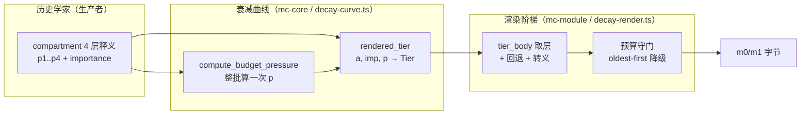
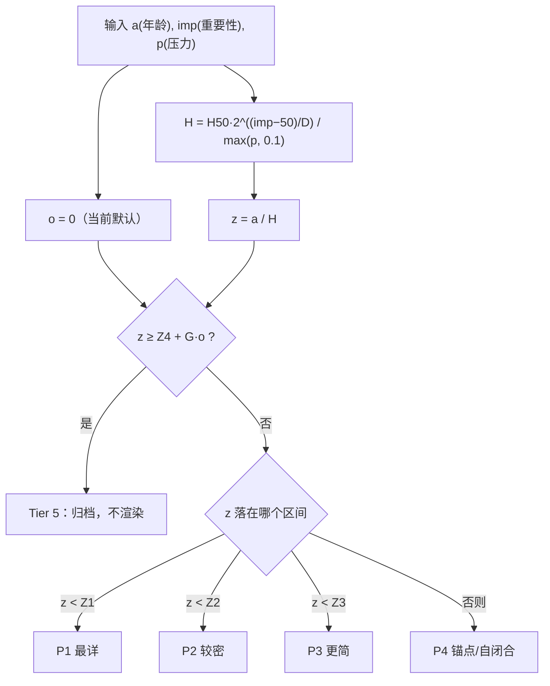
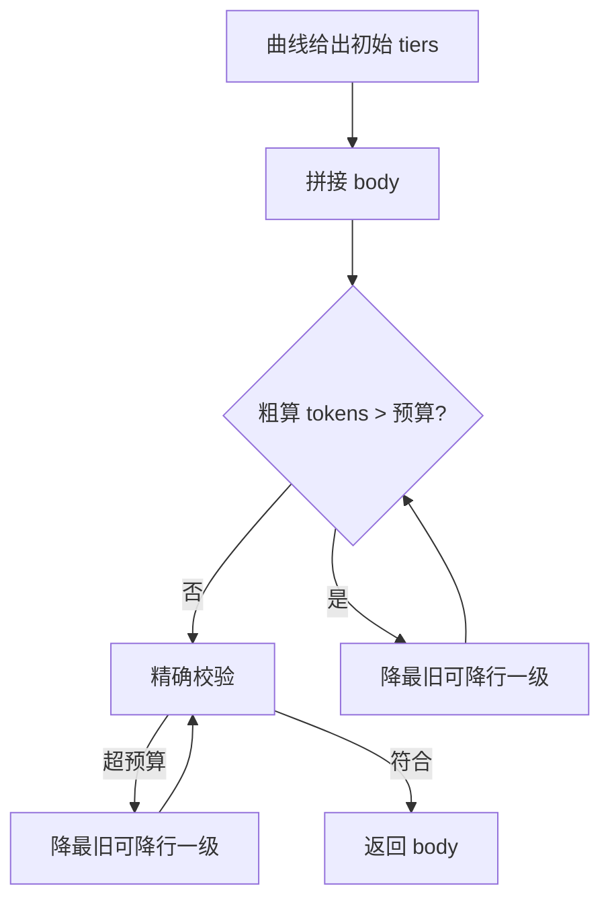

本页解释 magic-context 如何在**渲染时刻**确定性地把每个历史分区（compartment）降采样到一个具体的释义层级（P1–P4），以及 `importance` 如何被赋予"衰减速率"而非"质量分"的语义。核心机制是一条不调用 LLM 的纯函数半衰期曲线：给定分区年龄、历史学家产出的 `importance` 与实时预算压力，曲线决定该分区渲染哪一层、是否归档（P5，不渲染）。这一层替换了早期的 LLM 压缩器与逐分区 `compression_depth` 机制，是 m[0]/m[1] 缓存稳定性得以维持的关键前提——因为**同一输入必然产出同一字节**，缓存前缀不会因衰减抖动而被击穿。本页覆盖曲线数学、重要性分级语义、渲染阶梯与回退规则、m[0]/m[1] 物化与增量缓存，以及跨语言差分校验。

Sources: [decay-curve.ts](packages/plugin/src/hooks/magic-context/decay-curve.ts#L1-L24), [decay_render.rs](crates/mc-module/src/decay_render.rs#L1-L17), [ARCHITECTURE.md](ARCHITECTURE.md#L96-L103)

## 概念全景：从重要性到渲染字节

衰减渲染是一条单向数据流：历史学家产出的 `importance` 与分区的序数位置（年龄）作为**纯输入**，与整批分区算出的单一预算压力 `p` 汇合成曲线决策，再经渲染阶梯落到 markdown 字节。关键的架构分工是：**判定数学留在 `mc-core`（纯决策），字节生成留在 `mc-module`（产出字节）**，因此 `mc-core` 可以独立做差分黄金校验而不依赖分词器。

曲线的三项输入语义需要精确理解：`a` 是 **0 基年龄**（`index - 1`，新分区为 0），`imp` 是历史学家一次写入、永不更新的 1–100 重要性，`p` 是**整批分区共享**的预算压力。三者经由 `z = a / H` 折叠成单一无量纲量 `z`（以"半衰期"为单位的年龄），再与四道层级边界比较。这种"先算一次压力、再逐分区只做比较"的结构保证了 `O(H)` 的渲染成本——压力是批次级常量，逐分区决策不含迭代。

Sources: [decay.rs](crates/mc-core/src/decay.rs#L56-L71), [decay-curve.ts](packages/plugin/src/hooks/magic-context/decay-curve.ts#L57-L71), [ARCHITECTURE.md](ARCHITECTURE.md#L103)

## 半衰期曲线：参数、边界与单调不变量

曲线的形状由半衰期 `H` 定义。对重要性的处理是**指数缩放**：`H = H50 · 2^((imp−50)/D) / max(p, 0.1)`，其中 `H50 = 24`（重要性 50、压力 1 时的半衰期），`D = 25`（重要性每增加 25 点使半衰期翻倍，故 75→2×、100→4×）。压力 `p` 出现在分母，意味着更高的预算压力**缩短**半衰期、加速降级；`P_FLOOR = 0.1` 既是除零保护，也把松弛上限钉在 10×（即最高可把预算放大 10 倍）。

下表汇总了全部超参与派生常量。边界 `Z1..Z4` 是从实测的 v8.3 Flash 各层平均 token 成本推导出的对数成本空间几何均值，**不是可手调的旋钮**；超参 `H50/D/G` 才是校准面。

| 常量 | 值 | 语义 | 可调 |
|---|---|---|---|
| `H50` | 24 | 重要性 50、压力 1 的半衰期（以分区计） | 是（超参基线） |
| `D` | 25 | 使半衰期翻倍所需的重要性点数 | 是（超参基线） |
| `G` | 2 | 满锚点重叠时额外赋予 P4 的半衰期数 | 是（超参基线） |
| `Z1` | 0.201 | P1→P2 边界 | 否（派生于成本） |
| `Z2` | 0.729 | P2→P3 边界 | 否（派生于成本） |
| `Z3` | 1.322 | P3→P4 边界 | 否（派生于成本） |
| `Z4` | 2.587 | P4→P5（归档候选）边界 | 否（派生于成本） |
| `P_FLOOR` | 0.1 | 压力下限，兼作除零保护与 10× 松弛上限 | 否 |
| `TIER_COST` | `[0, 322, 109, 35, 20, 5]` | 各层平均 token 成本（索引 0 留空） | 否（实测） |

层级判定为简单的阶梯比较：`z < Z1 → P1`，`z < Z2 → P2`，`z < Z3 → P3`，`z < Z4 → P4`，否则 P5（归档）。归档谓词则为 `should_archive = z ≥ Z4 + G·o`，其中锚点重叠 `o ∈ [0,1]` 为未来的锚点抽取保留接口——**当前所有调用点都传 `o = 0`**（锚点尚非一等存储原语，仍内联在 P4 文本里），故该谓词干净地退化为 `z ≥ Z4`；`render_decayed_compartments` 与 `compute_tiers` 均显式传 `0.0`。

模型的不变量是**由构造保证**的，并各自有独立于 TS 参考实现的测试：最年轻分区恒为 P1（`a=0 → z=0`），固定重要性与压力下层级随年龄单调不降，更高重要性在同龄下提供同或更高保护，更高压力加速降级，以及**即便重要性为 100 也终将归档**（有限半衰期，无"不朽行"）。`rendered_tier` 则把归档与阶梯合成：已归档返回 5；未归档者取 `tier().min(4)`——这里的 `min(4)` 在有锚点保护时才起作用（`o > 0` 可让 `z ≥ Z4` 的行免于归档，此时 `tier()` 仍可能返回 5，钳制回 P4 以保留话题直到锚点重叠消退）。

Sources: [decay-curve.ts](packages/plugin/src/hooks/magic-context/decay-curve.ts#L26-L112), [decay.rs](crates/mc-core/src/decay.rs#L21-L124), [decay.rs](crates/mc-core/src/decay.rs#L154-L206)

## 重要性分级：作为衰减速率，而非分类分

`importance` 是历史学家在创建分区时写入、**此后永不更新**的 1–100 整数。它的语义被显式定义为**衰减速率**，而非工作的"质量"或"类别"：高重要性的分区会在 P1/P2 停留更久才落到 P3/P4，低重要性则迅速衰减到 P4。提示词用一句话锚定提问方式——不是"这是哪类工作"，而是**"这需要在高保真记忆中存活多久，其细节才可安全丢失"**——并给出以"三个月后回顾"为尺度的模拟框架。

分级采用五档经验标尺，每档对应一个"需要在记忆中存活多久"的承诺，而非活动类型。提示词显式列出反模式：**不要**用"当时工作感觉多大"来打分（一段耗时很久却没产出持久结论的调查应为低重要性；一个 5 行的、确立了项目级不变量的修复应为高重要性），也**不要**按活动类型绑定（"所有架构决策 80+、所有 bug 50"是错模型）。

| 档位 | 语义承诺 | 典型场景 |
|---|---|---|
| 85–100 | 无限期需完整细节 | 确立项目级约束、不变量或决策；丢失细节会导致未来做错选择 |
| 60–84 | 需数月内准确回忆 | 有具体产出的实质工作；可搜索恢复，但高保真回忆有价值 |
| 30–59 | 需数周内粗略回忆 | 例行工作，结果已在代码库状态中；细节可从当前代码恢复 |
| 10–29 | 需数日粗略回忆 | 战术工作、清理、重启、排序决策；遗忘可自校正 |
| 1–9 | 几乎无需回忆 | 纯行为噪声、立即被反转的假起手、状态 ping |

一个具体的"要活多久"标尺可以从常量反推：重要性 50、压力 1 时半衰期为 24 个分区，`z` 边界意味着 P1 约覆盖 5 个分区、P2 到约 17、P3 到约 31、P4 到约 62，第 63 个以上才进入归档候选；重要性 100 把 H 提到 96（翻 4 倍保护），重要性 25 降到 12，重要性 1 仅约 6.2。这正解释了提示词中"高重要性分区在许多轮（pass）内保持 P1/P2"的说法。

持久化侧对重要性采取**宽松接收、渲染时钳制**的策略。解析层用 `\bimportance="(\d+)"` 仅捕获正整数，**不在此处做范围校验**；缺失时默认为 50（`unwrap_or(50)` / `default_importance` 返回 50），存储 schema 为 `importance INTEGER NOT NULL DEFAULT 50`。真正的 1–100 钳制发生在渲染前——`compute_tiers` 用 `.clamp(1, 100)`，`mc-core` 的 `clamp_importance` 在 `z_value` 内再次钳制，TS 侧则用 `Math.max(1, Math.min(100, …))` 双保险。这种分工避免了越界值被静默丢弃，同时保证曲线数学永远看到合法输入。

Sources: [historian-prompt.generated.ts](packages/plugin/src/hooks/magic-context/historian-prompt.generated.ts#L128-L166), [historian_validate.rs](crates/mc-module/src/historian_validate.rs#L306-L307), [historian_validate.rs](crates/mc-module/src/historian_validate.rs#L1193-L1196), [historian.rs](crates/mc-module/src/historian.rs#L132), [decay_render.rs](crates/mc-module/src/decay_render.rs#L283-L290), [mc-store/src/lib.rs](crates/mc-store/src/lib.rs#L497-L513), [lib.rs](crates/mc-module/src/lib.rs#L1871-L1873)

## 预算压力：单遍自整定与档案成本诚实

预算压力 `p` 的推导利用了 `H ∝ 1/p` 的一个便利性质：当压力按 `1/p` 缩放时，落入各层的分区数量也近似按 `1/p` 缩放，因此整批成本满足 `C(p) ≈ C(1)/p`。于是令 `p = C(1)/B`（B 为历史预算）即可使 `C(p) ≈ B`——**单次前向遍历即可自整定到预算**，无需迭代求解。计算 `C(1)` 时用 `tier(index, imp, 1.0)` 求每个分区的"自然层级"，再累加其 `TIER_COST`。

一个微妙的**成本诚实**细节：已归档（自然层级 ≥ 5）的分区在渲染时产出空串，其占位成本（P5 的 5 token）**不计入** `C(1)`——注释明确指出，对永不出现的字节收费会制造幻影压力。该单遍算法在极紧预算（<8K）下可能超支约 30%，为此 TS 侧提供两遍版本 `computeBudgetPressureTwoPass`：在单遍压力下重算实际成本，若仍超支 >10% 则按 `p · actualCost/budget` 比例放大压力，约 1% 内收敛、额外成本约 2µs。`P_FLOOR = 0.1` 作为压力下限同样在此处兜底。

Sources: [decay-curve.ts](packages/plugin/src/hooks/magic-context/decay-curve.ts#L114-L156), [decay.rs](crates/mc-core/src/decay.rs#L126-L145)

## 分级渲染阶梯：取层、回退与归档省略

渲染阶段把曲线给出的层级号落到实际字节。对 v2 行（`p1` 为非空串），`tier_body` 先取被请求的层（`p1..p4` 索引化），若该层为 `None` 则**向更密的低索引层回退**取第一个非空体，最后兜底到扁平的 `content`；随后统一做 XML 转义并调 `guard_compartment_body`（把正文中形如 `## ` 的行缩进，防止正文伪造新的分区边界）。层级 ≥ 5 直接返回空串（归档省略）。

**"是否 v2 行"的判定只看 `p1` 是否非空**，这是链条上一处关键的契约对齐：它同时匹配解析器契约（`p1.length > 0`）与升级谓词（`legacy=1 OR p1 IS NULL OR p1=''`），从而保证被中断升级留下的**畸形伪 v2 状态**（`legacy=0` 但分层从未填充）走扁平 `content` 路径，而不会渲染成空的标题行而静默丢失正文。注意一个**合法 v2 行仍可有空 `p4`**（即自闭合的"仅标题"标题），此时 `p1` 非空，故由分层路径处理，产出只含标题的行。

Legacy（pre-v2 扁平内容）行不受曲线支配，而是走**确定性截断**：起始层级为 P3（正文含行首 `U:` 时）或 P4（否则）；P1 全量，P2 截断至 1200 字符，P3 及以上截断至 420 字符，截断按 **UTF-16 码元**执行以精确复刻 JavaScript `String.prototype.slice`（跨越星光面的切分会保留前导代理项作为内部标记，再在响应编码时转成 JS 的 `\udxxx` 转义）。

| 行类型 | 起始层级来源 | 取体方式 | P2/P3+ 行为 |
|---|---|---|---|
| v2 分层行（`p1` 非空） | 衰减曲线 `rendered_tier` | `tier_body` 取层 + 向密层回退 | 用该层原文，无字符截断 |
| Legacy 行（`legacy=1`） | P3（含 `U:`）或 P4 | 扁平 `content` | 1200 / 420 UTF-16 截断 |
| 畸形伪 v2（`p1` 为空） | 同 Legacy 分支 | 扁平 `content` | 同 Legacy |

曲线索引的分配也有明确的**预算诚实**规则：`compute_tiers` 先从"是否 legacy"分开处理，legacy 行用固定截断、**被排除在压力输入之外**，v2 行的曲线索引则按 v2 序数从最新（1）重新编号。这样混合会话中无关 legacy 行的固定成本就不会把 v2 释义误降级。空载荷行（`is_no_content`，标题与所有层皆为空）在渲染前被过滤——它们推进覆盖但不构成摘要或衰减输入。

Sources: [decay-render.ts](packages/plugin/src/hooks/magic-context/decay-render.ts#L46-L141), [decay_render.rs](crates/mc-module/src/decay_render.rs#L92-L261), [decay_render.rs](crates/mc-module/src/decay_render.rs#L263-L314), [decay_render.rs](crates/mc-module/src/decay_render.rs#L196-L205)

## 预算守门：oldest-first 漂移防护

曲线本身已把成本整定到预算，但估计漂移或极紧预算仍可能超支，因此渲染器在曲线选层之后追加一层**最旧优先降级**的守门循环。逻辑要点：只降"最旧的仍可降行的分区"（跳过已到 P5 的），每次降一级并增量更新运行 token 和；循环设 `guard = 分区数 × 5` 的硬上限，防止在极紧预算（甚至所有 P4 都超支）下无限循环。TS 实现先做一次"记忆化计数之和"的快速检查，再对最终拼接体做精确检查（因为分隔符与边界处的分词器效应只在拼接后可见）。

Rust 侧的 `PreparedDecay` 是同一逻辑的**增量缓存**版本：它按 `(分区, 层级)` 缓存已渲染文本及其段落计数（`final_count`/`continued_count`），只渲染曲线或降级循环真正访问过的层级；守门比较用 `continued_total − last.continued_count + last.final_count` 这一"除最后一段外全为续接段"的技巧，判断拼接体是否超预算。`PreparedDecay` 的关键前提是：**重试只改变压力，不改变层级字节**，因此缓存跨重试复用，从而把 `decay_render_ms` 与 `tier_tokenize_ms` 的计时分离出来供诊断。

Sources: [decay-render.ts](packages/plugin/src/hooks/magic-context/decay-render.ts#L188-L263), [decay_render.rs](crates/mc-module/src/decay_render.rs#L316-L457)

## m[0]/m[1] 物化：折叠时重分层与增量缓存

衰减重分层**只在 HARD 折叠时发生**——SOFT 传递绝不重分层，否则会改动 m[0] 字节并击穿缓存。这一约束是通道生命周期的直接后果：m[0] 是冻结的累积基线，m[1] 是易变增量。

新分区在 m[1] 中**始终以 P1 渲染**（全保真，新近增量不施加衰减），而在下一次 HARD 折叠加材料化进 m[0] 时才由曲线重新分层。Rust 的 `render_new_compartments` 与 TS 的 `new-compartments` 块都调用 `render_compartment_at_tier(c, 1)` / `renderCompartmentAtTier(compartment, 1)` 强制 P1，且都过滤掉空载荷行。

m[0] 物化外层还有一层**压力重试循环**以吸收估计漂移：先以 `decay_pressure_multiplier = 1` 渲染，若 `<session-history>` 切片 token 超过 `budget × 1.05`，则把乘数 `×1.15` 并重渲，最多 3 次。其精妙之处在于：乘数并不直接进入曲线，而是映射为**更紧的有效预算** `effective_budget = history_budget_tokens / max(1, multiplier)`，从而让 `decay-curve.ts` 始终是压力数学的唯一来源（TS 侧 `renderM0` 与 Rust 侧 `render_m0` 都如此）。Rust 的 `PreparedDecay::render` 在增量路径中直接接收 `inputs.history_budget_tokens / decay_pressure_multiplier`，与 TS 语义一致。

Sources: [ARCHITECTURE.md](ARCHITECTURE.md#L50), [m1_compose.rs](crates/mc-module/src/m1_compose.rs#L308-L327), [memory_render.rs](crates/mc-module/src/memory_render.rs#L305-L323), [inject-compartments.ts](packages/plugin/src/hooks/magic-context/inject-compartments.ts#L2654-L2660), [m0_compose.rs](crates/mc-module/src/m0_compose.rs#L360-L410), [memory_render.rs](crates/mc-module/src/memory_render.rs#L225-L230), [inject-compartments.ts](packages/plugin/src/hooks/magic-context/inject-compartments.ts#L2076-L2084)

## 确定性与跨语言差分校验

这一层必须满足的不变量是**模块内确定性**（INTRA-module determinism）：相同输入 → 相同层级 → 跨传递相同渲染字节。TS 与 Rust 都用 `f64` 计算，同代码同结果，"免费"获得该性质。与参考 TS 的**逐位一致**是开发期的交叉校验，而非运行时不变式——目标是两者只有一个实现真正渲染。

校验由三组黄金夹具承担，全部由 `gen-golden.ts` 以生产 `decay-curve.ts`/`decay-render.ts` 为**oracle** 生成：

| 夹具 | 位置 | 覆盖内容 |
|---|---|---|
| `decay-golden.json` | `mc-core/testdata/` | 层级 / 归档 / 渲染层级网格，年龄 × 重要性 × 压力，另含预算压力案例 |
| `render-golden.json` | `mc-module/testdata/` | 宽松预算下的纯曲线渲染：P1–P4 取体、XML 安全单行标题、转义、空 P4 仅标题、legacy 截断（含星光面 UTF-16 边界）、伪 v2 回退、混合会话 |
| `render-tight-golden.json` | `mc-module/testdata/` | 紧预算下守门循环端到端（含 CJK/UTF-8 池，验证真实分词器优于 char/N 代理） |

`decay_golden_matches_reference` 对网格做**精确匹配**（期望一致，边界 ULP 分歧应调查而非自动容忍）；`render_golden_matches_reference` 用宽松预算让 TS 估计守门永不触发，从而使注入 no-op 守门的 Rust 端口产出纯曲线驱动、**估计器无关**的字节，并额外校验 `body_utf16_hex` 形式的 UTF-16 逐位一致；紧预算夹具则让两端都用**逐位一致的分词器**（`mc_tokenizer::estimate_tokens`）测量，故必须一致。TS 参考侧 `decay-curve.ts` 与 Rust `decay.rs` 的注释都强调：超参、层级成本常量与对数成本边界值是从参考实现**精确复刻**的，改写其中任一侧都需重跑 `bun crates/mc-core/testdata/gen-golden.ts` 重定基线。

Sources: [decay.rs](crates/mc-core/src/decay.rs#L15-L19), [decay.rs](crates/mc-core/src/decay.rs#L246-L301), [decay-curve.ts](packages/plugin/src/hooks/magic-context/decay-curve.ts#L9-L17), [gen-golden.ts](crates/mc-core/testdata/gen-golden.ts#L1-L22), [gen-golden.ts](crates/mc-core/testdata/gen-golden.ts#L78-L89), [gen-golden.ts](crates/mc-core/testdata/gen-golden.ts#L200-L215), [decay_render.rs](crates/mc-module/src/decay_render.rs#L815-L870)

## 与相邻机制的关系

衰减渲染位于历史压缩管线的末端：生产者（`compartment-runner-incremental.ts` / `historian_chunk.rs`）产出四层释义与 `importance`，校验器（`historian_validate.rs`）做稀疏但严格的序数检查后落库，渲染器（本页）才在物化时降采样。它的下游边界是**受保护尾部与上下文窗口几何**——历史预算如何从窗口几何派生、受保护尾部如何划界，决定了本页 `history_budget_tokens` 的取值来源。

建议延续阅读：

- 若你想理解生产者如何选定 `importance` 与四层释义的写法规范，请看 [Historian 分区流程：产制·校验·发布](13-historian-fen-qu-liu-cheng-chan-zhi-xiao-yan-fa-bu)。
- 若你想理解 `history_budget_tokens` 从何而来、受保护尾部如何与衰减历史交互，请看 [受保护尾部边界与上下文窗口几何](15-shou-bao-hu-wei-bu-bian-jie-yu-shang-xia-wen-chuang-kou-ji-he)。
- 若你想理解衰减只应在 HARD 折叠时发生这一约束背后的缓存理由，请看 [m[0]/m[1] 缓存布局与物化触发条件](10-m-0-m-1-huan-cun-bu-ju-yu-wu-hua-hong-fa-tiao-jian) 与 [缓存稳定性的核心设计哲学](8-huan-cun-wen-ding-xing-de-he-xin-she-ji-zhe-xue)。