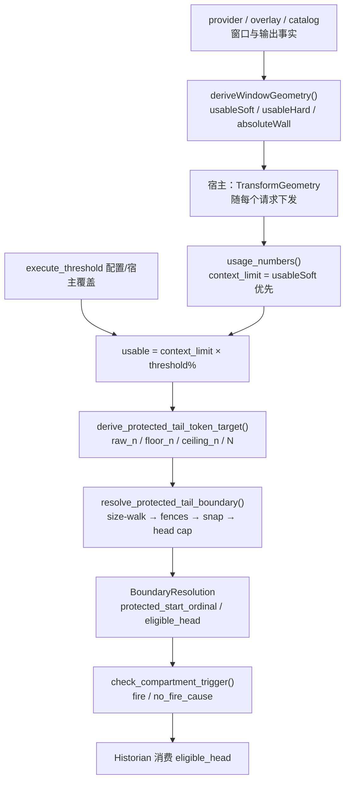
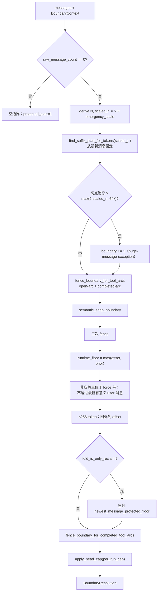

本页剖析 Magic Context 历史压缩管线中两个彼此耦合的几何层：**上下文窗口几何**决定了「我们现在还有多少真正可用的输入预算」，而**受保护尾部边界**则决定「在这条内存尾部里，哪一段前缀可以交给 Historian 压缩、哪一段后缀必须逐字保留」。前者是一个纯数据的推导问题（在宿主侧完成），后者是一个纯函数式、确定性的决策问题（在 `mc-module` 内完成）。二者通过一个共享的分母 `usable = context_limit × execute_threshold%` 缝合在一起：窗口几何定义了分母，边界解析消费这个分母来定位切点。

理解本页的前提是先区分「窗口」（provider 允许多少 token 通过验证）与「尾部」（当前会话在内存里实际有多少原始消息字节）。窗口是一个标量预算，尾部是一条有序消息序列；边界解析做的就是在这个预算约束下，在序列上选一个安全切点。

Sources: [boundary.rs](crates/mc-module/src/boundary.rs#L1-L9), [window-geometry.ts](packages/plugin/src/shared/window-geometry.ts#L80-L94), [lib.rs](crates/mc-module/src/lib.rs#L16770-L16803)

## 上下文窗口几何：软分母与硬墙

窗口几何的目标是把「provider 声明的窗口」「目录数据」「观测到的溢出上限」「用户覆盖」等多源信息，收敛成三个可用的标量：`usableSoft`（软分母，正常调度的基准）、`usableHard`（硬墙，绝对应急 95% 的基准）与 `absoluteWall`（provider 侧绝对上限）。`deriveWindowGeometry` 是这套收敛的唯一入口，它的输入包含目录行、provider 钩子、overlay 事实、宿主 harness 身份以及「已探测溢出上限」。其输出 `WindowGeometryResult` 携带 `usableSoft`/`usableHard`/`geometry` 三态，并在 `derivation` 里记录 `window`、`reserve`、`reserveSource`、`windowSource`、`absoluteWall` 等推导证据。

Sources: [window-geometry.ts](packages/plugin/src/shared/window-geometry.ts#L80-L94), [window-geometry.ts](packages/plugin/src/shared/window-geometry.ts#L447-L479)

窗口几何之所以不能被目录数据单独表达，在规格中有三条明确理由：**窗口是按访问路径而非按模型解析的**（同一模型 ID 经平台 API、OAuth 后端或网关会解析出不同窗口，models.dev 天然路径盲）；**目录输出字段携带占位符**（`output == context` 或 `output: 0` 是占位而非边界）；**强制与宣称是两个不同的量**（后端可以宣称一个窗口却接纳更大的一个）。因此几何推导并不信任单一来源，而是按事实类（grades）与坐标（window.advertised / window.enforced / output.enforced 等）分层合并。

Sources: [context-window-geometry.md](docs/specs/context-window-geometry.md#L7-L12), [window-geometry.ts](packages/plugin/src/shared/window-geometry.ts#L73-L77)

### 三类几何语义

窗口几何被抽象为三种类别，它们决定了「如何为输出预留空间」以及「输入侧能拿到多少」：

| geometry | 验证行为 | 可用输入 | 典型 provider |
|---|---|---|---|
| `shared_upfront` | prompt + 请求输出超出窗口即前置 400；输出预留从输入里扣除 | `window − requested_output` | OpenAI 平台 API |
| `shared_truncating` | 仅 prompt 超窗才 400；超窗输出被截断 | `window − 小边际`（`PROMPT_WALL_MARGIN`） | Anthropic Messages（4.5+）、xAI |
| `separate` | 输入与输出是两个独立配额，缩小输出不换输入余量 | `input_token_limit` | Google Gemini |

该分类在代码中由 `PROVIDER_GEOMETRY` 静态表提供基线映射（anthropic/xai → `shared_truncating`，google/google-antigravity → `separate`，其余默认 `shared_upfront`）。overlay 事实可以对单个 cell 覆写类别；若 overlay 明确把 `geometry` 标为 `unknown`（已查证但无法定值），则降级回 `shared_upfront`——它同时是最大软预留与最低硬墙的保守选择。

Sources: [context-window-geometry.md](docs/specs/context-window-geometry.md#L13-L21), [window-geometry.ts](packages/plugin/src/shared/window-geometry.ts#L108-L113), [window-geometry.ts](packages/plugin/src/shared/window-geometry.ts#L402-L422)

几何类别主要通过两条分支影响预算。**软预留**：`separate` 类别在无 overlay（或 Pi harness、或 overlay 明确覆写）时 `softReserve = 0`，否则在共享窗口类别下按 `output` 目录值预留，并以 `OUTPUT_RESERVE_CAP_RATIO = 0.25` 与 `OPENCODE_OUTPUT_CAP = 32_000` 双重封顶。**硬墙**：`separate` 下 `usableHard = hardWindow`（不减任何东西），`shared_truncating` 下 `usableHard = hardWindow − PROMPT_WALL_MARGIN`（4096），而 Pi 无 codex 路径减 `PI_OUTPUT_FLOOR`（4096），其余默认减请求输出。无论哪条分支，软预留都会被「半窗口地板」`max(MIN_PLAUSIBLE_CONTEXT_LIMIT, window × 0.5)` 夹住，防止目录中自相矛盾的 context/output 对把窗口减半。

Sources: [window-geometry.ts](packages/plugin/src/shared/window-geometry.ts#L545-L583), [window-geometry.ts](packages/plugin/src/shared/window-geometry.ts#L594-L606), [window-geometry.ts](packages/plugin/src/shared/window-geometry.ts#L8-L19)

### 占位符过滤与不变量

输出预留的占位符过滤是**逐字段而非逐行**的：`placeholderFilteredOutput` 会把 `output >= context`（占比占位）或非正数（零占位）判定为「缺失」，从而不参与预留。这与规格里「`output >= context` → 预留时视为不存在；`output <= 0` → 视为不存在」的规则一致。合并优先级是 `providerOutput ?? overlayOutput ?? catalogOutput`。

Sources: [window-geometry.ts](packages/plugin/src/shared/window-geometry.ts#L424-L432), [context-window-geometry.md](docs/specs/context-window-geometry.md#L49-L53)

几何推导必须维持两条不变量。其一，`usableHard` 不得小于 `usableSoft`：当 overlay/provider 事实发生倒置时，硬墙被上调为软分母并记一次一次性日志。其二，**成功的请求可以证伪静态目录，但不能证伪 provider/overlay/溢出墙**：`applyProvenInputFloor` 只在「读取值超过软分母」时提升软分母，且当 `windowSource !== "catalog"`（即存在可信绝对墙）时，任何超出 `absoluteWall` 的读取都会被 `refused`，绝不放大几何。

Sources: [window-geometry.ts](packages/plugin/src/shared/window-geometry.ts#L607-L630), [window-geometry.ts](packages/plugin/src/shared/window-geometry.ts#L638-L689)

这里的 `windowSource` 四态（`catalog`/`overlay`/`provider`/`detected`）同时也是「分母可信度」的标记：`detected` 表示宿主带入了 `contextCap`（已探测溢出上限），它是所有来源中的最终向下封顶。这套「观测不得越过已证事实」的规则，正是规格中解析顺序的经验回退基础。

Sources: [window-geometry.ts](packages/plugin/src/shared/window-geometry.ts#L585-L593), [context-window-geometry.md](docs/specs/context-window-geometry.md#L55-L57)

### 几何进入模块的形态与分母解析

模块侧接收的是一个宿主中立的 `TransformGeometry`，只有三个数值字段加一个推导字符串：`usable_soft`、`usable_hard`、`absolute_wall`、`derivation`。同一形态被 OpenCode 与 Claude Code 共用。分母解析函数 `effective_context_limit_tokens` 的优先级是：**实测 usage 的 `context_limit_tokens`**（且不超过 `absolute_wall`）→ 否则 **`geometry.usable_soft`** → 否则 `200_000` 常量回退。硬墙解析 `effective_hard_context_limit_tokens` 则优先取 `geometry.usable_hard`。

Sources: [transform.rs](crates/mc-module/src/transform.rs#L626-L635), [transform.rs](crates/mc-module/src/transform.rs#L6388-L6422)

Historian 准备路径里的 `usage_numbers` 刻意复刻同一回退顺序：它先取 usage 的 `context_limit_tokens`（过滤掉不可信值且不得超过 `absolute_wall`），再退回 `geometry.usable_soft`，最后 `200_000`。代码注释明确指出，若此处与 `transform.rs` 各自维护一个独立的 200k 回退，两条路径会在「首趟无 usage 但带 geometry」的那一次上分叉，因此必须共享同一分母解析。这一分母随后成为边界解析里的 `context_limit`。

Sources: [lib.rs](crates/mc-module/src/lib.rs#L16770-L16803), [lib.rs](crates/mc-module/src/lib.rs#L5219-L5222)

## 受保护尾部边界

边界解析单元是一个**确定性决策层**：所有 token 测量都是「调用方提供的消息/块字节 + 调用方上下文」的纯函数，没有 I/O、没有墙上时钟、不访问 store、无环境缓存状态——相同输入永远产生相同的边界与触发决策。Historian 的实际执行在别处，本单元只负责回答两个问题：**可压缩/受保护的切点落在哪里**，以及**是否应当触发一次 Historian 运行**。

Sources: [boundary.rs](crates/mc-module/src/boundary.rs#L1-L9)

边界解析的输入是 `BoundaryContext`，其中与窗口几何直接相关的字段是 `context_limit`（主模型窗口 token 上限）、`execute_threshold_percentage`（用于推导可用上下文的执行阈值）与 `usage_percentage`/`usage_input_tokens`（当前压力）。其余字段承载持久化状态：`last_compartment_end_ordinal`（上一个已发布 compartment 的末尾序数）、`prior_boundary_ordinal` 与 `migration_floor_active`（地板重施加）、`emergency_tail_scale`（应急收缩比例）、`trigger_budget` 以及 `fold_is_only_reclaim`。

Sources: [boundary.rs](crates/mc-module/src/boundary.rs#L137-L161), [boundary.rs](crates/mc-module/src/boundary.rs#L163-L178)

### 尾部 token 目标 N 的推导

受保护尾部的目标尺寸 `N` 由 `derive_protected_tail_token_target` 从窗口几何推导，它是一个「未缩放目标 + 多级夹取」的结构。`usable` 是核心标量：`context_limit × execute_threshold%`，四舍五入后至少为 1。`raw_n` 随压力线性收缩：`usable × ALPHA(0.3) × (1 − usage%)`。`floor_n` 是窗口比例的上下夹取：`usable × FLOOR_RATIO(0.08)` 再被 `FLOOR_MIN(2000)`/`FLOOR_MAX(12000)` 夹住。`ceiling_n` 取三者最小：`ABS_CAP(96000)`、`usable × MAX_USABLE_RATIO(0.4)`、以及 `usable − headroom`；其中 `headroom = min(trigger_budget + reserve, floor(usable × 0.5))`，`reserve = max(1000, round(usable × 0.02))`。最终 `N = min(ceiling_n, max(effective_floor, raw_n))`，即 floor 与 raw 先取大、再被 ceiling 封顶。

Sources: [boundary.rs](crates/mc-module/src/boundary.rs#L367-L407)

| 常量 | 值 | 作用 |
|---|---|---|
| `ALPHA` | 0.3 | `raw_n` 的基础占比 |
| `FLOOR_RATIO` / `FLOOR_MIN` / `FLOOR_MAX` | 0.08 / 2000 / 12000 | 尾部下限的比例与绝对夹取 |
| `ABS_CAP` | 96000 | 尾部目标的绝对上限 |
| `MAX_USABLE_RATIO` | 0.4 | 尾部占可用窗口比例上限 |
| `RESERVED_HEADROOM_MIN` / `_RATIO` | 1000 / 0.02 | 预留余量 |
| `NORMAL_HYSTERESIS_TOKENS` | 256 | 切点抖动的确定性回退阈值 |

Sources: [boundary.rs](crates/mc-module/src/boundary.rs#L23-L37)

触发预算 `trigger_budget` 与 `N` 是两套独立尺度。`derive_trigger_budget` 取 `round(usable × TRIGGER_BUDGET_PERCENTAGE(0.05))`，并夹在 `TRIGGER_BUDGET_MIN(5000)` 与 `TRIGGER_BUDGET_MAX(50000)` 之间；它在 `N` 里通过 `headroom` 参与上限，同时又是 `tail_size` 触发条的基数。

Sources: [boundary.rs](crates/mc-module/src/boundary.rs#L39-L47), [boundary.rs](crates/mc-module/src/boundary.rs#L343-L351)

### 边界解析流水线

`resolve_protected_tail_boundary` 先构建 `TokenIndex`（按消息序数聚合的块 token 前缀和），再把带下标的重载作为真正的实现。其流程严格有序：**空会话短路 → 目标推导与应急缩放 → size-walk → 巨消息例外 → open-arc 围栏 → 语义吸附 → 二次围栏 → 运行时地板 → 实时 prompt 地板 → 迟滞 → verbatim 尾保护 → 最终配对围栏 → head 上限**。

Sources: [boundary.rs](crates/mc-module/src/boundary.rs#L409-L421), [boundary.rs](crates/mc-module/src/boundary.rs#L423-L553)

`TokenIndex` 是这套算法在性能上的关键：它把每个消息的 `original_token_count` 汇总进 `BTreeMap`，构造 `ordinals` 数组与 `prefix` 前缀和向量，从而让 `range_tokens`、`suffix_tokens_from_ordinal` 等都是 `O(log n)` 的二分查找。两个函数驱动切点选择：`find_suffix_start_for_tokens(tokens)` 从总量减去目标后在 `prefix` 上二分，返回「后缀至少含 target token」的最早序数；`find_head_end_for_cap` 则在 `[start, protected_start)` 区间内按 cap 找 head 的排他末尾。特别地，当 `best_index == start_index` 时它会把首个消息整条纳入（`ordinals[start].saturating_add(1).min(end)`），这是 head 上限对原子单元的最小让步。

Sources: [boundary.rs](crates/mc-module/src/boundary.rs#L1027-L1090), [boundary.rs](crates/mc-module/src/boundary.rs#L1151-L1225)

### 保护不变量：围栏、吸附与原子性

边界正确性的核心是**工具弧配对不变量**。`build_tool_arcs` 从块级 `arc_id` 与 `SelKind` 聚合出调用序数与结果序数（忽略 provider 执行块），一个 `completed_tool_arc_crosses_boundary(inv, res, boundary)` 的判定即：切点落在 `(inv, res]` 之间表示「保留了结果却丢失了调用」，这是所有围栏规则共享的谓词，确保署名推理保护与普通工具配对不会对「弧是否完整」产生分歧。

Sources: [boundary.rs](crates/mc-module/src/boundary.rs#L1228-L1243), [boundary.rs](crates/mc-module/src/boundary.rs#L1245-L1291)

`fence_boundary_for_completed_tool_arcs` 处理已完成弧：先取所有跨越候选切点的弧构成 component，再**迭代扩张**整个 component——重叠弧视为一个原子区间，防止只移动首个弧的某一侧而切断邻居。随后按安全侧选择：若 component 的最早调用序数 `< floor`（已在发布地板之下、已被总结），向后移动无法重聚该配对，于是把整个 component 向前关闭至 `max_result + 1`；否则回退到 `min_invocation`。

Sources: [boundary.rs](crates/mc-module/src/boundary.rs#L1310-L1367)

`fence_boundary_for_tool_arcs` 在其上叠加 **open-arc 规则**：仅当「无结果」且调用序数 `>= recent_open_arc_cutoff`（即落在 size-walk 起点——它同时是活窗口）时才把边界前压到该调用序数。这解决了一个生产事故形态：一条位于 eligible-head 边缘的死 `running` 调用若无限期围栏，会永久冻结 Historian。因此陈旧/中断的 open arc 是可压缩的。open-arc 调整后必须再跑一次 completed-arc 谓词，因为切点可能被移进某条重叠的已完成弧里。

Sources: [boundary.rs](crates/mc-module/src/boundary.rs#L1369-L1394), [ARCHITECTURE.md](ARCHITECTURE.md#L107-L109)

`semantic_snap_boundary` 负责把切点吸附到语义边界（有意义 user 文本，或含 tool_call/tool_result 的消息），但有双重否决：吸附导致的额外后缀 token 超过 `min(1.5 × scaled_n, 48000)` 时放弃；吸附到的消息若是「巨 user 消息」（`token_for_ordinal > max(2·scaled_n, 64000)`）也放弃。`snap_wrapup_boundary_to_user` 则服务于显式 wrapup，其吸附窗口 `snap_token_limit` 使用 `clamp(trigger_budget, 2000, 48000)`，因此**吸附窗口随会话几何缩放**，而非固定常量。

Sources: [boundary.rs](crates/mc-module/src/boundary.rs#L1447-L1498), [boundary.rs](crates/mc-module/src/boundary.rs#L1418-L1445)

### 实时 prompt 地板与迟滞

在**非应急**（`emergency_tail_scale` 为 `None`）且 `usage < force_materialization_percentage` 时，边界不得越过**最新一条有意义 user 消息**：代码从尾部反向寻找最后一条带有意义用户文本的 user 消息，若它 `>= offset` 且当前 `protected_tail_start` 在其之后，则把边界拉到该序数并标记 `floored_by_live_prompt`。这防止了生产中出现的一种退化——agent 正在回答的 prompt 被压成叙述替换，从而让压缩分界线落在活尾部上。

Sources: [boundary.rs](crates/mc-module/src/boundary.rs#L488-L503), [protected-tail-boundary.ts](packages/plugin/src/hooks/magic-context/protected-tail-boundary.ts#L677-L713)

该地板的两个刻意例外：**应急缩放解析**（force 带/95% 的第二次尝试）可以越过它——只有单个 user turn 加巨大 assistant 尾巴的稀疏会话在真实压力下必须仍可压缩，溢出严格劣于叙述活 prompt；地板也在 force 压力处解除，使这类会话在 force 路径的**首次**尝试就暴露可运行 head。此外还有 256 token 的迟滞：当 `0 < range_tokens(offset, protected_start) <= NORMAL_HYSTERESIS_TOKENS` 时切点回退到 `offset`，让 defer pass 的 cache key 在微小 token 波动下保持稳定。

Sources: [boundary.rs](crates/mc-module/src/boundary.rs#L478-L509), [protected-tail-boundary.ts](packages/plugin/src/hooks/magic-context/protected-tail-boundary.ts#L677-L721)

在 verbatim-tail 剖面（`fold_is_only_reclaim == true`，如 `claude-code-anthropic`）上，折叠是唯一回收路径而最新消息整条逐字转发；因此边界被压到 `newest_message_protected_floor`，把最新消息及其完整工具弧排除在折叠之外，使活轮次不会变成持久 compartment 边界。

Sources: [boundary.rs](crates/mc-module/src/boundary.rs#L512-L519), [boundary.rs](crates/mc-module/src/boundary.rs#L1293-L1302)

### Head 上限、oversize 原子单元与 per-run cap

`eligible_head` 是半开区间 `[offset, head.eligible_end_ordinal)`，其末尾由 `apply_head_cap` 依据 per-run cap 决定。当 cap 落在某条领先的已完成组件内部时，逻辑会尝试「整段接纳为 oversize 原子单元」：它先对 `end` 求 completed-arc 围栏，若结果回退到 `offset` 之内且 `end > offset`，则改以 `offset + 1` 为地板重求围栏；只有当该结果不超过 `protected_tail_start` 时才采用，否则回退。随后若围栏把 `end` 推后，会检查区间 token 是否超过 cap 并据实标记 `oversize_atomic_unit`。Open arc 的上限收紧也在此叠加。

Sources: [boundary.rs](crates/mc-module/src/boundary.rs#L1517-L1560), [boundary.rs](crates/mc-module/src/boundary.rs#L1500-L1515)

per-run cap 是压力分层的函数：正常层 `non_emergency_per_run_cap` 取 `min(250000, max(2N, min(0.25·usable, 100000)))`；≥80% 层 `force80_per_run_cap` 取 `min(500000, max(3N, min(0.35·usable, 150000)))`；≥95% 层 `force95_per_run_cap` 取 `min(750000, max(4N, min(0.5·usable, 250000)))`。代码注释强调 80% 容量层刻意保留其历史层级，因为在 execute 阈值为 84%–90% 时它已不再与派生的 force 带转换点重合。

Sources: [boundary.rs](crates/mc-module/src/boundary.rs#L974-L1005)

## 两者耦合：从窗口几何到边界与触发

窗口几何与尾部边界在一个标量上缝合：`usable = context_limit × execute_threshold%`。`context_limit` 来自几何的软分母（`usable_soft` 优先，`absolute_wall` 用于驳回不可信 usage），`execute_threshold%` 来自配置或宿主每次请求下发的覆盖。这个 `usable` 同时决定了 `N` 的规模、per-run cap 的档位、`trigger_budget` 的基数，进而决定 `tail_size` 触发条。

Sources: [lib.rs](crates/mc-module/src/lib.rs#L5379-L5395), [lib.rs](crates/mc-module/src/lib.rs#L5219-L5222), [transform.rs](crates/mc-module/src/transform.rs#L6388-L6411)

压力带（band）本身也保留软/硬分离：`derive_band_with_hard_wall` 用 `hard_wall_percentage` 单独判定绝对 95% 应急臂，而 force 臂仍只读软 `usage_percentage`。`escalation_bands` 从有效阈值派生 `force_materialize_percentage = max(85, threshold + 2)`，`emergency_percentage` 恒为 95。边界侧的 `force_materialize_percentage` 用于决定实时 prompt 地板是否解除，而 `BLOCK_UNTIL_DONE_PERCENTAGE(95)` 决定应急缩放比例取 `0.25` 还是 `0.5`。

Sources: [scheduler.rs](crates/mc-module/src/scheduler.rs#L533-L557), [scheduler.rs](crates/mc-module/src/scheduler.rs#L177-L197), [boundary.rs](crates/mc-module/src/boundary.rs#L48-L50), [boundary.rs](crates/mc-module/src/boundary.rs#L855-L871)

触发决策 `check_compartment_trigger` 先短路「Historian 已在进行中」，再构建索引并调用带下标的实现。它复用同一套边界解析（清空 `emergency_tail_scale` 作为 primary），在其上取 chunk 估算并推导进度。`TriggerProgress` 暴露 `eligible_chunk_tokens`、`tail_size_bar`、`n_tokens`、`protected_start_ordinal` 等诊断量；这些量会被渲染进 historian 诊断（如 `eligible~\~{}k,bar~\~{}k,protected_n~\~{}k,ctx_limit=...`），但**渲染绝不参与决策本身**。

Sources: [boundary.rs](crates/mc-module/src/boundary.rs#L734-L744), [boundary.rs](crates/mc-module/src/boundary.rs#L771-L827), [lib.rs](crates/mc-module/src/lib.rs#L5436-L5444)

触发路径按压力分层判定。在 force 带及以上（`usage >= force_materialization_percentage`）：若投影 post-drop 百分比已达标则拒火；否则调用 `has_runnable_compartment_window` 判断是否存在可运行窗口（应急下要求 `true_raw_eligible_tokens >= min(1000, scaled_n/8)` 或 head 非空），成立即 fire `ForceBand`；不成立则以 `0.5`/`0.25` 的应急缩放重解析再试，仍不成立则拒火 `ProtectedTailWindowEmpty`。在 force 带以下：先看 commit 簇触发，再看 `tail_size` 条（`chunk.tokens >= trigger_budget × TAIL_SIZE_TRIGGER_MULTIPLIER(3.0)` 或 `has_more && tokens > 0`），然后检查低于主动触发地板的拒火、投影达标拒火、head 为空拒火、以及 `is_meaningful` 门槛，最后 fire `ProjectedHeadroom`。

Sources: [boundary.rs](crates/mc-module/src/boundary.rs#L837-L908), [boundary.rs](crates/mc-module/src/boundary.rs#L1007-L1024), [boundary.rs](crates/mc-module/src/boundary.rs#L39-L47)

这里的 `has_runnable_compartment_window` 是防止「空触发」的门卫：它首先要求 `eligible_head.start < protected_start_ordinal`（存在 protected 之前的已归档头），这是所有 `ProtectedTailWindowEmpty` 拒火的共同形态。触发成功时 `fire()` 把 `consume_through_ordinal` 定为 `eligible_head.end − 1`（head 非空时），并把同一份 `BoundaryResolution` 快照交给组装器，使触发与 chunk 快照不可能解析出不同区间。

Sources: [boundary.rs](crates/mc-module/src/boundary.rs#L932-L957), [boundary.rs](crates/mc-module/src/boundary.rs#L1007-L1024)

## 边界诊断与确定性证据

边界与触发结果携带自描述诊断。`BoundaryResolution` 记录 `protected_start_ordinal`、`eligible_head`、`n_tokens`、`floored_by_live_prompt`、`fenced_by_open_arc`、`true_raw_eligible_tokens`、`oversize_atomic_unit`、`raw_message_count` 与 `boundary_reason`（`size-walk`/`semantic-snap`/`huge-message-exception`/`whole-session-smaller-than-tail` 等）。TS 侧的 `ProtectedTailBoundarySnapshot.diagnostics` 则进一步展开 `tailTarget`、`usable`、`capTokens`/`capTier`（`normal`/`80`/`95`）、`livePromptFloor`、`head` 等结构化字段。

Sources: [boundary.rs](crates/mc-module/src/boundary.rs#L203-L224), [protected-tail-boundary.ts](packages/plugin/src/hooks/magic-context/protected-tail-boundary.ts#L107-L150)

这些诊断不是装饰：它们让一次「卡住的 rig drive」能按趟诊断（已归档内容 vs 门槛，以及受保护边界扣住了多少尾部）。这种可诊断性与确定性是同一承诺的两面——Rust 单元与 TS 镜像实现共享常量与算法，且 Rust 侧的 golden 生成器 `gen-boundary-golden.ts` 直接调用 `resolveProtectedTailBoundary` / `hasRunnableCompartmentWindow`，把结果固化为跨实现对照。

Sources: [boundary.rs](crates/mc-module/src/boundary.rs#L325-L340), [gen-boundary-golden.ts](crates/mc-module/gen/gen-boundary-golden.ts#L24-L25)

确定性与不变量由单元测试钉住，包括：相同尾部解析相同边界（`boundary_determinism_same_tail_same_resolution`）、新增更近内容绝不把 protected start 移到锚点之下（`adding_newer_items_never_moves_protected_start_below_anchor`）、触发永不消费受保护尾部（`trigger_never_consumes_the_protected_tail`）、连续已完成弧在跨越预算的组件后停止、以及边界测量的是原始字节而非渲染后的缩减占位符。这些正是「窗口几何给出预算、边界给出切点」这一分工的正确性契约。

Sources: [boundary.rs](crates/mc-module/src/boundary.rs#L3657-L3813)

## 下一步

窗口与尾部边界是「历史压缩」子章的几何基座；要理解压缩产物如何被渲染与分级衰减，请继续阅读 [分区衰减渲染与重要性分级](14-fen-qu-shi-jian-xuan-ran-yu-zhong-yao-xing-fen-ji)；要理解边界所圈定的 head 如何被真正产制、校验并发布，请回到 [Historian 分区流程：产制·校验·发布](13-historian-fen-qu-liu-cheng-chan-zhi-xiao-yan-fa-bu)。若关心边界与配置面之间的取舍（`execute_threshold` 上限、输出预留、`protected_tokens` 独立保护窗口），请参见 [配置体系与隐藏代理模型选择](3-pei-zhi-ti-xi-yu-yin-cang-dai-li-mo-xing-xuan-ze)。