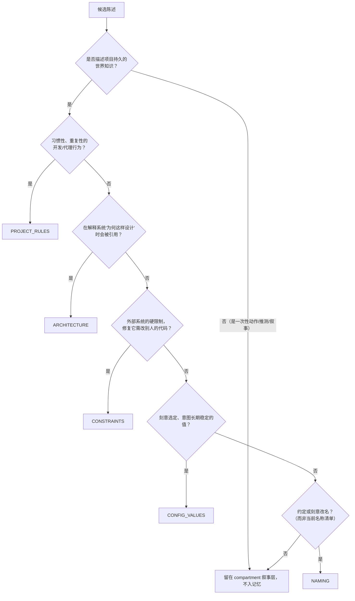
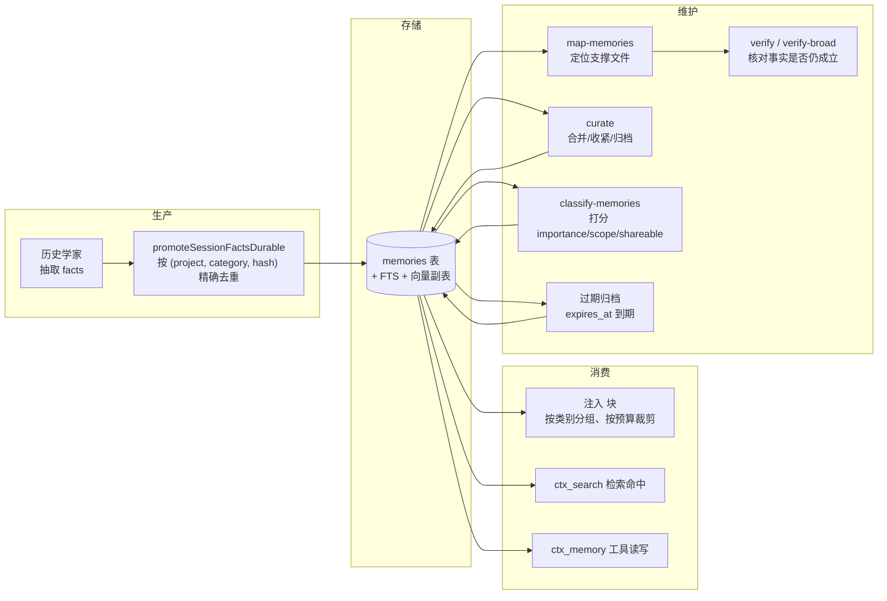
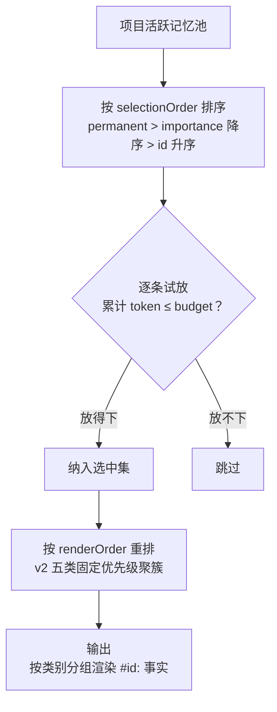

Magic Context 的核心主张之一，是把"这个项目是什么样"的知识从单次会话中抽离出来，变成**跨会话持久存在**的项目资产。本页聚焦这套记忆体系的两个支柱：一是记忆如何被组织为**五类知识分类法**（five-category knowledge taxonomy），二是这些记忆从生产、注入、检索到维护、淘汰的完整生命周期。本页不展开嵌入检索管线的实现细节（见[统一搜索与嵌入管线](17-tong-sou-suo-yu-qian-ru-guan-xian)）、跨项目共享与工作区策略（见[工作区与跨宿主记忆共享](18-gong-zuo-qu-yu-kua-su-zhu-ji-yi-gong-xiang)），也不展开 Dreamer 的调度模型本身（见[Dreamer 任务调度与执行模型](19-dreamer-ren-wu-diao-du-yu-zhi-xing-mo-xing)）与用户画像存储（见[智能笔记与用户画像管线](20-zhi-neng-bi-ji-yu-yong-hu-hua-xiang-guan-xian)）。

Sources: [types.ts](packages/plugin/src/features/magic-context/memory/types.ts#L1-L20), [ARCHITECTURE.md](ARCHITECTURE.md#L111-L115)

## 记忆的定位：项目级、持久、可编辑的世界知识

项目记忆被定义为一组**关于项目"当前如何运作"的稳定世界知识**，而非"发生过什么"的叙事。它带有几个明确的边界：记忆属于**项目**（由 git 根提交哈希标识，非 git 项目回退到目录哈希），而不是用户；它与用户画像（user-profile）是两套独立存储，用户偏好、沟通风格、个人指令属于后者，会被记忆迁移主动剔除出项目记忆。记忆是**可编辑**的——历史学家（historian）可以重写、归一化、去重或删除既有事实，而不是仅追加。写入路径还被约束为永远不能由代理以 `sourceType: "user"` 落库，该值被保留给未来仪表盘的手动录入。

Sources: [types.ts](packages/plugin/src/features/magic-context/memory/types.ts#L25-L41), [historian-prompt.source.md](packages/plugin/src/hooks/magic-context/historian-prompt.source.md#L399-L410), [memory-migration.ts](packages/plugin/src/features/magic-context/memory/memory-migration.ts#L30-L40)

## 五类知识分类法：每一类都有可判定的"关键测试"

v2 世界分类法是代理今天**唯一可写入**的类别集合，共五类。它被直接暴露为 `ctx_memory` 工具 schema 的枚举，因此非法类别会在参数校验阶段失败，而不是在运行时被静默丢弃。之所以强调"分类"，是因为分类决策直接决定了注入渲染时的分组顺序、维护任务的轮转范围，以及后来者检索记忆时的语义聚簇。

| 类别 | 关键测试（一句话） | 典型正例 |
|------|------------------|---------|
| `PROJECT_RULES` | 新开发者/代理在**例行重复工作**中是否应遵循它以免搞坏项目？ | "每次修复后，提交并同时构建 Rust 二进制与 TS 插件" |
| `ARCHITECTURE` | 你在解释"系统为何长成这样"时是否会引用它？ | "Bridge 池按目录实例化，以避免 server 模式下的跨会话污染" |
| `CONSTRAINTS` | 这是不是**外部系统**（我们无法改动）的硬限制，未来设计必须绕行？ | "Anthropic SDK 会合并连续 assistant 消息，非首条必须剥离 reasoning" |
| `CONFIG_VALUES` | 这是否为一个**刻意选定且意图长期稳定**的配置值（路径/阈值/范围/常量）？ | "Bridge 空闲超时：Infinity" |
| `NAMING` | 未来会话若不知此事实，会不会把某个名字用错？ | "非 hoisted 工具统一用 `aft_` 前缀" |

表中所列的五类与各自的正例、关键测试，均直接来自历史学家的分类指引文本；该文本为每一类都配了"硬停检查"（HARD STOP）与"关键测试"（key test），并用大量负例划出边界。

Sources: [constants.ts](packages/plugin/src/features/magic-context/memory/constants.ts#L9-L15), [historian-prompt.source.md](packages/plugin/src/hooks/magic-context/historian-prompt.source.md#L414-L565)

每一类都配有一条**否定性判据**，用来把"看似重要但其实不属于该类"的内容挡回叙事层。理解这些否定判据比记住正例更重要，因为它们正是设计者为了让五类分类法**互斥**而设下的护栏：

- **`PROJECT_RULES`** 拒绝一次性动作（"运行 npm install"）、问题与推测（"我们应不应该加 ast-grep？"）以及改名事实（改名属于 `NAMING`）。
- **`ARCHITECTURE`** 拒绝实现行为、API 响应形状、跟风的第三方库选择与流水线步骤描述——它只收留"重构时的设计目标"这种承重决策。
- **`CONSTRAINTS`** 的关键否定判据是：**修好它是否需要改动别人的代码？** 需要 → 外部约束；我们自己能修 → 那是我方 bug，属于叙事或后续笔记。
- **`CONFIG_VALUES`** 的硬停检查是：**这个值会不会在下次构建/测试/发布/测量中自行改变？** 会变（测试数量、二进制体积、依赖版本、基准数据）→ 是快照，不是配置。
- **`NAMING`** 拒绝"当前名称清单"（工具名、模块名、组件名、端点名大量罗列）——它只收留约定本身与刻意改名及其理由。

Sources: [historian-prompt.source.md](packages/plugin/src/hooks/magic-context/historian-prompt.source.md#L431-L436), [historian-prompt.source.md](packages/plugin/src/hooks/magic-context/historian-prompt.source.md#L456-L561)

下面这张概念关系图说明了分类器在面对一段候选陈述时的收束路径：陈述先经过"是不是持久世界知识"的总闸，再逐条落入五类之一；若同时满足多类，则说明理解不够锐利，应拆分为更窄的两条事实，或退回叙事层。

这张流程位于历史学家提示词的"类别路由测试"（category-routing test）一节，是该分类法的权威判定顺序。

Sources: [historian-prompt.source.md](packages/plugin/src/hooks/magic-context/historian-prompt.source.md#L566-L577)

## 旧 9 类分类法与 v2 桥接："双向接受"的过渡设计

在 v2 之前，记忆使用一套 9 类分类法（`ARCHITECTURE_DECISIONS`、`USER_DIRECTIVES`、`WORKFLOW_RULES`、`KNOWN_ISSUES`、`ENVIRONMENT`、`USER_PREFERENCES`、`CONFIG_DEFAULTS` 等）。类型定义中同时保留了 5 类与这 9 类，并把遗留集合显式标注为"accept-both 桥接"：历史学家不再产出它们，但既有（pre-v2）行仍能保留完整的排序、TTL 与渲染行为，直到一次性的重分类迁移把它们折入 5 类集合。

Sources: [types.ts](packages/plugin/src/features/magic-context/memory/types.ts#L8-L20), [storage-memory.ts](packages/plugin/src/features/magic-context/memory/storage-memory.ts#L44-L59)

桥接层在几处生效：`PROMOTABLE_CATEGORIES` 允许新写入与既有写入都被提升为记忆；`CATEGORY_PRIORITY` 保留遗留 9 类的历史排序；curate 任务通过一个遗留桶映射表把旧类别并入新桶（`ARCHITECTURE_DECISIONS → ARCHITECTURE`、`CONFIG_DEFAULTS/ENVIRONMENT → CONFIG_VALUES`、`KNOWN_ISSUES → CONSTRAINTS`、`USER_DIRECTIVES/USER_PREFERENCES/WORKFLOW_RULES → PROJECT_RULES`），从而让单类别轮转维护对两代数据都成立。

Sources: [constants.ts](packages/plugin/src/features/magic-context/memory/constants.ts#L17-L50), [curate-category-rotation.ts](packages/plugin/src/features/magic-context/dreamer/curate-category-rotation.ts#L4-L28)

真正把旧数据折入新分类的是一次性迁移（E3 / `/ctx-session-upgrade`）。它不是简单的重贴标签，而是一次**质量再评估**：模型收到每个既有记忆及其遗留类别，对照更严格的 5 类定义，输出一个干净的替换集——丢弃过时/低价值条目、合并近重复、把非世界知识降级为叙事，并把 `USER_*` 特质整体移出项目记忆、以 `<user_observations>` 形式路由到用户画像库。该迁移按项目运行且幂等（以 `schema_migrations_meta` 中的守卫键保证只跑一次），只重新评估 `active` 行，`permanent`（用户策展）行保持不变，并在完成后推进 epoch。

Sources: [memory-migration.ts](packages/plugin/src/features/magic-context/memory/memory-migration.ts#L41-L83), [memory-migration.ts](packages/plugin/src/features/magic-context/memory/memory-migration.ts#L90-L130), [memory-migration.ts](packages/plugin/src/features/magic-context/memory/memory-migration.ts#L187-L193)

## 生命周期总览：从事实提取到淘汰

一条记忆的身世可以概括为：历史学家在压缩历史时抽取"事实"，publish 事务把可提升类别的事实提升为记忆行；此后它被注入到每次新会话的 `<project-memory>` 块中，并由一系列 Dreamer 后台任务持续维护、验证、分类与淘汰。

这张图对应 `memory/` 目录的存储层、历史学家 publish 路径中的 `promoteSessionFactsDurable`，以及 `dreamer/` 下的维护任务集合。

Sources: [promotion.ts](packages/plugin/src/features/magic-context/memory/promotion.ts#L49-L94), [task-registry.ts](packages/plugin/src/features/magic-context/dreamer/task-registry.ts#L13-L49), [ARCHITECTURE.md](ARCHITECTURE.md#L120-L124)

**生产侧**的关键机制是去重。事实内容先经 `normalizeMemoryContent`（转小写、压缩空白、去首尾）后取 MD5，得到 `normalized_hash`；`memories` 表在 `(project_path, category, normalized_hash)` 上建唯一约束，因此同一类别下语义重复的事实不会产生新行，而是递增既有行的 `seen_count`。`insertMemoryIdempotent` 进一步处理共享 DB 场景下"预检查与 INSERT 之间的竞态"：当唯一约束胜出时，把它当作同一条精确去重路径处理，递增计数并返回既有行，而不是抛出瞬时写失败。

Sources: [normalize-hash.ts](packages/plugin/src/features/magic-context/memory/normalize-hash.ts#L3-L12), [storage-db.ts](packages/plugin/src/features/magic-context/storage-db.ts#L1125-L1156), [storage-memory.ts](packages/plugin/src/features/magic-context/memory/storage-memory.ts#L655-L679)

**维护侧**由并行的 Dreamer 任务承担，它们共享同一条"记忆租约"以避免语义竞态（并发运行会导致基于过期视图的合并/拆分出错）。下表概括与记忆直接相关的任务职责：

| 任务 | 作用 | 关键约束 |
|------|------|---------|
| `map-memories` | 为每条记忆定位其支撑文件（或标记为文件无关），使 verify 有逐记忆的门控目标 | 一次性回填后转为廉价涓流；`PROJECT_RULES` 中的流程指令与校验失败的路径会被覆盖为文件无关哨兵 |
| `verify` / `verify-broad` | 拿映射到的记忆去核对当前源码，产出 verified/update/archive 清单，由宿主侧应用 | 逐记忆按 `verified_at` 门控；`PROJECT_RULES` 中的流程指令被限定为只能验证"代码事实" |
| `curate` | 单类别卫生：合并重复、收紧措辞、归档低价值项 | 在 5 类间轮转，每次只处理一个类别；跨类别合并被结构性拒绝 |
| `classify-memories` | 零工具的单词打分 `importance` / `scope` / `shareable` | 按池大小分三阶段（<10 跳过、≤100 全池、>100 仅新/变更 + 分层锚点） |
| 过期归档 | 将 `expires_at` 已到期的 `active` 行归档 | 由 `CATEGORY_DEFAULT_TTL` 驱动的每类默认 TTL |

Sources: [task-registry.ts](packages/plugin/src/features/magic-context/dreamer/task-registry.ts#L122-L133), [map-memories.ts](packages/plugin/src/features/magic-context/dreamer/map-memories.ts#L44-L66), [verify.ts](packages/plugin/src/features/magic-context/dreamer/verify.ts#L55-L68), [curate-category-rotation.ts](packages/plugin/src/features/magic-context/dreamer/curate-category-rotation.ts#L24-L28), [classify.ts](packages/plugin/src/features/magic-context/dreamer/classify.ts#L45-L60), [expire-memories.ts](packages/plugin/src/features/magic-context/dreamer/expire-memories.ts#L15-L32)

> **注意 TTL 的当前覆盖范围**：`CATEGORY_DEFAULT_TTL` 目前只为两个**遗留**类别定义了默认过期（`WORKFLOW_RULES` 90 天、`KNOWN_ISSUES` 30 天），其余类别（含全部 5 个 v2 类别）的默认 TTL 为 `null`，即不过期。

Sources: [constants.ts](packages/plugin/src/features/magic-context/memory/constants.ts#L74-L79)

## 记忆数据模型：状态、分类元数据与验证

`Memory` 接口是记忆的完整投影，数据库表与之逐列对应。它的字段可以按职能分成四组：**身份与内容**（id、projectPath、category、content、normalizedHash）、**生命周期状态**（status、expiresAt、supersededByMemoryId、mergedFrom）、**分类元数据**（importance、scope、shareable）、**使用与验证统计**（seenCount、retrievalCount、各时间戳、verificationStatus、verifiedAt）。

| 字段 | 语义 | 取值 |
|------|------|------|
| `status` | 记忆的存活状态 | `active` / `permanent` / `archived` |
| `scope` | 适用范围 | `project`（默认，不确定时）/ `ecosystem`（同栈兄弟项目）/ `universe`（协议/平台级普适） |
| `shareable` | 是否可暴露给同项目的队友（SQLite 中 1/0） | 1=可共享，0=私有 |
| `sourceType` | 记忆来源 | `historian` / `agent` / `dreamer` / `user`（`user` 保留、禁止代理写入） |
| `verificationStatus` | 内容核对状态 | `unverified` / `verified` / `stale` / `flagged` |
| `importance` | 1–100 的整数，**控制衰减速率而非"质量分"** | `setMemoryClassification` 归一化到 [1,100] |

Sources: [types.ts](packages/plugin/src/features/magic-context/memory/types.ts#L22-L69), [storage-memory.ts](packages/plugin/src/features/magic-context/memory/storage-memory.ts#L1096-L1159)

关于 `importance` 的语义需要特别澄清：它在历史学家侧并非"工作的重要性评级"，而是**衰减速率**——高 importance 的 compartment 会在更多轮次内停留在高保真层级，低 importance 则快速衰减。当它用于记忆时，`classify-memories` 用一段包含粗锚点的评分指引来打分（瞬时/显然观察 1–30、普通有用项目事实 40–65、承重规则/架构/约束 70–100），并明确要求"大多数记忆属于普通工作事实，应落在中段"，避免把整池都堆到高分带。

Sources: [historian-prompt.source.md](packages/plugin/src/hooks/magic-context/historian-prompt.source.md#L121-L125), [classify-prompt.ts](packages/plugin/src/features/magic-context/dreamer/classify-prompt.ts#L41-L72)

`scope` 与 `shareable` 是两个**正交**维度——评分指引明确写道"shareability 关乎暴露面，而非 scope"：一条深度绑定本仓库内部的架构事实，仍然会被标为 `shareable=true`（它正是你会交给新队友的东西）；只有个人路径、用户名、本机/私有端点、凭据、客户数据、机器特定配置与个人工作风格偏好才应设为 `shareable=false`。宿主侧还**失败关闭**：一旦文本中包含疑似机密/凭据/个人路径，会强制置为私有。

Sources: [classify-prompt.ts](packages/plugin/src/features/magic-context/dreamer/classify-prompt.ts#L60-L62), [classify.ts](packages/plugin/src/features/magic-context/dreamer/classify.ts#L74-L80)

存储层的物理结构由 `memories` 主表加上三类副表/索引构成：向量存放于 `memory_embeddings`（按 `(memory_id, model_id)` 主键、级联删除）；文件映射与验证记录存放于 `memory_verifications`（`verified_at=0` 表示"已映射但尚未内容核对"）；全文检索通过 `memories_fts`（FTS5 外部内容表）配合 INSERT/DELETE/UPDATE 触发器同步；`project_path, status, category` 与 `project_path, category, normalized_hash` 等索引支撑按类别列举与去重查询。

Sources: [storage-db.ts](packages/plugin/src/features/magic-context/storage-db.ts#L1158-L1166), [storage-db.ts](packages/plugin/src/features/magic-context/storage-db.ts#L1246-L1257), [storage-db.ts](packages/plugin/src/features/magic-context/storage-db.ts#L1423-L1502), [storage-db.ts](packages/plugin/src/features/magic-context/storage-db.ts#L1734-L1736)

## 注入渲染：`<project-memory>` 块的组织方式

每个新会话都以当前项目的活跃记忆开场，渲染为一个 `<project-memory>` 块。块内按**类别分组**：同一类别的记忆行聚合在 `<CATEGORY>` … `</CATEGORY>` 标签之间，每个记忆渲染为一行 `#<id>: <content>`（在工作区场景下还会带 ` [来源名]` 前缀）。

概念上，注入过程分两步：先选后渲。**选择阶段**按 `memorySelectionOrder` 排序——`permanent` 优先，其次按 `importance` 降序，最后按 id 升序——然后依次尝试放入预算，放不下就跳过；**渲染阶段**再把选中的集合按 `memoryRenderOrder` 重排，使 v2 五类按固定优先级（`PROJECT_RULES` → `ARCHITECTURE` → `CONSTRAINTS` → `CONFIG_VALUES` → `NAMING`）聚簇，遗留类别排在之后。

Sources: [inject-compartments.ts](packages/plugin/src/hooks/magic-context/inject-compartments.ts#L1053-L1078), [inject-compartments.ts](packages/plugin/src/hooks/magic-context/inject-compartments.ts#L1727-L1754), [inject-compartments.ts](packages/plugin/src/hooks/magic-context/inject-compartments.ts#L1987-L2012)

渲染时 `importance` 有意**不出现在线上格式**中——它只参与选择，不出现在字节里，因此纯分类更新不会改变注入字节（这对缓存稳定性至关重要，见[缓存稳定性的核心设计哲学](8-huan-cun-wen-ding-xing-de-he-xin-she-ji-zhe-xue)）。注入预算由 `DEFAULT_MEMORY_BUDGET_TOKENS = 8_000` 作为渲染回退值，并可通过配置项覆盖；裁剪采用增量 token 记账（分别测量包裹标签、每行、每个类别标签），因为对数百个候选逐个重渲整块会带来 O(n²) 的分词开销。

Sources: [inject-compartments.ts](packages/plugin/src/hooks/magic-context/inject-compartments.ts#L1943-L1990), [inject-compartments.ts](packages/plugin/src/hooks/magic-context/inject-compartments.ts#L947-L949)

写入侧的缓存契约值得单独强调：**会话内的 `ctx_memory` 变更不推进 `project_memory_epoch`**。追加式写入通过 `maxMemoryId` 水位以 m[1] 增量的形式浮现；非追加式操作（`update`/`archive`/`merge`）写成一条 `memory_mutation_log` 记录，并以 `<memory-updates>` 增量渲染。两者都在下一次自然的硬折叠时并入 m[0]。只有**仪表盘**与 `/ctx-session-upgrade` 迁移这类外部编辑才会推进 epoch。这保证了后台维护任务（curate/verify 等）永远不会击穿提示缓存前缀。

Sources: [ARCHITECTURE.md](ARCHITECTURE.md#L90), [storage-db.ts](packages/plugin/src/features/magic-context/storage-db.ts#L1259-L1274)

## `ctx_memory` 工具：代理如何读写记忆

代理通过 `ctx_memory` 工具与记忆体系交互。工具的动作集合按权限分为两层：主代理（primary）可执行 `write`、`archive`、`update`、`merge`、`get`，而 `list`（批量枚举）仅限 Dreamer。`archive` 是唯一的软删除动作（置 `status='archived'`）；`get` 是"按 id 读取"的动作，因为主代理在 `<project-memory>` 中已能看到带 id 的记忆，需要一个按 id 回查的入口；记忆**验证**（文件映射）与**分类**（importance/scope/shareable）不再是工具动作——它们由 verify/classify 任务在宿主侧依据清单应用。

| 动作 | 参数要点 | 语义 |
|------|---------|------|
| `write` | `content` + `category` | 保存一条新记忆；类别先经校验，命中既存哈希则递增计数并返回既有 id |
| `update` | `ids: [1]` + `content`（可带 `category` 重分类） | 重写一条事实已发生变化的记忆 |
| `archive` | `ids: [1+]`、可选 `reason` | 退役错误或过时的记忆（可批量） |
| `merge` | `ids: [2+]` + `content` | 把重复项折叠为一条 |
| `get` | `ids: [1..20]` | 按 id 读取，任意状态可见 |
| `list` | `limit`、可选 `category` | （仅 Dreamer）批量枚举活跃记忆 |

Sources: [types.ts](packages/plugin/src/tools/ctx-memory/types.ts#L6-L40), [constants.ts](packages/plugin/src/tools/ctx-memory/constants.ts#L2-L13), [tools.ts](packages/plugin/src/tools/ctx-memory/tools.ts#L282-L294)

`write` 路径的执行顺序也体现了分类法的强约束：先要求 `content` 与 `category` 非空，`getValidatedCategory` 用 `CATEGORY_PRIORITY` 全集做白名单校验（注意校验集包含遗留类别，以维持双向接受），未知类别直接返回错误而非落库；随后做精确哈希去重，命中就递增 `seen_count`，否则以 `insertMemoryIdempotent` 落库并按需排队嵌入。

Sources: [tools.ts](packages/plugin/src/tools/ctx-memory/tools.ts#L695-L745)

## 配置开关

记忆体系可通过配置整体启用/关闭与调参。当 `memory.enabled` 为 `false` 时，`ctx_memory` 工具不再注册，`<project-memory>` 块不再注入，历史学家/重压也不再把会话事实提升为记忆；`ctx_search` 仍可用，但其记忆来源返回空结果。

| 配置键 | 类型 | 默认 | 作用 |
|--------|------|------|------|
| `memory.enabled` | boolean | `true` | 总开关：关闭后工具隐藏、块不注入、不提升事实 |
| `memory.injection_budget_tokens` | number（500–20000） | `4000` | 记忆注入的 token 预算 |
| `memory.auto_promote` | boolean | `true` | 历史学家/recomp 后是否自动提升合格事实为记忆 |
| `memory.retrieval_count_promotion_threshold` | number | `3` | 记忆被检索多少次后自动提升为 `permanent` |

配置文档列出的注入预算默认值为 4000，而渲染层保留 `DEFAULT_MEMORY_BUDGET_TOKENS = 8_000` 作为未配置时的回退常量——两者是"配置默认"与"代码回退"两个层面的值。

Sources: [CONFIGURATION.md](CONFIGURATION.md#L665-L674), [inject-compartments.ts](packages/plugin/src/hooks/magic-context/inject-compartments.ts#L947-L949)

## 与相邻子系统的关系

记忆体系并非孤岛，它与三个相邻主题的边界值得明确：**检索**由 `ctx_search` 统一调度，记忆、git 提交与会话历史共用一个查询，记忆的向量与 FTS 副表正是指检索面（见[统一搜索与嵌入管线](17-tong-sou-suo-yu-qian-ru-guan-xian)）；**共享**通过工作区实现——成员会话可读成员间记忆的并集（按仓库归因），并按类别由 `share_categories` 门控，`shareable` 字段正是这道门控的输入（见[工作区与跨宿主记忆共享](18-gong-zuo-qu-yu-kua-su-zhu-ji-yi-gong-xiang)）；**后台维护**的调度、租约与执行模型见 [Dreamer 任务调度与执行模型](19-dreamer-ren-wu-diao-du-yu-zhi-xing-mo-xing)。

Sources: [search.ts](packages/plugin/src/features/magic-context/search.ts#L715-L761), [storage-memory.ts](packages/plugin/src/features/magic-context/memory/storage-memory.ts#L747-L760), [ARCHITECTURE.md](ARCHITECTURE.md#L114-L116)

## 延伸阅读

- 想理解五类知识为何被设计成互斥——回到[缓存稳定性的核心设计哲学](8-huan-cun-wen-ding-xing-de-he-xin-she-ji-zhe-xue)，其中解释了为何"纯分类更新不改变注入字节"是硬性要求。
- 想理解记忆如何被精确召回——继续阅读[统一搜索与嵌入管线](17-tong-sou-suo-yu-qian-ru-guan-xian)。
- 想理解跨项目记忆共享与失败关闭的可见性契约——阅读[工作区与跨宿主记忆共享](18-gong-zuo-qu-yu-kua-su-zhu-ji-yi-gong-xiang)。
- 想理解维护记忆的任务如何被调度与串行化——阅读[Dreamer 任务调度与执行模型](19-dreamer-ren-wu-diao-du-yu-zhi-xing-mo-xing)。