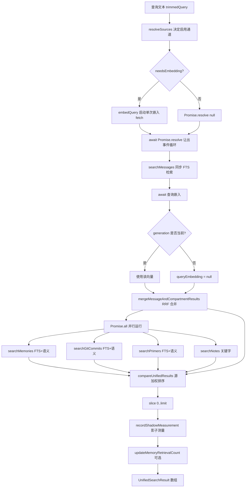
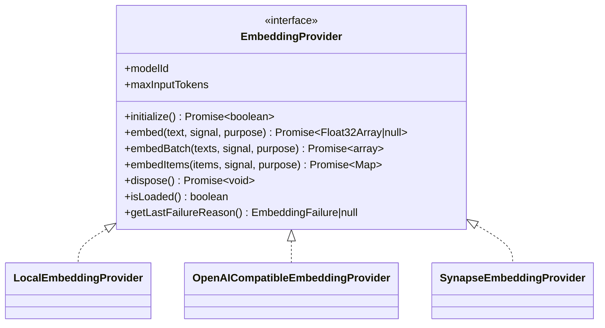
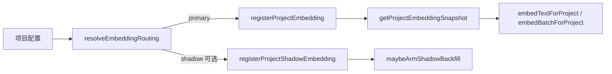

`ctx_search` 是编码代理的"长期记忆回忆入口"，它背后是一条把**词法检索（FTS5/BM25）**、**语义检索（向量余弦相似度）**与**字面量探针**融合到统一排名中的管线。本文从第一性原理出发，先界定管线的两个调用入口，再逐层拆解检索通道、融合算法、嵌入提供者抽象、嵌入身份语义与注册/回填机制，帮助中级开发者建立一条"查询文本 → 候选集 → 融合排序 → 格式化输出"的完整心智模型。

Sources: [tools.ts](packages/plugin/src/tools/ctx-search/tools.ts#L1-L40), [search.ts](packages/plugin/src/features/magic-context/search.ts#L1-L55)

## 设计目标与边界

这套管线的核心约束是**只返回代理当前看不见的内容**。事实（facts）被刻意排除在可搜索来源之外，因为它们永远渲染在 `message[0]` 的 `<session-history>` 块里；同理，已渲染的记忆与仍在上下文窗口内的"活跃尾部"消息也会被硬过滤。管线对外暴露五个来源：`memory`、`message`、`git_commit`、`primer`、`note`，其中 `compartment` 作为分区的语义命中类型在内部与 `message` 合并。查询嵌入在整个 `unifiedSearch` 中**只计算一次**，随后被记忆、git 提交、分区块、引子等多条通道共用，避免向单 GPU 嵌入端点发出重复的并行 HTTP 请求。

Sources: [search.ts](packages/plugin/src/features/magic-context/search.ts#L37-L54), [types.ts](packages/plugin/src/tools/ctx-search/types.ts#L7-L11), [search.ts](packages/plugin/src/features/magic-context/search.ts#L1775-L1804)

## 双入口：显式工具与热路径自动提示

管线有两个调用者。其一是 `ctx_search` 工具（`createCtxSearchTool`），它以 `explicitSearch: true` 运行，启用字面量探针多查询，并默认递增记忆的 `retrieval_count` 计数器——代理显式请求了记忆就说明它被消费了。其二是**转换热路径的自动搜索**（`auto-search-runner.ts`），它把用户提示词嵌入后运行同一条 `unifiedSearch`，但用 3 秒超时包裹并设置 `countRetrievals: false`：插件内部自动浮现不等于代理真正使用，误计数会污染基于检索次数的记忆晋升决策。

两入口共享的参数选项（`UnifiedSearchOptions`）包括 `limit`、`sources`、`visibleMemoryIds`、`maxMessageOrdinal`、`signal`、`countRetrievals`、`explicitSearch`、`measurementDisabled` 等，`unifiedSearch` 据此决定各条通道是否运行。

Sources: [tools.ts](packages/plugin/src/tools/ctx-search/tools.ts#L88-L200), [search.ts](packages/plugin/src/features/magic-context/search.ts#L105-L163), [auto-search-runner.ts](packages/plugin/src/hooks/magic-context/auto-search-runner.ts#L30-L85), [auto-search-runner.ts](packages/plugin/src/hooks/magic-context/auto-search-runner.ts#L358-L416)

## 统一检索整体架构

下面的流程图展示 `unifiedSearch` 内部的实际执行顺序——注意查询嵌入被刻意"提前启动"再让出事件循环，这是一个关键的延迟优化：`searchMessages` 的同步索引工作必须晚于嵌入 fetch 的派发，否则在长会话上嵌入请求会被同步索引阻塞数秒。

Sources: [search.ts](packages/plugin/src/features/magic-context/search.ts#L1733-L1981)

## 五类检索通道与匹配策略

每条通道独立产出候选，再在同一评分带内竞争。记忆与 git 提交共享"语义 0.7 + 词法 0.3"的混合权重，并在只有单一信号时乘以 `SINGLE_SOURCE_PENALTY`（0.8）以偏向混合命中。消息通道则使用 **BM25 排名 + 线性衰减**（`linearDecayScore`，`1 - rank/total`），旧版 `1/(rank+1)` 崩塌过快导致次级消息命中被埋葬。分区块通道用余弦相似度对分块向量打分，并按分区取最高分块。

| 通道 | 词法 | 语义 | 输出类型 | 关键约束 |
|---|---|---|---|---|
| memory | `memory_fts` MATCH + bm25 | 余弦相似度 | `MemorySearchResult` | 状态限 `active`/`permanent` 且未过期 |
| message | `message_history_fts` MATCH + bm25 | 无（用分区块承载语义） | `MessageSearchResult` | `ordinal ≤ messageOrdinalCutoff` |
| compartment | 无 | 分块向量余弦 | `CompartmentSearchResult` | 与 message 经 RRF 合并 |
| git_commit | `git_commits_fts` + LIKE 回退 | 提交向量余弦 | `GitCommitSearchResult` | 需 `gitCommitEnabled` |
| primer | FTS | 余弦相似度 | `PrimerSearchResult` | 非工作区逐身份嵌入 |
| note | 关键字分词打分 | 无 | `NoteSearchResult` | 仅 `active`/`pending`/`ready` |

Sources: [search.ts](packages/plugin/src/features/magic-context/search.ts#L37-L54), [search.ts](packages/plugin/src/features/magic-context/search.ts#L664-L810), [search.ts](packages/plugin/src/features/magic-context/search.ts#L812-L824), [search.ts](packages/plugin/src/features/magic-context/search.ts#L1331-L1385), [search-git-commits.ts](packages/plugin/src/features/magic-context/git-commits/search-git-commits.ts#L106-L200), [storage-memory-fts.ts](packages/plugin/src/features/magic-context/memory/storage-memory-fts.ts#L55-L130)

## 融合排序：RRF、探针与源加权

消息通道的多探针召回是理解融合算法的关键。`sanitizeFtsQuery` 会把查询按空白切分并把每个 token 用双引号包裹后 **AND 连接**，于是长自然语言查询只匹配同时包含所有词的消息；一个只含字面量 `/ctx-status` 的消息会永久丢召回。为修复这一点，显式搜索会通过 `extractLiteralProbes` 抽取符号/命令/路径/标识符探针，把**完整查询**与**每个探针**作为独立 FTS 排名各自执行，再用**倒数排名融合（RRF，k=60）**合并。每个探针列表按其文档频率加权（`probeDiscriminationWeight`），常见 acronym 的信号被压低；命中探针字面量的消息额外获得一个 `1/RRF_K` 的 verbatim 奖励——刻意使用与 RRF 同一量纲，避免旧版扁平 `+0.5` 奖励（约为 RRF 尺度 30 倍）让分数饱和。

融合后的分数会被映射回与单查询路径一致的 `linearDecayScore` 0..1 带，以保证跨源可比。最终所有通道的结果由 `compareUnifiedResults` 排序，按源加权后再比较：

| 来源 | 源加权 | 平局打破规则 |
|---|---|---|
| memory | 1.3 | memoryId 升序 |
| message / compartment | 1.275 | messageOrdinal / startOrdinal 升序 |
| git_commit | 1.2 | committedAtMs 降序（新提交优先） |
| primer | 1.25 | support 降序，再 primerId 升序 |
| note | 1.0 | createdAt 降序，再 noteId 升序 |

Sources: [search.ts](packages/plugin/src/features/magic-context/search.ts#L974-L997), [search.ts](packages/plugin/src/features/magic-context/search.ts#L999-L1159), [search.ts](packages/plugin/src/features/magic-context/search.ts#L1387-L1470), [search.ts](packages/plugin/src/features/magic-context/search.ts#L1472-L1522), [literal-probes.ts](packages/plugin/src/features/magic-context/literal-probes.ts#L1-L86), [storage-memory-fts.ts](packages/plugin/src/features/magic-context/memory/storage-memory-fts.ts#L85-L93)

## ID 形状查询的短路路径

代理在 `<project-memory>`、仪表盘、引导文本中处处看到记忆 id（`#id:` 行），因此当整个查询恰好是 1 到 5 个 id 形状 token 时，`parseIdShapedQuery` 会识别它并走 `resolveMemoriesByIdsForSearch` 直接按 id 查库，完全绕过词法+语义通道。该正则要求 token 至少含一个数字，`"fix bug 1234"` 这类数字短语仍走正常检索；若没有任何 id 解析成功（被工作区隐藏、缺失、硬删除），则回落到常规通道。

Sources: [search.ts](packages/plugin/src/features/magic-context/search.ts#L245-L278), [search.ts](packages/plugin/src/features/magic-context/search.ts#L1645-L1731), [tools.ts](packages/plugin/src/tools/ctx-search/tools.ts#L150-L172)

## 可见性过滤与活跃尾部排除

两条硬过滤在候选产出后、返回前生效。**记忆过滤**使用 `getVisibleMemoryIds` 得到已渲染进 `<session-history>` 的 id 集合，命中者被丢弃并记入 `diagnostics.suppressedVisibleMemoryIds`（这样空结果集可以解释"检索成功，只是匹配的记忆已在你视野内"）。**消息过滤**使用 `getLastCompartmentEndMessage` 得到最后分区边界作为 `messageOrdinalCutoff`，且该截止条件被下推到 SQL 的 `LIMIT` 之前，防止活跃尾部命中挤占旧的可返回命中。注意当尚无任何分区时截止哨兵为 `0` 而非 `-1`——`-1` 表示"搜索全部"会把当前提示词泄漏回代理（即 issue #131 的相反意图）。

Sources: [tools.ts](packages/plugin/src/tools/ctx-search/tools.ts#L108-L135), [search.ts](packages/plugin/src/features/magic-context/search.ts#L87-L103), [search.ts](packages/plugin/src/features/magic-context/search.ts#L703-L708), [search.ts](packages/plugin/src/features/magic-context/search.ts#L856-L902)

## 嵌入提供者抽象

所有嵌入都经过 `EmbeddingProvider` 接口，它定义 `modelId`、`maxInputTokens`、`embed`、`embedBatch`、可选的 `embedItems`（保留条目身份以支持重试）、`dispose`、`isLoaded` 与 `getLastFailureReason`。`EmbeddingPurpose`（`"query"` | `"passage"`）驱动**非对称**的 query/document 处理：默认是 `"passage"`（索引内容），只有查询时才切换 query 侧的 input_type 与前缀。`embedText` 顶层包装会拒绝 Synapse 截断向量（`isSynapseEmbeddingTruncated`），返回 null 而非半截向量。

Sources: [embedding-provider.ts](packages/plugin/src/features/magic-context/memory/embedding-provider.ts#L1-L40), [embedding.ts](packages/plugin/src/features/magic-context/memory/embedding.ts#L239-L251), [embedding-openai.ts](packages/plugin/src/features/magic-context/memory/embedding-openai.ts#L168-L204)

## 三类提供者实现对比

| 提供者 | 运行时 | 非对称处理 | 稳健性机制 |
|---|---|---|---|
| `local` | transformers.js + ONNX（native，Bun 版本兼容时回退 wasm） | 纯编码器，query/document 字节相同 | 模型加载文件锁 + 心跳；native 失败一次性回退 wasm |
| `openai-compatible` | 远程 HTTP `/embeddings` | `input_type`/`query_instruction`/`document_prefix` 按 purpose 切换 | 熔断器（3 次失败/60s → 开路 5min）+ SSRF 守卫 + 30s 超时 |
| `synapse` | 外部 Synapse 服务 | 由 lane 描述符决定 | 认证明细、错误词汇表、截断披露校验、批量请求台账 |

**本地提供者**在初始化前会解析运行时（`resolveLocalEmbeddingRuntime`）：Bun 且版本低于 1.4.0 时选择 wasm 以规避 NAPI teardown 双重释放崩溃；native 加载永久性失败时回退到 bundled web 入口并锁存，避免每次嵌入都重放坏掉的加载。**OpenAI 兼容提供者**在 `initialize` 中执行 SSRF 守卫，屏蔽 link-local（`169.254.0.0/16`，含云元数据）与已知元数据主机名/IPv6 字面量，但**放行** loopback 与 RFC1918 私有段以保持 LMStudio/Ollama 可用；请求还以 `redirect: "error"` 拒绝对重定向，防止允许的主机用 307/308 把 bearer token 与记忆内容转发到元数据端点。

Sources: [embedding-local.ts](packages/plugin/src/features/magic-context/memory/embedding-local.ts#L79-L86), [embedding-local.ts](packages/plugin/src/features/magic-context/memory/embedding-local.ts#L596-L655), [embedding-local.ts](packages/plugin/src/features/magic-context/memory/embedding-local.ts#L992-L1046), [embedding-openai.ts](packages/plugin/src/features/magic-context/memory/embedding-openai.ts#L142-L166), [embedding-openai.ts](packages/plugin/src/features/magic-context/memory/embedding-openai.ts#L261-L268), [embedding-openai.ts](packages/plugin/src/features/magic-context/memory/embedding-openai.ts#L441-L529), [embedding-ssrf.ts](packages/plugin/src/features/magic-context/memory/embedding-ssrf.ts#L1-L111)

## 嵌入身份与重嵌入语义

提供者身份（`providerIdentity`）决定何时必须重嵌入。`getEmbeddingProviderIdentity` 对若干结构化字段做规范化哈希：provider 种类、模型名、规范化端点、**API key 仅以存在性参与**（轮换 key 不泄漏且不触发重嵌入）、`input_type`、`document_prefix`、`truncate` 等——这些都会塑造存储的 passage 向量。反之 `query_input_type`/`query_instruction` 只影响每次调用的查询向量，被排除在身份之外。局部 `local_dtype` 也仅在其**非默认**（非 `fp32`）时条件性折叠进身份，以保证升级对既有安装字节级无变化。

模型名匹配（`embeddingModelsMatch`）在 trim+小写后按 token 边界做前缀/后缀容差，使服务端版本扩展（`…-small` → `…-small-v1`）或厂商前缀裁剪仍算匹配；但**绝非**子串测试——否则宽泛配置名会匹配到仅做中间片段的不相关服务模型，造成"以错误身份存储错误维度向量"的损坏。文本前缀配方（`resolveEmbeddingTextPrefixes`）内建 Qwen3、gte-Qwen-instruct、e5-instruct、nomic-embed-text 等模型族的 query/document 前缀。

Sources: [embedding-identity.ts](packages/plugin/src/features/magic-context/memory/embedding-identity.ts#L1-L83), [embedding-model-match.ts](packages/plugin/src/features/magic-context/memory/embedding-model-match.ts#L31-L68), [embedding-model-match.ts](packages/plugin/src/features/magic-context/memory/embedding-model-match.ts#L85-L145)

## 项目嵌入注册表与代际（generation）

运行时不直接持有全局提供者，而是通过 `project-embedding-registry.ts` 以**项目身份**注册。`registerProjectEmbedding` 计算 `providerIdentity`、`runtimeFingerprint` 与 `chunkModelId`，只有当这些全部未变（且先前非观察模式）时才复用旧提供者，否则递增全局 `generation` 并丢弃旧提供者。`embedTextForProject` 在产出向量后**再次**校验 `generation` 与 `runtimeFingerprint` 未变，若期间发生了重配置则返回 null——这是一种防止把旧世代向量写入新世代的竞态防护。`getProjectEmbeddingSnapshot` 返回注册快照（含 `generation`、`modelId`、`chunkModelId`、`features`），`unifiedSearch` 用它判断 `generationIsCurrent` 并决定是否丢弃查询向量。

Sources: [project-embedding-registry.ts](packages/plugin/src/features/magic-context/project-embedding-registry.ts#L130-L167), [project-embedding-registry.ts](packages/plugin/src/features/magic-context/project-embedding-registry.ts#L1205-L1259), [project-embedding-registry.ts](packages/plugin/src/features/magic-context/project-embedding-registry.ts#L2305-L2376), [search.ts](packages/plugin/src/features/magic-context/search.ts#L1836-L1851)

## 嵌入路由与引导注册

配置到提供者之间隔着 `resolveEmbeddingRouting`：当 `embedding.provider` 非 `synapse` 但开启了 `shadow_embedding` 时，它会探测 Synapse lane 元数据再构建独立的影子配置；否则由 `config` 直接产出主 lane 配置。Synapse 的 `primary`/`shadow` 双 lane 设计允许在主嵌入之外并行跑一条开发者镜像用于质量对比。`ensureProjectRegisteredFromOpenCodeDirectory` 是引导入口：加载项目配置、解析项目身份、执行路由、发出告警，最后用 `memory.enabled` 与 `memory.git_commit_indexing.enabled` 组装 `EmbeddingFeatures` 并注册主（及可选影子）lane。

Sources: [embedding-routing.ts](packages/plugin/src/plugin/embedding-routing.ts#L180-L258), [embedding-bootstrap.ts](packages/plugin/src/plugin/embedding-bootstrap.ts#L1-L51), [project-embedding-registry.ts](packages/plugin/src/features/magic-context/project-embedding-registry.ts#L1261-L1360)

## 分区块嵌入与窗口化

长上下文的分区被切分为**窗口**后分别嵌入，查询时对每个分区取得分最高的窗口。`DEFAULT_COMPARTMENT_CHUNK_MAX_INPUT_TOKENS` 为 512，但实际填充只到配置 `max_input_tokens` 的 `CHUNK_WINDOW_SAFETY_RATIO`（0.9）——因为提供者的 token 数与本地分词器有约 1% 偏差，把预算留出安全边际。切分使用改写自 `@langchain/textsplitters` 的 `recursiveCharacterSplit`，按 `["\n\n", "\n", " ", ""]` 的粗到细分隔符层级贪心合并，尽量保持语义块完整。`MAX_WINDOWS_PER_EMBED_CALL` 被刻意压到 2：本地嵌入端点每个输入一次前向传播，把多个满窗口批进一个请求会让请求超时（观察到的主因是 16 窗口/请求在本地 4B 模型上 30s 超时）。解码后的搜索池还有一个 256MB 上限的 LRU 缓存。

Sources: [compartment-chunk-embedding.ts](packages/plugin/src/features/magic-context/compartment-chunk-embedding.ts#L11-L22), [compartment-chunk-embedding.ts](packages/plugin/src/features/magic-context/compartment-chunk-embedding.ts#L113-L135), [recursive-text-splitter.ts](packages/plugin/src/features/magic-context/recursive-text-splitter.ts#L1-L142), [project-embedding-registry.ts](packages/plugin/src/features/magic-context/project-embedding-registry.ts#L95-L105)

## 存储层与向量缓存

记忆向量存于 `memory_embeddings(memory_id, model_id, embedding)`，`saveEmbeddingIfHashMatches` 以 `normalized_hash` 做 CAS 写入：若在提供者调用期间记忆内容已变，则丢弃陈旧向量而非复活过期行。语义候选选择会读取 `peekProjectEmbeddings` 命中的缓存 id 并集，避免对不可能有向量的记忆发起嵌入。`embedding-cache.ts` 提供 60s TTL 的进程内 `projectPath × modelId` 缓存，`invalidateProject`/`invalidateMemory` 在注册与记忆变更时失效。分区块向量存于 `compartment_chunk_embeddings`，`loadCompartmentChunkEmbeddingsForSearch` 按 `sessionId`/`projectPath`/`modelId` 加载并按 `endOrdinal ≤ cutoff` 过滤。

Sources: [storage-memory-embeddings.ts](packages/plugin/src/features/magic-context/memory/storage-memory-embeddings.ts#L54-L200), [embedding-cache.ts](packages/plugin/src/features/magic-context/memory/embedding-cache.ts#L1-L89), [search.ts](packages/plugin/src/features/magic-context/search.ts#L636-L662), [compartment-chunk-embedding.ts](packages/plugin/src/features/magic-context/compartment-chunk-embedding.ts#L35-L50)

## 影子测量（质量遥测）

当项目同时注册了主 lane 与 Synapse 影子 lane 时，`unifiedSearch` 会在 `void` 分离的异步路径调用 `recordShadowMeasurement`：它用影子提供者重新嵌入查询、以影子模型 id 重跑同一 `unifiedSearch`（`measurementDisabled: true` 防止递归、`countRetrievals: false` 防止污染），然后把主/影子的结果 id 集合、延迟、覆盖度与语料哈希写入测量表。整段逻辑被 try/catch 包裹以保证任何异常都不会以未处理 promise rejection 形式冒泡到宿主进程。

Sources: [search-measurement.ts](packages/plugin/src/features/magic-context/search-measurement.ts#L30-L128), [search.ts](packages/plugin/src/features/magic-context/search.ts#L1940-L1952)

## 输出格式化

最终结果由 `formatSearchResults` → `formatUnifiedSearchResult` 渲染为带分数、来源标签与匹配类型的文本行：记忆附带 `id`/`category`/`source`/`match`，git 提交附带短 SHA 与相对时间（`formatSearchAge`），消息附带消息序号以便代理用 `ctx_expand` 展开上下文。诊断行会解释被抑制的可见记忆数、活跃尾部匹配数与 git 语料不可用状态，让"空结果"对代理是可理解的而非谜团。

Sources: [search.ts](packages/plugin/src/features/magic-context/search.ts#L1983-L2120)

## 下一步阅读

`ctx_search` 的检索上下文建立在跨会话的知识分类之上，建议接着阅读 [项目记忆体系与五类知识分类法](16-xiang-mu-ji-yi-ti-xi-yu-wu-lei-zhi-shi-fen-lei-fa) 理解被检索的记忆如何产生；[工作区与跨宿主记忆共享](18-gong-zuo-qu-yu-kua-su-zhu-ji-yi-gong-xiang) 解释本文 workspace 身份与共享类别过滤的来龙去脉；[SQLite 存储模式、迁移与时间戳约定](21-sqlite-cun-chu-mo-shi-qian-yi-yu-shi-jian-chuo-yue-ding) 覆盖 `memory_embeddings`、`compartment_chunk_embeddings`、`message_history_fts` 等表结构；[消息历史与 Git 提交索引](22-xiao-xi-li-shi-yu-git-ti-jiao-suo-yin) 说明词法通道背后的索引维护；[ctx_* 代理工具集](26-ctx_-dai-li-gong-ju-ji) 则是 `ctx_search`/`ctx_expand` 等工具的整体拼图。