Magic Context 的记忆默认以"项目"为隔离单位：一个会话只读自己项目身份下的记忆。**工作区（Workspace）** 是唯一的、显式的跨项目共享通道——把若干项目结成一组，让成员会话读取彼此的**部分**记忆；而**跨宿主共享**则是另一条正交的通道——OpenCode、Pi、OMP 三个 harness 指向同一份存储，因此同一个项目在不同宿主下看到的是同一份记忆池。本页聚焦这两条通道的判定规则、数据模型、失效与同步机制。

两条通道共享同一个底层前提：**记忆行由 `project_path`（项目身份）与 `category`（类目）两个维度定位**，`shareable` 与 `scope` 决定它是否允许离开自己的项目。所有可见性判定最终都收敛到一条谓词，读路径不允许出现第二套规则。

```mermaid
flowchart TB
    subgraph Hosts["宿主层（跨宿主共享）"]
        OC["OpenCode 1 / 2"]
        PI["Pi"]
        OMP["OMP"]
    end
    subgraph Store["共享存储根（单实例）"]
        DB[("context.db<br/>memories / workspaces /<br/>workspace_members")]
    end
    subgraph Runtime["Rust 运行时层（跨运行时镜像）"]
        MDB[("mc-store<br/>mc_memories / mc_workspaces /<br/>mc_workspace_members")]
    end
    OC --> DB
    PI --> DB
    OMP --> DB
    DB -->|state_sync: workspace payload| MDB
    DB -.->|epoch / fingerprint| OC
```

Sources: [data-path.ts](packages/plugin/src/shared/data-path.ts#L159-L199), [storage-db.ts](packages/plugin/src/features/magic-context/storage-db.ts#L1391-L1408), [module-state-sync.ts](packages/plugin/src/hooks/magic-context/module-state-sync.ts#L78-L81)

## 跨宿主共享的物理基础：单一存储根

跨宿主记忆共享不是通过同步协议实现的，而是通过**共享同一个目录**实现的。`getMagicContextStorageResolution()` 按固定优先级解析唯一的存储根：测试隔离 → `MAGIC_CONTEXT_STORAGE_DIR`（必须是绝对路径）→ `XDG_DATA_HOME/cortexkit/magic-context` → 平台默认 `~/.local/share/cortexkit/magic-context`。该模块的注释明确列出这一设计的四个目的，其中第一项即 "Shared project memories across harnesses"，并同时给出共享嵌入缓存、每机每项目单次 Dreamer 运行等附带收益。

Sources: [data-path.ts](packages/plugin/src/shared/data-path.ts#L159-L199), [data-path.ts](packages/plugin/src/shared/data-path.ts#L213-L253)

与之相对，**临时的、诊断性质的产物**按 harness 分目录：`os.tmpdir()/<harness>/magic-context/`，日志与 historian dump 各自隔离，避免多宿主日志互相污染，并让 `doctor --issue` 只报告对应宿主的诊断。即：**共享的是记忆与状态，隔离的是可观测性产物**。旧版 OpenCode 路径 `opencode/storage/plugin/magic-context` 仅保留用于一次性迁移。

Sources: [data-path.ts](packages/plugin/src/shared/data-path.ts#L10-L56), [data-path.ts](packages/plugin/src/shared/data-path.ts#L284-L293)

宿主之间的代码一致性由共享包保证：`packages/pi-plugin` 直接从 `@magic-context/core/features/magic-context/workspaces` 导入工作区解析函数，Pi 的 `ctx_memory` 与 `inject-compartments-pi` 复用与 OpenCode 完全相同的身份集合、展开与共享类目解析逻辑，而不是各自重新实现。

Sources: [ctx-memory.ts](packages/pi-plugin/src/tools/ctx-memory.ts#L79-L84), [inject-compartments-pi.ts](packages/pi-plugin/src/pi-plugin/../inject-compartments-pi.ts#L59-L64)

## 项目身份：`git:<root-commit>` 作为跨宿主、跨克隆的稳定键

工作区成员表以 `project_path` 为主键，而这个 `project_path` 并不是文件系统路径，而是**项目身份**。`resolveProjectIdentityStrict()` 执行 `git rev-list --max-parents=0 HEAD`，取最小（按字典序）根提交哈希，返回 `git:<sha>`。选字典序最小值是为了处理 grafted history 的**多根提交**情形，避免枚举顺序随遍历变化而抖动、把同一仓库的记忆池劈成两半。该注释同时点明根提交哈希"在不同 worktree、克隆、fork 之间相同"，因此**同一仓库的不同检出会共享记忆**。

Sources: [project-identity.ts](packages/plugin/src/features/magic-context/memory/project-identity.ts#L1-L12), [project-identity.ts](packages/plugin/src/features/magic-context/memory/project-identity.ts#L271-L326)

非 git 目录回退为 `dir:<md5-12>`（对 `path.resolve` 后的绝对路径取 MD5 前 12 位）。失败被分类为 `ProjectIdentityErrorClass`，其中只有 `permission_denied` 不允许静默回退；其余（`not_git_repo` / `git_missing` / `git_timeout` / `dubious_ownership` / `unknown`）都会带冷却期地回退，且 git 恢复后身份会自愈翻转为稳定的 `git:`。生产与旧数据之间的桥梁是 `normalizeStoredProjectPath()`：已是 `git:`/`dir:` 前缀的值按字节原样返回，裸文件系统路径则重新解析；`storedPathBelongsToIdentity()` 用它让一个会话仍能管理存储在旧裸路径下的记忆——注释明确指出这是"两个 harness 共享"的行为，Pi 早期用裸 `===` 比较，与 OpenCode 不一致。

Sources: [project-identity.ts](packages/plugin/src/features/magic-context/memory/project-identity.ts#L144-L155), [project-identity.ts](packages/plugin/src/features/magic-context/memory/project-identity.ts#L340-L342), [project-identity.ts](packages/plugin/src/features/magic-context/memory/project-identity.ts#L604-L641)

## 工作区数据模型与用户界面

工作区由两张表建模。`workspaces` 持有 `name`（唯一）、时间戳与 `share_categories`（JSON 数组文本，默认 `'["CONSTRAINTS"]'`）；`workspace_members` 以 `(workspace_id, project_path)` 为复合主键，携带 `display_name` 与 `display_path`。设计上**一个项目最多属于一个工作区**——由 `idx_workspace_member_unique` 对 `project_path` 建唯一索引强制。该约束由 Rust store 的 migration 6 首次建立，注释同时说明核心语义：成员会话读**成员记忆的并集**，但 **FOREIGN 成员**的记忆只在该工作区声明的共享类目内可见，而拥有者项目永远看到自己的全部记忆。

Sources: [storage-db.ts](packages/plugin/src/features/magic-context/storage-db.ts#L1391-L1408), [lib.rs](crates/mc-store/src/lib.rs#L610-L636)

宿主侧的 schema 由 TypeScript migration 34（建表 + 重置 m[0] 缓存列）与 35（新增 `share_categories` 列、回填旧行为 `'["CONSTRAINTS"]'`、并对既有成员清空 epoch）铺设。migration 35 使用 `ensureColumn` 而非裸 `ALTER`，原因写在注释里：其"失败后重查"能容忍并发进程在检查与 ALTER 之间添加同一列的竞态。列存在性/表存在性在运行期仍被反复探测（`tableExists` / `columnExists`），因此在 schema 尚未升级的宿主上工作区功能是**安全降级**的：dashboard 通过 `workspace_schema_ready` 判定后返回"Workspace are not available until the Magic Context plugin is updated."。

Sources: [migrations.ts](packages/plugin/src/features/magic-context/migrations.ts#L1626-L1744), [workspaces.ts](packages/plugin/src/features/magic-context/workspaces.ts#L35-L45), [workspaces.rs](packages/dashboard/src-tauri/src/workspaces.rs#L545-L552)

工作区的**写路径完全由 dashboard 的 Rust 后端持有**（`packages/dashboard/src-tauri/src/workspaces.rs`），插件侧只负责**读**。`create_workspace` / `rename_workspace` / `delete_workspace` 提供基础 CRUD；真正的批量语义在 `apply_workspace_changes`：它在单个 `IMMEDIATE` 事务内接收 rename、`add_members`、`remove_members`、`set_display_names`、`share_categories` 五组变更，先把**所有校验作用于暂存后的成员映射**，再落库。注释解释了这一顺序的必要性：一次性 Save 允许复用被移除者释放出的 display name，从而避免旧的逐动作校验产生假阳性，同时仍保持最终唯一性不变量。`rename_workspace` 特意**不 bump epoch**——因为工作区名不会被渲染进 m[0]/m[1]，只有成员的 `display_name` 影响 `source=` 归属。

Sources: [workspaces.rs](packages/dashboard/src-tauri/src/workspaces.rs#L552-L569), [workspaces.rs](packages/dashboard/src-tauri/src/workspaces.rs#L571-L594), [workspaces.rs](packages/dashboard/src-tauri/src/workspaces.rs#L611-L839)

一个显式的不变量是**排除用户家目录**：`apply_workspace_changes` 对每个新成员调用 `is_user_home_workspace_member()`，命中即拒绝并返回 "The home directory cannot be added to a workspace. Home sessions are intentionally isolated from workspace memory sharing."。实现上它同时比对 `dir:<md5-12>` 形式的 home 身份与 `fs::canonicalize` 后的真实路径，双保险地阻止把家目录变成"舰队级"记忆池。dashboard 侧的 `SHARE_CATEGORY_OPTIONS` 恰好枚举五个 v2 类目，默认值是 `["CONSTRAINTS"]`。

Sources: [workspaces.rs](packages/dashboard/src-tauri/src/workspaces.rs#L841-L860), [workspaces.rs](packages/dashboard/src-tauri/src/workspaces.rs#L650-L665), [workspace-staging.ts](packages/dashboard/src/components/WorkspacesPanel/workspace-staging.ts#L8-L16), [CONFIGURATION.md](CONFIGURATION.md#L284)

## 共享类目策略：语义、默认值与降级规则

`share_categories` 决定"外来成员的哪些类目能进入本项目的读视图"。其解析集中在 `resolveWorkspaceShareCategories()`，返回类型 `string[] | null` 本身就是一套三态语义：

| 返回值 | 含义 |
|---|---|
| `null` | 该项目**不在任何工作区**，调用方走单项目快路径 |
| `[]` | 在工作区内，但**不共享任何外来类目**（显式关闭或配置损坏后的保守取值） |
| `["CONSTRAINTS", ...]` | 共享列出的类目 |

`normalizeShareCategories()` 的降级规则是刻意的**保守失败**：`null`/`undefined` 视为"列尚不存在"，回退默认 `["CONSTRAINTS"]`；但**非字符串、JSON 解析失败、非数组、含未知类目**一律返回 `[]` 并打 WARN。也就是说"配置坏了"等价于"什么都不共享"，而不是"全部共享"。`selectWorkspaceShareCategories()` 在成员表缺失、`workspaces` 表缺失等路径上同样返回 `[]`。

Sources: [workspaces.ts](packages/plugin/src/features/magic-context/workspaces.ts#L32-L33), [workspaces.ts](packages/plugin/src/features/magic-context/workspaces.ts#L59-L147), [workspaces.ts](packages/plugin/src/features/magic-context/workspaces.ts#L149-L162)

哪些类目"可被共享"由 v2 五类知识分类法界定：只有 `PROJECT_RULES`、`ARCHITECTURE`、`CONSTRAINTS`、`CONFIG_VALUES`、`NAMING` 进入 `VALID_SHARE_CATEGORIES`。dashboard 侧 `SHARE_CATEGORY_OPTIONS` 是同一集合的 UI 投影；`normalize_share_categories` 在 Rust 后端做同样的白名单校验。

Sources: [workspaces.ts](packages/plugin/src/features/magic-context/workspaces.ts#L32), [workspace-staging.ts](packages/dashboard/src/components/WorkspacesPanel/workspace-staging.ts#L8-L16), [workspaces.rs](packages/dashboard/src-tauri/src/workspaces.rs#L415-L452)

## 可见性判定：一条规范谓词与 fail-closed 读契约

判断"某行外来记忆对本会话是否可见"的规则被提炼成一条**规范谓词** `FOREIGN_VISIBLE_SQL`，同时存在于 TypeScript 与 Rust store 中，且文件头注释要求两者**逐字节一致**，以保证 render、delta、search、revocation 四条路径共用同一个规则。其子句依次是：状态为 `active`/`permanent`、未过期、`shareable = 1`、`scope ∈ {project, ecosystem, universe}`、`category` 在 `share_categories` 中、`project_path` 属于同一工作区成员、且**不等于读者自身项目**。

Sources: [visibility.ts](packages/plugin/src/features/magic-context/memory/visibility.ts#L1-L6), [lib.rs](crates/mc-store/src/lib.rs#L50-L51)

宿主侧的等价实现是 `buildWorkspaceMemorySqlFilter()`。它把可见集合拆成两段 OR：**own 身份**无额外分类字段限制（拥有者看全部自己的记忆），**foreign 身份**则必须同时满足类目白名单与 `shareable = 1 AND scope IN (...)`。当 `shareCategories` 为 `null` 时它返回空 clause 且 `active: false`（非工作区路径）；当 foreign 集合非空但类目列表为空时返回 `AND 0 = 1`——即"在工作区里但不共享"时**什么外来记忆都读不到**。函数注释点明这条 builder 被 baseline、delta、watermark、FTS union 四条读路径共用，"防止一个隐藏的外来类目在某条路径渲染、却在另一条路径推进游标"。

Sources: [storage-memory.ts](packages/plugin/src/features/magic-context/memory/storage-memory.ts#L744-L798)

`getMemoriesByProjects()` 是这套过滤的批量读取封装，其注释明确了 own/foreign 的**状态集合不对称**：foreign 行始终使用完整的规范谓词（`active`/`permanent` + 未过期 + 分类字段），**独立于调用方为自己的行传入的 status 集合**（后者可能包含 `archived`，用于本地读取）。函数末尾故意保留 `void FOREIGN_VISIBLE_SQL;`，作为"本路径与 mc-store 规范常量保持对齐"的编译期锚点。

Sources: [storage-memory.ts](packages/plugin/src/features/magic-context/memory/storage-memory.ts#L800-L879)

`shareable` 与 `scope` 的语义由分类器提示词定义，二者正交。`scope` 取值 `project`（本项目）/`ecosystem`（同一技术栈、harness、provider 或公司生态的兄弟项目）/`universe`（对本代码库之外也普遍成立的协议或平台事实）。而 `shareable` 回答的是另一个问题——"同一个项目的同事看到它是否有益，且不含个人/本地/敏感信息"；提示词明确指出"事实的 scope 不决定 shareable"，且 host 会**强制失败关闭**地把密钥、凭据、个人路径等文本置为私有。

Sources: [types.ts](packages/plugin/src/features/magic-context/memory/types.ts#L22-L23), [types.ts](packages/plugin/src/features/magic-context/memory/types.ts#L51-L52), [classify-prompt.ts](packages/plugin/src/features/magic-context/dreamer/classify-prompt.ts#L50-L62)

在工作区内，**共享可见性仅授予读，不授予写**。`ctx_memory` 把两件事拆成两个谓词：`memoryVisibleToTool` 允许读到 foreign 行（受类目与分类字段约束），而 `memoryOwnedByTool` 要求 `targetIdentityForStoredPath(memory.projectPath) === projectPath` 才允许变更。Pi 的实现逐条镜像这一拆分，连"外来记忆被隐藏时不能用于 merge"的提示文案都对应实现。Rust store 在 `update_memory_content` 的文档注释中再次确认："Shared workspace visibility is read-only for primary agents"。

Sources: [tools.ts](packages/plugin/src/tools/ctx-memory/tools.ts#L649-L685), [ctx-memory.ts](packages/pi-plugin/src/tools/ctx-memory.ts#L469-L504), [lib.rs](crates/mc-store/src/lib.rs#L12476-L12479)

## 渲染归属与预算保底

外来记忆进入 `<project-memory>` 时会带上来源仓库名。`sourceNameForMemory()`（TS）与 `workspace_source_names()`（Rust）共享同一条规则：**只对非自身身份的行**产出归属，且名字取自工作区成员的 `display_name`。Rust 侧的实现是一个过滤链——先剔除 `project_path == own_identity` 的行，再剔除没有非空 `display_name` 的行——其单元测试 `workspace_sources_attribute_only_foreign_memories` 断言 own 行不出现在结果 map、foreign 行以其 display name 出现。

Sources: [workspaces.ts](packages/plugin/src/features/magic-context/workspaces.ts#L279-L293), [memory_render.rs](crates/mc-module/src/memory_render.rs#L98-L156), [memory_render.rs](crates/mc-module/src/memory_render.rs#L435-L455)

渲染层还有一条**公平性保底**：`trim_memories_to_budget` 在工作区模式下先放入所有 `permanent` 记忆，再把剩余预算**均分给每个联合身份**作为下限，逐个成员填充，最后回收剩余空间。这避免了大项目把预算吃光、使小项目在工作区内"隐身"。TS 侧存在同构实现（`floorTokens = remainingAfterPermanent / max(1, identities.length)`）。归属信息通过 `M0Inputs.source_name_by_id` 一路传入 `render_m0`，因此 m[0] 基线与 subsequent 渲染使用的是同一份归属表。

Sources: [m0_compose.rs](crates/mc-module/src/m0_compose.rs#L219-L291), [inject-compartments.ts](packages/plugin/src/hooks/magic-context/inject-compartments.ts#L1787-L1804), [memory_render.rs](crates/mc-module/src/memory_render.rs#L190-L215)

search、render、工具读路径共享同一份归属逻辑：`resolveSearchWorkspaceContext()` 与 `resolveWorkspaceRenderContext()` 都产出结构相同的上下文（`identities`、`expandedIdentities`、`ownIdentities`、`shareCategories`、`namesByIdentity`、`canonicalIdentityByStoredPath`、`isWorkspaced`），并各自用 `sourceNameForMemory` 生成 `Map<memoryId, sourceName>`。

Sources: [search.ts](packages/plugin/src/features/magic-context/search.ts#L296-L358), [inject-compartments.ts](packages/plugin/src/hooks/magic-context/inject-compartments.ts#L968-L1043)

## 缓存一致性：工作区指纹与 epoch 扇出

工作区共享必须与缓存稳定性共存——一次可见性变化只能触发**一次**硬物化，且时间流逝本身不得触发。为此，成员身份集合与共享策略被压成一个指纹。`computeWorkspaceEpochFingerprint()` 对一个成员排序后的列表做 SHA-256：先写入 `"share_categories"` 段（`null` 编码为 `"NO_WORKSPACE"`），再对每个身份写入 `identity + '\0' + epoch + '\n'`，其中 epoch 来自 `project_state.project_memory_epoch`。Rust 侧 `workspace_fingerprint_from_membership()` 用不同的拼装格式（`ws[m:<len>:<id>;...|share:<cat>;...]`）实现同一语义，其注释强调**过期时间被刻意排除**在工作区身份之外——"时间流逝本身不改变身份"，过期只在下一次常规硬物化时应用。

Sources: [workspaces.ts](packages/plugin/src/features/magic-context/workspaces.ts#L295-L334), [lib.rs](crates/mc-store/src/lib.rs#L2975-L2996)

指纹被存入 `session_meta.cached_m0_workspace_fingerprint`（migration 34 新增并清空），成为 m[0] 缓存的判定维度之一。渲染侧还会额外采集三组签名：`workspace_signature`（成员行与 `share_categories` 的拼接）、`workspace_epoch_signature`（每个规范身份的 epoch）、`alias_signature`（身份重键别名对）；三者与 `max_memory_id`、`max_memory_mutation_id` 等共同参与 `markerChangeProbeEquals` 的相等判定，任何一个变化都会让缓存标记失效。

Sources: [inject-compartments.ts](packages/plugin/src/hooks/magic-context/inject-compartments.ts#L1322-L1371), [inject-compartments.ts](packages/plugin/src/hooks/magic-context/inject-compartments.ts#L1245-L1289), [migrations.ts](packages/plugin/src/features/magic-context/migrations.ts#L1651-L1696)

epoch 的变更通过**扇出**实现：`bumpEpochsForWorkspaceMembers()` 解析调用者所在工作区的全部成员，在一个 `BEGIN IMMEDIATE` 事务里对每个身份的 `project_state.project_memory_epoch` 执行 `+1` 的 upsert；若调用时已在事务中则直接复用该事务，并以 `logSlowWriteTransaction("workspace_epoch_bump", ...)` 记录慢事务。dashboard 侧 `bump_epochs_for_workspace_mutation` 对**旧 ∪ 新**成员集合扇出，注释解释这正是缓存不变量：成员、归属名、共享策略三类变化各需要一次折叠机会，而纯 rename 或空操作 Save 不得搅动 epoch。

Sources: [workspaces.ts](packages/plugin/src/features/magic-context/workspaces.ts#L336-L423), [workspaces.rs](packages/dashboard/src-tauri/src/workspaces.rs#L830-L838)

还存在一条**数据库层的兜底触发**：migration 25 在 `mc_memories` 上建立 `AFTER UPDATE OF status, expires_at, scope, shareable, category` 的触发器，仅当"旧状态对外可见、新状态不可见"这个**完整的可见性转变**成立时，才对 `mc_memory_visibility_epoch` 做一次 `+1`。其注释点明意图：在 SQLite 中评估完整的新旧可见性转变，使直接 SQL 与 facade 变更都无法绕过 epoch。这样"撤销一条外来记忆的共享"会精确地产生一次缓存身份变化，而不过度触发。

Sources: [lib.rs](crates/mc-store/src/lib.rs#L1154-L1193)

## 跨运行时同步：把工作区推进 Rust 模块

Rust store 维护自己的一套 `mc_workspaces` / `mc_workspace_members`（migration 6），但它是宿主内存工作区的**镜像**，由 state sync 推送。TS 侧的 `resolveModuleWorkspaceContext()` 产出 `ModuleWorkspacePayload`：一个 `fingerprint` 加一组成员（每项携带 `project_path` 与 `share_categories`）。当身份集合长度 ≤ 1 时 payload 为 `null`，模块走单项目快路径。

Sources: [module-state-sync.ts](packages/plugin/src/hooks/magic-context/module-state-sync.ts#L78-L81), [module-state-sync.ts](packages/plugin/src/hooks/magic-context/module-state-sync.ts#L555-L600)

推送是**增量门控**的：只有 `useStateSyncDeltas` 关闭、或 `workspace_fingerprint` 相对于已确认水印发生变化时，才包含 `workspace` 段（`includeWorkspace`）。对应的 `workspace_fingerprint` 也随水位一起回传（`ModuleWatermarks.workspace_fingerprint`），因此成员/f策略变化只需一次全量推送，之后恢复 delta。

Sources: [module-state-sync.ts](packages/plugin/src/hooks/magic-context/module-state-sync.ts#L1527-L1533), [module-state-sync.ts](packages/plugin/src/hooks/magic-context/module-state-sync.ts#L64-L76)

Rust 侧接收端是 `replace_workspace_tx()`。它以 `name` 为冲突键做 upsert（保留同名行的持久 id），删除该工作区的旧成员后逐条插入新成员。注释揭示了一个跨运行时的细节：authority 工作区把绑定的 domain 身份作为 owning member 存储，而 state sync 按文件系统路径寻址路由——因此清理时通过 `mc_authority_route_bindings` 同时匹配两种拼写。`workspace_present` 标志区分"发送方省略了 workspace 段"与"显式清空"。

Sources: [lib.rs](crates/mc-store/src/lib.rs#L16895-L16956), [lib.rs](crates/mc-store/src/lib.rs#L10753-L10755), [lib.rs](crates/mc-store/src/lib.rs#L5329-L5331)

模块内的可见性过滤走另一个函数对：`workspace_union_memory_visibility_filter_for_column()` 同样把 own 行与 foreign 行拆成 OR 两段，且 foreign 分支**只在 `FOREIGN_VISIBLE_SQL` 实际包含 `shareable = 1` 时才附加完整分类子句**——即规范谓词文本本身充当了特性开关的权威源。`memory_foreign_visibility_outcome()` 则把同一语义实现为内存中的布尔判定，供"变更前后可见性对比"这类需要求值而非查询的场景使用。

Sources: [lib.rs](crates/mc-store/src/lib.rs#L18336-L18413), [lib.rs](crates/mc-store/src/lib.rs#L18342-L18366)

## 身份重键与别名展开

当项目身份发生变化（例如首次提交让 `dir:` 翻转成 `git:`、或历史重写）时，旧身份下的记忆行需要与工作区的当前身份集合对齐。`v22_identity_rekey_map` 记录 `old_project_path → new_project_path`，`expandWorkspaceIdentitySetWithAliases()` 据此把成员身份集合**扩展**出全部旧别名，并同时返回 `canonicalIdentityByStoredPath`：别名 → 规范身份的映射。这就是为什么读路径要先"展开"再过滤，而不是直接用成员表里的键。

Sources: [storage-db.ts](packages/plugin/src/features/magic-context/storage-db.ts#L1385-L1389), [workspaces.ts](packages/plugin/src/features/magic-context/workspaces.ts#L202-L240)

展开后的映射被用于三件事：`resolveStoredPathWorkspaceIdentity()` 把任意存储路径解析回成员身份（先直查、再规范化直查、再按 `storedPathBelongsToIdentity` 线性匹配）；`storedPathBelongsToWorkspace()` 判定某行是否属于本工作区；`sourceNameForMemory()` 用规范身份去取 `display_name`。因此**别名行也能被正确归属到成员仓库**，而不是因为路径不同被误判为外来未知项目。工作区身份集合还有一个"冷启动"特例：`ownIdentities` 若在展开后为空但 `projectPath` 在扩展集合中，则回退为 `[projectPath]`。

Sources: [workspaces.ts](packages/plugin/src/features/magic-context/workspaces.ts#L242-L293), [inject-compartments.ts](packages/plugin/src/hooks/magic-context/inject-compartments.ts#L1006-L1011)

## 不变量与边界小结

| 不变量 | 实现位置 | 后果 |
|---|---|---|
| 一个项目最多属于一个工作区 | `idx_workspace_member_unique`（对 `project_path` 唯一） | 成员关系可无歧义解析 |
| 共享是只读的 | `memoryOwnedByTool`；Rust `update_memory_content` 所有权复核 | 主代理无法改写外来记忆 |
| 配置损坏 = 不共享 | `normalizeShareCategories` 返回 `[]` | fail-closed，而非 fail-open |
| 工作区内但类目为空 → 读不到外来记忆 | `buildWorkspaceMemorySqlFilter` 返回 `AND 0 = 1` | 显式关闭不会被误解为全开 |
| 时间流逝不改变工作区身份 | `workspace_fingerprint_from_membership` 排除 expiry | 避免每次过期都硬折叠 |
| 家目录不可加入工作区 | `is_user_home_workspace_member` | 阻止形成"舰队级"记忆池 |
| rename 不 bump epoch | `rename_workspace` 无 epoch 逻辑 | 避免仅改名引发全员硬折叠 |
| 一次可见性变化只产生一次身份变化 | migration 25 的 `AFTER UPDATE` 触发器 | 撤销共享不会过度触发 |

Sources: [storage-db.ts](packages/plugin/src/features/magic-context/storage-db.ts#L1407), [tools.ts](packages/plugin/src/tools/ctx-memory/tools.ts#L682-L685), [workspaces.ts](packages/plugin/src/features/magic-context/workspaces.ts#L69-L97), [storage-memory.ts](packages/plugin/src/features/magic-context/memory/storage-memory.ts#L789-L791), [lib.rs](crates/mc-store/src/lib.rs#L2991-L2994), [workspaces.rs](packages/dashboard/src-tauri/src/workspaces.rs#L841-L860), [workspaces.rs](packages/dashboard/src-tauri/src/workspaces.rs#L585-L587), [lib.rs](crates/mc-store/src/lib.rs#L1156-L1158)

需要注意的两处**分层差异**是理解本主题的关键。其一，宿主 store 用 `memories` / `workspaces` / `workspace_members`，Rust module store 用 `mc_memories` / `mc_workspaces` / `mc_workspace_members`——规范谓词 `FOREIGN_VISIBLE_SQL` 写的是后者，因此它在 TS 侧是**策略文本权威**（并被 `void` 引用锚定），而实际的 host 查询由 builder 生成。其二，**跨宿主**（OpenCode/Pi/OMP 共享存储根）与**跨运行时**（TS 宿主 → Rust 模块镜像）是两条不同通道：前者靠单实例目录，后者靠 `workspace` state-sync 段与 `workspace_fingerprint` 门控。

Sources: [visibility.ts](packages/plugin/src/features/magic-context/memory/visibility.ts#L1-L4), [storage-memory.ts](packages/plugin/src/features/magic-context/memory/storage-memory.ts#L866-L868), [lib.rs](crates/mc-store/src/lib.rs#L610-L636), [module-state-sync.ts](packages/plugin/src/hooks/magic-context/module-state-sync.ts#L78-L81)

## 延伸阅读

工作区建立在其上的是记忆体系与检索管线：类目语义与 `shareable`/`scope` 的完整分类法见 [项目记忆体系与五类知识分类法](16-xiang-mu-ji-yi-ti-xi-yu-wu-lei-zhi-shi-fen-lei-fa)；工作区可见性如何进入 FTS 与向量检索的两条 lane，见 [统一搜索与嵌入管线](17-tong-sou-suo-yu-qian-ru-guan-xian)。若关心 `project_memory_epoch` / 指纹列所在的表结构与迁移约定，见 [SQLite 存储模式、迁移与时间戳约定](21-sqlite-cun-chu-mo-shi-qian-yi-yu-shi-jian-chuo-yue-ding)；Rust 模式下的 state sync 与镜像协议细节，见 [Rust 运行时模式与 subc 模块集成](25-rust-yun-xing-shi-mo-shi-yu-subc-mo-kuai-ji-cheng)；三宿主的对等实现差异见 [Pi / OMP 插件与跨宿主对等实现](24-pi-omp-cha-jian-yu-kua-su-zhu-dui-deng-shi-xian)。