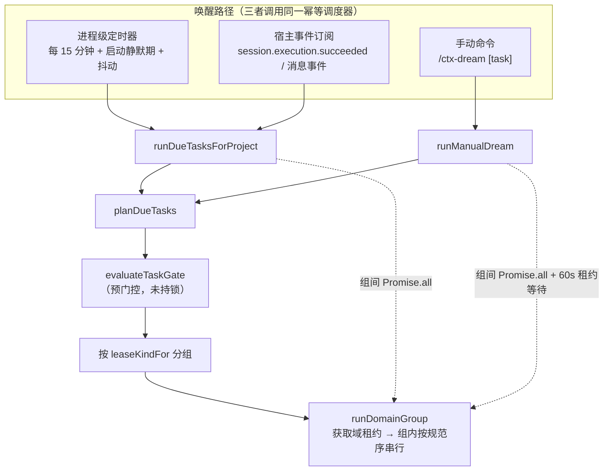
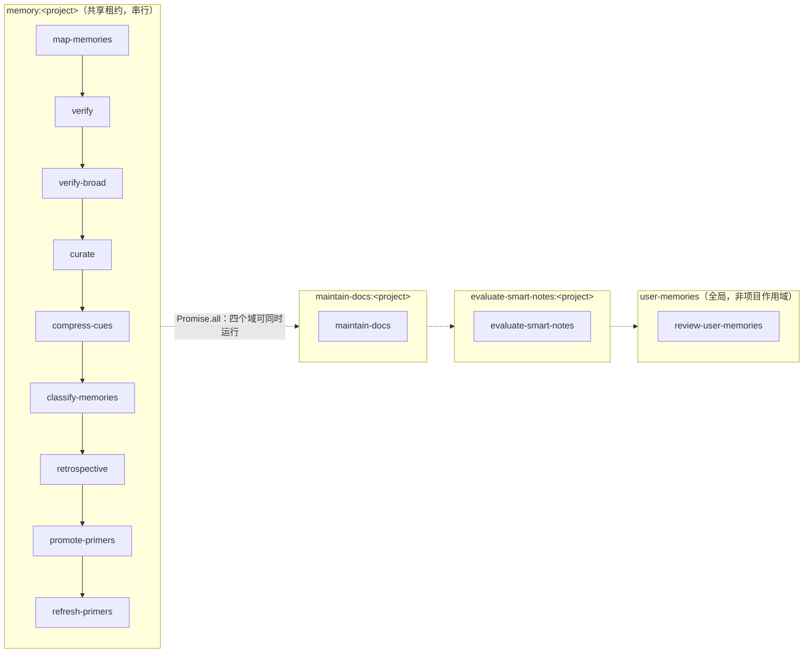
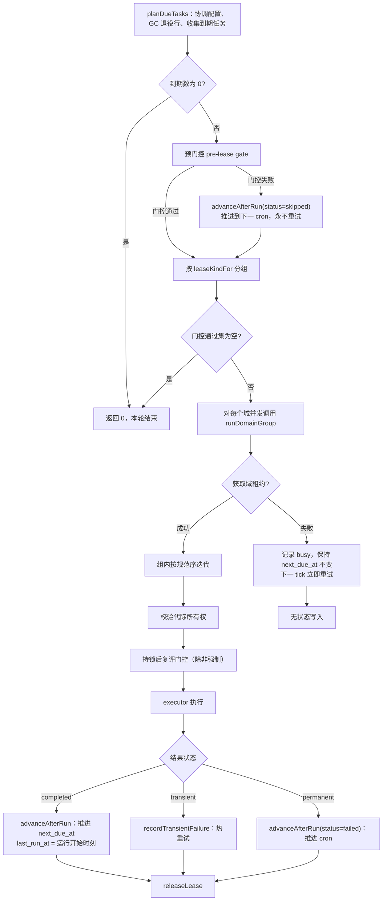
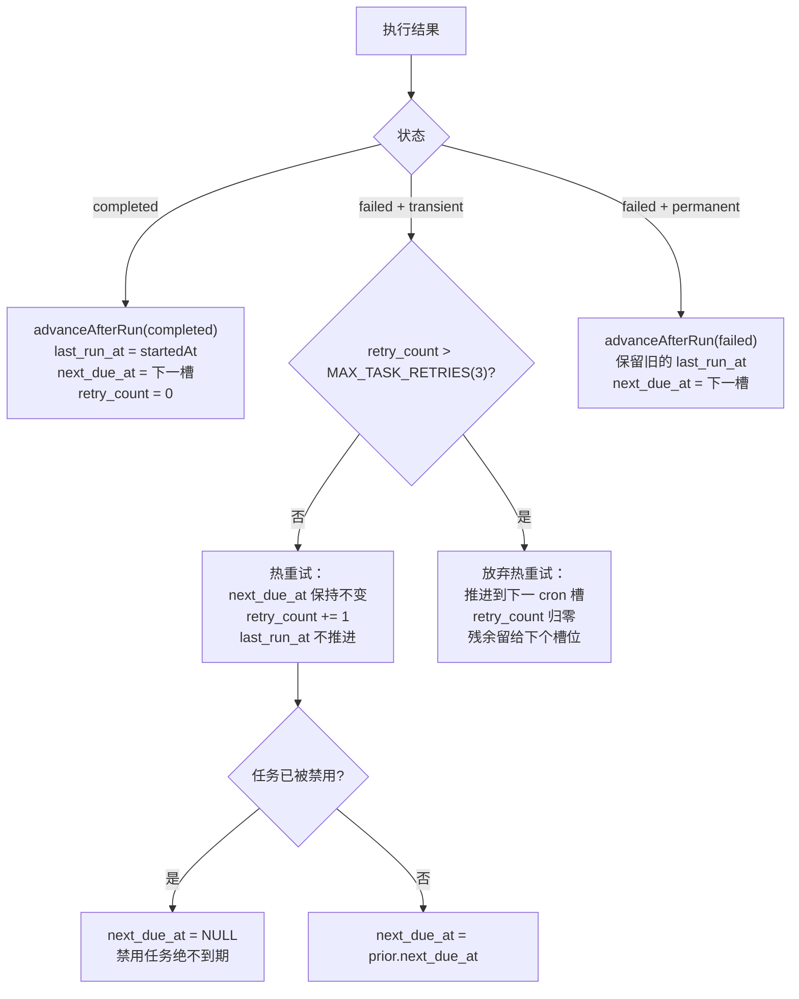

Dreamer 是 Magic Context 的后台维护平面：它不在会话主线里做任何工作，而是把"记忆校验、记忆策展、文档同步"等昂贵的 LLM 操作下沉到带时间窗的、可中断可恢复的独立子会话中。本页聚焦它的**任务调度与执行模型**——即"何时触发、触发什么、以什么并发度执行、如何判定成败与推进时钟"这五组机制，而不展开每个任务自身的提示词与产制细节。

Dreamer v2 的核心转变是：从"一个整体的 dream 运行"演进为**每个任务各自持有 cron 日程的规范任务集**。调度器（`task-scheduler.ts`）不关心任务做什么，它只负责把"到点的任务"按照冲突域分组、加锁、串行或并行地交给执行器（`task-executor.ts`）；执行器同样不关心调度，它只负责在给定租约与截止期内跑完一个任务的 LLM 循环并回报结构化结果。这种调度与执行的严格分离，是本模型可测试、可恢复、可跨宿主复用（OpenCode / Pi / OMP）的根本原因。Sources: [task-scheduler.ts](packages/plugin/src/features/magic-context/dreamer/task-scheduler.ts#L69-L91), [task-executor.ts](packages/plugin/src/features/magic-context/dreamer/task-executor.ts#L323-L329)

## 规范任务注册表：单一事实来源

调度的一切都始于一份**纯函数式的任务注册表**——它刻意不导入任何数据库代码，以便配置 schema 能在不拖入运行时依赖的前提下引用任务名。`CANONICAL_DREAM_TASKS` 定义了 12 个任务及其规范顺序：`map-memories` 排在 `verify` 之前（因为它记录 verify 门控所依赖的文件映射），并与其余记忆写任务共享同一租约域。Sources: [task-registry.ts](packages/plugin/src/features/magic-context/dreamer/task-registry.ts#L1-L30)

注册表同时承载三种分类维度，它们分别服务于调度、门控与提示构造三个不同的决策点。

| 维度 | 常量 | 语义 | 用途 |
|------|------|------|------|
| 工具能力 | `DREAM_TASK_CAPABILITIES` | 该任务是否必须有工具循环 | 在无工具的 hidden-completion 宿主上提前拒绝 |
| 执行路径 | `AGENTIC_DREAM_TASKS` | 仅 `curate` / `maintain-docs` 走通用 agent 提示 | 决定是否经过 `buildDreamTaskPrompt` |
| 租约域 | `MEMORY_DOMAIN_TASKS` | 读写项目 `memories` 表的任务集合 | 决定并发串行化边界 |

`requiresTools` 的语义值得精确理解：`verify`、`map-memories`、`curate` 等任务需要只读工具来对照真实代码，而 `classify-memories` 是**零工具纯变换**（仅从记忆文本打分），`compress-cues` 虽为零工具变换但其子传输仍需参数替换。因此当宿主能力声明 `tools: false` 时，只有前者会被显式拒绝。Sources: [task-registry.ts](packages/plugin/src/features/magic-context/dreamer/task-registry.ts#L32-L49), [task-executor.ts](packages/plugin/src/features/magic-context/dreamer/task-executor.ts#L513-L523)

## 三层触发路径：定时器、事件订阅与手动命令

同一个幂等调度函数 `runDueTasksForProject` 被三条独立路径唤醒，因此**触发层不承担任何状态机职责**——所有去重、并发与恢复语义都收敛在调度器和租约层。这种设计让"新增一种唤醒方式"退化为一次函数调用，而不必复制调度逻辑。

**进程级定时器**是主路径，它以 15 分钟为固定节拍，对每个已注册项目执行一次完整调度。首次注册会启动一个静默期（boot-quiet）内的启动扫描，并按目录哈希给每个项目分配抖动槽位，避免多项目同时启动造成的写入风暴；定时器自身带 `unref()`，不阻止进程退出。Sources: [dream-timer.ts](packages/plugin/src/plugin/dream-timer.ts#L68-L73), [dream-timer.ts](packages/plugin/src/plugin/dream-timer.ts#L249-L270), [dream-timer.ts](packages/plugin/src/plugin/dream-timer.ts#L363-L385)

**事件订阅**是辅助路径。OpenCode v2 车道订阅 `session.execution.succeeded` 事件；v1 车道则在消息事件上带一个节流间隔调用调度器。事件载体本身被明确禁止实现第二套队列或任务循环——它只负责"唤醒共享调度器"，而租约保证两条路径不会重叠执行同一任务。Sources: [dream-trigger.ts](packages/plugin/src/v2/hooks/dream-trigger.ts#L9-L50), [hook.ts](packages/plugin/src/hooks/magic-context/hook.ts#L1361-L1412)

**手动命令**通过 `runManualDream` 提供两种语义：无参时运行所有已启用任务（`schedule != ""`）中门控通过者，与定时路径完全同构；带任务名时**强制运行单个任务并跳过其活动门控**（显式用户意图），即便该任务日程为空也生效。与定时路径唯一的差别是：手动运行会为繁忙的域租约等待最多 60 秒（每 2 秒轮询一次），把"租约被占，稍后再试"变成用户真正想要的运行；定时扫描从不等待，因为下一个 tick 自然会重试。Sources: [task-scheduler.ts](packages/plugin/src/features/magic-context/dreamer/task-scheduler.ts#L305-L308), [task-scheduler.ts](packages/plugin/src/features/magic-context/dreamer/task-scheduler.ts#L438-L474)

## 调度状态：以配置为准的 cron 协调

每个 `(项目, 任务)` 对在 `task_schedule_state` 表中持有一行状态，记录上次运行时间、下次到期时间、生成 `next_due_at` 所依据的 cron 字符串、上次状态与重试计数。该表在迁移 v42 建立，随后的 v43、v45 通过增量列补齐了 verify 周期水位与 retrospective 内容水位——这些列刻意复用既有字段（如把任务本地 JSON 状态存进已废弃的 `last_checked_commit` 列），以避免额外 schema 迁移。Sources: [storage-task-schedule.ts](packages/plugin/src/features/magic-context/dreamer/storage-task-schedule.ts#L3-L44), [migrations.ts](packages/plugin/src/features/magic-context/migrations.ts#L1892-L1919), [migrations.ts](packages/plugin/src/features/magic-context/migrations.ts#L1934-L1959)

调度器每次扫描都执行一次 `reconcileSchedule`，把**配置中的 schedule 视为权威**。这一步不是可选的优化，而是修正一类具体缺陷：若只信任首次播种写入的 `next_due_at`，那么被禁用的任务仍会在旧时间点触发一次，而首次播种时因禁用而为 NULL 的任务在启用后将永远不到期。其判定分支如下表。

| 配置 schedule vs 已存 schedule | 处理 |
|---|---|
| 相等 | 已同步，不写入 |
| 配置为空串（禁用） | 强制 `next_due_at = NULL` |
| 已存为 NULL 但 `next_due_at` 非空 | 遗留行，回填字符串并保留已正确的到期时间 |
| 其他（真实变更或启用） | 从当前时刻重算 `next_due_at`，重置 `retry_count` |

Sources: [task-scheduler.ts](packages/plugin/src/features/magic-context/dreamer/task-scheduler.ts#L111-L155)

`planDueTasks` 在协调之后收集 `now >= next_due_at` 的任务，并顺带**垃圾回收已退役的任务行**：由于传入的任务集始终是完整规范集，任何不在其中的已存行都属于被 verify/curate 取代的旧任务（improve、consolidate、archive-stale 等），删除它们可避免这些行永久"到点"并污染仪表盘。Sources: [task-scheduler.ts](packages/plugin/src/features/magic-context/dreamer/task-scheduler.ts#L164-L199), [storage-task-schedule.ts](packages/plugin/src/features/magic-context/dreamer/storage-task-schedule.ts#L124-L145)

### cron 求值器的三个刻意约束

内置的 5 字段 cron 求值器只提供"某时刻之后的第一次出现"，而非完整的调度框架，其行为由三条明确约束定义。Sources: [cron.ts](packages/plugin/src/features/magic-context/dreamer/cron.ts#L1-L25)

第一，**时区采用机器本地时间**——Dreamer 的整个目的就是"在用户睡觉时运行"，这本质上是墙钟概念。求值器按真实分钟步进、再从候选时刻读取本地民用字段，从而在构造上正确处理 DST 转换，而不是依赖会产生歧义的 `setHours` 归一化。第二，**日匹配遵循 Vixie OR 语义**：当 dom 与 dow 同时被限制时，任一匹配即匹配；仅一个被限制时只查该字段；两者均未限制时每天匹配。第三，**禁止穷举搜索**：前向搜索上界约 4 年（覆盖 2 月 29 日这类闰年日程），超出即视为"永不"，因此 `0 0 31 2 *`（2 月 31 日）会被安全地判定为不可能而非死循环。Sources: [cron.ts](packages/plugin/src/features/magic-context/dreamer/cron.ts#L54-L61), [cron.ts](packages/plugin/src/features/magic-context/dreamer/cron.ts#L159-L176), [cron.ts](packages/plugin/src/features/magic-context/dreamer/cron.ts#L196-L217)

推进 `next_due_at` 时，调度器会传入"刚被满足的时间槽"作为排除键。这解决 DST 回拨导致的**同一墙钟分钟二次触发**：推进后计算下一次出现时会跳过该民用分钟键，因此一个每日槽位不会因时钟回拨而重复执行。Sources: [cron.ts](packages/plugin/src/features/magic-context/dreamer/cron.ts#L178-L195), [task-scheduler.ts](packages/plugin/src/features/magic-context/dreamer/task-scheduler.ts#L201-L229)

## 活动门控：不把 60 轮智能循环浪费在未变的池上

cron 只回答"是否该运行"，活动门控回答"是否**有工作可做**"。门控全部是廉价的计数查询——不加载整行、不调用 LLM、不获取租约——且刻意保守：不确定时放行。Sources: [task-gates.ts](packages/plugin/src/features/magic-context/dreamer/task-gates.ts#L20-L28)

门控的基准量是**任务自身的 `last_run_at`**（为 null 即从未运行，此时"自变更以来"型门控退化为"是否存在任何东西"）。但 `retrospective` 是一个重要例外：它门控于**内容水位**而非 `last_run_at`，因为一个在运行中途被更新的会话，其内容比 `last_run_at` 旧却比运行完成时间新，若以 `last_run_at` 为界会被静默跳过。同理，`maintain-docs` 依据"自上次运行以来的新分区数"门控。Sources: [task-gates.ts](packages/plugin/src/features/magic-context/dreamer/task-gates.ts#L30-L40), [task-gates.ts](packages/plugin/src/features/magic-context/dreamer/task-gates.ts#L386-L396)

下表汇总了各任务的门控谓词与其依赖的池/水位，可视为"何时该任务真的会做事"的权威判据。

| 任务 | 门控条件 | 说明 |
|---|---|---|
| `map-memories` | 存在无映射的活动记忆 | 一次性式回填，排空后即无操作 |
| `verify` | 活动记忆池非空 | 精确的增量分区由执行器文件门控完成 |
| `verify-broad` | 存在未关闭周期 **或** 池非空 | 保留空周期可运行，以让其关闭自身 |
| `curate` | 原始 `active`/`permanent` 计数 > 0 | 刻意用原始状态池，以便处理纯过期项目 |
| `compress-cues` | 活动池非空 | 精确的 NULL/陈旧哈希分区由执行器完成 |
| `classify-memories` | 活动池非空 | 无文件门控、无水位、无完整性前置 |
| `retrospective` | 自内容水位以来有项目会话 | 排除隐藏子代理会话 |
| `maintain-docs` | 自上次运行以来有新分区 | 从未运行 → 存在任意分区即通过 |
| `evaluate-smart-notes` | 有需编译/陈旧/回退的智能笔记 | 能力门控于 fleet wake plane |
| `review-user-memories` | 全局候选数 ≥ 阈值 | 候选跨项目共享 |
| `promote-primers` | 项目候选数 ≥ 阈值 | 阈值独立于用户记忆阈值 |
| `refresh-primers` | 存在答案缺失/未刷新/已过期的活动 primer | 逐条比对 `last_observed_at` 与 `answer_refreshed_at` |

Sources: [task-gates.ts](packages/plugin/src/features/magic-context/dreamer/task-gates.ts#L347-L425)

与门控同源的还有**只读积压探针**：`getDreamTaskBacklog` 复用与选择谓词相同的 SQL，给出 `pending`/`total`（curate 额外给出本次单类目作用域），供 `/ctx-dream` 与状态面板在运行前展示"将处理多少"。这套探针不获取租约、不物化提示缓存、不调用模型，因此可以在任意时刻安全采样。Sources: [task-gates.ts](packages/plugin/src/features/magic-context/dreamer/task-gates.ts#L231-L328)

## 冲突域租约：并发的正确性基石

调度器的并发模型可以概括为一句话：**组间并行、组内串行、跨进程互斥**。分组依据是 `leaseKindFor(task)` 返回的租约域。

记忆域之所以必须共享同一租约，是因为这些任务都在"读—改—写"项目 `memories` 表；并发运行会在语义上竞争——一个运行基于陈旧视图所做的合并或拆分，会与另一运行冲突。因此它们在同一个排水轮次中按**规范顺序**（`compareTaskOrder`）串行执行。相反，`maintain-docs`、`evaluate-smart-notes` 各自持有独立域，可安全并行。Sources: [task-registry.ts](packages/plugin/src/features/magic-context/dreamer/task-registry.ts#L117-L133), [task-registry.ts](packages/plugin/src/features/magic-context/dreamer/task-registry.ts#L176-L182)

`review-user-memories` 是唯一**全局域**：它修改的是跨项目的用户画像池，因此两个不同项目的 Dreamer 绝不能并发评审。与之对应，租约键解析对用户记忆域不加项目前缀（键为字面量 `"user-memories"`），其余域一律为 `<kind>:<projectIdentity>`，使不同项目永不互相阻塞。Sources: [task-registry.ts](packages/plugin/src/features/magic-context/dreamer/task-registry.ts#L137-L170)

### 租约原语与心跳

租约以 `dream_state` 表中的四行表示（holder / heartbeat / expiry / generation），默认 TTL 为 2 分钟。获取与释放走 `BEGIN IMMEDIATE`：SQLite 在代码读取与更新这四行之前先取得写锁，使每次决策在多进程共享同一数据库的前提下保持原子，从而杜绝重复获取。Sources: [lease.ts](packages/plugin/src/features/magic-context/dreamer/lease.ts#L7-L16), [lease.ts](packages/plugin/src/features/magic-context/dreamer/lease.ts#L99-L130), [lease.ts](packages/plugin/src/features/magic-context/dreamer/lease.ts#L137-L159)

**generation（代际）**是租约的核心防伪机制。同一持有者续约保持代际不变，而新持有者获取时递增代际。因此 `leaseOwnershipMatches` 同时校验代际与持有者，任何"代际已变"都意味着另一个持有者曾取得租约——这正是长任务在运行中途发现自身已被顶替、必须中止的依据。Sources: [lease.ts](packages/plugin/src/features/magic-context/dreamer/lease.ts#L87-L97), [lease.ts](packages/plugin/src/features/magic-context/dreamer/lease.ts#L149-L158)

因为执行器持有的任务可能长达 20 分钟，`startLeaseHeartbeat` 在 120 秒租约的中点（60 秒）心跳续约，为延迟或竞争的续约预留约 60 秒缓冲。心跳的降级路径是分级的：成功续约更新确认时间；代际变化立即判定丢失；若续约失败但距上次确认仍在 TTL 内，则尝试重新获取一个已过期且无主的租约；一旦距上次确认超过完整 TTL，则声明"租约滑出 TTL"并触发 `onLost`。心跳在返回前**同步确认一次所有权**，否则调用方可能在暂停至租约过期后才开始工作，而那时另一任务已获取同键。Sources: [lease.ts](packages/plugin/src/features/magic-context/dreamer/lease.ts#L216-L232), [lease.ts](packages/plugin/src/features/magic-context/dreamer/lease.ts#L254-L319)

对于必须原子化的读—改—写，`runLeaseGuardedWrite` 提供了一层"守卫写"：它在 `BEGIN IMMEDIATE` 取得写锁**之后**、执行写操作**之前**重新校验持有者，确保另一进程无法在写之前夺走租约。这是执行器在每次持久化写入前应当采用的模式。Sources: [lease.ts](packages/plugin/src/features/magic-context/dreamer/lease.ts#L193-L214)

## 单轮调度：从到期到执行的完整路径

`runDueTasksForProject` 把一个调度轮次压缩成五步，每一步都有明确的失败语义。

第一，**预门控**在获取租约前过滤掉无工作的任务，避免为一个空任务白白加锁；门控失败即 `advanceAfterRun(skipped)` 推进到下一 cron——注意这与"租约繁忙"的处理完全不同，前者是确定的"无工作"，后者是"稍后再试"。Sources: [task-scheduler.ts](packages/plugin/src/features/magic-context/dreamer/task-scheduler.ts#L556-L581)

第二，**持锁后复评门控**：由于组间并行且存在全局域，一个兄弟任务或其他进程可能刚刚消费了工作（对全局 user-memories 域尤其关键），因此必须在取得租约后重新评估。唯一的例外是强制手动单任务运行，它按定义跳过此复评。Sources: [task-scheduler.ts](packages/plugin/src/features/magic-context/dreamer/task-scheduler.ts#L342-L370)

第三，**租约获取失败不写任何状态**：`next_due_at` 保持不变，因此这些任务在下一 tick 会立即重试，并在租约释放的瞬间运行。这是"组间并行"这一设计的直接后果——同一域内的任务看到的是同一把锁。Sources: [task-scheduler.ts](packages/plugin/src/features/magic-context/dreamer/task-scheduler.ts#L333-L340)

第四，**组内每次迭代前校验代际**：一旦发现租约丢失（另一持有者夺取），当前组剩余的后续任务会被立即中止，而不是带着失效的租约继续写库。Sources: [task-scheduler.ts](packages/plugin/src/features/magic-context/dreamer/task-scheduler.ts#L343-L349)

第五，`last_run_at` 只在**成功**时推进，且被戳记为**运行开始时刻**而非完成时刻。这个细节很重要：一条在运行中途落库的消息/分区，其时间戳晚于运行开始时间，因此会再次触发门控，而不是被下一次槽位静默跳过。Sources: [task-scheduler.ts](packages/plugin/src/features/magic-context/dreamer/task-scheduler.ts#L211-L221)

## 执行器：分派骨架与专用运行器

执行器由 `createDreamTaskExecutor(deps)` 构造，每次调用对应一个任务的一次执行。它的骨架职责是固定的，与任务种类无关：解析父会话、按需解析 Rust 模块权威路由、启动租约心跳、按任务分派到专用运行器、对比运行前后的记忆计数得到 `memory_changes`、并写入一条 `dream_runs` 遥测行。Sources: [task-executor.ts](packages/plugin/src/features/magic-context/dreamer/task-executor.ts#L323-L329), [task-executor.ts](packages/plugin/src/features/magic-context/dreamer/task-executor.ts#L362-L387)

一个值得单独指出的实现约束：父会话 id 的解析**记忆化的是 Promise 而非"标志位 + 值"**。因为域组是并发运行、多个任务会同时调用该解析，若先置标志再 await，则在该窗口内的并发调用者会读到尚未填充的值（`undefined`），导致其子会话以 `parent_id = NULL` 出现在顶层选择器中。共享同一个 Promise 让所有调用者等待同一份填充结果。Sources: [task-executor.ts](packages/plugin/src/features/magic-context/dreamer/task-executor.ts#L330-L360)

分派本身是一串按任务名的显式分支，而非表驱动，因为每个任务需要注入的依赖集与结果判读逻辑差异很大。下表给出了分派目标与其关键差异。

| 任务 | 运行器 | 门控性质 | 特殊之处 |
|---|---|---|---|
| `compress-cues` | `runCompressCues` | mural 未启用则记录 completed 并返回 | 刻意不静默：静默成功会掩盖接线缺口 |
| `review-user-memories` | `reviewUserMemories` | 全局候选阈值 | 隐私敏感，host 侧开关控制采集 |
| `map-memories` | `mapMemories` | 无映射记忆存在 | 分批持久化，逐批推进可"存入"部分进度 |
| `verify` / `verify-broad` | `runVerify` | 池非空 / 周期开放 | broad 模式可跨轮恢复 |
| `classify-memories` | `runClassify` | 池非空 | 零工具单向变换，缓存中性列写入 |
| `retrospective` | `runRetrospectiveTask` | 内容水位后有会话 | 先廉价 LLM 门控，命中才开子会话 |
| `curate` / `maintain-docs` | `runAgenticTask` | 见门控表 | 唯一的通用 agentic 提示路径 |

Sources: [task-executor.ts](packages/plugin/src/features/magic-context/dreamer/task-executor.ts#L513-L699), [task-registry.ts](packages/plugin/src/features/magic-context/dreamer/task-registry.ts#L108-L115)

### 可恢复运行：部分进度如何被"存入"

Dreamer 的许多任务本质上是**有界轮次**——受 20 分钟截止期约束，一次运行不可能总是排空池。执行器因此区分三种收尾语义：**排空**（complete）记 completed；**有进度的未排空**记为 completed 并附进度串（让 `last_run_at` 推进，剩余部分由下一轮门控驱动）；**零进度未排空**才记 failed 并标记 transient。Sources: [task-executor.ts](packages/plugin/src/features/magic-context/dreamer/task-executor.ts#L586-L630), [task-executor.ts](packages/plugin/src/features/magic-context/dreamer/task-executor.ts#L663-L689)

`verify-broad` 是这套语义最完整的体现：它打开一个持久化周期（水位写入 `last_broad_run_at`），并在 `complete=false` 但 `processed > 0` 时把本轮记为**成功**——因为一个宽域周期本就设计为可跨轮恢复，只有**零进度**的宽域运行才算失败并应点亮仪表盘红灯。周期的水位字段借用的是一个既有数据库列（schema v43），因此无需迁移。Sources: [task-executor.ts](packages/plugin/src/features/magic-context/dreamer/task-executor.ts#L657-L690), [storage-task-schedule.ts](packages/plugin/src/features/magic-context/dreamer/storage-task-schedule.ts#L32-L43)

`map-memories` 走的是同一逻辑的变体：映射按**已完成的宿主批次**逐批持久化，因此只要 `processed > 0` 就存入为 completed。但它有一个独立的失败信号——**超时熔断器**：当连续多个批次超时，说明"模型对它的时间片而言太慢"，此时以明确错误串记 failed 并标记 transient，使 `/ctx-dream` 与运行历史能暴露停止原因，而不是伪装成正常的部分进度。Sources: [task-executor.ts](packages/plugin/src/features/magic-context/dreamer/task-executor.ts#L602-L627)

## 失败分类与重试语义

一次任务调用的终局由 `TaskExecOutcome` 表达：`completed`、`transient=true` 的失败，或永久性失败。这个三分法直接决定时钟如何推进，是本模型最重要的状态契约之一。Sources: [task-scheduler.ts](packages/plugin/src/features/magic-context/dreamer/task-scheduler.ts#L48-L67)

**瞬时失败**（provider / 网络 / 限流 / 超时 / abort / 租约 / 忙）热重试：保持 `next_due_at` 使定时器在下一 tick 再试，直到超过 `MAX_TASK_RETRIES = 3`，之后推进到下一 cron 槽位并归零重试计数。这个上限有明确取舍：它防止某个永久失败的单元永远饿死整个槽位，代价是达到上限后其残余要留到下一个排定槽位。Sources: [task-scheduler.ts](packages/plugin/src/features/magic-context/dreamer/task-scheduler.ts#L29-L31), [task-scheduler.ts](packages/plugin/src/features/magic-context/dreamer/task-scheduler.ts#L244-L290)

热重试路径中有一个针对手动强制运行的专门守卫：被禁用的任务（`schedule == ""`）必须永不因重试而变成"到点"。若无此守卫，一次对禁用任务的手动强制运行（此时 `scheduledAt = now`）在瞬时失败后会写入 `next_due_at = now`，随后定时器就会运行一个本已禁用的任务。Sources: [task-scheduler.ts](packages/plugin/src/features/magic-context/dreamer/task-scheduler.ts#L272-L289)

失败的另一维度是**结构化失败事实**。`DreamRunFailureDetail` 使用封闭词表（`provider_timeout`、`provider_error`、`empty_completion`、`no_models`、`child_aborted`、`parse_failed`、`unknown`）记录失败类别、尝试过的模型、被脱敏至 500 字符的 provider 错误、超时值与子会话 id，全部塞进既有的 `tasks_json`  blob，因而无需 schema 迁移。Sources: [storage-dream-runs.ts](packages/plugin/src/features/magic-context/dreamer/storage-dream-runs.ts#L5-L21), [task-executor.ts](packages/plugin/src/features/magic-context/dreamer/task-executor.ts#L160-L193)

值得单独注意的一种失败形态是**"伪装成成功的 provider 中断"**：OpenCode 有时会把一次 provider 故障序列化为 `finish=stop` 的普通助手完成。这类形态只在清单校验已经失败之后才被分类——真正的清单始终优先于 token 计数——其判据是"零推理 token 且输出 token ≤ 32"。识别为 `DreamerProviderOutputFailureError` 后即按瞬时失败处理。Sources: [provider-output-failure.ts](packages/plugin/src/features/magic-context/dreamer/provider-output-failure.ts#L71-L100)

## 运行遥测与可观测性

每次任务执行都会写入一条 `dream_runs` 行，携带起止时间、持有者 id、任务摘要数组、成功/失败计数、智能笔记计数、记忆变更 blob 与父会话 id。父会话 id 的作用是让仪表盘把 token 用量精确 join 到本次运行，避免把并发的同名跨项目运行错误求和。Sources: [storage-dream-runs.ts](packages/plugin/src/features/magic-context/dreamer/storage-dream-runs.ts#L60-L103), [task-executor.ts](packages/plugin/src/features/magic-context/dreamer/task-executor.ts#L419-L487)

记忆变更遥测不仅记录计数，还记录**确切的 id 数组**（`writtenIds`、`deletedIds`、`archivedIds`、`mergedIds`），使仪表盘下钻能展示"本次运行到底触碰了哪些记忆"，而不必用 `created_at`/`updated_at` 时间窗做近似重建。计数与数组长度始终相等。Sources: [storage-dream-runs.ts](packages/plugin/src/features/magic-context/dreamer/storage-dream-runs.ts#L43-L58), [task-executor.ts](packages/plugin/src/features/magic-context/dreamer/task-executor.ts#L489-L511)

运行进度的实时面由 `onProgress` 回调承载，它构造一个进程内的 `DreamTaskProgress`（任务名、已处理数、总数、开始时间、可选类目与拒绝数）——**它从不读取或写入提示/结果缓存**，这一点被明确约束以防后台维护影响缓存稳定性。积压计数与实时计数在分块边界处通过 RPC/状态面呈现，手动 `/ctx-dream <task>` 运行前也会先展示只读积压快照。Sources: [task-registry.ts](packages/plugin/src/features/magic-context/dreamer/task-registry.ts#L81-L106), [task-executor.ts](packages/plugin/src/features/magic-context/dreamer/task-executor.ts#L376-L386), [task-scheduler.ts](packages/plugin/src/features/magic-context/dreamer/task-scheduler.ts#L419-L436)

token 遥测要求每个专用运行器都以 `subagent: "dreamer"` 且**精确的规范任务名**调用 `recordChildInvocation`，否则仪表盘会为一次真实的 LLM 调用显示"—"。这是一个由回归测试静态守护的契约，因为三处专用运行器各自记录自己的 token 用量，任一处命名漂移都会静默破坏展示。Sources: [dream-task-token-telemetry.test.ts](packages/plugin/src/features/magic-context/dreamer/dream-task-token-telemetry.test.ts#L1-L44)

## 与 Rust 模块权威的交互

在 Rust 转换模式下，记忆写入可能归属于 `mc-module`（Module 权威）而非 TypeScript 车道。执行器对 `curate`、`map-memories`、`compress-cues`、`classify-memories`、`verify`、`verify-broad`、`retrospective` 这几个会写记忆的任务，在执行前解析一次**权威路由**。Sources: [task-executor.ts](packages/plugin/src/features/magic-context/dreamer/task-executor.ts#L392-L417)

解析规则的关键在于**配置不等于权威**：仅设置 `transformMode: "rust"` 并不构成权威，模块的持久化状态才是防止 TS 回退写入的栅栏。因此解析会查询 `authority.status`：若状态为 `DRAINING`，抛出 `DreamerModuleBusyError`（transient），让调度器推迟到权威落定后再试；若状态不是 `MODULE`，则返回 `undefined`（走 TS 路径）。Sources: [module-apply.ts](packages/plugin/src/features/magic-context/dreamer/module-apply.ts#L38-L78)

路由对象携带模块会话 id、项目根、上下文存储 UUID、**授权代际**与命令 id。命令 id 由 `${startedAt}:${holderId}:${task}` 构成，结合代际使模块侧能够拒绝陈旧路由的执行——这与租约代际是同一套"代际即防伪"的思想在两个层次上的应用。Sources: [module-apply.ts](packages/plugin/src/features/magic-context/dreamer/module-apply.ts#L29-L37), [task-executor.ts](packages/plugin/src/features/magic-context/dreamer/task-executor.ts#L402-L410)

## 关键常量与不变量速查

下表汇总了理解本模型行为时最常需要回溯的数值与不变量，可作为调参或排障时的索引。

| 常量 / 不变量 | 值 | 位置与含义 |
|---|---|---|
| `DREAM_TIMER_INTERVAL_MS` | 15 分钟 | 进程级调度检查节拍 |
| `BOOT_PROJECT_JITTER_SLOT_MS` | 1 秒 | 启动首轮按项目抖动的槽位粒度 |
| `MAX_TASK_RETRIES` | 3 | 瞬时失败的热重试上限，超出即推进 cron |
| `LEASE_DURATION_MS` | 120 秒 | 租约未续约即过期 |
| `LEASE_HEARTBEAT_INTERVAL_MS` | 60 秒 | 租约中点心跳 |
| `MANUAL_RUN_LEASE_WAIT_MS` | 60 秒 | 手动运行等待繁忙租约的预算 |
| `LEASE_WAIT_POLL_MS` | 2 秒 | 上述等待的轮询间隔 |
| `MAX_SEARCH_MS` | ~4 年 | cron 前向搜索上界，超出视为"永不" |
| 默认超时 | 20 分钟 | 未配置 `timeout_minutes` 时的每任务截止期 |
| 规范任务数 | 12 | `CANONICAL_DREAM_TASKS` 的长度 |
| 记忆域锁 | 1 个 `memory:<project>` | 9 个记忆写任务共享，组内串行 |
| 全局锁 | `user-memories` | 唯一非项目作用域、跨项目互斥的域 |
| agentic 任务 | `curate`、`maintain-docs` | 唯二经通用提示构造器的任务 |

Sources: [dream-timer.ts](packages/plugin/src/plugin/dream-timer.ts#L68-L73), [task-scheduler.ts](packages/plugin/src/features/magic-context/dreamer/task-scheduler.ts#L29-L31), [lease.ts](packages/plugin/src/features/magic-context/dreamer/lease.ts#L5-L5), [lease.ts](packages/plugin/src/features/magic-context/dreamer/lease.ts#L216-L218), [task-config.ts](packages/plugin/src/config/schema/magic-context.ts#L521-L538)

最后，配置层把上述模型的两类信息**刻意分离**：日程、启用状态（`schedule == ""` 即禁用）与提升阈值属于 harness 无关的 `dreamer.tasks.<task>`；而模型、回退链、`thinking_level`、`timeout_minutes` 属于对应 harness 的严格执行块（`dreamer.opencode` / `dreamer.pi` / `dreamer.omp`）。禁用某任务在升级后依然被遵守，因为调度器的协调逻辑以配置中的日程串为唯一权威——这正是 `reconcileSchedule` 存在的理由。Sources: [magic-context.ts](packages/plugin/src/config/schema/magic-context.ts#L481-L514), [magic-context.ts](packages/plugin/src/config/schema/magic-context.ts#L606-L618), [task-config.ts](packages/plugin/src/features/magic-context/dreamer/task-config.ts#L6-L41)

## 继续阅读

- 任务产出的智能笔记与用户画像如何被消费，见 [智能笔记与用户画像管线](20-zhi-neng-bi-ji-yu-yong-hu-hua-xiang-guan-xian)。
- 调度状态所在的表结构、迁移节奏与时间戳约定，见 [SQLite 存储模式、迁移与时间戳约定](21-sqlite-cun-chu-mo-shi-qian-yi-yu-shi-jian-chuo-yue-ding)。
- Dreamer 维护的记忆分类法与状态生命周期，见 [项目记忆体系与五类知识分类法](16-xiang-mu-ji-yi-ti-xi-yu-wu-lei-zhi-shi-fen-lei-fa)。
- 记忆写任务的产出如何进入召回，见 [统一搜索与嵌入管线](17-tong-sou-suo-yu-qian-ru-guan-xian)。
- 权威路由背后的 Rust 侧机制，见 [Rust 运行时模式与 subc 模块集成](25-rust-yun-xing-shi-mo-shi-yu-subc-mo-kuai-ji-cheng)。
- 计划器与排水预算如何与历史压缩交互，见 [受保护尾部边界与上下文窗口几何](15-shou-bao-hu-wei-bu-bian-jie-yu-shang-xia-wen-chuang-kou-ji-he)。