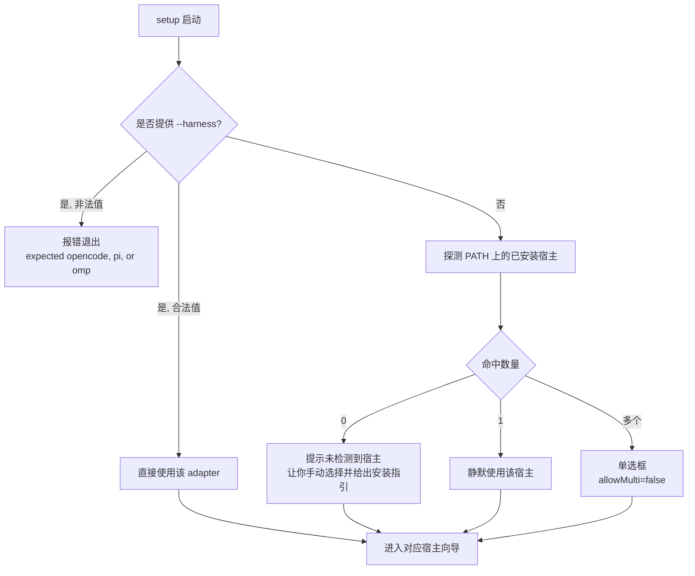
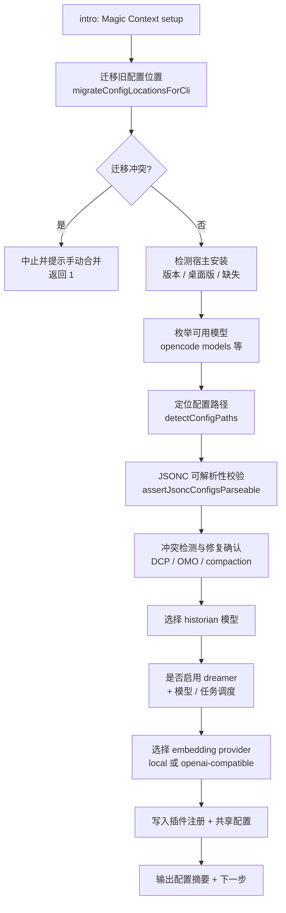

这一页面向第一次接触 Magic Context 的开发者，目标是在十分钟内完成「装好、跑起来、确认它真的在工作」。它是整个「快速上手」部分的第二站：如果你还不清楚 Magic Context 到底为编码代理解决了什么问题，请先阅读 [项目概览：为编码代理打造的自我管理上下文与长期记忆](1-xiang-mu-gai-lan-wei-bian-ma-dai-li-da-zao-de-zi-wo-guan-li-shang-xia-wen-yu-chang-qi-ji-yi)。

本页只覆盖三件事：**如何运行安装向导**、**向导到底改写了哪些文件**、以及**第一个会话里你应该看到什么**。更深的命令语义（`setup` / `doctor` / `migrate` 的完整参数矩阵）属于 [命令向导：setup / doctor / migrate 工作流](5-ming-ling-xiang-dao-setup-doctor-migrate-gong-zuo-liu)，而配置项的完整清单属于 [配置体系与隐藏代理模型选择](3-pei-zhi-ti-xi-yu-yin-cang-dai-li-mo-xing-xuan-ze)。

## 前置条件：Node 与宿主

Magic Context 是一个宿主（harness）插件，它本身不是一个可独立运行的程序。安装向导（`npx @cortexkit/magic-context@latest setup`）是一个 Node CLI，负责把插件注册进你已有的编码代理宿主，并顺手关掉宿主自带的上下文压缩。

| 依赖 | 最低版本 | 说明 |
|---|---|---|
| Node.js + npx | `20.12` | 安装脚本 `install.sh` / `install.ps1` 的硬校验，因为 `@clack/prompts` 需要 Node 20.12 才引入的 `node:util.styleText` |
| Node.js（CLI 包声明） | `>= 24` | `@cortexkit/magic-context` 包 `engines` 字段声明；正式路径以 24 为准 |
| OpenCode | 当前版本 | 桌面版也可识别，但其 Electron 内嵌服务没有可调用的 `opencode` CLI，模型无法自动枚举 |
| Pi | `>= 0.74.0` | 低于此版本向导会告警并要求确认是否继续 |
| Oh My Pi (OMP) | `>= 17.1.7` | 低于此版本向导会告警并要求确认是否继续 |

安装脚本会先探测 `node` 与 `npx`：任一缺失或版本不足时直接报错退出，并打印裸命令 `npx @cortexkit/magic-context@latest setup` 供你手动执行。脚本本身不做安装，它只是把交互式向导拉起来——并且总是以 `@latest` 标签调用，避免 `npx` 命中本地缓存中的旧版本。由于 `curl \| bash` 场景下父 shell 没有 stdin，脚本会把 stdin 重定向到 `/dev/tty`，这样 Clack 的交互式选择仍然可用。

Sources: [scripts/install.sh](scripts/install.sh#L1-L74), [scripts/install.ps1](scripts/install.ps1#L1-L45), [packages/cli/package.json](packages/cli/package.json#L1-L40), [packages/cli/src/commands/setup-opencode.ts](packages/cli/src/commands/setup-opencode.ts#L350-L379), [packages/cli/src/commands/setup-pi.ts](packages/cli/src/commands/setup-pi.ts#L368-L401), [packages/cli/src/commands/setup-omp.ts](packages/cli/src/commands/setup-omp.ts#L66-L82)

## 三种启动方式

三种方式最终都落到同一个 `setup` 子命令，区别只在于「谁来拉起 Node」。

| 方式 | 命令 | 适用场景 |
|---|---|---|
| 一键脚本（macOS / Linux） | `curl -fsSL https://raw.githubusercontent.com/cortexkit/magic-context/master/scripts/install.sh \| bash` | 想要最省事，允许脚本先做 Node 版本体检 |
| 一键脚本（Windows） | `irm https://raw.githubusercontent.com/cortexkit/magic-context/master/scripts/install.ps1 \| iex` | PowerShell 环境 |
| 直接调用（任意系统） | `npx @cortexkit/magic-context@latest setup` | 已自行管理 Node，或需要精确控制调用参数 |

直接调用时你会用到两类常用参数：`--harness opencode\|pi\|omp` 强制指定单个宿主，以及 `--dry-run` 预览向导将要做的全部改动而不写任何文件。`setup` 命令默认**不允许多选宿主**——因为多个宿主向导写入的是同一份共享配置文件，向导会先在单一目标上收集完所有交互选项，再分阶段落盘。

Sources: [README.md](README.md#L80-L97), [packages/cli/src/index.ts](packages/cli/src/index.ts#L54-L94), [packages/cli/src/commands/setup.ts](packages/cli/src/commands/setup.ts#L17-L61)

## 宿主选择：显式覆盖优先于自动探测

如果你什么都不指定，向导会自己判断要装到哪个宿主。决策树很短，但顺序很重要：**`--harness` 是硬覆盖，永远不弹提示**。



探测命中 0 个宿主时向导并不会中止，而是弹出一个带安装提示的选择框（OpenCode / Pi / Oh My Pi），让你明确挑一个继续——这正是「宿主没装但我想先把配置写好」的场景。命中 1 个宿主时向导会静默采用它，不打扰你；命中多个时才需要你出面选择。

Sources: [packages/cli/src/lib/harness-select.ts](packages/cli/src/lib/harness-select.ts#L19-L111), [packages/cli/src/commands/setup.ts](packages/cli/src/commands/setup.ts#L63-L72)

## 向导内部做了什么

尽管三个宿主的落地方式不同，`setup` 遵循同一套「先收集、后写入」的约束：所有交互式选项都在任何写盘发生之前收集完毕，这样中途取消的向导不会留下「只改了一半」的目标文件。整个流程可以抽象成下面这条主线。



几个值得留意的细节：

**迁移先于读取。** 向导的第一步是调用配置位置迁移，把旧版分散在各宿主目录下的 `magic-context.{jsonc,json}` 统一搬到共享位置。如果 OpenCode 与 Pi 的旧配置内容不一致，迁移器不会擅自猜测合并，而是拒绝并要求你手工处理——此时 `setup` 直接以退出码 1 中止，避免在冲突态上继续写盘。

**模型枚举失败不是致命错误。** 向导通过 `opencode models`（或 Pi / OMP 等价命令）拉取你已认证的完整模型列表。桌面版 OpenCode 没有可调用的 CLI，因此枚举结果为空，向导会回落到**自由文本输入** `provider/model` 的形式，绝不因为列表为空就卡住你。

**模型选择器只展示你真正拥有的模型。** 早期的实现维护了一份「推荐模型」清单，结果是既展示了用户没有的模型，又把用户真实拥有的大量模型埋在列表尾部。现在的实现直接对完整模型目录去重、排序，放进一个可滚动、可打字的自动补全选择器里，并在选择前给出一句角色说明。

**historian 与 dreamer 都不是热点路径上的模型。** 向导的说明文案明确建议：historian 逐块总结历史、调用频繁，因此**不需要**前沿模型，mini / flash / haiku 这一档更划算；dreamer 只在周期性维护时运行，同样可以用更便宜甚至本地的模型。

Sources: [packages/cli/src/commands/setup-opencode.ts](packages/cli/src/commands/setup-opencode.ts#L333-L503), [packages/cli/src/commands/setup-pi.ts](packages/cli/src/commands/setup-pi.ts#L346-L472), [packages/cli/src/lib/model-picker.ts](packages/cli/src/lib/model-picker.ts#L24-L84), [packages/cli/src/lib/dreamer-setup.ts](packages/cli/src/lib/dreamer-setup.ts#L101-L149)

## 每个宿主分别写入了什么

向导的产物分两类：**宿主侧的插件注册**，以及**所有宿主共享的 Magic Context 配置**。下表把可验证的落盘目标汇总在一起。

| 宿主 | 宿主侧注册目标 | 共享配置目标 | 额外动作 |
|---|---|---|---|
| OpenCode | `~/.config/opencode/opencode.jsonc`（缺失时为 `.json`）的 `plugin` 数组；`tui.jsonc` 的 `plugin` 数组（TUI 侧边栏） | `~/.config/cortexkit/magic-context.jsonc` | 关闭 `compaction.auto` / `compaction.prune`；可选移除 `opencode-dcp`；可选禁用三个 oh-my-opencode 钩子 |
| Pi | `~/.pi/agent/settings.json` 的 `packages` 数组 | 同上（共享） | 若选中 `github-copilot/*` 推理模型，额外询问 `thinking_level` |
| Oh My Pi (OMP) | 通过 `omp plugin install @cortexkit/pi-magic-context` 注册 | 同上（共享） | 事务性执行 `omp config set compaction.enabled false` 与 `omp config set memory.backend off`，失败则回滚 |

共享配置位置只有两个，项目级覆盖用户级：

| 路径 | 作用域 |
|---|---|
| `<project-root>/.cortexkit/magic-context.jsonc` | 项目级 |
| `~/.config/cortexkit/magic-context.jsonc` | 用户级默认值（Windows 为 `%USERPROFILE%\.config\cortexkit\magic-context.jsonc`，或遵循 `XDG_CONFIG_HOME`） |

向导在写入共享配置时会自动补上 `$schema` 字段，指向 `https://raw.githubusercontent.com/cortexkit/magic-context/master/assets/magic-context.schema.json`，这样编辑器就能提供自动补全与校验。

值得单独说明的是 OMP 的第 85 行式「不写就报错」策略：OMP 的配置分全局与项目/覆盖层。当压缩或内存设置的有效来源是项目级文件时，向导**拒绝修改全局配置**，而是列出这些文件让你直接编辑后重跑——因为静默改全局会在你切回其它项目时产生难以追踪的行为差异。

OpenCode 侧还有一个容易误解的细节：`compaction.auto` / `compaction.prune` 与 Magic Context 自己的 `compaction.enabled` 是**两个不同文件里的两个不同开关**，前者由 OpenCode 拥有，后者由 Magic Context 拥有。向导关闭前者，只是为了不让两个上下文管理器同时压缩同一段历史。

Sources: [packages/cli/src/lib/paths.ts](packages/cli/src/lib/paths.ts#L34-L107), [packages/cli/src/commands/setup-opencode.ts](packages/cli/src/commands/setup-opencode.ts#L536-L609), [packages/cli/src/commands/setup-pi.ts](packages/cli/src/commands/setup-pi.ts#L251-L310), [packages/cli/src/commands/setup-omp.ts](packages/cli/src/commands/setup-omp.ts#L78-L170), [README.md](README.md#L329-L339)

## 最小可用配置

如果你无法运行向导（例如走 OpenCode Desktop，或需要版本受控的部署），可以手动完成同样的两件事：注册插件、写一份最小配置。

### 第一步：注册插件

在 `opencode.jsonc` 中加入插件条目并关闭原生压缩：

```jsonc
{
  "plugin": ["@cortexkit/opencode-magic-context@latest"],
  "compaction": { "auto": false, "prune": false }
}
```

### 第二步：写共享配置

在 `~/.config/cortexkit/magic-context.jsonc` 中写入：

```jsonc
{
  "$schema": "https://raw.githubusercontent.com/cortexkit/magic-context/master/assets/magic-context.schema.json",
  "historian": {
    "opencode": { "model": "provider/model-id" }
  }
}
```

这三个字段就是最小可用集合的全部。它们的取舍如下：

| 字段 | 必需性 | 省略后果 |
|---|---|---|
| `historian.opencode.model` | 运行时**可选**，实践上**强烈建议** | schema 中 `model` 是可选字段，省略时 historian 会回退到实时会话模型；但 README 将其标注为 Required——配置独立模型能让历史摘要的质量与成本脱离主编码模型，且若没有任何可运行模型，旧历史将不被摘要 |
| `dreamer` | 可选 | 省略即保持周期性记忆整固关闭 |
| `embedding` | 可选 | 省略即使用本地 `Xenova/all-MiniLM-L6-v2`；显式关闭会移除语义检索，但关键词检索与上下文管理继续可用 |

注意模型键必须写在**按宿主划分**的块里（`historian.opencode` / `historian.pi` / `historian.omp`），而不是旧版的扁平 `historian.model`。扁平写法会在首次读取配置时被自动迁移为按宿主写法，并在改写前留一份 `.pre-per-harness.bak` 恢复副本。OMP 在没有显式 `omp` 块时会回落到对应的 `pi` 块，因此已有的 Pi 配置无需迁移。

Sources: [README.md](README.md#L103-L166), [packages/docs/src/content/docs/getting-started/installation.mdx](packages/docs/src/content/docs/getting-started/installation.mdx#L90-L116), [packages/plugin/src/config/schema/magic-context.ts](packages/plugin/src/config/schema/magic-context.ts#L203-L256), [packages/plugin/src/shared/model-resolution.ts](packages/plugin/src/shared/model-resolution.ts#L30-L36)

## 首次会话：你会看到什么

向导的最后一条输出会告诉你下一步：重启宿主（OMP 可运行 `/reload-plugins`），然后运行 `/ctx-status`。此时你已经进入「首次会话」，需要理解三个最显眼的现象。

### 状态显示：侧边栏与 `/ctx-status`

OpenCode 在每个消息之后刷新 TUI 侧边栏，展示上下文占用、活跃标签与排队中的丢弃、historian 状态、compartment 覆盖率以及项目记忆数量；`/ctx-status` 提供同样信息的详细视图。Pi 则在底部状态行显示上下文占用与 Magic Context 状态，详细视图同样走 `/ctx-status`。

### §N§ 标签：内部记账标识

当 `ctx_reduce` 工具对代理可见时，可追踪内容会获得一个短标识，例如 `§1§` 或 `§42§`。它有两个用途：作为代理调用 `ctx_reduce` 时的引用点，以及作为 Magic Context 自动清理的记账单位。你**不需要**与它直接交互——它只会出现在 `/ctx-status` 输出和 `ctx_reduce` 提示里。

### 「Comparting」：后台历史压缩

会话运行一段时间后，historian 会把已经沉淀下来的旧消息压缩成 compartment。对你而言，会话照常继续，`/ctx-status` 可能多出一个 compartment；对代理而言，它看到的是 compartment 摘要而非原始消息，需要细节时可以用 `ctx_expand` 按范围把原文取回。**没有任何东西被删除**：每条消息、每次工具调用、每段回复都持久化在 SQLite 里，压缩是可逆的。

三件值得提前建立预期的事：

- **compartment 在后台生成**，数量可能在你两次发言之间上升，而不必然把总量拉向某个目标百分比。
- **第一个 compartment 需要几轮对话**。historian 在上下文压力累积、或已沉淀对话足够多、或提交簇标记了完成工作时才触发；很短的会话可能根本不触发。
- **记忆在下个会话才可见**。本次会话中 historian 写下的项目记忆，会在你下次在同一项目开启会话时通过 `<project-memory>` 注入。

Sources: [packages/docs/src/content/docs/getting-started/first-session.mdx](packages/docs/src/content/docs/getting-started/first-session.mdx#L8-L92), [packages/cli/src/commands/setup-pi.ts](packages/cli/src/commands/setup-pi.ts#L529-L535), [packages/cli/src/commands/setup.ts](packages/cli/src/commands/setup.ts#L74-L103), [README.md](README.md#L296-L306)

## 校验安装：`doctor`

装好之后，验证安装是否健康的方式是运行 `doctor`。它会先做一次 SQLite 预检，然后自动探测已安装的宿主并逐个检查。OpenCode 侧的可验证检查项包括：

- 宿主安装位置与版本（多个安装会打印一张 `marker \| path \| version \| source` 表，标出当前生效的那个）
- OpenCode 会话数据库是否可解析
- compartment 边界 id 是否能在会话库中解析
- CLI 自身版本与 npm 最新版对比
- `opencode.json` 与 `magic-context.jsonc` 是否存在、能否解析、能否通过 schema 加载
- embedding 提供方的配置卫生与连通性

检查结果以 `PASS / WARN / FAIL` 计数汇总输出。加 `--force` 让 doctor 自动清理陈旧插件缓存并修复常见配置问题；加 `--issue` 生成一份脱敏后可直接提交的缺陷报告。当同时装了多个宿主时，doctor 会询问要诊断哪些（`allowMulti` 为真），也可以用 `--harness` 直接锁定。

如果首次会话里 historian 反复失败，你会看到一条用户可见提示。它是分级呈现的：连续失败次数低于阈值 `3` 时，提示语气是「本轮历史压缩未完成，会自动重试」的安抚式措辞；达到或超过阈值时升级为 `## Magic Context — History compression` 标题，明确指向配置问题并让你检查 `magic-context.jsonc`——这通常意味着 `historian.<harness>.model` 指向了一个不存在或不可达的模型。

Sources: [packages/cli/src/commands/doctor.ts](packages/cli/src/commands/doctor.ts#L40-L125), [packages/cli/src/commands/doctor-opencode.ts](packages/cli/src/commands/doctor-opencode.ts#L716-L903), [packages/plugin/src/hooks/magic-context/compartment-runner-validation.ts](packages/plugin/src/hooks/magic-context/compartment-runner-validation.ts#L186-L217), [packages/plugin/src/shared/user-facing-codes.ts](packages/plugin/src/shared/user-facing-codes.ts#L4-L9)

## 接下来读什么

完成本页后，你已经有了一条可用的工作链路。建议的阅读顺序是：

1. **[配置体系与隐藏代理模型选择](3-pei-zhi-ti-xi-yu-yin-cang-dai-li-mo-xing-xuan-ze)** —— 理解 `historian` / `dreamer` / `embedding` 三个块的完整语义，以及模型回退链与 `thinking_level` / `variant` 限定符。
2. **[多宿主统一支持：OpenCode · Pi · OMP](4-duo-su-zhu-tong-zhi-chi-opencode-pi-omp)** —— 如果你打算在多个宿主间共享同一份记忆，这里说明共享边界与数据池化行为。
3. **[命令向导：setup / doctor / migrate 工作流](5-ming-ling-xiang-dao-setup-doctor-migrate-gong-zuo-liu)** —— `--dry-run`、`--clear`、`--issue` 与跨宿主会话迁移的完整命令矩阵。
4. **[兼容性冲突检测与故障排查](6-jian-rong-xing-chong-tu-jian-ce-yu-gu-zhang-pai-cha)** —— 当 DCP、OMO 或宿主原生压缩产生冲突时的判定与修复路径。