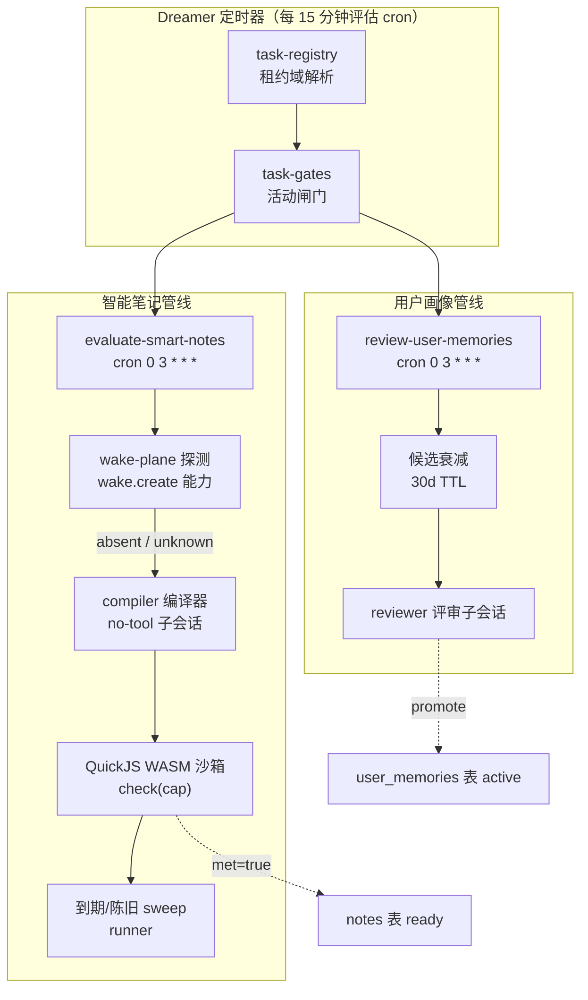

智能笔记（Smart Notes）与用户画像（User Profile）是 Magic Context 两条相互独立但共享同一种"后台巩固"范式的管线：它们都把**延迟意图**转化为**可验证的外部事实**。智能笔记负责"当外部世界发生某事时提醒我"，用户画像负责"把关于你工作方式的重复观察固化成随每个会话移动的画像"。两者的共同点是：由 Dreamer 后台任务驱动、在独立子会话中调用模型、经由受租约保护的写事务落库，并最终分别渲染进 m[0]/m[1] 的信任边界。

本页聚焦这两条管线的**编译器 → 校验器 → 渲染器**三段式架构。调度与租赁的通用机制请参见 [Dreamer 任务调度与执行模型](19-dreamer-ren-wo-diao-du-yu-zhi-xing-mo-xing)，m[0]/m[1] 的物化语义请参见 [m[0]/m[1] 缓存布局与物化触发条件](10-m-0-m-1-huan-cun-bu-ju-yu-wu-hua-hong-fa-tiao-jian)。

## 两条管线在 Dreamer 中的定位

两条管线各对应一个一等公民的 Dreamer v2 任务：`evaluate-smart-notes` 与 `review-user-memories`。它们脱离 v1 时代的"后置阶段"身份，被提升为 `CANONICAL_DREAM_TASKS` 中有独立 cron 的调度任务，默认均为每日 `0 3 * * *`。任务注册表为它们各自分配了独立的租约域，使两者能与内存域（memory）任务并发执行，但 `review-user-memories` 使用**全局**租约键（`user-memories`，不带项目前缀），因为用户画像是跨项目的全局池——两个不同项目的 Dreamer 不能并发评审同一池候选。

Sources: [task-registry.ts](packages/plugin/src/features/magic-context/dreamer/task-registry.ts#L13-L28), [task-registry.ts](packages/plugin/src/features/magic-context/dreamer/task-registry.ts#L123-L170), [magic-context.ts](packages/plugin/src/config/schema/magic-context.ts#L521-L545)

## 智能笔记：从延迟意图到编译式检查

智能笔记的生命周期始于 `ctx_note` 工具调用。当调用同时携带 `content` 与 `surface_condition` 时，它不再是一条普通会话笔记，而是一条**智能笔记**——条件必须能被外部信号验证（GitHub 状态、磁盘文件、git 历史、网页），绝不能依赖当前对话或未来不可观测的动作。工具描述中给出了正反例：`"When PR #42 ... is merged"` 合法，而 `"when we revisit Y"` 因缺乏外部信号而被拒绝并应改写为普通笔记。

Sources: [constants.ts](packages/plugin/src/tools/ctx-note/constants.ts#L1-L17), [tools.ts](packages/plugin/src/tools/ctx-note/tools.ts#L330-L334)

### 写入时的条件预编译

写入路径会先经由 `compileSurfaceCondition` 尝试把条件的**固定语法短语**编译为 retina 本地文件系统 provider 谓词。它只接受一组受限文法（`file ... contains ...`、`path exists`、`mtime after`、`git commit after`、`git tag matching`），超出文法的散文一律降级为 `plain`，交回 Dreamer 编译器处理；路径围栏违规则标记为 `refused`。编译结果通过 `conditionCompileStorageFields` 落库为 `compiled_provider` / `compiled_config` / `compile_status` 三列。这一层的价值在于：确定性条件无需模型调用即可判定。

Sources: [condition-compiler.ts](packages/plugin/src/features/magic-context/smart-notes/condition-compiler.ts#L43-L102), [condition-compiler.ts](packages/plugin/src/features/magic-context/smart-notes/condition-compiler.ts#L104-L134)

### 编译阶段：生成 check(cap) 沙箱函数

对于非确定性条件，`evaluateSmartNotes` 任务调用 `compileSmartNoteCheck`。它在一个无工具（no-tool）子会话中投喂 `SMART_NOTE_COMPILER_SYSTEM_PROMPT`，该提示把 `surface_condition` 明确标注为**不可信数据**，并强制输出严格 JSON：一个名为 `check(cap)` 的纯 JavaScript 函数、一个声明所有能力/主机/URL/文件路径的 `manifest`、以及一个推荐的五字段 cron。编译器返回后，管线立即在沙箱中做一次 `dryRun`（2 秒超时）；dry-run 失败则整次编译失败。

Sources: [compiler.ts](packages/plugin/src/features/magic-context/smart-notes/compiler.ts#L68-L192), [compiler-prompt.ts](packages/plugin/src/features/magic-context/smart-notes/compiler-prompt.ts#L1-L29)

沙箱实现基于 QuickJS 的 asyncify WASM 变体，并有两个关键工程决策：其一，WASM 模块通过 `singlefile` 变体内联进 bundle，并以**惰性动态 import** 加载，避免在插件冷启动和每次子代理派生时解析约 2.6MB 的 base64 blob；其二，由于 asyncify 变体每个模块实例只有**一条挂起栈**，所有沙箱运行通过 `withSandboxLock` 串行化，把"一次只有一个挂起的 eval"变成不变量，从而避免两个并发检查共享/篡改同一栈导致的 `QuickJSUseAfterFree`。

Sources: [sandbox-runner.ts](packages/plugin/src/features/magic-context/smart-notes/sandbox-runner.ts#L1-L54), [sandbox-runner.ts](packages/plugin/src/features/magic-context/smart-notes/sandbox-runner.ts#L92-L156)

### 能力沙箱与 SSRF 防线

`check(cap)` 可调用的宿主能力被收窄为五项：`readFile`、`gitHeadSha`、`gitTag`、`gitLog`、`httpGet`。`readFile` 实施纵深防御——路径归一化拒绝绝对路径与 `..` 逃逸、对敏感文件（`.env*`、`.npmrc`、`id_*`、`*.pem`、service-account JSON 等）拒绝、对父目录做 `realpath` 后**再次**施加策略以对抗符号链接、并以 `O_NOFOLLOW` 打开且限制 64KB 上限。

Sources: [capabilities.ts](packages/plugin/src/features/magic-context/smart-notes/capabilities.ts#L36-L55), [capabilities.ts](packages/plugin/src/features/magic-context/smart-notes/capabilities.ts#L59-L100), [capabilities.ts](packages/plugin/src/features/magic-context/smart-notes/capabilities.ts#L123-L182)

`httpGet` 的 SSRF 防护要求 HTTPS、禁止 URL 内凭据、剥离 fragment、对解析出的 IPv4 地址做全球可达性分类（内部/元数据地址一律拒绝），并把 `lookup` 钉死在已验证的 IP 上以**防重绑定**；为防止单一主机名发散无界出口，候选地址被截断为最多 4 个。这些守卫不依赖 Bun 专有 API，因而能通过 Node 目标打包做跨运行时等价性测试。

Sources: [ssrf-guard.ts](packages/plugin/src/features/magic-context/smart-notes/ssrf-guard.ts#L70-L142), [PARITY.md](packages/plugin/src/features/magic-context/smart-notes/PARITY.md#L1-L10)

### 检查状态机与调度退化

已编译的检查通过状态机的四个值演进：`uncompiled → compiled → failing → fallback`，状态持久化在 `notes` 表的 `check_*` 列族中。`runner.ts` 的 `runDueCompiledSmartNoteChecks` 按 `check_next_due_at` 排序选出到期检查，在 15 秒 sweep 预算内逐条运行；`met=true` 时把笔记标记为 `ready` 并生成宿主机生成的 `readyReason`，`met=false` 时按 cron 重算下次到期并记录 `checkFalseSinceAt`。

Sources: [types.ts](packages/plugin/src/features/magic-context/smart-notes/types.ts#L3-L39), [runner.ts](packages/plugin/src/features/magic-context/smart-notes/runner.ts#L47-L181)

失败路径分化为逻辑失败与网络失败两条独立计数器：两者都采用指数退避 `min(24h, 5·2^(n-1))` 分钟，达到 `MAX_FAILURES_BEFORE_REAUTHOR = 3` 后状态降级为 `failing`（逻辑）或记入 `check_quarantined_until` 隔离（网络）。编译连续 `MAX_COMPILATION_FAILURES = 3` 次失败后，笔记降级为 `fallback`，改由一次只读的确认评估器（`{"met": boolean}` 形状）兜底判定。`SMART_NOTE_CHECK_MAX_STALENESS_MS`（7 天）与 `SMART_NOTE_CHECK_LIVENESS_RECHECK_MS`（24 小时）共同驱动 `getStaleCompiledSmartNotes`，对长期为假但未重检的检查触发存活复核。

Sources: [storage.ts](packages/plugin/src/features/magic-context/smart-notes/storage.ts#L256-L342), [evaluate-smart-notes.ts](packages/plugin/src/features/magic-context/dreamer/evaluate-smart-notes.ts#L212-L268)

调度抖动值得单独说明：`nextSmartNoteCheckDueAt` 先按 cron 计算下次到期，再把间隔夹逼到 `[5 分钟, 24 小时]` 区间，最后叠加一个由 `noteId:hash` FNV 哈希导出的确定性抖动（±10%，上限 ±60 秒）。抖动是确定性的而非随机，因此同一笔记的调度可重放——这与整个系统的确定性重放原则一致。

Sources: [schedule.ts](packages/plugin/src/features/magic-context/smart-notes/schedule.ts#L8-L42), [types.ts](packages/plugin/src/features/magic-context/smart-notes/types.ts#L3-L9)

### 并发安全：租约守卫 + 比较并交换

每次状态提交都走 `commitSmartNoteState`，它在 `BEGIN IMMEDIATE` 写事务内同时执行两件事：检查 Dreamer 租约是否仍被持有，以及对笔记做**比较并交换**（compare-and-set）。CAS 断言键视阶段而定——编译路径断言 `content + surface_condition + updated_at`（源修订），检查路径断言 `compiled_check + check_hash + check_compiled_at`。若用户在使用者侧修改了笔记源，或另一进程抢先改写了编译结果，提交会被静默丢弃为"陈旧结果"。租约丢失则抛出以触发热重试，而非记录虚假完成。

Sources: [storage.ts](packages/plugin/src/features/magic-context/smart-notes/storage.ts#L40-L123)

### Wake Plane：能力探测式让位

当整个舰队部署了独立的计划唤醒平面（subc 提供 `wake.create` 控制能力）时，智能笔记的独立评估应当让位。`wakePlaneStatus` 通过读取 `subc-connection.json` 连接守护进程并查询目录，只有**肯定地**发现该能力才返回 `present` 并停用独立检查；守护进程不可达（`unknown`）或无该能力（`absent`）时一律**故障开放**，即保持智能笔记启用。这一决策缓存 5 分钟以避免每轮探测。

Sources: [wake-plane.ts](packages/plugin/src/features/magic-context/smart-notes/wake-plane.ts#L1-L86), [evaluate-smart-notes.ts](packages/plugin/src/features/magic-context/dreamer/evaluate-smart-notes.ts#L101-L105)

## 用户画像：从分散观察到全局画像

用户画像管线的输入是**候选观察**（candidate observations）——对用户行为特征的只言片语。它们有两个来源：其一是 historian 分区运行时，当 `experimentalUserMemories` 开启时把 `validatedPass.userObservations` 落库；其二是 retrospective 任务产出的 learnings 中 `route !== "memory"` 的条目。两者的隐私闸门是同一个：`userMemoryCollectionEnabled` 仅检查 `review-user-memories` 任务是否有非空 schedule，这取代了 v1 的 `user_memories.enabled` 标志，使"是否收集"与"是否评审"共享同一开关。

Sources: [compartment-runner-incremental.ts](packages/plugin/src/hooks/magic-context/compartment-runner-incremental.ts#L994-L1024), [retrospective-learnings.ts](packages/plugin/src/features/magic-context/dreamer/retrospective-learnings.ts#L197-L207), [task-config.ts](packages/plugin/src/features/magic-context/dreamer/task-config.ts#L43-L57)

候选与稳定记忆分属两张表：`user_memory_candidates` 保存原始观察（含 `session_id` 与来源分区范围，供溯源），`user_memories` 保存已晋升的稳定画像条目，支持 `active` / `dismissed` 两种状态并记录 `source_candidate_ids` 与 `source_candidate_provenance`。

Sources: [migrations.ts](packages/plugin/src/features/magic-context/migrations.ts#L493-L519), [storage-user-memory.ts](packages/plugin/src/features/magic-context/user-memory/storage-user-memory.ts#L12-L37)

### 评审阶段：衰减 → 门槛 → 证据合并

`reviewUserMemories` 的执行顺序经过精心设计。**先衰减**：先清除超过 30 天 TTL 且从未积累足够佐证的候选，防止低于门槛的噪声永久累积（因为评审只在候选数达到门槛时才消费候选）。**再门槛检查**：候选数小于 `promotion_threshold`（默认 3）时直接跳过。**最后评审**：把候选池与现有稳定记忆一并交给 `DREAMER_REVIEWER_AGENT` 子会话。

Sources: [review-user-memories.ts](packages/plugin/src/features/magic-context/user-memory/review-user-memories.ts#L59-L90), [storage-user-memory.ts](packages/plugin/src/features/magic-context/user-memory/storage-user-memory.ts#L99-L119)

评审提示的核心判据是**跨来源复现**：一个候选必须在至少 `promotion_threshold` 个语义相近的变体中独立出现（来自不同会话或不同 historian 运行）才构成真实用户特征；提示明确禁止晋升项目特定偏好、框架选择、一次性情绪与任务局部挫败。评审器返回结构化 JSON，含 `promote`（新稳定记忆）、`update_existing`（依据新证据重写）、`dismiss_existing`（不再成立）、`consume_candidate_ids`（所有已评审候选，无论晋升/合并/拒绝都将被删除）。

Sources: [review-user-memories.ts](packages/plugin/src/features/magic-context/user-memory/review-user-memories.ts#L92-L134)

### 受租约保护的落库与版本递增

所有写操作（晋升、更新、丢弃、消费候选）被包在 `runLeaseGuardedWrite` 中，该函数在 `BEGIN IMMEDIATE` 序列化写者之后**再次**校验租约——若租约已丢失则抛出让执行器热重试，而非记录完成并把 `next_due_at` 推进到未处理工作之后。只要发生了任一类变更，就调用 `bumpProjectUserProfileVersion` 递增全局画像版本（写入 `project_state` 表的 `__global__` 行），这是驱动 m[1] 增量渲染的信号。

Sources: [review-user-memories.ts](packages/plugin/src/features/magic-context/user-memory/review-user-memories.ts#L287-L331), [storage-project-state.ts](packages/plugin/src/features/magic-context/storage-project-state.ts#L85-L103)

## 渲染：画像如何进入提示缓存

用户画像的最终形态是两个 XML 块，由全局版本号驱动 m[0]/m[1] 的分工。`renderUserProfileBlock` 把每条记忆渲染为 `- {content}` 行，包裹在 `<user-profile>` 或 `<new-user-profile>` 中。基线画像进入 m[0] 的 `<user-profile>`，按 `DEFAULT_USER_PROFILE_BUDGET_TOKENS = 4_000` 预算、以"整条计入或整条跳过"的方式裁剪（`trimUserMemoriesToBudget`）。指针 m[1] 侧则比较当前全局版本与 m[0] 快照记录的 `projectUserProfileVersion`，仅当版本变化时才渲染 `<new-user-profile>` 增量，且使用 1/4 预算（1000 tokens）。

Sources: [inject-compartments.ts](packages/plugin/src/hooks/magic-context/inject-compartments.ts#L2014-L2022), [inject-compartments.ts](packages/plugin/src/hooks/magic-context/inject-compartments.ts#L1839-L1852), [inject-compartments.ts](packages/plugin/src/hooks/magic-context/inject-compartments.ts#L2054-L2101), [inject-compartments.ts](packages/plugin/src/hooks/magic-context/inject-compartments.ts#L2695-L2714)

这一设计的关键意图是**缓存稳定性**：画像晋升绝不触发 m[0] 物化。`MEMORY_DERIVED_BLOCK_PATTERN` 正则显式包含 `user-profile` 与 `new-user-profile`，用于记忆关闭时检测并清除残留内存派生的提示面；但常规的画像增长走的是 m[1] 增量路径，`mustMaterialize` 只对真正的 m[0] 内容标记变化返回 HARD。换言之，一张画像的新增画像条目只会在 m[1] 断点处破坏缓存，而非整段前缀。

Sources: [inject-compartments.ts](packages/plugin/src/hooks/magic-context/inject-compartments.ts#L1531-L1554), [inject-compartments.ts](packages/plugin/src/hooks/magic-context/inject-compartments.ts#L1164-L1166)

为确定性渲染，稳定记忆的读取强制二次排序 `ORDER BY promoted_at ASC, id ASC`：`promoted_at` 可能在同一毫秒内并列，缺少稳定次序会导致 `<user-profile>` 渲染顺序在不同 pass 间漂移，进而改变 m[0]/m[1] 字节。

Sources: [storage-user-memory.ts](packages/plugin/src/features/magic-context/user-memory/storage-user-memory.ts#L192-L211)

## 两条管线的对照

| 维度 | 智能笔记（Smart Notes） | 用户画像（User Profile） |
|------|------------------------|--------------------------|
| 触发入口 | `ctx_note` 携带 `surface_condition` | historian / retrospective 产出的候选观察 |
| Dreamer 任务 | `evaluate-smart-notes` | `review-user-memories` |
| 默认 cron | `0 3 * * *` | `0 3 * * *` |
| 租约域 | 每项目 `evaluate-smart-notes:<project>` | **全局** `user-memories`（跨项目） |
| 隔离方式 | QuickJS WASM 沙箱 + 能力白名单 + SSRF 防护 | 无工具（no-tool）子会话 + JSON 校验 |
| 隐私闸门 | 无（笔记本身不含用户画像） | `review-user-memories` schedule 非空 |
| 关键门槛 | 编译 dry-run 必须通过 | `promotion_threshold`（默认 3）跨来源复现 |
| 失败退化 | `failing` → `fallback` 只读确认 | 无效输出 → 抛错热重试，不推进 `next_due_at` |
| 渲染目标 | `notes` 表 `ready` 状态，非提示注入 | m[0] `<user-profile>` / m[1] `<new-user-profile>` |
| 状态存储 | `notes.check_*` 列族 | `user_memories` + `project_state.profile_version` |

Sources: [task-registry.ts](packages/plugin/src/features/magic-context/dreamer/task-registry.ts#L142-L170), [task-gates.ts](packages/plugin/src/features/magic-context/dreamer/task-gates.ts#L307-L314), [task-gates.ts](packages/plugin/src/features/magic-context/dreamer/task-gates.ts#L398-L407), [task-executor.ts](packages/plugin/src/features/magic-context/dreamer/task-executor.ts#L564-L584)

两者在任务闸门（activity gate）上也体现出各自的准入逻辑：`evaluate-smart-notes` 只要存在待编译笔记、陈旧编译检查或 `fallback` 笔记即被激活；`review-user-memories` 则要求全局候选池达到晋升门槛才被激活。任务的开关控制只有 schedule（`""` 表示停用），运行时闸门不暴露为配置字段。

Sources: [task-gates.ts](packages/plugin/src/features/magic-context/dreamer/task-gates.ts#L231-L314), [magic-context.ts](packages/plugin/src/config/schema/magic-context.ts#L547-L590)

## 版本迁移与配置形状

两条管线在 Dreamer v1→v2 配置迁移中都有明确规定：`user_memories.enabled === false` 映射为 `review-user-memories` schedule 置空，`true` 则保留基础 cron 并携带 `promotion_threshold`；`evaluate-smart-notes` 因"始终针对待处理笔记运行"而被赋予基础 cron。仅 `review-user-memories` 与 `promote-primers` 在 v2 的 DreamTaskConfig 上额外携带 `promotion_threshold` 字段，其余任务使用基础配置。迁移是内存中的、在每次配置加载时运行且故障开放，Doctor 提供等价的磁盘操作。

Sources: [migrate-dreamer-v2.ts](packages/plugin/src/config/migrate-dreamer-v2.ts#L1-L35), [magic-context.ts](packages/plugin/src/config/schema/magic-context.ts#L506-L545)

## 小结与延伸

智能笔记与用户画像共享同一套后台巩固骨架——cron 调度、独立租约域、独立子会话、租约守卫写事务——但在**验证范式**上分道扬镳：智能笔记用 QuickJS 沙箱把外部世界的事实编译成可确定性执行的 `check(cap)` 函数，用户画像用跨来源复现门槛把分散的观察收敛成稳定特质。两者的产物在提示缓存中占据不同的稳定性层级：智能笔记停留在 `notes` 表等待被 agent 主动读取，用户画像则作为 `<user-profile>` 基线钉在 m[0]、以版本号驱动的增量漂浮在 m[1]。

下一步建议阅读 [Dreamer 任务调度与执行模型](19-dreamer-ren-wo-diao-du-yu-zhi-xing-mo-xing) 理解 cron 评估与租约序列化的完整机制，或阅读 [统一搜索与嵌入管线](17-tong-sou-suo-yu-qian-ru-guan-xian) 了解智能笔记如何被 `ctx_search` 检索到。