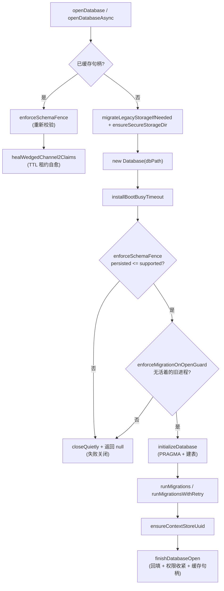
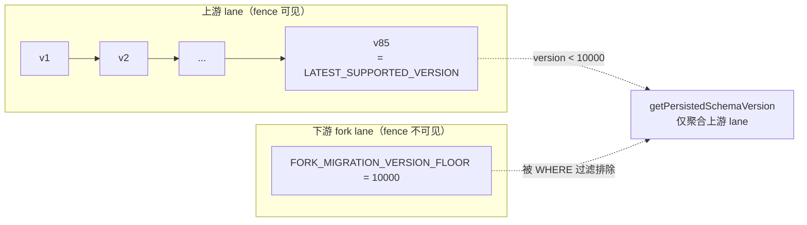

Magic Context 的全部持久化能力建立在 SQLite 之上：上下文库 `context.db` 承载标签、分区、记忆、嵌入、笔记与 Dreamer 状态；同时插件以只读方式旁挂宿主的会话库。本页面向已经熟悉 SQLite 与 TypeScript/Rust 两端实现的开发者，从**存储拓扑 → 后端抽象 → 连接契约 → 模式与迁移阶梯 → 时间戳约定**逐层拆解这套持久化层的契约与不变量，重点说明那些"改错就静默损坏数据"的设计决策。跨宿主共享语义与用户画像管线分别在其他页面展开，本页只聚焦于磁盘格式、迁移与时间语义本身。

## 存储拓扑与路径解析

Magic Context 自有的存储目录**与宿主无关**：无论插件是被 OpenCode 还是 Pi 加载，`context.db` 都落在同一个共享位置，从而让项目记忆、嵌入缓存与 Dreamer 运行记录跨宿主共享。目录解析优先级依次为：测试隔离（`MAGIC_CONTEXT_TEST_DATA_DIR` 或 `NODE_ENV=test` 的兜底）、显式环境覆盖 `MAGIC_CONTEXT_STORAGE_DIR`（必须是绝对路径）、`XDG_DATA_HOME`，最后落到平台默认的 `~/.local/share/cortexkit/magic-context`。数据库文件固定命名为该目录下的 `context.db`。

Sources: [data-path.ts](packages/plugin/src/shared/data-path.ts#L213-L253), [storage-db.ts](packages/plugin/src/features/magic-context/storage-db.ts#L213-L223)

除了自有库，插件还会以**只读连接**打开宿主 OpenCode 的会话数据库（`opencode.db` / `opencode-<channel>.db`），读取其中的 `message` / `part` 表（内容以 JSON 存在 `data` 列中）。该路径遵循 OpenCode 自身的 channel 解析规则，并支持 `OPENCODE_DB` 显式覆盖、目录内候选文件按 mtime 的自动发现，以及 v1/v2 两代宿主的文件名差异。只读句柄按路径缓存并在路径变化时释放，绝不对宿主库发起写操作。

Sources: [opencode-db-path.ts](packages/plugin/src/shared/opencode-db-path.ts#L46-L177), [read-session-db.ts](packages/plugin/src/hooks/magic-context/read-session-db.ts#L50-L98)

首次启动时还会做一次性**遗留存储迁移**：若目标 `context.db` 不存在而旧的 `storage/plugin/magic-context/context.db` 存在，则先对旧库执行 `PRAGMA wal_checkpoint(TRUNCATE)` 把 WAL 折叠回主文件，再复制主文件与 `-wal`/`-shm` 边车以及嵌入模型缓存目录；旧文件保留作为手工回滚路径。这里的顺序是关键——三个文件分别复制不是原子操作，先 checkpoint 才能得到一个崩溃一致的副本。

Sources: [storage-db.ts](packages/plugin/src/features/magic-context/storage-db.ts#L229-L303), [data-path.ts](packages/plugin/src/shared/data-path.ts#L284-L293)

## 跨运行时后端选择：单一 SQLite 咽喉点

同一份发布产物必须能在两个运行时下运行：Bun 提供内置的 `bun:sqlite`，而 Node/Electron（Pi 插件、OpenCode Desktop）只有 `node:sqlite`。由于对任一方做静态 import 都会在另一运行时于解析阶段崩溃，`shared/sqlite.ts` 成为整个仓库访问 SQLite 的**唯一咽喉点**：它先用 `process.versions.bun` / `globalThis.Bun` 判定运行时，再通过变量间接 + `/* @vite-ignore */` 的动态 import 加载对应模块。这里刻意不用 `new Function("return import(...)")` 的写法，因为 Pi 的 vm 加载器下动态构造的函数没有 module record，会导致 "A dynamic import callback was not specified"。

Sources: [sqlite.ts](packages/plugin/src/shared/sqlite.ts#L1-L40), [sqlite.ts](packages/plugin/src/shared/sqlite.ts#L64-L107)

选择 `node:sqlite` 而非 `better-sqlite3` 是供应链决策：`better-sqlite3` 是原生模块，需要按 ABI 预编译，而 Electron 的 ABI 永远不匹配 npm 上的 Node 预编译产物，只能运行时下载匹配的 `.node` 二进制；`node:sqlite` 内置于运行时，无需下载或重建。代价是两后端存在三处 API 差异，全部由 `buildNodeSqliteDatabaseClass` 在一个包装层内抹平，使所有调用点写法一致：

| 差异点 | bun:sqlite（基线语义） | node:sqlite 原生行为 | 桥接方式 |
|---|---|---|---|
| 事务辅助 | `db.transaction(fn)` 原生支持 | 无此方法 | 用 `db.isTransaction` 选择 `BEGIN`/`SAVEPOINT mc_tx_sp`，失败时 `ROLLBACK TO` + `RELEASE` |
| 只读选项 | `{ readonly }` | `{ readOnly }`（驼峰） | 构造器内把 `readonly` 翻译为 `readOnly` 后删除原键 |
| 数组绑定 | `.run([a,b])` 按位置绑定 | 单个数组被当作命名参数，抛 `Unknown named parameter '0'` | `prepare()` 覆写：仅当实参恰为「单个数组」时展开为位置参数 |

Sources: [sqlite.ts](packages/plugin/src/shared/sqlite.ts#L259-L358), [sqlite-helpers.ts](packages/plugin/src/shared/sqlite-helpers.ts#L8-L27)

数组绑定的差异曾导致真实缺陷（issue #151 的 `/ctx-dream`）：`.run([x, y])` 在 OpenCode/Bun 下静默可用，却在 Pi 与 Desktop 上报错。因此归一化放在 `prepare()` 层而非各调用点——只要语句来自这个类，两个后端的绑定语义就不可能分叉。所有连接还经过一个 `Proxy` 包装，为每个连接分配递增序号、注册 `close` 钩子以便回收内存统计。

Sources: [sqlite.ts](packages/plugin/src/shared/sqlite.ts#L177-L257), [sqlite.ts](packages/plugin/src/shared/sqlite.ts#L285-L308)

## 连接初始化与 PRAGMA 契约

`initializeDatabase()` 是每一条打开路径都会经过的同步初始化入口，它固定了连接的 PRAGMA 契约。`foreign_keys=ON` **必须**在任何读写之前执行——它默认为 OFF，会让模式中所有 `ON DELETE CASCADE` / `SET NULL` 静默失效；随后切到 WAL 日志模式。`busy_timeout` 在首次读取前就安装，任何运行时后端都拿到同一个 5 秒有限等待窗口，以保持在服务端 15 秒启动预算之内。

Sources: [storage-db.ts](packages/plugin/src/features/magic-context/storage-db.ts#L905-L918), [storage-db.ts](packages/plugin/src/features/magic-context/storage-db.ts#L107-L114)

可调的每连接 PRAGMA 由 `setSqlitePragmaConfig` 在插件初始化时一次性设定（默认 64 MiB 页缓存、mmap 关闭，与配置模式一致），`applySqliteTuningPragmas` 幂等地应用它们，因此像 Pi 这种"先开库后载配置"的宿主可以在配置可用后补调一次而无需重开连接。`analysis_limit=400` 为后续 `PRAGMA optimize` 触发的 ANALYZE 设上限，使超大表也不会引发数秒级统计刷新。

Sources: [storage-db.ts](packages/plugin/src/features/magic-context/storage-db.ts#L801-L842)

打开的完整时序如下——注意 fence 与迁移守卫都在迁移**之前**执行，确保落后或超前的二进制都不会改写共享库：

Sources: [storage-db.ts](packages/plugin/src/features/magic-context/storage-db.ts#L2264-L2321), [storage-db.ts](packages/plugin/src/features/magic-context/storage-db.ts#L2328-L2416)

`finishDatabaseOpen` 在迁移完成后才执行启动回填（tool-owner 回填、消息 FTS rowid-map 回填）、把 `tool_definition_measurements` 表接入内存映射，并对 `context.db` 及其 WAL/SHM 边车收紧到 `0o600`（仅在插件自管权限时）。这一步放到迁移之后是有意为之：v9 迁移会创建测量表，提前加载会命中缺表失败路径。

Sources: [storage-db.ts](packages/plugin/src/features/magic-context/storage-db.ts#L844-L903), [storage-db.ts](packages/plugin/src/features/magic-context/storage-db.ts#L156-L174)

## 模式定义：表、FTS5 虚拟表与触发器

`initializeDatabase` 内嵌的 DDL 使用 `CREATE TABLE IF NOT EXISTS` 建立全部基础表，包括 `tags`、`pending_ops`、`source_contents`、`compartments`、`session_meta`、`notes`、`memories`、`memory_embeddings`、`workspaces`、`dream_*`、`message_history_*` 等。每个表都以 `session_id` / `project_path` / 外键组合建立索引，`tags` 用 `UNIQUE(session_id, tag_number)` 保证会话内标签号唯一。

Sources: [storage-db.ts](packages/plugin/src/features/magic-context/storage-db.ts#L919-L934), [storage-db.ts](packages/plugin/src/features/magic-context/storage-db.ts#L954-L1100)

全文检索使用 FTS5 虚拟表。`memories_fts` 采用 **external content 模式**（`content='memories'`, `content_rowid='id'`），由 `memories_ai/ad/au` 三个触发器在插入、删除、更新时同步索引，更新触发器先写 `'delete'` 行再写新行以维持 FTS5 的删除语义；`message_history_fts` 则是独立内容表，用 `UNINDEXED` 声明会话与序号等仅存储不索引的列。三个 FTS5 表统一使用 `tokenize='porter unicode61'`，兼顾词干化与 Unicode 分词。

Sources: [storage-db.ts](packages/plugin/src/features/magic-context/storage-db.ts#L1423-L1438), [storage-db.ts](packages/plugin/src/features/magic-context/storage-db.ts#L1492-L1503)

`session_meta` 是最宽的表，承载会话级遥测与状态机字段：`cache_ttl`、nudge 相关列、`compaction_marker_state`、`cached_m0_*` / `cached_m1_*` 缓存快照、受保护尾部策略列等。其中若干列**有意保持可空且无默认值**——`pending_compaction_marker_state`、`pending_pi_compaction_marker_state` 的"不存在"就用 SQL NULL 表达，因此被排除在 NULL 回填清单之外，读取方需防御性过滤 `IS NOT NULL AND != ''`。模式中还保留了 `deferred_execute_state` 等已退役列，注释明确说明这是为了让既有数据库保持相同 schema。

Sources: [storage-db.ts](packages/plugin/src/features/magic-context/storage-db.ts#L1505-L1600)

## 迁移框架：版本阶梯与 fork lane

迁移框架把每个迁移建模为一个在事务中执行、接收 `Database` 的 `up` 函数，按版本号顺序在启动时应用，已应用的跳过，因此支持跨多版本跳跃升级（如 0.4 → 0.7 会依次跑完中间全部迁移）。新增迁移的约定是：向 `MIGRATIONS` 数组**追加**一项，版本号即数组下标 + 1，运行在事务中，抛错即回滚该项。

Sources: [migrations.ts](packages/plugin/src/features/magic-context/migrations.ts#L11-L29), [migrations.ts](packages/plugin/src/features/magic-context/migrations.ts#L377-L380)

"版本号 = 下标 + 1"不是文档约定而是被结构测试强制的：回放测试逐条遍历 `MIGRATIONS`，断言 `migration.version === index + 1`。与此同时，`LATEST_SUPPORTED_VERSION`（storage-db.ts 中的 fence 上限，当前为 85）**必须**等于 `LATEST_MIGRATION_VERSION`（`MIGRATIONS` 的最大版本）——若 fence 落后于迁移链，新迁移应用后数据库会在下次打开时被自身拒绝，这是 v2 开发中真实踩过的坑。CLI 侧还通过扫描插件 dist 中的 `LATEST_SUPPORTED_VERSION = <n>` 文本来交叉校验被 pin 的插件版本与库版本是否匹配。

Sources: [migrations-armed-replay.test.ts](packages/plugin/src/features/magic-context/migrations-armed-replay.test.ts#L504-L513), [migrations.ts](packages/plugin/src/features/magic-context/migrations.ts#L3112-L3120), [storage-db.ts](packages/plugin/src/features/magic-context/storage-db.ts#L107), [opencode-plugin-schema-fence.ts](packages/cli/src/lib/opencode-plugin-schema-fence.ts#L13-L16)

`context.db` 的迁移簿记被划分为**两个保留区段**：上游 Magic Context 使用 `< 10000` 的版本号，下游 fork 与共享同一库的兄弟插件使用 `>= 10000`。`FORK_MIGRATION_VERSION_FLOOR = 10_000` 只隔离簿记，不能使不兼容的 DDL 变安全——fork 的表结构仍须与上游兼容，多个 fork 需自行协调子区段。手工插入的 `>= 10000` 行对上游 fence 与探测"不可见"：`getPersistedSchemaVersion` 与 `getCurrentVersion` 都以 `WHERE version < ?` 过滤，只报告上游 lane。

Sources: [migrations.ts](packages/plugin/src/features/magic-context/migrations.ts#L8-L9), [docs/migration-version-lanes.md](docs/migration-version-lanes.md#L1-L13), [storage-db.ts](packages/plugin/src/features/magic-context/storage-db.ts#L306-L319)

Sources: [migrations.ts](packages/plugin/src/features/magic-context/migrations.ts#L8-L9), [storage-db.ts](packages/plugin/src/features/magic-context/storage-db.ts#L313-L318)

迁移簿记由两张表承载：`schema_migrations`（`version INTEGER PRIMARY KEY, description TEXT NOT NULL, applied_at INTEGER NOT NULL`）记录已应用的上游版本；`schema_migrations_meta` 是 v22 引入的 `key/value` 辅助表，用于记录无法从 schema 推导的一次性回填状态（如 `v22_legacy_compartment_boundary`、`v22_legacy_memory_backfill`）。

Sources: [migrations.ts](packages/plugin/src/features/magic-context/migrations.ts#L3123-L3144), [migrations.ts](packages/plugin/src/features/magic-context/migrations.ts#L1130-L1204)

## 迁移执行语义：单迁移事务、BEGIN IMMEDIATE 与锁重试

`runMigrations` 采用「一次一项、每项独立事务」的循环。循环首先走**只读快路径**：在无写锁的情况下读取当前版本、找出第一个待应用迁移；若没有则直接退出——这在并行启动时很重要，避免兄弟进程的普通 IMMEDIATE 事务让新 opener 白白等待。一旦发现待应用项，才进入 `BEGIN IMMEDIATE` 事务，并在事务内**重新读取**版本再选择迁移。这一"先取写锁再取读快照"的顺序，消除了两个并发启动者之间经典的"延迟读升级写锁失败"竞态。

Sources: [migrations.ts](packages/plugin/src/features/magic-context/migrations.ts#L3180-L3261)

每项迁移成功后在同一事务内写入 `schema_migrations` 行（`applied_at` 用 `Date.now()`）；失败则整项回滚并抛出 "Database may need manual repair" 错误，绝不静默跳过。循环结束若触及过 `version <= 61` 的遗留 authority 批次，还会在独立事务中重新安装最新的权限触发器，防止历史迁移批次残留下旧的 UDF 守卫。

Sources: [migrations.ts](packages/plugin/src/features/magic-context/migrations.ts#L3255-L3314), [migrations.ts](packages/plugin/src/features/magic-context/migrations.ts#L324-L375)

并发安全有双层防护。第一层是 `BEGIN IMMEDIATE`，在支持的适配器上从根源消除竞态；第二层是 `isSiblingMigrationConflict` 这个窄兜底：只吞掉 `schema_migrations` 上的主键冲突，且**刻意按错误消息而非 `error.code` 判定**——bun:sqlite 报 `SQLITE_CONSTRAINT_PRIMARYKEY`，而 node:sqlite（Pi/Desktop）可能报不同或缺失的 code，若严格按 code 判定会把一次合法的并发启动竞态错误地失败关闭（正是 schema-fence 事故的类别）。最终还会再次查询该行是否存在作为权威确认，任何其他失败（建表、ALTER、数据修复）都照常失败关闭。

Sources: [migrations.ts](packages/plugin/src/features/magic-context/migrations.ts#L3157-L3178), [migrations.ts](packages/plugin/src/features/magic-context/migrations.ts#L3268-L3295)

锁等待采用有界重试。`runMigrationsWithRetry` 仅在**锁获取阶段**失败（`MigrationLockBusyError`）时按 `[1s, 2s, 4s, 8s, 15s]` 退避重试，迁移体自身的失败则立即失败关闭。异步启动路径 `openDatabaseAsync` 使用该变体，在重试之间让出事件循环，使忙兄弟进程不会冻结整个插件启动；同步的 `openDatabase` 则直接调用 `runMigrations`。`isSqliteLockError` 同时识别 `SQLITE_BUSY`/`SQLITE_LOCKED` 与错误消息中的 "database is locked"，同样为避免后端间 code 差异。

Sources: [migrations.ts](packages/plugin/src/features/magic-context/migrations.ts#L31-L48), [migrations.ts](packages/plugin/src/features/magic-context/migrations.ts#L3317-L3351), [storage-db.ts](packages/plugin/src/features/magic-context/storage-db.ts#L2308-L2310)

## Schema fence 与迁移守卫：失败关闭

存储层遵循一条硬性契约：**永不静默回退到内存库**。原因有二——内存库会让项目记忆、historist 状态、标签持久化全部静默失效；更严重的是，当插件仍继续打标签、驱动转换却没有任何持久状态时，完整的原始历史会涌向模型并撑爆上下文窗口。因此打开失败时要么返回 `null`，要么抛出，调用方（OpenCode 服务端 / Pi 扩展）必须据此在该次运行中禁用 Magic Context。

Sources: [storage-db.ts](packages/plugin/src/features/magic-context/storage-db.ts#L2234-L2263)

**Schema fence** 处理"盘上库比本二进制新"的情形：`enforceSchemaFence` 读取持久版本，若超过本构建支持的上限则记录拒绝原因并返回 `false`，由调用方关闭句柄。这类拒绝被视为**可恢复的预期状态**（重启到更新的二进制即可），而非异常，其细节通过模块全局变量暴露给启动流程生成用户可见提示。子进程创建前还会再次探测 fence：连续两次失败即锁存抑制后代 spawn，读取失败同样按"无法证明匹配"拒绝，因为一次失败的读无法证明本进程仍与共享模式一致。

Sources: [storage-db.ts](packages/plugin/src/features/magic-context/storage-db.ts#L350-L365), [storage-db.ts](packages/plugin/src/features/magic-context/storage-db.ts#L65-L99), [schema-fence-probe.ts](packages/plugin/src/features/magic-context/schema-fence-probe.ts#L65-L100)

**迁移打开守卫**处理相反方向的危险：一个刚启动的 CLI/Pi/OpenCode 进程不应成为那个在仍有旧构建的内存实例（活跃 OpenCode 服务端）持有共享库时推进 schema 的进程。守卫通过 RPC 发现端口文件（服务的持久存活信号）与 Pi 进程探测来判断；发现匹配目标数据目录的活跃 PID 时，返回 `false` 并记录 `MigrationOnOpenRefusal`（含阻塞 PID 与进程类别），日志给出"重启阻塞中的宿主后重试"的恢复指引。若发现文件不可读（parse/io 两臂），同样拒绝——因为无法证明服务端缺席。

Sources: [storage-db.ts](packages/plugin/src/features/magic-context/storage-db.ts#L722-L799), [storage-db.ts](packages/plugin/src/features/magic-context/storage-db.ts#L696-L720)

## 时间戳约定：epoch 毫秒与 NULL 回填

全库的时间戳遵循一条统一约定：**`INTEGER` 列存 Unix epoch 毫秒**，写入时取 `Date.now()`。模式注释在多处显式标注，例如 `source_contents.created_at` 注明"epoch ms; `Date.now()` on source writes, preserved on session clones"——克隆会话时保留源时间戳，使复制不改变历史时序。`compartments`、`compartment_chunk_embeddings`、`primer_candidates`、`primers`、`memories` 等表的 `created_at` 同样遵循该约定。

Sources: [storage-db.ts](packages/plugin/src/features/magic-context/storage-db.ts#L945-L953), [storage-db.ts](packages/plugin/src/features/magic-context/storage-db.ts#L973-L1092)

非 `created_at` 命名的列也沿用同一毫秒语义：`transform_decisions.ts_ms`、`task_schedule_state.retrospective_watermark_ms`、`dream_runs` 的起止时间等。跨进程的时间戳仅在同一台机器内比较（用于 TTL、水位、排序），因此不涉及时钟同步或时区归一化。

Sources: [storage-db.ts](packages/plugin/src/features/magic-context/storage-db.ts#L1663-L1674), [storage-db.ts](packages/plugin/src/features/magic-context/storage-db.ts#L1308-L1322), [storage-db.ts](packages/plugin/src/features/magic-context/storage-db.ts#L2136)

时间戳列区分两种默认策略：**新建表**中的必填时间戳用 `INTEGER NOT NULL`（如 `notes.created_at/updated_at`），而后续通过迁移追加的时间戳列往往带 `DEFAULT 0`。这一区分直接关联一个关键 SQLite 行为——`ALTER TABLE ADD COLUMN` **不会**为既有行回填 `DEFAULT`，老行一律得到 NULL。`healAllNullColumns` 因此维护一份「列名 → 回退值」清单（字符串列回退 `''`、数值/布尔列回退 `0`、`prior_boundary_ordinal` 回退 `1`），用单条 `UPDATE ... SET x = COALESCE(x, ?)` 修复所有现存 NULL，并额外修复 `memory_block_cache` 与 `memory_block_ids` 的不一致组合。

Sources: [storage-schema-helpers.ts](packages/plugin/src/features/magic-context/storage-schema-helpers.ts#L42-L127)

这条修复不是洁癖。历史上 `isSessionMetaRow` 曾严格要求 `typeof === "string"` / `"number"`，NULL 会使其校验失败，于是 `getOrCreateSessionMeta` 返回归零默认值（`lastResponseTime=0`、`cacheTtl="5m"`），调度器永远判"需执行"，每次 execute 都改写消息内容，形成持续缓存击穿级联。现在的策略是双向的：校验器容忍 NULL，同时把数据归一化，保证每条代码路径都看到良构值。追加列本身则通过 `ensureColumn` 完成——它先校验表名/列名/定义的正则（防御性，所有调用点都是硬编码字面量），再查 `PRAGMA table_info` 判断列是否已存在，避免重复 ALTER。

Sources: [storage-schema-helpers.ts](packages/plugin/src/features/magic-context/storage-schema-helpers.ts#L14-L59)

时间戳还被用作**活跃性租约**的判据。Channel-2 天花板 nudge 的投递路径会先用 CAS 把状态 `pending → claimed` 再发送合成用户消息；崩溃可能把 claim 悬挂。启动时的 `healWedgedChannel2Claims` 以 `claimed_at` 租约为存活边界——仅回收超过 `CHANNEL2_CLAIM_TTL_MS`（10 分钟）或遗留为零的 claim，新鲜 claim 一律不动，从而保证启动自愈不会偷走一个进行中的投递。同一自愈在缓存句柄命中时也会重跑，使长驻进程无需重启即可自行解绕。

Sources: [storage-db.ts](packages/plugin/src/features/magic-context/storage-db.ts#L2210-L2232), [storage-db.ts](packages/plugin/src/features/magic-context/storage-db.ts#L2276-L2290)

宿主侧时间戳的读取遵循同构约定：OpenCode 的消息 JSON 中 `info.time.created` 与 `info.time.completed` 也是 epoch 毫秒，插件在排序"最新用户/助手消息"与判断"助手是否仍在等待本地工具执行"时直接以 `time.created` 数值比较（缺失时以消息索引为回退，保证排序稳定），绝不重新解释为秒或 ISO 字符串。

Sources: [read-session-db.ts](packages/plugin/src/hooks/magic-context/read-session-db.ts#L156-L199), [event-payloads.ts](packages/plugin/src/hooks/magic-context/event-payloads.ts#L122-L160)

| 时间戳位置 | 语义 | 写入方式 | 备注 |
|---|---|---|---|
| `schema_migrations.applied_at` | 迁移应用时刻 | `Date.now()` | 每次迁移行独立写入 |
| `*.created_at` / `updated_at` | 行创建/更新时间 | `Date.now()` | 会话克隆时保留源值 |
| `*.ts_ms` / `*_ms` | 决策/水位时间 | `Date.now()` | 毫秒语义命名显式 |
| `channel2_nudge_claimed_at` | 投递租约起点 | `Date.now()` | 10 分钟 TTL 边界 |
| `healAllNullColumns` 回退值 | 历史 NULL 归一 | 迁移期 UPDATE | 数值回退 0、序数回退 1 |

Sources: [migrations.ts](packages/plugin/src/features/magic-context/migrations.ts#L3256-L3258), [storage-db.ts](packages/plugin/src/features/magic-context/storage-db.ts#L945-L953), [storage-schema-helpers.ts](packages/plugin/src/features/magic-context/storage-schema-helpers.ts#L60-L127)

## Rust 存储：独立命名空间的迁移链

Rust 侧 `mc-store` 使用**独立的数据库与迁移命名空间**，与 `context.db` 无关。它把迁移命名空间固定为 `"mc_cache"`（同一物理库可由多个命名空间共存），迁移链是一组纯 SQL 语句的 `Migration { version, statements }` 数组，版本表为共享的 `cortexkit_schema_version(namespace, version, applied_at_unix)`，主键 `(namespace, version)`。最高版本由 `LATEST_MIGRATION_VERSION` 在编译期从数组中归约得出。

Sources: [mc-store lib.rs](crates/mc-store/src/lib.rs#L446-L479), [mc-store lib.rs](crates/mc-store/src/lib.rs#L2834-L2846)

`McStore::open` 先注册 SQL 标量函数（注意必须在迁移**之前**，因为 v53 之前的库仍会安装依赖这些 UDF 的历史触发器），再调用 `inner.migrate(NS, MIGRATIONS)`，并处理"存储超前"（store-ahead）形态：当盘上的链比本二进制携带的更长时，说明这是刻意的可回滚形态，启动继续但打印版本偏斜告警，以便后续在某列上失败时归因到版本偏斜而非数据损坏。当前版本还可通过只读探测读出，同样按 namespace 聚合 `MAX(version)`。

Sources: [mc-store lib.rs](crates/mc-store/src/lib.rs#L7209-L7272), [mc-store lib.rs](crates/mc-store/src/lib.rs#L7818-L7826)

Rust 侧的时间戳同样使用 epoch 毫秒：内部 `current_time_ms()` 从 `SystemTime::now()` 取毫秒，写入 `mc_cache_state.last_activity_at` 等列；v35 迁移为既有行回填时用 `CAST(strftime('%s','now') AS INTEGER) * 1000`，把秒值显式乘 1000 归一到毫秒。这一活跃性水位支撑会话谱系的剪枝——缓存行在会话关闭后不会被删除，因此只有"根观测与缓存活动水位都早于不活跃窗口（30 天）"的谱系才会被清除，避免把仍提交状态的空闲会话误判为死亡。

Sources: [mc-store lib.rs](crates/mc-store/src/lib.rs#L472-L477), [mc-store lib.rs](crates/mc-store/src/lib.rs#L1940-L1951), [mc-store lib.rs](crates/mc-store/src/lib.rs#L7309-L7330)

---

至此，持久化层的全貌可以概括为：**一个跨运行时统一的连接咽喉点**、**一套"版本 = 下标 + 1、fence 与链锁步、fork lane 隔离"的迁移阶梯**、以及**一条 epoch 毫秒 + NULL 回填的时间语义**，三者共同支撑 `context.db` 在多宿主、多进程、可回滚升级下的确定性。若要继续深入，建议沿两条邻近路径阅读：消息历史与 Git 提交索引如何消费这里的 FTS5 与时间戳约定，见 [消息历史与 Git 提交索引](22-xiao-xi-li-shi-yu-git-ti-jiao-suo-yin)；Rust 存储与分词器的完整实现见 [Rust 核心：分类器·存储·分词器](29-rust-he-xin-fen-lei-qi-cun-chu-fen-ci-qi)。同时，`doctor` 的库完整性检查、`setup` 的存储目录初始化与 `migrate` 工作流都建立在本页描述的路径解析与 fence 之上，参见 [命令向导：setup / doctor / migrate 工作流](5-ming-ling-xiang-dao-setup-doctor-migrate-gong-zuo-liu)。