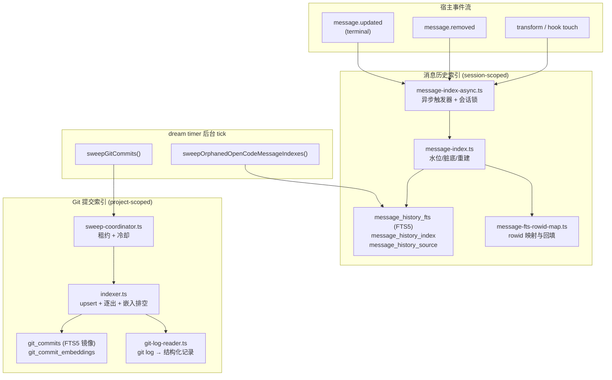
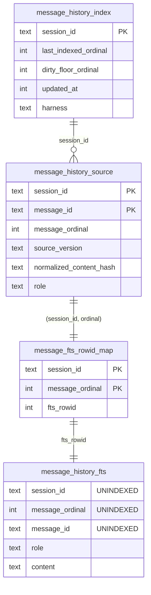
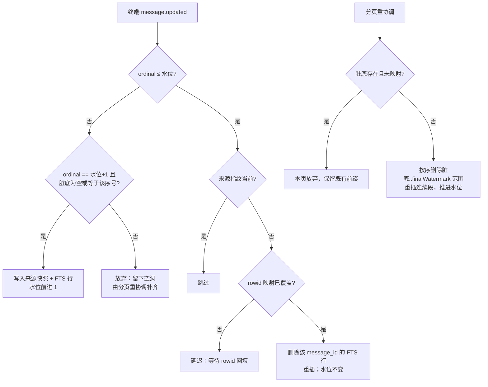
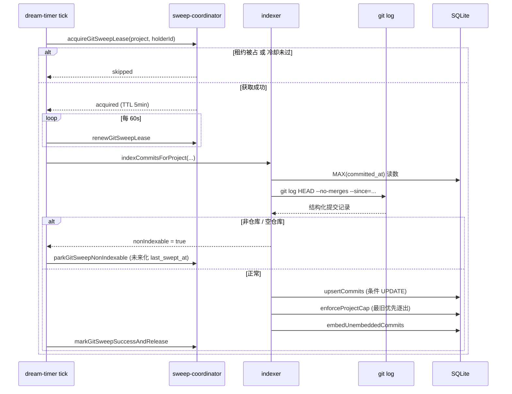

Magic Context 在 SQLite 中维护两个**相互独立、生命周期完全不同**的检索索引：一个是**按会话（session）分区的原始消息历史全文索引**，另一个是**按项目（project）分区的 Git 提交（HEAD 可达、非 merge）语料库**。前者解决"我们之前是否讨论过这件事"，后者解决"这个改动是什么时候、为什么引入的"。两者都不在转换（transform）热路径上写入——消息索引由宿主事件与异步重协调驱动，提交索引由 dream timer 的后台扫描驱动——因此检索查询本身只做一次 FTS5 `SELECT` 或向量比较，不会触发任何写入。

Sources: [ARCHITECTURE.md](ARCHITECTURE.md#L138-L138), [search.ts](packages/plugin/src/features/magic-context/search.ts#L1757-L1773), [message-index-async.ts](packages/plugin/src/features/magic-context/message-index-async.ts#L46-L70)

## 双索引的架构定位

理解这两个子系统的第一步是认清它们的**分区键与所有权模型**的差异。消息历史索引以 `session_id` 为主键维度，其行数随宿主会话增长而增长，且会被宿主侧的删除事件作废，因此需要孤儿清扫（orphan sweep）机制。Git 提交索引以 `project_path`（即 `git:<sha>` 项目身份）为维度，其行数上限由配置显式封顶，且永远不会"过期"——只会因为超过 `max_commits` 而被最旧优先逐出。

Sources: [message-index-async.ts](packages/plugin/src/features/magic-context/message-index-async.ts#L46-L70), [git-commits/index.ts](packages/plugin/src/features/magic-context/git-commits/index.ts#L1-L41), [dream-timer.ts](packages/plugin/src/plugin/dream-timer.ts#L651-L729)

两者在**检索层汇合**：`unifiedSearch` 把消息命中与提交命中各自带一个源权重（source boost）放入同一个排名，但它们的原始分数计算方式并不相同——消息使用 FTS5 `bm25()` 的排名线性衰减，提交使用 FTS 排名与语义余弦相似度的加权混合。下表给出核心差异的对照。

| 维度 | 消息历史索引 | Git 提交索引 |
|---|---|---|
| 分区键 | `session_id` | `project_path`（`git:<sha>`） |
| 行的身份 | 位置序数 `message_ordinal` + `message_id` | 提交 SHA（40 位，主键） |
| 写入触发 | 宿主事件（增量）+ 首次触碰惰性重协调 | dream timer 周期扫描 |
| 并发控制 | 进程内 per-session Promise 锁 + `BEGIN IMMEDIATE` | 跨进程 SQLite 租约（`git_sweep_coordinator`） |
| 上限策略 | 无显式上限，随会话增长 | `max_commits` 封顶，`committed_at DESC, sha DESC` 逐出 |
| 语义嵌入 | 无（纯 FTS + 可选 compartment chunk 向量） | 有（`git_commit_embeddings`，按 SHA 键控） |
| 默认开关 | 始终启用 | `memory.git_commit_indexing.enabled`，默认 `false` |

Sources: [storage-db.ts](packages/plugin/src/features/magic-context/storage-db.ts#L1457-L1477), [migrations.ts](packages/plugin/src/features/magic-context/migrations.ts#L527-L555), [storage-git-commits.ts](packages/plugin/src/features/magic-context/git-commits/storage-git-commits.ts#L158-L175), [config/schema/magic-context.ts](packages/plugin/src/config/schema/magic-context.ts#L1446-L1474)

## 消息历史的表结构与位置语义

消息索引最核心的设计约束是：**消息序号是位置量而非稳定标识**。当一个消息被移除时，其后所有消息的序号都会平移，任何基于"已索引数量"的缓存判断都会因此失效。这就是为什么 `deleteIndexedMessage` 采用"清空整个会话索引并强制下次全量重建"的保守策略，而不是精确删除单行。

Sources: [message-index.ts](packages/plugin/src/features/magic-context/message-index.ts#L449-L471)

四张表构成完整闭环。`message_history_fts` 是一张**独立的 FTS5 表**（使用 `content=` 外部内容表关联，因此其插入内容由列上直接写入），身份列 `session_id` / `message_ordinal` / `message_id` 全部标记为 `UNINDEXED`，只有 `role` 与 `content` 参与 `porter unicode61` 分词。`message_history_index` 是每个会话一行的**进度追踪器**，承载两个关键游标：`last_indexed_ordinal`（水位，含义是"序号 ≤ 该值的一切消息都已处理完毕"）与 `dirty_floor_ordinal`（脏底，语义见下节）。`message_history_source` 保存每个消息的**权威来源快照**（`source_version` 与 `normalized_content_hash`），用于判定"FTS 里的内容是否仍是当前版本"。`message_fts_rowid_map` 则把 `(session_id, message_ordinal)` 映射到 FTS5 自动分配的 `rowid`。

Sources: [storage-db.ts](packages/plugin/src/features/magic-context/storage-db.ts#L1431-L1477), [message-index.ts](packages/plugin/src/features/magic-context/message-index.ts#L75-L118), [message-index.ts](packages/plugin/src/features/magic-context/message-index.ts#L174-L206)

Sources: [storage-db.ts](packages/plugin/src/features/magic-context/storage-db.ts#L1431-L1477), [message-fts-rowid-map.ts](packages/plugin/src/features/magic-context/message-fts-rowid-map.ts#L32-L44)

只有 `user` 与 `assistant` 两种角色会被写入 FTS，且各自有剥离规则：用户文本需先通过"是否存在有意义文本"的门控，再经 `cleanUserText` 清洗；助手文本则经 `removeSystemReminders` 移除系统指令。其他角色（工具结果等）一律返回空字符串，即**不索引**。这个门控在 `getIndexableContent` 中集中实现，因此索引内容集合与后续的来源指纹计算保持一致。

Sources: [message-index.ts](packages/plugin/src/features/magic-context/message-index.ts#L473-L495)

## 水位、脏底与失败安全

消息索引的写入协议围绕一个不变量展开：**水位只能跨越连续的、已被来源数据覆盖的序号**。当一个终端 `message.updated` 事件到来时，若其序号恰好等于"水位 + 1"，则水位前进一步；若超过一步（乱序到达），则该消息的序号被记录为"最早缺失序号"，等待分页重协调器补齐，而水位绝不跨越这个空洞。

Sources: [message-index.ts](packages/plugin/src/features/magic-context/message-index.ts#L524-L563)

对于"已在覆盖范围内"的序号，处理逻辑分化为两种情形。若来源指纹（`source_version` + `normalized_content_hash`）显示 FTS 中已是当前版本，则直接跳过；否则视为**同 ID 的编辑或脱敏**，只替换那一条 FTS 文档而不移动水位。但这里有一个前置守卫：只有当该序号已被 rowid 映射覆盖时才能执行替换——否则旧文档将无法通过 rowid 定位而成为"不可达的孤儿"。

Sources: [message-index.ts](packages/plugin/src/features/magic-context/message-index.ts#L497-L523), [message-index.ts](packages/plugin/src/features/magic-context/message-index.ts#L327-L350)

**脏底（dirty floor）是崩溃安全的基石。** 增量写入在开启事务*之前*先把 `dirty_floor_ordinal` 持久化到磁盘；如果随后的 DELETE/INSERT 或 COMMIT 失败，下一次重协调就不会信任陈旧的 FTS 字节，而是从这个脏底开始重建。`getMessageIndexReconciliationStartOrdinal` 返回 `min(watermark, dirtyFloor - 1)`，`isMessageIndexReconciledThrough` 则要求水位达到目标且脏底为空，两者共同定义了"一致"的判据。

Sources: [message-index.ts](packages/plugin/src/features/magic-context/message-index.ts#L397-L445)

Sources: [message-index.ts](packages/plugin/src/features/magic-context/message-index.ts#L567-L611), [message-index.ts](packages/plugin/src/features/magic-context/message-index.ts#L612-L717)

`indexSingleMessage` 使用显式的 `BEGIN IMMEDIATE` 而非普通的延迟事务，原因值得注意：`message_history_fts` 是**没有 UNIQUE 约束**的裸 FTS5 表，去重判断只能在事务体内完成，因此必须提前获取写者锁，让第二个并发事务能看到第一个事务写入的来源状态。

Sources: [message-index.ts](packages/plugin/src/features/magic-context/message-index.ts#L584-L611)

## 异步索引触发与 rowid 映射回填

v0.17 之后，索引写入彻底移出 `searchMessages()` 热路径，改由三个异步触发器承担：**实时增量**（终端 `message.updated` 事件，按消息 100ms 防抖，完成后以"来源版本 + 内容哈希"为键去重）、**每会话惰性重协调**（首次 transform/hook 触碰时启动一次追赶，按 100 条一页推进，每页之间让出事件循环）、以及**回滚/删除处理**（`message.removed` 清空全部 FTS 行与水位后再重建）。三者共享一个模块级的 per-session Promise 锁——同会话的工作串行化，不同会话可并行。

Sources: [message-index-async.ts](packages/plugin/src/features/magic-context/message-index-async.ts#L46-L105), [message-index-async.ts](packages/plugin/src/features/magic-context/message-index-async.ts#L217-L330)

`message_fts_rowid_map` 是 v83 引入的补丁——在它出现之前的 FTS 行只能靠内容匹配来删除，而裸 FTS5 表无法安全地按内容定位。回填走**有界的 rowid 升序窗口**（每批 500 行），并把水位原子地推进到 `message_fts_rowid_map_backfill_state`。关键性能约束是：`rowid` 约束是 FTS5 的点/范围访问，它绝不会去过滤那些 `UNINDEXED` 的身份列——这是该设计能够在长会话上保持可用的前提。

Sources: [message-fts-rowid-map.ts](packages/plugin/src/features/magic-context/message-fts-rowid-map.ts#L78-L147), [message-fts-rowid-map.ts](packages/plugin/src/features/magic-context/message-fts-rowid-map.ts#L83-L86)

`messageFtsOrdinalRangeIsMapped` 提供了"部分回填区段是否可读"的判据：当一个区段内的来源序号全部已知、且所有可索引来源行都已有映射条目时才返回 `true`；回填整体完成时则无条件返回 `true`。开始回填由 `bun:sqlite` 连接初始化路径触发（`startMessageFtsRowidMapBackfill`），并通过进程内缓存合并 OpenCode 与 Pi 在同一次启动中的重复调用。

Sources: [message-fts-rowid-map.ts](packages/plugin/src/features/magic-context/message-fts-rowid-map.ts#L169-L219), [storage-db.ts](packages/plugin/src/features/magic-context/storage-db.ts#L876-L876)

## 会话级孤儿清扫

由于共享数据库同时服务 OpenCode 与 Pi，且每个 harness 都有各自的会话坐标系，一个已从宿主删除的会话可能在 Magic Context 侧长期留下索引残留。`sweepOrphanedOpenCodeMessageIndexes` 用**有界 keyset 分页**解决这个问题：候选集来自所有 `harnessScoped === true` 的 `SESSION_SCOPED_TABLES` 之并集（并附加 `harness` 谓词），逐批与 OpenCode 权威 `session` 表比对，删除那些已不存在的会话。

Sources: [message-index.ts](packages/plugin/src/features/magic-context/message-index.ts#L777-L800), [message-index.ts](packages/plugin/src/features/magic-context/message-index.ts#L797-L912)

清扫器复用了与 Git 扫描相同的"停车"思路：10 分钟冷却（`MESSAGE_HISTORY_ORPHAN_SWEEP_COOLDOWN_MS`）限制频率，batch 大小 200，24 小时安全年龄（`MESSAGE_HISTORY_ORPHAN_SAFETY_AGE_MS`）确保近期活跃的会话不会被误删。当 OpenCode 数据库暂时不可读时，它把 `last_swept_at` **面向未来**写入，使常规冷却算术自然产生 24 小时的重探测窗口，而不需要新增 schema 字段。

Sources: [message-index.ts](packages/plugin/src/features/magic-context/message-index.ts#L49-L52), [message-index.ts](packages/plugin/src/features/magic-context/message-index.ts#L797-L860), [dream-timer.ts](packages/plugin/src/plugin/dream-timer.ts#L355-L355)

## Git 提交索引：从 `git log` 到结构化语料

提交索引的入口是 `readGitCommitsResult`，它用一次 `execFile("git", ...)` 调用采集历史。格式串为 `%H\x1f%s\x1f%ae\x1f%ct\x1f%b\x1e`——字段用 US（0x1f）分隔、记录用 RS（0x1e）分隔。**刻意回避 NUL（0x00）**是一个经验性修正：Node 的 `execFile` 会拒绝含有嵌入 NUL 字节的 argv 元素，而 Bun 的实现更宽松，这使得该缺陷在单元测试中被掩盖、直到 OpenCode 实机运行才暴露。

Sources: [git-log-reader.ts](packages/plugin/src/features/magic-context/git-commits/git-log-reader.ts#L9-L27), [git-log-reader.ts](packages/plugin/src/features/magic-context/git-commits/git-log-reader.ts#L135-L146)

调用参数固定为 `git log <revision> --no-merges --max-count=N`，可选叠加 `--since=<ISO8601>`。跳过 merge 提交是为了避免"Merge branch 'x'"这类噪声填满索引。解析阶段只按**前 4 个**分隔符切分，从而让正文中可能出现的 `\x1f` 字节不会截断正文；同时校验 SHA 必须恰为 40 字符、时间戳必须为有限正值，任何不符的记录被静默丢弃。

Sources: [git-log-reader.ts](packages/plugin/src/features/magic-context/git-commits/git-log-reader.ts#L135-L146), [git-log-reader.ts](packages/plugin/src/features/magic-context/git-commits/git-log-reader.ts#L190-L235)

失败被三类化，这是为了避免日志洪泛的架构决策：`not_a_repo`（不是仓库）与 `no_head`（仓库尚无提交）是**结构性失败**，重试永远不可能成功，因此调用方将项目置于长重探测冷却；`transient`（超时、git 缺失、权限错误）保留常规重试节奏。日志同时刻意只用不透明的项目身份（`git:<sha>` / `dir:<hash>`）做关联，绝不记录绝对路径——后者携带用户名与项目名，会流入 `doctor --issue` 报告。

Sources: [git-log-reader.ts](packages/plugin/src/features/magic-context/git-commits/git-log-reader.ts#L42-L62), [git-log-reader.ts](packages/plugin/src/features/magic-context/git-commits/git-log-reader.ts#L159-L188)

## 提交语料的增量写入、逐出与嵌入

`indexCommitsForProject` 实现了增量语义：若该身份之前已索引过提交，则 `sinceMs` 取 `max(最新已索引时间 − 60s, now − since_days)`——减去 1 分钟是为了吸收跨系统时钟偏移；否则使用 `since_days` 截断。这个"最新已索引时间"来自 `MAX(committed_at)`，由预编译语句缓存（`WeakMap<Database, PreparedStatement>`）承载。

Sources: [git-commits/indexer.ts](packages/plugin/src/features/magic-context/git-commits/indexer.ts#L93-L127), [storage-git-commits.ts](packages/plugin/src/features/magic-context/git-commits/storage-git-commits.ts#L69-L78)

UPSERT 语句带有一个**条件更新子句** `WHERE git_commits.message != excluded.message`，这意味着消息未变的既有提交会被廉价跳过（`changes === 0`），不会计入 inserted 或 updated。逐出则通过 `LIMIT -1 OFFSET ?` 在 DELETE 语句内部决定溢出范围，而非依赖调用方算出的 `excess`——这避免了另一个进程已先行执行同一上限时，删除掉下一批最旧记录的风险。

Sources: [storage-git-commits.ts](packages/plugin/src/features/magic-context/git-commits/storage-git-commits.ts#L31-L49), [storage-git-commits.ts](packages/plugin/src/features/magic-context/git-commits/storage-git-commits.ts#L80-L95), [storage-git-commits.ts](packages/plugin/src/features/magic-context/git-commits/storage-git-commits.ts#L156-L175)

嵌入排空被三重预算约束：批大小 16、单次扫描最多嵌入 500 条、单次扫描最长 5 分钟墙钟时间。向量以 `commit:${sha}` 作为嵌入请求的逻辑 ID，写回 `git_commit_embeddings` 时按 `(sha, model_id)` 冲突更新，因此**同一提交在不同嵌入模型下可以并存多份向量**，检索时只读取与当前查询模型一致的那一份。

Sources: [git-commits/indexer.ts](packages/plugin/src/features/magic-context/git-commits/indexer.ts#L33-L38), [git-commits/indexer.ts](packages/plugin/src/features/magic-context/git-commits/indexer.ts#L157-L228), [storage-git-commit-embeddings.ts](packages/plugin/src/features/magic-context/git-commits/storage-git-commit-embeddings.ts#L28-L55)

Sources: [dream-timer.ts](packages/plugin/src/plugin/dream-timer.ts#L651-L729), [sweep-coordinator.ts](packages/plugin/src/features/magic-context/git-commits/sweep-coordinator.ts#L113-L177), [git-commits/indexer.ts](packages/plugin/src/features/magic-context/git-commits/indexer.ts#L72-L150)

## 跨进程扫描协调与积压排空

`git_sweep_coordinator` 表以 `project_path` 为主键，承载 `lease_holder` / `lease_expires_at` / `last_swept_at` 三列，实现**跨进程互斥锁 + 冷却**双重门控。租约 TTL 为 5 分钟、每 60 秒续期一次——因此该 TTL 实际上是"崩溃恢复延迟"而非预期的完整墙钟预算。冷却期为 10 分钟。

Sources: [storage-db.ts](packages/plugin/src/features/magic-context/storage-db.ts#L1363-L1372), [sweep-coordinator.ts](packages/plugin/src/features/magic-context/git-commits/sweep-coordinator.ts#L4-L16)

`ignoreCooldown` 选项是这套协调器最关键的一处细分设计：**积压排空路径没有任何 `git log` 成本，必须在每个 tick 都运行直到积压清空**，因此不能被 dream timer 扫描推进的冷却所饿死。它仍受租约的跨进程互斥保护，但释放时调用 `releaseGitSweepLease`（不推进 `last_swept_at`），从而让两条路径的冷却追踪彼此独立。

Sources: [sweep-coordinator.ts](packages/plugin/src/features/magic-context/git-commits/sweep-coordinator.ts#L54-L67), [project-embedding-registry.ts](packages/plugin/src/features/magic-context/project-embedding-registry.ts#L2680-L2743)

同一张 `git_sweep_coordinator` 表被**三段不同的排空路径复用**：提交积压排空、compartment chunk 排空、以及单会话全量 chunk 回填（`/ctx-embed-history` 命令路径）。后两者与 Git 无关，只是借用了同一把按项目身份键控的嵌入协调锁——这样设计的原因是嵌入提供者成本按项目计量，任何两个并发的嵌入批量都会造成重复开销。

Sources: [project-embedding-registry.ts](packages/plugin/src/features/magic-context/project-embedding-registry.ts#L2955-L2995), [project-embedding-registry.ts](packages/plugin/src/features/magic-context/project-embedding-registry.ts#L3040-L3100)

## 检索层：两种命中如何汇合

消息检索在 `searchMessages` 中实现两条路径。**热路径**（无字面探针，即自动搜索与普通自然语言查询）是单查询、逐字节稳定的评分：`bm25(message_history_fts)` 主序，`message_ordinal` 升序作次序，分数用排名线性衰减。带 cutoff 的变体把 `message_ordinal <= ?` **下推到 SQL 的 LIMIT 之前**——否则当排名靠前的命中全是活跃尾部（高于 cutoff）时，它们会被"先取后弃"，而真正合格的更旧命中永远进不了结果窗口；显式 `ctx_search` 可能因此返回空。

Sources: [search.ts](packages/plugin/src/features/magic-context/search.ts#L999-L1052), [search.ts](packages/plugin/src/features/magic-context/search.ts#L360-L388)

**多探针路径**为召回优化：完整查询加上每个字面探针各自独立排序，但每个阶段被合并进一条复合 SQL 语句，从而保留独立 bm25 排名的同时避免语句放大。各探针的权重来自 IDF-lite 判别度 `1 / (1 + 100·df/N)`——文档频率越接近语料规模，该探针越不具区分度。这里的语料规模来自 `getIndexedMessageCorpusSize`，它直接采用水位近似（因为序号在水位之前是连续的），刻意避免扫描全局 FTS 行存储。

Sources: [search.ts](packages/plugin/src/features/magic-context/search.ts#L1054-L1110), [search.ts](packages/plugin/src/features/magic-context/search.ts#L990-L997), [message-index.ts](packages/plugin/src/features/magic-context/message-index.ts#L375-L388)

提交检索走的是**FTS 与向量的混合路径**。FTS 侧按 `bm25` 取前 `max(limit*3, 30)` 条，命中为空时回退到 `LIKE`（应对过短 token 与精确子串查询）；语义侧对项目全部提交向量逐个计算余弦相似度。合并时，双源命中得 `0.7·semantic + 0.3·fts` 并标记为 `hybrid`；单源命中则乘以 0.8 惩罚——这个惩罚的设计意图是**偏好同时被两种信号认可的匹配**。分数相同时更新的提交胜出。

Sources: [git-commits/search-git-commits.ts](packages/plugin/src/features/magic-context/git-commits/search-git-commits.ts#L117-L166), [git-commits/search-git-commits.ts](packages/plugin/src/features/magic-context/git-commits/search-git-commits.ts#L193-L222)

纯语义命中的元数据通过一条 `sha IN (SELECT value FROM json_each(?))` 语句一次性拉取——用 JSON 而非位置参数是为了绕开 SQLite 的参数个数上限。在最终的统一排名中，两种源各有自己的并列决胜规则：消息按 `messageOrdinal` 升序，提交按时间倒序（更新的胜出）。

Sources: [git-commits/search-git-commits.ts](packages/plugin/src/features/magic-context/git-commits/search-git-commits.ts#L72-L84), [search.ts](packages/plugin/src/features/magic-context/search.ts#L1472-L1522)

`unifiedSearch` 在编排层做了两项关键处理。其一，**查询向量只嵌入一次**并同时传给记忆与提交搜索——此前两条路径各自调用 `embedQuery`，在单 GPU 端点上会因模型串行化而使延迟翻倍。其二，嵌入的 `fetch()` 必须在任何同步工作之前被派发，因此代码显式让出一次事件循环：否则长会话上的 `searchMessages` 会阻塞事件循环，导致嵌入请求虽已发起却无法被运行时处理。

Sources: [search.ts](packages/plugin/src/features/magic-context/search.ts#L1775-L1810)

## 配置开关与启用路径

Git 提交索引是**显式 opt-in**，理由是逐项目的嵌入成本。三个参数分别为 `enabled`（默认 `false`）、`since_days`（7–3650，默认 365）、`max_commits`（100–20000，默认 2000，超出即按最旧优先逐出）。该配置独立于 `memory.enabled`，并且曾经位于 `experimental.git_commit_indexing`，现已毕业到 `memory.*` 命名空间（`doctor` 会迁移旧路径并保留用户设定值）。

Sources: [config/schema/magic-context.ts](packages/plugin/src/config/schema/magic-context.ts#L1446-L1474), [CONFIGURATION.md](CONFIGURATION.md#L704-L712)

启用状态在运行期通过项目嵌入注册表的快照传播：`gitCommitEnabled` 由"非观察模式 且 提供者已开启 且 特性已注册"三者合取决定，而检索前的门控还额外要求 `modelId !== "off"`。消息历史索引则没有对应开关——它始终启用，并在 `transform`、hook handler 与 event handler 三处被分别接入（前者触发惰性重协调，中者把终端 `message.updated` 映射为增量索引，后者把 `message.removed` 映射为清空重建）。

Sources: [project-embedding-registry.ts](packages/plugin/src/features/magic-context/project-embedding-registry.ts#L795-L820), [project-embedding-registry.ts](packages/plugin/src/features/magic-context/project-embedding-registry.ts#L1130-L1145), [transform.ts](packages/plugin/src/hooks/magic-context/transform.ts#L807-L807), [hook-handlers.ts](packages/plugin/src/hooks/magic-context/hook-handlers.ts#L350-L366), [event-handler.ts](packages/plugin/src/hooks/magic-context/event-handler.ts#L871-L871)

## 已知的行为边界

两处边界值得使用者知悉。第一，**完整 SHA 查询不是精确检索**：`git_commits_fts.sha` 被声明为 `UNINDEXED`，因此 40 位完整哈希不会走 FTS 匹配，而 `LIKE` 回退也只搜索 `message` 列——结果是完整哈希查询会落入语义搜索并可能返回无关的发布提交。短 SHA（7 位）若出现在提交正文中则可能被命中，但这依赖内容而非身份。

Sources: [migrations.ts](packages/plugin/src/features/magic-context/migrations.ts#L550-L555), [git-commits/search-git-commits.ts](packages/plugin/src/features/magic-context/git-commits/search-git-commits.ts#L58-L70), [ctx-search-empirical-study.md](docs/reports/ctx-search-empirical-study.md#L23-L23)

第二，**提交语料只覆盖 HEAD 可达的非 merge 提交**。`--no-merges` 意味着合并节点本身永不入索引（其携带的信息通常只是分支名），而 `branch` 参数默认是 `HEAD`——因此若某段历史只存在于未合并的分支上，它对 `ctx_search` 不可见。这与消息索引中"活跃尾部之外的内容才可检索"的抑制逻辑形成互补：两者共同保证了检索结果指向的是"当前不在上下文窗口中、但可以在需要时取证"的东西。

Sources: [git-log-reader.ts](packages/plugin/src/features/magic-context/git-commits/git-log-reader.ts#L20-L27), [git-log-reader.ts](packages/plugin/src/features/magic-context/git-commits/git-log-reader.ts#L125-L130), [git-commits/search-git-commits.ts](packages/plugin/src/features/magic-context/git-commits/search-git-commits.ts#L86-L106)

想要继续了解这些索引如何被上层工具暴露，可阅读 [ctx_* 代理工具集](26-ctx_-dai-li-gong-ju-ji)；想要了解承载它们的完整 schema 与迁移体系，可阅读 [SQLite 存储模式、迁移与时间戳约定](21-sqlite-cun-chu-mo-shi-qian-yi-yu-shi-jian-chuo-yue-ding)；想要了解后台扫描所依附的调度模型，可阅读 [Dreamer 任务调度与执行模型](19-dreamer-ren-wu-diao-du-yu-zhi-xing-mo-xing)。