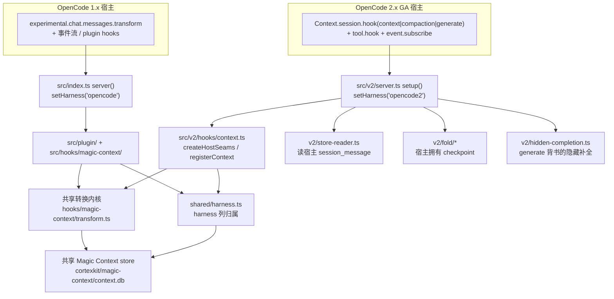
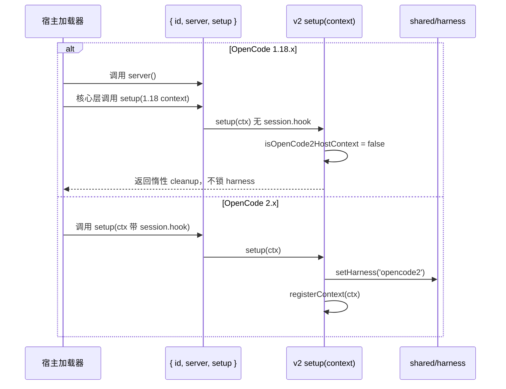

Magic Context 同时支持两代 OpenCode 宿主：**OpenCode 1.x** 与 **OpenCode 2.x**（对照目标固定为 `@opencode/cli@2.0.5`）。两者的宿主 ABI 根本不同，因此适配层并非简单的版本分支，而是一个 **共享转换内核 + 两套宿主接缝（host seam）** 的结构： tagging、确定性重放、m[0]/m[1] 组合、受保护尾部规则、压力调度与 fail-closed 存储全部保留在同一实现中，只有"如何拿到草稿、如何发布结果、如何中断请求"这三类宿主交互被分别实现。本页聚焦 `packages/plugin/src/v2/` 与 `src/plugin/`、`src/hooks/magic-context/` 之间的这层边界，说明双入口加载契约、六个宿主强制差异、v2 装配流程、fold 所有权翻转、隐藏补全载体、存储读取与 generation 检测、TUI 表面以及已记录缺口。

> **阅读前置**：本页假定读者已理解 [转换通道生命周期与阶段划分](9-zhuan-huan-tong-dao-sheng-ming-zhou-qi-yu-jie-duan-hua-fen) 中的 transform 内核，以及 [多宿主统一支持：OpenCode · Pi · OMP](4-duo-su-zhu-tong-zhi-chi-opencode-pi-omp) 中的 harness 概念。Pi / OMP 的对等实现属 [Pi / OMP 插件与跨宿主对等实现](24-pi-omp-cha-jian-yu-kua-su-zhu-dui-deng-shi-xian)，本页不重复。

---

## 双入口加载契约：一个联合对象服务两个加载器

两代宿主使用**完全不同的模块契约**，但包只能暴露一个入口对象。适配层的解法是让入口对象同时携带 `{ id, server, setup }` 三个键：OpenCode 1 的加载器只读 `id`、`server`、`tui` 并忽略未知键，OpenCode 2 的 GA（general availability）插件加载器只校验 `id`、`setup` 并忽略 `tui`。因此同一个默认导出能被两边分别选中自己的回调，而不需要任何子路径导出。

这一设计的关键约束是：**绝不能发布 `./server` 子路径或根目录的 `server.js`**。因为目录加载时子路径优先级更高，一旦存在 `./server`，v1 加载器就会解析到 v2 对象。为此包内保留了一个极薄的 `index.js`（内容为 `export { default } from "./dist/index.js";`），并通过测试把这些"缺失"钉住：`exports` 不含 `./server`、`files` 不含 `server.js`、磁盘上不存在 `server.js`、目录解析结果指向 `index.js`，同时 `rpc` 入口必须为 undefined。

Sources: [packages/plugin/src/index.ts](packages/plugin/src/index.ts#L94-L99), [packages/plugin/src/v2/server.test.ts](packages/plugin/src/v2/server.test.ts#L64-L107), [packages/plugin/src/tui/entry.mjs](packages/plugin/src/tui/entry.mjs#L36-L47)

同一个联合对象契约也适用于 TUI 入口 `./tui`：`entry.mjs` 导出一个 `{ id, tui, setup }` 对象，`tui` 是 v1 的注册函数，`setup` 动态导入 `../v2/tui/index.ts` 并转发。OpenCode 1.18.30 的 TUI 加载器只读 `id/server/tui`，OpenCode 2.0.3 只校验 `id/setup`，因此一个对象同时满足两代 TUI 加载器。与之配套的运行时依赖纪律：包的运行时 `dependencies` 中**不得出现任何 `@opencode/*` 包**，因为 v2 SDK 的 OpenTUI peer 会与 v1 TUI 运行时冲突——`@opencode/plugin@2.0.5`、`@opencode/cli@2.0.5` 等仅作为 devDependencies 存在。

Sources: [packages/plugin/src/tui/entry.mjs](packages/plugin/src/tui/entry.mjs#L1-L34), [packages/plugin/src/v2/server.test.ts](packages/plugin/src/v2/server.test.ts#L96-L107), [packages/plugin/package.json](packages/plugin/package.json#L74-L105)

---

## 适配层总体架构

下图展示两代宿主如何汇入同一个转换内核。注意 v2 侧的每个接缝都对应一个具体的 GA 宿主方法，而 v1 侧使用进程级 hook 与事件流。

架构上，v2 适配层并不复制业务逻辑，而是"驱动"共享内核：用共享 scheduler、tagger 与 chat/tool hook 工厂构造 `createTransform`，把宿主草稿投影为原生 tool part，再用宿主存储读取原始历史。PARITY.md 明确把这一点列为"同一有效行为"的第一条——**一个 transform 核心**，两代都调用 `hooks/magic-context/transform.ts`，不 fork。

Sources: [ARCHITECTURE.md](ARCHITECTURE.md#L21), [PARITY.md](PARITY.md#L14-L26), [packages/plugin/src/v2/hooks/context.ts](packages/plugin/src/v2/hooks/context.ts#L62-L84)

---

## 宿主识别与 harness 锁

适配层最敏感的状态是 **harness 标识**，它写入每个 session 级行，用于区分哪一代宿主写了该行、在仪表盘中按 harness 过滤，以及未来的跨 harness 迁移。`HarnessId` 定义为 `"opencode" | "opencode2" | "pi" | "omp"`，且**必须在任何数据库写入之前设置一次**：默认值是 `"opencode"`，`setHarness` 首次调用后即上锁，后续用不同值调用会抛出异常，防止会话中途切换导致 harness 列被污染。

Sources: [packages/plugin/src/shared/harness.ts](packages/plugin/src/shared/harness.ts#L23-L53)

v2 侧存在一个微妙陷阱：v1 宿主加载器调用 `server()`，但 v1 的**核心 external-plugin 层**会采纳任何默认导出匹配 `{ id, setup }` 的模块并调用 `setup(context)`，且传入的是 1.18 时代的 v2 宿主表面（键为 `[options, agent, aisdk, catalog, command, integration, plugin, reference, skill]`，**没有 `session`**）。如果 `setup()` 不加判别就锁定 harness，v1 进程的整个生命周期都会被误标为 `opencode2`。因此 `isOpenCode2HostContext` 以 `context.session.hook` 是否为函数作为唯一判别式，只有真正携带 `session.hook` 的 OpenCode 2 宿主才会进入 v2 通道；否则记录一条日志后返回惰性的空 dispose，且**绝不写 console**（TUI 会把 console 内容直接画到提示行上）。

Sources: [packages/plugin/src/v2/server.ts](packages/plugin/src/v2/server.ts#L8-L58), [packages/plugin/src/v2/setup-harness.test.ts](packages/plugin/src/v2/setup-harness.test.ts#L12-L67)

若 v2 通道先锁定了 `"opencode2"`，随后同进程的 `server()` 试图锁定 `"opencode"`，则会在启动时直接抛出 `harness already locked to "opencode2"`——这是刻意的 **fence 而非变更**，宁可启动失败也不让该 seat 把会话行写到错误的 harness 下。历史上曾因未加 gate 的 `setup()` 把 v1 seat 误标为 `opencode2`，迁移 v85 专门负责将这类错标行重标回 `opencode`（下文验证章节详述）。

Sources: [packages/plugin/src/index.ts](packages/plugin/src/index.ts#L114-L119), [packages/plugin/src/v2/setup-harness.test.ts](packages/plugin/src/v2/setup-harness.test.ts#L61-L67), [packages/plugin/src/shared/harness.ts](packages/plugin/src/shared/harness.ts#L28-L45)

---

## 六个宿主强制机制差异

PARITY.md 把两代差异分为"完全相同"与"宿主强制"两类。**宿主强制差异不是产品偏好**，每一条都引用了阻止复用 v1 机制的 GA 2.0.5 表面。下表汇总这六个差异及其强制约束。

| # | 机制 | OpenCode 1 机制 | OpenCode 2 机制 | 强制约束（GA 2.0.5 表面） |
| --- | --- | --- | --- | --- |
| 1 | **Hook 载体** | `experimental.chat.messages.transform` 提供可变消息数组 | `Context.session` hook 域提供 `context`/`compaction`/`generate`/tool hooks，投影进同一 transform 内核 | `@opencode/plugin@2.0.5` 只在 `dist/promise/session.d.ts` 暴露 v2 hook 表面，不暴露 v1 实验性 transform 回调 |
| 2 | **Fold 所有权** | Magic Context 拥有延迟 compaction marker，并在该 marker 处裁剪宿主可见历史 | 宿主创建持久 compaction 行并选择序列切点；MC 用冻结基线回答 `compaction` hook，下一次 context pass 才绑定实际切点 | GA 在发布 `Compaction.Started` 事件**之前**就分发 provider-mode compaction，hook 时刻最终切点尚不存在；`Context.session` 无 `compact` 方法 |
| 3 | **隐藏补全** | historian / Dreamer 可用带显式模型的子会话 + 宿主工具循环 | 每个项目/角色的文本型工作复用一个**无父root**子会话，在已解析的 historian/Dreamer 链头上创建 | GA 插件 Pick 无法删除或归档会话，故每个子会话都是可见 root；不可用代际的子会话被 retire 而非删除 |
| 4 | **Fail-closed 中断** | 使用 v1 abort 载体 | `await session.interrupt` 带 2 秒上界，被拒/超时/太晚则抛类型化 refusal | `session.interrupt` 是 GA `Context.session` 上唯一类 abort 操作，返回 `{interrupted:boolean}`，`false` 表示 idle 空操作 |
| 5 | **宿主存储读取** | 从遗留 `message` 与 `part` 表规范化历史 | 从 `session_message` 的有序 JSON 行规范化历史，含 idle 与宿主 compaction 行 | GA 2.0.5 将会话联合持久化为 `session_message` 中的 JSON，遗留表不是其历史权威 |
| 6 | **TUI 加载器与表面** | `./tui` 默认导出按 `{id,tui}` 消费 | 同一模块按 `{id,setup}` 消费，经 `ui.slot` 注册 `sidebar.content` | 两套 API 是不同契约；需从现有 `./tui` 导出一个 `{id,tui,setup}` 联合体 |

Sources: [PARITY.md](PARITY.md#L47-L141), [packages/plugin/src/v2/hooks/types.ts](packages/plugin/src/v2/hooks/types.ts#L1-L155)

---

## v2 装配：`registerContext` 与宿主接缝

`registerContext(context)` 是 v2 通道的装配根。它加载配置、检测冲突（`hostGeneration: "v2"`）、构造 `FoldOwner`、设置 prompt-surface 运行时，再打开共享数据库并注册工具。若持久数据库不可用，隐藏工作对本次插件实例保持不可用，但主 context hook 仍走既有的 fail-closed 存储路径。值得注意的是模型与 agent 来源：v2 是**草稿权威**（draft-authoritative）的——`liveModels` 是一个 Map，由 `context` 草稿本身填充，**绝不从 `message.updated` 事件重建**，这与 v1 的事件驱动映射形成对照。

Sources: [packages/plugin/src/v2/hooks/context.ts](packages/plugin/src/v2/hooks/context.ts#L156-L190), [packages/plugin/src/v2/hooks/context.ts](packages/plugin/src/v2/hooks/context.ts#L173-L176), [ARCHITECTURE.md](ARCHITECTURE.md#L21)

`createHostSeams` 把宿主相关能力注入共享 transform 的 `TransformDeps`，正好对应上表中的三个差异点：`hostRawMessages` 读宿主 store；`hostProtectedTailBoundary` 使用 `opencode2:<sessionId>` 作为 cache namespace；`hostModelFallback` 从草稿 Map 取模型；`hostRefuse` 调用 `interruptBeforeProvider`——即在提供者请求前用 `session.interrupt` 中断并通过 `V2ContextRefusal` 抛错。

Sources: [packages/plugin/src/v2/hooks/context.ts](packages/plugin/src/v2/hooks/context.ts#L62-L84), [packages/plugin/src/v2/hooks/refusal.ts](packages/plugin/src/v2/hooks/refusal.ts#L13-L33)

v2 的 `http.response` hook（仅 `kind === "primary"` 且响应失败）会克隆响应文本做溢出检测，命中后按 compaction 开关分别记录 `recordDetectedContextLimit` 或 `recordOverflowDetected`。工具侧则注册 `execute.before`（断言可执行输入）与 `execute.after`（跑 tool 后置 hook 并投递 Channel 2 合成消息），并在 `registerTools` 中把五个 `ctx_*` 工具经 `context.tool.transform` 显式注册到编辑器——因为**OpenCode 2 要求显式 tool-editor 注册，不加载 v1 的工具映射**。

Sources: [packages/plugin/src/v2/hooks/context.ts](packages/plugin/src/v2/hooks/context.ts#L191-L273), [packages/plugin/src/v2/hooks/tools.ts](packages/plugin/src/v2/hooks/tools.ts#L17-L82)

### 有效载荷投影：`adaptPayload`

GA 把工具调用与结果**拆成独立的 call/result 对**，而共享 TS 管线期望原生 tool part。`adaptPayload` 负责这一双向投影：它先按 `part.id` 把 `tool-result` 入队，再遍历 `tool-call` 完成配对，产出 `{ type: "tool", callID, tool, state }` 形态；`commit()` 阶段再把宿主元数据还原回去。注释强调了关键约束：**只有原生 tool part 会分配 tag，投喂裸 `tool_result` 只能重放已有 tag 而不能创建 tag**。此外草稿头部使用固定的 `HEAD_IDS = ["__magic_context_v2_m0__", "__magic_context_v2_m1__"]` 以承载 m[0]/m[1] 布局。

Sources: [packages/plugin/src/v2/hooks/payload.ts](packages/plugin/src/v2/hooks/payload.ts#L4-L55), [packages/plugin/src/v2/hooks/payload.ts](packages/plugin/src/v2/hooks/payload.ts#L96-L143)

隐藏子会话的草稿改写由 `HiddenChildHook.apply` 完成，它把 marker 匹配的提示改写为校准后的 `[system, user]` 文本对、设置 32k 生成预算与空工具表；未注册的提示在 Magic Context 拥有的子会话上会抛 `HiddenCompletionRefusal`，形成 **fail-closed 桥接**。

Sources: [packages/plugin/src/v2/hooks/hidden-child.ts](packages/plugin/src/v2/hooks/hidden-child.ts#L82-L149)

---

## Fold 所有权翻转

这是两代差异中最需要细致处理的一条。v1 中 Magic Context 拥有延迟 compaction marker 并裁剪历史；v2 中**宿主创建持久 compaction 行并选择序列切点**。GA 在发布 `Compaction.Started` 事件前就分发 provider-mode compaction，因此 hook 时刻最终切点序列尚不存在——**绝不能预测该 seq**。`FoldOwner` 的策略是：先持久化一个**临时源 watermark**，在后续 context pass 再绑定实际行。

`FoldIdentity` 携带两组身份：我们提交的摘要（`submitted`/`submittedSha`）与宿主渲染的包装（`rendered`/`renderedSha`）。`observe` 检测三类硬性偏差——`host_rerender`、`host_cut_before_watermark`、`boot_recovery`——并通过 `onHard` 上报；若检出的 `cutSeq` 小于已持久 watermark，判为宿主在 watermark 前切分；若摘要 SHA 不匹配，则判为宿主重渲染。所有操作按 sessionID 串行化（`serial`），避免并发写入覆盖。

Sources: [packages/plugin/src/v2/fold/owner.ts](packages/plugin/src/v2/fold/owner.ts#L5-L109), [PARITY.md](PARITY.md#L62-L76)

与之配套的是 **marker 策略置为惰性**：`v2CompactionMarkerStrategy` 的 `setPending` 为空、`publish` 返回 false、`applyDeferred` 返回 `{ kind: "already-current" }`、`reconcile` 返回 false——因为 v2 宿主自己拥有 checkpoint 行，v1 的 marker 写入与草稿重放全部无效。

Sources: [packages/plugin/src/v2/fold/markers.ts](packages/plugin/src/v2/fold/markers.ts#L3-L12)

`restoreRow` 负责在切点后恢复**未归档的 pre-cut 行**：它按 GA 的 `to-llm-message` 表示渲染保留的 store 行，而非有损的 historian 投影，保持工具结果成对、附件保留载荷。它处理 `user`（含 skills/文本/附件）、`synthetic`/`skill`/`system`、`location-switched`、`shell`（background 命令不渲染），以及 `assistant` 行——后者按模型是否相同决定是否复用 provider 元数据（`reuse` 与 `toolReuse`），并把 `streaming` 状态的字符串 input 尝试 JSON 解析。

Sources: [packages/plugin/src/v2/fold/restore.ts](packages/plugin/src/v2/fold/restore.ts#L76-L200)

---

## 隐藏补全与生成载体

v2 的隐藏 LLM 工作统一走 **`generate` 背书的隐藏补全执行器接缝**（`src/v2/hidden-completion.ts`），前面套一个可复用的隐藏子会话载体。隐藏子会话在 OpenCode 2 中是**可见 root 会话**，因此元数据以 `opencode2_hidden_children:<projectIdentity>` 为键持久化在 `schema_migrations_meta` 表中，并带 version 1 的严格解析校验（非法 JSON、非法 role、非法 model 均抛错）。角色仅为 `historian` 与 `dreamer`，子会话在解析出的链头上创建，使配置的廉价模型独立于用户会话模型。

Sources: [packages/plugin/src/v2/hidden-completion.ts](packages/plugin/src/v2/hidden-completion.ts#L94-L167), [PARITY.md](PARITY.md#L78-L98)

隐藏 agent 由 `registerHiddenChildAgents` 通过 `agent.transform` 注册为 `historian` 与 `dreamer-classifier`，模式 `primary`、`hidden: true`、权限全 deny。Dreamer 调度通过 `startDreamTrigger` 订阅可读流，只在 `session.execution.succeeded` 事件上唤醒共享调度器 `runDueTasksForProject`——注释强调：**generate 补全没有"执行结束"事件，因此隐藏补全无法通过此订阅递归调度自己**。

Sources: [packages/plugin/src/v2/hooks/hidden-child.ts](packages/plugin/src/v2/hooks/hidden-child.ts#L9-L29), [packages/plugin/src/v2/hooks/dream-trigger.ts](packages/plugin/src/v2/hooks/dream-trigger.ts#L9-L66)

一旦链条不匹配，V2 会**整体预检配置的模型链**：匹配的配置 fallback 可用；非空链中无匹配模型则直接拒绝，而非静默追加会话模型。`generate` 只返回文本，不返回 provider usage 或 finish 元数据，因此 v2 的 usage 是**显式本地分词估算**（跨尝试累加），而非计费 usage——这是该接缝的明确界限。

Sources: [packages/plugin/src/v2/executor-seam-proof.md](packages/plugin/src/v2/executor-seam-proof.md#L40-L55)

Channel 2 交付使用 `session.synthetic` 的 `delivery: "steer"`：`deliverSynthetic` 在发送前先把随机 ID 记录到 `synthetic/<sessionID>/<id>`，识别时只信任该记录而非 ID 前缀（`isAdmittedSynthetic`）。更新检查则订阅事件流，每小时最多一次比对版本，用 toast 通知——且**源码检出被视为本地开发安装**，不做注册表查询。

Sources: [packages/plugin/src/v2/hooks/channel2.ts](packages/plugin/src/v2/hooks/channel2.ts#L16-L62), [packages/plugin/src/v2/hooks/update-check.ts](packages/plugin/src/v2/hooks/update-check.ts#L9-L74)

---

## 宿主存储读取与 generation 检测

v2 从 `session_message` 读有序 JSON 行。`V2StoreReader` 以**只读、`fileMustExist`** 方式打开 store，构造时立即调用 `assertOpenCodeStoreGeneration(db, "v2", path)`——若实际是 v1 store 则拒绝访问。注意 v2 store 中 **ID 不是时间序**，因此 `page` 使用基于 `seq` 的排他游标升序翻页；`latestCompaction` 只选 `status = 'completed'` 的 checkpoint，`window` 包含该 checkpoint 本身以匹配宿主历史切点，`history` 返回全部保留源（用于恢复被宿主切分隐藏的未归档行）。

Sources: [packages/plugin/src/v2/store-reader.ts](packages/plugin/src/v2/store-reader.ts#L86-L171), [PARITY.md](PARITY.md#L112-L122)

generation 检测有一个反直觉的关键点：**`session_message` 表并不能标识 v2**——OpenCode 1.18.x 会同时携带该表与 `message`/`part`。只有 `message` 与 `part` 表的**缺失**才标识 v2 store，这样 v1 宿主永远不会被误判为 v2。三者皆无则返回 `"unknown"`，被视为"尚无内容可读"而非冲突宿主——`assertOpenCodeStoreGeneration` 对 `unknown` 放行，对真实不匹配才抛错。此外，数据库路径解析按 host generation 分支：v1 使用包含候选发现与遗留诊断文本的历史解析器，v2 使用 GA 文件名表（`latest`/`dev`/`beta`/`next`/`prod` 映射到 `opencode.db`，自定义 channel 需去除路径分隔符）。

Sources: [packages/plugin/src/shared/opencode-db-path.ts](packages/plugin/src/shared/opencode-db-path.ts#L211-L260), [packages/plugin/src/shared/opencode-db-path.ts](packages/plugin/src/shared/opencode-db-path.ts#L138-L209), [packages/plugin/src/v2/store-reader.ts](packages/plugin/src/v2/store-reader.ts#L8-L23)

`rawMessages` 把 store 行转成 `RawMessage`：**ordinal 统计整个会话中的对话行，绝不统计 fold 之后的窗口**，因此调用窗口读取时必须传入完整历史，否则越界行的 ordinal 会退化为 `0`（永远不是活跃 ordinal），从而"可见地失败"而非继承邻居的 tag 身份。

Sources: [packages/plugin/src/v2/hooks/store.ts](packages/plugin/src/v2/hooks/store.ts#L7-L46)

数据库侧的 harness 归属同样有专门治理：迁移 v85 负责把被错标为 `harness='opencode2'` 的 OpenCode 1.x 会话行重标回 `opencode`，并在自然键冲突时保留较新的孪生行（例如 `session_projects` 的同 session 双 harness 行）。测试会枚举所有 DDL 中含 `harness` 列的表，断言迁移后 `opencode2` 行数归零。

Sources: [packages/plugin/src/features/magic-context/migrations-v85.test.ts](packages/plugin/src/features/magic-context/migrations-v85.test.ts#L75-L196), [ARCHITECTURE.md](ARCHITECTURE.md#L148)

---

## v2 TUI 表面

v2 TUI 通过 `setupWithJsx(context, jsx)` 装配：初始化 RPC 客户端、订阅 `sidebar.content` 插槽、以 1 秒节流刷新快照，并在 `keymap.layer` 中注册 `/ctx-status` 与 `/ctx-recomp` 两个调色板命令。`statusText` 末行硬编码 `Harness: opencode2`，把当前代际直接呈现给用户。侧边栏内容通过共享 RPC 数据层（`src/tui/data/`）读取，而非任何自造宿主 API。

Sources: [packages/plugin/src/v2/tui/index.ts](packages/plugin/src/v2/tui/index.ts#L86-L198), [packages/plugin/src/v2/tui/index.ts](packages/plugin/src/v2/tui/index.ts#L44-L58)

宿主契约 `V2TuiContext` 是本页范围的边界声明：它定义了 `location`、`renderer`、`data`、`keymap`、`storage.memory`、`ui.{router,slot,toast,dialog}` 的全部形状，`ui.slot` 的 `append` 被收窄为字面量 `"sidebar.content"`。然而 GA 存在一个已记录的缺陷：类型表面宣称 `context.keymap.layer`，但 GA `packages/tui/src/plugin/api.tsx:141-149` 赋给它的是**未绑定的 `Keymap.createLayer`**，在 `plugin.setup` 中调用会抛 `Keymap.Provider is missing`。适配层的处理是捕获该错误、保留侧边栏、不做任何篡改宿主内部的 workaround，因此 `/ctx-status` 与 `/ctx-recomp` 在 v2 TUI 中暂时不可用。

Sources: [packages/plugin/src/v2/tui/types.ts](packages/plugin/src/v2/tui/types.ts#L12-L63), [packages/plugin/src/v2/tui/index.ts](packages/plugin/src/v2/tui/index.ts#L173-L207), [PARITY.md](PARITY.md#L170-L177)

---

## 已记录缺口

这些缺口在 GA 宿主提供缺失载体之前保持可见，**没有任何一条用私有端点、生成式客户端、凭据抓取或自造工具循环来绕过**。

| # | 缺口 | 影响与处理 |
| --- | --- | --- |
| 1 | **Agentic Dreamer 任务被拒绝** | 临时子会话载体刻意剥离文本型隐藏请求的工具；`curate`、retrospective、`maintain-docs`、primer 提升/刷新、user-memory review、mural 渲染、`map-memories`、`verify`、`verify-broad` 在 provider dispatch 前即被拒绝。historian、classifier、compress-cues 因工作纯文本而保留可用 |
| 2 | **MC 无法发起原生 compaction** | GA `Context.session` 的 `compact` 缺失；宿主调度的 compaction 受支持，MC 发起的原生 fold 仍不可用 |
| 3 | **GA Context 表面无已解析配置读取器** | 冲突检测只能检查文件系统配置层，无法报告 managed 或 host-only 合并层；宿主仍把每次自动 compaction 路由进 MC 的 hook |
| 4 | **无 CLI 时 Desktop 代际检测未知** | Desktop 应用 ID 只能表明 Desktop 曾运行，其持久设置不暴露宿主主版本；纯 Desktop 安装报告 `unknown`，`OPENCODE_DB` 是显式消歧手段 |
| 5 | **GA keymap 注册助手在 setup 期间不可用** | 见上节，`/ctx-status`、`/ctx-recomp` 在 v2 TUI 中暂不可用，侧边栏保持活跃 |
| 6 | **无 server-to-TUI 的插件 RPC 桥** | `Host.resolve` 容忍 `./rpc` 缺失；v2 侧边栏使用 MC 自己的认证式 localhost 发现/socket 传输 |
| 7 | **跨代 provider 请求体并非字节一致** | 等价草稿在宿主拥有的 tools、options、message shaping 上不同；缓存稳定性在**各代内部**断言，不主张跨宿主字节一致 |
| 8 | **隐藏 root 无法被插件移除** | GA `Context.session` 无 `remove`，元数据不隐藏 root 会话；doctor 只能只读清点，用户需通过 OpenCode 自行移除 |

Sources: [PARITY.md](PARITY.md#L145-L191), [packages/plugin/PARITY.md](packages/plugin/PARITY.md#L6-L31)

此外 v2 场景层还记录了两条与原生 todo 相关的判定：GA 2.0.5 提供者工具清单含 `shell`、`subagent`、`execute` 及注册的 `ctx_*`，但**没有 todo 写入器**（宿主强制）；适配层**不**自造原生宿主工具或持久化虚构的 todo 快照（主动选择）。

Sources: [packages/plugin/PARITY.md](packages/plugin/PARITY.md#L8-L12)

---

## 验证通道

| 通道 | 位置 | 覆盖内容 |
| --- | --- | --- |
| 精确 pin 的 Docker e2e | `tests/docker/opencode2/run.sh` + `Dockerfile` | 构建可发布插件，在干净容器中运行精确 pin 的 OpenCode 2.0.5 Linux 宿主；安装 `@opencode/cli@2.0.5`、`@opencode/cli-linux-x64@2.0.5`、`@opencode/client@2.0.5`（仅 lane driver）。失败条件包括缺二进制、pin 错误、插件激活失败、无变换后的 provider head、缺完成 fold、`opencode2` MC 行错误/缺失、数据库非 hermetic 放置、TUI 未执行 `setup` 并绘制侧边栏 |
| 真实 GA 场景 lane | `tests/docker/opencode2/lane.mjs` | 启动 `opencode2 serve` 并在 mock provider 上跑多轮，断言 wire 含 `<session-history>` 或 `<conversation-checkpoint>`、宿主 `session_message` 至少一个完成的 compaction 行、MC 库恰好一行 `harness='opencode2'` 的 `session_meta` |
| 深度真实 GA 行为 lane | `packages/e2e-tests/tests/opencode2/` | hook、安全、fold、隐藏补全、store-reader、per-model prompt surface、pins（sha256 钉住 v1 入口字节） |
| 单元层契约 | `src/v2/setup-harness.test.ts`、`src/v2/server.test.ts`、`src/v2/tui/host-contract.test.ts`、`src/v2/v1-sequences.test.ts` | harness 锁语义、联合导出契约、GA exports-map 解析与 v1 TUI 投影、六个 v1 生命周期序列的字节级黄金对比 |

`v1-sequences.test.ts` 用 `v1-sequences.golden.json` 对比六种 historian 生命周期场景（clean / transient / validation-repair-editor / fallback-model / length-capped-reasoning / aborted）的序列化请求体与响应——这是保证 v2 接缝不改变 v1 顺序的**字节级回归 oracle**。CI 中 `e2e-opencode2` 任务运行 Docker 通道，`e2e-host-opencode2` 在其通过后运行宿主行为 lane。

Sources: [PARITY.md](PARITY.md#L195-L207), [tests/docker/opencode2/Dockerfile](tests/docker/opencode2/Dockerfile#L22-L47), [tests/docker/opencode2/lane.mjs](tests/docker/opencode2/lane.mjs#L128-L167), [packages/plugin/src/v2/v1-sequences.test.ts](packages/plugin/src/v2/v1-sequences.test.ts#L10-L143), [.github/workflows/ci.yml](.github/workflows/ci.yml#L197-L215), [.github/workflows/ci.yml](.github/workflows/ci.yml#L417-L449)

---

## 构建与运行时依赖纪律

v2 通道有独立的构建脚本 `build:v2`：`bun build src/v2/server.ts --outfile dist/v2/server.js --target node --format esm --external @opencode/plugin`，随后运行 `server.test.ts`。`@opencode/plugin` 被声明为 **external**，因为它是 dev-only 依赖，不进入 npm 为 v1 用户安装的依赖树。发布产物通过 `files` 白名单携带 `src/v2/tui`、`src/shared`、`src/config`、`src/agents` 等原始子路径，同时把 dreamer 的 `cron.ts` 与 `task-registry.ts` 单独列入——这解释了 Dockerfile 逐目录 COPY 的形态。

Sources: [packages/plugin/package.json](packages/plugin/package.json#L38-L53), [packages/plugin/package.json](packages/plugin/package.json#L25-L37), [tests/docker/opencode2/Dockerfile](tests/docker/opencode2/Dockerfile#L31-L41)

---

## 后续阅读

- 想了解转换内核本身的阶段划分，回到 [转换通道生命周期与阶段划分](9-zhuan-huan-tong-dao-sheng-ming-zhou-qi-yu-jie-duan-hua-fen)。
- 想了解 m[0]/m[1] 在这层如何投影为 `HEAD_IDS`，见 [m[0]/m[1] 缓存布局与物化触发条件](10-m-0-m-1-huan-cun-bu-ju-yu-wu-hua-hong-fa-tiao-jian)。
- 想了解 fold 切点语义与受保护尾部边界，见 [受保护尾部边界与上下文窗口几何](15-shou-bao-hu-wei-bu-bian-jie-yu-shang-xia-wen-chuang-kou-ji-he)。
- 想了解 harness 列与迁移治理，见 [SQLite 存储模式、迁移与时间戳约定](21-sqlite-cun-chu-mo-shi-qian-yi-yu-shi-jian-chuo-yue-ding)。
- v2 侧边栏与命令面属 [命令系统与 TUI 侧边栏](27-ming-ling-xi-tong-yu-tui-ce-bian-lan)；`ctx_*` 工具定义属 [ctx_* 代理工具集](26-ctx_-dai-li-gong-ju-ji)；隐藏补全调度的 Dreamer 侧属 [Dreamer 任务调度与执行模型](19-dreamer-ren-wu-diao-du-yu-zhi-xing-mo-xing)；完整宿主测试矩阵见 [端到端测试与宿主测试矩阵](30-duan-dao-duan-ce-shi-yu-su-zhu-ce-shi-ju-zhen)。