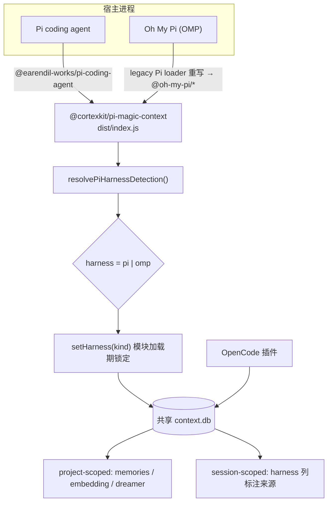
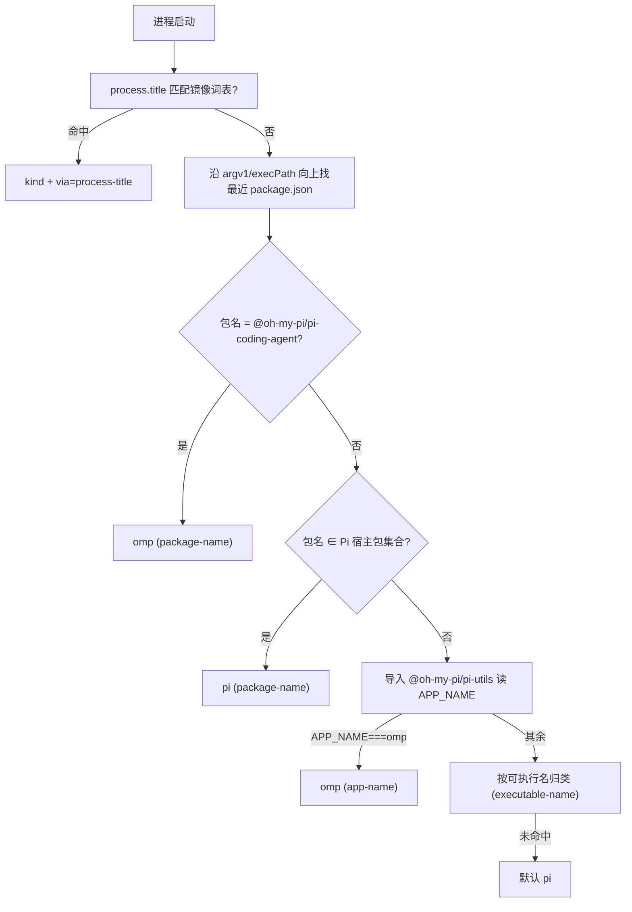
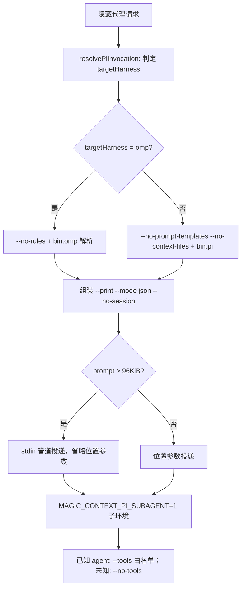

本页聚焦 `packages/pi-plugin/`（发布名 `@cortexkit/pi-magic-context`）这一**单包双宿主**扩展：同一份代码同时运行在 Pi coding agent 与 Oh My Pi（OMP）之上，并与 OpenCode 插件共享同一个 SQLite 数据库。核心命题是"**同一行为、不同机制**"——凡因宿主运行时差异而必然分化之处，都以显式、可审计的方式记录在 `PARITY.md` 中，而非作为 bug 被反复误报。本页讲解包加载契约、宿主识别、配置分栏、Provider 映射、子代理进程适配，以及对等性判定框架与声明式分歧矩阵。

Sources: [README.md](packages/pi-plugin/README.md#L1-L5), [PARITY.md](packages/pi-plugin/PARITY.md#L1-L17)

## 单包双宿主：加载契约与运行时形态

`package.json` 同时声明两个宿主入口，且都指向同一构建产物 `./dist/index.js`：`pi.extensions` 与 `omp.extensions`。这意味着宿主识别不能依赖包名或扩展清单，而必须在运行时判定当前进程究竟是 Pi 还是 OMP。测试基线为 Pi `>= 0.74.0` 或 OMP `>= 17.1.7`。

Sources: [package.json](packages/pi-plugin/package.json#L84-L96), [README.md](packages/pi-plugin/README.md#L1-L8)

OMP 的兼容层（legacy Pi loader）把 `@earendil-works/*` 导入映射到其内置的 `@oh-my-pi/*` 运行时；因此本扩展的静态 import 书写为 Pi 形态，在 OMP 上由宿主重写解析。也正因存在这种重写，识别逻辑**不读取可执行文件 basename**，而是通过运行期模块图探测——编译产物与软链启动的行为因此一致。

Sources: [README.md](packages/pi-plugin/README.md#L79-L83), [pi-harness-kind.ts](packages/pi-plugin/src/pi-harness-kind.ts#L130-L160)

Sources: [index.ts](packages/pi-plugin/src/index.ts#L202-L204), [harness.ts](packages/plugin/src/shared/harness.ts#L1-L23), [README.md](packages/pi-plugin/README.md#L107-L125)

## 宿主识别：从进程题名到模块图

识别入口是 `resolvePiHarnessDetection()`，其回退链严格有序：**进程题名（process-title）→ 宿主包名（package-name）→ `APP_NAME`（app-name）→ 可执行名（executable-name）→ 默认 `pi`**。每一步都返回 `{ kind, via }`，`via` 作为诊断证据被写进启动日志，便于区分"确证"与"兜底"。检测结果通过 `Symbol.for` 键缓存在 `globalThis` 上（含一个在途 Promise 槽位，避免并发重复探测），因此能在 Pi 的 jiti 加载器以 `moduleCache: false` 反复重置模块级状态时依旧保持进程级唯一。

Sources: [pi-harness-kind.ts](packages/pi-plugin/src/pi-harness-kind.ts#L170-L210), [index.ts](packages/pi-plugin/src/index.ts#L207-L250)

第一、二级证据都基于共享词汇表与包名白名单：`PI_IMAGE_NAMES`（`pi`、`pi.cmd`、`omp`、`oh-my-pi`）用于把进程题名/可执行名归类，除 `pi` 外一律归为 `omp`；包名侧则显式匹配 `@oh-my-pi/pi-coding-agent`（→ omp）与 Pi 宿主包集合（→ pi）。第三级 `app-name` 是通过宿主模块图中的 `@oh-my-pi/pi-utils` 读取进程内 `APP_NAME`，这是"不依赖可执行 basename"的正解，导入失败被视为不确定而非结论。

Sources: [pi-executable.ts](packages/plugin/src/shared/pi-executable.ts#L1-L21), [pi-harness-kind.ts](packages/pi-plugin/src/pi-harness-kind.ts#L88-L160)

Sources: [pi-harness-kind.ts](packages/pi-plugin/src/pi-harness-kind.ts#L170-L186)

另提供同步版本 `resolvePiHarnessKind()` 供运行期调用方（如子代理 argv 构造）使用：若异步完整结果已缓存则直接复用，否则走同步子链（题名 → 包名 → 可执行名），仍无法判定时兜底为 `pi`。测试可通过 `__setPiHarnessKindForTesting` 注入 `via: "test-override"`。

Sources: [pi-harness-kind.ts](packages/pi-plugin/src/pi-harness-kind.ts#L211-L242)

## harness 判别符：共享数据库中的来源归属

判定结果在扩展模块加载期被一次性锁定：`setHarness(PI_HARNESS_KIND)`，同时 `PREFIX` 变为 `[magic-context][<kind>]` 以区分日志来源。`setHarness` 具备锁语义——一旦设定，用不同值再次调用会抛错，从设计上杜绝会话中途换宿主导致 `harness` 列污染。`HarnessId` 的取值域为 `opencode | opencode2 | pi | omp`。

Sources: [index.ts](packages/pi-plugin/src/index.ts#L202-L204), [index.ts](packages/pi-plugin/src/index.ts#L803-L806), [harness.ts](packages/plugin/src/shared/harness.ts#L23-L63)

存储分两层：**session-scoped 表**携带 `harness` 判别符标注写入来源；**project-scoped 数据**（memories、embedding cache、dreamer runs）按 `project_path`（解析后的 git root）归属，在三宿主间共享。因此 OMP 是拥有独立判别符的一等宿主——真实 E2E 用例直接断言 `SELECT COUNT(*) FROM session_meta WHERE harness='omp'` 大于零，且 OMP 日志落在自己的 tmpdir 子树下。

Sources: [CONFIGURATION.md](CONFIGURATION.md#L75-L78), [test-omp-e2e.sh](tests/docker/test-omp-e2e.sh#L1-L12), [test-omp-e2e.sh](tests/docker/test-omp-e2e.sh#L196-L205)

共享同一数据库也带来跨进程一致性约束：数据库迁移前会做 Pi/OMP 活进程探测，`process` 分类器把 `pi`、`pi harness`、`omp`、`oh-my-pi` 统一识别为 "Pi" 族进程；仅当无法确证存在活跃 Pi 宿主时才继续迁移，探测失败（例如沙箱拒绝 `ps`）会被显式记录为"未能确证"而非默认放行。

Sources: [storage-db.ts](packages/plugin/src/features/magic-context/storage-db.ts#L462-L475), [storage-db.ts](packages/plugin/src/features/magic-context/storage-db.ts#L660-L692)

## 配置分栏：omp 块优先、pi 块兜底

historian / dreamer 的模型执行被拆为 `opencode`、`pi`、`omp` 三个独立块。OMP 的解析规则是**整块优先级**：`historian.omp ?? historian.pi`、`dreamer.omp ?? dreamer.pi`（含任务级覆盖）。一旦存在显式 `omp` 块即为权威——即便它省略了 `model`，也不会退化到 `pi` 块；只有 `omp` 块**完全缺席**时才回退。旧用户因此无需迁移。schema 侧以 `PER_HARNESS_MODEL_KEYS = ["opencode","pi","omp"]` 固定该三元组，并为 OMP 定义独立的 `OmpEntrySchema`（`thinking_level` 词表含 OMP 专有的 `inherit` 与 `auto`）。

Sources: [CONFIGURATION.md](CONFIGURATION.md#L20-L30), [CONFIGURATION.md](CONFIGURATION.md#L422-L426), [magic-context.ts](packages/plugin/src/config/schema/magic-context.ts#L170-L201)

解析实现位于 `resolveHarnessBlock`：当 `harness === "omp"` 时读取 `container.omp ?? container.pi`，其余宿主读取自身块。`ModelHarness` 类型显式枚举 `"opencode" | "pi" | "omp"`。这一点是"配置一份、三宿主可读"的关键：共享配置存**规范化（OpenCode）形态**，各宿主在读取边缘做变换。

Sources: [model-resolution.ts](packages/plugin/src/shared/model-resolution.ts#L1-L40)

配置**文件定位**层面还有一个刻意的合并：在候选 legacy 配置源中，OMP 复用 `pi` 的 legacy 源（`resolveLegacyConfigSourcesForHarness(..., "pi")`）。这属于路径兼容层行为，与上文的模型块优先级是两回事——前者保证 OMP 能读到历史 Pi 配置，后者保证 OMP 有独立的第一等模型栏位。

Sources: [prompt-surface-runtime.ts](packages/plugin/src/shared/prompt-surface-runtime.ts#L99-L120)

| 配置维度 | OpenCode | Pi | OMP |
|---|---|---|---|
| 模型块键 | `historian.opencode` / `dreamer.opencode` | `historian.pi` / `dreamer.pi` | `historian.omp` / `dreamer.omp`（缺席回退 `pi`） |
| Entry 对象限定符 | `variant` | `thinking_level` | `thinking_level`（额外支持 `inherit`、`auto`） |
| 宿主设置文件 | `opencode.jsonc` | `~/.pi/agent/settings.json` | `config.yml`（`omp config set`） |
| 原生压缩开关 | `compaction.auto` 等 | 由 Pi 自身管理 | `compaction.enabled` |
| 原生自动记忆 | 无同名项 | — | `memory.backend`（须 `off`，避免双记忆注入） |

Sources: [CONFIGURATION.md](CONFIGURATION.md#L26-L30), [setup-omp.ts](packages/cli/src/commands/setup-omp.ts#L77-L130)

## Provider ID 映射：宿主边界而非存储身份

共享配置始终存**规范化（OpenCode）形态**的 `provider/model`；Pi 与 OMP 各自持有一对边界变换。两者共享两个订阅别名（`openai ↔ openai-codex`、`google ↔ google-antigravity`），但唯一的真实分歧是 OpenCode Zen 网关：OpenCode 与纯 Pi 都叫 `opencode`，OMP 则暴露为 `opencode-zen`。因此只有 OMP 映射表携带 `opencode ↔ opencode-zen` 这一对，纯 Pi 保持 `opencode` 为恒等。两家导出函数刻意分开，避免未来 OMP 目录重命名静默改变纯 Pi 行为。

Sources: [harness-provider-map.ts](packages/plugin/src/shared/harness-provider-map.ts#L1-L60)

映射仅重写首个 `/` 之前的 provider 前缀，模型 ID（含多斜杠嵌套 ID）逐字节保留；未知或带 scope 的前缀视为恒等。查找顺序函数 `modelRefLookupOrder` 以规范形态为第一candidate，并附带各宿主原生拼写作为回退，使同一配置文件可在所有宿主上工作。迁移/身份比较使用 `canonicalModelIdentity`（先归一 OMP 别名再归一 Pi 别名，最后套用模型级别名如 `github-copilot/gpt-6-astra → openai/gpt-6-astra`）。

Sources: [harness-provider-map.ts](packages/plugin/src/shared/harness-provider-map.ts#L72-L120)

| 规范（OpenCode） | Pi 原生 | OMP 原生 |
|---|---|---|
| `openai/<model>` | `openai-codex/<model>` | `openai-codex/<model>` |
| `google/<model>` | `google-antigravity/<model>` | `google-antigravity/<model>` |
| `opencode/<model>` | `opencode/<model>`（恒等） | `opencode-zen/<model>` |

Sources: [harness-provider-map.ts](packages/plugin/src/shared/harness-provider-map.ts#L37-L70)

## 子代理与子进程：argv 与路径的宿主适配

Magic Context 的隐藏代理（historian、dreamer、recomp 等）通过 `PiSubagentRunner` 以 `--print --mode json --no-session` 拉起子进程。`--no-session` 使子会话使用 `SessionManager.inMemory()`，JSONL 不落盘，隐藏代理不会出现在会话选择器中。超过 `PROMPT_ARGV_MAX_BYTES`（96 KiB）的提示改由 **stdin 管道**投递（Pi 会拼接 stdin + 位置参数），并省略位置参数以防重复——这是为了绕开 Linux `MAX_ARG_STRLEN`/E2BIG。

Sources: [subagent-runner.ts](packages/pi-plugin/src/subagent-runner.ts#L1990-L2000), [README.md](packages/pi-plugin/README.md#L161-L175)

argv 构造按目标宿主分叉。OMP 拒绝 Pi 的 `--no-prompt-templates` 与 `--no-context-files`，它把 AGENTS.md 类上下文折叠进 rules，故以 `--no-rules` 作为等价手段以保持子代理系统提示精确不变。`--tools` 语义同样不同：Pi 把它作为覆盖内置与扩展工具的**硬注册表隔离**；OMP 只校验内置名并随后追加已发现的扩展工具，因此 OMP 的列表是"内置预算"而非扩展工具沙箱。未知 agent id 一律 fail-closed 到 `--no-tools`。

Sources: [subagent-runner.ts](packages/pi-plugin/src/subagent-runner.ts#L2024-L2056), [subagent-entry.ts](packages/pi-plugin/src/subagent-entry.ts#L44-L48), [PARITY.md](packages/pi-plugin/PARITY.md#L664-L683)

可执行文件解析也按宿主分叉：包名 `@oh-my-pi/pi-coding-agent` 判为 `omp`，其 bin 键为 `omp`（Pi 为 `pi`）；解析过程保留"候选必须位于包根内（软链规范化后）"的逃逸防护。相对路径的扩展允许列表亦按宿主基准目录解析：纯 Pi 用 `~/.pi/agent`，而确证为 OMP 时优先命名 profile（`OMP_PROFILE`/`PI_PROFILE` → `~/.omp/profiles/
/agent`），其次 `PI_CODING_AGENT_DIR`，最后 `~/.omp/agent`。

Sources: [subagent-runner.ts](packages/pi-plugin/src/subagent-runner.ts#L97-L105), [subagent-runner.ts](packages/pi-plugin/src/subagent-runner.ts#L168-L200), [subagent-runner.ts](packages/pi-plugin/src/subagent-runner.ts#L519-L560)

递归保护分两道：子进程环境注入 `MAGIC_CONTEXT_PI_SUBAGENT=1`，使完整入口 `index.ts` 在注册任何 hook/tool/timer 之前提前返回；需要 `ctx_*` 工具的已知 agent 则显式加载精简入口 `subagent-entry.js`，该入口永不通电 `pi.on("context")`，只注册受限工具面。此外，同一进程内的 `@gotgenes/pi-subagents` 子会话由进程共享的 `AsyncLocalStorage` 抑制——只压制该子会话，不影响 pi-web 同进程内其他独立会话。

Sources: [subagent-entry.ts](packages/pi-plugin/src/subagent-entry.ts#L1-L40), [index.ts](packages/pi-plugin/src/index.ts#L207-L262)

Sources: [subagent-runner.ts](packages/pi-plugin/src/subagent-runner.ts#L2024-L2130)

## 对等性的判定框架：同一行为、不同机制

`PARITY.md` 是本页所描述体系的核心治理资产，其上写明：Pi 插件与 OpenCode 插件共享同一 `context.db` 与同一 `packages/plugin/src` 核心（storage、decay 渲染、tag-transcript、search），必须产出**同样的有效行为**（缓存稳定、溢出保护、衰减分层），但在宿主运行时不同处机制可以不同。文档面向审计者（人、Oracle、议事会）声明：下列条目**不是 bug**；若认为有误，应驳斥其 rationale，而非仅报告"Pi 与 OpenCode 不同"。

Sources: [PARITY.md](packages/pi-plugin/PARITY.md#L1-L17)

Pi 侧每次 LLM 调用前由 `pi.on("context")` 触发的变换管线本身镜像了 OpenCode 的完整流程：包 `AgentMessage[]` 为 Transcript → 用共享 `Tagger` 打 `§N§` 标签 → 应用排队 drop 与持久化标签状态 → 准备 m[0]/m[1] 注入、裁剪活跃尾部至分区边界、重放 reasoning/placeholder/sentinel 剥离以保证字节稳定 → 运行 historian 触发、nudge 与 auto-search 提示 → 排空延迟的 compaction marker。其错误哲学与 OpenCode 的 transform 包装一致（普通异常记录后放行原消息），但 `FailClosedBlockingError` 会重新抛出，使确定性不可用不能静默退化为原生压缩。

Sources: [context-handler.ts](packages/pi-plugin/src/context-handler.ts#L1-L38)

下表摘取具代表性的机制分歧（完整清单见 `PARITY.md` 各条）：

| 领域 | OpenCode 机制 | Pi / OMP 机制 | 等价保证 |
|---|---|---|---|
| 原生子代理门控 | `session.parent_id` 判定子代理，`fullFeatureMode` 收窄功能 | Pi 无原子代理；隐藏代理是独立 `pi --print` 进程，精简入口不通电 context 管线 | `is_subagent` 永不写入 true，故无需该门控 |
| 占位符清理 | 以空文本哨兵中和，保留数组结构 | 从 JSONL 每趟重建，直接**切除**该消息；发现仅在刷新趟执行 | 两端都不中和 user-role 消息 |
| 会话终止 | `session.deleted` 终结，清内存 + 持久态 | 无该事件，`session_before_switch` 可逆，仅清内存映射 | 持久 m[0] 缓存保留，避免切回时缓存击穿 |
| 压缩所有权 | 自身延迟压缩 marker | `session_before_compact → {cancel:true}`，暂存原生 marker 并延迟排空 | 模型可见上下文始终按边界裁剪 |
| 工作指标 | RPC 惰性增量计算（O(session age) 已移出热路径） | 在内存 wire 数组上折叠，成本受 wire 消息数约束 | 仅显示用值，效果一致 |
| 上下文上限来源 | SDK `config.providers()` + 持久用量回退 | 自身运行期 `getContextUsage().contextWindow` / `ctx.model.contextWindow` | 同受 `[20k,3M]` 合理区间与溢出覆盖约束 |
| 紧急恢复解除 | 计数器逃逸（`RECOVERY_NO_HEAD_LIMIT=2`） | 在 no-fire 分支内联解除，受"真实压力低于强制阈值"保护 | 防止陈旧标志无限抬压 |

Sources: [PARITY.md](packages/pi-plugin/PARITY.md#L19-L50), [PARITY.md](packages/pi-plugin/PARITY.md#L51-L80), [PARITY.md](packages/pi-plugin/PARITY.md#L81-L123), [PARITY.md](packages/pi-plugin/PARITY.md#L442-L460), [PARITY.md](packages/pi-plugin/PARITY.md#L515-L547), [PARITY.md](packages/pi-plugin/PARITY.md#L562-L588)

Pi 还拥有若干**无 OpenCode 对应物**的机制，同样属声明式分歧：`synth-user-<realId>` 折叠（把连续 `toolResult` 折叠为合成 user 消息，使尾部工具输出可打标/可丢弃）、`pi_stable_id_scheme`（迁移 v25 的一次性强执行切换，把持久状态从 `pi-msg-<index>` 重键为真实 `SessionEntry` id）、`syntheticLeadingCount`（锚点 GC 分母排除无 id 的 m[0]/m[1] 合成前缀）以及运行期推导的动态 `upgradeState`。

Sources: [PARITY.md](packages/pi-plugin/PARITY.md#L181-L200)

`PARITY.md` 末尾给出维护规则：每当引入或修改一处刻意的 Pi↔OpenCode 分歧，必须同步更新该文件，并把审计/议事会/Oracle 简报指向它，使"有意分歧"与"真实缺陷"可被机械区分。

Sources: [PARITY.md](packages/pi-plugin/PARITY.md#L827-L835)

## 声明式分歧矩阵与宿主强加约束

端到端侧以 `HOST-SCENARIO-MATRIX.md` 做逐场景、逐宿主的裁决，取值分三类：`pass`、`declared-divergence`（宿主被命名在 manifest 的 `divergences` 数组中，且所引宿主面无法表达 OpenCode 行为）、`product-bug`（真实宿主运行仍失败）。矩阵明确：**一条通过的分歧分支并不等于声称缺失的 v1 机制在该宿主上存在**。

Sources: [HOST-SCENARIO-MATRIX.md](packages/e2e-tests/HOST-SCENARIO-MATRIX.md#L1-L6)

| 场景 | OpenCode | OpenCode 2 | Pi | OMP |
|---|---|---|---|---|
| cache invariants | pass | pass | pass | pass |
| cache stability | pass | pass | pass | declared-divergence |
| compaction off | pass | pass | pass | pass |
| deferred compaction marker | pass | declared-divergence | declared-divergence | pass |
| dropped-input guard | pass | pass | declared-divergence | declared-divergence |
| historian success | pass | pass | pass | pass |
| long-running session | pass | declared-divergence | pass | declared-divergence |
| subagent behavior | pass | declared-divergence | declared-divergence | declared-divergence |
| thinking-block safety | pass | declared-divergence | declared-divergence | declared-divergence |
| notice-loop race | pass | declared-divergence | declared-divergence | declared-divergence |
| Pi cross-harness | declared-divergence | declared-divergence | pass | declared-divergence |

Sources: [HOST-SCENARIO-MATRIX.md](packages/e2e-tests/HOST-SCENARIO-MATRIX.md#L8-L40)

最强的一处**宿主强加约束**（HOST-IMPOSED）是 OMP 的 provider attestation：其 Anthropic 适配器向 `system[0]` 注入 `x-anthropic-billing-header`，并把 `cch` 值替换为**整个出站 body 的 XXHash64 派生证明**。于是即便 Magic Context 的贡献被冻结，尾部增长也会改变 system 字节。manifest 因此对 `cache-stability` 与 `long-running-session` 声明 OMP 分歧，而非剥离该头或弱化整系统身份断言；后段 OMP 阶段被明确标注为**未获该场景验证**，但独立的 OMP 缓存不变量、historian、todo、memory、overflow 场景仍保持启用。

Sources: [PARITY.md](packages/pi-plugin/PARITY.md#L1044-L1063)

其他 OMP 分歧多归为 HARNESS GAP（配置/夹具纠正而非产品缺陷）或 PRODUCT BUG：例如 cache invariants 与非 git 夹具记忆身份须使用 OMP 暴露的 cwd（macOS 上会去掉 `/private`）而非另一种 realpath 拼写；short-context overflow 须用等长但互异的记录替代重复循环（否则 OMP 会正确判定为 thinking loop 而拒绝）；window overlay reload 在 Pi 系两宿主上暴露的是产品缺陷（`getContextUsage().contextWindow` 是目录元数据而非观测到的 provider 真值）。此外 `notice-loop-race` 因 Pi/OMP 不暴露等价的 notice-holding carrier 而保持 OpenCode 专属。

Sources: [PARITY.md](packages/pi-plugin/PARITY.md#L1034-L1043), [PARITY.md](packages/pi-plugin/PARITY.md#L1064-L1082)

真机验证由按宿主分层的 Docker 镜像承担：`Dockerfile.omp` 刻意浮动到当前发布的 OMP（`npm install -g @oh-my-pi/pi-coding-agent@latest`），因为 OMP 发布的 CLI 即便经 npm 安装也是 Bun 可执行文件（`#!/usr/bin/env bun`）；镜像走 OMP 原生 plugin manager 路径（`omp plugin install` + `omp plugin list --json`）并验证子代理 argv 契约（含 `--no-rules` 且不得出现 `--no-prompt-templates`/`--no-context-files`）。

Sources: [Dockerfile.omp](tests/docker/Dockerfile.omp#L1-L71), [test-omp-e2e.sh](tests/docker/test-omp-e2e.sh#L120-L175)

## 宿主适配层模块职责

Pi / OMP 共享同一适配层与核心实现，Pi 侧模块划分如下。CLI 侧则暴露分离的 `pi` 与 `omp` setup/doctor 流水线，两者复用同一运行期适配层。

Sources: [README.md](packages/pi-plugin/README.md#L186-L207)

| 模块 | 职责 |
|---|---|
| `context-handler.ts` | `pi.on("context")` 适配入口——打标、drop、nudge、auto-search，以及 m[0]/m[1] 与压缩边界处理 |
| `subagent-runner.ts` | 以 `--print --mode json --no-session` 复用当前 Pi/OMP 宿主；按宿主解析扩展基准目录、Provider 映射与逐代理工具隔离 |
| `tools/` | `pi.registerTool` 包装共享工具实现（`ctx_search`/`ctx_memory`/`ctx_note`/`ctx_expand`/`ctx_reduce`） |
| `commands/` | 五个 `/ctx-*` 斜杠命令的 `pi.registerCommand` 包装，均 `triggerTurn: false` |
| `dreamer/` | 共享 dreamer 调度器的 Pi 侧适配 |
| `system-prompt.ts` | `before_agent_start` 注入器（v2 架构下仅保留稳定 guidance 与日期粘滞冻结） |
| `config/` | 共享 CortexKit 配置加载器，含 per-harness legacy 回退 |
| `pi-harness-kind.ts` | Pi/OMP 判定与其进程级记忆化 |

Sources: [README.md](packages/pi-plugin/README.md#L186-L200), [system-prompt.ts](packages/pi-plugin/src/system-prompt.ts#L1-L14)

CLI 侧的宿主选择遵循 "`--harness opencode|pi|omp` 硬覆盖 → 自动探测 → 仅在歧义时提示" 的模型；`OmpAdapter` 负责 OMP 插件项的安装/启用/移除、缓存与日志路径，并在 `setup --harness omp` 时强制关闭 OMP 原生压缩与自动记忆（避免两个上下文管理器并存）；`beforeWrite` 逻辑还检测到 project/overlay 配置会覆盖全局设置时**拒绝**改动全局配置，改而提示用户直接编辑。

Sources: [harness-select.ts](packages/cli/src/lib/harness-select.ts#L1-L60), [setup-omp.ts](packages/cli/src/commands/setup-omp.ts#L96-L140), [adapters/omp.ts](packages/cli/src/adapters/omp.ts#L32-L118)

启动健壮性上，`bootPiRuntimeWithDeadline` 为 Pi/OMP 扩展加载设置期限，却不会放弃一个延迟落定的健康 storage open：重探共享同一在途 Promise，避免迁移锁延迟导致第二次并发 open；超时则登记 fail-closed 面并等待迟到采纳。

Sources: [pi-boot-deadline.ts](packages/pi-plugin/src/pi-boot-deadline.ts#L1-L86)

## 跨宿主数据一致性与下一步

三宿主共享同一数据库与同一 `context.db` 路径（`~/.local/share/cortexkit/magic-context/context.db`）。当宿主按进程隔离 `XDG_DATA_HOME` 时，须设置 `MAGIC_CONTEXT_STORAGE_DIR` 为绝对、完整的共享存储目录；该显式路径优先于 XDG 派生路径，且不改动 Pi 自身的配置或会话目录。宿主办须把同一值传播到共享数据库的每个进程，Magic Context 永不自行从默认值推导该变量。存储失败是致命的——扩展会拒绝注册 hook 而非以临时态运行。

Sources: [README.md](packages/pi-plugin/README.md#L126-L145)

语义搜索要跨宿主生效，每个宿主必须使用**同一嵌入模型**；启动时若检测到不匹配即告警（如 store 用 `openai-compatible:Qwen/Qwen3-Embedding-8B` 而当前配置为 `local:Xenova/all-MiniLM-L6-v2`），在重嵌入前跨宿主检索将返回零结果。配置文件应集中在共享的 `~/.config/cortexkit/magic-context.jsonc`，仅当某项目确需覆盖时才用 `$cwd/.cortexkit/magic-context.jsonc`。

Sources: [README.md](packages/pi-plugin/README.md#L146-L160)

存储与进程模型层面还有一处端到端的对等保证：Pi 用 JSONL（`~/.pi/agent/sessions/*.jsonl`）而 OpenCode 用自身 SQLite，两者都写入**共享** Magic Context DB；Pi 与 OMP 复用同一 `PiSubagentRunner`；`session_shutdown` 只排空该会话的在途 historian/recomp 与该扩展实例的 Dreamer 工作，子会话生命周期监听器也只在该实例上解绑——这使 pi-web 这类"一进程多会话"宿主中，一个会话关闭不会误伤另一会话的项目定时器。

Sources: [PARITY.md](packages/pi-plugin/PARITY.md#L161-L180)

要继续深入，建议阅读 [OpenCode 1 与 OpenCode 2 适配层](23-opencode-1-yu-opencode-2-gua-pei-ceng) 以对照另一侧的对等实现，[工作区与跨宿主记忆共享](18-gong-zuo-qu-yu-kua-su-zhu-ji-yi-gong-xiang) 了解共享 DB 的记忆归属机制，[Rust 运行时模式与 subc 模块集成](25-rust-yun-xing-shi-mo-shi-yu-subc-mo-kuai-ji-cheng) 了解 Rust 模式下的宿主接线，以及 [端到端测试与宿主测试矩阵](30-duan-dao-duan-ce-shi-yu-su-zhu-ce-shi-ju-zhen) 查看本页所述场景矩阵的执行方式。