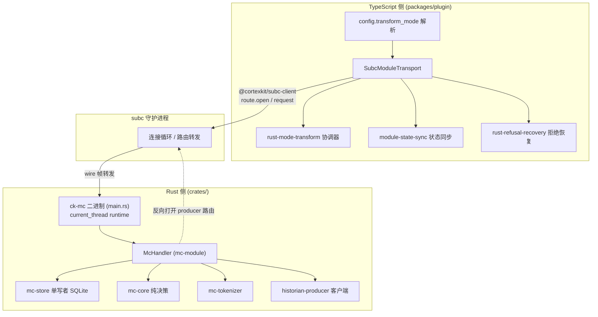
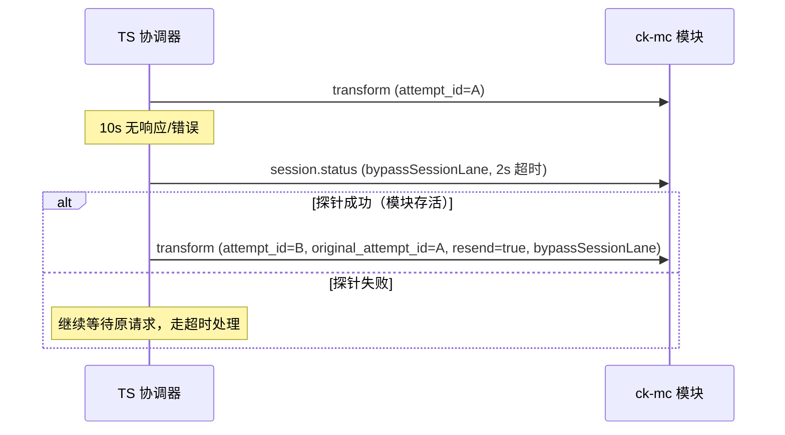

本页聚焦 Magic Context 的 **双运行时（dual-runtime）** 架构：默认的 TypeScript 变换管道，以及由 `transform_mode: "rust"` 开启的实验性 Rust 运行时。Rust 运行时把整个变换管线迁移到 `crates/` Rust 工作区实现的 `ck-mc` 模块中，由 subc（subconscious）守护进程以受监督模块（supervised module）的形式托管，两侧通过 `@cortexkit/subc-client`（TS）与 wire 协议（Rust）通信。本页只讨论运行时模式选择、模块进程生命周期、传输层、线协议分派与容错回退这些**集成面**；纯变换算法、历史压缩、记忆检索等内容属于相邻页面。

## 双运行时模式：`ts` 与 `rust` 的选择契约

配置项 `transform_mode` 是一个字符串枚举，取值为 `"ts"`（默认，当前 TypeScript 管道）或 `"rust"`（实验性，把整个项目运行时路由到 `ck-mc` Rust 模块），Schema 明确标注其依赖**用户级 `subc` 配置**。这一约束并非仅存在于文档，而是被解析逻辑强制执行：`resolveTransformMode` 接收 `configured`、`userTierHasSubc`、`compactionEnabled` 三个输入，只有当配置为 `rust`、用户层存在 `subc.connection_file`、且压缩功能已开启时才保留 `rust`；否则降级为 `ts` 并附带冻结的启动警告。值得注意的是，`transform_mode` 被有意允许在**项目层**配置（以便某个仓库自行选择运行时），但 `subc` 路由块会被 project-security 层剥离，因此项目无法伪造用户级凭据。

| 输入条件 | 解析结果 | 附加警告 |
|---|---|---|
| `configured="ts"` | `ts` | 无 |
| `configured="rust"` 且 `compactionEnabled=false` | `ts` | compaction-off 模式不支持 rust |
| `configured="rust"` 且无用户级 subc | `ts` | rust 模式需要用户级 subc 配置 |
| `configured="rust"` 且压缩开启且有用户级 subc | `rust` | 无 |

Sources: [magic-context.schema.json](assets/magic-context.schema.json#L36-L44), [transform-mode.ts](packages/plugin/src/config/transform-mode.ts#L1-L35), [index.ts](packages/plugin/src/config/index.ts#L566-L572), [index.ts](packages/plugin/src/config/index.ts#L766-L772)

运行时模式的解析发生在配置装载的收尾阶段，解析结果直接写回 `config.transform_mode`，并把降级警告追加到统一的 `configWarnings` 通道，最终以 `[config] ...` 前缀呈现给用户。这意味着「配置为 rust 但实际运行 ts」这一状态是**可观测的**，而不是静默失败。

Sources: [index.ts](packages/plugin/src/config/index.ts#L766-L778)

## Rust 工作区与模块拓扑

Rust 侧是一个与 bun `packages/` 并存的独立 Cargo 工作区，根 `Cargo.toml` 以注释形式说明了这种共存的理由：构建需要本仓库的缓存稳定性上下文，而会话/工具链绑定在 cwd。工作区成员由四个 crate 组成，各自职责边界清晰：`mc-core` 是**无 I/O 的纯决策层**（`CkItem` trait、`classify` 函数、cache-core 类型再导出），`mc-store` 是**单写者 SQLite 状态存储**（通过 epoch-fenced 事务 + `row_version` CAS 保证并发安全），`mc-tokenizer` 是 Claude BPE 分词器（用于 HARD 重新物化时的确定性 token 计数），而 `mc-module` 是 subc 协议适配器本身。

| Crate | 职责 | 关键不变量 |
|---|---|---|
| `mc-core` | 纯决策层：分类、冻结单元 | 无渲染、无 I/O |
| `mc-store` | 持久化 `CoreState` + `module_meta` | epoch 栅栏 + `row_version` CAS，纯 SoftPlus 重放不写库 |
| `mc-tokenizer` | Claude BPE 估算 `estimate_tokens` | 词表 vendored 冻结，跨运行字节一致 |
| `mc-module` | subc 协议处理、变换、历史学家协调 | 单写者 store、路由 epoch 校验 |

`mc-module` 的关键依赖全部指向兄弟仓库的路径依赖（`cortexkit-cache-core`、`cortexkit-store`、`subc-protocol`、`subc-client-rs` 等），刻意使用 path-deps 以便本地共同开发，同时避免 `[patch]` 带来的传递依赖分裂。

Sources: [Cargo.toml](Cargo.toml#L1-L40), [lib.rs](crates/mc-core/src/lib.rs#L1-L21), [lib.rs](crates/mc-store/src/lib.rs#L1-L16), [lib.rs](crates/mc-tokenizer/src/lib.rs#L1-L21), [STRUCTURE.md](STRUCTURE.md#L102-L108)

## 模块入口与握手生命周期

`ck-mc` 的入口极其精简：`main.rs` 强制 `#![forbid(unsafe_code)]`，先用一个**无副作用**的单行 `--version` 短路（便于监督者与测试基座在无连接文件时探测二进制），随后从 `SUBC_MODULE_ID_ENV` 读取模块 id（空则回退到 `DEFAULT_MODULE_ID = "magic-context"`），解析 `--subc <connection-file>` 参数，最后调用 `subc_client_rs::serve_with` 承担全部握手职责——读取连接文件、认证、发送 HELLO{manifest}、等待 HELLO_ACK、再把路由数据请求分派给 handler。二进制名与 crate/module id 的差异是刻意的：被监督的二进制统一使用 `ck-*` 前缀以便在活动监视器中归组，而 crate 名保持 `mc-module`、module_id 保持 `magic-context`。

Sources: [main.rs](crates/mc-module/src/main.rs#L1-L51), [Cargo.toml](crates/mc-module/Cargo.toml#L1-L24)

模块的运行时是 `#[tokio::main(flavor = "current_thread")]`——单线程 reactor，这一点在传输开销分析中被明确指出：SDK 的 64 个 handler permit 在此运行时上并不提供并行性，一次模块 pass 会占用约 179–210ms。

Sources: [main.rs](crates/mc-module/src/main.rs#L14-L15), [rust-mode-transport-overhead-2026-08-10.md](docs/rust-mode-transport-overhead-2026-08-10.md#L120-L140)

`McHandler` 实现 `ModuleHandler` trait，其三个生命周期钩子构成了状态管理的骨架。`on_hello_ack` 是**唯一**的存储打开时机——路径直到 ACK 才可知，且打开被 `tokio::spawn` 到请求通道之外，以免前任进程的单写者租约阻塞变换分派。`on_bind` 记录路由的 `{project_root, session}`，并**接受所有路由**（此处的关注点是项目解析而非授权），同时从 `effective_config` 解析配置。`on_route_gone` 则在 teardown 时解除绑定，避免复用 channel 解析到过期的项目或导致映射泄漏。

Sources: [lib.rs](crates/mc-module/src/lib.rs#L13080-L13124), [lib.rs](crates/mc-module/src/lib.rs#L3913-L3943)

存储打开路径本身也有明确的容错设计：`run_store_open` 先尝试打开，若失败且错误属于「活租约」（前任仍在运行）则进入 `STORE_OPEN_WAITING` 状态，按 `STORE_LEASE_WAIT_WINDOW` 有界等待前任退出；非租约错误则打印并回到 idle。`health()` 钩子在此等待期间返回 `waiting_report`，且**只触碰原子量**——因为 SDK 在独立的 channel-0 健康任务上调用它，不能触碰 store 或 handler 锁。

Sources: [lib.rs](crates/mc-module/src/lib.rs#L3945-L3980), [lib.rs](crates/mc-module/src/lib.rs#L13089-L13097)

## 模块清单与能力声明

`manifest(module_id)` 通过 subc-protocol 的**构建器**（而非结构体字面量）构造，因为 `ModuleManifest` 被标注为 `#[non_exhaustive]`，构建器是唯一能在新增字段落地后依然存活的构造路径。清单声明了若干关键能力：`trust_tier(Some(FirstParty))`（本模块为第一方）、`protocol_ver(PROTOCOL_VERSION)`、空的 `self_signals` 注册表（表示「已检查，无信号」而非「从未检查」，这是 falsy-value 区分规则）、以及从 `MC_BUILD_SHA` 编译期戳记派生的 `provenance`。

`provenance` 的处理体现了「部署标记而非承重能力」的定位：subc-protocol 0.17 要求完整的小写 40 位十六进制，`rev-parse --short` 这类短戳会失败；此时模块**降级为省略字段而非在启动时 panic**——因为部署校验会 grep 该标记并在缺失时大声失败，这才是格式错误戳记的正确失败面。

Sources: [lib.rs](crates/mc-module/src/lib.rs#L17093-L17152)

清单的 `provides` 声明了一个 `ToolProvider` 角色，其工具列表来自 `prompt_surface::module_tools`，`identity_scope` 为 `[Project, Session]`，`concurrency` 为 `Concurrency::ModuleManaged`——后者给每条路由 32 个 daemon 流信用额度，是「每路由」而非「模块全局」的执行限制。`consumes` 声明了指向 `thalamus` 的 `ServiceClient` 角色。

Sources: [lib.rs](crates/mc-module/src/lib.rs#L17141-L17151), [prompt_surface.rs](crates/mc-module/src/prompt_surface.rs#L145-L200), [rust-mode-transport-overhead-2026-08-10.md](docs/rust-mode-transport-overhead-2026-08-10.md#L135-L140)

## 传输层：SubcModuleTransport 的路由、车道与代际

TS 侧的一切模块调用都汇聚到 `SubcModuleTransport`。它在构造时是可惰性的——只记录 `connectionFile`、`moduleId`（默认 `"magic-context"`）、请求超时与路由 session 前缀，「只有在标记真正需要 drain 时才连接」。默认连接文件解析为 `join(getDataDir(), "cortexkit", "run", "subc-connection.json")`，即平台 run 目录下的守护进程连接文件。

Sources: [module-transport.ts](packages/plugin/src/hooks/magic-context/module-transport.ts#L26-L76), [hook.ts](packages/plugin/src/hooks/magic-context/hook.ts#L794-L802)

连接管理由三组不变量支配。其一是**代际（generation）**：每次 `invalidateConnection` 递增 `connectionGeneration`、清空路由缓存与 route-openings 并关闭客户端，任何携带旧代际的响应都会被拒绝（`connectionChangedError`，code `ECONNRESET`）。其二是**指数退避**：连接失败后 `nextProbeMs` 按 1s→2s→…→30s 递增，但一个 pass 最多在 12s（`CONNECT_BACKOFF_WAIT_BUDGET_MS`）的退避余量内等待，且等待是 pass 作用域的（只持有调用 session 的串行车道，非全局锁），并加入最多 100ms 抖动以避免并发等待者同时冲击守护进程。其三是**每会话正确性车道**：`acquireCorrectnessLane` 保证同一 session 内请求保序，而独立 session 可以重叠；总等待者上限 16、每会话上限 8，剩余预算低于 25ms 直接拒绝。

Sources: [module-transport.ts](packages/plugin/src/hooks/magic-context/module-transport.ts#L1038-L1102), [module-transport.ts](packages/plugin/src/hooks/magic-context/module-transport.ts#L403-L456)

`call()` 的每次调用被拆成六个可观测阶段写入 `ModuleCallTimings`：`lane`（车道排队）、`route`（路由确保）、`encode`（JSON 编码）、`issue`（请求发送）、`responseWait`（等待响应）、`settle`（结算）。这组计时正是传输开销归因分析的数据基础。每次调用最多尝试两次：连接类失败时丢弃路由并失效连接，第二次在全新连接代际上重试，再失败才交由调用方进入 LKG/raw 回退阶梯；若 `generationSensitive` 为真，则直接返回 `connection_generation_changed` 结构性结果而不重试。

Sources: [module-transport.ts](packages/plugin/src/hooks/magic-context/module-transport.ts#L458-L530), [module-transport.ts](packages/plugin/src/hooks/magic-context/module-transport.ts#L585-L704), [module-transport.ts](packages/plugin/src/hooks/magic-context/module-transport.ts#L638-L683)

路由的确保（`ensureRoute`）解决了一个具体的命名空间问题：变换车道与工具车道可能通过符号链接以不同拼写观察同一目录，而模块在**它自己的文件系统**上做规范化（无法看到本进程的挂载/符号链接视图）。因此传输层先用 `realpathSync.native` 收敛根路径，并以 `${sessionId}\0${projectRoot}` 作为路由键；一个身份合法地拥有多个文件系统根（如 worktree），跨根复用会绑定错误的树。路由目标为 `{ kind: "tool_provider", module_id }`，绑定的身份携带 `project_root`、`harness` 与带前缀的 `session`。

Sources: [module-transport.ts](packages/plugin/src/hooks/magic-context/module-transport.ts#L906-L966), [module-transport.ts](packages/plugin/src/hooks/magic-context/module-transport.ts#L974-L996)

## 消费方身份隔离：`consumerIdentity: null`

这是集成层一个容易被忽略但安全关键的细节。`@cortexkit/subc-client` 的 `RouteOpenOptions.consumerIdentity` 是**可选**的：省略它时会触发回退——用非空的 `SUBC_MODULE_ID` + `SUBC_LAUNCH_NONCE` 推导路由打开时的消费方身份。也就是说，「省略」等于「选择加入环境继承」而非「选择退出」。Magic Context 的每个宿主/脚本路由打开点都显式固定 `consumerIdentity: null`，因为继承来的 `SUBC_*` 凭据标识的是一个受守护进程监督的模块，而不是这个独立宿主。

| 调用点 | 场景 | 处理方式 |
|---|---|---|
| `module-transport.ts` | 插件宿主（OpenCode） | 包装器接受 `Omit<RouteOpenOptions, "consumerIdentity">` 并钉死 `null` |
| `probe-subc-transport.ts` | 传输探针脚本 | 直接传 `null` |
| `drive-preseed.ts` | 维护脚本 | 直接传 `null` |
| `hermetic-subc.ts` | 密封测试宿主状态客户端 | 包装器钉死 `null` |
| `historian_producer.rs` | Rust 反向打开 producer 路由 | **刻意**从 `SUBC_MODULE_ID`/`SUBC_LAUNCH_NONCE` 派生身份 |

这种不对称是正确的：`ck-mc` 在反向方向（打开 provider 管理面路由以调用历史学家 producer）上**确实**是被监督的模块，因此 `consumer_identity_from_env()` 从环境派生身份是恰当的。TS 侧的包装器通过类型签名 `Omit<..., "consumerIdentity">` 让普通调用者无法经由 options 参数重新引入该字段。

Sources: [github-384-subc-consumer-identity.md](docs/reports/github-384-subc-consumer-identity.md#L1-L30), [module-transport.ts](packages/plugin/src/hooks/magic-context/module-transport.ts#L154-L165), [historian_producer.rs](crates/mc-module/src/historian_producer.rs#L846-L866), [historian_producer.rs](crates/mc-module/src/historian_producer.rs#L1271-L1274)

## 线协议分派与 CK 线格式

模块的请求入口 `McHandler::handle` 极为统一：先执行请求字节上限检查（`enforce_request_byte_cap`），把 body 解析为 `serde_json::Value`，再交给 `dispatch_value_with_inbound_bytes` 按 `method`（或回退的 `kind`）字段分派。分派臂覆盖了变换、状态同步、状态导入、权威（authority）、镜像（mirror）、引导（guidance）、清单、梦呓（dreamer）、工具门面（facade）、会话（status/wrapup/delete/flush/recomp）等完整方法集合。

Sources: [lib.rs](crates/mc-module/src/lib.rs#L13126-L13137), [lib.rs](crates/mc-module/src/lib.rs#L13150-L13221)

未知形状的请求**不会**被静默吞掉：若 body 具有 `{name, arguments}` 形态（MCP tools/call 信封）但名称不受门面支持，返回 `facade_envelope_not_supported`；否则返回 `unrecognized_request_shape` 并列出实际收到的顶层键名，使误路由可从错误码与键名单独诊断。显式回显仅在 opt-in 的 `echo` 方法上提供。

Sources: [lib.rs](crates/mc-module/src/lib.rs#L13209-L13285)

线格式层面，`ck_wire` 模块拥有「CK 消息 ↔ 块粒度投影」的接缝：它解析带类型的 CK 核心，把每个内容块摊平为会话稳定的 `mid#block_index` 项，同时保留原始消息对象，以便未缩减的响应无需重建即可原样回传。值得强调的是，CK 消息/块的序列化器**保留原始 `serde_json::Value` 作为透传路径**，而绝不走类型化结构体的往返，以免未来无害的 CK 字段被静默丢弃。

Sources: [ck_wire.rs](crates/mc-module/src/ck_wire.rs#L1-L40), [codec/mod.rs](crates/mc-module/src/codec/mod.rs#L1-L12)

harness 特定的 JSON 由 codec 层翻译：`codec/opencode.rs` 与 `codec/pi.rs` 分别实现 OpenCode 与 Pi 的解码/编码，`codec/sidecar.rs` 处理旁挂解码。这一层是把 harness 方言归一化为 `CkWireMessage` 的边界。

Sources: [codec/mod.rs](crates/mc-module/src/codec/mod.rs#L1-L12), [STRUCTURE.md](STRUCTURE.md#L251-L252)

## 状态同步、权威迁移与镜像

Rust 模式的第一道工序是**状态同步**：`syncModuleState` 把宿主（TS SQLite）的持久化状态（记忆、提交、标签、标记）推送到 subc 侧的 Rust 存储。能力探测通过一次 `session.status` 请求完成，其结果（`state_sync_deltas`、`state_sync_resume`）被缓存在带代际的 `stateSyncCapabilityCache` 中，并在模块可能改变线能力时通过 `invalidateStateSyncCapabilities` 失效。

Sources: [module-transport.ts](packages/plugin/src/hooks/magic-context/module-transport.ts#L252-L292), [module-state-sync.ts](packages/plugin/src/hooks/magic-context/module-state-sync.ts#L1931-L2030)

比状态同步更重的是**权威迁移（authority）**：为了让 Rust 模块成为记忆/笔记域的真正写者，系统定义了四态权威模型 `TS → PREPARING → MODULE → DRAINING`。`authority.prepare` 先计算种子行的校验和并建立权威标记，`authority.drain.*` 系列（seed/memories/notes/compartments/reconcile/verify/flip/finish）则负责把数据分页迁移到模块并最终翻转权威。当权威处于 `MODULE` 时，TS 侧的 sender 只镜像、不再写入记忆数据。

Sources: [context-authority.ts](packages/plugin/src/features/magic-context/context-authority.ts#L7-L9), [lib.rs](crates/mc-module/src/lib.rs#L13165-L13184), [module-state-sync.ts](packages/plugin/src/hooks/magic-context/module-state-sync.ts#L204-L211)

镜像（mirror）是反向的同步通道：`mirror.pull` 拉取模块侧的 changefeed 分页，`mirror.memory` 拉取单条记忆行并在宿主侧应用，`memory.identity.ack` 回执身份映射。`drainMirrorPages` 以 1000 行/页的预算推进这些通道。

Sources: [hook.ts](packages/plugin/src/hooks/magic-context/hook.ts#L873-L899), [lib.rs](crates/mc-module/src/lib.rs#L13179-L13181)

## 分页变换与冷启动执行

变换请求本身可能是**分页**的。TS 侧 `sendTransformSeries` 先用 `buildPagedModuleTransformPayloads` 把 payload 切页；如果任何一页带有 `transform_page_id`，就进入分页系列。模块侧的 `TransformPageCoordinator` 为每个 session 维护一个 in-flight attempt，并对暂存字节与 pending 变换数设上限；分页阶段有 `AttemptMismatch`、`DigestMismatch`、`OrderMismatch`、`BufferOverflow`、`InProgress` 五类错误，每一类都对应 TS 侧的系列重启决策。

Sources: [rust-mode-transform.ts](packages/plugin/src/hooks/magic-context/rust-mode-transform.ts#L3005-L3127), [lib.rs](crates/mc-module/src/lib.rs#L1162-L1256)

超时预算按页类型分层：非分页单页为默认 `timeoutMs`；`transform_page_upload` 页为 5s（`TRANSFORM_PAGE_UPLOAD_TIMEOUT_MS`）；最后一张 `transform_series_execute`（完成页，触发冷启动执行）使用 `transformColdStartExecuteTimeoutMs(seedMessageCount)`——15s 基准 + 每消息 2ms，上限 90s（TS 侧）或 120s（模块侧注释所述）。冷启动执行必须在模块侧做完整投影与原生编码，因此其预算随种子规模线性增长。

Sources: [rust-mode-transform.ts](packages/plugin/src/hooks/magic-context/rust-mode-transform.ts#L3031-L3062), [module-transport.ts](packages/plugin/src/hooks/magic-context/module-transport.ts#L43-L64)

每个请求携带一个 `attempt_id`（截断至 128 字符）。模块据此把接收事件记录进 `mc_pass_trace` 的 `trace_pass_received`，完成时写 `trace_pass_completed`，使「接收/完成/拒绝」事件与缓存状态分离、可审计。

Sources: [lib.rs](crates/mc-module/src/lib.rs#L8870-L8874), [lib.rs](crates/mc-module/src/lib.rs#L8983-L8983), [lib.rs](crates/mc-module/src/lib.rs#L9575-L9575), [lib.rs](crates/mc-store/src/lib.rs#L8301-L8340)

分页系列遇到连接代际变化或 attempt 不匹配时，TS 侧只允许**一次重启**（`sendTransformSeriesWithSingleRestart`），第二次仍失败则抛错进入回退阶梯。对「最后一张完成页」的请求超时是特例：注释明确说明模块可能仍在完成冷启动执行，因此**保留活路由、绝不把超时转成代际变化/重上传循环**。

Sources: [rust-mode-transform.ts](packages/plugin/src/hooks/magic-context/rust-mode-transform.ts#L3103-L3127), [module-transport.ts](packages/plugin/src/hooks/magic-context/module-transport.ts#L655-L663)

## 静默重发与健康探针

协调器还实现了**静默重发（silent resend）**：`callTransformWithSilentResend` 先发起原始请求；若在 `RUST_SILENT_RESEND_AFTER_MS`（10s）内既无响应也无错误，则用 `bypassSessionLane: true` 发一个健康探针（`session.status`，2s 超时）。只有探针**成功**（证明模块存活、请求可能已丢失）才发起内容寻址的重发，附上 `original_attempt_id` 与 `resend: true`；探针失败则继续等待原请求，让正常的超时处理决定拒绝或回退。

Sources: [rust-mode-transform.ts](packages/plugin/src/hooks/magic-context/rust-mode-transform.ts#L1775-L1850), [rust-mode-transform.ts](packages/plugin/src/hooks/magic-context/rust-mode-transform.ts#L159-L166)

## LKG 回退阶梯与拒绝恢复

当模块失效时，协调器进入三级回退阶梯。第一级是 **LKG（Last Known Good）重放**：`replayLastGood` 从会话槽取上次被接受的捕获，校验紧急恢复未武装、溢出状态不需要紧急恢复、入口快照仍有效、模型键匹配、重放消息未超可信上下文上限，全部通过才把 `output.messages` 替换为重放消息，并返回 `lkg_replay_served`。重放成功后冻结该回退表示（`lkgRepresentationFrozen`），以便在多次 defer 恢复之间保持字节一致，避免每个小抖动都造成缓存双重失效。

Sources: [rust-mode-transform.ts](packages/plugin/src/hooks/magic-context/rust-mode-transform.ts#L1887-L1990), [ARCHITECTURE.md](ARCHITECTURE.md#L16)

第二级是 **raw 回退**：若 LKG 不可用，`serveRawFallback` 提供未变换的原始历史（受 `rawFallbackEstimator` 估算的上下文上限约束），并将 `servedFrom` 记为 `raw`。

Sources: [rust-mode-transform.ts](packages/plugin/src/hooks/magic-context/rust-mode-transform.ts#L3883-L3901), [rust-mode-transform.ts](packages/plugin/src/hooks/magic-context/rust-mode-transform.ts#L2219-L2249)

第三级是**紧急关闭（emergency fail-closed）**：在可信上限的 95%（`RUST_EMERGENCY_WALL_PCT`）或 provider 溢出恢复已武装时，任何适配器失败都会**在 LKG 之前中止**（`mc_rust_emergency_refusal before_lkg`），并武装拒绝恢复，抛出 `EmergencyFailClosedError`。连续失败达到阈值（`RUST_FAILURE_PARK_THRESHOLD = 3`）会让会话进入 **parked** 状态，按 `RUST_PARK_RETRY_INTERVAL = 5` 的节奏重试并只发送一次警告。注意：parking 控制的是**重试节奏而非回退准入**——紧急路径即便处于 parked 也会拒绝。

Sources: [rust-mode-transform.ts](packages/plugin/src/hooks/magic-context/rust-mode-transform.ts#L160-L166), [rust-mode-transform.ts](packages/plugin/src/hooks/magic-context/rust-mode-transform.ts#L3828-L3902), [rust-mode-transform.ts](packages/plugin/src/hooks/magic-context/rust-mode-transform.ts#L1852-L1869)

拒绝后，`createRustRefusalRecovery` 武装一个轮询监视器：以 2s 节奏（`RUST_REFUSAL_RECOVERY_POLL_MS`）、最多 5 分钟（`RUST_REFUSAL_RECOVERY_MAX_MS`）用 `bypassSessionLane` 的 `session.status` 探针检测模块是否恢复健康。健康后它读取持久化历史，判定被拒绝的那一步是否仍是「未完成的助手子节点」——若历史已推进越过该步则取消；否则投递一条合成的 continue 用户消息（`RUST_REFUSAL_RECOVERY_PROMPT`）恢复该轮。压制条件明确：compaction-off 或 provider 已证明的紧急状态都使武装短路。

Sources: [rust-refusal-recovery.ts](packages/plugin/src/hooks/magic-context/rust-refusal-recovery.ts#L7-L11), [rust-refusal-recovery.ts](packages/plugin/src/hooks/magic-context/rust-refusal-recovery.ts#L89-L151), [rust-refusal-recovery.ts](packages/plugin/src/hooks/magic-context/rust-refusal-recovery.ts#L153-L177)

## 传输开销特征

一份基于实测的归因报告澄清了一个关键误解：插件侧的 `module` 字段只统计 `TransformTimings.total`（计时从 `apply_once` 开始、在大量 handler 工作之前结束），因此「`transport - module` 约 151ms 的差值**并非** socket 或中继开销」。p50 分解显示该差值约 73% 是可归因但被错误归类的工作：原生响应附加 100.1ms、历史学家触发 8.5ms、响应 JSON 编码 2.0ms，中位仅剩 40.5ms 属于模块入口/前奏、队列驻留与四条 socket/中继腿。

Sources: [rust-mode-transport-overhead-2026-08-10.md](docs/rust-mode-transport-overhead-2026-08-10.md#L1-L30)

| 组件 | p50 | p95 | 是否计入插件 `module` |
|---|---:|---:|---|
| 核心变换 `timings.total` | 75.0 ms | 86.7 ms | 是 |
| 历史学家触发工作 | 8.5 ms | 10.2 ms | 否 |
| 原生响应附加 | **100.1 ms** | **111.1 ms** | 否 |
| 响应 JSON 编码/拼接 | 2.0 ms | 2.4 ms | 否 |
| 已知模块工作 | **185.4 ms** | **210.3 ms** | 仅第一行 |
| 插件 `rust.transport` | 228.1 ms | 432.6 ms | 整个调用 |

独立探针证实传输本身**没有固定地板**：空闲的 client → daemon → module echo → daemon → client 全路径在 1–32 KiB 负载下 p50 仅 0.28–0.38ms；Nagle/延迟 ACK 特征缺失（p50 在 8 KiB 边界处平坦，无约 40ms 量化）。因此报告明确拒绝把该事件归因于 Nagle。

Sources: [rust-mode-transport-overhead-2026-08-10.md](docs/rust-mode-transport-overhead-2026-08-10.md#L14-L16), [rust-mode-transport-overhead-2026-08-10.md](docs/rust-mode-transport-overhead-2026-08-10.md#L44-L70)

报告也对 `state_sync` 尖峰给出结论：`syncModuleState` 每次调用都把 `stateSyncDeltas` 初始化为局部变量，且调用方未提供缓存能力，于是每个 pass 都先 await `stateSyncCapabilities`——这是一次经全局 FIFO 的只读 `session.status` 请求。在空闲时其线耗时 <1ms，但它引入了可能继承前一个调用整个服务时长的 await，从而在负载下的 OpenCode 事件循环中放大了 71–177ms 的停顿。

Sources: [rust-mode-transport-overhead-2026-08-10.md](docs/rust-mode-transport-overhead-2026-08-10.md#L160-L170)

## 集成要点回顾

Rust 运行时并非对 TS 管道的简单替换，而是一次**运行时归属转移**：变换、状态存储、历史学家协调全部下沉到 `ck-mc` 模块，TS 侧退化为负责状态同步、序号跟踪与容错回退的协调者。这种分层带来的具体约束包括：`current_thread` 运行时下无 handler 并行、单写者 store 的租约等待窗口、分页系列的一次性重启、以及在紧急路径上「parking 控制节奏而非准入」的明确边界。安全面上，宿主与脚本一律钉死 `consumerIdentity: null`，而受监督的 Rust 模块反向派生身份——这条不对称规则是集成契约的一部分，而非偶然。

Sources: [ARCHITECTURE.md](ARCHITECTURE.md#L15-L16), [ARCHITECTURE.md](ARCHITECTURE.md#L30), [github-384-subc-consumer-identity.md](docs/reports/github-384-subc-consumer-identity.md#L30-L34)

### 下一步阅读

- 变换管道本身的阶段与缓存布局：[转换通道生命周期与阶段划分](9-zhuan-huan-tong-dao-sheng-ming-zhou-qi-yu-jie-duan-hua-fen)、[m[0]/m[1] 缓存布局与物化触发条件](10-m-0-m-1-huan-cun-bu-ju-yu-wu-hua-hong-fa-tiao-jian)
- Rust 三核心 crate 的算法细节：[Rust 核心：分类器·存储·分词器](29-rust-he-xin-fen-lei-qi-cun-chu-fen-ci-qi)
- 模块暴露的 `ctx_*` 工具面：[ctx_* 代理工具集](26-ctx_-dai-li-gong-ju-ji)
- 宿主适配与对等实现：[OpenCode 1 与 OpenCode 2 适配层](23-opencode-1-yu-opencode-2-gua-pei-ceng)、[Pi / OMP 插件与跨宿主对等实现](24-pi-omp-cha-jian-yu-kua-su-zhu-dui-deng-shi-xian)
- 端到端与宿主测试矩阵：[端到端测试与宿主测试矩阵](30-duan-dao-duan-ce-shi-yu-su-zhu-ce-shi-ju-zhen)