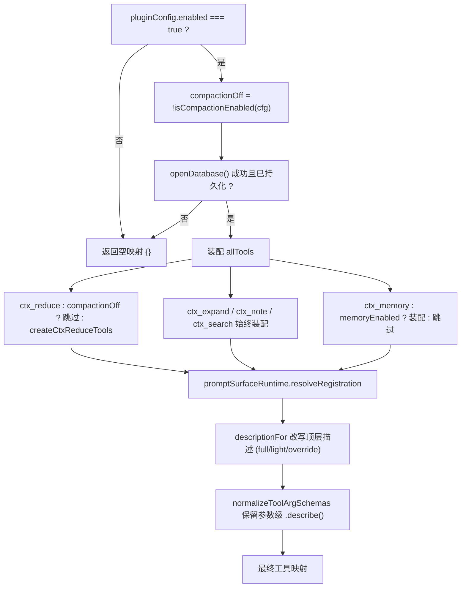
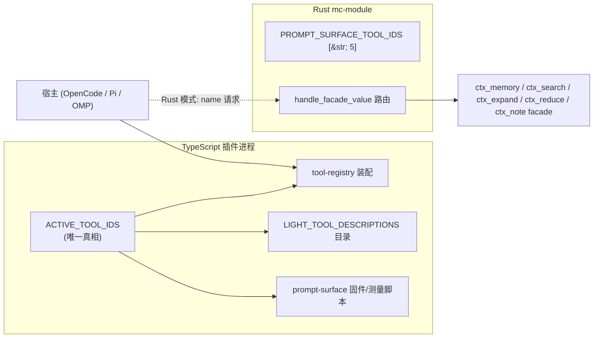
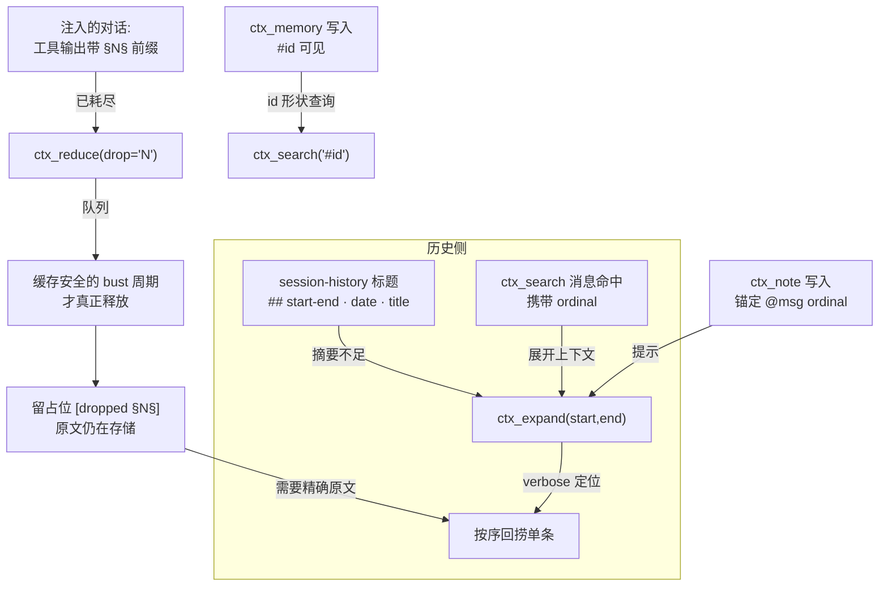

Magic Context 通过一组以 `ctx_` 为前缀的**代理工具（agent tools）**把上下文管理、跨会话记忆与历史召回的能力直接交到模型手中。这五个工具——`ctx_reduce`、`ctx_expand`、`ctx_note`、`ctx_memory`、`ctx_search`——是整个系统的"人机接口"：自动化的 historian / dreamer 在后台维护上下文与知识，而 `ctx_*` 工具让代理在会话中主动表达意图（丢弃已耗尽的输出、回捞精确原文、记录延后事项、写入持久知识、检索不可见历史）。

本页聚焦工具本身：它们如何被**单一注册点**收敛、各自的**参数契约**、**门控与拒绝语义**、**跨宿主 / Rust 模式的路由**，以及五个工具如何围绕 `§N§` 标签与消息序号（ordinal）形成一个**恢复闭环**。检索算法与嵌入管线的内部实现属于 [统一搜索与嵌入管线](17-tong-sou-suo-yu-qian-ru-guan-xian)，工具产出的记忆/笔记存储结构属于 [项目记忆体系与五类知识分类法](16-xiang-mu-ji-yi-ti-xi-yu-wu-lei-zhi-shi-fen-lei-fa)。

Sources: [ARCHITECTURE.md](ARCHITECTURE.md#L24), [README.md](README.md#L284-L292), [tool-registry.ts](packages/plugin/src/plugin/tool-registry.ts#L55-L61)

## 工具集总览与职责划分

五个工具按**运行时表面**可归为三类。`ctx_reduce` 属于**上下文窗口管理**面，是唯一会改变已发出字节的工具；其余四个属于**知识表面**，即使关闭上下文管理（compaction-off）也仍然可用。`ctx_memory` 与 `ctx_note` 是**写入型**（capture），`ctx_search` 与 `ctx_expand` 是**读取型**（recall）。

| 工具 | 表面类别 | 方向 | 一句话职责 | 关键参数 | 定义文件 |
|---|---|---|---|---|---|
| `ctx_reduce` | Context | 写（队列） | 把已耗尽的 `§N§` 标签内容标记为可回收 | `drop` | [constants.ts](packages/plugin/src/tools/ctx-reduce/constants.ts#L1) |
| `ctx_expand` | Recall | 读 | 从压缩历史中按要求回捞原始转录 / 单条消息 | `start` / `end` / `message` / `verbose` | [constants.ts](packages/plugin/src/tools/ctx-expand/constants.ts#L1) |
| `ctx_note` | Recall | 写 + 读 | 会话工作笔记与"智能笔记"（带外部可验证条件） | `action` / `content` / `surface_condition` / `note_ids` | [constants.ts](packages/plugin/src/tools/ctx-note/constants.ts#L1) |
| `ctx_memory` | Capture | 写 + 读 | 跨会话持久的项目知识（五类分类法） | `action` / `content` / `category` / `ids` | [constants.ts](packages/plugin/src/tools/ctx-memory/constants.ts#L1) |
| `ctx_search` | Recall | 读 | 统一检索记忆、消息历史、Git 提交、笔记、Primer | `query` / `limit` / `sources` | [constants.ts](packages/plugin/src/tools/ctx-search/constants.ts#L1) |

工具的**工具名即契约**：`ctx_search`、`ctx_memory` 通过常量（`CTX_SEARCH_TOOL_NAME`、`CTX_MEMORY_TOOL_NAME`）声明，`ctx_reduce`、`ctx_expand`、`ctx_note` 则在各自工厂返回的对象字面量中直接以字符串键注册。每个工具目录都导出一个 `createCtx*Tools(deps)` 工厂，返回 `Record<string, ToolDefinition>`，这一统一外形是单点注册与测试差分的基础。

Sources: [ctx-search/constants.ts](packages/plugin/src/tools/ctx-search/constants.ts#L1-L21), [ctx-memory/constants.ts](packages/plugin/src/tools/ctx-memory/constants.ts#L1-L2), [ctx-reduce/tools.ts](packages/plugin/src/tools/ctx-reduce/tools.ts#L281-L285), [ctx-expand/tools.ts](packages/plugin/src/tools/ctx-expand/tools.ts#L137-L141), [ctx-note/tools.ts](packages/plugin/src/tools/ctx-note/tools.ts#L561-L565)

## 架构定位：单点注册与四级门控

所有 `ctx_*` 工具都从**一个注册点** `createToolRegistry()` 汇出。该函数返回 `Record<string, ToolDefinition>`，是宿主（OpenCode）在插件进程内一次性物化的工具映射。收敛到单点的设计意图很明确：门控逻辑、提示表面（prompt surface）改写、参数模式补丁都只需在此实现一次，任何新增工具都无法"静默"绕过这些集成点。

下图说明从配置到最终工具映射的装配顺序。左列是**否决式门控**（任一为真即空手返回），中列是**工厂装配**，右列是**后处理**。

四道门控的具体语义如下。

第一道是**总开关**：`pluginConfig.enabled !== true` 时直接返回 `{}`。第二道是**模式门控**：`compactionOff`（由 `isCompactionEnabled()` 解析 `compaction.enabled`）为真时，注册表**完全跳过** `createCtxReduceTools` 工厂，而不是事后过滤——`COMPACTION_OFF_REMOVED_TOOL_IDS` 精确枚举了被移除的 id（`["ctx_reduce"]`），并被导出供验收测试做集合差分，从而保证"工厂未来新增的 id"会显式地出现在差分里而非悄悄消失。第三道是**存储健康门控**：`openDatabase()` 抛错或返回未持久化的句柄（schema fence、不可写路径、ABI 不匹配）时，注册表打印警告并返回 `{}`——绝不暴露 `ctx_*` 工具，避免静默降级。第四道是**记忆门控**：`memory.enabled === false` 时跳过 `ctx_memory`，因为 `<project-memory>` 块不再注入，写入的记忆将永远无法复现；但 `ctx_search` 保留（它仍能召回会话历史与 Git 提交）。

Sources: [tool-registry.ts](packages/plugin/src/plugin/tool-registry.ts#L42-L53), [tool-registry.ts](packages/plugin/src/plugin/tool-registry.ts#L64-L107), [tool-registry.ts](packages/plugin/src/plugin/tool-registry.ts#L127-L173), [agent-disable.ts](packages/plugin/src/config/agent-disable.ts#L28-L35)

装配完成后，注册表做两项后处理。其一，通过 `promptSurfaceRuntime.resolveRegistration()` 把每个工具的**顶层描述**替换为 full / light / 用户覆盖文本（见下一节）。其二，调用 `normalizeToolArgSchemas` 修补参数模式，使属性级的 `.describe()` 文本能在 JSON Schema 序列化中存活——否则模型只能看到裸类型、丢失每个参数的语义说明。`ctx_note` 的 `surface_condition`、`ctx_search` 的 `sources` 等长篇参数说明正是依赖这一步才最终抵达模型。

Sources: [tool-registry.ts](packages/plugin/src/plugin/tool-registry.ts#L175-L206)

值得一提的是工具工厂的**依赖注入**外形。`ctx_expand` 只依赖 `{ db }`；`ctx_search` 依赖 `{ db, resolveProjectPath, ensureProjectRegistered }`；`ctx_memory` 还额外接收 `allowedActions`、`rustToolBackends`；`ctx_note` 接收 `dreamerEnabled` 与 `rustToolBackends`；`ctx_reduce` 接收 `getProtectionWindow` 与 `rustToolBackends`。其中 `resolveProjectPath` 之所以是**函数**而非烘焙好的字符串，是因为 OpenCode 顶层的 `ctx.directory` 反映的是**启动目录**（例如从项目外执行 `opencode -s <id>` 时会落在 `$HOME`），而会话真实工作目录只在每次调用的 `toolContext.directory` 中暴露——工具必须在调用时解析项目身份，否则会写错项目。

Sources: [tool-registry.ts](packages/plugin/src/plugin/tool-registry.ts#L116-L121), [ctx-memory/types.ts](packages/plugin/src/tools/ctx-memory/types.ts#L40-L55), [ctx-search/types.ts](packages/plugin/src/tools/ctx-search/types.ts#L24-L38)

## 参数契约：五个工具的外形

每个工具的参数在 `execute()` 入口先经 `passthrough` 模式解析（允许旧调用者携带未声明的额外字段而不报错），再经填充容错处理（见后文），随后进入动作分发。下表汇总五个工具**暴露给模型**的参数。

| 工具 | 参数 | 类型 | 语义 |
|---|---|---|---|
| `ctx_reduce` | `drop` | string | 要丢弃的标签 id，支持区间与列表：`"3-5"`、`"1,2,9"`、`"1-5,8"` |
| `ctx_expand` | `start` / `end` | number | 包含端点（inclusive）的消息序号区间 |
| | `message` | number | 按序号回捞**单条**消息的完整未截断内容 |
| | `verbose` | boolean | 与 start/end 配合：逐条列出消息 + 每部分预览 |
| `ctx_note` | `action` | enum | `write` / `read` / `dismiss` / `update` |
| | `content` | string | 写入的笔记文本 |
| | `surface_condition` | string | 智能笔记的**外部可验证**条件 |
| | `filter` | enum | `all` / `active` / `pending` / `ready` / `dismissed` |
| | `limit` / `offset` | number | 读取分页（默认 25，最新优先） |
| | `note_ids` | number[] | `update` 恰一个；`dismiss` 1–50 个 |
| `ctx_memory` | `action` | enum | `write` / `archive` / `update` / `merge` / `get`（`list` 仅 dreamer） |
| | `content` | string | 记忆内容（`write`/`update`/`merge` 必需） |
| | `category` | string | 五类分类法之一（`write` 必需） |
| | `ids` | number[] | 各动作的 id 目标（`update` 一个、`archive` ≥1、`merge` ≥2、`get` 1–20） |
| | `reason` / `superseded_by` | string / number | `archive` 原因 / 被取代者的后继 id |
| `ctx_search` | `query` | string | 自然语言问句，仍应包含期望出现的精确词元 |
| | `limit` | number | 最大结果数（默认 10） |
| | `sources` | enum[] | 限定来源：`memory` / `message` / `git_commit` / `primer` / `note` |

参数校验刻意采用"**动作相关**"的懒校验而非模式级强约束。`ctx_memory` 的 `category`、`ids` 分别只在特定动作下才要求；`ctx_note` 的 `note_ids` 由 `parseNoteIds()` 按动作判定数量边界（`update` 恰好 1 个，`dismiss` 1–50 个），`write`/`read` 即使被模型填入占位值也会被忽略——因为"required-all"工具表面会迫使模型给**每个**声明属性填值（issue 460），对不使用的字段报错会误杀调用。

Sources: [ctx-reduce/tools.ts](packages/plugin/src/tools/ctx-reduce/tools.ts#L53-L58), [ctx-expand/tools.ts](packages/plugin/src/tools/ctx-expand/tools.ts#L17-L42), [ctx-note/tools.ts](packages/plugin/src/tools/ctx-note/tools.ts#L230-L299), [ctx-memory/types.ts](packages/plugin/src/tools/ctx-memory/types.ts#L22-L45), [ctx-memory/tools.ts](packages/plugin/src/tools/ctx-memory/tools.ts#L219), [ctx-search/tools.ts](packages/plugin/src/tools/ctx-search/tools.ts#L64-L78)

`ctx_memory` 的动作集合在代码中分为两层：**主代理可用集** `CTX_MEMORY_ACTIONS = ["write","archive","update","merge","get"]`，以及**dreamer 专用集** `CTX_MEMORY_DREAMER_ACTIONS`（追加 `list`）。工厂的 `getAllowedActions()` 采取**失败即最小权限**：当调用者省略 `allowedActions` 时回退到主代理集，而非 dreamer 全集，从而防止未来某个忘记传参的调用者意外放开批量枚举 `list`。`get` 动作的存在理由很具体——代理在各处都会拿到记忆 id（`<project-memory>` 的 `#id:` 行、仪表盘、引导文本），但此前没有任何主代理可用的动作能按 id 取回内容。

Sources: [ctx-memory/types.ts](packages/plugin/src/tools/ctx-memory/types.ts#L11-L27), [ctx-memory/tools.ts](packages/plugin/src/tools/ctx-memory/tools.ts#L86-L97), [ctx-memory/tools.ts](packages/plugin/src/tools/ctx-memory/tools.ts#L764-L785)

## 跨宿主一致性与 Rust 模式路由

工具 id 集合有**唯一权威来源**：`ACTIVE_TOOL_IDS`。这是一个 `as const` 元组，所有消费方（注册表、轻量描述目录、提示表面测量与固件脚本）都从它派生，从而"新增工具无法静默跳过某个提示表面集成点"。Rust 模块侧以 `PROMPT_SURFACE_TOOL_IDS: [&str; 5]` 镜像同一集合，并用 `is_known_tool_id()` 校验用户提供的描述覆盖 key。

**提示表面预设**决定工具顶层描述的详略。`resolvePromptSurface()` 用与 `cache_ttl` 共享的**渐进式模型键查找**（精确 `provider/model` → 裸模型 id → `provider/*` 通配 → 默认）解析每个模型应使用 `full` 还是 `light` 预设；随后 `resolveRegistration().descriptionFor()` 决定最终文本：用户级 `tool_descriptions` 覆盖优先，其次 light 预设取 `LIGHT_TOOL_DESCRIPTIONS` 对应项，否则回退到工厂内嵌的完整描述。宿主能力不同：OpenCode 1.x 与 Pi/OMP 每个进程只物化一次工具映射（因此只遵循**默认**预设），而 OpenCode 2 会按请求重写这五个 `ctx_*` 描述、从而能尊重按模型的 `models` 路由。

Sources: [prompt-surface-runtime.ts](packages/plugin/src/shared/prompt-surface-runtime.ts#L28-L51), [prompt-surface-runtime.ts](packages/plugin/src/shared/prompt-surface-runtime.ts#L188-L221), [prompt-surface.ts](packages/plugin/src/shared/prompt-surface.ts#L81-L117), [prompt-surface.ts](packages/plugin/src/shared/prompt-surface.ts#L141-L153), [magic-context.ts](packages/plugin/src/config/schema/magic-context.ts#L100-L118), [prompt_surface.rs](crates/mc-module/src/prompt_surface.rs#L48-L54)

`light` 表面不是自由改写，而是受**已批准的 token 预算上限**（1825 tokens）约束，且每条 checklist 规则都映射到轻量资产中的具名行——`docs/specs/prompt-surface/light-mapping.md` 逐条记录了这种映射（例如 `T-001..T-005 → tool:ctx_reduce → L-T-REDUCE`），从而保证压缩后的描述仍保留每条规则的**作用域、条件、机制与极性**。

Sources: [light-mapping.md](docs/specs/prompt-surface/light-mapping.md#L1-L47), [ARCHITECTURE.md](ARCHITECTURE.md#L140)

在 **Rust 模式**下，同一个 `ctx_*` 名字会经 `handle_facade_value()` 的 `name` 字段分发到模块内的 façade 处理器——`ctx_memory`、`ctx_search`、`ctx_expand`、`ctx_reduce`、`ctx_note` 各有独立的 `handle_ctx_*_facade`。这些 façade 直接读写模块自有的 SQLite 存储（而非宿主镜像），并把宿主 id 与模块 id 在边界处翻译。例如 `ctx_search` façade 会校验 `query` 非空并施加 `MAX_QUERY_BYTES` 上限、把 `limit` 夹到 `[1, 25]`（默认 8）、解析 `sources` 集合，再据序列化 profile 决定是否做宿主 id → 模块 id 映射。`ctx_reduce` 的 façade 还承担 `agent_drops.append` 的命令 id 幂等与服务器端区间规范化。

Sources: [lib.rs](crates/mc-module/src/lib.rs#L11498-L11519), [lib.rs](crates/mc-module/src/lib.rs#L11696-L11798), [lib.rs](crates/mc-module/src/lib.rs#L12294-L12340), [lib.rs](crates/mc-module/src/lib.rs#L12408), [lib.rs](crates/mc-module/src/lib.rs#L12662), [ARCHITECTURE.md](ARCHITECTURE.md#L28)

## 参数解包与 required-all 填充容错

有一个隐蔽的失败模式被两个机制专门处理：**模型会模仿它在压缩工具调用历史中看到的"钳制后的参数外形"**。当一条旧工具调用被替换为 `{ reduced: true, summary: "<json>" }` 时，模型可能在新的调用里照抄这个外形。`unwrapImitatedReducedArgs()` 在工具边界只做一次性解码：仅当主字段全缺、`reduced === true` 且 `summary` 是字符串时，才 `JSON.parse` 该 summary，并把它**按同一份字段/类型规则**校验后才返回——校验失败则保留原参数，让工具报出普通的字段错误。字符串长度上限为 1 MiB，数组项上限 100，额外防住解码侧的放大攻击。

Sources: [unwrap-imitated-reduced-args.ts](packages/plugin/src/tools/unwrap-imitated-reduced-args.ts#L23-L44), [unwrap-imitated-reduced-args.ts](packages/plugin/src/tools/unwrap-imitated-reduced-args.ts#L64-L98)

第二个机制处理"**required-all 填充**"：某些宿主表面会强制模型给每个声明属性填一个模式合法占位值（数字 `0`、布尔 `false`）。`ctx_expand` 的 `resolveCtxExpandMode()` 负责在填充值环绕中还原真实意图——**具名区间优先于 `message`**（所以 `start/end` 合法且带 `message=0` 的调用仍按区间展开），而 `start=end=0` 这一对在正整数域上是**填充对**而非真实区间（因此带该填充的 `message` 调用仍按单条消息回捞）；只有在非负序号域（Claude Code）中，孤立的 `{start:0,end:0}` 才被当作真实的一消息区间。`ctx_memory`、`ctx_note` 则按动作分别门控 `category`/`ids`/`note_ids`，忽略与当前动作无关的填充。

Sources: [mode.ts](packages/plugin/src/tools/ctx-expand/mode.ts#L1-L74), [ARCHITECTURE.md](ARCHITECTURE.md#L24), [ctx-note/tools.ts](packages/plugin/src/tools/ctx-note/tools.ts#L279-L299)

## 工具协作：§N§ 标签与恢复闭环

五个工具并非孤立，而是围绕两个坐标系统协同：`ctx_reduce` 使用**标签号 `§N§`**（注入到消息与工具输出前缀），`ctx_expand` / `ctx_search` 使用**消息序号 ordinal**（`session-history` 标题与检索命中携带）。下图展示这条"标记 → 占位 → 回捞"的闭环。

**`ctx_reduce` 的语义核心是"队列而非删除"**。标记只是把内容排队，它在本轮乃至多轮内仍然完全可见，直到某个已经因其他原因在 bust 的周期才真正释放；最新标签受**保护窗口**保护，标记它们会一直排队直到"老化"。因此工具回执会区分 `Queued`（立即生效）与 `Held`（在保护窗口内、等新工作把它们挤出后再生效），并跳过 inert 空白标签、已 `dropped` 或已排队的标签，对"压缩前遗留"的标签直接报冲突。释放后只剩 `[dropped §N§]` 占位，此时**唯一**恢复路径就是 `ctx_expand(message=...)`——原文在存储中仍在，直到该行被真正删除（会话 prune/revert），删除时会明确说明而不是让模型重跑工具（重跑可能给出不同答案）。

Sources: [ctx-reduce/constants.ts](packages/plugin/src/tools/ctx-reduce/constants.ts#L1), [ctx-reduce/tools.ts](packages/plugin/src/tools/ctx-reduce/tools.ts#L200-L272), [ARCHITECTURE.md](ARCHITECTURE.md#L65), [ctx-expand/render.ts](packages/plugin/src/tools/ctx-expand/render.ts#L1-L22)

**`ctx_expand` 提供三级恢复粒度**。默认区间视图返回**压缩摘要**（回合合并、工具调用折叠为 `TC: name(arg)`）；`verbose=true` 把每条消息连同 ordinal 与每部分预览逐条列出，供代理挑出目标；`message=<ordinal>` 则回捞**单条消息的完整未截断内容**（每个文本部分、每个工具调用的完整输入与输出）。区间会被**夹到最后一个 compartment 边界**：边界之后是代理已可见的活跃尾部，重复读取只会浪费输出 token，因此越界区间会被明确拒绝；整个输出的 token 预算被 `CTX_EXPAND_TOKEN_BUDGET`（15,000）约束，超预算时返回头部并给出续读的 `start`。

Sources: [ctx-expand/tools.ts](packages/plugin/src/tools/ctx-expand/tools.ts#L69-L132), [ctx-expand/constants.ts](packages/plugin/src/tools/ctx-expand/constants.ts#L2), [ctx-expand/render.ts](packages/plugin/src/tools/ctx-expand/render.ts#L137-L200)

**`ctx_search` 与 `ctx_expand` 的衔接**是设计的关键：消息命中会携带 ordinal，格式化输出的尾部会提示"用 `ctx_expand(start, end)` 配合命中区间读取完整上下文"。同时 `ctx_search` 只返回"**当前不可见**"的内容——`<project-memory>` 已渲染的记忆与活跃对话尾部会被硬过滤掉，避免把已可见内容回吐、挤占高信号命中。当整个查询就是**一个或多个记忆 id**（如 `#7234` 或 `12, 34`）时，`parseIdShapedQuery` 会短路文本检索、直接按 id 解析；但含数字的短语（如 `"fix bug 1234"`）仍走正常检索。

Sources: [search.ts](packages/plugin/src/features/magic-context/search.ts#L2086-L2120), [ctx-search/tools.ts](packages/plugin/src/tools/ctx-search/tools.ts#L106-L169), [ctx-search/constants.ts](packages/plugin/src/tools/ctx-search/constants.ts#L1)

**`ctx_note` 与 `ctx_memory` 的边界**由工具描述刻意划定：笔记服务"**稍后**才重要"的事项（用 todos 处理当下工作、用 `ctx_memory` 处理持久知识），`ctx_memory` 则服务"**未来每个会话都必须知道**"的持久事实。智能笔记的 `surface_condition` 只能使用**外部可验证**信号（GitHub 状态、磁盘文件、git 历史、网页）——后台检查器看不到本对话，因此 `"当用户提到 X"` 这类条件会被拒绝、应改为普通笔记。笔记写入时尽力捕捉当前尾部 ordinal 作为锚点（`↳ @msg N`），读取输出会据此提示用 `ctx_expand` 回溯上下文。

Sources: [ctx-note/constants.ts](packages/plugin/src/tools/ctx-note/constants.ts#L1), [ctx-note/tools.ts](packages/plugin/src/tools/ctx-note/tools.ts#L50-L81), [ctx-note/tools.ts](packages/plugin/src/tools/ctx-note/tools.ts#L544-L558), [ctx-memory/constants.ts](packages/plugin/src/tools/ctx-memory/constants.ts#L3)

同一条检索管线还支撑**自动搜索提示**：transform 时对每条新用户消息做一次 `ctx_search`，命中的 top 结果超过阈值时追加紧凑的 `<ctx-search-hint>` 片段（绝不注入完整内容）。该热路径出于延迟考虑**关闭**了显式工具才会启用的字面探针多查询（`explicitSearch`）；显式 `ctx_search` 调用则开启它，以便符号/命令/路径的精确字面命中。两者共享 `unifiedSearch()`，只是调用面不同。

Sources: [ctx-search/tools.ts](packages/plugin/src/tools/ctx-search/tools.ts#L171-L205), [search.ts](packages/plugin/src/features/magic-context/search.ts#L90-L160), [magic-context.ts](packages/plugin/src/config/schema/magic-context.ts#L1423-L1444)

## 失败模式与拒绝语义

工具在无法安全执行时返回的是**面向用户的拒绝文本**而非抛异常，且拒绝被细分为能力拒绝（capability refusal）。在 Rust 模式下，当模块返回 "draining" 错误或工具调用消息被拒绝时，`ctx_memory`/`ctx_note`/`ctx_reduce` 会按动作性质渲染不同的拒绝——变更类动作（`write`/`update`/`archive`/`merge`、`drop`）与访问类动作（`get`、`read`）文案不同。这使代理能理解"是权限/权威问题"而非参数错误。

Sources: [ctx-memory/tools.ts](packages/plugin/src/tools/ctx-memory/tools.ts#L104-L121), [ctx-note/tools.ts](packages/plugin/src/tools/ctx-note/tools.ts#L184-L199), [ctx-reduce/tools.ts](packages/plugin/src/tools/ctx-reduce/tools.ts#L100-L148)

下表汇总主要失败/边界情形与相应语义。

| 情形 | 工具 | 行为 |
|---|---|---|
| 插件被禁用 / 存储不可用 | 全部 | 注册表返回 `{}`，工具根本不暴露 |
| compaction-off | `ctx_reduce` | 工厂被跳过，仅此一个工具消失 |
| `memory.enabled=false` | `ctx_memory` | 不被注册；`ctx_search` 仍可召回会话与提交 |
| 参数缺失（`drop`/`query`） | reduce/search | 返回 `Error: ...` 文本 |
| 未知标签 / 压缩前标签 | reduce | 报未知标签 / 冲突操作 |
| 区间完全落在活跃尾部 | expand | 明确拒绝并说明已可见 |
| 消息已被 prune/revert | expand | 说明已删除，而非重跑工具 |
| 无效或已耗尽的 id | memory | 按动作返回缺失/非活跃错误 |
| Rust 权威 draining | memory/note/reduce | 渲染能力拒绝文本 |

Sources: [tool-registry.ts](packages/plugin/src/plugin/tool-registry.ts#L64-L107), [ctx-reduce/tools.ts](packages/plugin/src/tools/ctx-reduce/tools.ts#L159-L212), [ctx-expand/tools.ts](packages/plugin/src/tools/ctx-expand/tools.ts#L76-L79), [ctx-memory/tools.ts](packages/plugin/src/tools/ctx-memory/tools.ts#L806-L811)

## 延伸阅读

- 记忆的分类法与存储结构（`ctx_memory` 写入的目标）：[项目记忆体系与五类知识分类法](16-xiang-mu-ji-yi-ti-xi-yu-wu-lei-zhi-shi-fen-lei-fa)
- `ctx_search` 背后的统一检索与嵌入管线：[统一搜索与嵌入管线](17-tong-sou-suo-yu-qian-ru-guan-xian)
- `§N§` 标签的注入与缓存安全释放机制：[变更门控与延迟工作不变量](11-bian-geng-men-kong-yu-yan-chi-gong-zuo-bu-bian-liang)、[内容剥离、哨兵与确定性重放](12-nei-rong-bo-chi-shao-bing-yu-que-ding-xing-zhong-fang)
- 历史分区与 `ctx_expand` 展开的 compartment 边界：[Historian 分区流程：产制·校验·发布](13-historian-fen-qu-liu-cheng-chan-zhi-xiao-yan-fa-bu)、[受保护尾部边界与上下文窗口几何](15-shou-bao-hu-wei-bu-bian-jie-yu-shang-xia-wen-chuang-kou-ji-he)
- 命令与 TUI 如何观察工具产生的状态：[命令系统与 TUI 侧边栏](27-ming-ling-xi-tong-yu-tui-ce-bian-lan)
- Rust 模式下工具 façade 的运行时语境：[Rust 运行时模式与 subc 模块集成](25-rust-yun-xing-shi-mo-shi-yu-subc-mo-kuai-ji-cheng)