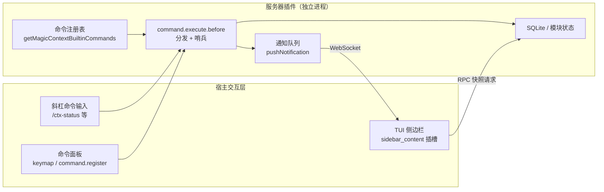

Magic Context 在宿主交互层有两套紧耦合的表面：一套是用户主动输入的 `/ctx-*` **斜杠命令系统**，另一套是持续渲染上下文压力的 **TUI 侧边栏**。命令负责触发"动作"（重建压缩历史、跑一次 dreamer、查看状态），侧边栏负责"观测"，而两者又通过一条 RPC 通道互相桥接——在 TUI 中执行命令会弹出原生对话框，对话框确认动作后又会驱动侧边栏进入快速轮询。本页从命令的注册、分发、参数校验讲到侧边栏的插槽、刷新与偏好，帮助初学者建立完整的心智模型。

两套表面共享同一个数据中枢：命令与侧边栏都不直接读数据库，而是走 RPC 客户端向服务器插件请求状态快照。

Sources: [commands.ts](packages/plugin/src/features/builtin-commands/commands.ts#L5-L47), [command-handler.ts](packages/plugin/src/hooks/magic-context/command-handler.ts#L608-L650), [rpc-notifications.ts](packages/plugin/src/shared/rpc-notifications.ts#L66-L101)

## 命令注册：一份定义，两种宿主

命令的**唯一事实来源**是一张纯数据注册表。`getMagicContextBuiltinCommands()` 返回一个键为命令名、值为 `{ template, description }` 的对象，共七个命令：`ctx-status`、`ctx-recomp`、`ctx-wrapup`、`ctx-session-upgrade`、`ctx-flush`、`ctx-dream`、`ctx-embed`。注册表接收一个 `compactionEnabled` 布尔参数，当压缩被关闭时会动态改写部分命令的 `description`，把 `ctx-recomp`、`ctx-wrapup`、`ctx-flush` 的说明替换为"在压缩关闭时不可用"的提示文本。

Sources: [commands.ts](packages/plugin/src/features/builtin-commands/commands.ts#L3-L46)

注册表通过 `satisfies BuiltinCommandConfig` 与 OpenCode SDK 的 `Config["command"]` 类型绑定，因此任何字段形状错误都会在编译期暴露。类型别名 `MagicContextBuiltinCommandName` 从该函数的返回类型推导，保证"新增命令名"与"参数校验器/分发分支"在类型层面必须同步——这是本项目保证命令系统不漂移的关键约束。

Sources: [types.ts](packages/plugin/src/features/builtin-commands/types.ts#L1-L4), [commands.ts](packages/plugin/src/features/builtin-commands/commands.ts#L46-L51)

在 OpenCode 侧，命令通过插件 `config` 钩子注入到宿主配置。合并顺序是 **宿主已有命令 → Magic Context 内置命令 → 用户插件配置覆盖**，因此用户可以覆盖描述或行为。注册被 `pluginConfig.enabled !== true` 前置门控：当启动时检测到冲突插件（DCP / OMO / OpenCode 自动压缩）而自我保护性禁用时，不注册任何 `/ctx-*` 命令与隐藏代理，避免暴露运行时无法服务的入口造成纯 UX 混淆。

Sources: [index.ts](packages/plugin/src/index.ts#L898-L916)

| 命令 | 作用（注册表中的描述语义） | 压缩关闭时 |
| --- | --- | --- |
| `/ctx-status` | 查看状态、待处理队列、缓存 TTL 与调试信息 | 仍可用 |
| `/ctx-recomp` | 从原始历史重建压缩历史（全量或 `<start>-<end>` 区间） | 不可用 |
| `/ctx-wrapup` | 压缩较早的活跃历史，保留最新消息为原始态 | 不可用 |
| `/ctx-session-upgrade` | 升级本会话到最新历史格式并迁移项目记忆 | 仍可用 |
| `/ctx-flush` | 立即强制处理所有待处理的 Magic Context 操作 | 不可用 |
| `/ctx-dream` | 立即为当前项目运行隐藏的 dreamer 维护通道 | 仍可用 |
| `/ctx-embed` | 嵌入状态，或启动/暂停历史分段嵌入 | 仍可用 |

Sources: [commands.ts](packages/plugin/src/features/builtin-commands/commands.ts#L9-L46)

## 命令分发：统一入口与哨兵机制

所有命令最终汇聚到一个处理器：`createMagicContextCommandHandler(deps)` 返回的 `"command.execute.before"` 函数。它首先用一组 `isXxxCommand` 判断当前命令是否属于自己管辖的七个命令之一，不属于则直接 `return`，把控制权让回宿主。这个"前缀式显式判断 + 提前返回"的写法让类型收窄与分发逻辑完全对齐，也便于后续逐个命令插入分支。

Sources: [command-handler.ts](packages/plugin/src/hooks/magic-context/command-handler.ts#L583-L632)

第一个实质性分支是**压缩关闭门控**：当 `deps.compactionOff` 为真且命令是 `ctx-flush` / `ctx-recomp` / `ctx-wrapup` 之一时，处理器发送一条通知解释"这些命令管理的是压缩历史，在当前模式下无效"，随后立即调用 `throwSentinel()` 终止。这保证命令既不会污染模型上下文，也不会在日志里泄漏错误。

Sources: [command-handler.ts](packages/plugin/src/hooks/magic-context/command-handler.ts#L637-L645)

`throwSentinel(command)` 是整个命令系统的核心技巧。它不是简单抛异常，而是抛出一个**被 Duck-Typing 成 Effect HTTP 响应**的 `Error`：给错误对象挂上 Effect 4.x 使用的纯字符串 TypeId 字段（如 `~effect/http/HttpServerResponse`、`~effect/ErrorReporter/ignore`），并补齐 `status: 204`、`headers`、`cookies`、`body` 等最小字段集。宿主 OpenCode 的 HTTP 错误边界会通过字符串键检测识别它，走"空响应体"路径写成真正的 204，从而既不把命令转发给 LLM，也不把错误写进 TUI 或日志。注释明确指出：官方的 `command.execute.before` handled/cancel/noReply 契约才是真正解法，这只是一个过渡性的 duck-typed shim。

Sources: [command-handler.ts](packages/plugin/src/hooks/magic-context/command-handler.ts#L187-L228)

另一个容易被忽视的防御点是**通知投递不得绕过哨兵**。处理器在构造时用一层包装替换了 `deps.sendNotification`：即使 RPC 断开、客户端消失或投递瞬时失败，异常也会被记录并吞掉，绝不会抢先于随后的 `throwSentinel()` 抛出——否则原始命令会被转发给模型，并留下一条真实错误日志。

Sources: [command-handler.ts](packages/plugin/src/hooks/magic-context/command-handler.ts#L562-L581)

命令分支按顺序执行并累积 `result` 文本，最后统一 `sendNotification` 再 `throwSentinel`。其中若干命令在 TUI 连接时走**对话框桥接**而非文本回显（如 `ctx-status` 推送 `show-status-dialog`、`ctx-embed` 推送 `show-embed-dialog`、`ctx-flush` 推送 `show-flush-dialog`），这些分支会提前 `throwSentinel` 并返回，不进入文本累加路径。

Sources: [command-handler.ts](packages/plugin/src/hooks/magic-context/command-handler.ts#L694-L737), [command-handler.ts](packages/plugin/src/hooks/magic-context/command-handler.ts#L1030-L1047)

### 参数校验：一行校验器表

每个命令在 `commandArgumentValidators` 中注册一个纯函数校验器，输入原始参数字符串、输出布尔值。这张表既服务于分发前的保守门控，也服务于后续的 Desktop 回退路径。例如 `ctx-status` 只接受空串或 `diagnostics`，`ctx-embed` 只接受空串、`start`、`pause`，`ctx-dream` 只接受空串或一个规范 dream 任务名。对外暴露的 `acceptsMagicContextCommandArguments()` 把这张表包装成"保守预分发门控"，其设计意图是让被拦截的命令与被原生识别的斜杠命令**共享同一条执行路径与同一套参数解析**。

Sources: [command-handler.ts](packages/plugin/src/hooks/magic-context/command-handler.ts#L145-L175)

参数解析本身也是显式的小解析器。`parseRecompArgs()` 接受三种形态：空串 → 全量重建；`<start>-<end>` → 区间重建；`--upgrade` → 旧版升级桩。它对非法输入返回 `{ kind: "error", message }` 并附上 `RECOMP_USAGE` 用法提示，且逐项校验起止值（`start >= 1`、`end >= start`）。`parseWrapupArgs()` 则把缺省值定为保留 20 条消息，并拒绝非正整数。

Sources: [command-handler.ts](packages/plugin/src/hooks/magic-context/command-handler.ts#L74-L143)

### 二次确认：Desktop 的双击窗口

桌面端没有原生命令确认对话框，因此 `ctx-recomp` 在非 TUI 路径实现了一个**逐会话确认窗口**：首次执行时记录时间戳与归一化参数键（`argsKey`），并返回一段警告文本；用户在 60 秒内以**相同参数**再次执行才真正触发重建。切换区间参数会被视为新的意图，需要重新确认。区间重建还会先用 `snapRangeToCompartments()` 计算吸附预览，明确告知用户"将重建多少个分段、保留多少个分段"，吸附失败则清除待确认状态。

Sources: [command-handler.ts](packages/plugin/src/hooks/magic-context/command-handler.ts#L47-L59), [command-handler.ts](packages/plugin/src/hooks/magic-context/command-handler.ts#L936-L1007)

## Desktop 斜杠剥离回退

OpenCode Desktop 在发送已注册命令时会**剥离斜杠前缀**，导致命令退化成一段普通文本，存在被当作普通提示送给模型的风险。`matchStrippedMagicContextCommand()` 专门匹配这种被剥离的形态：它要求提示恰好是**单个文本 part**，排除附件、`synthetic`/`ignored` part、多行文本，再按 `^(\S+)(?:[ \t]+(.*))?$` 尝试拆出命令名与参数，最后用注册表 `Object.hasOwn` 校验命令名、用 `acceptsMagicContextCommandArguments()` 校验参数。任何一项不满足就返回 `null`，让该文本作为普通输入走正常流程。

Sources: [stripped-command.ts](packages/plugin/src/hooks/magic-context/stripped-command.ts#L19-L52)

## Pi 宿主的命令实现

Pi 宿主的命令不走 OpenCode 的 `config.command` 注入，而是通过 Pi 扩展 API 的 `pi.registerCommand(name, { description, handler })` 逐条注册。每个命令一个模块：`ctx-status.ts`、`ctx-recomp.ts`、`ctx-wrapup.ts`、`ctx-flush.ts`、`ctx-dream.ts`、`ctx-embed.ts`、`ctx-session-upgrade.ts`，由 `index.ts` 在扩展启动时统一调用各 `registerCtxXxxCommand(pi, deps)` 完成接线，启动日志会逐条打印 `registered /ctx-xxx` 便于排查。

Sources: [index.ts](packages/pi-plugin/src/index.ts#L1566-L1770), [ctx-status.ts](packages/pi-plugin/src/commands/ctx-status.ts#L83-L92)

Pi 侧的状态展示做了一层**模型不可见**的处理。共享工具 `pi-command-utils.ts` 定义了 `CtxStatusEntryData` 与自定义渲染器：借助 `pi.registerEntryRenderer` 注册一个 `ctx-status` 类型的渲染器，状态条目以 `CustomEntry` 形式追加进 TUI 而不进入模型上下文；当运行时较老、不支持自定义渲染器时，`registerCtxStatusEntryRenderer()` 返回 `false`，命令回退到传统的可见消息路径。这是"能力探测 + 优雅降级"在本项目中的典型写法。

Sources: [pi-command-utils.ts](packages/pi-plugin/src/commands/pi-command-utils.ts#L10-L28), [pi-command-utils.ts](packages/pi-plugin/src/commands/pi-command-utils.ts#L142-L182), [index.ts](packages/pi-plugin/src/index.ts#L1553-L1563)

`presentCtxStatusMessage()` 进一步决定"弹对话框还是发通知"：只在 `ctx.mode === "rpc"`（即非交互式自动化模式）下才尝试弹窗；`shouldShowCtxStatusDialog()` 的规则是——显式标记 `rpcDisplay: "dialog"`、或者级别为 `warning`/`error` 时才弹对话框，否则用普通通知。若对话框工厂未被调用则回退为通知。

Sources: [pi-command-utils.ts](packages/pi-plugin/src/commands/pi-command-utils.ts#L53-L62), [pi-command-utils.ts](packages/pi-plugin/src/commands/pi-command-utils.ts#L184-L200)

## TUI 侧边栏：入口与插槽注册

TUI 侧边栏的加载入口是 `tui/entry.mjs`，它有一段**运行时探测逻辑**：先尝试导入宿主 OpenTUI 注册的虚拟模块 `opentui:runtime-module:@opentui/solid`，成功则让预编译 TUI 复用宿主唯一的 Solid/OpenTUI 运行时；若宿主较老或只是裸 Bun、报出"模块找不到"类错误，则回退到 TSX 源入口 `./index.tsx`；若仍无模块，再回退到 `../tui-compiled/index.tsx`。最终导出对象同时包含 v1 的 `{ id, tui }` 与 v2 的 `setup`，以兼容 OpenCode 1.18.x 与 2.0.x 两代加载器。

Sources: [entry.mjs](packages/plugin/src/tui/entry.mjs#L1-L47)

侧边栏本身是一个 Solid 组件，通过 `api.slots.register()` 挂载到宿主的 `sidebar_content` 插槽。插槽工厂 `createSidebarContentSlot(api)` 在构造时**同步读取**偏好文件，以保证首帧就以最终折叠状态与排序渲染、无异步闪烁；它返回的对象带 `order`（决定侧边栏各插槽的排序）与 `dispose`，`slots.sidebar_content` 回调接收 `value.session_id` 并把它以响应式访问器形式传给组件。

Sources: [sidebar-content.tsx](packages/plugin/src/tui/slots/sidebar-content.tsx#L1050-L1075)

## 侧边栏数据流与刷新策略

TUI 数据层是纯 RPC 客户端，不直接访问 SQLite。`initRpcClient()` 每次初始化都会自增 `rpcGeneration`，用于让仍在飞行中的旧请求在代际不匹配时自行放弃；`closeRpc()` 同样自增代际再重置客户端。

Sources: [context-db.ts](packages/plugin/src/tui/data/context-db.ts#L1-L41)

`SidebarContent` 组件持有一个 `snapshot` 信号，`refresh()` 会在请求发出前自增 `snapshotRequestSequence`，回调返回后同时校验"会话未切换"与"序号未被更新"，避免把 A 会话的数值画进 B 会话。普通消息事件触发的刷新经过 150ms 防抖（`REFRESH_DEBOUNCE_MS`）。

Sources: [sidebar-content.tsx](packages/plugin/src/tui/slots/sidebar-content.tsx#L36-L37), [sidebar-content.tsx](packages/plugin/src/tui/slots/sidebar-content.tsx#L529-L571)

组件订阅三类宿主事件——`message.updated`、`session.updated`、`message.removed`——并且都按当前 `sessionID` 过滤；同时用 `createEffect(on(props.sessionID, ...))` 在会话切换时清空快照并立即刷新。

Sources: [sidebar-content.tsx](packages/plugin/src/tui/slots/sidebar-content.tsx#L692-L727)

当重建/升级在**子会话**中运行时，父会话收不到消息事件，进度条本会冻结。为此侧边栏内置了一个自维持的快速轮询循环（`RECOMP_POLL_MS = 1200`），它具有多项防御：成功与失败都重新排程（避免一次请求失败杀死循环）、在"从未见到活跃阶段"时受 `RECOMP_PROBE_MAX` 探测窗限制、在"曾见活跃后短暂缺失"时把上一次良好进度向前携带（`recompProgress` 合并），仅在连续缺失超过 `RECOMP_ABSENT_GIVEUP` 或命中终态时才停止。

Sources: [sidebar-content.tsx](packages/plugin/src/tui/slots/sidebar-content.tsx#L496-L527), [sidebar-content.tsx](packages/plugin/src/tui/slots/sidebar-content.tsx#L587-L664)

对话确认动作（重建/升级）不会触发消息事件，因此模块级钩子 `kickRecompProgressRefresh()` 与 `refreshSidebarSnapshot()` 让对话框能"立刻踢一下"已挂载的侧边栏；组件挂载时把自己的刷新函数注册到这两个钩子上，`onCleanup` 时注销。

Sources: [sidebar-content.tsx](packages/plugin/src/tui/slots/sidebar-content.tsx#L21-L34), [sidebar-content.tsx](packages/plugin/src/tui/slots/sidebar-content.tsx#L682-L690)

### 粘性缓存：抵御瞬时零值

快照读取存在两个方向的粘性缓存。**服务器侧** `applyStickySnapshotCache()` 的规则是：若新构建的快照 `inputTokens > 0`，直接以新鲜数据为准并更新缓存；只有当新快照为 0、且存在近期良好快照、且会话显示出"进行中"证据（historian/分段工作、待处理操作等）时，才用缓存值替代显示，并设有 5 分钟上限防止长期展示陈旧数据。

Sources: [sidebar-snapshot-cache.ts](packages/plugin/src/plugin/sidebar-snapshot-cache.ts#L1-L99)

**客户端侧**也有一份每会话的粘性缓存，覆盖服务器无法覆盖的三种情况：RPC 调用完全失败（超时/中止/解析错误）、RPC 服务器尚未就绪、服务器返回错误信封。它以 5 分钟为陈旧上限、以 100 条为容量上限做 LRU 淘汰；当快照 `inputTokens <= 0` 时视为权威的"零"，删除缓存条目，防止后续传输失败复活旧值。

Sources: [context-db.ts](packages/plugin/src/tui/data/context-db.ts#L74-L117)

### 通知推送：从轮询到 WebSocket

服务器→TUI 的推送经历了一次架构演进。旧方案是每 500ms 通过 HTTP 轮询 `pending-notifications`，而每次轮询都新开一条 loopback TCP 连接（Bun 的 fetch 不池化到本地服务器），成为 TUI 空闲 CPU 占用的全部来源。现方案改为一条**常驻 WebSocket**：服务器在通知入队瞬间推送，零逐事件连接成本、零轮询延迟；socket 的 `hello` 携带当前活跃会话，服务器只投递该会话及全局通知。会话跟踪用一个每秒只读 `api.route.current` 属性的廉价监视器，仅在会话真正变化时才重连作用域。

Sources: [notification-socket.ts](packages/plugin/src/tui/data/notification-socket.ts#L1-L42)

服务器侧由内存通知队列 `pushNotification()` 实现：它同时**立即推送到所有匹配的活跃 sink**、并把通知入队，使得瞬时断连的 TUI 在重连后的 `hello` 仍能收到积压；投递是至少一次语义，客户端确认后才从队列删除。会话作用域通过 sink 自身携带的 `sessionId` 匹配——同一进程可服务多个会话（同一项目的 A 会话 TUI 与 B 会话 Desktop），B 作用域的生产者只会把对话框路由到 B 的 TUI。

Sources: [rpc-notifications.ts](packages/plugin/src/shared/rpc-notifications.ts#L35-L59), [rpc-notifications.ts](packages/plugin/src/shared/rpc-notifications.ts#L61-L101)

## 命令与侧边栏的联动：对话框桥接

TUI 中执行 `/ctx-*` 命令时，服务器不会把结果当作文本回显，而是推送一个 `action` 类型的通知；TUI 的 `handleNotification()` 收到后弹原生对话框。所有 `action` 在处理前都要通过 `stillActive()` 校验"代际与会话都未变"，避免在路由切换后弹错对话框。若 TUI 未连接，服务器则退化为 `sendNotification` 文本路径。

Sources: [index.tsx](packages/plugin/src/tui/index.tsx#L1131-L1203)

| `action` | 触发的对话框 | 典型来源 |
| --- | --- | --- |
| `show-status-dialog` | 状态对话框（可带 diagnostics） | `/ctx-status` |
| `show-recomp-dialog` | 重建确认对话框 | `/ctx-recomp` |
| `show-upgrade-dialog` | 会话升级/续跑对话框 | 升级提醒、`/ctx-session-upgrade` |
| `show-embed-dialog` | 嵌入状态对话框 | `/ctx-embed`（无子命令） |
| `show-flush-dialog` | 结果对话框（标题 Flush） | `/ctx-flush` |
| `show-result-dialog` | 通用结果对话框 | `/ctx-embed start|pause` |
| `refresh-sidebar` | 无对话框，仅触发侧边栏刷新 | 服务器驱动的侧边栏更新 |
| `wrapup-progress-kick` | 无对话框，踢快速进度轮询 | `/ctx-wrapup` 启动 |

Sources: [index.tsx](packages/plugin/src/tui/index.tsx#L1153-L1202), [command-handler.ts](packages/plugin/src/hooks/magic-context/command-handler.ts#L652-L702)

对话框确认动作后又会反向驱动侧边栏：`showRecompDialog` 成功后调用 `kickRecompProgressRefresh()` 启动快速轮询；`showUpgradeDialog` 在服务器接受请求后才踢轮询，并在取消时写入持久化的"已拒绝"标记以免每次重启反复弹窗。

Sources: [index.tsx](packages/plugin/src/tui/index.tsx#L514-L559), [index.tsx](packages/plugin/src/tui/index.tsx#L561-L639)

## 侧边栏版面结构

侧边栏有**折叠**与**展开**两种形态。折叠态只渲染标题行、比例条与三条摘要行（Historian 含分段数、Memories 的注入/总数、Status 的 `C:/Q:/N:`）；展开态则渲染完整的分区网格。

Sources: [sidebar-content.tsx](packages/plugin/src/tui/slots/sidebar-content.tsx#L820-L877)

表头是一个可点击的行，包含三角指示器（▶/▼）、徽章文字（来自偏好 `header.label`）与版本号；点击整行切换折叠。`badgeTextColor()` 根据徽章背景计算可读的文字颜色，保证不同主题下的对比度。

Sources: [sidebar-content.tsx](packages/plugin/src/tui/slots/sidebar-content.tsx#L750-L765)

**令牌分解条**是侧边栏的视觉核心。它不作为固定宽度字符串渲染，而是用一行彩色 `<box>` 子元素，每个子元素 `flexGrow=tokens`、`flexBasis=0`，由 opentui 按比例分配父容器全宽——这同时修复了窄侧边栏换行与宽侧边栏留白两个问题。每一类令牌有固定色：冷色系（System/Docs/Compartments/Facts/Memories/Profile）对应插件注入 `message[0]` 的结构化内容，暖色系（Conversation/Tool Calls/Tool Defs）对应用户可见的聊天与工具流量。同一套颜色常量在状态对话框中被完整复制，以保证两个表面读数一致。

Sources: [sidebar-content.tsx](packages/plugin/src/tui/slots/sidebar-content.tsx#L133-L200), [index.tsx](packages/plugin/src/tui/index.tsx#L165-L179)

展开态分区受偏好中的 `sections` 开关逐项控制：

| 分区 | 显示条件 | 关键字段 |
| --- | --- | --- |
| Historian | `sections().historian` 且压缩开启 | 运行状态（idle / comparting ⟳）、Compartments 数 |
| Memory | `sections().memory` | Memories 总数、Injected 注入数 |
| Status | `sections().status` 且有 Queue/Notes/Smart Notes | `Queue n pending`、`Notes`、`Smart Notes n ready` |
| Dreamer | `sections().dreamer` 且有上次运行或进行中 | Current 任务进度、Last run 相对时间、各任务 backlog |
| Stats | `sections().stats` | 总计令牌数 |

Sources: [sidebar-content.tsx](packages/plugin/src/tui/slots/sidebar-content.tsx#L879-L1025)

进度分区 `RecompProgressSection` 的关键设计是**响应式读取而非解构**：组件在整个阶段推进过程中保持挂载，若在创建时把 `props.progress` 解构为局部变量，标签会永远停留在创建时的阶段（这正是曾经"升级完成后仍显示 upgrading"的根因）。文案中的动词（Recomp / Upgrade / Embed / Wrapup）跟随启动该次运行的流程类型，因此一次普通 `/ctx-recomp` 永远不会显示成"Upgrade"。

Sources: [sidebar-content.tsx](packages/plugin/src/tui/slots/sidebar-content.tsx#L372-L434)

## 偏好设置与排序

侧边栏的偏好存放在与其它 TUI 插件共享的文件 `tui-preferences.jsonc` 中，每个插件占一个顶层键（Magic Context 使用 `magic-context`）。文件的位置解析顺序为：环境变量 `OPENCODE_TUI_PREFERENCES_FILE` → `OPENCODE_CONFIG_DIR` → `XDG_CONFIG_HOME/opencode` → `~/.config/opencode`。所有读取都是宽容的：文件缺失、解析失败或根节点非对象都回退为 `{}`，从不抛错。

Sources: [tui-preferences.ts](packages/plugin/src/shared/tui-preferences.ts#L22-L64)

`resolveMagicContextPrefs()` 对每个键独立校验与钳制，因此单个坏值不会污染其余设置。可配置项包括：`forceToTop`、`order`、`startCollapsed`、`rememberCollapsed`、`collapsed`、`header.label`（最长 24 字符）、以及 `sections` 的五个布尔开关。

Sources: [tui-preferences.ts](packages/plugin/src/shared/tui-preferences.ts#L69-L148)

排序遵循一套**跨插件约定**：`computeEffectiveOrder()` 在 `forceToTop === true` 时返回 `FORCE_TOP_BASE + 键在文件中的索引`，否则使用钳制在 `-10000..10000` 的 `order`。Magic Context 的默认顺序为 170，与 anthropic-auth（160）、AFT（180）形成协调的默认阶梯；宿主的插槽按 order 升序渲染，OpenCode 内置项占据 100–500。该约定要求插件键必须是非整数式短名，否则 JS 对象键迭代会把整数式键提前，破坏基于 `indexOf` 的排序。

Sources: [tui-preferences.ts](packages/plugin/src/shared/tui-preferences.ts#L150-L175)

侧边栏的折叠状态由一个位于**插槽工厂闭包**（即插件/进程生命周期）的控制器持有。这一点很关键：用户在主视图与子代理视图之间切换时，`sidebar_content` 会卸载并重新挂载，若信号建在组件内部，每次重挂载都会重置为种子值。控制器因此承载了持久的 `prefs`/`collapsed` 信号与唯一的文件监视器，使折叠状态与实时偏好重载能跨越重挂载存活；`createSignal` 放在控制器里，而需要 owner 的 Solid effect/memo 则留在组件内部。

Sources: [sidebar-content.tsx](packages/plugin/src/tui/slots/sidebar-content.tsx#L46-L100)

折叠回写还做了一个**回声守卫**：`lastPersistedCollapsed` 只在自身的写入落地后才推进，因此监视器回传的"刚写入的那个值"会被 `!==` 判断拒绝，不会把用户的一次点击翻转回去。

Sources: [sidebar-content.tsx](packages/plugin/src/tui/slots/sidebar-content.tsx#L62-L91)

## 命令面板与优雅降级

除斜杠命令外，TUI 还注册命令面板条目（"Magic Context: Status / Recomp / TUI Probe"）。这里处理了 OpenCode TUI 的版本碎片化：1.14.42 彻底移除了 `api.command.register`，1.14.44+ 又以已弃用 shim 的形式恢复并翻译为 `api.keymap.registerLayer`。因此 `registerCommandPaletteEntries()` 优先使用 `keymap.registerLayer`；即使该方法存在也可能在 1.14.42–1.14.43 调用时抛错，所以整段调用被 `try/catch` 包裹并在失败时回退到旧 `command.register`。

Sources: [index.tsx](packages/plugin/src/tui/index.tsx#L901-L1013)

当两个 API 表面都不存在时，TUI 仍能加载——只是失去命令面板入口，侧边栏（通过 `api.slots.register` 注册）依然可见，`/ctx-status` 与 `/ctx-recomp` 也仍可经由服务器端命令处理器通过 RPC 桥接到 TUI 对话框。

Sources: [index.tsx](packages/plugin/src/tui/index.tsx#L1015-L1021)

## OpenCode 2 的 TUI 路径

OpenCode 2 使用另一套 TUI 契约，由 `v2/tui/index.ts` 的 `setupWithJsx()` 实现。它与 v1 共享同一份数据层（`initRpcClient`、`loadSidebarSnapshot`、`startNotificationSocket`），但侧边栏以**纯文本多行字符串**渲染（`sidebarText()`），并通过 `context.ui.slot({ append: "sidebar.content", render })` 注册，刷新节流为 1 秒且有 `inflight` 去重。命令面板则以 `context.keymap.layer()` 声明，其中 `slash: { name: "ctx-status", arguments: true }` 让 `ctx-status` 在 v2 中具备斜杠入口与参数透传。

Sources: [index.ts](packages/plugin/src/v2/tui/index.ts#L86-L198)

## 关键设计要点回顾

- **单一注册表 + 类型推导的命令名**：`getMagicContextBuiltinCommands()` 是命令的唯一事实来源，`MagicContextBuiltinCommandName` 从返回值推导，强制新增命令时同步校验器与分发分支。
- **哨兵而非异常**：`throwSentinel()` 用 duck-typed 的 Effect HTTP 响应把已处理命令变成 204，既不进模型也不进日志。
- **至少一次的通知投递**：`pushNotification()` 同时实时扇出与入队，配合客户端确认删除，使瞬时断连不丢对话框。
- **两层粘性缓存**：服务器侧与客户端侧各一层，抵御瞬时零值与 RPC 抖动，并都设有 5 分钟陈旧上限。
- **闭包持有 UI 持久状态**：侧边栏控制器活在插槽工厂闭包中，使折叠与偏好跨视图重挂载存活。

Sources: [commands.ts](packages/plugin/src/features/builtin-commands/commands.ts#L49-L51), [command-handler.ts](packages/plugin/src/hooks/magic-context/command-handler.ts#L217-L228), [rpc-notifications.ts](packages/plugin/src/shared/rpc-notifications.ts#L61-L101), [sidebar-content.tsx](packages/plugin/src/tui/slots/sidebar-content.tsx#L46-L100)

## 延伸阅读

- 命令所做的"压缩历史重建"具体如何工作，见 [转换通道生命周期与阶段划分](9-zhuan-huan-tong-dao-sheng-ming-zhou-qi-yu-jie-duan-hua-fen) 与 [Historian 分区流程：产制·校验·发布](13-historian-fen-qu-liu-cheng-chan-zhi-xiao-yan-fa-bu)。
- 侧边栏展示的内存与笔记计数来源，见 [项目记忆体系与五类知识分类法](16-xiang-mu-ji-yi-ti-xi-yu-wu-lei-zhi-shi-fen-lei-fa)。
- `/ctx-dream` 触发的后台维护通道，见 [Dreamer 任务调度与执行模型](19-dreamer-ren-wu-diao-du-yu-zhi-xing-mo-xing)。
- 侧边栏数据所依赖的 RPC 通道与存储层，见 [SQLite 存储模式、迁移与时间戳约定](21-sqlite-cun-chu-mo-shi-qian-yi-yu-shi-jian-chuo-yue-ding)。
- 命令与侧边栏在两个宿主上的对等实现细节，见 [OpenCode 1 与 OpenCode 2 适配层](23-opencode-1-yu-opencode-2-gua-pei-ceng) 与 [Pi / OMP 插件与跨宿主对等实现](24-pi-omp-cha-jian-yu-kua-su-zhu-dui-deng-shi-xian)。