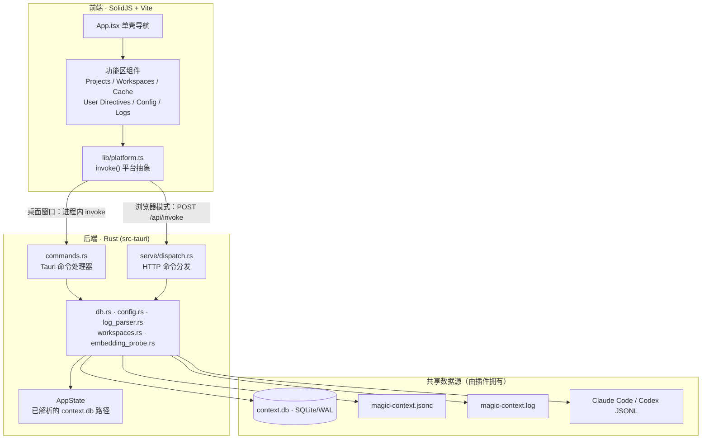
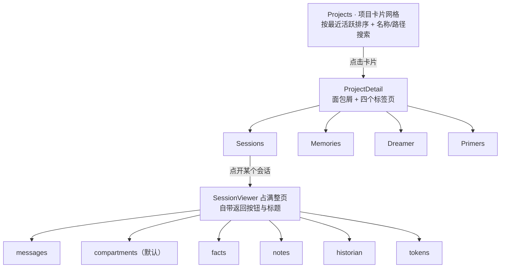
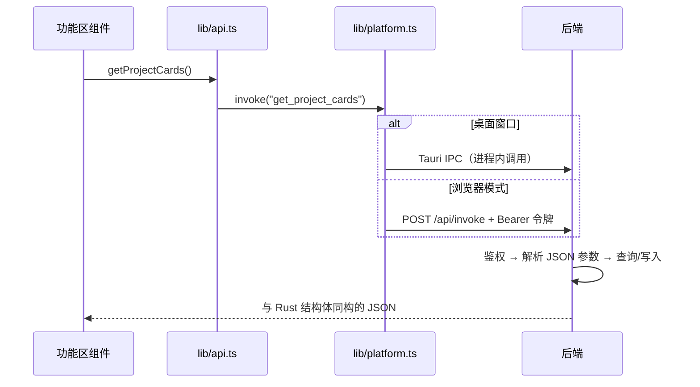
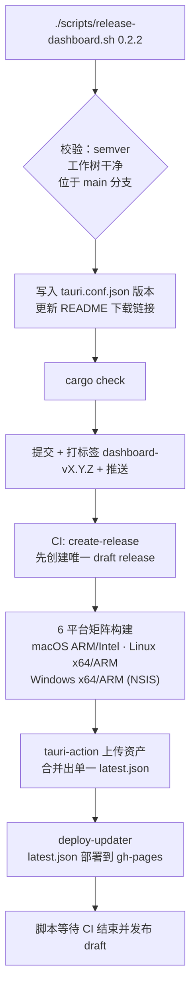

**桌面仪表盘（Magic Context Dashboard）** 是一个独立于编码宿主的桌面应用，位于 `packages/dashboard`。它不参与上下文转换，也不驱动 Dreamer 调度；它的职责是把插件已经写入磁盘的状态——记忆、会话历史、缓存遥测、Dreamer 运行记录、配置与日志——用图形界面呈现出来，并对其中少数几类数据提供受控写入。理解它的关键是把握一条边界：**仪表盘只消费插件拥有的数据，从不拥有数据的生命周期**。本页从架构分层、双形态运行时、通信契约、安全模型与六大功能区依次展开，适合已经完成安装、希望用图形界面排查问题或修正记忆的开发者。
Sources: [README.md](packages/dashboard/README.md#L1-L20), [dashboard.md](packages/docs/src/content/docs/reference/dashboard.md#L1-L6)

## 一、定位：共享存储的可视化外壳

仪表盘与插件读写**同一份** `context.db`、同一份 `magic-context.jsonc` 与同一个日志文件。它和任何插件版本并行运行都是安全的：当数据库的表结构落后于插件功能时，查询会返回空值或 `None` 并优雅降级，而不是崩溃。例如 mural（记忆壁画）查询在缺少 `mural_manifest` 表的旧库上直接返回 `None`，由集成测试固定这一行为。
Sources: [README.md](packages/dashboard/README.md#L64-L70), [mural_manifest.rs](packages/dashboard/src-tauri/tests/mural_manifest.rs#L1-L10)

这条边界在代码里有明确表达。写连接的注释写着「dashboard never owns the schema」——插件拥有数据库生命周期，因此写入连接使用 `SQLITE_OPEN_READ_WRITE` 而**刻意不带** `CREATE` 标志：如果数据库文件在启动后消失，操作应当报错，而不是静默创建出一个空库。
Sources: [db.rs](packages/dashboard/src-tauri/src/db.rs#L548-L556)

写操作的范围也是刻意收窄的。仪表盘可以修改记忆的内容、分类与状态（含批量归档/删除）、会话笔记与事实、用户级指令、工作区组成，以及配置文件的文本内容；但它不会触发 Dreamer 运行，也不会迁移数据库。对运行中的会话而言，仪表盘的写入属于**外部变更**：它会推动 `project_memory_epoch`，使宿主在下一个自然硬失效点重新同步基座内容。
Sources: [ARCHITECTURE.md](ARCHITECTURE.md#L85-L90), [dashboard.md](packages/docs/src/content/docs/reference/dashboard.md#L1-L6)

## 二、两种运行形态：桌面窗口与浏览器模式

正常的仪表盘是一个 Tauri 应用：前端（SolidJS）打包进入嵌合的 WebView 窗口，Rust 后端以进程内命令调用的方式暴露数据。程序启动时**最先**解析命令行参数，若检测到 `--serve` 则完全绕过 Tauri 窗口，转而启动一个 Axum HTTP 服务器并把同一套命令以 `POST /api/invoke` 暴露出去，供任意现代浏览器访问。这条路径主要解决 Linux 发行版与 WSL2 上内嵌 WebKitGTK 与宿主图形栈不匹配（典型症状是白窗口与 `Could not create default EGL display`）导致桌面窗口无法启动的问题。
Sources: [main.rs](packages/dashboard/src-tauri/src/main.rs#L22-L32), [serve/mod.rs](packages/dashboard/src-tauri/src/serve/mod.rs#L57-L70), [dashboard.md](packages/docs/src/content/docs/reference/dashboard.md#L20-L32)



两种形态共享同一份命令实现与数据访问层，差异集中在**传输与安全边界**上。桌面窗口受 Tauri 能力清单约束（只声明 `core:default`、`updater`、`dialog`、`process`，不再需要 shell 权限），安全策略由 `tauri.conf.json` 的 CSP 声明；浏览器模式则必须自己实现主机校验、来源校验与令牌鉴权，并额外获得 `subprocess`/网络探测类命令的并发闸门。
Sources: [default.json](packages/dashboard/src-tauri/capabilities/default.json#L1-L13), [tauri.conf.json](packages/dashboard/src-tauri/tauri.conf.json#L26-L45), [serve/mod.rs](packages/dashboard/src-tauri/src/serve/mod.rs#L22-L27)

| 维度 | 桌面窗口（默认） | 浏览器模式（`--serve`） |
|---|---|---|
| 前端载体 | 内嵌 WebView（`frontendDist: ../dist`） | 静态资源经 `rust_embed` 编译进二进制 |
| 调用通道 | Tauri IPC `invoke` | `POST /api/invoke`（JSON） |
| 监听地址 | 不监听端口 | 默认 `127.0.0.1:9077` |
| 鉴权 | Tauri 能力清单 + CSP | 每进程随机令牌 + Host/Origin 校验 |
| 自动更新 | 可用（updater 插件） | 不可用，需包管理器或重新下载 |
| 典型用途 | 日常浏览与编辑 | Linux / WSL2 图形栈故障时的替代界面 |
Sources: [tauri.conf.json](packages/dashboard/src-tauri/tauri.conf.json#L5-L25), [serve/mod.rs](packages/dashboard/src-tauri/src/serve/mod.rs#L22-L25), [updater.ts](packages/dashboard/src/lib/updater.ts#L29-L40)

## 三、代码结构与分层

仓库在该包内分成三个清晰层次：`src/` 是纯前端（每个功能区一个组件目录），`src/lib/` 是前端侧的平台抽象与类型定义，`src-tauri/` 是 Rust 后端（命令、数据访问、HTTP 服务）。前端不直接拼 SQL，后端也不做展示格式化——两侧通过 `lib/types.ts` 中手工维护的类型镜像对齐。
Sources: [README.md](packages/dashboard/README.md#L33-L62), [types.ts](packages/dashboard/src/lib/types.ts#L1-L2)

```
packages/dashboard/
├── src/                      # SolidJS 前端
│   ├── App.tsx               # 根组件：分区导航 + 错误边界
│   ├── components/           # 每个功能区一个目录
│   │   ├── Projects/         # 项目卡片网格 + 项目详情四标签页
│   │   ├── SessionViewer/    # 会话详情：六标签页
│   │   ├── MemoryBrowser/    # 项目记忆 CRUD + 批量操作
│   │   ├── DreamerPanel/     # 任务排程与运行历史
│   │   ├── CacheDiagnostics/ # 缓存时间线 + 失效原因
│   │   ├── UserMemories/     # 用户级指令与候选
│   │   ├── ConfigEditor/     # JSONC 配置编辑器
│   │   ├── LogViewer/        # 日志尾部与过滤
│   │   └── Layout/           # Sidebar / StatusBar
│   └── lib/                  # platform / api / types / 纯函数工具
└── src-tauri/                # Rust 后端
    ├── src/
    │   ├── main.rs           # 启动、命令注册、托盘与菜单
    │   ├── lib.rs            # AppState 共享状态
    │   ├── commands.rs       # 全部 Tauri 命令处理器
    │   ├── db.rs             # SQLite 读写与查询
    │   ├── config.rs         # 配置文件读写
    │   ├── log_parser.rs     # 日志解析与缓存事件提取
    │   ├── workspaces.rs     # 工作区 CRUD
    │   ├── serve/            # 浏览器模式：mod.rs + dispatch.rs
    │   └── project_identity.rs # 项目身份归一化
    └── tests/                # Rust 集成测试
```

## 四、前端：单壳导航与项目下钻

整个界面是一个单壳（single shell）：`App.tsx` 只持有两个导航状态——`activeSection`（横向分区，默认 `projects`）与 `selectedProject`（项目内下钻，`null` 表示卡片网格）。所有功能区内容都包在一个 `ErrorBoundary` 内，任一组件抛错只替换内容区并提供「Try Again」重置，侧边栏与状态栏依然可用。
Sources: [App.tsx](packages/dashboard/src/App.tsx#L35-L45), [App.tsx](packages/dashboard/src/App.tsx#L110-L184)

侧边栏固定六个分区。值得注意的是，记忆、会话、Dreamer 与 Primers **不是**顶级标签页，而是收拢在「Projects」之下的项目内标签——因为这几类数据都以项目身份为组织轴。
Sources: [Sidebar.tsx](packages/dashboard/src/components/Layout/Sidebar.tsx#L3-L10), [dashboard.md](packages/docs/src/content/docs/reference/dashboard.md#L56-L58)



导航的复位语义是刻意的：`navigate("projects")` 会同时把 `selectedProject` 清空，因此离开再进入 Projects 一定回到网格而非上次的项目；项目详情内点开某个会话时，外层的面包屑与标签栏会整体隐藏，避免出现两套标题与两个返回按钮。
Sources: [App.tsx](packages/dashboard/src/App.tsx#L39-L43), [ProjectDetail.tsx](packages/dashboard/src/components/Projects/ProjectDetail.tsx#L28-L38)

| 层级 | 标签页 | 核心内容 |
|---|---|---|
| 顶级分区 | Projects | 项目卡片网格（会话数、记忆数、工作区归属、宿主徽章、最近活跃） |
| 顶级分区 | Workspaces | 工作区成员、共享分类、暂存式编辑 |
| 顶级分区 | Cache | 逐回合缓存读写、容量、严重度时间线 |
| 顶级分区 | User Directives | 用户级记忆与待提升候选 |
| 顶级分区 | Config | 用户配置 + 项目覆盖的 JSONC 编辑器 |
| 顶级分区 | Logs | `magic-context.log` 尾部与过滤 |
| 项目内 | Sessions / Memories / Dreamer / Primers | 见第九节 |
| 会话内 | messages / compartments / facts / notes / historian / tokens | 默认落在 compartments |
Sources: [Sidebar.tsx](packages/dashboard/src/components/Layout/Sidebar.tsx#L3-L10), [ProjectDetail.tsx](packages/dashboard/src/components/Projects/ProjectDetail.tsx#L15-L20), [SessionViewer.tsx](packages/dashboard/src/components/SessionViewer/SessionViewer.tsx#L146-L150), [SessionViewer.tsx](packages/dashboard/src/components/SessionViewer/SessionViewer.tsx#L204-L205)

底部状态栏由一次数据库健康查询驱动，它显示数据库文件大小与四个关键表的行数（memories / compartments / session_facts / notes）；健康数据缺失时降级为「Loading...」，数据库不存在时显示红色「DB: not found」。这就是「插件是否已经运行过」最直接的视觉反馈。
Sources: [StatusBar.tsx](packages/dashboard/src/components/Layout/StatusBar.tsx#L13-L36), [App.tsx](packages/dashboard/src/App.tsx#L45-L45)

## 五、通信契约：一条 invoke 命令走通两种形态

前端的全部数据访问都经过 `lib/platform.ts` 的一个 `invoke()` 函数。它先用 `isTauri()` 判断宿主环境：在桌面窗口走 Tauri 的进程内 `invoke`；在浏览器里则 POST 到 `/api/invoke`，并在存在令牌时附带 `Authorization: Bearer` 头。同一层还抽象了 `ask` / `notify` / `relaunch` / `listen`，使 Tauri 专有 API 在浏览器模式下退化为 `window.confirm`、`window.alert` 或空操作——这就是「同一套组件代码能跑在两种形态」的机制。
Sources: [platform.ts](packages/dashboard/src/lib/platform.ts#L20-L21), [platform.ts](packages/dashboard/src/lib/platform.ts#L32-L48), [platform.ts](packages/dashboard/src/lib/platform.ts#L59-L64)

`initServeToken()` 在应用启动时（`App.tsx` 的第一行组件逻辑）从 URL 片段解析一次性令牌，并立即用 `history.replaceState` 把它从地址栏与浏览器历史中抹掉，使令牌不会被书签或历史记录持久化。
Sources: [platform.ts](packages/dashboard/src/lib/platform.ts#L23-L30), [App.tsx](packages/dashboard/src/App.tsx#L35-L35)



`lib/api.ts` 位于组件与 `invoke` 之间，为每个命令提供具名、带类型的包装函数（例如 `getProjectCards`、`getMemories`、`getUserMemories`），并负责把 `undefined` 归一化为 `null`、剔除空过滤器等参数整形工作。后端的命令清单以 `main.rs` 中 `tauri::generate_handler![...]` 的注册列表为**唯一权威**，浏览器模式的 `serve/dispatch.rs` 则用一份 `match cmd { ... }` 手工镜像同一套命令名。
Sources: [api.ts](packages/dashboard/src/lib/api.ts#L1-L40), [api.ts](packages/dashboard/src/lib/api.ts#L273-L275), [main.rs](packages/dashboard/src-tauri/src/main.rs#L42-L100), [dispatch.rs](packages/dashboard/src-tauri/src/serve/dispatch.rs#L281-L290)

| 命令域 | 代表性命令 | 读写 |
|---|---|---|
| 记忆 | `get_memories`、`update_memory_content`、`delete_memory`、`bulk_delete_memory` | 读 + 写 |
| 会话 | `list_sessions_paged`、`get_session_detail`、`get_compartments`、`get_session_messages` | 只读 |
| Dreamer | `get_task_schedule_state`、`get_dream_state`、`get_dream_runs` | 只读 |
| 缓存与日志 | `get_session_cache_events`、`get_cache_events_from_db`、`get_log_entries` | 只读 |
| 配置 | `get_config`、`save_config`、`get_project_configs`、`save_project_config` | 读 + 写 |
| 模型发现 | `get_opencode_install_state`、`get_model_catalogs`、`test_embedding_endpoint` | 探测（受限并发） |
| 用户记忆 | `get_user_memory_candidates`、`promote_user_memory_candidate`、`dismiss_user_memory` | 读 + 写 |
| 工作区 | `list_workspaces`、`create_workspace`、`apply_workspace_changes` | 读 + 写 |
| 健康 | `get_db_health` | 只读 |
Sources: [main.rs](packages/dashboard/src-tauri/src/main.rs#L43-L100), [dispatch.rs](packages/dashboard/src-tauri/src/serve/dispatch.rs#L767-L772)

## 六、Rust 后端：状态、连接与线程

共享状态极简：`AppState` 只持有一个 `Mutex<Option<PathBuf>>`，即**启动时解析一次**的数据库路径。`None` 会被翻译成面向用户的提示「Database not found. Is the Magic Context plugin installed?」，这解释了为什么未运行过插件的机器上仪表盘会整体降级为空态而非报错。
Sources: [lib.rs](packages/dashboard/src-tauri/src/lib.rs#L18-L41)

路径解析有明确的优先级：先看 `MAGIC_CONTEXT_STORAGE_DIR`（必须是绝对路径，且目录内 `context.db` 已存在，否则直接返回 `None`——刻意不回退），再看 `$XDG_DATA_HOME`（或 `~/.local/share`）下的 `cortexkit/magic-context/context.db`，最后回退到旧的 OpenCode 专用路径 `opencode/storage/plugin/magic-context/context.db`。注释同时提醒一个容易踩坑的事实：插件在所有平台都遵循 XDG 约定，Windows 上并非 `%APPDATA%`。
Sources: [db.rs](packages/dashboard/src-tauri/src/db.rs#L19-L72)

连接策略区分读写。只读连接使用 `SQLITE_OPEN_READ_ONLY`，设置 `busy_timeout=5000`，并依赖插件的读-写连接已经把库置为 WAL 模式（因此不需要也不能在此设置）。写连接则在打开后**先**设 `busy_timeout`，**再**设 `journal_mode=WAL`——顺序在注释里被特别强调，因为设置 WAL 本身需要文件锁，若超时后置，冷启动遇到争用会立刻 `SQLITE_BUSY` 而不是等待；同时开启 `foreign_keys` 并执行上下文存储 UUID 校验。
Sources: [db.rs](packages/dashboard/src-tauri/src/db.rs#L493-L503), [db.rs](packages/dashboard/src-tauri/src/db.rs#L548-L567)

性能上有一个值得学习的模式：所有 Tauri 命令都标注 `#[tauri::command(async)]`。这不是因为逻辑里有 `await`，而是让同步函数体在**工作线程**而非 WebView 主线程执行。注释记录了一个真实故障：`get_projects` 内部要对整个库做 `GROUP BY` 并递归扫描 Pi 会话目录，在主线程上会让每次进入历史页冻结 UI 约 1–2 秒。
Sources: [commands.rs](packages/dashboard/src-tauri/src/commands.rs#L10-L18)

托盘与菜单属于桌面形态的附加能力：应用启动时构建 macOS 应用菜单与系统托盘菜单，提供「Open Dashboard」「Check for Updates...」「Quit」；菜单项与托盘事件都通过 `emit("check-for-updates")` 把信号发给前端，由前端的 `listen()` 订阅后弹出交互式更新检查。
Sources: [main.rs](packages/dashboard/src-tauri/src/main.rs#L130-L180), [App.tsx](packages/dashboard/src/App.tsx#L88-L100)

## 七、浏览器模式的安全模型

`--serve` 的鉴权是一条严格有序的流水线，任一环节失败都不会继续：先校验 `Host` 头（默认只接受 `127.0.0.1:<port>`、`localhost:<port>`、`[::1]:<port>`），再校验 `Origin` 头（默认只接受与这些主机同源的 `http://` 来源，缺失 Origin 视为放行），然后用**常数时间比较**校验 `Authorization: Bearer <token>`，最后要求 `POST` 请求的 `Content-Type` 为 `application/json`。此外 `/api` 子树的响应一律带 `Cache-Control: no-store`——因为其中包含会话转写、配置与写入结果，绝不能被浏览器或中间层缓存。
Sources: [serve/mod.rs](packages/dashboard/src-tauri/src/serve/mod.rs#L243-L262), [serve/mod.rs](packages/dashboard/src-tauri/src/serve/mod.rs#L383-L412), [serve/mod.rs](packages/dashboard/src-tauri/src/serve/mod.rs#L444-L466), [serve/mod.rs](packages/dashboard/src-tauri/src/serve/mod.rs#L271-L276)

令牌由 32 字节密码学随机数编码为 64 位十六进制字符串，**只**通过启动时打印的 URL 片段交付（`http://127.0.0.1:9077/#token=<token>`）；片段不会发送给服务器，因此不会进入服务器日志。测试同时固定了两条反面约束：不接受查询串形式的令牌（`?token=` 会得到 401），以及未授权请求在读取 JSON 体之前就被拒绝。
Sources: [serve/mod.rs](packages/dashboard/src-tauri/src/serve/mod.rs#L500-L506), [serve/mod.rs](packages/dashboard/src-tauri/src/serve/mod.rs#L517-L524), [serve/mod.rs](packages/dashboard/src-tauri/src/serve/mod.rs#L723-L760)

参数层面的防线同样具体：绑定非回环地址会被**明确拒绝**，除非额外传入 `--allow-remote`，拒绝信息直说原因是该模式「通过明文 bearer-token HTTP 暴露写访问与子进程生成」，并建议改用 SSH 隧道；端口 0、重复 `--serve`、未知选项都会在启动时报错退出。
Sources: [serve/mod.rs](packages/dashboard/src-tauri/src/serve/mod.rs#L57-L116)

| 防护项 | 取值 / 行为 | 目的 |
|---|---|---|
| 默认监听 | `127.0.0.1:9077` | 仅本机可达 |
| 远程绑定 | 需显式 `--allow-remote` | 防止误暴露写接口 |
| 令牌 | 32 字节随机 → 64 位 hex，片段交付 | 不落地址栏历史、不进日志 |
| 令牌比较 | 常数时间逐字节异或 | 抵御时序侧信道 |
| 请求体上限 | 1 MiB | 限制滥用 |
| 子进程并发 | `Semaphore(2)`，仅作用于探测类命令 | 防止模型发现子进程耗尽主机 |
| 响应头 | CSP、`Referrer-Policy: no-referrer`、`X-Content-Type-Options: nosniff` | 收紧浏览器行为 |
| 静态资源 | `rust_embed` 内置 `../dist`，拒绝 `..`、`\` 与前导 `/` | 防目录穿越 |
Sources: [serve/mod.rs](packages/dashboard/src-tauri/src/serve/mod.rs#L22-L27), [serve/mod.rs](packages/dashboard/src-tauri/src/serve/mod.rs#L53-L54), [serve/mod.rs](packages/dashboard/src-tauri/src/serve/mod.rs#L284-L297), [serve/mod.rs](packages/dashboard/src-tauri/src/serve/mod.rs#L368-L380), [serve/mod.rs](packages/dashboard/src-tauri/src/serve/mod.rs#L196-L212)

## 八、数据来源与路径约定

仪表盘的所有视图最终都落到四个外部数据源，它们的路径与覆盖方式如下表。需要特别注意 `MAGIC_CONTEXT_STORAGE_DIR`：当宿主为每个 harness 进程隔离 `XDG_DATA_HOME` 时，必须给**所有**共享数据库的进程设置同一个绝对存储目录，否则会出现「脑裂」的多份存储；仪表盘会遵循该覆盖，但不会迁移每用户的 `subc` 守护模块状态。
Sources: [README.md](packages/dashboard/README.md#L64-L75), [db.rs](packages/dashboard/src-tauri/src/db.rs#L19-L33)

| 数据 | 默认位置 | 覆盖方式 |
|---|---|---|
| SQLite 数据库 | `~/.local/share/cortexkit/magic-context/context.db` | `MAGIC_CONTEXT_STORAGE_DIR`（绝对路径）或 `XDG_DATA_HOME` |
| 用户配置 | `~/.config/cortexkit/magic-context.jsonc` | `XDG_CONFIG_HOME` |
| 项目配置 | `<project>/.cortexkit/magic-context.jsonc` | — |
| 日志 | `${TMPDIR}/opencode/magic-context/magic-context.log`（Pi 为 `${TMPDIR}/pi/...`） | `MAGIC_CONTEXT_LOG_PATH`（会先 trim 空白，空值忽略） |
| Claude Code / Codex | 各自宿主的 JSONL 会话文件 | 只读扫描，按 mtime 缓存 |
Sources: [README.md](packages/dashboard/README.md#L66-L70), [log_parser.rs](packages/dashboard/src-tauri/src/log_parser.rs#L31-L44), [external_cache_sessions.rs](packages/dashboard/src-tauri/src/external_cache_sessions.rs#L29-L52)

日志解析在仪表盘侧与 CLI 侧是**双路径**实现：`packages/dashboard/src-tauri/src/log_parser.rs` 与 `packages/cli/src/lib/log-lines.ts` 同时支持舰队结构化前缀与旧式方括号两种语法，并被共同的黄金固件固定，以免两侧对同一行日志得出不同结论。
Sources: [ARCHITECTURE.md](ARCHITECTURE.md#L142-L142)

## 九、六大功能区解析

### Projects：项目卡片与四标签页

落地页是按最近活跃排序的项目卡片网格，每张卡片显示会话数、记忆数、工作区归属、活跃宿主徽章与最后活跃时间，并支持按名称或路径搜索。点进项目后是四个标签页：**Sessions**（会话、分区、事实、笔记、Token 分解、子代理统计）、**Memories**（项目记忆）、**Dreamer**（该项目的任务排程与运行）、**Primers**（长期复现问题及其答案）。
Sources: [ProjectsGrid.tsx](packages/dashboard/src/components/Projects/ProjectsGrid.tsx#L10-L20), [ProjectDetail.tsx](packages/dashboard/src/components/Projects/ProjectDetail.tsx#L15-L20)

会话详情内的分区查看器直接映射运行时的渲染语义：消息区间、v2 层级（`p1`–`p4`）与相同的回退链、按百分比分档的重要性带状标签（≥80 critical、≥60 high、≥40 medium、≥20 low，其余 minimal）以及情节标签。当 `/ctx-status` 的信息不够、需要确认 historian 究竟存了什么时，这里是最直接的入口。
Sources: [SessionViewer.tsx](packages/dashboard/src/components/SessionViewer/SessionViewer.tsx#L63-L74), [dashboard.md](packages/docs/src/content/docs/reference/dashboard.md#L66-L76)

记忆浏览器提供内容编辑、状态切换（`active` / `permanent` / `archived`）、单条归档或删除（删除需在 UI 确认），以及**批量选择**后的批量归档/批量删除。详情面板还会展示分类、来源（`historian` / `agent` / `dreamer` / `user`）、分类列（importance / scope / shareable）、合并谱系与是否有嵌入。
Sources: [MemoryBrowser.tsx](packages/dashboard/src/components/MemoryBrowser/MemoryBrowser.tsx#L297-L320), [MemoryBrowser.tsx](packages/dashboard/src/components/MemoryBrowser/MemoryBrowser.tsx#L546-L566), [dashboard.md](packages/docs/src/content/docs/reference/dashboard.md#L80-L88)

Dreamer 面板展示每个任务的**有效排程**（全局配置与该项目的覆盖合并后的结果）、下次运行/逾期状态、上次运行与上次失败，展开某次运行还能看到耗时、Token 用量、智能笔记浮现计数以及记忆变更分解（写入/归档/合并）。开关某个任务会只把该任务的 `schedule` 写进项目本地配置；面板本身是只读监控，并不会运行 dreamer——手动触发仍应使用会话内的 `/ctx-dream`。
Sources: [DreamerPanel.tsx](packages/dashboard/src/components/DreamerPanel/DreamerPanel.tsx#L166-L199), [dashboard.md](packages/docs/src/content/docs/reference/dashboard.md#L90-L96)

### Workspaces：暂存式编辑

工作区把多个仓库的项目记忆汇聚到同一池中（典型场景是多仓微服务）。编辑采用**暂存（stage）**模型：重命名、增删成员、改显示名、勾选共享分类都先落在本地 stage 对象里，界面据此渲染出带 `pending` / `removed` 标记的成员行与脏状态判断，最后一次性通过 `apply_workspace_changes` 提交。共享分类默认只有 `CONSTRAINTS`，并始终按固定顺序归一化，避免同一集合因顺序不同而被判定为「有改动」。
Sources: [workspace-staging.ts](packages/dashboard/src/components/WorkspacesPanel/workspace-staging.ts#L8-L30), [workspace-staging.ts](packages/dashboard/src/components/WorkspacesPanel/workspace-staging.ts#L59-L80), [workspace-staging.ts](packages/dashboard/src/components/WorkspacesPanel/workspace-staging.ts#L108-L130)

### Cache：逐回合缓存遥测

缓存诊断展示逐回合的缓存读/写、输入 Token 与严重度。严重度有一个明确的偏序：`full_bust` > `bust` > `warming` > `warning` > `stable` > `info`，并配有对应的颜色类；一次 `bust` 意味着缓存前缀被大体失效，应当预期下一次调用产生更高的新鲜 Token 消耗。时间线按上下文上限变化分段，每段有独立 Y 轴刻度；点击柱状条会滚动到列表中对应回合，展开后可看到步骤级事件与插件记录的失效原因。不支持上报缓存数据的会显示为 `UNKNOWN`。
Sources: [cache-format.ts](packages/dashboard/src/lib/cache-format.ts#L1-L18), [cache-format.ts](packages/dashboard/src/lib/cache-format.ts#L35-L47), [dashboard.md](packages/docs/src/content/docs/reference/dashboard.md#L100-L112)

组件内部有一个值得注意的状态设计：每个会话的「最近 N 个事件窗口」存放在**模块级** `Map` 中，因此离开再返回该页会立即复水而无需重新拉取；同时用一个 `windowsVersion` 计数器在原地修改后触发派生 memo 重算，避免每个轮询周期都重新分配整个数组。窗口大小可调，轮询可暂停，子代理会话可隐藏，另有可切换显示的「非托管」会话。
Sources: [CacheDiagnostics.tsx](packages/dashboard/src/components/CacheDiagnostics/CacheDiagnostics.tsx#L33-L40), [CacheDiagnostics.tsx](packages/dashboard/src/components/CacheDiagnostics/CacheDiagnostics.tsx#L58-L62), [dashboard.md](packages/docs/src/content/docs/reference/dashboard.md#L110-L112)

### User Directives：用户级指令

这里是**用户级**记忆（区别于项目记忆）：会被注入到每个会话的 `<user-profile>` 块中的已提升条目，以及等待提升的**候选**。界面提供提升候选、编辑/忽略/删除已提升记忆、删除候选四类操作，并区分 active 与 dismissed 两种状态。候选的收集由 Dreamer 的 `review-user-memories` 任务驱动——把它的排程设为空字符串即可关闭收集。
Sources: [UserMemories.tsx](packages/dashboard/src/components/UserMemories/UserMemories.tsx#L63-L110), [dashboard.md](packages/docs/src/content/docs/reference/dashboard.md#L114-L122)

### Config：JSONC 编辑器

配置编辑器是 `magic-context.jsonc` 的可视化表单。由于所有 harness 读取同一份 CortexKit 配置，这里只有「用户配置」加「项目覆盖」两层，没有按 harness 分栏。编辑器链接官方 schema URL，解析 JSONC（含注释与尾随逗号），保存走 Rust 后端写真实文件而非预览缓冲；模型选择器会合并 OpenCode 与可用的 Pi/OMP 模型列表并归一化 provider 前缀，同时始终允许直接键入模型 id，因为自动发现从不是穷尽的。
Sources: [ConfigEditor.tsx](packages/dashboard/src/components/ConfigEditor/ConfigEditor.tsx#L23-L30), [dashboard.md](packages/docs/src/content/docs/reference/dashboard.md#L124-L132)

### Logs：日志尾部

日志视图提供 `magic-context.log` 的尾部浏览与过滤（按会话、组件、关键字），默认保留最近 500 行，未暂停时每 3 秒自动刷新，并在有新数据时自动滚动到底部。它与 Cache 页配合使用最有效：把一个 `bust` 与同期插件日志行对照，能快速定位失效原因。
Sources: [LogViewer.tsx](packages/dashboard/src/components/LogViewer/LogViewer.tsx#L18-L35), [dashboard.md](packages/docs/src/content/docs/reference/dashboard.md#L146-L149)

## 十、防止「静默漂移」的三道守卫

仪表盘最容易出现的缺陷不是崩溃，而是**表单与真实 schema、UI 与真实查询之间悄悄不一致**。代码里用三道守卫把这些不一致变成构建失败。

第一道是**配置 schema 平价测试**：`config-parity.test.ts` 递归读出 `assets/magic-context.schema.json` 的每一个叶子字段，要求它要么被表单渲染（登记在 `RENDERED_PREFIXES`），要么被显式声明为「只支持手写 JSONC」并附原因（`OMITTED_BY_DESIGN`）。测试还反向检查清单里不存在已消失的字段，并禁止重新出现已毕业的 `experimental.*` 命名空间——注释直言这正是「某字段毕业了却仍渲染了一整个发布周期」的那次回归。
Sources: [config-parity.test.ts](packages/dashboard/src/components/ConfigEditor/config-parity.test.ts#L8-L25), [config-parity.test.ts](packages/dashboard/src/components/ConfigEditor/config-parity.test.ts#L85-L120)

第二道是**保存守卫**：当目标配置文件已存在但读取失败或解析失败时，保存会被**拒绝**，并给出统一话术「Refusing to save — existing config couldn't be read or parsed; fix or delete it first.」。这道防线的目标是避免用一份不完整的表单数据覆盖掉一个只是因为解析器没读懂而「看起来为空」的文件。文件不存在时则允许创建，因为那是首次写入的正常路径。
Sources: [config-save-guard.ts](packages/dashboard/src/components/ConfigEditor/config-save-guard.ts#L1-L29), [ConfigEditor.tsx](packages/dashboard/src/components/ConfigEditor/ConfigEditor.tsx#L394-L394)

第三道是**纯函数与 Rust 集成测试**：工作区暂存逻辑被抽成无 UI 依赖的纯函数并有独立测试；Rust 侧则有覆盖记忆变更、工作区、项目身份、mural 降级与「同一记忆多模型嵌入共存」的集成测试，后者保证记忆列表与统计在 `memory_embeddings` 存在多行/多模型时仍然正确。
Sources: [workspace-staging.test.ts](packages/dashboard/src/components/WorkspacesPanel/workspace-staging.test.ts#L1-L10), [memory_embedding_coexistence.rs](packages/dashboard/src-tauri/tests/memory_embedding_coexistence.rs#L1-L6)

| 守卫 | 位置 | 拦截的失效模式 |
|---|---|---|
| Schema 平价测试 | `ConfigEditor/config-parity.test.ts` | 表单漏渲染或误渲染 schema 字段 |
| 保存守卫 | `ConfigEditor/config-save-guard.ts` | 解析失败后覆盖用户配置 |
| 暂存逻辑测试 | `WorkspacesPanel/workspace-staging.test.ts` | 「脏」判定与提交载荷不一致 |
| Rust 集成测试 | `src-tauri/tests/*.rs` | 旧库降级、多嵌入共存、身份归一化回归 |
| 项目身份归一化 | `project_identity.rs` | 跨平台路径（含 Windows 盘符/UNC）解析不一致 |
Sources: [config-parity.test.ts](packages/dashboard/src/components/ConfigEditor/config-parity.test.ts#L1-L20), [db_mutations.rs](packages/dashboard/src-tauri/tests/db_mutations.rs#L1-L5), [project_identity.rs](packages/dashboard/src-tauri/src/project_identity.rs#L3-L11)

## 十一、构建、CI、发布与自动更新

本地开发需要 Rust 1.77+ 与 Bun（或 Node），并且插件必须至少运行过一次以生成 `context.db`。日常命令是 `bun install` 安装前端依赖，`cargo tauri dev` 同时热重载前端与 Rust 后端，`cargo tauri build` 产出发布包；包内脚本还提供 `typecheck`、`lint`（Biome）、`test`（Bun 测试）与仅前端的 `build`。
Sources: [README.md](packages/dashboard/README.md#L22-L31), [package.json](packages/dashboard/package.json#L5-L18)

CI 中的 `check-dashboard` 作业刻意只做前端检查（不需要 Rust 与 Tauri 工具链）：按类型检查 → lint → 测试 → 构建的顺序执行。注释指出关键闸门在测试步骤，因为 `config-parity.test.ts` 会在插件 schema 增删改字段而表单覆盖清单未跟进时直接让构建失败。
Sources: [ci.yml](.github/workflows/ci.yml#L134-L162)



发布链路有两个经过实战修正的设计点。其一，draft release 在**构建矩阵开始之前**由独立作业创建一次并把 `release_id` 传给每个平台腿，因为此前设计让各腿各自「创建或查找」发布，两个同时启动的腿都会认为「还没有发布」而各自建 draft，导致同一标签的资产被拆到两个 draft。其二，不变量是「先有唯一 draft，再有并行构建」，上传时使用 `releaseId` 而非 `tagName`，从而保证每个标签只有一个发布与一份合并后的 `latest.json`。
Sources: [dashboard-release.yml](.github/workflows/dashboard-release.yml#L18-L52), [dashboard-release.yml](.github/workflows/dashboard-release.yml#L185-L205)

发布脚本自身也做了非交互加固：它先把版本写进 `tauri.conf.json`、跑 `cargo check`、提交、打标签、推送，然后**快速失败地**等待整个 6 平台矩阵完成——注释记录了旧实现用三段顺序轮询、只在最后一段才发现某条腿失败的教训；同时若在非 main 分支且没有控制终端时，脚本会明确拒绝而不是挂在一个永远得不到输入的 `read` 上。
Sources: [release-dashboard.sh](scripts/release-dashboard.sh#L26-L38), [release-dashboard.sh](scripts/release-dashboard.sh#L92-L110), [release-dashboard.sh](scripts/release-dashboard.sh#L186-L200)

自动更新由 Tauri updater 插件实现：`tauri.conf.json` 里配置了公钥与更新清单端点，生产包据此检查新版本；前端在启动时立即检查一次、之后每 10 分钟轮询一次，发现新版本后展示「Update available」吐司与「Install & Restart」，同时也订阅托盘的「Check for Updates...」事件走一遍带对话框的交互流程。浏览器模式**不能**安装更新，此时两种入口都会提示改用包管理器或重新下载——这是双形态差异在用户可见层面的唯一强制分叉。
Sources: [tauri.conf.json](packages/dashboard/src-tauri/tauri.conf.json#L46-L54), [App.tsx](packages/dashboard/src/App.tsx#L17-L17), [App.tsx](packages/dashboard/src/App.tsx#L70-L100), [updater.ts](packages/dashboard/src/lib/updater.ts#L29-L40)

预构建安装包覆盖六大平台：macOS 的 Apple Silicon 与 Intel 签名公证 `.dmg`，Windows 的 x64/ARM64 `.exe`（x64 另有 `.msi`），以及 Linux 的 x64/ARM64 `.AppImage`、`.deb`、`.rpm`。需要注意 Windows ARM64 腿显式把打包目标限制为 NSIS，因为 WiX 不支持 ARM64，否则该腿会在 `.msi` 步骤失败。
Sources: [dashboard.md](packages/docs/src/content/docs/reference/dashboard.md#L8-L18), [dashboard-release.yml](.github/workflows/dashboard-release.yml#L60-L85)

## 十二、延伸阅读

理解仪表盘的下一步取决于你想深入哪一侧。若关注它展示的数据从何而来，请读 [SQLite 存储模式、迁移与时间戳约定](21-sqlite-cun-chu-mo-shi-qian-yi-yu-shi-jian-chuo-yue-ding) 与 [消息历史与 Git 提交索引](22-xiao-xi-li-shi-yu-git-ti-jiao-suo-yin)；若关注记忆与工作区的语义，请读 [项目记忆体系与五类知识分类法](16-xiang-mu-ji-yi-ti-xi-yu-wu-lei-zhi-shi-fen-lei-fa) 与 [工作区与跨宿主记忆共享](18-gong-zuo-qu-yu-kua-su-zhu-ji-yi-gong-xiang)；Cache 页面的判读需要 [缓存稳定性的核心设计哲学](8-huan-cun-wen-ding-xing-de-he-xin-she-ji-zhe-xue) 与 [m[0]/m[1] 缓存布局与物化触发条件](10-m-0-m-1-huan-cun-bu-ju-yu-wu-hua-hong-fa-tiao-jian) 作为背景；Dreamer 面板对应 [Dreamer 任务调度与执行模型](19-dreamer-ren-wu-diao-du-yu-zhi-xing-mo-xing) 与 [智能笔记与用户画像管线](20-zhi-neng-bi-ji-yu-yong-hu-hua-xiang-guan-xian)；而如果你更关心命令行侧的等价能力，请看 [命令系统与 TUI 侧边栏](27-ming-ling-xi-tong-yu-tui-ce-bian-lan) 与 [ctx_* 代理工具集](26-ctx_-dai-li-gong-ju-ji)。最后，本页涉及的主机适配与测试覆盖可分别在 [Pi / OMP 插件与跨宿主对等实现](24-pi-omp-cha-jian-yu-kua-su-zhu-dui-deng-shi-xian) 与 [端到端测试与宿主测试矩阵](30-duan-dao-duan-ce-shi-yu-su-zhu-ce-shi-ju-zhen) 中继续。