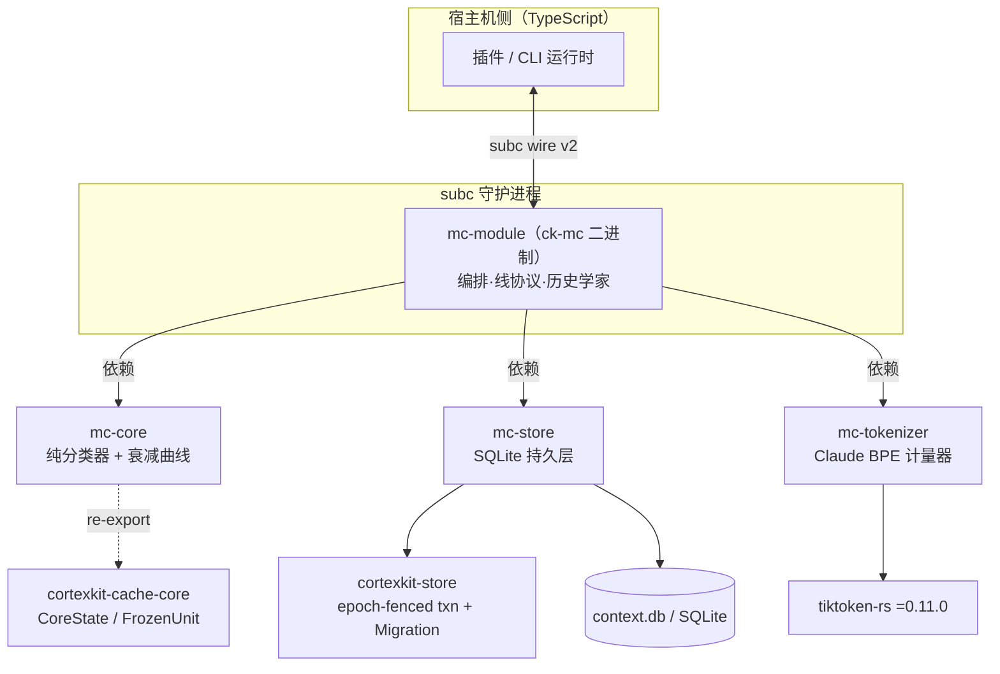

Magic Context 的 Rust 工作区（`crates/`）并非单体：它以三个互不渲染、各司其职的**基座 crate** 承托运行时的决策、持久化与计量职责——`mc-core` 是纯分类器与衰减模型，`mc-store` 是单写者的 SQLite 持久层，`mc-tokenizer` 是 Claude BPE 计量器。三者都不感知具体宿主（OpenCode / Pi / OMP），也不在目标运行时内做 I/O 之外的判断；真正的编排（subc 线协议、路由、历史学家产制）属于 `mc-module`。本页聚焦这一基座本身：它的职责切分、顺序不变量、并发契约与确定性保证。

Sources: [Cargo.toml](Cargo.toml#L1-L10), [crates/mc-core/Cargo.toml](crates/mc-core/Cargo.toml#L1-L15), [crates/mc-store/Cargo.toml](crates/mc-store/Cargo.toml#L1-L20), [crates/mc-tokenizer/Cargo.toml](crates/mc-tokenizer/Cargo.toml#L1-L24)

## 三核职责切分与依赖拓扑

理解这三个 crate，先要在脑中建立一条**依赖是有向且单向**的事实：`mc-module` 同时依赖三者，而三者之间彼此独立。`mc-core` 明确声明自己"不做渲染、不做 I/O"，被渲染的内容由消费它的 `mc-module` 提供；`mc-store` 只持久化 `cortexkit-cache-core` 的 `CoreState` 与一个 `ModuleMeta` blob；`mc-tokenizer` 甚至被设计成"可迁移清洁"——公共面只是一个 `estimate_tokens(&str) -> usize`，无 Magic-Context 耦合，以便未来迁入共享 `commons` 家。这种"基座不反向依赖编排"的约束，是缓存稳定性可以在三层间独立验证的前提。

Sources: [crates/mc-core/src/lib.rs](crates/mc-core/src/lib.rs#L1-L9), [crates/mc-store/src/lib.rs](crates/mc-store/src/lib.rs#L1-L11), [crates/mc-tokenizer/src/lib.rs](crates/mc-tokenizer/src/lib.rs#L20-L24)

下图给出三核与外部依赖的拓扑。读图前提：`cortexkit-cache-core` 提供冻结单元的语义（`CoreState` / `FrozenUnit` / `DurabilityClass`），`cortexkit-store` 提供带纪元栅栏的事务与迁移框架，`subc` 守护进程托管 `ck-mc` 二进制。图中实线为 Cargo 依赖，虚线为语义 re-export。

Sources: [Cargo.toml](Cargo.toml#L12-L40), [crates/mc-module/Cargo.toml](crates/mc-module/Cargo.toml#L18-L40)

三者的属性对比可以概括为下表。注意"不变量"一列——每个 crate 都有一项必须被其测试与调用方共同守护的核心性质，而非仅仅是功能集合。

| 维度 | mc-core（分类器） | mc-store（存储） | mc-tokenizer（分词器） |
|---|---|---|---|
| 源大小 | ~337 行（lib + decay） | ~29,533 行 | ~242 行 |
| 职责 | pass 路由决策 + tier 衰减 | 会话缓存态与元数据的持久化 | m0/history 预算拟合的 token 计量 |
| I/O | 无（纯函数） | SQLite 读写 | 无（纯函数 + 进程内缓存） |
| 关键不变量 | 规则顺序首匹配 + 破坏性清除仅限已知形状 | 写仅在状态真变时发生（no-write-on-defer） | 同文本跨运行/跨机计量比特一致 |
| `unsafe` | `#![forbid(unsafe_code)]` | `#![forbid(unsafe_code)]` | 未声明（依赖 tiktoken-rs 引擎） |
| 校验方式 | 单元测试 + decay 黄金 | 内联集成测试 | ID 序列差分黄金 |

Sources: [crates/mc-core/src/lib.rs](crates/mc-core/src/lib.rs#L9), [crates/mc-core/src/decay.rs](crates/mc-core/src/decay.rs#L1-L19), [crates/mc-store/src/lib.rs](crates/mc-store/src/lib.rs#L14), [crates/mc-tokenizer/src/lib.rs](crates/mc-tokenizer/src/lib.rs#L1-L24)

## 分类器 mc-core：无 I/O 的纯决策层

`mc-core` 的公共面由三部分组成：一个 `CkItem` trait、一个 `classify` 函数、以及对 `cortexkit-cache-core` 类型的 re-export（`Action`、`CoreState`、`DurabilityClass`、`FrozenUnit`、`PassInput`、`StepResult`）。它把"缓存核心"刻意保持在"哑"的状态——核心只冻结被交付的渲染单元，从不决定冻结什么；决定权由 `classify` 与消费方共同持有。

Sources: [crates/mc-core/src/lib.rs](crates/mc-core/src/lib.rs#L11-L18)

### CkItem 与分类输入

`CkItem` 是 origin-agnostic 的解码会话项抽象（不解析任何 provider 原始字节），四个方法承载了覆写边界计算所需的全部信息：`id()` 是覆写边界的稳定标识，`ordinal()` 是**跨谱系严格递增的绝对序号**（窗口起点会移动，序号不会），`bytes()` 是字节完整的渲染，`synthetic()` 默认 `false` 用于标记 m0/m1 这类模块合成块——合成项在边界/覆写/尾部计算前被剥离，绝不能冒充真实边界。

Sources: [crates/mc-core/src/lib.rs](crates/mc-core/src/lib.rs#L20-L39)

`ClassifierInput` 是一组由**消费模块**从已加载状态与传入数组计算出的布尔量。crate 本身对这些布尔量如何得出保持盲态：它从不检查冻结单元的字节或键。设计上最耐人寻味的是 `reductions_pending`——因为归约是单向且冻结后不可变的，所以"未见过的新目标 id"是纪元内可能发生的唯一"变化"，一个纯 id 集合成员测试即可判定，无需 payload 摘要；它与 `m1_revision_changed` 会被合并为**一次** SOFT，绝不产生两次缓存击穿。

Sources: [crates/mc-core/src/lib.rs](crates/mc-core/src/lib.rs#L41-L77)

### PassPlan：一次 pass 的路由结果

`PassPlan` 把"普通 Hard"、"遗留迁移（先清后 Hard）"、"Soft 增量"、"延迟回放（Defer）"以及"干净拒绝（Reject）"区分为互斥的枚举分支。其中 `Defer` 对应缓存核心的 `SoftPlus` 动作——不新渲染，缓存前缀保持字节一致，这正是"延迟工作不变量"在类型层的表达。

Sources: [crates/mc-core/src/lib.rs](crates/mc-core/src/lib.rs#L80-L95)

### classify 的九条规则与顺序不变量

`classify` 是一个**有序首匹配**分类器：先评估 Hard 触发与遗留/未知形状守卫，再落到 Soft 增量与 Defer。下表按源码顺序列出全部判定分支。

| 序 | 名称 | 触发条件 | 结果 |
|---|---|---|---|
| 1 | 引导 | `!initialized` | `Hard` |
| 2 | 遗留基线迁移 | `is_legacy_baseline` | `MigrateHard` |
| 2b | 缺 m1 可重建 | `cached_m1_missing` | `Hard` |
| 2c | 未知形状 | `!valid_m0m1_shape` | `Reject("unknown frozen-set shape")` |
| 3 | 渲染配置纪元变更 | `render_config_changed` | `Hard` |
| 4 | 硬触发（折叠/idle-ttl/压力） | `hard_fold_requested` | `Hard` |
| 5 | 对账·重物化 | `reconcile_pending && !boundary_present` | `Hard` |
| 6 | 对账·清除 | `reconcile_pending` | `Defer` |
| 7 | 软增量 | `boundary_present && bust_opportunity && (m1_revision_changed \|\| reductions_pending)` | `Soft` |
| 8 | 兜底延迟 | 其余 | `Defer` |

Sources: [crates/mc-core/src/lib.rs](crates/mc-core/src/lib.rs#L114-L158)

源码文档注释明确标出了三处**承重的顺序事实**。其一，规则 2/2b 紧随引导之后，使破坏性清除**只**对精确的遗留单 `"baseline"` 形状触发，任何其他无法识别的形状都走规则 2c 报错而绝不被清除。其二，规则 6（对账清除延迟）先于规则 7（软增量），因为核心的 `step_soft` 从不触碰 `reconcile_pending`——带该标志的 pass 必须先用 `step_defer` 清标志，被延迟的 m1 增量在下一 pass 重新推导。其三，规则 7 同时要求 `boundary_present` 与 `bust_opportunity`：会话内信号不匹配只是"待办工作"，本身并不构成改写 provider 可见字节的许可。

Sources: [crates/mc-core/src/lib.rs](crates/mc-core/src/lib.rs#L97-L113)

规则 7 的另一个输入 `bust_opportunity` 是"独立性"的显式门控：它由模块在识别出一个**独立渲染**（hard arm、显式刷新、force/emergency drive、或首次归约应用）后提供。因此"边界缺失 + 增量"会落到规则 8（Defer + 经 `step_defer` 置 reconcile），使增量在对账解决后重新推导，而非 Soft 击穿 m1 断点并搁浅标志。

Sources: [crates/mc-core/src/lib.rs](crates/mc-module/src/transform.rs#L2894-L2905), [crates/mc-module/src/transform.rs](crates/mc-module/src/transform.rs#L2890-L2893)

分类器行为被一整套针对性单元测试逐条钉死：引导为 Hard、遗留迁移优先于形状校验、缺失 m1 重建为 Hard、未知形状 Reject、纪元/硬触发为 Hard、对账的两个方向、无 bust 机会时延迟、以及"边界缺失时新归约必须 Defer 绝不 Soft"。这些测试让"顺序即语义"这一性质在重构中可被机器守护。

Sources: [crates/mc-core/src/lib.rs](crates/mc-core/src/lib.rs#L160-L337)

### decay.rs：确定性衰减曲线

`mc-core` 的第二个纯模块是分区 tier 衰减。它选择每个历史分区的渲染档位（P1..P4）或归档（P5，不渲染），完全由分区**年龄、重要性（语义上是衰减率）、以及实时预算压力**驱动，无需 LLM 调用。模型超参与边界值是逐值复现的：半衰期 `H50 = 24.0`、翻倍点数 `D = 25.0`、锚点重叠加成 `G = 2.0`，以及四个由相邻实测档位成本几何均值导出的对数成本边界 `Z1..Z4 = 0.201 / 0.729 / 1.322 / 2.587`，压力下限 `P_FLOOR = 0.1`。

Sources: [crates/mc-core/src/decay.rs](crates/mc-core/src/decay.rs#L1-L42)

核心公式是被半衰期缩放的年龄 `z = a / H`，其中 `H = H50 · 2^((imp−50)/D) / p`；档位即 `z` 落入的 `Z` 区间。`rendered_tier` 在归档判定之上把非归档分区的渲染档位封顶在 P4（P5 保留给真正的归档），而 `should_archive` 允许锚点重叠把 P4 保护最多延长 `G` 个半衰期。

Sources: [crates/mc-core/src/decay.rs](crates/mc-core/src/decay.rs#L61-L124)

预算压力 `compute_budget_pressure` 做单次前向扫描自调：由于 `H ∝ 1/p`，各档位分区计数随 `1/p` 缩放，故 `C(p) ≈ C(1)/p`，取 `p = C(1)/B` 即令 `C(p) ≈ B`；被归档的分区渲染为空串，因此按 P5 占位成本计费会凭空制造压力，代码显式跳过了它们。

Sources: [crates/mc-core/src/decay.rs](crates/mc-core/src/decay.rs#L126-L145)

与分类器一样，衰减模型的不变量被双重守护：一组"按构造成立"的模型不变量测试（最新分区恒为 P1、年龄单调降级、重要性保护、压力加速降级、最大重要性仍有限降级、压力向预算自调），以及一份与参考 TS 实现对比的 `decay_golden_matches_reference` 差分黄金。后者被注释明确标注为"开发期交叉校验"而非运行时不变式——在目标环境里只有本实现渲染，因此保证的是**模块内确定性**（同输入→同档位→同字节），而非与 TS 的比特一致。

Sources: [crates/mc-core/src/decay.rs](crates/mc-core/src/decay.rs#L15-L19), [crates/mc-core/src/decay.rs](crates/mc-core/src/decay.rs#L147-L302)

## 存储 mc-store：单写者持久层

`mc-store` 是三者中体量最大者（约 29,533 行），持久化两个对象：每会话的 `cortexkit-cache-core` `CoreState`，以及一个小的 `module_meta` blob（承载 `initialized`、`last_render_config`、`coverage_ordinal` 等）。它的核心契约写在模块头注释里：**只有在持久状态真正变化时一次 pass 才写**——纯 SoftPlus 回放不改动任何东西、也不写任何东西，这就是 no-write-on-defer 保证。

Sources: [crates/mc-store/src/lib.rs](crates/mc-store/src/lib.rs#L1-L11)

### 双保险并发模型：epoch 栅栏 + row_version CAS

写入路径刻意叠加了两道互不重叠的门。第一道是 `cortexkit-store` 提供的**纪元栅栏事务**，它只拒绝严格更新的写者（即 lease 易手场景）；关键洞察是**同纪元的第二个写者并不会被栅栏拦住**。因此第二道门必不可少：事务内应用层的 `row_version` CAS，正是它捕获同纪元的并发写者。

Sources: [crates/mc-store/src/lib.rs](crates/mc-store/src/lib.rs#L5-L11)

这个 CAS 的具体形态是：`McStore::commit` 接收调用方从 `load` 读到的 `expected: Option<u64>`（`None` 表示预期无行 → INSERT），成功则 `row_version` 加一。`commit_transform` 在栅栏事务内先以 `SELECT COALESCE((SELECT row_version …), NO_ROW)` 读出当前值，比对 `expected`；不匹配则返回 `CasConflict(found)`——注意这是被建模为**返回值而非错误**，冲突 pass 只提交一个空事务，调用方重新 `load` 后重新 step。

Sources: [crates/mc-store/src/lib.rs](crates/mc-store/src/lib.rs#L10085-L10105), [crates/mc-store/src/lib.rs](crates/mc-store/src/lib.rs#L10147-L10225), [crates/mc-store/src/lib.rs](crates/mc-store/src/lib.rs#L5625-L5633)

`NO_ROW = -1` 是"无行存在"的哨兵语义（在事务内以 COALESCE 默认值注入）。事务的实际写入是一条 `INSERT … ON CONFLICT(session_id) DO UPDATE`，在同一个栅栏事务里完成引导（无行可 UPDATE）与常规提交两种情形，并同步维护 `last_activity_at`。

Sources: [crates/mc-store/src/lib.rs](crates/mc-store/src/lib.rs#L450-L451), [crates/mc-store/src/lib.rs](crates/mc-store/src/lib.rs#L10310-L10319)

同一种 CAS 纪律被复用于多个子系统：`reset_session_for_recomp` 在事务内先读 `row_version` 与 `meta`，`expected_row_version` 不匹配即返回 `CasConflict`；`replace_compartments` 则在同一栅栏事务中先清 transcript 与分区再逐行重插。`McStoreError` 因此专门区分 `CasConflict`（同写者竞争）与 `AuthorityStateMismatch` / `AuthorityGenerationMismatch`（授权状态/世代错配），让调用方可以分辨"另一个写者先提交了"与"本产出者已过期"。

Sources: [crates/mc-store/src/lib.rs](crates/mc-store/src/lib.rs#L11947-L11966), [crates/mc-store/src/lib.rs](crates/mc-store/src/lib.rs#L11984-L12007), [crates/mc-store/src/lib.rs](crates/mc-store/src/lib.rs#L5410-L5445)

### 模式与迁移链

存储使用独立的迁移命名空间 `NS = "mc_cache"`——注释指出一个数据库可承载多个独立命名空间，本 crate 只拥有自己那一个。`McStore::open` 先注册三个标量 UDF（`mc_note_caller_project`、`mc_facade_authority_domain`、`mc_facade_authority_route`，供旧形状/超前数据库的 UDF 触发器使用），再调用 `inner.migrate(NS, MIGRATIONS)` 应用**全部**捆绑迁移。

Sources: [crates/mc-store/src/lib.rs](crates/mc-store/src/lib.rs#L446-L448), [crates/mc-store/src/lib.rs](crates/mc-store/src/lib.rs#L7209-L7265)

这里有一个刻意的设计取舍：store **没有**单独的 fence 常量，因为 open 时会应用每一条捆绑迁移，于是"最新捆绑迁移即本二进制的支持上限"。`LATEST_MIGRATION_VERSION` 因此是**编译期从 `MIGRATIONS` 数组折叠算出**的常量（`const fn` 式的 while 循环），避免了第二个可能与迁移列表漂移的事实来源；状态面直接上报它来回答"本二进制支持哪个 schema"。

Sources: [crates/mc-store/src/lib.rs](crates/mc-store/src/lib.rs#L2834-L2851)

当前迁移链为 **v1–v54 连续 54 条**。若打开一个由更长链写出的 store（`migration.store_ahead()`），启动**不**拒绝，只打印一行可归因于版本偏斜的提示——这是有意保留的"回滚形状"（允许较旧 `ck-mc` 被放回）。

Sources: [crates/mc-store/src/lib.rs](crates/mc-store/src/lib.rs#L479-L498), [crates/mc-store/src/lib.rs](crates/mc-store/src/lib.rs#L7266-L7278)

迁移 1 定义了最核心的表 `mc_cache_state(session_id, row_version, core_state, meta)`；`last_activity_at` 是后续迁移追加的列（回填为当前毫秒）。迁移 2 起引入分区历史表 `mc_compartments`，其 `sequence` 为时间序（1 = 最旧），`p1..p4` 为四档改写，`importance` 为衰减率（1..100），`legacy=1` 标记无改写的旧扁平行。

Sources: [crates/mc-store/src/lib.rs](crates/mc-store/src/lib.rs#L499-L531), [crates/mc-store/src/lib.rs](crates/mc-store/src/lib.rs#L1946-L1949)

### 表域划分

约 53 张表按职责可归入若干域。下表给出面向架构理解的分组（非穷举列名）。值得注意的是"影子"（shadow）系列专用于 TS↔Rust 状态同步与分歧记录，而 `mc_authority` / `mc_changefeed` 系列承担镜像投影与变更投递。

| 域 | 代表表 | 作用 |
|---|---|---|
| 缓存态 | `mc_cache_state` / `mc_pass_trace` / `mc_overlay_frontiers` | 会话缓存行、pass 轨迹、覆写前沿 |
| 历史与标签 | `mc_compartments` / `mc_chunk_transcripts` / `mc_tags` / `mc_channel1_appends` | m0/m1 渲染源、可恢复原文、标签面 |
| 记忆 | `mc_memories` / `mc_memory_mutation_log` / `mc_memory_mappings` / `mc_memory_visibility_epoch` | 项目记忆、变更日志、映射与可见性纪元 |
| 用户侧记忆 | `mc_user_memories` / `mc_primer_candidates` / `mc_user_memory_candidates` | 用户画像与候选 |
| 笔记 | `mc_notes` / `mc_note_deliveries` | 编译态笔记与投递 |
| 工作区共享 | `mc_workspaces` / `mc_workspace_members` | 跨项目可见性 |
| 授权与镜像 | `mc_authority` / `mc_changefeed` / `mc_authority_route_bindings` / `mc_privilege_state` | 授权状态机、变更馈送、路由绑定 |
| 影子同步 | `shadow_memories` / `shadow_memory_mutation_log` / `shadow_divergences` / `shadow_user_profile` | TS 镜像与分歧 |
| 编排 | `mc_historian_side_channel_outbox` / `mc_wrapup_commands` / `mc_recomp_commands` / `mc_dream_task_commands` / `pending_agent_drops` | 历史学家侧信道、wrapup/recomp/dream 命令 |

Sources: [crates/mc-store/src/lib.rs](crates/mc-store/src/lib.rs#L479-L2833), [crates/mc-store/src/lib.rs](crates/mc-store/src/lib.rs#L730-L760), [crates/mc-store/src/lib.rs](crates/mc-store/src/lib.rs#L987-L998), [crates/mc-store/src/lib.rs](crates/mc-store/src/lib.rs#L1208-L1260)

### 读取路径与会话生命周期

读取侧的入口是 `McStore::load`：单条 `SELECT row_version, core_state, meta FROM mc_cache_state WHERE session_id = ?1`，若无行则返回默认的 `LoadedState`（未初始化、无 row_version），使分类器随即引导。`LoadedState` 把从磁盘读到的 `row_version` 一并交出，供调用方回传给 `commit` 作为 CAS 期望。

Sources: [crates/mc-store/src/lib.rs](crates/mc-store/src/lib.rs#L7952-L7987), [crates/mc-store/src/lib.rs](crates/mc-store/src/lib.rs#L5158-L5165)

除 `load` 外，还有更窄的读入口：`load_state_sync_inventory`（不水合冻结单元或分区摘要体）、`load_transform_snapshot`（一次快照读出缓存态与全部影响字节的覆写，并附带 `TransformSnapshotTimings` 的查询耗时分解）。会话销毁由 `delete_session` 承担，它**动态枚举** `sqlite_master` 中所有含 `session_id` 列的表并删除对应行——`mc_notes` 因含 `project_path` 与 `type` 需额外限定 `type='session'`。这种"按列存在性驱动"的实现，使新增会话级表无需改动删除逻辑。

Sources: [crates/mc-store/src/lib.rs](crates/mc-store/src/lib.rs#L7989-L8016), [crates/mc-store/src/lib.rs](crates/mc-store/src/lib.rs#L8017-L8020), [crates/mc-store/src/lib.rs](crates/mc-store/src/lib.rs#L5167-L5178), [crates/mc-store/src/lib.rs](crates/mc-store/src/lib.rs#L7905-L7948)

### 压缩、规范化与工具函数

大体量原文不直接落库：分区 chunk transcript 与原始消息以 deflate 压缩存储（`DeflateEncoder` / `DeflateDecoder`，`Compression::fast()`）。解压侧有双重封顶以防"小压缩行放大为巨量分配"——压缩上限 `MAX_CHUNK_TRANSCRIPT_COMPRESSED_BYTES = 256 KiB`、膨胀上限 `MAX_CHUNK_TRANSCRIPT_INFLATED_BYTES = 512 KiB`，两者不满足时以截断标记代替失败。

Sources: [crates/mc-store/src/lib.rs](crates/mc-store/src/lib.rs#L19), [crates/mc-store/src/lib.rs](crates/mc-store/src/lib.rs#L452-L456), [crates/mc-store/src/lib.rs](crates/mc-store/src/lib.rs#L17534-L17585)

规范化与去重方面，`compute_normalized_memory_hash` 把记忆内容小写、按空白切分后以单空格重连，再做 MD5 得到 32 位十六进制摘要——这是记忆去重 `UNIQUE(project_path, category, normalized_hash)` 的输入。而 `coalesce_mutations` 把变更日志行折叠为"每目标记忆一行"，规则是确定性的 latest-wins 且**终态优先**（terminal 的 archive/delete/superseded 无论 id 序如何都压过非终态 update）；可见性标记在折叠中是粘性的，因为即使后续内容更新被选中，当前渲染资格仍需被重对账。

Sources: [crates/mc-store/src/lib.rs](crates/mc-store/src/lib.rs#L18521-L18529), [crates/mc-store/src/lib.rs](crates/mc-store/src/lib.rs#L18547-L18572)

路径规范化是另一个跨 lane 的一致性问题：`canonical_root` 在把文件系统路径作为谱系状态前先 canonicalize，因为同一目录可经符号链接以不同拼写被观测到，按字符串比较会让有效会话看起来未解析；若根在请求到达时已被删除，则保留输入拼写而非把规范化变成请求失败。

Sources: [crates/mc-store/src/lib.rs](crates/mc-store/src/lib.rs#L37-L46)

## 分词器 mc-tokenizer：预算度量层

`mc-tokenizer` 是一个 **bit-faithful 的 Rust 移植**：复刻 `ai-tokenizer` 的 `claude` 编码，也就是 TS 侧 `estimateTokens` 所用的编码。理解它需要先理解 TS 语义——`estimateTokens(text)` 实为 `Tokenizer(claudeEncoding).encode(text, "all").length`，而 `"all"` 模式把特殊 token 子串当作**字面文本**做字节 BPE（例如 `<EOT>` 变为 4 个字节 token，而非特殊 rank），即"无特殊 token 处理的纯字节 BPE"，正好等价于 tiktoken 的 `encode_ordinary` / `count_ordinary`。

Sources: [crates/mc-tokenizer/src/lib.rs](crates/mc-tokenizer/src/lib.rs#L1-L11)

### 词表与 pat_str

实现基于两份编译期嵌入的常量：词表 `CLAUDE_TIKTOKEN`（`include_str!` 自 `assets/claude.tiktoken`，约 65,000 行、1.07 MB，格式为每行 `base64(token_bytes) SP rank`），以及预切分模式 `CLAUDE_PAT_STR`（标准 GPT-2 模式：缩写、字母连续、数字连续、标点连续、空白，末尾带 `(?!\S)` 前瞻）。词表在构建期嵌入，因此运行时**无文件读取、无网络请求**——两者都会破坏 resume 时的确定性保证。

Sources: [crates/mc-tokenizer/src/lib.rs](crates/mc-tokenizer/src/lib.rs#L33-L44)

词表由 dev-only 生成器 `gen/gen-claude-vocab.ts` 产出：它从已安装的 `ai-tokenizer/encoding/claude` 读取其**双存储形态**（`stringEncoder` + `binaryEncoder`），统一为单一 `bytes → rank` 映射再写出。BPE 引擎由 `tiktoken-rs` 构建，且被**精确锁定**在 `=0.11.0`（首个提供 `count_ordinary` 的版本）——因为跨 resume 的确定性取决于同一套 tiktoken-rs 与 fancy-regex 版本（Unicode 类别行为），所以注释明确要求把版本提升视为**渲染器变更**。

Sources: [crates/mc-tokenizer/gen/gen-claude-vocab.ts](crates/mc-tokenizer/gen/gen-claude-vocab.ts#L1-L32), [crates/mc-tokenizer/Cargo.toml](crates/mc-tokenizer/Cargo.toml#L13-L24), [Cargo.lock](Cargo.lock#L1137-L1140)

`tokenizer()` 以 `OnceLock` 惰性构建一次 `CoreBPE`：逐行解析 base64 与 rank 填入 `FxHashMap<Vec<u8>, Rank>`，特殊 token 编码器留空（因为 `estimate_tokens` 只做字节 BPE，永不查询 specials），再以 vendored pat_str 构造。`CoreBPE::new` 要求 `rustc-hash` 的 `FxHashMap` 作为映射类型，故 crate 必须匹配 tiktoken-rs 的 `rustc-hash` 主版本（1.x），否则映射类型无法统一。

Sources: [crates/mc-tokenizer/src/lib.rs](crates/mc-tokenizer/src/lib.rs#L46-L68), [crates/mc-tokenizer/Cargo.toml](crates/mc-tokenizer/Cargo.toml#L19-L24)

### estimate_tokens、history_paragraph_counts 与 LRU 缓存

公共运行 API 是 `estimate_tokens(&str) -> usize`：空文本返回 0（匹配 TS 的 falsy 守卫），否则走带缓存的计数。`history_paragraph_counts` 返回一对计数——"段落在输入端末尾"与"段落后跟随 `\n\n## ` 标题"两种情形；续接计数包含两个连接换行而非下一个标题，调用方求和时间须保留该分隔符与标题前缀。

Sources: [crates/mc-tokenizer/src/lib.rs](crates/mc-tokenizer/src/lib.rs#L70-L106)

缓存键是一个巧妙的启发式：`count_history_cached` 以 `text.match_indices("\n\n## ")` 切分，因为标题前恒有两个换行，故没有任何 Claude 预切分片段会跨越这一边界。续接计数通过 `format!("{text}#")` 并减一实现——哨兵保留了非末段空白正则的输入末尾前瞻。缓存为进程级、字节封顶 8 MiB（`HISTORY_CACHE_BYTES`）的 LRU（`HistoryCounts` 用 `entries` + `age: BTreeMap` + 单调 `clock` 维持），超预算的块绕过缓存，逐出为最近最少使用。

Sources: [crates/mc-tokenizer/src/lib.rs](crates/mc-tokenizer/src/lib.rs#L80-L110), [crates/mc-tokenizer/src/lib.rs](crates/mc-tokenizer/src/lib.rs#L114-L169)

并发上有一处刻意的非阻塞设计：`count_history_cached` 用 `try_lock` 获取缓存互斥量，若另一个 transform 正在填冷缓存，则直接回落到无缓存的 `count_ordinary`，绝不等待。

Sources: [crates/mc-tokenizer/src/lib.rs](crates/mc-tokenizer/src/lib.rs#L83-L88)

### 为何计量必须确定

确定性是这一层**承重的**性质：缓存稳定性核心只在 HARD m0 重物化时调用它，而一次 resume 必须产出字节一致的 m0。因此词表是 vendored 且冻结的，tiktoken-rs 与 fancy-regex 被版本锁定，同一文本在任何运行与任何机器上都必须计量一致。与 TS `ai-tokenizer` 的比特一致是**忠实度目标**（由 tests 中的差分黄金验证），而非运行时不变式——目标环境里只有本实现运行。

Sources: [crates/mc-tokenizer/src/lib.rs](crates/mc-tokenizer/src/lib.rs#L13-L19)

`encode_ordinary` 被额外公开，专门用于差分黄金：它断言**完整 token-ID 序列**与 `ai-tokenizer` 一致，比只对计数更强——后者可能在一个"错但等长"的编码上侥幸通过。黄金夹具 `testdata/token-golden.json` 含 36 个对抗性用例，由 `gen/gen-token-golden.ts` 从插件实际使用的同一 TS tokenizer 生成；测试同时验证 ID 序列、计数、空文本为 0，以及"同一文本 1000 次调用计数不变"的缓存稳定性不变量。

Sources: [crates/mc-tokenizer/src/lib.rs](crates/mc-tokenizer/src/lib.rs#L172-L177), [crates/mc-tokenizer/tests/token_golden.rs](crates/mc-tokenizer/tests/token_golden.rs#L1-L74), [crates/mc-tokenizer/gen/gen-token-golden.ts](crates/mc-tokenizer/gen/gen-token-golden.ts#L1-L30)

## 三核如何被编排消费

三者被 `mc-module` 的 transform 路径粘合在一起，构成一次 pass 的完整闭环：模块先从 `McStore` 加载 `LoadedState`，从状态与请求算出 `ClassifierInput`（包括 `bust_opportunity`、`m1_revision_changed`），调用 `mc_core::classify` 得到 `PassPlan`，再按 plan 分派到 Hard/Soft/Defer 渲染分支；渲染期间以注入的 `estimate_tokens` 做预算拟合；最后用 `LoadedState.row_version` 作为 CAS 期望调用 `McStore::commit`。

Sources: [crates/mc-module/src/transform.rs](crates/mc-module/src/transform.rs#L2878-L2920), [crates/mc-module/src/transform.rs](crates/mc-module/src/transform.rs#L56-L57)

`classify` 的输入并非由 crate 自行推导，而是由模块侧的形状探针计算——`is_legacy_baseline`（恰好一个 `"baseline"` 且无 pending）、`cached_m1_missing`（有 m0 无 m1 且其余键受限）、`valid_m0m1_shape`（恰好一个 m0、一个 m1，外加允许的 `red:` / `strip:` / mural / transition 键）。这正是 crate 保持盲态、模块承担形状语义的分工。

Sources: [crates/mc-module/src/transform.rs](crates/mc-module/src/transform.rs#L6787-L6840)

分词器的消费点是预算拟合：衰减渲染 `decay_render.rs` 从 `mc_core::decay` 取 `compute_budget_pressure` / `rendered_tier` / `DecayInput`，`estimate_tokens` 以**闭包注入**以保持渲染器纯净（测试可替换），而 m0 组装 `m0_compose.rs` 同样以注入的 `estimate_tokens` 逐候选计费。下表概括一次 pass 中三核的调用顺序。

| 阶段 | 调用 | crate | 产物 |
|---|---|---|---|
| 载入 | `McStore::load` / `load_transform_snapshot` | mc-store | `LoadedState`（含 `row_version`） |
| 判形 | 形状探针 → `ClassifierInput` | mc-module | 布尔向量 |
| 决策 | `mc_core::classify` | mc-core | `PassPlan` |
| 渲染 | decay 档位 + `estimate_tokens` 预算拟合 | mc-core / mc-tokenizer | m0/m1/归约字节 |
| 提交 | `McStore::commit`（CAS） | mc-store | 新的 `row_version` 或 `CasConflict` |

Sources: [crates/mc-module/src/decay_render.rs](crates/mc-module/src/decay_render.rs#L15-L19), [crates/mc-module/src/decay_render.rs](crates/mc-module/src/decay_render.rs#L83-L89), [crates/mc-module/src/m0_compose.rs](crates/mc-module/src/m0_compose.rs#L182-L207), [crates/mc-module/src/transform.rs](crates/mc-module/src/transform.rs#L2944-L3100)

## 验证策略小结

三核各自的验证形态反映了它们的不同风险面。`mc-core` 用规则级单元测试 + decay 差分黄金，因为顺序与浮点边界是它的全部语义。`mc-store` 用内联集成测试守护 CAS、事务原子性与会话清理（例如"删除只清拥有行而不碰其他会话"、"pending drop 只在成功提交事务内删除"）。`mc-tokenizer` 用 ID 序列黄金守护移植忠实度。

Sources: [crates/mc-store/src/lib.rs](crates/mc-store/src/lib.rs#L18769-L18780), [crates/mc-store/src/lib.rs](crates/mc-store/src/lib.rs#L19432-L19440), [crates/mc-tokenizer/tests/token_golden.rs](crates/mc-tokenizer/tests/token_golden.rs#L26-L57)

需要注意 store 的测试与种子辅助被 `test-support` feature 门控：`mc-module` 组合测试需要填充记忆与变更日志，故该 feature 在 dev-dependencies 中启用，而写入器**绝不进入生产构建**。这是"测试能力不与运行时攻击面同构"的具体体现。

Sources: [crates/mc-store/Cargo.toml](crates/mc-store/Cargo.toml#L14-L17), [crates/mc-module/Cargo.toml](crates/mc-module/Cargo.toml#L46-L52)

## 延伸阅读

三核是更大运行时的地基。若要理解它们被谁、以何种协议调用，继续阅读 [Rust 运行时模式与 subc 模块集成](25-rust-yun-xing-shi-mo-shi-yu-subc-mo-kuai-ji-cheng)；缓存稳定性为何要求"延迟不改写"这一不变量，见 [缓存稳定性的核心设计哲学](8-huan-cun-wen-ding-xing-de-he-xin-she-ji-zhe-xue) 与 [变更门控与延迟工作不变量](11-bian-geng-men-kong-yu-yan-chi-gong-zuo-bu-bian-liang)；分区档位衰减的渲染侧细节见 [分区衰减渲染与重要性分级](14-fen-qu-shuai-jian-xuan-ran-yu-zhong-yao-xing-fen-ji)；而 store 的表域与迁移约定在 [SQLite 存储模式、迁移与时间戳约定](21-sqlite-cun-chu-mo-shi-qian-yi-yu-shi-jian-chuo-yue-ding) 中有更宏观的对照。