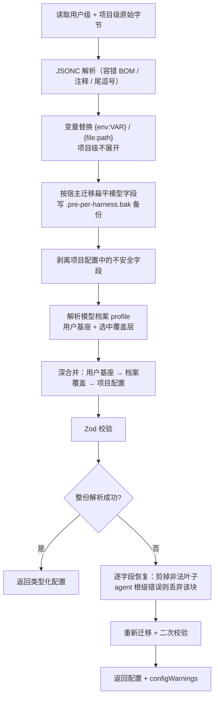
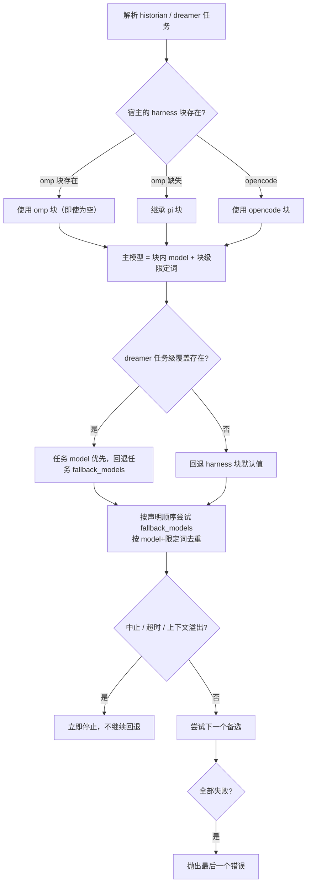

Magic Context 的行为几乎全部由一份 `magic-context.jsonc` 驱动：它决定插件是否启用、缓存假设、记忆与嵌入策略，以及最容易被忽视的一层——**隐藏代理（hidden agents）用哪个模型跑**。本页聚焦两件事：这份配置是**如何被读取、合并与校验**的，以及 historian / dreamer 这类后台代理的**模型选择与回退**是如何解析的。目标读者是刚接触本项目的开发者：读完你应当能独立写出正确的按 harness 模型配置，并理解为什么某些字段在项目配置里"写了但没生效"。

## 配置文件的位置与合并优先级

配置只从一个共享的 CortexKit 位置读取，OpenCode、Pi、OMP 三个宿主共用同一套文件，因此同一份 historian 模型定义可以跨宿主复用（宿主差异通过文件内部的 harness 块表达，见后文）。**项目配置总是合并叠加在用户配置之上**，用户级文件由统一安装向导（`npx @cortexkit/magic-context@latest setup`）写入默认值。

| 路径 | 作用域 |
|---|---|
| `<project>/.cortexkit/magic-context.jsonc` | 项目级，覆盖用户级 |
| `~/.config/cortexkit/magic-context.jsonc` | 用户级默认值 |

Sources: [CONFIGURATION.md](CONFIGURATION.md#L5-L14), [README.md](README.md#L335-L339)

早期版本的配置分散在各宿主自己的路径下（`~/.config/opencode/`、`~/.pi/agent/`、项目根目录等）。升级后的首次运行会自动把旧配置迁移到 CortexKit 位置，并在原路径留下一个纯人类可读的 `.MOVED_READPLEASE` 面包屑；加载器从不读取该标记，后续运行发现没有旧来源即直接 no-op。如果共享基座缺失而旧配置存在，加载器会走"读取本宿主旧文件"的回退路径，避免直接落到 schema 默认值、变相重新打开用户已关闭的功能。

Sources: [CONFIGURATION.md](CONFIGURATION.md#L16-L16), [packages/plugin/src/config/migrate-config-location.ts](packages/plugin/src/config/migrate-config-location.ts#L30-L36), [packages/plugin/src/config/index.ts](packages/plugin/src/config/index.ts#L629-L667)

## 从磁盘到生效配置：完整解析管线

配置的解析不是"读 JSON 再校验"这么简单，而是一条有明确阶段顺序的管线。顺序本身是契约：结构迁移必须在 schema 校验之前发生，否则旧的扁平字段会被判为非法；档案叠加必须在项目配置合并之前发生，否则不受信任的仓库内容可能影响模型选择。



Sources: [packages/plugin/src/config/index.ts](packages/plugin/src/config/index.ts#L621-L751), [packages/plugin/src/config/raw-loader.ts](packages/plugin/src/config/raw-loader.ts#L45-L48)

管线的设计原则是**永不让一份写坏的配置把插件整体关掉**。当整份 schema 校验失败时，加载器按 Zod 报告的路径逐字段恢复：对象键只剪掉最深的那片非法叶子并保留合法兄弟字段；而 `historian` / `dreamer` 这类代理块的根级或不可达错误则**整块丢弃**，因为"猜一个模型配置"可能选中昂贵且非预期的模型。两次都失败时才回落到全默认值，但仍保留 `enabled: true`。配置警告按 `file-parse`、`file-io`、`invalid-leaf` 三类结构化，并广播到 OpenCode banner、Pi 会话启动通知与 `/ctx-status`。

Sources: [packages/plugin/src/config/index.ts](packages/plugin/src/config/index.ts#L397-L549), [packages/plugin/src/shared/config-diagnostics.ts](packages/plugin/src/shared/config-diagnostics.ts#L1-L7), [ARCHITECTURE.md](ARCHITECTURE.md#L25-L25)

## 隐藏代理是谁：historian 与 dreamer

"隐藏代理"指插件自己注册、不供用户直接选择的内部代理。它们以 `hidden: true` 与 `mode: "primary"` 注册，描述文本刻意保持通用（`Internal Magic Context maintenance agent`），以免被宿主的按名/按描述任务路由误挑去做无关工作。对外暴露模型配置入口的只有两个顶层块：**historian**（历史分区压缩的产制者）与 **dreamer**（空闲期的记忆维护），它们各自的专用子代理（如 `historian-editor`、`dreamer-docs`、`dreamer-classifier`、`dreamer-retrospective`）共享所属顶层块的模型与回退设置。

| 顶层块 | 角色 | 模型配置入口 |
|---|---|---|
| `historian` | 把旧原始历史压缩成分层分区；兼做 `/ctx-recomp` | `historian.opencode/pi/omp` |
| `dreamer` | 空闲期跑记忆核验、去重、画像提升等定时任务 | `dreamer.opencode/pi/omp`，可按任务覆盖 |

Sources: [packages/plugin/src/agents/hidden-agent-registrations.ts](packages/plugin/src/agents/hidden-agent-registrations.ts#L57-L75), [packages/plugin/src/agents/dreamer.ts](packages/plugin/src/agents/dreamer.ts#L1-L40), [CONFIGURATION.md](CONFIGURATION.md#L495-L499)

需要区分"配置存在"与"功能可用"：插件加载时并不强制 historian 模型存在，但**没有真实可用的 `historian.<harness>.model` 时 historian 运行会失败**，旧历史不会被摘要，反复失败会出现需要处理的提示，而 dreamer 是可选的（不配即视为不做周期性记忆合并）。这与"压缩开关"是两件事：后者由 `compaction.enabled` 在启动时解析。

Sources: [README.md](README.md#L116-L129), [CONFIGURATION.md](CONFIGURATION.md#L461-L473)

## 每个 harness 一个执行块

从某个版本起，historian / dreamer 的**模型解析字段**不再平铺在顶层，而是各自拥有独立的 `opencode`、`pi`、`omp` 执行块。宿主之间的模型限定词词汇表并不通用：OpenCode 用 `variant`，Pi / OMP 用 `thinking_level`。落盘对象因此是**严格模式**的——Pi/OMP 条目永远不接受 `variant`，OpenCode 条目不接受 `thinking_level`，越界键会被校验拒绝。顶层仍保留代理元数据（温度、提示词、工具、权限、`two_pass` 等），它们从不搬进 harness 块。

Sources: [CONFIGURATION.md](CONFIGURATION.md#L501-L536), [packages/plugin/src/config/schema/magic-context.ts](packages/plugin/src/config/schema/magic-context.ts#L173-L200)

条目有两种写法：纯字符串，或带限定词的对象。OMP 不提供独立词汇，而是复用 Pi 的 `thinking_level`，并额外接受 `auto` / `inherit`。**OMP 的整块优先级是"全有或全无"**：`historian.omp ?? historian.pi`——只要存在一个显式的 `omp` 对象，它即使是空对象也具有权威性（不会回落到 `pi` 的模型），只有当 `omp` 块完全缺失时才继承 Pi 块。

Sources: [packages/plugin/src/shared/model-resolution.ts](packages/plugin/src/shared/model-resolution.ts#L30-L61), [CONFIGURATION.md](CONFIGURATION.md#L422-L423), [README.md](README.md#L166-L166)

```jsonc
{
  "historian": {
    "two_pass": false,                                  // 元数据，留在顶层
    "opencode": {
      "model": { "model": "github-copilot/gpt-5.4", "variant": "high" },
      "fallback_models": ["anthropic/claude-sonnet-4-6"]
    },
    "pi": {
      "model": { "model": "github-copilot/gpt-5.4", "thinking_level": "high" },
      "fallback_models": ["anthropic/claude-sonnet-4-6"]
    },
    "omp": {
      "model": { "model": "opencode/gpt-5.4", "thinking_level": "auto" },
      "fallback_models": [
        { "model": "anthropic/claude-sonnet-4-6", "thinking_level": "inherit" }
      ]
    }
  }
}
```

Sources: [CONFIGURATION.md](CONFIGURATION.md#L501-L521)

dreamer 的结构多一层：调度信息（`schedule`、`promotion_threshold`）留在无宿主意涵的 `dreamer.tasks.<task>`，而该任务的模型覆盖（`model`、`fallback_models`、`thinking_level`/`variant`、`timeout_minutes`）放在对应宿主块内。禁用单个任务的方式是把它的顶层 `schedule` 设为 `""`——不存在单独的 `enabled` 键；即使被禁用，仍可用 `/ctx-dream <task>` 手动跑一次。

Sources: [CONFIGURATION.md](CONFIGURATION.md#L544-L588), [packages/plugin/src/features/magic-context/dreamer/task-config.ts](packages/plugin/src/features/magic-context/dreamer/task-config.ts#L12-L40)

### 扁平字段的自动迁移

若你的文件仍是旧形态，首次读取时会自动重写为按 harness 的形态；重写前会先在 `<config>.pre-per-harness.bak` 留一份逐字节的恢复副本。迁移清单是**穷举式**的，不存在兜底规则：historian/dreamer 的 `model`、`fallback_models`、`variant`、`thinking_level` 会被搬运（`variant` 只进 `opencode` 块，`thinking_level` 只进 `pi` 块），其余字段原地保留。OMP 用户无需额外迁移——`omp` 块缺失时它自行回落到 `pi` 块。

| 作用域 | 留在原层级 | 搬进匹配的 harness 块 |
|---|---|---|
| `historian` / `dreamer` | `temperature`、`top_p`、`prompt`、`tools`、`disable`、`maxSteps`、`permission`、`maxTokens` 等 | `model`、`fallback_models`、`variant`、`thinking_level` |
| `dreamer.tasks.<task>` | `schedule`、`promotion_threshold` | 上述模型字段 + `timeout_minutes` |

Sources: [CONFIGURATION.md](CONFIGURATION.md#L18-L30), [packages/plugin/src/config/schema/magic-context.ts](packages/plugin/src/config/schema/magic-context.ts#L122-L171), [packages/plugin/src/config/raw-loader.ts](packages/plugin/src/config/raw-loader.ts#L173-L211)

## 模型解析与回退：没有"内置模型链"

这是本项目最容易踩坑的一条规则：**Magic Context 不内置任何跨提供商的回退模型链**。历史上存在过一个硬编码链，结果对只有单一提供商的用户产生一连串 `Model not found` 报错——每一环都指向用户根本没有的提供商。现在只使用你显式配置的 `fallback_models`；不配置时，失败的模型只会原地重试，绝不会跳到未配置的模型上。



Sources: [CONFIGURATION.md](CONFIGURATION.md#L418-L427), [packages/plugin/src/shared/resolve-fallbacks.ts](packages/plugin/src/shared/resolve-fallbacks.ts#L3-L27), [packages/plugin/src/shared/model-resolution.ts](packages/plugin/src/shared/model-resolution.ts#L72-L128)

几条实现层面的精确语义值得记住。**主模型的限定词有两个来源**：条目对象内的 `variant`/`thinking_level` 优先，其次是块级的同名默认值。**回退按 `model + 限定词` 去重**——同一个模型配两个不同推理档位是两个有意的独立尝试，不会被合并。**dreamer 的模型继承是"任务级覆盖 → harness 默认"**（`compress-cues` 任务例外，它会在两者之间插入 harness 无关的 mural 字符串）。**回退迭代的停止条件是引擎级的**：中止、超时、上下文溢出都会立刻短路，因为换模型帮不上忙，必须交给紧急恢复路径处理；每个备选都获得完整的独立超时预算，而不是共享一份总额。极弱模型还可能被引导进入无休止的工具调用循环，因此隐藏代理都带有 `steps`/`maxSteps` 上限并在超时时被中止（historian 上限较低，dreamer 的维护循环留有余量）。

Sources: [packages/plugin/src/shared/model-resolution.ts](packages/plugin/src/shared/model-resolution.ts#L92-L206), [packages/plugin/src/shared/model-suggestion-retry.ts](packages/plugin/src/shared/model-suggestion-retry.ts#L56-L84), [CONFIGURATION.md](CONFIGURATION.md#L443-L444)

historian 还拥有一条**独占**的最后手段：当你没有配置任何 `fallback_models` 时，它可以退到你当前会话正在使用的模型——一个你显然已经拥有的模型。dreamer 没有这一条，只使用自己配置的回退。失败结构被结构化记录（`provider_timeout`、`provider_error`、`empty_completion`、`no_models`、`child_aborted` 等闭环词表），以便在仪表盘与任务横幅里显示"最后尝试的模型"和"试过的模型列表"。在 Rust 运行模式下，宿主会把解析后的 historian 模型链作为 `historian_model_chain` 传输给 subc 模块，保证两条引擎对"该用哪个模型"的判断一致。

Sources: [CONFIGURATION.md](CONFIGURATION.md#L424-L427), [packages/plugin/src/shared/model-suggestion-retry.ts](packages/plugin/src/shared/model-suggestion-retry.ts#L109-L126), [packages/plugin/src/hooks/magic-context/rust-mode-transform.ts](packages/plugin/src/hooks/magic-context/rust-mode-transform.ts#L1492-L1499)

在 OpenCode 侧，注册阶段只把**当前宿主**的模型字段投影到代理配置上：`resolveOpenCodeAgentOverrides` 会剥掉 `fallback_models`、`thinking_level`、所有 harness 块与 `tasks`，只保留主模型（外加 historian 固定的 32k 输出预算）。`thinking_level` 被从每个隐藏代理的覆盖项中剥离，因为它是 Pi 专有词汇（作为 `--thinking` 传给 Pi 子进程），泄漏到 OpenCode 代理配置上会成为未知键。historian 与 historian-editor 共用同一套覆盖项，因此二者始终同模型。

Sources: [packages/plugin/src/shared/model-resolution.ts](packages/plugin/src/shared/model-resolution.ts#L208-L243), [packages/plugin/src/index.ts](packages/plugin/src/index.ts#L917-L978)

## 模型档案（profiles）：一份配置、多套隐藏代理模型

当"工作仓库"和"个人仓库"需要不同的隐藏代理模型时，不必复制粘贴整套配置。用法是：在**用户配置**里定义若干命名档案，让每个工作仓库只写一个选择键。档案覆盖层只携带模型选择面（historian/dreamer 的模型、回退、推理限定词），任何与身份相关的设置（嵌入、存储、压缩、记忆）都在解析时被拒绝——这是刻意为之的收窄，确保档案不会顺手改变执行策略。

Sources: [CONFIGURATION.md](CONFIGURATION.md#L32-L69), [packages/plugin/src/config/schema/magic-context.ts](packages/plugin/src/config/schema/magic-context.ts#L394-L412), [README.md](README.md#L341-L359)

```jsonc
// ~/.config/cortexkit/magic-context.jsonc  —— 档案只允许定义在用户级
{
  "profile": "personal",
  "profiles": {
    "personal": {
      "historian": {
        "opencode": { "model": "anthropic/claude-sonnet-4-6" },
        "pi": { "model": "github-copilot/claude-sonnet-4-6" },
        "omp": { "model": "opencode/claude-sonnet-4-6", "thinking_level": "auto" }
      }
    },
    "work": {
      "historian": { "opencode": { "model": "openai/gpt-5.2-codex" } },
      "dreamer": { "opencode": { "model": "openai/gpt-5.2-codex" } }
    }
  }
}

// <work-repo>/.cortexkit/magic-context.jsonc  —— 项目只写选择键
{ "profile": "work" }
```

Sources: [CONFIGURATION.md](CONFIGURATION.md#L36-L67)

解析顺序是 **用户基座 → 选中的用户档案覆盖层 → 项目配置**，深合并意味着档案可以只覆盖某一个 harness 的模型而保留基座中其余的回退链与设置。项目级的选择键**优先于**用户级默认选择；但档案定义体本身只认用户级，项目配置里出现的 `profiles` 会被剥离并告警。选择键必须是**非空字符串**：项目中空的或非字符串的选择值会被忽略并告警，从而让用户级选择继续生效。档案解析刻意不保留任何进程级选择状态——每次按目录加载都重新解析，这样一个 Pi 的 `/cd` 或多根 OpenCode 会话不会借用另一个仓库选中的档案。

Sources: [packages/plugin/src/config/profiles.ts](packages/plugin/src/config/profiles.ts#L35-L106), [CONFIGURATION.md](CONFIGURATION.md#L69-L69), [packages/plugin/src/config/index.ts](packages/plugin/src/config/index.ts#L708-L728)

## 信任边界：项目配置能改什么、不能改什么

项目配置是**不受信任的仓库输入**。在它与用户配置合并之前，加载器会原地剥离一批字段，使克隆下来的仓库无法把后台 LLM 工作导向自己选的模型、无法重新授权隐藏代理、无法把私有文本送到自己选的嵌入端点。

| 被剥离/受限的字段 | 原因 |
|---|---|
| `historian` / `dreamer` 的模型解析字段（含各 harness 块与 `model`/`fallback_models` 条目内的键） | 模型开销与推理档位只归用户所有 |
| `profiles`（定义体） | 档案内容决定隐藏代理模型，必须留在受信任的用户级；项目只能选择名字 |
| 隐藏代理的 `prompt` / `permission` / `tools` / `system_prompt` | 仓库不得重新编程或重新授权隐藏代理 |
| `mural.model`（顶层、旧 experimental 拼写及隐藏代理下的嵌套位置） | 仓库不得决定项目记忆被发送到哪里 |
| `embedding.endpoint` / `embedding.provider` 及查询/文档前缀 | 仓库不得决定私有记忆文本的嵌入去向或改变送出的文本 |
| `language` | 该值会被注入隐藏代理提示词 |
| `fail_closed_blocking`、`debug_rpc`、`allow_home_project`、`sqlite.*`、`storage.enforce_private_permissions`、`auto_update` | 进程级/机器级开关，只归用户 |
| `execute_threshold_percentage` / `execute_threshold_tokens` | 项目级仅可"抬高门槛"（延后压缩），不能降低到强迫额外 historian 开销 |

Sources: [packages/plugin/src/config/project-security.ts](packages/plugin/src/config/project-security.ts#L316-L366), [CONFIGURATION.md](CONFIGURATION.md#L130-L143)

`transform_mode` 是刻意保留给项目级的一个例外：仓库可以把自身运行时切到实验性的 Rust 管线，但解析器要求受信任的用户级 `subc` 配置存在，Rust 才能真正激活。

Sources: [packages/plugin/src/config/project-security.ts](packages/plugin/src/config/project-security.ts#L347-L354)

## 编辑器支持与变量替换

在配置文件中加入 `$schema` 即可在 VS Code 等编辑器里获得自动补全与校验；两个安装向导都会自动写入这一行。任何字符串值都可以使用 `{env:VAR}` 引用环境变量，或用 `{file:path}` 内联外部文件内容——语义与 OpenCode 自身的配置替换一致，因此同一套写法可以跨 `opencode.jsonc` 与 `magic-context.jsonc` 复用，路径相对配置文件目录解析、`~/` 展开为家目录。与 OpenCode 不同的是，缺失值在本项目里产生**警告而非硬错误**，令牌会回落到空字符串；而项目级配置是仓库输入，因此**不展开含密钥的令牌**，只保留字面量并告警。

Sources: [CONFIGURATION.md](CONFIGURATION.md#L98-L108), [CONFIGURATION.md](CONFIGURATION.md#L657-L657), [packages/plugin/src/config/variable.ts](packages/plugin/src/config/variable.ts#L36-L70)

## 校验、警告与诊断

配置问题不会静默：`configWarnings` 会随加载结果一起返回，并被广播到 OpenCode banner、Pi 会话启动通知以及 `/ctx-status` 与状态对话框。`doctor` 命令是排查入口——它会自动探测已安装的宿主，检查安装、CLI 版本、插件注册、配置文件能否通过 schema 解析并加载、与其他上下文管理插件的冲突（含 OpenCode / Pi / OMP 的原生 compaction）、TUI 侧边栏配置、嵌入端点可达性与共享数据库完整性，并汇总为 `PASS X / WARN Y / FAIL Z`。另有只读的 `doctor list-hidden-sessions` 用于盘点可复用/已退役的 OpenCode 2 隐藏运行根。

| 警告类别 | 含义 | 处理 |
|---|---|---|
| `file-parse` | JSONC 本身解析失败 | 使用深度导入的解析器尽力恢复，并大声广播 |
| `file-io` | 文件读取失败 | 报错并回退 |
| `invalid-leaf` | 某一具体字段值非法 | 仅剪掉该叶子，其余字段照常生效 |

Sources: [CONFIGURATION.md](CONFIGURATION.md#L145-L168), [packages/plugin/src/shared/config-diagnostics.ts](packages/plugin/src/shared/config-diagnostics.ts#L1-L7), [ARCHITECTURE.md](ARCHITECTURE.md#L25-L25)

## 一个完整的按 harness 配置示例

下面是最小可用形态的推荐写法：为每个宿主各写一个模型块，把元数据留在顶层。注意 `historian.<harness>.model` 必须是真实的 `provider/model-id`，否则插件能加载但 historian 运行会失败。

```jsonc
{
  "$schema": "https://raw.githubusercontent.com/cortexkit/magic-context/master/assets/magic-context.schema.json",

  "historian": {
    "maxTokens": 32000,
    "opencode": {
      "model": { "model": "github-copilot/gpt-5.4", "variant": "high" },
      "fallback_models": ["anthropic/claude-sonnet-4-6"]
    },
    "pi": {
      "model": { "model": "github-copilot/gpt-5.4", "thinking_level": "high" },
      "fallback_models": ["anthropic/claude-sonnet-4-6"]
    },
    "omp": {
      "model": { "model": "opencode/gpt-5.4", "thinking_level": "auto" },
      "fallback_models": [
        { "model": "anthropic/claude-sonnet-4-6", "thinking_level": "inherit" }
      ]
    }
  },

  "dreamer": {
    "opencode": { "model": "anthropic/claude-sonnet-4-6" },
    "tasks": {
      "verify": { "schedule": "0 3 * * *" },
      "maintain-docs": { "schedule": "" }
    }
  }
}
```

Sources: [CONFIGURATION.md](CONFIGURATION.md#L501-L521), [CONFIGURATION.md](CONFIGURATION.md#L544-L588), [README.md](README.md#L116-L129)

> 提醒：`CONFIGURATION.md` 末尾的"Full example"（`historian.model` / `dreamer.model` 平铺写法）展示的是**迁移前的扁平形态**，首次读取时会自动改写为上面的按 harness 形态。新配置请直接写按 harness 的形态。

Sources: [CONFIGURATION.md](CONFIGURATION.md#L824-L877), [README.md](README.md#L131-L166)

## 下一步阅读

配置是理解本项目的入口，但不是终点。建议按以下顺序推进：

1. [快速开始：安装向导、首次会话与最小可用配置](2-kuai-su-kai-shi-an-zhuang-xiang-dao-shou-ci-hui-hua-yu-zui-xiao-ke-yong-pei-zhi) — 用向导生成第一份配置，对照本页理解它写了什么。
2. [多宿主统一支持：OpenCode · Pi · OMP](4-duo-su-zhu-tong-zhi-chi-opencode-pi-omp) — 理解三套 harness 块的运行时差异。
3. [命令向导：setup / doctor / migrate 工作流](5-ming-ling-xiang-dao-setup-doctor-migrate-gong-zuo-liu) — 掌握本页提到的迁移与诊断命令。
4. [缓存稳定性的核心设计哲学](8-huan-cun-wen-ding-xing-de-he-xin-she-ji-zhe-xue) — 理解 `cache_ttl` 与压缩阈值背后的取舍。
5. [Historian 分区流程：产制·校验·发布](13-historian-fen-qu-liu-cheng-chan-zhi-xiao-yan-fa-bu) 与 [Dreamer 任务调度与执行模型](19-dreamer-ren-wu-diao-du-yu-zhi-xing-mo-xing) — 看这些模型实际被用在什么工作上。