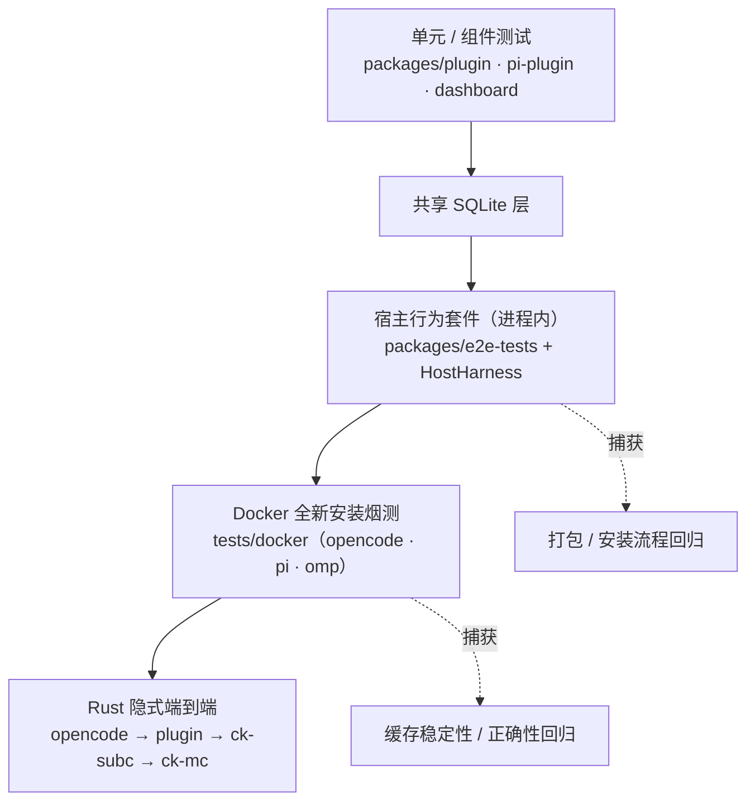
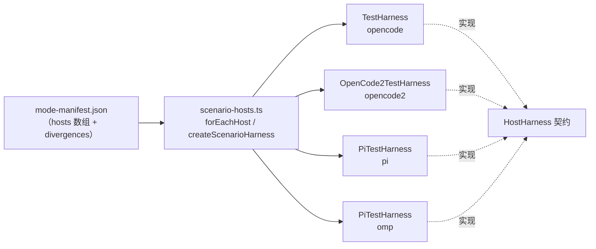
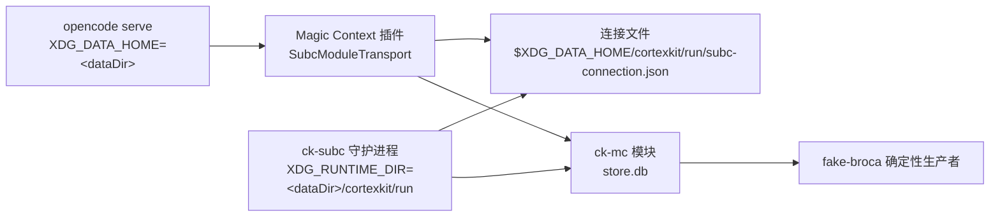
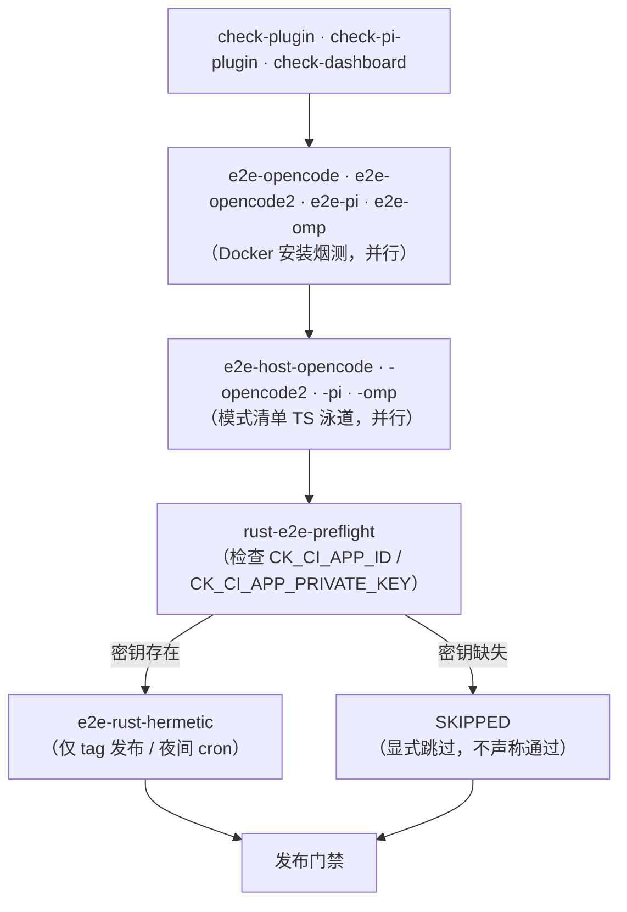

Magic Context 同时支撑 OpenCode 1、OpenCode 2（GA）、Pi 与 OMP 四个宿主，且每种宿主在工具注册、压缩所有权、会话生命周期与 provider 传输层上都有真实差异。因此本页聚焦于**验证基础设施本身**：如何用一套共享的场景契约在四个宿主上运行同一批行为断言，如何用清单文件把"测什么、在哪些宿主上测、以哪种运行时测"固化为可校验的单一事实来源，以及 Rust 隐式端到端通道与 CI/发布门禁如何编排。本页不重复宿主适配层的实现细节（见 [OpenCode 1 与 OpenCode 2 适配层](23-opencode-1-yu-opencode-2-gua-pei-ceng)、[Pi / OMP 插件与跨宿主对等实现](24-pi-omp-cha-jian-yu-kua-su-zhu-dui-deng-shi-xian)），也不展开分类器与存储的内部算法（见 [Rust 核心：分类器·存储·分词器](29-rust-he-xin-fen-lei-qi-cun-chu-fen-ci-qi)）。

Sources: [HOST-SCENARIO-MATRIX.md](packages/e2e-tests/HOST-SCENARIO-MATRIX.md#L1-L7), [README.md](packages/e2e-tests/README.md#L1-L8)

## 四层验证体系与职责边界

端到端测试不是一个套件，而是沿"隔离成本—发现能力"两个轴排列的四层。上层的单元测试与被测进程同生命期，下层的 Docker 与隐式 Rust 通道则刻意引入真实二进制、真实安装路径与真实守护进程。CI 注释明确区分了两个 e2e 层次的关切：**Docker e2e** 是全新安装烟测，验证插件能加载、doctor 干净、一次 mock 会话能按正确 `harness` 值写入数据库行，捕获打包与安装流程回归；**Host e2e** 是行为套件，包含字节级 wire 断言、多轮缓存稳定性、Historian 发布行为、tag-owner 冲突、合成 todowrite、跨宿主记忆等，它会针对内嵌 mock provider 真正拉起 `opencode serve` 或 Pi 子进程。

四层各有明确的能力与空白。进程内宿主套件能精确控制消息形状与 token 用量，但无法覆盖真实二进制与真实 OS；Docker 层覆盖真实 `opencode`/`pi` 二进制、`bunx --bun ...@latest doctor --force` 的全新安装路径、Debian bookworm 与 `better-sqlite3` 的 Linux 重建，但只做单轮烟测，明确**不**覆盖 Historian 分区、recomp、dreamer 调度、记忆归并与溢出恢复——这些需要精确控制消息形状，留给进程内套件。

Sources: [ci.yml](.github/workflows/ci.yml#L18-L38), [tests/docker/README.md](tests/docker/README.md#L5-L15), [tests/docker/README.md](tests/docker/README.md#L54-L79)

Docker 层的两个阶段遵循同一模板：`SETUP_SMOKE` 从干净 home 目录运行非交互 `doctor --force`，断言 doctor 以 `Doctor (complete|repair complete)` 结束、harness 专属配置文件被创建、插件入口被注册、报告 `FAIL 0`；`SESSION_SMOKE` 叠加最小 `magic-context.jsonc` 与指向 aimock 的 provider 配置，运行单轮 agent，断言 `/v1/models` 被响应、共享 SQLite 存在、以及存在匹配 `harness` 值的 `tags` 与 `session_meta` 行。OMP 在此是**一等宿主**：它记录 `harness='omp'` 且日志落在自己的 tmpdir 子树，而不是复用 Pi 的行标识。

Sources: [tests/docker/README.md](tests/docker/README.md#L54-L79), [test-omp-e2e.sh](tests/docker/test-omp-e2e.sh#L1-L17)

## 宿主抽象：HostHarness 契约与能力矩阵

跨宿主复用的前提是把"宿主无关的表面"抽成一个契约。`HostKind` 固定为 `"opencode" | "opencode2" | "pi" | "omp"` 四值，`HostHarness` 接口统一暴露会话创建/删除、prompt 驱动、ballast 生成、mock 静默等待、`contextDb()` 查询、compartment/tag 计数、请求捕获与诊断输出。关键在于它同时声明了 `harnessId`（写入 Magic Context `harness` 列的值）与 `capabilities`（哪些宿主特性对可移植场景并非普遍可用），从而让"同一断言、四种实现"成为编译期可检查的结构。

四个实现的**能力差异**是把场景限制在可移植子集内的直接依据。任何依赖 `childSessions` 或 `sessionRemove` 的场景在 Pi/OMP 上天然不可移植，而 `steerDelivery` 恰好在 Pi 家族可用但 OpenCode 1 不可用。

| 能力 | opencode | opencode2 | pi | omp |
| --- | --- | --- | --- | --- |
| `childSessions` | ✓ | ✓ | ✗ | ✗ |
| `nativeCompact` | ✓ | ✓ | ✓ | ✓ |
| `sessionRemove` | ✓ | ✓ | ✗ | ✗ |
| `steerDelivery` | ✗ | ✓ | ✓ | ✓ |

Pi 家族还有意把 RPC 专用操作排除在可移植契约之外：`PiHostHarness` 额外提供 `getState()`、`getMessages()`、`getSessionStats()`、`compactNow()`、`compactNowExpectCancelled()`、`invokeExtensionCommand()`、`newSession()`、`reloadExtensions()`，这些操作假定存在一个持久化子进程并直接访问其内部状态，因此不进入 `HostHarness`。`scenario-hosts.ts` 用 `isPiFamily()` 判别 Pi 家族，并让 `createScenarioHarness()` 按 `HostKind` 分派到对应实现；`omp` 复用 `PiTestHarness` 并传入 `host` 参数，因此继承与 Pi 相同的能力集合。

Sources: [host-harness.ts](packages/e2e-tests/src/host-harness.ts#L6-L14), [host-harness.ts](packages/e2e-tests/src/host-harness.ts#L21-L53), [host-harness.ts](packages/e2e-tests/src/host-harness.ts#L59-L78), [harness.ts](packages/e2e-tests/src/harness.ts#L73-L78), [opencode2-harness.ts](packages/e2e-tests/src/opencode2-harness.ts#L38-L43), [pi-harness.ts](packages/e2e-tests/src/pi-harness.ts#L50-L55), [scenario-hosts.ts](packages/e2e-tests/src/scenario-hosts.ts#L79-L90)

## mode-manifest.json：单一事实来源

清单文件把每个测试文件显式登记为一条 `entries` 记录，`schema: 1` 且带一段 `header` 说明调用策略。每条记录必须包含 `path`、`tier`、`invocation`、`hosts`、`rationale`、`contract_refs`，并可选带 `behavior` 与 `divergences`；`hosts` 要求非空且去重，`invocation` 的键必须精确为 `ts`/`rust`。`tier` 仅有四个合法值，且 `invocation` 必须与 `tier` 自洽——这一约束把"分类"与"实际调用"绑死，防止有人改分类而忘了改调用。

| tier | `ts` | `rust` | 条目数 | 含义 |
| --- | --- | --- | --- | --- |
| `both-modes` | ✓ | ✓ | 13 | TS 与 Rust 两种运行时都跑同一场景 |
| `ts-only` | ✓ | ✗ | 12 | 仅 TS 宿主套件（含 Pi/OMP 复用 TS 通道） |
| `rust-only` | ✗ | ✓ | 28 | 仅隐式 Rust 通道 |
| `excluded` | ✗ | ✗ | 15 | 独立回归通道或宿主专属套件，不进默认清单泳道 |

校验器 `validate-mode-manifest.ts` 是这套清单的守门人。它会扫描实时的 `tests/**/*.test.ts` 全集，逐条检查清单路径是否存在、是否位于 `tests/` 且以 `.test.ts` 结尾、是否重复，并在最后双向比对：清单里不能有死路径或超范围路径，测试目录里也不能有"缺失清单条目"。对 `behavior: true` 的条目，校验器执行一条**静默省略禁止**规则——四个宿主的并集必须被 `hosts` 显式声明或被 `divergences` 显式解释，否则报错，从而杜绝"某宿主悄悄不测"的第三种状态。

Sources: [mode-manifest.json](packages/e2e-tests/mode-manifest.json#L1-L3), [validate-mode-manifest.ts](packages/e2e-tests/scripts/validate-mode-manifest.ts#L11-L16), [validate-mode-manifest.ts](packages/e2e-tests/scripts/validate-mode-manifest.ts#L63-L145), [validate-mode-manifest.ts](packages/e2e-tests/scripts/validate-mode-manifest.ts#L159-L174), [validate-mode-manifest.ts](packages/e2e-tests/scripts/validate-mode-manifest.ts#L188-L229)

清单同时驱动运行选择：`filesForMode()` 先按 `mode` 过滤 `invocation`，再按 `harness` 过滤 `hosts`，返回排序后的文件列表；CLI 暴露 `--mode ts|rust` 与 `--harness all|opencode|opencode2|pi|omp`。CI 使用 `set -o pipefail` 并显式检查空列表，因为 `bun test` 在没有文件参数时会跑整个包——若不守卫，验证器失败会退化成"跑全部测试"的假象。这种"清单即调用参数"的设计使本地发布脚本与 CI 不可能悄悄测不同的子集。

Sources: [validate-mode-manifest.ts](packages/e2e-tests/scripts/validate-mode-manifest.ts#L235-L272), [ci.yml](.github/workflows/ci.yml#L346-L354)

## 宿主测试矩阵与分歧裁决

`HOST-SCENARIO-MATRIX.md` 是跨宿主能力的权威地图，2026-09-19 针对 OpenCode 1、OpenCode GA 2.0.5、Pi 与 OMP 重新裁决。矩阵有三种单元格语义：`pass`、`declared-divergence`（宿主已在清单条目的 `divergences` 数组中具名，且被引用的宿主表面无法表达 OpenCode 行为）、`product-bug`（真实宿主上仍失败）。文档明确声明一条纪律：**通过的分歧分支不等于该宿主拥有缺失的 v1 机制**。

| 场景 | OpenCode | OpenCode 2 | Pi | OMP |
| --- | --- | --- | --- | --- |
| cache invariants | pass | pass | pass | pass |
| cache stability | pass | pass | pass | declared-divergence |
| deferred compaction marker | pass | declared-divergence | declared-divergence | pass |
| dropped-input guard | pass | pass | declared-divergence | declared-divergence |
| long-running session | pass | declared-divergence | pass | declared-divergence |
| notice-loop race | pass | declared-divergence | declared-divergence | declared-divergence |
| subagent behavior | pass | declared-divergence | declared-divergence | declared-divergence |
| thinking-block safety | pass | declared-divergence | declared-divergence | declared-divergence |
| Pi cross-harness | declared-divergence | declared-divergence | pass | declared-divergence |

Sources: [HOST-SCENARIO-MATRIX.md](packages/e2e-tests/HOST-SCENARIO-MATRIX.md#L3-L37)

分歧的登记与执行是两件分开的事。清单里的 `divergences` 通过 `contract_ref` 指向 `packages/pi-plugin/PARITY.md` 或 `PARITY.md` 的具体锚点，例如 `deferred compaction marker` 在 Pi/OMP 上分歧的理由是"Pi 暂存 `pending_pi_compaction_marker_state` 并拥有自己的 JSONL 边界"，在 OpenCode 2 上的理由是"OpenCode 2 在 GA hook 返回后绑定宿主创建的持久压缩行"。`forEachHost()` 再把分歧转成运行时语义：选中宿主之外的 host 用 `describe.skip` 注册，套件名带上 `[host]` 后缀，只有被 `MC_E2E_HOST` 选中的泳道真正执行；若 `MC_E2E_HOST` 指向一个未在 `hosts` 中声明的宿主，直接抛错而不是静默跳过。

Sources: [scenario-hosts.ts](packages/e2e-tests/src/scenario-hosts.ts#L41-L77), [mode-manifest.json](packages/e2e-tests/mode-manifest.json#L121-L138), [mode-manifest.json](packages/e2e-tests/mode-manifest.json#L158-L169)

矩阵的可信度来自"被替换的实现细节必须留下理由"。Pi/OMP 裁决表为每一行变更给出单行原因，并区分 **HARNESS GAP**（共享配置/夹具修正后即可通过）与 **HOST-IMPOSED**（宿主本身阻止该断言成立）。例如 `cache stability` 是 HOST-IMPOSED——OMP 18.2.6 会把每个 body 哈希进 `system[0].cch` 证明字段，因此整系统字节稳定性无法成立；而 `conflict disable` 是 HARNESS GAP——OMP 从 `config.yml` 而非 `settings.json` 读取自动压缩开关。文档收尾声明"除两个显式清单宿主分歧外，没有断言被豁免"，并把详尽源码引用交给 `pi-plugin/PARITY.md`。

Sources: [HOST-SCENARIO-MATRIX.md](packages/e2e-tests/HOST-SCENARIO-MATRIX.md#L102-L124), [HOST-SCENARIO-MATRIX.md](packages/e2e-tests/HOST-SCENARIO-MATRIX.md#L39-L58)

各泳道的复现记录同样是可核验的：OpenCode 1 清单泳道 54 通过 0 失败，且 52 个原测试名全部保留，新增的两个 canonical 场景 `drops` 与 `tagging` 解释了增量；Pi 清单泳道 41 通过 0 失败（21 个文件），两个 Pi 专属 Rust 退化文件另记 6 通过；OMP 最终清单泳道 36 通过 0 失败（18 个文件），从基线 19 通过 / 21 失败收敛；OpenCode 2 清单泳道 34 通过 0 失败（20 个选定场景、187 断言），但作者特意说明测试数下降是因为把不可用的原生 todo 案例替换为一个显式的真实宿主分歧测试，**不是** 41 个原测试被悄悄转绿，且专属的 `tests/opencode2/` 真实 GA 回归泳道单独为 48 通过 0 失败（494 断言）。

Sources: [HOST-SCENARIO-MATRIX.md](packages/e2e-tests/HOST-SCENARIO-MATRIX.md#L60-L89)

## 共享测试装置：mock provider、隔离环境与分宿主执行器

共享装置的核心是 `mock-provider/server.ts`——一个本地 Anthropic Messages 与 OpenAI Responses 双协议 mock HTTP 服务器，接受 `POST /messages` 与 `/responses`，支持 SSE 流式（OpenCode 默认）与单次 JSON，让测试脚本化精确控制 input/output/cache token 计数并捕获每个请求体。它对阈值测试至关重要：`usage` 是必填项（除非走 `error`），`delayMs` 用于模拟慢 Historian，`error` 字段用于构造 Anthropic 形状的溢出/限流/鉴权错误体，这些错误正是 OpenCode 的 `parseAPICallError` 与 magic-context 溢出检测器匹配的对象。

Sources: [server.ts](packages/e2e-tests/src/mock-provider/server.ts#L1-L6), [server.ts](packages/e2e-tests/src/mock-provider/server.ts#L9-L53)

每个宿主执行器都遵循同一隔离范式。OpenCode 侧 `spawnOpencode` 拉起 `opencode serve`，分配隔离的 config/data/cache 目录、可配置的本地 provider 指向 mock，并通过 `file://` spec 直接从 `packages/plugin/src/index.ts` 加载插件——**无需 npm install**，且显式剥离 `OPENCODE_SERVER_PASSWORD` 让测试服务器在随机 localhost 端口上无鉴权运行。Pi 侧 `PiTestHarness` 拥有一个生命周期内的持久 Pi 子进程，通过 stdio 上的严格 JSONL 通信：stdin 是换行分隔的 JSON 命令，stdout 交织 `type: "response"` 回复与 `agent_start`/`message_end`/`agent_end` 等异步事件；`sendPrompt()` 收集从 `agent_start` 到 `agent_end` 的事件切片并返回历史的 `PiRunResult` 形状，因此进程存活期间 `exitCode`/`signalCode` 为 `null`，多轮测试不需要 `--continue`。

Sources: [README.md](packages/e2e-tests/README.md#L100-L133)

OpenCode 2 的 GA 执行器承担了最严格的安全证明。它显式绑定 `127.0.0.1`，为每个 server 分配全新 HOME 与全部四个 XDG 根、受限环境白名单、分离的进程组与有界的事件驱动启动；`lsof` 与 `ps` 是**必需**而非可选依赖，在交接与拆卸时会检查整个进程组是否打开了被禁止的路径，并要求 lsof 报告的 inode 与预期的私有数据库一致。它还把真实 GA 的行为差异固化为观测记录：`OPENCODE_DB=opencode2.db` 被 2.0.5 真正识别、v2 配置使用复数键 `plugins`/`providers`，以及"目录插件目标优先解析 `<directory>/server` 再解析 `<directory>/index`"。这些证据以 sha256 pin 的形式锚定到具体的 GA 字节与基线提交。

Sources: [opencode2-runner/README.md](packages/e2e-tests/src/opencode2-runner/README.md#L5-L18), [opencode2-runner/README.md](packages/e2e-tests/src/opencode2-runner/README.md#L20-L26), [sha256-pins.json](packages/e2e-tests/src/opencode2-runner/sha256-pins.json#L1-L9)

配对的 TS/Rust provider-wire 重放是横切两条运行时的一层。`replay:transform-wire-parity` 在同一个隔离栈里用同一份经脱敏的多轮 fixture 依次通过 TS transform 与 Rust transform 各跑一次，捕获每轮后 provider 看到的请求表面，并比较**逻辑值空间**而非假定字节同一；退出码基于未被裁决的差异数。fixture 契约要求只保留结构、字节长度与分类标记，绝不复制捕获到的正文、路径、session id、工具参数或签名。差异器当前报告四条轴：空字符串/数组内容形状、孤立或内嵌的 `[dropped]` 占位符、已签名/未签名的 reasoning item 位置、以及配对/缺失/孤立工具调用与结果。

Sources: [README.md](packages/e2e-tests/README.md#L20-L91)

## Rust 隐式端到端通道

Rust 泳道覆盖的是最完整的生产路径：`opencode serve → Magic Context 插件 → ck-subc → ck-mc`。它的精髓在于**不改产品代码**地完成接线。插件侧的 Rust 模块客户端（`SubcModuleTransport`）读取 `${XDG_DATA_HOME}/cortexkit/run/subc-connection.json` 这一默认连接文件；而 `opencode` 以 `XDG_DATA_HOME = <dataDir>` 运行，因此只要把守护进程的 `XDG_RUNTIME_DIR` 指向 `<dataDir>/cortexkit/run`，它的连接文件就恰好落在插件查找的位置。模块随后在同一 data dir 下打开自己的 store（`${XDG_DATA_HOME}/cortexkit/magic-context/store.db`，与插件的 `context.db` 区分），这正是生产的共享 cortexkit 布局而非测试捷径。

构建层面，`buildHermeticBinaries()` 用一个单例 promise 完成唯一一次权威构建：先 `cargo build --release -p mc-module` 得到本工作区的 `ck-mc`，硬链接（跨文件系统则拷贝）为 `ckdev-mc-e2e` 以避免与生产 `ck-mc` 在 `ps`/Activity Monitor 中混淆，再在兄弟 `subconscious` 工作区执行 `cargo build --release -p subc-core --bins` 得到 `ck-subc`。两个构建都进入持久化的 e2e 专属 Cargo target 目录 `packages/e2e-tests/.cache/rust-e2e-cargo-target`，与任一源码工作区的 `target` 目录互不争锁，从而让 Cargo 复用增量产物，同时开发者构建无法持有 harness 的 target 锁。

Sources: [hermetic-subc.ts](packages/e2e-tests/src/rust-runner/hermetic-subc.ts#L1-L26), [hermetic-subc.ts](packages/e2e-tests/src/rust-runner/hermetic-subc.ts#L149-L169), [hermetic-subc.ts](packages/e2e-tests/src/rust-runner/hermetic-subc.ts#L318-L368), [README.md](packages/e2e-tests/README.md#L176-L184)

环境诚实性是这条泳道的硬约束。`RustTestHarness.detectPrereqs()` 与 `detectRustModePrereqs()` 会预检平台（仅拒绝 `win32`）、cargo、兄弟 `subconscious` 工作区是否存在，任一缺失时该泳道以**打印出的原因** SKIP，绝不 green-washing 也绝不挂起。前置检测脚本 `detectRustPrerequisites()` 有三个模式：默认查找已构建的 `ck-mc`（`target/release/ck-mc` 或 PATH 上的可执行文件，可用 `MC_E2E_CK_MC_BIN` 覆盖），`--build` 允许就地重建，`--hermetic` 则跳过已废弃的根 target 构建、只验证两个源码工作区——因为隐式栈会自行做一次权威构建。

Sources: [hermetic-subc.ts](packages/e2e-tests/src/rust-runner/hermetic-subc.ts#L191-L200), [check-rust-prerequisites.ts](packages/e2e-tests/scripts/check-rust-prerequisites.ts#L62-L134), [run-rust-hermetic-e2e.sh](scripts/run-rust-hermetic-e2e.sh#L87-L102)

部分场景需要额外的装置，因此用显式环境开关 gate，且 gate 关闭时仍打印一行 SKIP 而非静默通过。`MC_RUST_E2E_FOLD=1` 用于需要隐式 broca 运行器发布 compartment 的 fold 依赖场景（`fold-under-pressure`、`ctx-reduce-roundtrip`）；`MC_RUST_E2E_REMOVAL=1` 用于会话中途 `session.revert` 仍会卡住 Rust 序号解析器的 `removal-self-heal`；`MC_RUST_E2E_DUPLICATE_IDS=1` 用于需要在 selection bust 上消费排队 drop 的 `duplicate-tool-use-id`。Rust 场景支持模块把 gating 谓词与 skip 原因集中定义，并要求在一个 `it` 内打印跳过通知，保证原因在泳道输出中可见。

Sources: [README.md](packages/e2e-tests/README.md#L199-L213), [rust-scenario-support.ts](packages/e2e-tests/src/rust-scenario-support.ts#L35-L66)

## CI 与发布门禁编排

`ci.yml` 的流水线形状是先单元测试，再 Docker 安装烟测，最后是清单派生的宿主行为泳道，Rust 隐式腿则在独立的私有源码通道上运行。两个 e2e 层次的顺序是有意的——只有更简单的安装+烟测路径通过后，才有必要跑深层行为套件。

四条宿主泳道共享同一段骨架：安装 workspace 依赖、构建相应插件、用 `validate-mode-manifest.ts --mode ts --harness <host>` 派生文件列表并在空列表时失败、以 `MC_E2E_MODE=ts`、`MC_E2E_HOST=<host>`、`NODE_ENV=""` 运行 `bun test --timeout 600000`。几处差异值得注意：OpenCode 泳道**浮动到最新** `opencode` 而非固定版本，以便 CI 跑用户实际运行的版本并尽早捕获上游回归，同时保留"临时重新 pin"的逃生舱；Pi 泳道额外安装 opencode，因为 `pi-cross-harness.test.ts` 需要同时拉起 Pi 与 `opencode serve`；OMP 泳道复用 Pi 插件但以 `MC_E2E_HOST=omp` 运行。OpenCode 泳道还会额外跑一个清单之外的 oracle：`src/cache-analysis.test.ts`。

Sources: [ci.yml](.github/workflows/ci.yml#L287-L415), [ci.yml](.github/workflows/ci.yml#L417-L453), [ci.yml](.github/workflows/ci.yml#L455-L493)

Rust 隐式腿的默认拒绝策略在 CI 与发布两条通道中共用。`scripts/run-rust-hermetic-e2e.sh` 是本地发布脚本与两个 CI 任务的**唯一调用点**；它先解析当前 Rust 工作区（`--hermetic` 前置检测），再要求 `opencode` 在 PATH 上，否则 Rust 组 RED 且**永不 SKIP**；随后从清单派生 `--mode rust --harness all` 的文件列表并拒绝空列表。整个 suite 按文件在**全新 Bun 进程**中运行，因为一个 Bun 进程可能在套件结束后残留定时器、子进程处理器与继承状态；每个文件还有有界的单次重试预算（RETRY 行会显式打印，避免掩盖 flake），且"无失败"必须伴随真实的通过摘要——崩溃、超时或零测试收集都不会被当作通过。

Sources: [run-rust-hermetic-e2e.sh](scripts/run-rust-hermetic-e2e.sh#L30-L49), [run-rust-hermetic-e2e.sh](scripts/run-rust-hermetic-e2e.sh#L51-L111), [RUST_E2E_CI.md](.github/RUST_E2E_CI.md#L9-L14)

这条腿运行在 GitHub 托管的 Ubuntu runner 上，因为 harness 只拒绝 Windows、其余全部使用可移植的 Unix 设施（进程派生、信号、XDG 目录、守护进程 socket），没有 macOS 专属分支。两个任务分别 checkout `cortexkit/commons` 与 `cortexkit/subconscious` 到 `$GITHUB_WORKSPACE` 旁边的 `.siblings/`，再软链到工作区预期的 `../commons` 与 `../subconscious` 路径，只缓存 `packages/e2e-tests/.cache/rust-e2e-cargo-target`，缓存键由本仓 `Cargo.lock`、两个兄弟锁文件、runner OS 与架构共同派生。凭证通过 `cortexkit-ci` GitHub App 的短期安装令牌提供，显式限定 `repositories: subconscious,commons`，且每个 sibling checkout 都设 `persist-credentials: false`。

Sources: [RUST_E2E_CI.md](.github/RUST_E2E_CI.md#L16-L68), [ci.yml](.github/workflows/ci.yml#L531-L625)

缺失密钥降级是发布门禁的关键语义。凭证预检任务在不打印密钥值的前提下检查两个 secret，任一缺失就发出指名警告、写入 `SKIPPED` 到 job summary、并令 `enabled=false`；Rust 任务随之可见地跳过而非报告为通过。发布任务只接受这一显式跳过状态——**已启用但失败的 Rust 任务会阻断发布**。可核验性通过第一行固定形状的摘要保证：`Rust hermetic sibling checkouts: commons=<sha>; subconscious=<sha>`，让首次 secret 支撑的运行可一眼核对兄弟版本而不泄露凭证。私有源码任务始终保持 tag-only 或 schedule-only，绝不挂到 PR 或其他不受保护触发器上。

Sources: [RUST_E2E_CI.md](.github/RUST_E2E_CI.md#L70-L92), [ci.yml](.github/workflows/ci.yml#L486-L500)

## 健壮性、flakiness 与非空洞性治理

测试基础设施本身需要被审计。`flake-characterization-2026-08-17.md` 记录了一次报告型调查：针对发布容器 `ts/opencode` 组的两次组级失败，作者在同等的容器拓扑中完整重跑了清单派生的 TS/OpenCode 组两次，得到"未复现"的零结果（其中一次为 `44 pass`、`0 fail`、271 次 `expect()`、跨 19 个文件）。该文档明确它是**带证据的零复现**，而不是"发布失败无效"的证明，并逐项排查共享状态候选：组级共享 server/data/DB（被否，每个 harness 分配唯一路径）、父进程 test-preload 数据库（被否，子进程 `XDG_DATA_HOME` 覆盖）、端口碰撞（可能是启动 flake 但无法解释 image/range 替换）、SQLite 锁（仅是每 harness 计时问题）。

Sources: [flake-characterization-2026-08-17.md](packages/e2e-tests/flake-characterization-2026-08-17.md#L10-L27), [flake-characterization-2026-08-17.md](packages/e2e-tests/flake-characterization-2026-08-17.md#L29-L47), [flake-characterization-2026-08-17.md](packages/e2e-tests/flake-characterization-2026-08-17.md#L62-L72)

调查最终把问题定性为"测试可观测性与异步静默缺陷"而非产品缺陷，并提出四条修复方向：为重置共享 mock 的套件按测试用例创建并销毁 harness，或在 `mock.reset()` 与选择最终请求之前加入 harness 级静默屏障；把 Pi harness 已用的"Magic Context 已处理此会话"持久检查扩展到 OpenCode harness（在 prompt 后核验目标会话的 `session_meta` 行）；给 mock 捕获加相关性（用唯一 prompt 标记并在选中请求中要求它，Historian 工作则保留每个捕获范围并等待匹配目标范围的 compartment）；以及在任何失败时输出紧凑取证包。其中若干方向已落地为 `assertMagicContextProcessed(sessionId)` 与 `waitForMockQuiescence()` 等契约方法。

Sources: [flake-characterization-2026-08-17.md](packages/e2e-tests/flake-characterization-2026-08-17.md#L74-L83), [host-harness.ts](packages/e2e-tests/src/host-harness.ts#L37-L38)

两个 v0.41.0 报告提供了更硬的"根因隔离"范式。`rust-hermetic-e2e-wall-v0.41.0.md` 把 8 个报告失败归因为单一的 harness 根因而非调度器回归——某个提交让 OpenCode Rust 适配层传输宿主解析的 Historian 模型链，而隐式 harness 没配置 Historian 模型，于是 producer 无法发布 compartment；修复是给每个 producer-backed Rust harness 显式注入 `mock-anthropic/mock-sonnet` USER 级 Historian 模型。其失败确信表为每个失败列出引入提交、修复/重定向与证据，并用"先中和该模型注入（标记 `NON_VACUITY BREAK`）让串行 Rust 腿变红、恢复后变绿"的方式证明修复非空洞。

Sources: [rust-hermetic-e2e-wall-v0.41.0.md](docs/reports/rust-hermetic-e2e-wall-v0.41.0.md#L5-L11), [rust-hermetic-e2e-wall-v0.41.0.md](docs/reports/rust-hermetic-e2e-wall-v0.41.0.md#L19-L37)

`rust-hermetic-full-leg-liveness-v0.41.0.md` 则处理反复出现的五分钟级失败，判定为 harness 的负载/隔离失败而非会话卡死或模块重启回归。最强判别依据是失败形状：整腿重跑时失败在测试之间漂移，而 park-self-heal 的模块重启臂保持绿色。根因是 harness 通过"启动再停止一个临时 `Bun.serve`"选取所谓空闲端口，再在并发发布负载下由另一进程抢占；修复是改用 OpenCode 已支持的 `--port 0`，解析 stdout 上报告的绑定端口后再开始就绪检查，并让串行腿为每个清单文件开新 Bun 进程以隔离计时器与子进程处理器。该修复同样以动态端口解析器的 `NON_VACUITY BREAK` 做了非空洞性验证。

Sources: [rust-hermetic-full-leg-liveness-v0.41.0.md](docs/reports/rust-hermetic-full-leg-liveness-v0.41.0.md#L5-L11), [rust-hermetic-full-leg-liveness-v0.41.0.md](docs/reports/rust-hermetic-full-leg-liveness-v0.41.0.md#L44-L66)

一条贯穿全仓的"承重装置规则"把压力场景的构造方式固化为纪律：场景必须通过**收缩 context 上限对着真实消息字节**来达到高填充，绝不能通过虚报 usage。两种手法不可互换——虚报 usage 只移动 fill-keyed 条件（execute 阈值、force 波段），而所有 real-byte-keyed 条件（reclaimable-tail 压力、tail-size 触发下限、chunk substance）都会静默不可达；这样搭出的 harness 会诚实地通过每个 fill-keyed 测试却在结构上无法触达另一根轴，且没有任何东西会宣告这个缺口。文档给出了 2026-08-14 在同伴网关驱动容器中观测到的实例：44 通过、fill 80→86%、`eligible_chunk_tokens` 全程被钉在恰好 `0.0`。

Sources: [README.md](packages/e2e-tests/README.md#L186-L197)

## 运行手册

所有入口都可从仓库根或 `packages/e2e-tests` 内调用。

| 目的 | 命令 |
| --- | --- |
| 进程内宿主套件（默认 TS） | `bun run test:e2e`（或 `cd packages/e2e-tests && bun test`） |
| 校验清单文件 | `bun scripts/validate-mode-manifest.ts` / `--mode ts --harness <host>` |
| Rust 隐式端到端 | `bun run test:rust-e2e`（或根目录 `scripts/run-rust-hermetic-e2e.sh`） |
| 单宿主清单泳道 | `MC_E2E_MODE=ts MC_E2E_HOST=<host> NODE_ENV='' bun test --timeout 600000 $(bun scripts/validate-mode-manifest.ts --mode ts --harness <host>)` |
| 配对 transform-wire 重放 | `bun run replay:transform-wire-parity [-- --provider-arm openai-responses]` |
| 变异/非空洞性演练 | `bun run mutation:rust-historian` / `mutation:rust-ctx-reduce` / `mutation:paired-replay` |

Rust 泳道的要求是 `cargo` 在 PATH 上且兄弟 `subconscious` 工作区被 checkout 到本仓旁；满足条件时本地预热后约 1–2 分钟。Docker 层通过 `tests/docker/run-e2e.sh [opencode|pi]` 运行，发布门禁的非 Rust 套件则通过 `scripts/release-e2e-docker.sh` 在只读 bind-mount + tmpfs 的原生架构容器中执行（`/workspace` 与 `/tmp` 均为 tmpfs，无宿主 HOME 或 `~/.local/share` 挂载）。OpenCode 2 的 GA 跑法见其 runner README：先 `bun install`，必要时手动初始化被 Bun 拦下的 postinstall，再 `bun run --cwd packages/plugin build:v2` 后运行 `tests/opencode2`。

Sources: [package.json](packages/e2e-tests/package.json#L6-L20), [README.md](packages/e2e-tests/README.md#L12-L18), [README.md](packages/e2e-tests/README.md#L139-L157), [README.md](packages/e2e-tests/README.md#L227-L236), [release-e2e-docker.sh](scripts/release-e2e-docker.sh#L1-L45), [opencode2-runner/README.md](packages/e2e-tests/src/opencode2-runner/README.md#L1-L7)

## 延伸阅读

若你要理解宿主矩阵为何存在分歧，请继续阅读 [多宿主统一支持：OpenCode · Pi · OMP](4-duo-su-zhu-tong-zhi-chi-opencode-pi-omp) 与 [Pi / OMP 插件与跨宿主对等实现](24-pi-omp-cha-jian-yu-kua-su-zhu-dui-deng-shi-xian)，后者的 `PARITY.md` 是矩阵 `contract_ref` 的主要落点。若关注 OpenCode 2 的真实 GA 行为与 v1/v2 加载语义，见 [OpenCode 1 与 OpenCode 2 适配层](23-opencode-1-yu-opencode-2-gua-pei-ceng)。Rust 隐式通道背后的模块、subc 传输与运行模式，见 [Rust 运行时模式与 subc 模块集成](25-rust-yun-xing-shi-mo-shi-yu-subc-mo-kuai-ji-cheng) 与 [Rust 核心：分类器·存储·分词器](29-rust-he-xin-fen-lei-qi-cun-chu-fen-ci-qi)。安装与 doctor 流程本身的行为契约，见 [命令向导：setup / doctor / migrate 工作流](5-ming-ling-xiang-dao-setup-doctor-migrate-gong-zuo-liu)。