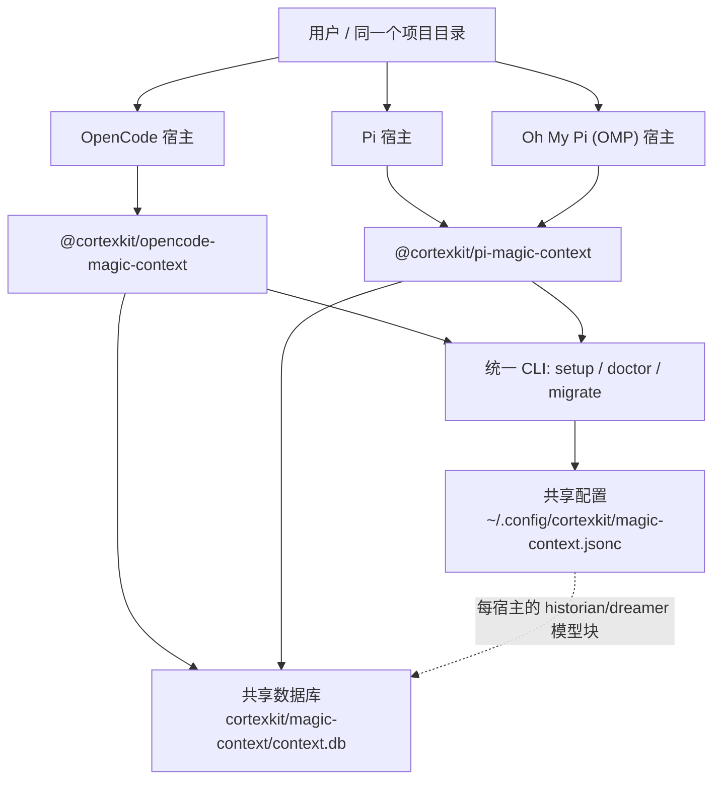
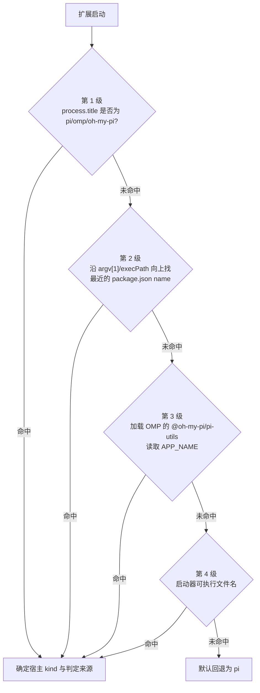
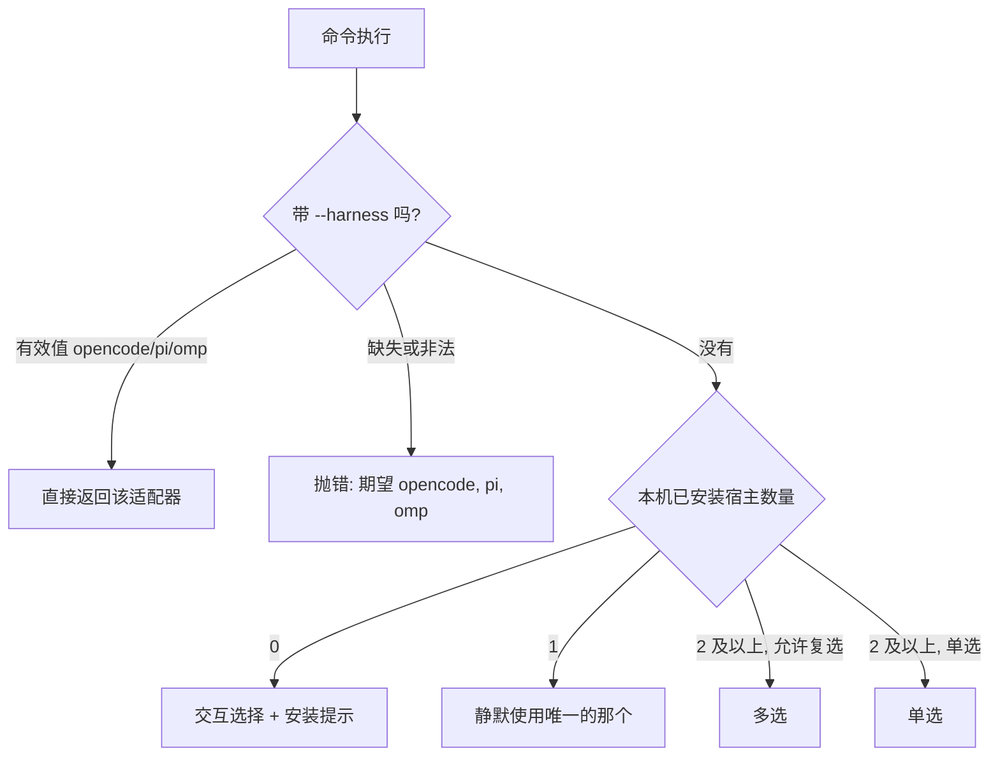

Magic Context 并不是"为某一个编码代理写的插件"，而是一套可以同时挂载在 **OpenCode**、**Pi** 与 **Oh My Pi（OMP）** 三种宿主（harness）上的上下文与记忆系统。本章从初学者视角回答三个问题：这三种宿主是什么关系？一套代码为什么能同时跑在它们上面？装上之后，哪些东西在三者之间共享，哪些又被严格隔离开？我们只讲"多宿主"这一层，不深入转换管线与对等实现的细节——那些属于后续的 [Pi / OMP 插件与跨宿主对等实现](24-pi-omp-cha-jian-yu-kua-su-zhu-dui-deng-shi-xian) 页面。

阅读本章前，建议先完成 [快速开始：安装向导、首次会话与最小可用配置](2-kuai-su-kai-shi-an-zhuang-xiang-dao-shou-ci-hui-hua-yu-zui-xiao-ke-yong-pei-zhi)，因为"多宿主"本质上就是对安装向导中 `--harness` 参数的解释。

## 一口气看懂：三宿主、两包、一个数据库

先建立整体图景。Magic Context 发布两个 npm 包：面向 OpenCode 的 `@cortexkit/opencode-magic-context`，以及面向 Pi 与 OMP 的 `@cortexkit/pi-magic-context`。注意第二个包是**一个包、两个宿主**：同一个 Pi 兼容扩展既跑在 Pi 上，也跑在 OMP 上。所有宿主最终都写入**同一个** SQLite 数据库 `~/.local/share/cortexkit/magic-context/context.db`，因此项目记忆可以在三者之间流动。



Sources: [ARCHITECTURE.md](ARCHITECTURE.md#L10-L15), [README.md](README.md#L170-L176), [CONFIGURATION.md](CONFIGURATION.md#L71-L78)

理解这张图的关键在于区分两种数据：**项目级数据**（记忆、嵌入、Dreamer 运行记录）按项目根路径共享，所以"在 OpenCode 里写下的记忆，能在 Pi 或 OMP 里被检索到"；**会话级数据**（标签、分区、会话元数据）按宿主隔离，避免不同宿主在同一张表里互相踩踏。二者落在同一个数据库的不同表或同一张表的不同列上，由 `harness` 列与 `project_path` 列共同决定归属。

Sources: [CONFIGURATION.md](CONFIGURATION.md#L71-L78), [ARCHITECTURE.md](ARCHITECTURE.md#L10)

## 宿主身份：一个启动期常量

为了让隔离成立，每个插件实例在**打开数据库之前**就必须确定自己是谁。这个身份由 `HarnessId` 表示，取值有四种：`opencode`、`opencode2`、`pi`、`omp`。默认值是 `opencode`（OpenCode 1 无需显式调用）；OpenCode 2 在打开数据库前调用 `setHarness("opencode2")`；Pi 兼容扩展则先做一次宿主解析，再调用 `setHarness("pi" | "omp")`。

Sources: [harness.ts](packages/plugin/src/shared/harness.ts#L1-L23)

`setHarness` 有一个刻意的安全设计：它只能被有效设定**一次**。一旦锁定，再用不同值调用会直接抛错，从而防止运行中途"换脸"导致 `harness` 列被写脏、破坏按宿主划分的会话作用域。用相同值重复调用则是安全的空操作。

Sources: [harness.ts](packages/plugin/src/shared/harness.ts#L28-L53)

这套设计解释了一个常见困惑：为什么"从配置里读取宿主"是不允许的。宿主身份**不是配置**，而是进程的启动期常量；把它当成可配置项会引入跨宿主泄漏，而这被明确定义为正确性缺陷而非特性。

Sources: [harness.ts](packages/plugin/src/shared/harness.ts#L19-L22)

## 如何区分 Pi 与 OMP：四级识别阶梯

Pi 与 OMP 共用同一个扩展包，那扩展怎么知道自己跑在谁上面？答案是启动时执行一个**四级检测阶梯**，从最可靠的信号逐级回退，并记录下最终是哪一级做出了判定，以便在启动日志中留证。



Sources: [pi-harness-kind.ts](packages/pi-plugin/src/pi-harness-kind.ts#L171-L184)

各级判定的具体依据如下表。可以看到，判定方法本身就是"证据等级"，可执行文件名最弱、进程标题最强，因此顺序不可随意调换。

| 级别 | 判定方法（`via`） | 依据 | 对应代码 |
|---|---|---|---|
| 1 | `process-title` | 宿主在加载扩展前把 `process.title` 设为 `APP_NAME` | `piHarnessKindFromExecutable(process.title)` |
| 2 | `package-name` | 真实路径（realpath）向上最近的 `package.json` 的 `name` | `nearestPackageName` / `packageNameDetection` |
| 3 | `app-name` | 动态 import `@oh-my-pi/pi-utils`，读 `APP_NAME === "omp"` | `appNameDetection` |
| 4 | `executable-name` | 启动器 basename（`pi` / `omp` / `oh-my-pi`） | `executableDetection` |
| 兜底 | `default` | 以上全部未命中 | 返回 `"pi"` |

Sources: [pi-harness-kind.ts](packages/pi-plugin/src/pi-harness-kind.ts#L89-L169), [pi-executable.ts](packages/plugin/src/shared/pi-executable.ts#L1-L20)

这里还有两个值得初学者注意的工程细节。第一，检测结果（`kind` 与 `via`）会被**记忆化**到全局单例槽位上，异步的完整结果一旦产生就覆盖同步的初步结果，避免重复探测；测试可以通过 `__setPiHarnessKindForTesting` 覆写。第二，`PiHarnessKind` 只有 `"pi" | "omp"` 两个值，而 OpenCode 2 是另一个独立身份——`harness.ts` 里的 `HarnessId` 才是完整的四值枚举。

Sources: [pi-harness-kind.ts](packages/pi-plugin/src/pi-harness-kind.ts#L186-L242), [harness.ts](packages/plugin/src/shared/harness.ts#L23-L25)

## 统一 CLI 适配层：让一条命令认识三个宿主

用户面对的是**一条命令**：`setup`、`doctor`、`migrate` 都能用 `--harness opencode|pi|omp` 指定目标，或自动探测。支撑这份统一体验的，是 `packages/cli/` 里抽象的 `HarnessAdapter` 接口——每个宿主提供一个适配器，把"这个宿主长什么样"的知识收敛到一处。

Sources: [types.ts](packages/cli/src/adapters/types.ts#L1-L13), [README.md](README.md#L99)

每个适配器要覆盖四件事：**检测**（是否安装、插件是否已注册）、**配置**（配置文件在哪、怎么读写）、**运行时状态**（日志、存储目录、插件缓存目录）以及**安装**（如何把插件登记进去）。这不是纯理论约定：`ensurePluginEntry()` 被明确要求"重写 JSONC 时必须保留用户注释与格式"，因为配置文件是用户的领地。

Sources: [types.ts](packages/cli/src/adapters/types.ts#L6-L12), [types.ts](packages/cli/src/adapters/types.ts#L70-L76)

三个适配器在同一个注册表里被统一收集与查找，`getAdapter(kind)` 按类别取用，`getInstalledAdapters()` 则返回"本机 PATH 或已知标准位置中确实存在"的那些适配器——后者正是自动探测的实现基础。

Sources: [index.ts](packages/cli/src/adapters/index.ts#L9-L21)

以 OMP 适配器为例，它的"安装"不是改 JSON，而是调用宿主自己的插件管理器：若插件未安装就执行 `omp plugin install`，已安装则执行 `omp plugin enable`。这里有一个超出初学者预期的严谨点——**全局命令返回 0 并不代表生效**，因为项目级覆盖可能仍然禁用该插件。因此适配器会再次读取生效状态；若仍未启用，新安装会被回滚卸载，而既有安装会恢复到 lockfile 中记录的原始启用状态，绝不从"项目生效列表"反推全局状态。

Sources: [omp.ts](packages/cli/src/adapters/omp.ts#L36-L67), [omp.ts](packages/cli/src/adapters/omp.ts#L69-L132)

OMP 宿主命令的调用方式也做了兼容处理：OMP 发布的 CLI 在部分安装形态下是一个 Bun 脚本（`#!/usr/bin/env bun`），并非原生可执行文件，因此适配器会在必要时通过 Bun 运行它，否则退回常规进程调用。这类"同族不同壳"的差异，正是适配层存在的意义。

Sources: [omp-helpers.ts](packages/cli/src/lib/omp-helpers.ts#L26-L53)

### 命令如何选出目标宿主

无论 `setup` 还是 `doctor`，目标宿主的解析都走同一套决策树。`--harness` 是**硬覆盖**，不做任何询问；否则先看本机装了哪些宿主：0 个则提示用户选择并给出安装线索，1 个则静默使用，2 个及以上才需要交互——并且 `setup` 只允许单选，`doctor` 允许多选。

Sources: [harness-select.ts](packages/cli/src/lib/harness-select.ts#L37-L110), [setup.ts](packages/cli/src/commands/setup.ts#L4-L7)



Sources: [harness-select.ts](packages/cli/src/lib/harness-select.ts#L19-L28), [harness-select.ts](packages/cli/src/lib/harness-select.ts#L48-L111)

`doctor` 在多宿主场景下有一个重要细节：某些内置的数据库修复子命令（v22 backfill）操作的是**共享**的 cortexkit 数据库，与宿主无关。因此 `doctor` 只执行它们**一次**，而不是为每个适配器各跑一遍——否则同一批数据会被重复处理，第二遍就会显示"已处理 0 行"这类令人困惑的输出。

Sources: [doctor.ts](packages/cli/src/commands/doctor.ts#L1-L60)

## 配置：一份文件，三个模型块

早期版本把隐藏代理（historian / dreamer）的模型放在扁平的 `historian.model` 字段上。多宿主化之后，模型执行被拆进三个**相互独立**的块：`opencode`、`pi`、`omp`。这样同一个项目在不同宿主上可以用不同的模型与思考级别，而其余（温度、提示词、工具白名单等）仍保留在顶层的 `historian` / `dreamer` 里。

Sources: [CONFIGURATION.md](CONFIGURATION.md#L18-L30), [README.md](README.md#L148-L166)

| 字段类别 | 位置 | 例子 |
|---|---|---|
| 模型解析（每宿主独立） | `<scope>.opencode` / `.pi` / `.omp` | `model`、`fallback_models`、`variant`、`thinking_level` |
| 执行与行为（跨宿主共用） | `historian` / `dreamer` 顶层 | `temperature`、`top_p`、`prompt`、`tools`、`disable`、`maxTokens`、`two_pass` |

Sources: [CONFIGURATION.md](CONFIGURATION.md#L24-L28)

OMP 有两条对初学者最实用的规则。其一，OMP 使用 **Pi 原生的 `thinking_level` 限定符**；其二，**如果缺少 `historian.omp` 或 `dreamer.omp`，OMP 会回退到对应的 `pi` 块**——这意味着既有的 Pi 兼容配置无需为了上 OMP 而迁移。反过来，一旦你显式写了 OMP 块，它就是权威的，即使它省略了 `model`。

Sources: [README.md](README.md#L166), [CONFIGURATION.md](CONFIGURATION.md#L30)

配置里还有一处不容易察觉的信任边界：配置文件在项目级合并前会剥离不安全字段（如 `sqlite` PRAGMA、隐藏代理的 `prompt`/`tools`、`embedding` 目标、`profiles` 定义等），防止克隆来的仓库通过配置升级权限。`profiles` 因此只能在用户配置中定义，项目只能"选择"一个已存在的名字。

Sources: [CONFIGURATION.md](CONFIGURATION.md#L69), [CONFIGURATION.md](CONFIGURATION.md#L32-L34)

### 宿主之间的模型名翻译

同一个模型在不同宿主上的"写法"可能不同。例如 OpenCode 里叫 `openai/gpt-...`，Pi 里对应 `openai-codex/gpt-...`；OMP 还把 OpenCode Zen 网关暴露为 `opencode-zen`，而 OpenCode 与纯 Pi 都称其为 `opencode`。为了让一份共享配置在三处都能读懂，系统在配置**读写边界**做 provider 前缀翻译，只翻译第一个斜杠之前的部分，模型 ID 本身逐字节保留。

Sources: [harness-provider-map.ts](packages/plugin/src/shared/harness-provider-map.ts#L1-L37)

值得注意的是，Pi 与 OMP 的映射函数被**故意保持独立**，即便二者当前暴露的订阅别名完全相同——这是为了将来某个宿主的目录重命名不会悄悄改变另一个宿主的行为。模型查找时会按"规范形式优先、原生拼写作为回退"的顺序依次尝试，因此一份配置能同时被三个宿主接受。

Sources: [harness-provider-map.ts](packages/plugin/src/shared/harness-provider-map.ts#L14-L23), [harness-provider-map.ts](packages/plugin/src/shared/harness-provider-map.ts#L103-L120)

### OMP 的独占性设置

由于 Magic Context 自己接管上下文与记忆，OMP 上必须关掉两个原生功能，否则会出现"两个上下文管理器"同时压缩、两个记忆注入器同时写入的冲突：

- `compaction.enabled` —— OMP 原生压缩，会被设成 `false`；
- `memory.backend` —— OMP 自动记忆，会被设成 `off`（既有数据不会被删除）。

Sources: [README.md](README.md#L185-L187), [setup-omp.ts](packages/cli/src/commands/setup-omp.ts#L85-L121)

OMP 的 setup 流程对此格外谨慎：它先读取当前设置，若读不到就**拒绝安装**（"不能在盲目状态下装两个上下文管理器"）；用户若拒绝关闭冲突项，安装直接中止；并且当生效设置来自项目级/覆盖级配置文件时，它**拒绝修改全局配置**，而是提示用户自行编辑那些文件后重跑。整个改动还配有回滚逻辑，形成一次事务性的安装。

Sources: [setup-omp.ts](packages/cli/src/commands/setup-omp.ts#L85-L170)

对照之下，OpenCode 侧对应的是内置 `compaction.auto` / `compaction.prune`（setup 会关闭），以及需要用户自行移除的 DCP 与 OMO 冲突插件。也就是说，"每个宿主各有关闭按钮，但都由同一套 setup 统一处理"。

Sources: [README.md](README.md#L183-L194)

## 共享与隔离：一眼看清什么会跨宿主流动

这是初学者最容易混淆的部分，用一张表厘清。

| 数据类别 | 归属维度 | 跨宿主可见？ | 典型内容 |
|---|---|---|---|
| 项目记忆 | `project_path`（解析后的 git 根） | ✅ 是 | 五类知识分类法下的记忆、嵌入向量、Dreamer 运行、智能笔记、key-file 固定记录 |
| 会话状态 | `harness` 列（`opencode` / `pi` / `omp`） | ❌ 否 | 标签、分区、会话元数据 |

Sources: [CONFIGURATION.md](CONFIGURATION.md#L71-L78), [ARCHITECTURE.md](ARCHITECTURE.md#L10)

因此，"在 OpenCode 写下一条记忆，切到 Pi 或 OMP 就能召回"成立；而"某个会话的压缩历史"只属于产生它的那个宿主运行时。要让语义搜索跨宿主生效，还需要**同一项目**在各宿主上解析出**一致的 `embedding` 配置**——因为每个宿主的检索路径都会按项目身份重新解析嵌入配置。

Sources: [CONFIGURATION.md](CONFIGURATION.md#L78-L82), [pi-plugin/README.md](packages/pi-plugin/README.md#L1-L5)

由于三宿主共用同一个数据库，就有了一个跨宿主的版本护栏：数据库有 schema fence（`LATEST_SUPPORTED_VERSION`），当某个宿主的构建版本落后于数据库已应用的迁移时，它会**拒绝打开并大声失败**，而不是悄悄降级。混合版本的进程会阻止在共享目录上执行迁移，直到所有进程都升级完成。

Sources: [ARCHITECTURE.md](ARCHITECTURE.md#L148), [README.md](README.md#L365-L375)

## 迁移：把会话从 OpenCode 搬到 Pi / OMP

既然记忆已经是共享的，那"迁移"迁移的是什么？是**会话本身**——`doctor migrate` 把 OpenCode 的一个会话（含其消息、分区与事实）搬成 Pi 或 OMP 的 JSONL 会话，并在共享数据库中把源会话的分区与事实复制到新会话 ID 之下（源按 `harness='opencode'` 读取，目标按 `harness='pi'` 或 `'omp'` 写入）。迁移目标宿主默认是 `pi`，写入 OMP 会话根时传 `omp`。

Sources: [migrate.ts](packages/cli/src/commands/migrate.ts#L20-L66), [cli/index.ts](packages/cli/src/index.ts#L11-L12)

迁移是崩溃安全的：进度记录在共享数据库的 `migration_pending` 恢复日志中，键由"源会话 + 目标宿主"派生；若上一次尝试被中断，这次可以复用日志里的标识继续，并先做一次恢复清扫。不存在 `--harness` 时，用户也可以直接指定输出路径等参数。

Sources: [migrate.ts](packages/cli/src/commands/migrate.ts#L67-L80), [ARCHITECTURE.md](ARCHITECTURE.md#L148)

## 对等性的边界：哪些差异是"设计如此"

多宿主支持不等于"三个宿主行为完全一致"。项目维护了一份**宿主场景矩阵**，逐场景记录四种运行时（OpenCode 1、OpenCode 2、Pi、OMP）的通过情况，并用 `declared-divergence` 标注"该宿主表面无法表达 OpenCode 行为"、用 `product-bug` 标注"真实宿主上仍然失败"。

Sources: [HOST-SCENARIO-MATRIX.md](packages/e2e-tests/HOST-SCENARIO-MATRIX.md#L1-L13)

一个对初学者很有教育意义的例子：在 OMP 上，`cache stability` 被标为 **HOST-IMPOSED（宿主强加）**。原因是 OMP 会把每个请求体的哈希写进 `system[0].cch`，因此整个系统的字节**无法**保持固定——这不是 Magic Context 的缺陷，而是宿主自身行为的必然结果。类似地，`long-running session` 在 OMP 上因"证明（attestation）使整个系统的身份无法通过"而被标为宿主强加。

Sources: [HOST-SCENARIO-MATRIX.md](packages/e2e-tests/HOST-SCENARIO-MATRIX.md#L120-L140)

Pi 与 OpenCode 之间的差异则被单独归档在 `PARITY.md` 中，并明确声明"这些不是 bug"。例如 Pi 没有原生 subagent 概念，因此 Pi 不需要 OpenCode 的 `fullFeatureMode` 门控——这不是功能缺失，而是宿主运行时的结构性差异；又例如 Pi 每轮从 JSONL 重建消息数组，所以它可以"剪掉"占位消息，而 OpenCode 必须"中和"它（用哨兵替换）以保持数组结构稳定。

Sources: [PARITY.md](packages/pi-plugin/PARITY.md#L1-L16), [PARITY.md](packages/pi-plugin/PARITY.md#L20-L45)

这些差异也影响到底层子进程的启动方式。Pi 兼容插件在启动隐藏子代理（historian / dreamer）时，会解析宿主包声明的 CLI bin：Pi 声明 `bin.pi`，而 OMP 声明 `bin.omp`（二者同族，但不共享同一个 bin 名），并带有符号链接规范化后的"限制在包根之内"安全护栏。

Sources: [subagent-runner.ts](packages/pi-plugin/src/subagent-runner.ts#L163-L193)

## 怎么确认"三宿主都真的能用"

除了 `packages/e2e-tests/` 里的进程内测试，项目还在 `tests/docker/` 下用 **真实二进制**做端到端验证：分别构建 OpenCode、Pi 与 OMP 的 Debian 镜像，跑真实的 `doctor --force`，再跑一轮真实代理对话。OMP 是**一等宿主**：它记录 `harness='omp'` 的会话行，并把日志写到自己的 tmpdir 子树 `omp/magic-context/magic-context.log`，而不是复用 Pi 的。

Sources: [tests/docker/README.md](tests/docker/README.md#L1-L25), [test-omp-e2e.sh](tests/docker/test-omp-e2e.sh#L1-L8)

镜像会断言共享 SQLite 数据库存在、`tags` 与 `session_meta` 表中写入了与宿主匹配的 `harness` 值——这正是本章反复强调的"隔离维度"在真实环境中的验证。运行方式可以是全部宿主，也可以是单个：

```bash
tests/docker/run-e2e.sh          # 三个宿主都跑
tests/docker/run-e2e.sh omp      # 只跑 OMP（安装真实 OMP）
```

Sources: [tests/docker/README.md](tests/docker/README.md#L33-L39), [run-e2e.sh](tests/docker/run-e2e.sh#L57-L79)

各宿主的最低版本要求也会在这些流程里被检查：Pi 需要 `>= 0.74.0`，OMP 需要 `>= 17.1.7`；OMP 的 setup 会用 `17.1.7` 作为告警下限。

Sources: [pi-plugin/README.md](packages/pi-plugin/README.md#L1-L5), [setup-omp.ts](packages/cli/src/commands/setup-omp.ts#L69-L83)

## 小结与下一步

把本章压缩成三句话：**身份是启动期常量**（`setHarness` 一次性锁定，Pi 与 OMP 靠四级阶梯区分）；**体验是统一的**（一条 CLI、一份共享配置、一个共享数据库，per-harness 块只负责模型选择）；**边界是显式的**（会话按 `harness` 隔离、项目数据按项目共享，宿主强加的差异被诚实登记而非掩盖）。

顺着目录继续阅读，建议按以下顺序深入：

- [命令向导：setup / doctor / migrate 工作流](5-ming-ling-xiang-dao-setup-doctor-migrate-gong-zuo-liu) —— 把本章提到的适配器与决策树落到实际命令行操作；
- [兼容性冲突检测与故障排查](6-jian-rong-xing-chong-tu-jian-ce-yu-gu-zhang-pai-cha) —— 理解"为什么要关掉宿主的原生压缩/记忆"以及如何修复冲突；
- [工作区与跨宿主记忆共享](18-gong-zuo-qu-yu-kua-su-zhu-ji-yi-gong-xiang) —— 深入项目身份与记忆共享的机制；
- [OpenCode 1 与 OpenCode 2 适配层](23-opencode-1-yu-opencode-2-gua-pei-ceng) 与 [Pi / OMP 插件与跨宿主对等实现](24-pi-omp-cha-jian-yu-kua-su-zhu-dui-deng-shi-xian) —— 当你需要理解"同一套有效行为、不同宿主机制"的细节时。