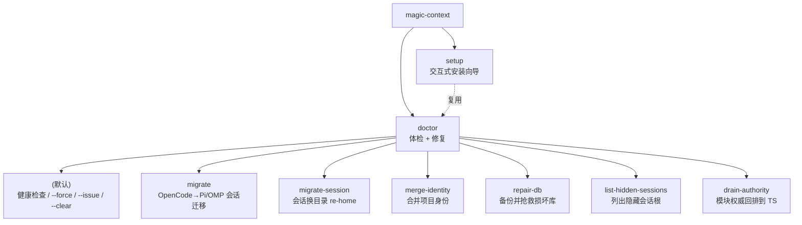
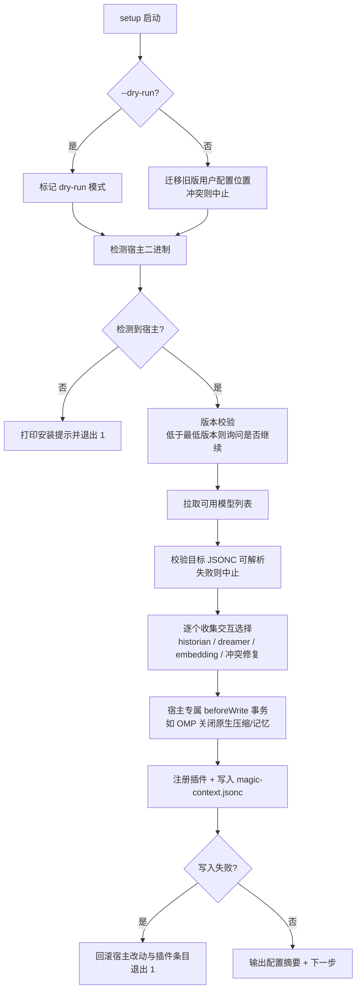
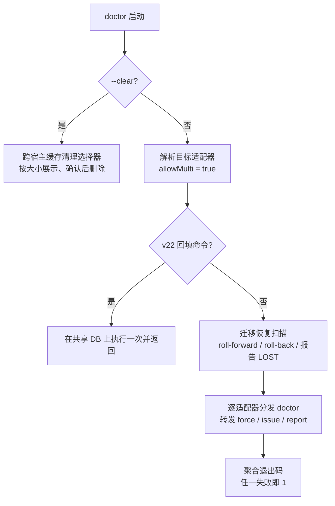

Magic Context 的 CLI（`@cortexkit/magic-context`，bin 名为 `magic-context`）把跨宿主（OpenCode / Pi / OMP）的日常运维收敛到三条命令主线：**setup** 负责一次性安装与配置，**doctor** 负责体检、自动修复与一组数据修复子命令，**migrate** 负责把既有会话在宿主之间搬运。本页聚焦这三条工作流的编排结构与交互契约——它们如何分发到宿主适配器、如何处理冲突与回滚、以及各类 `--dry-run` / `--force` / `--issue` 标志的语义。界面侧的斜杠命令（`/ctx-*`）属于另一层，请参见 [命令系统与 TUI 侧边栏](27-ming-ling-xi-tong-yu-tui-ce-bian-lan)。

## 统一入口与命令分发

CLI 的入口是一个极薄的 `main()`：它解析全局标志（`--help`/`-h`、`--version`/`-v`），然后按 `argv[0]` 惰性 `import()` 对应的命令模块。这种「顶层分发 + 动态导入」的结构让未用到的 doctor 实现（体积很大）不会拖慢 `setup`。`--version` 会依次尝试源码布局与发布布局两个相对路径来读取 `package.json` 版本号，因此无论从 `src/index.ts` 还是编译后的 `dist/index.js` 启动都能正确输出。

`doctor` 是一条复合命令：除了默认体检，它还挂载了 `migrate`、`migrate-session`、`merge-identity`、`repair-db`、`list-hidden-sessions`、`drain-authority` 等子命令，各自转发到独立模块。值得注意的是，进入 `doctor` 分支时会**先执行 SQLite 预检**（`runSqlitePreflight`），若当前运行时无法加载 `node:sqlite`（例如 Node < 24 且非 Bun），则直接返回 1 并打印兼容性诊断，而不是让后续模块导入抛错。

Sources: [packages/cli/src/index.ts](packages/cli/src/index.ts#L96-L178), [packages/cli/src/index.ts](packages/cli/src/index.ts#L26-L52), [packages/cli/src/lib/sqlite-preflight.ts](packages/cli/src/lib/sqlite-preflight.ts#L27-L38)

命令的分发结构可以用下面的树状关系表示：

## 宿主适配器与目标选择

所有命令都不直接感知 OpenCode / Pi / OMP 的差异，而是通过 **`HarnessAdapter`** 契约访问宿主。每个适配器封装四类能力：**检测**（宿主二进制是否安装、插件是否已注册）、**配置**（配置文件路径与读写）、**运行时状态**（日志、存储目录、插件缓存）、以及 **setup 动作**（如何注册插件）。`adapters/index.ts` 维护三个实例（`OpenCodeAdapter`、`PiAdapter`、`OmpAdapter`），`getInstalledAdapters()` 只返回宿主二进制实际存在的适配器。

Sources: [packages/cli/src/adapters/types.ts](packages/cli/src/adapters/types.ts#L62-L113), [packages/cli/src/adapters/index.ts](packages/cli/src/adapters/index.ts#L13-L17)

`resolveAdaptersForCommand()` 是 setup 与 doctor 共享的目标解析器。它的决策顺序为：`--harness` 硬覆盖 → 0 个已装宿主则弹选择并给出安装提示 → 恰好 1 个则静默使用 → 多个已装时按 `allowMulti` 决定多选或单选。`--harness` 的取值会被严格校验，非法值（如 `--harness foo` 或缺失值）直接抛错而非静默回退。

Sources: [packages/cli/src/lib/harness-select.ts](packages/cli/src/lib/harness-select.ts#L16-L30), [packages/cli/src/lib/harness-select.ts](packages/cli/src/lib/harness-select.ts#L48-L110)

| 标志 | 作用 | 默认行为 |
|---|---|---|
| `--harness opencode\|pi\|omp` | 硬指定目标宿主，跳过检测与提示 | 自动检测，多个已装时提示 |
| `--help` / `-h` | 打印用法并退出 0 | — |
| `--version` / `-v` | 打印 CLI 版本并退出 0 | — |
| `--dry-run` | 全流程演练但不落盘（setup / migrate / migrate-session） | 关闭 |
| `--force` | 强制清理插件缓存并修复可修复项（doctor） | 关闭 |
| `--issue` / `--report <path>` | 生成脱敏问题报告（doctor） | 关闭 |

Sources: [packages/cli/src/index.ts](packages/cli/src/index.ts#L54-L94), [packages/cli/src/commands/setup.ts](packages/cli/src/commands/setup.ts#L17-L34)

## setup：交互式安装向导

`setup` 的顶层逻辑非常克制：先解析 `--dry-run`，解析目标适配器（注意 setup 强制 `allowMulti: false`，因为 OpenCode 与 Pi 向导都会写入同一份 Magic Context 配置，共享选择只能收集一次），然后按 `adapter.kind` 分发到各自的实现，最后打印宿主的「下一步」提示。空闲宿主（无适配器）会以「Nothing to do」语义退出 0。

Sources: [packages/cli/src/commands/setup.ts](packages/cli/src/commands/setup.ts#L17-L61), [packages/cli/src/commands/setup.ts](packages/cli/src/commands/setup.ts#L63-L72), [packages/cli/src/commands/setup.ts](packages/cli/src/commands/setup.ts#L74-L103)

**Pi 与 OMP 共享同一套向导实现。** `runSetup` 的参数化设计把宿主差异外提为 `SetupEnvironment`（二进制检测、版本读取、模型枚举、路径解析）与 `PiCompatibleSetupHost`（安装命令、最低版本、插件条目写入与回滚）。OMP 只是复用这套流程，并把 `omp plugin install`、`PI_CODING_AGENT_DIR` 与 OMP 配置路径注入进去。向导会在动手写文件前先校验所有目标 JSONC 均可解析（`assertJsoncConfigsParseable`），把「半写坏」窗口前移为「写前失败」。

Sources: [packages/cli/src/commands/setup-pi.ts](packages/cli/src/commands/setup-pi.ts#L346-L418), [packages/cli/src/commands/setup-pi.ts](packages/cli/src/commands/setup-pi.ts#L419-L481), [packages/cli/src/commands/setup-omp.ts](packages/cli/src/commands/setup-omp.ts#L183-L191)

**收集全部选择后才落盘，是这套向导的核心不变量。** 无论是 OpenCode 还是 Pi 流程，historian 模型、dreamer 开关与任务、embedding provider、以及 GitHub Copilot 推理模型所需的 `thinking_level` 都在写文件之前一次性问完。若注册插件或写配置失败，会调用 `rollbackPluginEntry` 撤销注册、再执行 `beforeWrite` 返回的回滚闭包，最后以「rolled back」结束并返回 1。

Sources: [packages/cli/src/commands/setup-pi.ts](packages/cli/src/commands/setup-pi.ts#L433-L516), [packages/cli/src/commands/setup-pi.ts](packages/cli/src/commands/setup-pi.ts#L518-L536)

**OMP 的 beforeWrite 是事务化的。** 它会读取 `compaction.enabled` 与 `memory.backend`；若原生压缩开启则询问是否关闭，若记忆后端非 `off` 则询问是否切换为 `off`，任一拒绝都会中止安装以免出现「双上下文管理器」。它还会检查 OMP 有效设置是否来自项目/覆盖层配置——若是则**拒绝修改全局配置**并提示用户直接编辑那些文件。实际改写通过 `omp config set` 逐项执行，失败时按逆序回滚到原值。

Sources: [packages/cli/src/commands/setup-omp.ts](packages/cli/src/commands/setup-omp.ts#L81-L169)

**OpenCode 向导多出 DCP / OMO 冲突处理与 TUI 侧边栏注册。** 在写入前它会先解析 DCP（`@tarquinen/opencode-dcp`）冲突；若检出既有安装则调用 `detectConflicts` 收集冲突原因，并在用户同意后于写入阶段用 `fixConflicts` 应用修复。对于首次安装场景（`!hadExistingSetup`），它还会检出 oh-my-opencode 配置并提示关闭三个重叠钩子。写入阶段依次完成：把插件加入 `opencode.jsonc`（必要时移除 DCP）、修复冲突、写 `magic-context.jsonc`、把 TUI 侧边栏插件加入 `tui.json`。

Sources: [packages/cli/src/commands/setup-opencode.ts](packages/cli/src/commands/setup-opencode.ts#L418-L468), [packages/cli/src/commands/setup-opencode.ts](packages/cli/src/commands/setup-opencode.ts#L505-L595), [packages/cli/src/commands/setup-opencode.ts](packages/cli/src/commands/setup-opencode.ts#L597-L636)

各宿主向导的差异可归纳如下：

| 维度 | OpenCode | Pi | OMP |
|---|---|---|---|
| 插件注册方式 | 写入 `opencode.jsonc` 的 `plugin[]` | `packages[]` 写入 Pi 设置 | 经 `omp plugin install` |
| 最低版本校验 | 记录版本，Desktop 无 CLI 时转手动 | `>= 0.74.0` | `>= 17.1.7` |
| 宿主内建功能处置 | 关闭 `compaction.auto/prune` | — | 事务化关闭 `compaction.enabled`、`memory.backend` |
| 额外冲突面 | DCP、oh-my-opencode 钩子、TUI 插件 | — | 项目/覆盖层配置拒绝写入 |
| 模型发现 | 仅 CLI 可枚举；Desktop 回退手输 | 由宿主 CLI 枚举 | 由宿主 CLI 枚举 |
| 特殊提示 | Anthropic 模型询问 Claude Max（缓存 TTL 59m） | GitHub Copilot 模型要求 `thinking_level` | 复用 Pi 的 Copilot 逻辑 |

Sources: [packages/cli/src/commands/setup-opencode.ts](packages/cli/src/commands/setup-opencode.ts#L350-L498), [packages/cli/src/commands/setup-pi.ts](packages/cli/src/commands/setup-pi.ts#L96-L110), [packages/cli/src/commands/setup-pi.ts](packages/cli/src/commands/setup-pi.ts#L435-L456), [packages/cli/src/commands/setup-omp.ts](packages/cli/src/commands/setup-omp.ts#L70-L80)

`--dry-run` 会跑完整个交互流程（检测、拉模型、所有提问），但**不写任何文件、不注册任何包**，只打印「would ...」形式的意图。这在共享配置场景下尤其重要：dry-run 也会跳过旧配置位置迁移的写操作。

Sources: [packages/cli/src/commands/setup-pi.ts](packages/cli/src/commands/setup-pi.ts#L353-L366), [packages/cli/src/commands/setup-opencode.ts](packages/cli/src/commands/setup-opencode.ts#L335-L348), [packages/cli/src/commands/setup-pi.ts](packages/cli/src/commands/setup-pi.ts#L489-L507)

## doctor：体检、修复与专项子命令

默认 `doctor`（无子命令）的编排有三层：**全局一次性工作**、**逐适配器分发**、以及**标志转发**。分发前有两个必须只跑一次的步骤，因为它们操作的是**跨宿主共享的同一个 `context.db`**：一是 v22 回填命令（`--check-v22-backfill`/`--retry-v22-backfill`/`--rekey-v22-dir-identity`），二是中断会话迁移的恢复扫描（`sweepPendingMigrations`）。若按适配器各跑一遍，就会出现「第二次报告 0 行改动」这类被显式注释标记为 bug 的重复输出。

Sources: [packages/cli/src/commands/doctor.ts](packages/cli/src/commands/doctor.ts#L40-L125), [packages/cli/src/lib/v22-backfill-commands.ts](packages/cli/src/lib/v22-backfill-commands.ts#L40-L145)

恢复扫描的语义值得单独说明：`db_committed` 阶段的日志行会把暂存文件重命名到最终路径（**roll-forward**），`staged` 阶段的行则删除暂存文件并回滚（**roll-back**），而暂存文件与最终文件都缺失的行会被标记为 `LOST` 并以 error 级别输出——**绝不静默删除**，而是提示重跑 `doctor migrate` 重建。

Sources: [packages/cli/src/commands/doctor.ts](packages/cli/src/commands/doctor.ts#L83-L116), [packages/cli/src/commands/migrate.ts](packages/cli/src/commands/migrate.ts#L1634-L1655)

三个宿主的 doctor 共享 **PASS / WARN / FAIL** 摘要约定，并在末尾按失败数决定退出码。OpenCode doctor 的检查项覆盖：安装检测（多个安装会打印表格以暴露被遮蔽的二进制）、数据库路径与代际校验、配置有效性、插件 pin 归属、插件缓存新鲜度，以及 npm `min-release-age` 限制。Pi doctor 走 `runHealthChecks` 后同样输出摘要，`--force` 时执行 `repair` 并**再跑一遍检查**。OMP doctor 额外校验 `compaction.enabled=false` 与 `memory.backend=off` 是否落实。

Sources: [packages/cli/src/commands/doctor-opencode.ts](packages/cli/src/commands/doctor-opencode.ts#L748-L830), [packages/cli/src/commands/doctor-opencode.ts](packages/cli/src/commands/doctor-opencode.ts#L1547-L1671), [packages/cli/src/commands/doctor-pi.ts](packages/cli/src/commands/doctor-pi.ts#L1268-L1303), [packages/cli/src/commands/doctor-omp.ts](packages/cli/src/commands/doctor-omp.ts#L484-L500)

| 标志 | 语义 |
|---|---|
| （无） | 只读体检，输出 PASS/WARN/FAIL 摘要；有 FAIL 即退出 1 |
| `--force` | 修复可自动修复项（如清陈旧插件缓存）后**重新体检**；仅当仍无 FAIL 才退出 0 |
| `--issue` | 进入脱敏问题报告流程 |
| `--issue --report <path>` | 非交互地把报告写到指定路径，不提示 |
| `--clear` | 跳出适配器分发，改用跨宿主缓存清理选择器 |

Sources: [packages/cli/src/commands/doctor.ts](packages/cli/src/commands/doctor.ts#L127-L151), [packages/cli/src/commands/doctor.ts](packages/cli/src/commands/doctor.ts#L153-L227), [packages/cli/src/commands/doctor-pi.ts](packages/cli/src/commands/doctor-pi.ts#L1318-L1330)

`--clear` 不经过 per-harness 流程：它聚合所有已安装宿主的插件缓存、按大小列出、让用户多选，确认后才逐个删除（不可逆操作会二次确认）。`--issue` 则先收集脱敏诊断（`collectDiagnostics`），允许按会话过滤日志行，生成可拖拽到 GitHub issue 的 bundle；若选择提交则调用 `gh`，失败时回退为打印正文并给出手动创建链接。

Sources: [packages/cli/src/commands/doctor.ts](packages/cli/src/commands/doctor.ts#L158-L227), [packages/cli/src/commands/doctor-pi.ts](packages/cli/src/commands/doctor-pi.ts#L1120-L1227)

`doctor` 下还挂载了若干**数据修复类子命令**，它们绕过目标宿主解析，直接作用于共享存储：

| 子命令 | 关键标志 | 作用与安全约束 |
|---|---|---|
| `migrate` | `--from --to --session --max-messages --dry-run` | 将会话迁移到 Pi/OMP（见下节） |
| `migrate-session` | `--session --to <dir> --memories --dry-run --yes` | 把 OpenCode 会话换绑到另一工作目录 |
| `merge-identity` | `--from <ID> --to <ID> [--dry-run] [--yes] [--db]` | 合并两个项目身份的项目域行；无 `--yes` 拒绝变更 |
| `repair-db` | （无标志） | 备份后用 SQLite `.recover` 抢救损坏的 `context.db`；不可救时才另开确认提供空库重置 |
| `list-hidden-sessions` | （无标志） | 列出 OpenCode 2 的历史学家/Dreamer 隐藏根会话（永不自动删除） |
| `drain-authority <project>` | 位置参数 `<project>` | 把模块（subc）的记忆/笔记权威回排到 TypeScript |

Sources: [packages/cli/src/commands/doctor-merge-identity.ts](packages/cli/src/commands/doctor-merge-identity.ts#L31-L90), [packages/cli/src/commands/doctor-repair-db.ts](packages/cli/src/commands/doctor-repair-db.ts#L426-L430), [packages/cli/src/commands/doctor-hidden-sessions.ts](packages/cli/src/commands/doctor-hidden-sessions.ts#L86-L116), [packages/cli/src/index.ts](packages/cli/src/index.ts#L119-L155)

## migrate：会话迁移工作流

`doctor migrate` 把 OpenCode 会话转换为 Pi/OMP 兼容的 JSONL 会话，并**同时**搬运 Magic Context 状态。目前仅支持 **OpenCode → Pi/OMP** 单向迁移；反向或其它组合会在参数校验阶段明确报错。校验要求 `--from`、`--to`、`--session` 齐备，且 `--max-messages` 必须为正整数。

Sources: [packages/cli/src/commands/migrate.ts](packages/cli/src/commands/migrate.ts#L1341-L1364), [packages/cli/src/commands/migrate.ts](packages/cli/src/commands/migrate.ts#L1657-L1725)

| 项目 | 是否随迁移携带 |
|---|---|
| 消息内容（文本、工具调用、推理文本） | ✅ 保留 |
| Token 计数（input/output/cache） | ✅ 保留（Pi 的上下文用量显示依赖它） |
| Compartments | ✅ 复制并重映射到 Pi 条目 ID |
| Session facts | ✅ 复制 |
| 项目记忆（project memories） | ✅ 本已共享，无需迁移 |
| 文件附件 | ⚠️ 替换为 `<file omitted: name>` 标记 |
| 推理签名 / step-start、step-finish | ❌ 剥离 |

Sources: [packages/cli/src/commands/migrate.ts](packages/cli/src/commands/migrate.ts#L1596-L1631)

`migrate` 的崩溃安全依赖共享库中的 **`migration_pending` 日志**。每次迁移都会：先写暂存文件（`staged`）、再提交共享状态并标记（`db_committed`）、最后重命名到最终路径。若中途被打断，下次运行 `doctor migrate` 或普通 `doctor` 时，恢复扫描会**按阶段**协调——复用原始 Pi 会话 ID 而非重新生成第二个——从而避免产生重复会话。日志键由「源会话 + 目标宿主」哈希得到。

Sources: [packages/cli/src/commands/migrate.ts](packages/cli/src/commands/migrate.ts#L96-L120), [packages/cli/src/commands/migrate.ts](packages/cli/src/commands/migrate.ts#L296-L360), [packages/cli/src/commands/migrate.ts](packages/cli/src/commands/migrate.ts#L1669-L1706)

`migrate-session` 处理的是另一类需求：把**同一个** OpenCode 会话换绑到新的工作目录（项目 re-home）。它先 `planMigrateSession` 生成计划，再执行**安全断言** `assertMigrateSessionIsSafeToRehome`——在确认目标项目由 TypeScript 侧持有写入权威之前拒绝落盘（若模块不可达但存在持久权威标记，则拒绝并要求先 `drain-authority`）。随后提示记忆处置方式，确认 OpenCode 已完全停止，做 WAL checkpoint 并对两个库做快照备份，最后才应用变更。

Sources: [packages/cli/src/commands/migrate-session.ts](packages/cli/src/commands/migrate-session.ts#L543-L562), [packages/cli/src/commands/migrate-session.ts](packages/cli/src/commands/migrate-session.ts#L656-L679), [packages/cli/src/commands/migrate-session.ts](packages/cli/src/commands/migrate-session.ts#L748-L803)

`--memories` 的记忆处置选项构成一个小型决策面：

| 取值 | 含义 |
|---|---|
| `move-originated`（默认推荐） | 仅迁移源自本会话的记忆 |
| `move-all` | 迁移该项目全部可注入记忆 |
| `copy-originated` | 仅复制源自本会话的记忆 |
| `copy-all` | 复制该项目全部可注入记忆 |
| `leave` | 记忆保持原样 |

Sources: [packages/cli/src/commands/migrate-session.ts](packages/cli/src/commands/migrate-session.ts#L543-L587), [packages/cli/src/commands/migrate-session.ts](packages/cli/src/commands/migrate-session.ts#L60-L70)

## 退出码、幂等性与阅读路径

三条工作流共享一组交互约定：**交互取消**（用户按 Ctrl-C / 取消提示）被规范化为退出码 0，而非错误；**未知命令**打印用法并返回 1；`setup`/`migrate`/`migrate-session` 的 `--dry-run` 保证零写入，可用于在共享配置环境下预演。整体设计以**幂等**为原则——插件条目注册、冲突修复、缓存清理都可在重跑时安全地再次执行。

Sources: [packages/cli/src/index.ts](packages/cli/src/index.ts#L96-L178), [packages/cli/src/commands/setup-pi.ts](packages/cli/src/commands/setup-pi.ts#L489-L516)

| 退出码 | 触发条件 |
|---|---|
| `0` | 成功；或用户主动取消提示；或 doctor 修复后无 FAIL |
| `1` | 参数非法 / 宿主未安装 / 配置解析失败 / 写入失败并回滚 / doctor 存在无法修复的 FAIL |

Sources: [packages/cli/src/commands/doctor-pi.ts](packages/cli/src/commands/doctor-pi.ts#L1279-L1303), [packages/cli/src/commands/setup.ts](packages/cli/src/commands/setup.ts#L55-L60)

**建议的后续阅读**：先用 [快速开始：安装向导、首次会话与最小可用配置](2-kuai-su-kai-shi-an-zhuang-xiang-dao-shou-ci-hui-hua-yu-zui-xiao-ke-yong-pei-zhi) 走通首次安装，再回到本页理解各标志细节；若 doctor 报出冲突或插件未生效，请转到 [兼容性冲突检测与故障排查](6-jian-rong-xing-chong-tu-jian-ce-yu-gu-zhang-pai-cha)；想了解迁移后会话如何在宿主中被管理的对话内命令，参见 [命令系统与 TUI 侧边栏](27-ming-ling-xi-tong-yu-tui-ce-bian-lan)；而迁移所涉及的共享存储与 schema 版本约束，参见 [SQLite 存储模式、迁移与时间戳约定](21-sqlite-cun-chu-mo-shi-qian-yi-yu-shi-jian-chuo-yue-ding)。