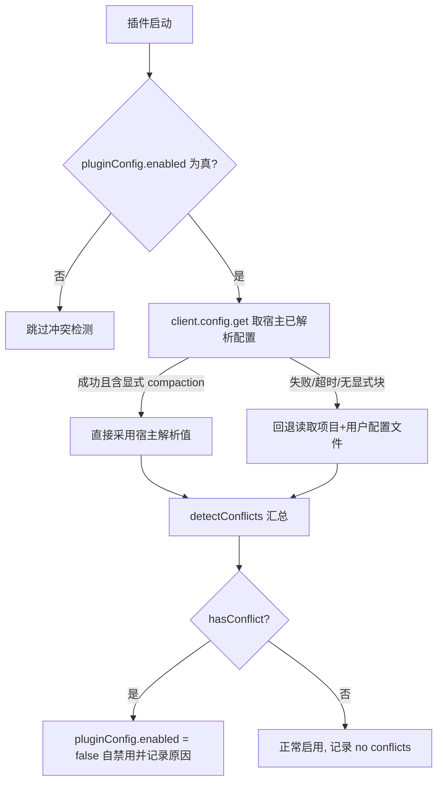
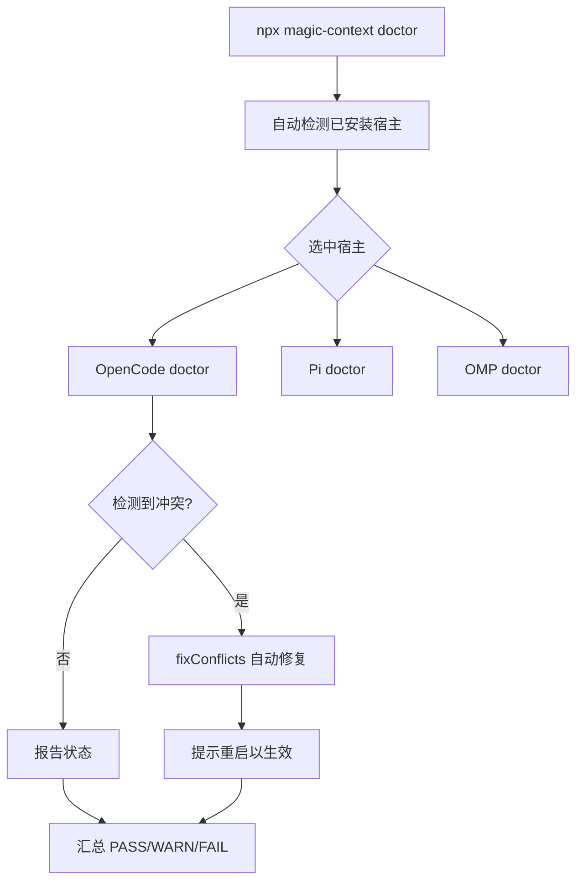

Magic Context 要端到端地接管上下文管理。它的核心假设是：一个会话窗口里只能有一个"上下文管理者"。如果系统里已经存在另一个上下文管理器（宿主自带的压缩、其他压缩插件），两者同时工作会把历史压缩两遍，并导致提示缓存反复失效。因此 Magic Context 遇到冲突时会**主动禁用自己（fail-safe）**，而不是带着不确定性继续运行。本页讲清两件事：插件在启动时如何自动识别冲突，以及当出现问题时如何用 `doctor` 命令定位并修复。

Sources: [README.md](README.md#L183-L194), [conflict-detector.ts](packages/plugin/src/shared/conflict-detector.ts#L103-L116)

## 为什么需要冲突检测

Magic Context 的检测模块在启动时枚举所有"会与它争夺同一个职责"的配置项，并把每一项归类为布尔冲突标志。检测结果 `ConflictResult` 同时携带三样东西：是否有冲突（`hasConflict`）、可读的冲突原因列表（`reasons`）、以及逐项冲突标志（`conflicts`，供修复器做定向修复）。此外还有一个 `nativeCompaction` 字段，用于如实报告宿主原生压缩的当前状态（即使当前不是冲突），这样在两种模式下都能给用户诚实的结论。

Sources: [conflict-detector.ts](packages/plugin/src/shared/conflict-detector.ts#L31-L56), [conflict-detector.ts](packages/plugin/src/shared/conflict-detector.ts#L117-L208)

检测模块的入口是 `detectConflicts(directory, options)`。其中 `compactionEnabled` 代表"Magic Context 自身的压缩模式"，必须由调用方（插件启动、setup、doctor、修复器）通过同一个访问器解析后显式传入，绝不在此处重新推导；无法提供的调用点会退回默认的"开启"语义，而**永远不会静默跳过检查**。

Sources: [conflict-detector.ts](packages/plugin/src/shared/conflict-detector.ts#L72-L101)

## 冲突类型一览

冲突被划分为几个互补的类别，覆盖 OpenCode 与 OMP/Pi 两条宿主线。下表给出每一类的检测方式与修复动作。

| 冲突类别 | 检测对象 | 判定方式 | 修复动作 |
|---|---|---|---|
| OpenCode 自动压缩 | `compaction.auto` | 宿主已解析配置或配置文件里为 `true` | 写入 `auto=false` |
| OpenCode 剪枝 | `compaction.prune` | 同上 | 写入 `prune=false` |
| DCP 插件 | `@tarquinen/opencode-dcp` | 在 `plugin` 列表中按规范包名匹配 | 从 `plugin` 数组移除条目 |
| OMO 抢先压缩钩子 | `preemptive-compaction` | OMO 已装且该钩子未在 `disabled_hooks` 中 | 追加到 `disabled_hooks` |
| OMO 窗口监控钩子 | `context-window-monitor` | 同上 | 追加到 `disabled_hooks` |
| OMO Anthropic 恢复钩子 | `anthropic-context-window-limit-recovery` | 同上 | 追加到 `disabled_hooks` |
| OMP 原生压缩 | `compaction.enabled` | OMP 设置为 `true` | 设为 `false` |
| OMP 自动记忆 | `memory.backend` | OMP 设置为非 `off` 的字符串 | 设为 `off` |

Sources: [conflict-detector.ts](packages/plugin/src/shared/conflict-detector.ts#L133-L197), [doctor-omp.ts](packages/cli/src/commands/doctor-omp.ts#L210-L243), [README.md](README.md#L185-L193)

包名匹配有意做得保守：只匹配规范的 npm 包名（允许 `@version` 后缀），`file://`、`http(s)://` 或相对路径形式的条目一律不匹配。这样，以不同包名发布的 fork（例如 `oh-my-opencode-slim`）不会被误判为冲突，因为这类 fork 通常并不附带会冲突的转换钩子。

Sources: [conflict-detector.ts](packages/plugin/src/shared/conflict-detector.ts#L437-L491), [conflict-detector.ts](packages/plugin/src/shared/conflict-detector.ts#L540-L582)

OMO 钩子的检测会同时读取旧版 `oh-my-opencode.jsonc` / `oh-my-openagent.jsonc`（位于 OpenCode 配置目录和项目目录）以及新版统一配置 `omo.jsonc`（用户级 `~/.omo/` 与项目级 `.omo/`，钩子配置位于 `[opencode]` 块内）。只要 OMO 已安装，三个钩子就默认"激活"，除非它们被明确写进 `disabled_hooks`。

Sources: [conflict-detector.ts](packages/plugin/src/shared/conflict-detector.ts#L584-L644)

## 启动时的自动冲突检测

插件启动路径上，冲突检测有一个明确的优先级设计：**以宿主自己解析出来的配置为准**，而不是自己重新读文件推导。原因是文件读取看不到宿主折叠进去的所有层级（环境变量指定的配置路径、托管配置、多文件合并）。如果用户的 `auto=false` 恰好写在我们读不到的层级里，重新推导会默认成 `auto=true`，从而错误地禁用插件——这是唯一"错向"的方向，因为一次误禁用会导致没有任何东西管理窗口，长会话必然溢出。

Sources: [index.ts](packages/plugin/src/index.ts#L247-L287), [conflict-detector.ts](packages/plugin/src/shared/conflict-detector.ts#L240-L261)

`resolveCompactionForBoot` 负责获取宿主的已解析配置（`ctx.client.config.get()`，与 `opencode debug config` 打印的是同一个对象）。它设有超时上限，避免启动被阻塞；并且只有当响应里存在**显式的布尔值**时才采信。若响应没有 `compaction` 块（例如服务端结构漂移、或抓取与启动竞争），会被判为"无法定论"并返回 `null`，调用方随即退回基于文件的检测。

Sources: [conflict-detector.ts](packages/plugin/src/shared/conflict-detector.ts#L262-L330)

下面这张图概括了启动时的判定流程：

回到文件回退路径时，优先读项目级 `.opencode/opencode.jsonc`，其次根目录 `opencode.jsonc`，最后用户级配置；都没命中就按 OpenCode 默认（`auto=true`）处理。此外环境变量 `OPENCODE_DISABLE_AUTOCOMPACT` 会短路两条路径，直接判定 `auto=false`。

Sources: [conflict-detector.ts](packages/plugin/src/shared/conflict-detector.ts#L332-L433)

**压缩关闭模式（compaction-off）** 是一个关键例外：当 Magic Context 自身的压缩被关闭时，原生压缩就是用户选定的窗口管理者，此时 `compaction.auto=true` / `prune=true` **不算冲突**，插件保持启用。DTO 与三个 OMO 钩子则在两种模式下都保持原有冲突策略。OpenCode 2 宿主（`hostGeneration: "v2"`）还有独立分支：只有 `compaction.auto` 这一个字段参与判定，`prune` 恒为 `false`。v2 注册路径同样会在检测到冲突时明确拒绝注册，并打印原因。

Sources: [conflict-detector.ts](packages/plugin/src/shared/conflict-detector.ts#L148-L167), [conflict-detector.ts](packages/plugin/src/shared/conflict-detector.ts#L293-L324), [context.ts](packages/plugin/src/v2/hooks/context.ts#L156-L170)

## 冲突发生时用户看到什么

插件自禁用后不会静默消失，而是通过两条路径把原因和修复指令送到用户面前。TUI 通过启动对话框呈现；Desktop 模式则由 `conflict-warning-hook` 读取 Desktop 应用状态、定位当前活动会话，再通过 RPC 推送一条警告消息。两者共用同一段文案：以"Magic Context is disabled due to conflicting configuration"开头，列出全部原因，并以一条 `doctor` 修复命令收尾。

Sources: [conflict-warning-hook.ts](packages/plugin/src/plugin/conflict-warning-hook.ts#L1-L18), [conflict-warning-hook.ts](packages/plugin/src/plugin/conflict-warning-hook.ts#L204-L231), [conflict-detector.ts](packages/plugin/src/shared/conflict-detector.ts#L646-L660)

反过来，当冲突被解决、插件恢复正常运行时，启动流程会清理上一轮遗留的冲突警告消息，并推送一条"Magic Context is now enabled"的状态通知。清理逻辑从会话消息尾部向前扫描，只会删除连续的、被标记为 ignored 的警告文本消息。

Sources: [conflict-warning-hook.ts](packages/plugin/src/plugin/conflict-warning-hook.ts#L233-L337)

## doctor：一键诊断与自动修复

`doctor` 是排障的总入口。它先自动检测已安装的宿主（OpenCode / Pi / OMP），也可以被 `--harness` 明确指定；随后逐个宿主分发到对应的 doctor 实现。最终汇总为 `PASS / WARN / FAIL` 三个计数，只要任一宿主返回非零就整体失败。

Sources: [doctor.ts](packages/cli/src/commands/doctor.ts#L40-L151), [CONFIGURATION.md](CONFIGURATION.md#L148-L168)

OpenCode doctor 会依次检查：安装状态与可执行性、CLI 版本与 npm latest、`magic-context.jsonc` 能否解析并通过 schema 加载、插件注册（保留本地 dev 路径）、**冲突（compaction / DCP / OMO 钩子）**、TUI 侧边栏配置、嵌入端点、共享数据库的存在性 + `PRAGMA integrity_check` + 行数、插件缓存，以及历史学家调试转储。

Sources: [doctor-opencode.ts](packages/cli/src/commands/doctor-opencode.ts#L786-L886), [doctor-opencode.ts](packages/cli/src/commands/doctor-opencode.ts#L1265-L1317), [CONFIGURATION.md](CONFIGURATION.md#L162)

在冲突这一检查点，doctor 会明确说明它用的是文件回退路径，并提示"运行中的服务端已解析配置可能不同，以 `opencode debug config` 为准"。随后它调用 `fixConflicts` 执行自动修复，并把每条修复动作作为 `Fixed:` 行输出，最后提示重启以生效。

Sources: [doctor-opencode.ts](packages/cli/src/commands/doctor-opencode.ts#L1270-L1298)

Pi doctor 的冲突检查略有不同：Pi 目前没有已知的竞争性上下文扩展，因此它只检查**自冲突**——例如同时在 `packages[]` 里注册了 npm 条目和本地 dev 路径条目，导致插件被加载两次。

Sources: [doctor-pi.ts](packages/cli/src/commands/doctor-pi.ts#L925-L947)

OMP doctor 则以 `--force` 执行安全修复：安装/启用插件、把 `compaction.enabled` 设为 `false`、把 `memory.backend` 设为 `off`。当有效设置来自项目级/覆盖层配置时，它会**拒绝自动改全局设置**，只给出警告，避免覆盖用户的局部选择。

Sources: [doctor-omp.ts](packages/cli/src/commands/doctor-omp.ts#L165-L260), [doctor-omp.ts](packages/cli/src/commands/doctor-omp.ts#L349-L390)

## 自动修复会改动什么

`fixConflicts(directory, conflicts, options)` 按冲突标志做定向修补：把 `compaction.auto` / `compaction.prune` 写成 `false`（若原本没有 `compaction` 块则新建一个），从 OpenCode 配置的 `plugin` 数组中移除 DCP 条目，并把三个冲突的 OMO 钩子写进 `disabled_hooks`。所有写入都通过 JSONC 编辑函数进行，以保留注释与既有的 tuple/选项条目。

Sources: [conflict-fixer.ts](packages/plugin/src/shared/conflict-fixer.ts#L182-L295), [conflict-fixer.ts](packages/plugin/src/shared/conflict-fixer.ts#L140-L162)

修复器严格遵守模式边界：**在 compaction-off 模式下，它绝不翻动原生压缩字段**，`compaction.auto` / `prune` 会保持原样字节不动，因为此时原生压缩（或什么都不用）是用户选定的窗口管理者。DCP 与 OMO 钩子的修复则在两种模式下都照常进行。统一 `omo.jsonc` 的写入会被导向 `[opencode].disabled_hooks` 路径。

Sources: [conflict-fixer.ts](packages/plugin/src/shared/conflict-fixer.ts#L164-L199), [conflict-fixer.ts](packages/plugin/src/shared/conflict-fixer.ts#L253-L279)

setup 向导同样内建了冲突处理：它会在改动任何文件之前先检查 DCP 插件，明确告知"两者都管理上下文、同时运行会导致不可预期行为"，并询问是否移除；向导还会在写入时把压缩字段一并关闭。

Sources: [setup-opencode.ts](packages/cli/src/commands/setup-opencode.ts#L251-L271), [setup-opencode.ts](packages/cli/src/commands/setup-opencode.ts#L180-L196)

## 数据层兼容性：schema fence 与共享数据库

除了配置冲突，还有一类"版本兼容性"故障：当 OpenCode 与 Pi 共享同一个 `context.db`，其中一个宿主先自动升级、把数据库迁移到更新的 schema，落后的一方就会在存储层被拒绝。为此存在**schema fence（兼容围栏）**：打开数据库后、执行任何查询或迁移写入之前，必须先校验持久化的版本号。

Sources: [database-access.ts](packages/cli/src/lib/database-access.ts#L91-L135), [storage-db.ts](packages/plugin/src/features/magic-context/storage-db.ts#L350-L365)

围栏的判定逻辑是：数据库版本**高于**本构建支持的上限即为"警报"——意味着一个陈旧的常驻服务被卡住了；数据库版本**低于**支持上限只是"迁移待处理"，不算故障；只有当存在阻塞进程时才会升级为警报。

Sources: [storage-versions.ts](packages/cli/src/lib/storage-versions.ts#L42-L79)

当围栏拒绝发生时，插件不会静默降级，而是走**fail-closed 阻断**路径：每次主会话转换都会抛出一个可操作的错误，而不是悄悄回落到原生压缩（历史上这曾导致用户看到 136%+ 的溢出却毫无提示）。Desktop 模式还会推送一条专门的 schema-fence 警告，说明是"更新的构建升级了共享数据库"、当前构建只支持到某个版本、数据安全、以及最快的修复命令是 `doctor --force`。

Sources: [fail-closed-block.ts](packages/plugin/src/features/magic-context/fail-closed-block.ts#L1-L20), [conflict-warning-hook.ts](packages/plugin/src/plugin/conflict-warning-hook.ts#L339-L376)

doctor 在检查共享数据库时，还会额外核验**被固定（pinned）版本的插件**自身的兼容围栏——因为 CLI 能读库，并不代表真正要运行的插件能读库。它会从已安装的包或 npm tarball 中解析出该固定版本携带的围栏值，并与当前数据库版本比对：不匹配即 FAIL，无法解析即 UNKNOWN（同样计为问题，不允许"无法检查"蒙混成健康）。

Sources: [doctor-opencode.ts](packages/cli/src/commands/doctor-opencode.ts#L1444-L1481), [opencode-plugin-schema-fence.ts](packages/cli/src/lib/opencode-plugin-schema-fence.ts#L15-L29)

## 配置兼容性与安全边界

配置文件本身的兼容性问题主要有三类。第一类是**解析失败**：`magic-context.jsonc` 若无法解析，插件会尽力恢复可用的值（或退回默认值），并把失败详情格式化输出，同时在状态诊断里保留这条警告，直到用户修好文件。

Sources: [config-diagnostics.ts](packages/plugin/src/shared/config-diagnostics.ts#L29-L60), [config-warning-surface.ts](packages/plugin/src/shared/config-warning-surface.ts#L4-L28)

第二类是**废弃键的迁移**：例如已移除的 `sidekick` 配置会被忽略并给出警告；旧式的 `dreamer.enabled` / `historian.enabled` 会被 doctor 迁移到新语义（`disable=true`）。

Sources: [removed-agent-config.ts](packages/plugin/src/config/removed-agent-config.ts#L1-L4), [doctor-opencode.ts](packages/cli/src/commands/doctor-opencode.ts#L152-L200)

第三类是**不可信项目配置的加固**。项目配置位于用户克隆下来的仓库里，因此打开仓库绝不能让该仓库的配置提权或窃取密钥。`stripUnsafeProjectConfigFields` 会剥离项目层里可能构成提权/代码执行向量的字段（如隐藏 agent 的 `prompt` / `permission` / `tools`、嵌入端点、被引用的路径等），并把压缩阈值约束为"只允许抬高、不允许降低"，从而避免克隆来的仓库替用户强制更早的历史压缩或额外花费。

Sources: [project-security.ts](packages/plugin/src/config/project-security.ts#L8-L60), [project-security.ts](packages/plugin/src/config/project-security.ts#L136-L194)

## 故障排查速查表

下表把常见症状与对应的原因和处置动作对应起来，可作为排障时的第一参照。

| 症状 | 可能原因 | 处置 |
|---|---|---|
| 插件静默不工作，日志出现 "disabled due to conflicts" | 检测到压缩/DCP/OMO 冲突 | 运行 `doctor`，它会自动修复并提示重启 |
| 提示 "database is newer than this version" | OpenCode 与 Pi 共享库被更新版本迁移；存在固定/陈旧插件 | 升级或解除固定，运行 `doctor --force`，重启 |
| `doctor` 报 "Pinned plugin schema fence mismatch" | 插件条目被钉在旧版本，其围栏低于当前库版本 | 解除固定（改用 `@latest`）或升级到支持的版本 |
| `doctor` 报 "UNKNOWN ... schema fence" | 无法解析被固定插件携带的围栏 | 安装该固定包后重跑，或解除固定/升级 |
| `magic-context.jsonc` 解析失败 | JSONC 语法错误 | 按行号列号修正文件；插件当前运行在恢复值/默认值上 |
| `doctor` 报 "cannot use SQLite in this runtime" | 运行时缺少可用 SQLite 后端 | 安装 Node.js ≥ 24，或使用带 `node:sqlite` 的 Bun 构建 |
| `doctor` 报 "SQLite integrity_check" 非 ok | 共享数据库损坏 | 运行 `doctor repair-db`（先备份，无 DBPAGE_VTAB 时只备份不改动） |
| 升级后插件仍停在旧版本 | `~/.npmrc` 的 min-release-age 限制 | 临时移除限制、重启、再恢复 |
| 启动提示 OMP 原生压缩/记忆冲突 | `compaction.enabled=true` 或 `memory.backend≠off` | `doctor --harness omp --force`（存在项目级覆盖时会拒绝全局修复） |
| Pi 里插件被加载两次 | `packages[]` 同时含 npm 与本地 dev 条目 | `doctor --harness pi` 报告自冲突，手动移除其一 |

Sources: [conflict-detector.ts](packages/plugin/src/shared/conflict-detector.ts#L646-L660), [doctor-opencode.ts](packages/cli/src/commands/doctor-opencode.ts#L1455-L1496), [sqlite-preflight.ts](packages/cli/src/lib/sqlite-preflight.ts#L17-L38), [database-repair-guidance.ts](packages/cli/src/lib/database-repair-guidance.ts#L1-L8), [doctor-opencode.ts](packages/cli/src/commands/doctor-opencode.ts#L1583-L1606), [doctor-omp.ts](packages/cli/src/commands/doctor-omp.ts#L210-L243), [doctor-pi.ts](packages/cli/src/commands/doctor-pi.ts#L925-L947)

## doctor 子命令与诊断出口

除默认的健康检查外，`doctor` 还提供一组面向具体故障的子命令与开关，覆盖数据修复、会话迁移与诊断打包。理解它们的分工能让你在遇到问题时选对工具。

| 命令 | 作用 |
|---|---|
| `doctor` | 健康检查 + 自动修复（默认入口） |
| `doctor --force` | 强制清理插件缓存 / 执行安全修复 |
| `doctor --issue` | 打包脱敏的诊断报告并（可选）提交 GitHub issue |
| `doctor --issue --report <path>` | 只写出诊断报告，不触发交互 |
| `doctor --clear` | 交互式选择要清理的插件缓存 |
| `doctor repair-db` | 备份并抢救损坏的共享数据库 |
| `doctor migrate` | 把 OpenCode 会话内容迁移为 Pi/OMP 的 JSONL |
| `doctor migrate-session` | 把 OpenCode 会话重新归属到另一个目录/项目 |
| `doctor merge-identity` | 合并两个身份之间的所有项目级行 |
| `doctor list-hidden-sessions` | 只读列出 OpenCode 2 的 historian/Dreamer 根会话 |
| `doctor drain-authority` | 把模块的记忆/笔记权威回迁到 TypeScript 侧 |

Sources: [index.ts](packages/cli/src/index.ts#L1-L91), [doctor.ts](packages/cli/src/commands/doctor.ts#L40-L125)

其中 `doctor repair-db` 的退出码区分了四种结局：成功抢救、失败、无法抢救、以及"拒绝改动"。它对是否可安全操作也做了保守判定——例如检测到数据库被其他进程持有时会拒绝执行，避免损坏正在使用的文件。

Sources: [doctor-repair-db.ts](packages/cli/src/commands/doctor-repair-db.ts#L28-L45)

此外，诊断信息会被结构化收集，供 `--issue` 使用。诊断报告包含平台、版本、配置路径、冲突结果、存储目录、日志文件检查、以及近期会话与历史学家转储等字段，并对路径与文本做脱敏处理后再打包。

Sources: [diagnostics-opencode.ts](packages/cli/src/lib/diagnostics-opencode.ts#L43-L116)

## 下一步

本页聚焦于"冲突检测与故障排查"这一入门环节。若想进一步理解被检测的这些机制本身如何运作，建议继续阅读：

- 想了解 `doctor`、`setup`、`migrate` 的完整命令工作流与参数，请参阅 [命令向导：setup / doctor / migrate 工作流](5-ming-ling-xiang-dao-setup-doctor-migrate-gong-zuo-liu)。
- 想理解共享数据库的迁移、schema 围栏与时间戳约定，请参阅 [SQLite 存储模式、迁移与时间戳约定](21-sqlite-cun-chu-mo-shi-qian-yi-yu-shi-jian-chuo-yue-ding)。
- 想理解被冲突检测守护的上下文转换引擎，请参阅 [转换通道生命周期与阶段划分](9-zhuan-huan-tong-dao-sheng-ming-zhou-qi-yu-jie-duan-hua-fen)。
- 想理解多宿主（OpenCode / Pi / OMP）各自的适配细节，请参阅 [OpenCode 1 与 OpenCode 2 适配层](23-opencode-1-yu-opencode-2-gua-pei-ceng) 与 [Pi / OMP 插件与跨宿主对等实现](24-pi-omp-cha-jian-yu-kua-su-zhu-dui-deng-shi-xian)。