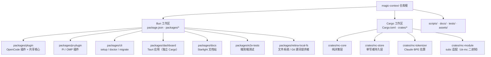
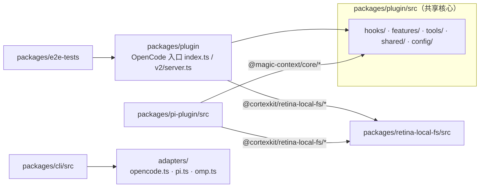
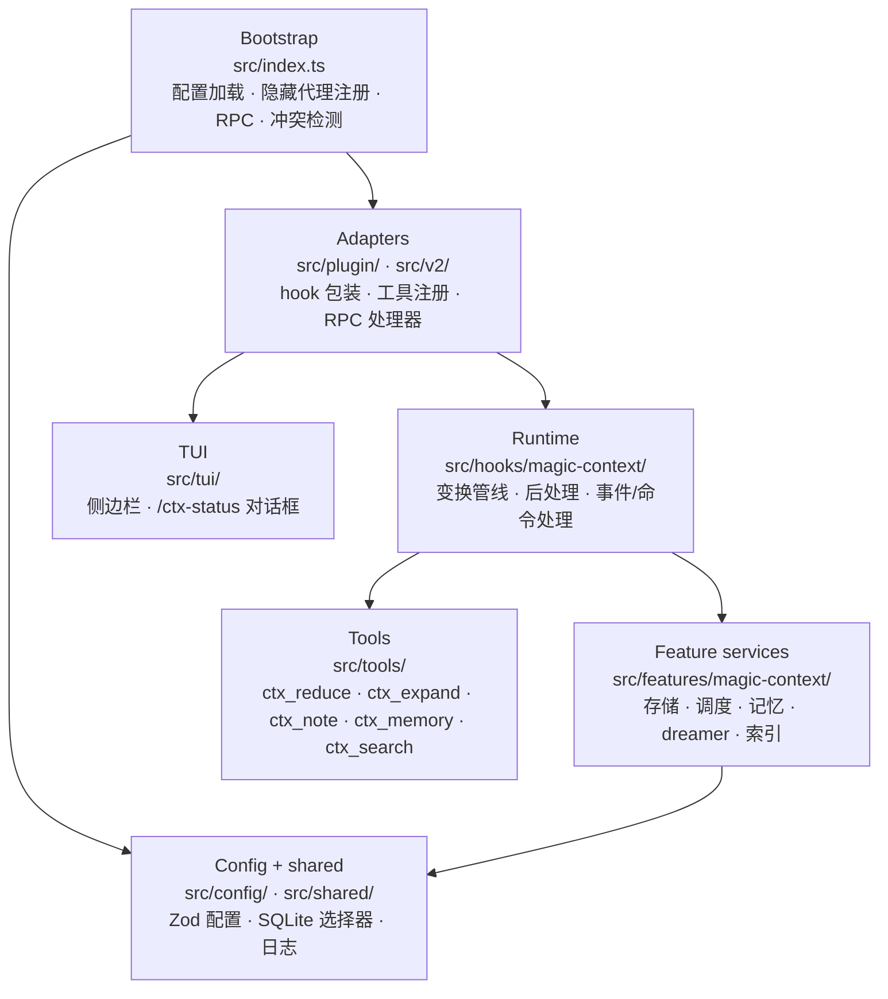
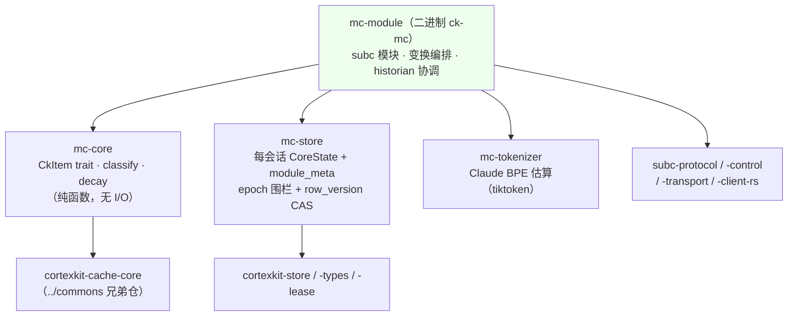
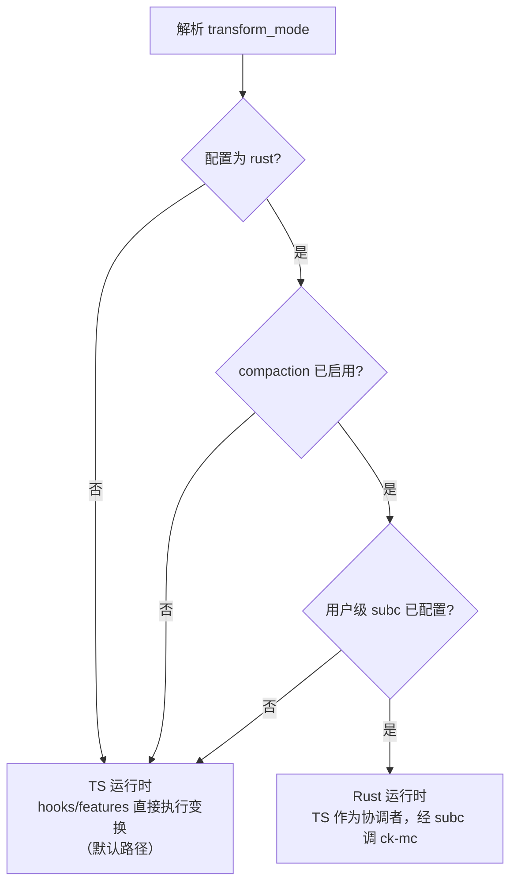

Magic Context 采用**单仓多包（monorepo）**组织方式：同一仓库内并列两个彼此独立的工作区——一个以 Bun 管理的 TypeScript 包工作区，以及一个 Cargo 管理的 Rust crate 工作区。二者共同支撑同一套"缓存稳定上下文引擎"，但服务的技术栈、发布节奏与依赖方向各不相同。本页聚焦于**仓库拓扑、包与 crate 的分层职责、依赖方向，以及运行时（TS 与 Rust）之间的协作边界**。它不展开缓存稳定的具体不变量（见 [缓存稳定性的核心设计哲学](8-huan-cun-wen-ding-xing-de-he-xin-she-ji-zhe-xue)），也不深入 Rust 运行模式的完整接线（见 [Rust 运行时模式与 subc 模块集成](25-rust-yun-xing-shi-mo-shi-yu-subc-mo-kuai-ji-cheng)）。

## 仓库拓扑：两个工作区并列

仓库根目录同时声明了两个互相独立的工作区清单。TypeScript 侧由根 `package.json` 声明 `workspaces: ["packages/*"]`，并由 Bun 作为唯一包管理器（`packageManager: "bun@1.4.2"`）；Rust 侧由根 `Cargo.toml` 声明 `[workspace]`，成员为 `crates/mc-core`、`crates/mc-store`、`crates/mc-module`、`crates/mc-tokenizer`。两条工作区并非相互嵌套，而是**并列共存**——TypeScript 会话与工具链是 cwd 绑定的，Rust 工作区则留在仓库内以复用同一份缓存稳定上下文。

Sources: [package.json](package.json#L1-L9), [Cargo.toml](Cargo.toml#L1-L8)

一个关键的非对称点是：Rust 工作区**显式排除**了桌面仪表盘的 Tauri crate（`exclude = ["packages/dashboard/src-tauri"]`）。也就是说，`packages/dashboard/src-tauri` 虽位于 `packages/` 之下、属于 Bun 工作区可见范围，却拥有自己独立的 Cargo 构建与独立的 `rusqlite` 版本，不参与根 Rust 工作区的统一依赖解析。这一排除是有意为之——Tauri 应用需要以裸 `cargo run` 启动（`default-run` 固定为主应用），若并入工作区会引入解析冲突。

Sources: [Cargo.toml](Cargo.toml#L1-L8), [packages/dashboard/src-tauri/Cargo.toml](packages/dashboard/src-tauri/Cargo.toml#L1-L12)

Rust 工作区的依赖通过 workspace 级别的 `[workspace.dependencies]` 集中声明，并大量使用指向**同主机上兄弟仓库**的路径依赖：`cortexkit-cache-core` / `cortexkit-store` / `cortexkit-store-types` / `cortexkit-lease` 解析到 `../commons/crates/*`，`subc-protocol` / `subc-control` / `subc-transport` / `subc-client-rs` / `subc-core` 解析到 `../subconscious/crates/*`。这意味着 magic-context 是 `commons/` 与 `subconscious/` 的**兄弟目录**，本地联调依赖同一份源码，避免对已发布版本做 `[patch]` 覆盖。

Sources: [Cargo.toml](Cargo.toml#L10-L30)

## TypeScript 侧：多包分层与源码级共享

TypeScript 侧共七个包。其中 `packages/plugin` 是**事实上的共享核心**：它不仅发布为 `@cortexkit/opencode-magic-context`，其 `src/` 下的 `hooks/`、`features/`、`tools/`、`shared/`、`config/` 也作为源码被其他包直接引用。`packages/pi-plugin`（发布为 `@cortexkit/pi-magic-context`）通过 tsconfig 路径别名 `@magic-context/core/*: ["../plugin/src/*"]` 直接导入这些实现，而非依赖已发布的 npm 包。这种**源码级共享**是刻意的——Pi 插件在语义上镜像 OpenCode 行为，把有意分歧（PARITY）与共享核心显式分离，可以让两端在编译期就对齐同一份逻辑。

Sources: [packages/pi-plugin/tsconfig.json](packages/pi-plugin/tsconfig.json#L17-L22), [STRUCTURE.md](STRUCTURE.md#L110-L116), [ARCHITECTURE.md](ARCHITECTURE.md#L14)

`packages/retina-local-fs` 是唯一的第三方共享包：它以 `@cortexkit/retina-local-fs/*` 别名（映射到 `../retina-local-fs/dist/types/*` 与 `../retina-local-fs/src/*`）被 plugin 与 pi-plugin 同时引用，并通过 TypeScript **项目引用**（`references` 指向 `../retina-local-fs/tsconfig.build.json`）参与构建顺序。它自身以 `emitDeclarationOnly` 产出 `dist/types`，导出 `./provider` 与 `./path-fence` 两个入口，为智能笔记的条件谓词（文件存在、mtime、git 提交等）提供沙箱化路径栅栏。

Sources: [packages/plugin/tsconfig.json](packages/plugin/tsconfig.json#L26-L46), [packages/retina-local-fs/package.json](packages/retina-local-fs/package.json#L1-L16), [packages/retina-local-fs/tsconfig.build.json](packages/retina-local-fs/tsconfig.build.json#L1-L22)

| 包 | 发布名 / 可见性 | 分层职责 |
|---|---|---|
| `packages/plugin` | `@cortexkit/opencode-magic-context`（公开） | OpenCode 插件 + 共享核心源码（hooks/features/tools/shared/config） |
| `packages/pi-plugin` | `@cortexkit/pi-magic-context`（公开） | Pi/OMP 插件，镜像 OpenCode 语义，导入 `@magic-context/core` |
| `packages/cli` | `@cortexkit/magic-context`（公开） | 统一 `setup` / `doctor` / `migrate` 向导与逐宿主适配器 |
| `packages/dashboard` | 私有（Tauri） | 桌面仪表盘，独立 Cargo 构建，自带 Rust 后端 |
| `packages/docs` | 私有（Starlight） | 文档站点 |
| `packages/e2e-tests` | 私有 | 端到端 / 宿主行为测试 |
| `packages/retina-local-fs` | 私有（被 plugin / pi-plugin 引用） | 本地文件系统 & Git 谓词提供者 |

Sources: [STRUCTURE.md](STRUCTURE.md#L5-L30), [packages/cli/package.json](packages/cli/package.json#L1-L30), [packages/plugin/package.json](packages/plugin/package.json#L1-L8)

包管理器方面，仓库的权威锁文件是 `bun.lock`；根目录另有一份 `pnpm-lock.yaml`，其内容仅为 `lockfileVersion: '9.0'` 与一个空的根 `importers: .: {}` 条目，不含任何依赖声明。仓库对 pnpm 的实际使用集中在 Windows 探测工作流中（用于复现 pnpm 全局 `.cmd` 垫片布局），而非作为包管理器。

Sources: [pnpm-lock.yaml](pnpm-lock.yaml#L1-L8), [.github/workflows/win-opencode-probe.yml](.github/workflows/win-opencode-probe.yml#L32-L50)

## 运行时分层：从 Bootstrap 到 Tools

在 OpenCode 插件内部，运行时被显式划分为若干层，核心原则是"**薄适配器，真实逻辑分离**"（thin adapters, real logic separated）。面向宿主的处理器集中在 `src/plugin/`（v1 `server`）与 `src/v2/`（v2 `setup` 通道，复用同一变换核心）；特性逻辑则分布在 `src/hooks/magic-context/`（运行时）、`src/features/magic-context/`（服务）与 `src/tools/`（代理工具）中。这种分层让同一个变换核心能同时服务于 v1 与 v2 两套宿主接口，而不复制业务逻辑。

Sources: [ARCHITECTURE.md](ARCHITECTURE.md#L9), [ARCHITECTURE.md](ARCHITECTURE.md#L20-L27)

| 层 | 路径 | 主要职责 |
|---|---|---|
| Bootstrap | `src/index.ts` | 加载配置、注册隐藏代理与 hook/tool、启动 RPC/定时器、检测冲突插件、限定 15s 启动预算 |
| Adapters | `src/plugin/`、`src/v2/` | 宿主 hook 包装、工具注册表、RPC 处理器、按会话构造 hook；v2 通道复用同一变换核心 |
| Runtime | `src/hooks/magic-context/` | 变换管线、后处理阶段、事件/命令处理、系统提示注入、m[0]/m[1] 注入 |
| Feature services | `src/features/magic-context/` | 存储、调度器、tagger、记忆、dreamer、消息/提交索引、迁移、项目身份与域权限 |
| Tools | `src/tools/` | 五个面向代理的工具，含条件性 schema 收窄与 memory-off 时的不注册 |
| Config + shared | `src/config/`、`src/shared/` | Zod 配置（无效叶子回退默认值）、SQLite 后端选择、日志、路径、红化 |
| TUI | `src/tui/` | 侧边栏与 `/ctx-status` / `/ctx-recomp` 对话框，以原始 TS 形式经 `./tui` 导出 |

Sources: [ARCHITECTURE.md](ARCHITECTURE.md#L20-L27), [STRUCTURE.md](STRUCTURE.md#L118-L135)

分层中还有一条跨越运行时的**适配线**：`src/shared/sqlite.ts` 是 SQLite 的运行时选择咽喉点。同一份插件产物必须同时运行在 Bun（当前 OpenCode 版本，使用内建 `bun:sqlite`）与 Node/Electron（Pi 插件、OpenCode Desktop，使用内建 `node:sqlite`）之上。由于 Bun 没有 `node:sqlite`、Node/Electron 没有 `bun:sqlite`，静态导入任一模块都会在错误运行时下于解析期崩溃，因此该层用运行时探测 + 动态导入来桥接，并为 `node:sqlite` 补上具备 savepoint 语义的 `transaction()` 垫片、`readonly → readOnly` 映射与单数组绑定的位置化归一化。

Sources: [packages/plugin/src/shared/sqlite.ts](packages/plugin/src/shared/sqlite.ts#L1-L45), [ARCHITECTURE.md](ARCHITECTURE.md#L13)

## Rust 侧：crate 分层与依赖方向

Rust 工作区的四个 crate 构成一条清晰的、**单向收敛**的依赖链。`mc-core` 是最底层：它是"来源无关的纯决策层"，只定义 `CkItem` trait、`classify` 函数，并重导出 `cortexkit-cache-core` 的类型；它**不做任何渲染、不做任何 I/O**，其依赖仅有一个 `cortexkit-cache-core`。`mc-store` 是持久层，负责把每个会话的 `CoreState` 与 `module_meta` 写入 SQLite，其写入经由 `cortexkit-store` 的 epoch 围栏事务叠加应用级 `row_version` CAS——前者只拒绝严格更新的租约交接写者，后者才拦截同 epoch 的第二写者。`mc-tokenizer` 是独立的 Claude BPE 估算器（对 `ai-tokenizer` 的比特级忠实移植），其公共面是纯粹的 `estimate_tokens(&str) -> usize`，与 Magic Context 无耦合。

Sources: [crates/mc-core/src/lib.rs](crates/mc-core/src/lib.rs#L1-L12), [crates/mc-store/src/lib.rs](crates/mc-store/src/lib.rs#L1-L20), [crates/mc-tokenizer/src/lib.rs](crates/mc-tokenizer/src/lib.rs#L1-L22), [crates/mc-core/Cargo.toml](crates/mc-core/Cargo.toml#L1-L18)

位于顶层的 `mc-module` 是唯一的"消费者"：它同时依赖 `mc-core`、`mc-store`、`mc-tokenizer`，以及 `cortexkit-store-types` / `cortexkit-store` / `cortexkit-lease` 与全部 `subc-*` 协议/传输 crate。它把纯决策层、持久层与分词器**编排**为可经 subc 线协议服务的 `transform` 通道：接收已解码的 CK 项 → 分类本次 pass → 驱动缓存核心 → 条件性提交状态。因此依赖方向是 `mc-core → (mc-store, mc-tokenizer) → mc-module`，不存在反向依赖；`mc-core` 对渲染与存储"一无所知"，正是这一金字塔结构保证了决策逻辑可被独立测试（其 golden 数据在 `crates/mc-core/testdata/`）。

Sources: [crates/mc-module/Cargo.toml](crates/mc-module/Cargo.toml#L1-L35), [crates/mc-module/src/lib.rs](crates/mc-module/src/lib.rs#L1-L20), [crates/mc-core/src/lib.rs](crates/mc-core/src/lib.rs#L113-L200)

| Crate | 关键依赖 | 分层职责 |
|---|---|---|
| `mc-core` | `cortexkit-cache-core` | 来源无关的 pass 分类（`classify`）与确定性衰减曲线；无渲染、无 I/O |
| `mc-store` | `cortexkit-store(-types)`、`rusqlite`、`sha2`、`md5`、`flate2` | 单写者持久层；每会话缓存状态 + 迁移链（`LATEST_MIGRATION_VERSION`） |
| `mc-tokenizer` | `tiktoken-rs`、`base64`、`rustc-hash` | Claude BPE 分词估算，用于 m0 预算拟合 |
| `mc-module` | `mc-core`、`mc-store`、`mc-tokenizer`、`subc-*`、`cortexkit-lease` | subc 线协议适配、变换编排、MCP 门面路由、自主 historian 协调 |

Sources: [crates/mc-module/Cargo.toml](crates/mc-module/Cargo.toml#L1-L35), [crates/mc-store/src/lib.rs](crates/mc-store/src/lib.rs#L2835-L2850), [STRUCTURE.md](STRUCTURE.md#L102-L109)

`mc-module` 的进程模型很薄：`main.rs` 只做三件事——拦截 `--version` 以产出无副作用的自报行（`ck-mc <版本> (<build sha>)`）、解析 `--subc <connection-file>` 参数、然后调用 `subc_client_rs::serve_with` 进入 `serve` 生命周期。`serve` 拥有完整的握手（读取连接文件 → 认证 → 发送 `HELLO{manifest}` → 等待 `HELLO_ACK`），而 handler 的 `on_hello_ack` 是唯一的存储接缝：它解析 `StorageDescriptor` 并**只打开一次** store（单写者租约在模块生命周期内持续持有）。模块身份由 `DEFAULT_MODULE_ID = "magic-context"` 固定，二进制名则为 `ck-mc`（舰队约定：受监督二进制以 `ck-*` 前缀聚合），存储命名空间常量为 `mc_cache`。

Sources: [crates/mc-module/src/main.rs](crates/mc-module/src/main.rs#L1-L45), [crates/mc-module/src/lib.rs](crates/mc-module/src/lib.rs#L1-L20), [crates/mc-module/src/lib.rs](crates/mc-module/src/lib.rs#L228), [crates/mc-module/src/lib.rs](crates/mc-module/src/lib.rs#L708)

模块通过 `manifest(module_id)` 声明自身角色：以 `TrustTier::FirstParty` 注册，`provides` 一个 `ToolProvider`（工具集由 prompt-surface 选择解析，作用域为 Project + Session，并发由模块自行管理），`consumes` 一个针对 `thalamus` 的 `ServiceClient`。`bindings` 字段被有意留空：该枚举唯一能表达的存储作用域是 `Project`，而 store 实际是**每台机器一份**（所有项目共享，行内按项目键分区），任何 bindings 声明都会断言一个并不存在的分区。构建溯源经 `MC_BUILD_SHA` 在编译期盖入，非规范的 stamp 会降级为字段省略而非在启动时 panic。

Sources: [crates/mc-module/src/lib.rs](crates/mc-module/src/lib.rs#L17083-L17120), [crates/mc-module/src/lib.rs](crates/mc-module/src/lib.rs#L17120-L17155)

## 双运行时模式：TS 与 Rust 的协作边界

同一份"缓存稳定引擎"有两条可切换的实现路径，由项目级配置项 `transform_mode` 决定（默认 `"ts"`）。配置解析阶段会调用 `resolveTransformMode` 进行兜底：即便用户配置为 `"rust"`，只要**compaction 未启用**或**用户级未提供 subc 配置**，就回退到 `"ts"` 并附带警告——因为 Rust 模式依赖 subc 模块提供的变换，而 compaction-off 模式并不支持该路径。

Sources: [packages/plugin/src/config/transform-mode.ts](packages/plugin/src/config/transform-mode.ts#L1-L36), [packages/plugin/src/config/schema/magic-context.ts](packages/plugin/src/config/schema/magic-context.ts#L1051-L1056)

进入 Rust 模式后，TypeScript 层不再执行变换本身，而退化为**协调者**：它负责状态同步（`module-state-sync.ts`）、消息序号映射（`module-wire.ts`）、以及 Last Known Good（LKG）回退与重放（`lkg-slot.ts` / `lkg-replay.ts`）。TS 与 Rust 之间的传输由 `@cortexkit/subc-client` 提供：`module-transport.ts` 通过 `SubcClient` 与 `RouteHandle` 打开定向路由并对请求做有界串行化，连接文件默认位于 `<dataDir>/cortexkit/run/subc-connection.json`。这一层的完整机制（LKG、序号映射、拒绝恢复、冷启动超时预算等）属于独立主题。

Sources: [ARCHITECTURE.md](ARCHITECTURE.md#L16), [packages/plugin/src/hooks/magic-context/module-transport.ts](packages/plugin/src/hooks/magic-context/module-transport.ts#L1-L35), [packages/plugin/src/hooks/magic-context/module-transport.ts](packages/plugin/src/hooks/magic-context/module-transport.ts#L74-L76)

## 存储分层：宿主库与模块库分离

分层不仅体现在代码，也体现在**数据**上：系统的持久化状态分为两个彼此独立的 SQLite 数据库。宿主侧（TypeScript）使用 `context.db`（默认 `~/.local/share/cortexkit/magic-context/context.db`，可由 `MAGIC_CONTEXT_STORAGE_DIR` 覆盖），它跨宿主（OpenCode + Pi）、跨项目共享，会话级表携带 `harness` 判别列。Rust 模块侧的 `mc-store` 则使用各自独立的数据库文件（`store.db`，命名空间 `mc_cache`），其迁移链与 `context.db` 的迁移版本轨道彼此独立、互不干涉。

Sources: [README.md](README.md#L365), [docs/migration-version-lanes.md](docs/migration-version-lanes.md#L1-L10), [crates/mc-module/src/lib.rs](crates/mc-module/src/lib.rs#L16940-L16951)

| 存储 | 拥有者 | 默认位置 | 迁移版本轨道 |
|---|---|---|---|
| `context.db` | TypeScript 宿主（`storage-db.ts`，v1–v85） | `~/.local/share/cortexkit/magic-context/context.db` | 上游 < 10000；下游 fork ≥ 10000 |
| `store.db` | Rust 模块（`mc-store`，`LATEST_MIGRATION_VERSION`） | 独立文件，命名空间键控主键 | 独立链，不在 `context.db` 轨道范围内 |

Sources: [docs/migration-version-lanes.md](docs/migration-version-lanes.md#L1-L10), [crates/mc-store/src/lib.rs](crates/mc-store/src/lib.rs#L2835-L2850), [ARCHITECTURE.md](ARCHITECTURE.md#L146-L148)

## 构建、版本与发布协同

两个工作区的构建互为独立入口，但都挂在根 `package.json` 的脚本之下。TypeScript 构建按 `plugin → pi-plugin → cli` 的顺序串行执行（`build` 脚本），因为 pi-plugin 依赖 plugin 源码、cli 依赖两端产物；Rust 则通过 `cargo build --workspace` / `cargo test --workspace` 单独驱动。总校验入口 `check:all` 一次性把 TypeScript 测试与 Rust 的 `test` + `clippy -D warnings` 叠在一起运行。

Sources: [package.json](package.json#L10-L25)

| 命令 | 作用范围 | 说明 |
|---|---|---|
| `bun run build` | TS | 依次构建 plugin → pi-plugin → cli |
| `bun run typecheck` | TS | 额外包含 `retina-local-fs` |
| `cargo build --workspace` | Rust | 构建四个 crate 与 `ck-mc` 二进制 |
| `bun run check:all` | 双工作区 | TS 测试 + `cargo test` + `cargo clippy -D warnings` |
| `bun run test:e2e` | TS | 端到端宿主测试（独立包） |

Sources: [package.json](package.json#L10-L25)

发布层面对齐的是**三个可发布包**：`packages/plugin`、`packages/pi-plugin`、`packages/cli`。`version-sync.mjs` 从 git tag 或显式参数读取版本号，并把这三个 `package.json` 统一写到同一版本——"三者每次 tag 一起发布"。仓库同时保留 Bun 的唯一包管理器地位（`packageManager: "bun@1.4.2"`，引擎要求 Bun ≥ 1.4.0），而 Rust 侧的 `ck-mc` 则以自身的 crate 版本与构建 SHA 参与发布列车的放置验收。

Sources: [scripts/version-sync.mjs](scripts/version-sync.mjs#L1-L30), [package.json](package.json#L1-L9), [crates/mc-module/src/lib.rs](crates/mc-module/src/lib.rs#L17083-L17092)

CI 把这些层次落实为流水线：先并行运行 `check-plugin` / `check-pi-plugin`（单元测试 + lint + typecheck），随后并行展开 Docker 端到端与宿主行为端到端两条车道。两层 e2e 覆盖不同关注点——Docker 层验证全新安装的打包/安装流程，宿主层用字节级线断言验证缓存稳定与正确性——这一测试分层属于独立主题。

Sources: [.github/workflows/ci.yml](.github/workflows/ci.yml#L1-L45)

## 继续阅读

本页建立了"仓库如何组织、代码如何分层"的地图。接下来自然会追问：这套分层究竟是为了守护什么不变量？请继续阅读 [缓存稳定性的核心设计哲学](8-huan-cun-wen-ding-xing-de-he-xin-she-ji-zhe-xue)，它解释 m[0]/m[1] 与 SOFT+/SOFT/HARD 的 pass 分类学如何约束各层的写法。若更关心运行时的具体接线，可先看 [转换通道生命周期与阶段划分](9-zhuan-huan-tong-dao-sheng-ming-zhou-qi-yu-jie-duan-hua-fen)；若想深入 Rust 侧，见 [Rust 核心：分类器·存储·分词器](29-rust-he-xin-fen-lei-qi-cun-chu-fen-ci-qi) 与 [Rust 运行时模式与 subc 模块集成](25-rust-yun-xing-shi-mo-shi-yu-subc-mo-kuai-ji-cheng)；宿主适配层的对等实现见 [Pi / OMP 插件与跨宿主对等实现](24-pi-omp-cha-jian-yu-kua-su-zhu-dui-deng-shi-xian)。