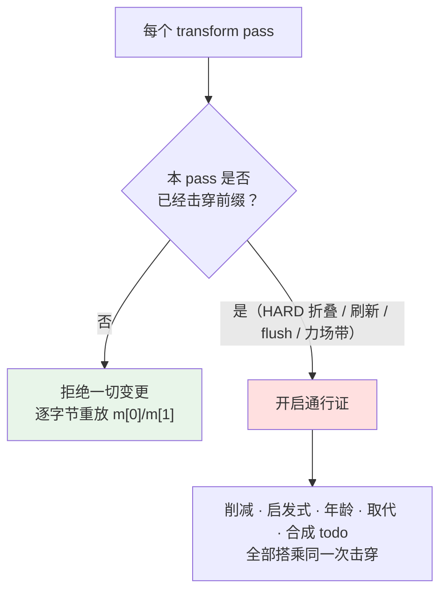

Magic Context 的全部行为都服务于一个可被形式化的目标：**让发往 LLM 提供方的消息数组前缀尽可能长时间保持字节不变**。本页阐述这一目标背后的经济学前提、公理体系与取舍哲学——即"为什么必须这样做"，而非"具体如何实现"。转换通道的阶段划分、`m[0]/m[1]` 的布局细节、变更门控的代码路径、以及内容剥离与哨兵的具体算法，分别属于 [转换通道生命周期与阶段划分](9-zhuan-huan-tong-dao-sheng-ming-zhou-qi-yu-jie-duan-hua-fen)、[m[0]/m[1] 缓存布局与物化触发条件](10-m-0-m-1-huan-cun-bu-ju-yu-wu-hua-hong-fa-tiao-jian)、[变更门控与延迟工作不变量](11-bian-geng-men-kong-yu-yan-chi-gong-zuo-bu-bian-liang)、[内容剥离、哨兵与确定性重放](12-nei-rong-bo-chi-shao-bing-yu-que-ding-xing-zhong-fang) 四页。本页只做哲学层面的收束。

Sources: [ARCHITECTURE.md](ARCHITECTURE.md#L3-L3)

## 经济前提：缓存前缀是一种稀缺资源

LLM 提供方在服务端缓存对话前缀，缓存窗口随提供方与订阅层级变化（Claude Pro 为 5 分钟，Max 为 1 小时），且已缓存 token 与未缓存 token 的计费方式不同。这一事实决定了整个系统的成本结构：**重建前缀不是"慢"，而是"贵"**。Magic Context 因此将所有变更推迟到假设缓存前缀已过期之后再执行，而 `cache_ttl` 配置项表达的是"MC 假设提供方缓存仍有效多久"——它只是 MC 自身的延迟门控，并不控制提供方的真实缓存寿命。理解这一点是理解全部设计的起点：系统优化的对象不是延迟，而是账单上的缓存重建次数。

Sources: [CONFIGURATION.md](CONFIGURATION.md#L178-L182)、[scheduler.ts](packages/plugin/src/features/magic-context/scheduler.ts#L18-L50)

正是出于同一成本模型，Magic Context 在安装时会**禁用宿主的原生 compaction**：宿主压缩会重写前缀，与 MC 的缓存感知延迟操作冲突，并导致历史被压缩两次。换言之，缓存稳定性不是 MC 的一个特性，而是它对上下文管理权的排他性主张——两套上下文管理器同时改写前缀，缓存必然被反复击穿。这一主张也解释了 `fail_closed_blocking` 默认开启的原因：当存储不可用（schema 栅栏不匹配、迁移失败）时，MC 选择大声阻断主会话，而不是静默退化为原生 compaction。

Sources: [README.md](README.md#L101-L101)、[ARCHITECTURE.md](ARCHITECTURE.md#L10-L10)、[CONFIGURATION.md](CONFIGURATION.md#L227-L227)

## 第一性原理：字节即契约

提供方的前缀缓存只在一个条件下可被复用：**当前请求的前缀与上一次被判定的前缀逐字节相同**。这意味着任何对较前位置字节的编辑，都会使其后的整个后缀失效——不只是被改动的那一条消息。这是全部设计的唯一公理，其余规则都是从它推导出的推论。系统由此把问题压缩为两个可判定的提问：**这次 pass 是否允许改动字节？若允许，哪些改动可以搭同一趟车？**

Sources: [ARCHITECTURE.md](ARCHITECTURE.md#L34-L50)、[sentinel.ts](packages/plugin/src/hooks/magic-context/sentinel.ts#L90-L109)

这一契约在实践中被复杂化了一个量级：一次用户回合（turn）包含多个 LLM 往返步骤，而转换钩子在每个步骤都会被触发一次。因此"保护前缀"不是一次性决策，而是一个**每 pass 都要重新证明的状态机**——绝大多数 pass 在稳态下什么都不改，而这正是设计意图。定义一个 pass 类别体系，就是为了让这份"每 pass 的证明"有唯一、可枚举的答案。

Sources: [ARCHITECTURE.md](ARCHITECTURE.md#L36-L38)、[README.md](README.md#L222-L225)

## 通行证模型：一次重建，全部搭乘

系统把每个 pass 归入且仅归入三类之一。这个分类学不是描述性的，而是规范性的：它规定了每一类 pass **被允许做什么**。SOFT+（defer / `cache_hit`）是稳态——什么新东西都没有，`m[0]` 与 `m[1]` 逐字节重放，整个 `system + m[0] + m[1]` 前缀保持命中；SOFT（缓存击穿）让 `m[1]` 重新渲染，而 `m[0]` 保持逐字节不变；HARD（`m[0]` 折叠）则重建整个前缀，但它之所以"免费"，是因为触发它的原因本身已经杀死了提供方缓存键。

| Pass 类别 | 触发条件 | 允许的字节改动 | 缓存后果 |
|---|---|---|---|
| **SOFT+**（defer / `cache_hit`） | 无新工作 | 无——全前缀逐字节重放 | 全前缀命中，仅尾部增长 |
| **SOFT**（cache-busting） | execute pass、`/ctx-flush`、已发布历史排空 | `m[1]` 重新渲染，`m[0]` 冻结 | 在 `m[1]` 断点处击穿 |
| **HARD**（`m[0]` fold） | `mustMaterialize` 判定 | `m[0]` 重新物化 + `m[1]` 降格为占位符 | 全前缀重建（但缓存键本已失效） |

Sources: [ARCHITECTURE.md](ARCHITECTURE.md#L47-L50)

由分类学直接推出的是**搭乘（ride）原则**：自动回收（年龄清扫、启发式清理、取代与去重、智能丢弃）永远不自己发起一次击穿，它们只能落在"因其他原因已经击穿"的 pass 上——一次折叠或重折叠、向 `m[1]` 的已发布历史刷新、`/ctx-flush`、或 ≥85% 的力场带。排队中的 `ctx_reduce` 丢弃也搭乘同一张通行证："标记一条消息"只是入队，丢弃落在下一个击穿周期。哲学表述是：**击穿是稀缺的、需要被定价的资源；已经付过费的击穿必须被用尽，而不是被节省。**

Sources: [ARCHITECTURE.md](ARCHITECTURE.md#L63-L67)、[cache-busting-signals.ts](packages/plugin/src/hooks/magic-context/cache-busting-signals.ts#L29-L43)

通行证必须唯一，这是本项目最容易被违反、也代价最高的约束。每一个变更通道——削减、`m[1]` 刷新、启发式、合成 todo、哨兵首次应用——都必须询问同一个"本 pass 是否击穿"的许可；**对某个通道生效、对另一个通道不生效的否决就是缺陷**。2026-09-07 的 ALF 分裂击穿事件正是此约束的反例：年龄清扫绕过了持有 `m[1]` 刷新的 historian 否决，于是一次阈值跨越变成了两次计费的击穿。反方向的失败同样被明确禁止：系统**不存在**"回合中期延迟"这一选项，因为 Anthropic 的增量工具循环缓存机制使得"稍后应用"严格比"首次合格即应用"更贵。

Sources: [ARCHITECTURE.md](ARCHITECTURE.md#L63-L67)、[transform-postprocess-phase.ts](packages/plugin/src/hooks/magic-context/transform-postprocess-phase.ts#L1374-L1393)、[escalation-bands.ts](packages/plugin/src/shared/escalation-bands.ts#L1-L19)

## 延迟工作：欠账，而非触发器

第二组哲学原则处理"需求"与"时机"的解耦。Historian 的发布、compaction marker 的推进、排队的丢弃，都在 `m[1]` 冻结重放期间静静累积，然后在下一个真实击穿上共同物化。**Historian 发布本身不击穿缓存**——两次击穿之间的每一个 pass 都是 `cache_hit`。这条原则把"上下文必须被压缩"的需求从"必须立刻改写线上的字节"中剥离出来，使后台维护（dreamer 的各项任务、记忆写入、分类打分）可以完全自由地写数据库，而不必担心惊扰线上前缀。

Sources: [ARCHITECTURE.md](ARCHITECTURE.md#L64-L66)、[transform-postprocess-phase.ts](packages/plugin/src/hooks/magic-context/transform-postprocess-phase.ts#L1272-L1296)

与之配套的是一条数据库层面的安全性论证：Historian 以只读方式从 `opencode.db` 读取**原始**消息；而丢弃与启发式只改动 `context.db`（`tags`/`pending_ops`）与内存中的出站 wire。Historian 的在途快照由 `computeRawRangeFingerprint` 校验，该指纹只哈希原始内容（id、part 类型、内容长度），从不包含 tag/drop 状态，因此并发的丢弃无法使其失效。两个数据库在读/写侧"互不相交"，正是这条论断让"在 historian 运行期间也照常变更"在哲学上成立——否决子句（`compartmentRunning`）因此是出于语义清晰而非数据竞争的考虑，并且必须在硬折叠面前让位。

Sources: [ARCHITECTURE.md](ARCHITECTURE.md#L69-L74)、[ARCHITECTURE.md](ARCHITECTURE.md#L56-L61)

## Provider 感知：把"不知道"当作延迟信号

前述公理在具体提供方上会分叉，系统的态度是**经验主义加保守主义**：只把经过观测证实的事实编码为"可以安全搭乘"，其余一律推迟。代码中维护着一份已观测的"变体变更不击穿缓存"的模型白名单（Anthropic Fable 5.1 观测于 2026-09-02，OpenAI GPT-6 Astra 观测于 2026-09-05）；对于这些模型，effort/budget 变化位于缓存前缀之外，制造自己的 flush 只会无谓重写本可保持不变的字节。对于家族内的旧模型（其 thinking 配置被序列化进缓存消息块），变体变更本就击穿了前缀，因此待处理工作可以直接搭乘。**未知或未分类的 提供方/模型 组合一律选择"延迟"**——因为延迟是歧义下安全的一侧，而误判的 flush 代价是每次 effort 变化都重写整个后缀。

Sources: [sentinel.ts](packages/plugin/src/hooks/magic-context/sentinel.ts#L41-L88)

对"线格式合法性"的处理体现了同一种哲学：空内容哨兵只在提供方接受空内容时才被使用，这一判断被刻意收窄到规范的 Anthropic 路径，因为只有 `@ai-sdk/anthropic` 分支会在发送前过滤空 text/reasoning part；github-copilot 等适配器会把 `{type:"text", text:""}` 当作真实内容块转发，而 Bedrock、Moonshot/Kimi 等更严格的后端会拒绝空内容。因此非规范提供方必须保留原生 part，或改用一个非空的整消息占位符 `[dropped]`。

| 提供方类别 | 空内容哨兵 | 整消息占位符 | 理由 |
|---|---|---|---|
| 规范 Anthropic（`anthropic`） | 允许 | `""`（空） | 适配器在 wire 前过滤空 part |
| 非规范 / 未知 | 禁止 | `[dropped]` | 空 part 可能存活到 wire 并破坏邻接/非空不变量 |
| Bedrock | 禁止 | `[dropped]` | 原生 `step-start` 边界与空哨兵在过滤前不等价 |

Sources: [sentinel.ts](packages/plugin/src/hooks/magic-context/sentinel.ts#L22-L39)、[sentinel.ts](packages/plugin/src/hooks/magic-context/sentinel.ts#L129-L162)

## 确定性重放：字节必须可复现

若前缀必须在 defer pass 上逐字节重放，那么每一次变更都必须是一个**纯函数**——其输出不能依赖任何随时间漂移的状态。系统用一个极端的构造来兑现这一点：所有消息类丢弃共用**唯一的**占位符 `[dropped §N§]`，它是 tagId 的纯函数，不读取任何消息内容、角色或窗口状态。代码注释直言不讳地记录了违反此原则的后果：任何从"当前已被改写的"内容重新派生字节的版本，都会在不同 pass 上派生出不同的占位符（一个 pass 是 `[dropped §N§]`，下一个是 `[truncated §N§]\n…`），从而在 defer pass 上改动尾部消息的字节并击穿其后整个前缀——这一分歧曾造成反复的缓存灾难。

Sources: [apply-operations.ts](packages/plugin/src/hooks/magic-context/apply-operations.ts#L38-L50)

配套的机制是**冻结-重放（freeze-and-replay）**：水印门控的剥离只在缓存击穿的 pass 上"检测并冻结"受影响的 id 集合，之后每个 pass 都重放这个冻结集合。同一哲学也要求幂等——`isSentinel` 必须同时识别 `""` 与 `[dropped]` 两种形状，使重放不会二次变更一个已安装的哨兵。更具张力的一条推论是"keep 不能制造字节"：当一个冻结的 `keep` 决定面对一个已不存在尾随空白的消息时，系统选择**接受一次已经计费的击穿**，而不是拼接出新的空白字节——因为一旦 MC 成为这段字节的来源，后续的捕获/重放循环就会永久地把它延续下去。这是一个清晰的价值观排序：**宁可承认一次性成本，也不可成为不稳定字节的源头。**

Sources: [trailing-blank-self-poisoning.md](docs/reports/trailing-blank-self-poisoning.md#L27-L40)、[sentinel.ts](packages/plugin/src/hooks/magic-context/sentinel.ts#L148-L162)、[ARCHITECTURE.md](ARCHITECTURE.md#L64-L65)

## 可观测性即契约：必须能说清每一次重建

一个无法被证伪的稳定性主张没有工程价值。因此系统把"每一次缓存击穿都必须被归因"提升为设计的一部分，并以规则表的形式编码进只读审计脚本。分类规则是"首个匹配的规则获胜"，其语义边界非常明确：**可归因（accounted）** 的击穿是设计允许的（硬折叠、模型变更、系统提示哈希变更、epoch 变更、压力重折叠、marker 排空、`/ctx-flush`、力场带、丢弃应用、`ctx_reduce` 落地、SOFT `m[1]` 刷新、提供方系统提示变更）；**不可归因（unaccounted）** 的击穿则是缺陷信号。脚本把每个提供方请求与 MC 在 `transform_decisions`/`scheduler_history`（以及 rust 模式的 `mc_pass_trace`）中最邻近的 pass 记录联结起来，无匹配记录者记为 `no_mc_pass_row`。

| 分类型别 | 可归因 | 含义 |
|---|---|---|
| `accounted_hard_*`（model_change / system_hash / epoch / pressure_refold / marker_drain / fold） | 是 | 一次被授权的 HARD 前缀重建 |
| `accounted_soft_m1_execute` | 是 | 规范的 execute pass 刷新 `m[1]` |
| `accounted_ctx_flush` / `accounted_force_band` | 是 | 显式 flush / 强制紧急丢弃批次 |
| `accounted_ctx_reduce` / `accounted_drop_applied` | 是 | 落地了 agent 削减或已应用的丢弃 |
| `accounted_provider_system_prompt_change` | 是 | 用户可见的提供方变更 |
| `unaccounted_defer_pass` / `unaccounted_double_bust` | 否 | defer pass 却发生了偏离，或重复了上次的偏离偏移 |
| `unaccounted_tail_rewrite` / `unaccounted_rewrite` | 否 | 无从归因的尾部/整体重写 |

Sources: [cache-bust-sentinel.ts](packages/plugin/scripts/cache-bust-sentinel.ts#L3-L34)、[cache-bust-attribution.ts](packages/plugin/scripts/cache-bust-attribution.ts#L1-L19)

这套归因纪律还内含着一种**认识论上的谦逊**。在 #386 的调查报告中，面对两个无法唯一归因的静默重建，报告的结论不是宣称已解决，而是明确写下"诚实的分类是：哨兵缺失更可能，哨兵与尾随空白之争未决"（sentinel-absence favored, sentinel-vs-trailing-blank unresolved），并说明现有日志缺乏逐消息 wire 哈希，因此无法排除另一候选缺陷。支撑这种逐案归因的是持久化的 pass 遥测：`transform_decisions` 记录每个 pass 的决策、是否物化以及一个受枚举约束的 `materialize_reason`（`system_hash`、`model_change`、`ttl_idle`、`pressure_refold` 等），并保留每会话最近 2000 行，使长会话的缓存相关 pass 不会无界增长。

Sources: [github-386-repeated-cache-busts.md](docs/reports/github-386-repeated-cache-busts.md#L37-L37)、[transform-decision-log.ts](packages/plugin/src/features/magic-context/transform-decision-log.ts#L10-L40)

## 失败哲学：宁可停下，不可静默改写

当一切都可能出错时，系统只允许两种结局，且都围绕"字节"定义。第一种是**对循环连续性 fail open**：转换包装器捕获瞬时的 SQLite 争用错误（`SQLITE_BUSY`/`SQLITE_LOCKED`），并原样返回消息数组——这使 prompt 循环总能继续，同时因为未做任何改写而**不消耗任何击穿配额**。第二种是**对存储完整性 fail closed**：当存储不可用、schema 栅栏不匹配或迁移失败时，MC 大声阻断主会话，而不是静默地让 prompt 增长越过提供方上限。这两种看似矛盾的行为共享同一条哲学：**唯一被允许的两种输出是"逐字节相同的重放"或"响亮而诚实的停止"；静默的第三种输出（悄悄改写前缀）被彻底排除。**

| 故障场景 | 处理策略 | 对缓存的影响 |
|---|---|---|
| 瞬时 SQLite 争用（BUSY/LOCKED） | fail open：原样返回消息 | 零击穿，下一个 pass 重试 |
| 存储不可用 / schema 栅栏不匹配 | fail closed：阻断主会话并报错 | 不产生未授权改写 |
| Rust 模块瞬态失败 | LKG 重放冻结的已服务表示 | 冻结字节，避免每次抖动二次击穿 |
| 上下文 ≥95% 紧急 | 紧急 tiered drop / 失败关闭兜底 | 在被授权的力场带上集中回收 |

Sources: [messages-transform.ts](packages/plugin/src/plugin/messages-transform.ts#L20-L43)、[ARCHITECTURE.md](ARCHITECTURE.md#L10-L10)、[ARCHITECTURE.md](ARCHITECTURE.md#L16-L16)

Last-Known-Good（LKG）机制是这一哲学最精细的体现。当 Rust 模块出现瞬态故障时，TS 协调层不会立即发出一份"新鲜的"渲染（那会击穿缓存），而是**冻结并重放上一份已服务的表示**，直到一次被授权的击穿 pass 采纳模块输出，或在重放无法校验、或超出健康 pass / 原始尾部上限时解冻。换言之，"降级"在缓存哲学中的定义被重写了：降级不是"退回到较差的渲染"，而是"继续提供与上一次逐字节相同的渲染"。

Sources: [ARCHITECTURE.md](ARCHITECTURE.md#L16-L16)、[ARCHITECTURE.md](ARCHITECTURE.md#L22-L22)

## 哲学与机制的映射

将本页的哲学收敛为可核对的映射表，可以直接指导对转换行为的审查：

| 哲学原则 | 承载不变量 | 主要机制落点 |
|---|---|---|
| 缓存击穿是稀缺的计费资源 | "一次 HARD 击穿 = 前缀已死，全部排空" | `rideSignals` / `hasReclaimRide` |
| 通行证必须唯一 | "每个变更通道共享同一击穿许可" | `transform-postprocess-phase.ts` 单一许可判定 |
| 需求与时机解耦 | "延迟工作搭乘下一次击穿，从不自己发起" | 已发布历史排空、marker 推进 |
| 未知即延迟 | "歧义下选择安全的一侧" | `variantChangeBustsProviderCache` 白名单 |
| 字节必须可复现 | "一个占位符，是 tagId 的纯函数" | `buildReplacementContent` / 冻结-重放 |
| 击穿必须可归因 | "每一次重建都要能被解释或标记为缺陷" | cache-bust sentinel 规则表 |
| 只允许两种结局 | "逐字节重放，或响亮停止" | 瞬态 fail open / 存储 fail closed / LKG |

Sources: [ARCHITECTURE.md](ARCHITECTURE.md#L63-L67)、[transform-postprocess-phase.ts](packages/plugin/src/hooks/magic-context/transform-postprocess-phase.ts#L1374-L1393)、[apply-operations.ts](packages/plugin/src/hooks/magic-context/apply-operations.ts#L38-L50)

理解了这套哲学之后，最自然的下一步是进入具体机制：先看 [转换通道生命周期与阶段划分](9-zhuan-huan-tong-dao-sheng-ming-zhou-qi-yu-jie-duan-hua-fen) 了解一个 pass 内部的执行阶段顺序，再读 [m[0]/m[1] 缓存布局与物化触发条件](10-m-0-m-1-huan-cun-bu-ju-yu-wu-hua-hong-fa-tiao-jian) 理解"稳定前缀"的具体形状，随后是 [变更门控与延迟工作不变量](11-bian-geng-men-kong-yu-yan-chi-gong-zuo-bu-bian-liang) 的代码路径，以及 [内容剥离、哨兵与确定性重放](12-nei-rong-bo-chi-shao-bing-yu-que-ding-xing-zhong-fang) 的实现细节。