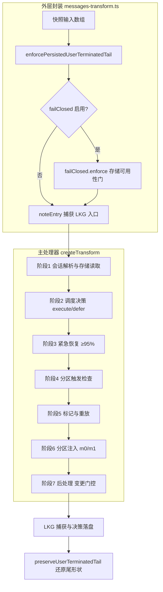

本页聚焦 Magic Context 的**转换通道（transform pass）**——即每次 LLM 往返调用时，对消息数组与系统提示进行重写的完整生命周期。目标读者是已经理解缓存稳定性哲学、希望精确掌握"一次 pass 究竟按什么顺序、在什么条件下发生什么"的高级开发者。本页只描述通道的阶段划分与生命周期边界；m[0]/m[1] 的具体布局、内容剥离的字节级细节、以及史学家分区流程分别属于相邻页面。

Sources: [ARCHITECTURE.md](ARCHITECTURE.md#L34-L92), [transform.ts](packages/plugin/src/hooks/magic-context/transform.ts#L788-L799)

## 一、转换通道的本体定义

转换通道的**唯一本体**是 `experimental.chat.messages.transform` 这个 hook 的一次调用。OpenCode 在每一次 LLM 往返（一轮对话中的每一个 step）触发它一次；它接收宿主构造好的完整 `messages` 数组，并**原地重写**该数组——不返回新数组，而是通过 `output.messages.splice(...)` 替换内容。通道内部不做任何 LLM 调用：所有重活（史学家、Dreamer、记忆抽取）都在带外的隐藏子代理中完成，通道本身只是确定性的重放与拼装。

Sources: [messages-transform.ts](packages/plugin/src/plugin/messages-transform.ts#L55-L57), [ARCHITECTURE.md](ARCHITECTURE.md#L34-L45), [transform.ts](packages/plugin/src/hooks/magic-context/transform.ts#L788-L803)

通道的生命周期由**三层嵌套**构成：最外层是防御性封装（保证提示循环永不中断），中间层是 `createTransform` 返回的主处理器（编排七个阶段），内层是若干专职阶段模块（调度决策、史学分区、后处理）。理解"阶段划分"必须同时理解这三层的边界与交接点。

Sources: [messages-transform.ts](packages/plugin/src/plugin/messages-transform.ts#L198-L219), [transform.ts](packages/plugin/src/hooks/magic-context/transform.ts#L752-L768)

## 二、外层封装的生命周期

外层封装 `createMessagesTransformHandler` 承担的是**容错与可观测性**职责，而非内容重写。它在进入主处理器前做三件事：先对 `messages` 做浅拷贝快照（仅 compaction-off 模式需要，用于失败回滚），再执行 `failClosed.enforce` 存储可用性门（在 compaction-off 模式下该门为惰性，抛出即降级为透传），最后在 LKG（Last-Known-Good）槽存在时用 `noteEntry` 捕获入口快照。

Sources: [messages-transform.ts](packages/plugin/src/plugin/messages-transform.ts#L227-L283)

退出路径是分级的，这决定了通道的**失败语义**：`FailClosedBlockingError` / `EmergencyFailClosedError` / `RawFallbackContextLimitError` / `AssistantTerminalRetryError` 属于**有意大声中断**，会被重新抛出让 TUI 呈现；`SQLITE_BUSY` / `SQLITE_LOCKED` 属瞬态争用，仅记录一行日志并返回未修改消息，下一 pass 自然重试；其余非瞬态错误（模式损坏、程序缺陷）会先尝试 **LKG 重放**上一条成功捕获的变换数组，若 LKG 不可用则把错误摘要写入 `session_meta.last_transform_error` 供侧边栏显示，并以未修改消息继续。LKG 重放在 `isEmergencyRecoveryArmed` 或 `needsEmergencyRecovery` 为真时被主动阻断，避免用旧快照掩盖一次真实的溢出。

Sources: [messages-transform.ts](packages/plugin/src/plugin/messages-transform.ts#L284-L411)

封装层的**尾形状不变量**独立于主处理器：进入时 `enforcePersistedUserTerminatedTail` 会把"已完成助手输出之后悬空的用户消息"移到数组尾部；退出时 `preserveUserTerminatedTail` 在 `finally` 中把竞争期间新落入的用户消息重新定位。这两步保证：即便主处理器抛错或返回未修改数组，宿主序列化器看到的尾部因果形状仍然自洽。

Sources: [messages-transform.ts](packages/plugin/src/plugin/messages-transform.ts#L96-L155), [messages-transform.ts](packages/plugin/src/plugin/messages-transform.ts#L414-L422)

## 三、单次 pass 的七阶段序列

进入主处理器后，通道严格按以下顺序推进。每一步都记录了 `logTransformTiming` 阶段耗时，形成可归因的性能剖面。

Sources: [ARCHITECTURE.md](ARCHITECTURE.md#L38-L46), [transform.ts](packages/plugin/src/hooks/magic-context/transform.ts#L803-L825)

| 阶段 | 职责 | 关键实现 | 失败语义 |
|------|------|----------|----------|
| 1 会话解析与存储读取 | 解析 `sessionId`、当前轮 id、活动 agent、`session_meta` | `findSessionId` / `getOrCreateSessionMeta` | 读会话状态失败 → fail-open 返回 |
| 2 调度决策 | 解析 usage，得出 `execute` 或 `defer`，并做模型切换清态 | `resolveSchedulerDecision` | 异常 → 默认 `defer` |
| 3 紧急恢复 | 若 ≥95% 或有 overflow 证据，缩放保护尾并强制启动分区 | `startRecoveryRun` / `evaluateEmergencyFailClosed` | 无法启动则记录 no-eligible-head |
| 4 分区触发检查 | 基于内存尾判断史学家是否需要 fire（零 `opencode.db` 读） | `checkCompartmentTrigger` | 异常 → 记录非致命 |
| 5 标记与重放 | 注入时间标记、打标、重放丢弃/穴居/推理/占位剥离 | `tagMessages` / `replayCavemanCompression` | 打标失败 → 清理 tagger 状态继续 |
| 6 分区注入 | 决定并渲染 m[0]/m[1]，把 `<session-history>` 注入 `message[0]` | `prepareCompartmentInjection` / `runCompartmentPhase` | 由阶段模块内部处理 |
| 7 后处理 | 变更门控下的 pending-op 排空、启发式清理、轻推、synthetic-todowrite | `runPostTransformPhase` | 阶段内捕获 |

Sources: [transform.ts](packages/plugin/src/hooks/magic-context/transform.ts#L1144-L1186), [transform-context-state.ts](packages/plugin/src/hooks/magic-context/transform-context-state.ts#L97-L123), [transform.ts](packages/plugin/src/hooks/magic-context/transform.ts#L1600-L1654), [transform.ts](packages/plugin/src/hooks/magic-context/transform.ts#L1760-L1804), [transform.ts](packages/plugin/src/hooks/magic-context/transform.ts#L1906-L1958), [transform.ts](packages/plugin/src/hooks/magic-context/transform.ts#L2295-L2402)

阶段 2 的调度决策是整个通道的**总闸门**。`shouldExecute` 在两条独立条件下返回 `execute`：上下文百分比越过有效执行阈值（默认 65%，按模型可覆盖），或空闲时长超过 `cache_ttl`（"never" sentinel 会禁用空闲启发式，`Number.POSITIVE_INFINITY`）。全新会话（百分比为 0 且 `lastResponseTime` 为 0）直接 `defer`，避免 TTL 检查在冷启动必然误触。

Sources: [scheduler.ts](packages/plugin/src/features/magic-context/scheduler.ts#L55-L122)

值得注意的是阶段 1 中**模型切换检测**要先于 usage 读取：当"上一次持久化 usage 所属模型"与"本次出站模型"不一致时，通道会清空旧的检测上限、推理水位、紧急状态与 usage 缓存，并丢弃 LKG 槽（`dropSlot(sessionId, "model-change")`），防止上一模型的压力数学泄漏进新模型。

Sources: [transform.ts](packages/plugin/src/hooks/magic-context/transform.ts#L1055-L1140)

## 四、通道分类学：SOFT+ / SOFT / HARD 三态

每一次 pass 恰好属于三态之一，三态由"哪些字节前缀被重写"定义，而非由触发原因定义。这是划分阶段语义的核心模型。

Sources: [ARCHITECTURE.md](ARCHITECTURE.md#L47-L51)

| 状态 | m[0] | m[1] | 缓存效果 | 典型触发 |
|------|------|------|----------|----------|
| **SOFT+**（defer / cache_hit） | 逐字节重放 | 逐字节重放 | `system + m[0] + m[1]` 全缓存命中 | 稳态，大多数 pass |
| **SOFT**（cache-busting） | 逐字节不变 | 重新渲染（新分区/记忆/画像增量） | `system + m[0]` 命中，在 m[1] 断点 bust | 执行 pass、`/ctx-flush`、延迟历史排空 |
| **HARD**（m[0] fold） | 重新物化（折叠 m[1] 为衰减基线，m[1] 复位占位） | 复位为占位 | 全前缀重建（但缓存键已死，故为"免费"） | `mustMaterialize` 触发 |

衰减重分级**只发生在 HARD fold**：SOFT pass 绝不重新分级，否则会改变 m[0] 字节。这一约束把"何时可以改变基线"收敛到单一状态，是阶段划分的语义锚点。

Sources: [ARCHITECTURE.md](ARCHITECTURE.md#L47-L51), [cache-busting-signals.ts](packages/plugin/src/hooks/magic-context/cache-busting-signals.ts#L13-L24)

通道是否允许在本 pass 消费延迟工作，由 `canConsumeDeferredOnThisPass` 裁决：`justAwaitedPublication` 为真（刚等到一次真实发布）直接放行；否则要求调度器给出 `execute`，或上下文百分比越过强制物化带。已发布的行是不可变的渲染输入，因此**在跑的史学家运行不构成否决**。

Sources: [cache-busting-signals.ts](packages/plugin/src/hooks/magic-context/cache-busting-signals.ts#L13-L24)

强制物化带由 `escalationBands` 派生：`forceMaterializationPercentage = max(85, threshold + 2)`，且有效阈值上限被钉在 90；绝对紧急墙恒为 95。这解释了代码与文档中反复出现的 85% / 95% 两个数字来源。

Sources: [escalation-bands.ts](packages/plugin/src/shared/escalation-bands.ts#L1-L18)

## 五、变更门控：骑行权限与 VETO 子句

阶段 7 的后处理是通道"最容易出错"的部分。所有变更行为（排空 pending op、运行启发式清理、应急工具降级、合成 todo、哨兵首应用）都要向**同一个权限**请求放行。该权限由 `hasReclaimRide` 计算，四个信号取逻辑或：`hardFold`（本 pass 真的落地了 m[0] 折叠，或首次渲染 bust）、`force`（衍生强制带的应急工具地板）、`explicitFlush`（`/ctx-flush` 或延迟物化）、`publishedHistory`（m[1] 真实刷新或历史重建）。

Sources: [cache-busting-signals.ts](packages/plugin/src/hooks/magic-context/cache-busting-signals.ts#L26-L43), [transform-postprocess-phase.ts](packages/plugin/src/hooks/magic-context/transform-postprocess-phase.ts#L1374-L1412)

门控的形态可概括为一条 BUST 子句加一条 VETO 子句。BUST 子句要求"本 pass 已经在 bust 前缀"，使变更**搭上**这一次 bust 而不是**制造**一次；关键点是 `foldExecutedThisPass` 只有在带外 fold 预执行报告 m[0] **确实物化**后才为真，一个 `mustMaterialize` 建议本身绝不打开门控。

Sources: [ARCHITECTURE.md](ARCHITECTURE.md#L52-L62), [transform-postprocess-phase.ts](packages/plugin/src/hooks/magic-context/transform-postprocess-phase.ts#L1282-L1327)

VETO 子句是 `compartmentRunning`——当史学家正在汇总尾部时阻止变更，避免改动它正在读取的字节。但该否决对硬 fold 让步：`emergencyBypassCompartmentGate` 在 `forceMaterialization` 或 `foldExecutedThisPass` 时旁路 VETO，因为前缀无论如何都会重建（"排空进已知 bust"不变量）。这段安全性由**不相交数据库模型**保证：史学家只读 `opencode.db` 的原始消息，而丢弃/启发式写 `context.db`，二者读写侧不相交。

Sources: [ARCHITECTURE.md](ARCHITECTURE.md#L52-L72), [fold-execution-gate.ts](packages/plugin/src/hooks/magic-context/fold-execution-gate.ts#L1-L3)

一条被反复强调的负载不变量是：**每个通道共享同一个 bust 权限**。一次阈值跨越若被一条通道否决、被另一条通道放行，就会变成两次计价的 bust（2026-09-07 ALF split bust 即年龄扫描绕过了史学家的 m[1] 刷新否决）。因此不存在"中途延迟"——工具循环不是扣住 execute 的理由。

Sources: [ARCHITECTURE.md](ARCHITECTURE.md#L63-L72), [transform-postprocess-phase.ts](packages/plugin/src/hooks/magic-context/transform-postprocess-phase.ts#L1389-L1412)

## 六、阶段模块的职责边界

主处理器本身不实现细节，而是把每个阶段委托给专职模块。边界如下：

- **调度与上下文状态**（`transform-context-state.ts`）：`contextUsagePassSnapshot` 冻结 pass 起点的持久化 usage（在模型切换清零**之前**捕获）；`loadContextUsage` 用 `hasUsageTokens` 标志避免每 pass 的校验 SELECT；`resolveSchedulerDecision` 是调度器与通道的薄接缝。
- **分区触发**（`compartment-trigger.ts`）：从重建的内存尾判断 fire，返回携带 `boundarySnapshot` 的决策，使触发与运行看到同一快照。
- **分区阶段**（`transform-compartment-phase.ts`）：以 `withRawSessionMessageCache` 包裹整个阶段，把原始历史读取预热到**同步前缀**内，避免在 transform 线程上触发多秒级 `opencode.db` 读。
- **后处理阶段**（`transform-postprocess-phase.ts`）：变更门控、fold 预执行、LKG 相关的 `foldExecutesThisPass` 归因、以及 m[0] 折叠后的标记推进。
- **阶段计时**（`transform-stage-logger.ts`）与**降级记录**（`pass-outcome.ts`）：后者用 `captureEligible = finalized && 无降级` 决定一次 pass 的输出能否被 LKG 捕获。

Sources: [transform-context-state.ts](packages/plugin/src/hooks/magic-context/transform-context-state.ts#L29-L95), [transform-compartment-phase.ts](packages/plugin/src/hooks/magic-context/transform-compartment-phase.ts#L97-L150), [transform-stage-logger.ts](packages/plugin/src/hooks/magic-context/transform-stage-logger.ts#L3-L12), [pass-outcome.ts](packages/plugin/src/hooks/magic-context/pass-outcome.ts#L17-L38)

阶段 7 结束后，通道还有一段**收尾段**（仍在主处理器内）：`passOutcome.markFinalized()` 封闭降级记录；若 `captureEligible` 则 `captureLkgSlot` 捕获成功快照并把持久化写入 `setImmediate` 延后到 pass 尾部之外；若 `bustedThisPass` 则 `recordPendingTransformDecision` 落盘决策指纹（前后 system hash、m[0] 工具集/模型键等），供后续归因。

Sources: [transform.ts](packages/plugin/src/hooks/magic-context/transform.ts#L2402-L2410), [transform.ts](packages/plugin/src/hooks/magic-context/transform.ts#L2527-L2584)

## 七、多宿主复用与 Rust 通道

阶段划分并非 OpenCode 独有，而是 Multi-host 共享的**语义骨架**，但实现路径不同：

| 宿主 / 通道 | 编排入口 | 与 TS 阶段的关系 |
|-------------|----------|------------------|
| OpenCode v1 | `hook.ts` → `createTransform` → `experimental.chat.messages.transform` | 权威实现，七阶段 |
| OpenCode v2 | `v2/hooks/context.ts` → `createTransform`（同一核心） | 复用同一编排，只替换宿主接缝 |
| Pi / OMP | `packages/pi-plugin/src/context-handler.ts` | 平行实现，镜像同一阶段序列 |
| Rust / subc | `transform_mode: "rust"` 分支 → `rustModeTransform.run` | 授权适配器，绕过全部 TS 变更 |

Sources: [hook.ts](packages/plugin/src/hooks/magic-context/hook.ts#L1179-L1612), [v2/hooks/context.ts](packages/plugin/src/v2/hooks/context.ts#L291-L589), [context-handler.ts](packages/pi-plugin/src/context-handler.ts#L1-L31), [transform.ts](packages/plugin/src/hooks/magic-context/transform.ts#L921-L941)

v2 通道通过 `TransformDeps` 的**宿主接缝**（`hostRawMessages` / `hostProtectedTailBoundary` / `hostModelFallback` / `hostRefuse`）注入 v2 的存储与取消实现，使同一 `createTransform` 能在 v1 与 v2 之间复用。省略这些回调即保留 OpenCode 1 的默认行为，这是阶段骨架可移植性的关键设计。

Sources: [transform.ts](packages/plugin/src/hooks/magic-context/transform.ts#L529-L540), [transform.ts](packages/plugin/src/hooks/magic-context/transform.ts#L737-L752)

Pi 的通道在注释中明确声明"镜像 OpenCode 的完整管线"：包装 `AgentMessage[]`、打标、排空 pending 丢弃、准备 m[0]/m[1]、重放剥离、运行史学家触发与轻推、最后经 `appendCompaction()` 排空延迟的压缩标记——与 OpenCode 七阶段一一对应，仅宿主机制不同。Pi 同样保持 m[0]/m[1] 的字节稳定性纪律。

Sources: [context-handler.ts](packages/pi-plugin/src/context-handler.ts#L8-L31)

Rust 模式下，通道在阶段 3 之后**提前分叉**：`deps.transformMode === "rust"` 时，除压缩模式对账与提交检测外，全部渲染委托给 `rustModeTransform.run`，随后运行宿主拥有的嵌入触发并返回——不再走阶段 5~7 的 TS 变更门控。这意味着 Rust 通道拥有独立的生命周期，但其调度、usage 与分区触发输入仍由 TS 侧准备并同步。

Sources: [transform.ts](packages/plugin/src/hooks/magic-context/transform.ts#L924-L941), [ARCHITECTURE.md](ARCHITECTURE.md#L34-L36)

值得注意的是**压缩关闭模式**（`compactionOff`）会重塑阶段语义：调度器恒返回 `defer`（阶段 2 关闸），史学家、丢弃、剥离、轻推、紧急与标记写入全部关闭，打标阶段完全不执行（不写 tag 行、不注入 `§N§`）。但 m[0]/m[1] 注入门被重新表达为 `身份存在 && (fullFeatureMode || compactionOff)`，因此该模式仍交付记忆/文档表面。

Sources: [transform.ts](packages/plugin/src/hooks/magic-context/transform.ts#L1436-L1449), [transform.ts](packages/plugin/src/hooks/magic-context/transform.ts#L1915-L1923)

## 结语与下一步阅读

转换通道的生命周期可概括为：**外层封装负责容错与 LKG，主处理器按七阶段顺序编排，阶段模块各自封装职责，三态分类学界定每次 pass 允许改写哪些前缀字节，变更门控用单一 bust 权限约束所有变更搭车**。掌握这套划分后，下一步应深入缓存布局本身——m[0]/m[1] 如何累积分层、哪些条件真正触发 HARD fold——请继续阅读 [m[0]/m[1] 缓存布局与物化触发条件](10-m-0-m-1-huan-cun-bu-ju-yu-wu-hua-hong-fa-tiao-jian)。

如需理解门控为何如此设计（延迟工作如何在多条通道间共享一次 bust 机会），请阅读 [变更门控与延迟工作不变量](11-bian-geng-men-kong-yu-yan-chi-gong-zuo-bu-bian-liang)；若关注剥离动作如何做到可重放的字节确定性，请阅读 [内容剥离、哨兵与确定性重放](12-nei-rong-bo-chi-shao-bing-yu-que-ding-xing-zhong-fang)。